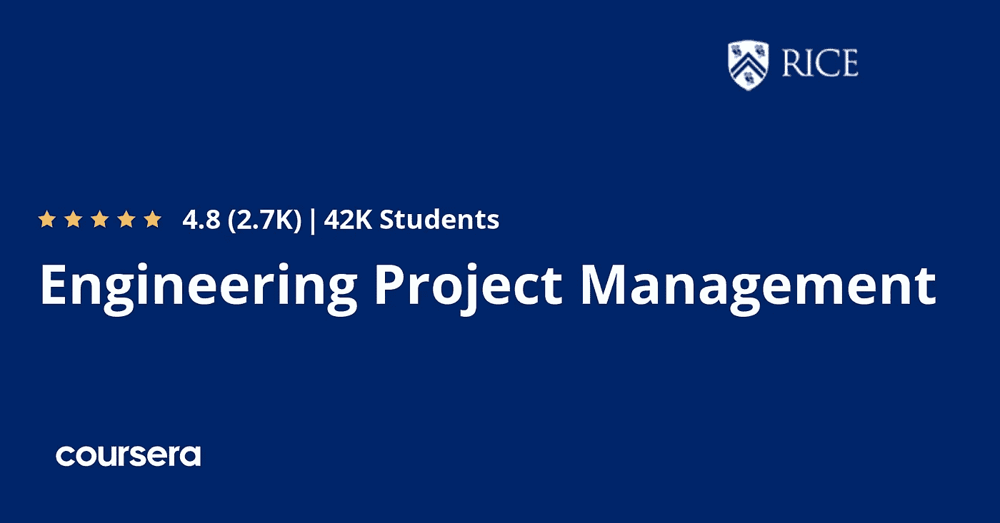
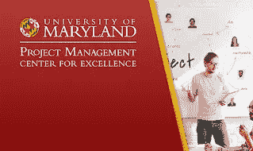
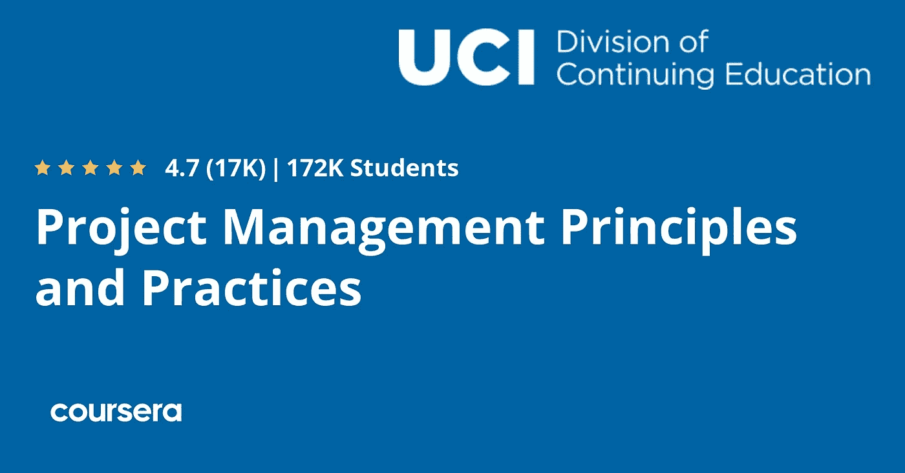
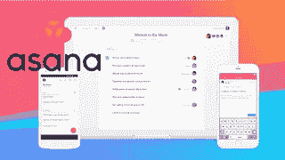

# 2023 年在线学习的 10 门最佳项目管理课程

> 原文：<https://medium.com/javarevisited/10-best-project-management-courses-to-learn-online-f3e15802fe86?source=collection_archive---------0----------------------->

## 对于任何想在 2023 年成为项目经理的人来说，这些是最好的项目管理在线培训课程、课程和教程。

大家好，如果你想在 2023 年成为一名项目经理，或者只是想学习项目管理，并寻找在线课程和书籍等最佳资源，那么你来对地方了。早些时候，我已经分享了 [**最佳 PMP 课程**](/javarevisited/5-best-pmp-certification-courses-and-practice-tests-to-become-a-project-management-professional-in-8c0e7c574995?source=---------11----------------------------) ，在这篇文章中，我将为初学者和有经验的人分享学习项目管理的最佳课程。

这些课程是从像 [Udemy](/javarevisited/10-best-python-3-courses-on-udemy-ddd4e3ec5dbf) 、 [Coursera](/javarevisited/top-15-free-coursera-courses-and-certifications-for-it-professionals-384207d56f45) 、 [Pluralsight](/javarevisited/top-10-pluralsight-courses-to-learn-programming-and-software-development-during-covid-19-stay-at-30b7d8a4f88f) 和 [edX](/javarevisited/10-free-best-edx-certifications-and-courses-to-learn-online-3473d466f968) 这样的热门在线学习网站上策划的，受到成千上万学习者的信任。你也可以加入他们，成为你一直想成为的项目管理专家。该列表包括初级和中级项目管理课程。

你在城市中看到的每一个成功的项目，比如生产要素和汽车，或者你家里的小东西，比如电脑或冰箱，都是项目，它们都需要一个项目经理来关注所有阶段的每个细节，直到项目完成，我们从中了解到，简单的项目管理就是从头到尾把事情做好。

你可以通过参加网上课程来学习项目管理，教你一些如何正确完成工作的技巧和诀窍，也许可以节省你的时间，以及监控项目进度的正确方法。统计数据显示，拥有项目管理专业证书的人比没有证书的人多挣 20%。

这篇文章将和你一起回顾一些我在网上找到的最好的课程，这些课程教你所有你需要知道的与项目管理相关的知识，并让你在短时间内有效地完成工作。

# 2023 年学习项目管理的 10 门最佳课程

在不浪费你更多时间的情况下，这里有一个 2023 年你可以加入学习项目管理的最佳在线课程列表。你不需要参加所有这些课程，你可以只参加其中的几门课程，从零开始学习项目管理，然后参加几门高级课程，以真正掌握项目管理。

## 1.[项目管理课程](/javarevisited/10-best-python-3-courses-on-udemy-ddd4e3ec5dbf)

这是初学者学习项目管理的最全面、最好的课程之一，从项目管理术语的定义、如何启动项目以及项目的各个阶段(如启动和计划阶段，如成本、时间、期望值)开始，最后是执行阶段，并使用 excel 管理项目。

以下是加入本课程的链接— [项目管理课程](/javarevisited/10-best-python-3-courses-on-udemy-ddd4e3ec5dbf)

## 2. [PMP 备考研讨会](https://click.linksynergy.com/deeplink?id=CuIbQrBnhiw&mid=39197&murl=https%3A%2F%2Fwww.udemy.com%2Fcourse%2Fpmp-pmbok6-35-pdus%2F)【Udemy 课程】

本 Udemy 课程将为您准备项目专业管理 PMP，这是一个项目管理学习的国际认证，因此本课程期望您对项目管理有一些了解，并帮助您提高您在该领域的技能，如管理项目范围和成本等。

以下是参加本课程的链接— [PMP 考试准备研讨会](https://click.linksynergy.com/deeplink?id=CuIbQrBnhiw&mid=39197&murl=https%3A%2F%2Fwww.udemy.com%2Fcourse%2Fpmp-pmbok6-35-pdus%2F)

## 3.[项目管理基础](https://click.linksynergy.com/deeplink?id=CuIbQrBnhiw&mid=39197&murl=https%3A%2F%2Fwww.udemy.com%2Fcourse%2Fproject-management-training-fundamentals-crash-course%2F)

另一个适合初学者的很好的课程，首先向您展示项目管理的一些概念，然后转向集成管理，如何在您的项目中执行这些概念，以及范围管理、成本管理、人力资源(HR)和风险管理等等。

以下是加入本课程的链接— [项目管理基础](https://click.linksynergy.com/deeplink?id=CuIbQrBnhiw&mid=39197&murl=https%3A%2F%2Fwww.udemy.com%2Fcourse%2Fproject-management-training-fundamentals-crash-course%2F)

## 4.[工程项目管理](https://coursera.pxf.io/c/3294490/1164545/14726?u=https%3A%2F%2Fwww.coursera.org%2Fspecializations%2Fengineering-project-management)【最佳课程】

如果你正在寻找最好的 Coursera 课程或专业来学习项目管理，那么莱斯大学的工程项目管理专业是最好的资源。

您将学习如何管理和启动一个成功的项目，首先学习启动项目和组织团队所需的工具，然后学习如何创建项目范围声明和管理项目的成本和时间，最后管理和制定风险策略、质量计划等等。

**这里是加入本课程**——[工程项目管理](https://coursera.pxf.io/c/3294490/1164545/14726?u=https%3A%2F%2Fwww.coursera.org%2Fspecializations%2Fengineering-project-management)的链接

顺便说一下，除了单独加入这些课程和专业，你还可以加入 [**Coursera Plus**](https://coursera.pxf.io/c/3294490/1164545/14726?u=https%3A%2F%2Fwww.coursera.org%2Fcourseraplus) ，这是 Coursera 的一个订阅计划，让你可以无限制地访问他们最受欢迎的课程、专业、专业证书和指导项目。

<https://coursera.pxf.io/c/3294490/1164545/14726?u=https%3A%2F%2Fwww.coursera.org%2Fcourseraplus>  

## 5.[软件工程师项目管理](https://pluralsight.pxf.io/c/1193463/424552/7490?u=https%3A%2F%2Fwww.pluralsight.com%2Fcourses%2Fsoftware-engineer-project-management)【plural sight 最佳课程】

对于希望学习项目管理的软件工程师来说，本课程非常适合您，因为您将了解项目管理和项目规划的基础知识，如制定项目计划，还将了解项目控制以及项目执行等。

以下是加入本课程的链接— [软件工程师项目管理](https://pluralsight.pxf.io/c/1193463/424552/7490?u=https%3A%2F%2Fwww.pluralsight.com%2Fcourses%2Fsoftware-engineer-project-management)

顺便说一下，你需要一个 [Pluralsight 会员](https://pluralsight.pxf.io/c/1193463/424552/7490?u=https%3A%2F%2Fwww.pluralsight.com%2Fpricing%2Ffree-trial)才能加入这个课程，费用大约是每月 29 美元或每年 299 美元(14%的折扣)。

我向所有技术专业人士强烈推荐这一订阅，因为它提供了超过 7000 个在线课程的即时访问，以学习任何技术技能。或者，你也可以使用他们的 [**10 天免费通行证**](https://pluralsight.pxf.io/c/1193463/424552/7490?u=https%3A%2F%2Fwww.pluralsight.com%2Fpricing%2Ffree-trial) 免费观看这个课程。

<https://pluralsight.pxf.io/c/1193463/424552/7490?u=https%3A%2F%2Fwww.pluralsight.com%2Fpricing%2Ffree-trial>  

## 6.[项目管理](https://www.awin1.com/cread.php?awinmid=6798&awinaffid=631878&platform=dl&ued=https%3A%2F%2Fwww.edx.org%2Fmicromasters%2Fritx-project-management)【edX 最佳课程】

由罗切斯特理工学院开发的 MicroMaster 计划，旨在通过学习项目管理的生命周期和使用一些工具来执行项目，以及为您的团队创建一个有组织的环境和制作国际项目等，成为一名成功的项目经理。

以下是参加本课程的链接— [项目管理](https://www.awin1.com/cread.php?awinmid=6798&awinaffid=631878&platform=dl&ued=https%3A%2F%2Fwww.edx.org%2Fmicromasters%2Fritx-project-management)

## 7.[面向初学者的真实项目管理](https://click.linksynergy.com/deeplink?id=CuIbQrBnhiw&mid=39197&murl=https%3A%2F%2Fwww.udemy.com%2Fcourse%2Fproject-management-detailed-training-for-beginners-by-amirkhan%2F)【Udemy】

一个小型的初学者课程教你如何管理项目，从一些定义开始，如运营和项目与 PMO 部门之间的区别以及项目管理的好处，最后学习和应用项目管理的五个阶段。

以下是加入本课程的链接— [初学者真实项目管理](https://click.linksynergy.com/deeplink?id=CuIbQrBnhiw&mid=39197&murl=https%3A%2F%2Fwww.udemy.com%2Fcourse%2Fproject-management-detailed-training-for-beginners-by-amirkhan%2F)

## 8.[项目管理原理与实践](https://coursera.pxf.io/c/3294490/1164545/14726?u=https%3A%2F%2Fwww.coursera.org%2Fspecializations%2Fproject-management)【Coursera 课程】

这是 2023 年另一个受欢迎的 Coursera 专业化学习项目管理流程、工具、原则和实践。这个程序是由加州大学欧文分校为初学者设计的。

这个 Coursera 专业化课程将首先教你项目经理的关键角色和职责，然后选择正确的预算和时间，以及管理项目风险，最后以一个顶点项目结束课程。

**这是参加本课程**——[项目管理原则与实践](https://coursera.pxf.io/c/3294490/1164545/14726?u=https%3A%2F%2Fwww.coursera.org%2Fspecializations%2Fproject-management)的链接

## 9.[初学者项目管理基础](https://click.linksynergy.com/deeplink?id=CuIbQrBnhiw&mid=39197&murl=https%3A%2F%2Fwww.udemy.com%2Fcourse%2Fbasics-of-project-management-for-beginners%2F)

一小时视频内容的小课程，向您展示项目管理的基本知识，并与您讨论每个项目的五个流程或阶段，从项目的点火开始，然后进行计划，如估计成本，再到执行和控制，最后结束项目。

以下是加入本课程的链接— [初学者项目管理基础知识](https://click.linksynergy.com/deeplink?id=CuIbQrBnhiw&mid=39197&murl=https%3A%2F%2Fwww.udemy.com%2Fcourse%2Fbasics-of-project-management-for-beginners%2F)

## 10.[阿萨纳 2023 —项目管理工具](https://click.linksynergy.com/deeplink?id=CuIbQrBnhiw&mid=39197&murl=https%3A%2F%2Fwww.udemy.com%2Fcourse%2Fasana-project-management-tool%2F)【阿萨纳最佳课程】

假设你在之前的课程中学习了项目管理，但是你需要使用一些工具来完成和组织你的项目。

有一种叫做体式的工具可以帮助你做到这一点，本课程将教你从初级到高级使用这种神奇的工具。

**以下是参加本课程** — [Asana 2023 —项目管理工具](https://click.linksynergy.com/deeplink?id=CuIbQrBnhiw&mid=39197&murl=https%3A%2F%2Fwww.udemy.com%2Fcourse%2Fasana-project-management-tool%2F)的链接

以上就是 2023 年要加入的**最佳项目管理课程。如果你想在 2023 年学习项目管理，那么你可以参加这些课程，学习项目管理工具、实践和流程，开始你的项目经理生涯。**

这份名单包括来自像 [Udemy](/javarevisited/10-best-udemy-online-courses-for-java-developers-4c9ab70cd01f) 、 [Coursera](/javarevisited/10-best-coursera-courses-for-web-development-and-web-design-9ec54ed92dd9) 、 [Pluralsight](/javarevisited/7000-free-pluralsight-courses-to-build-in-demand-tech-skills-without-leaving-your-house-40edb50a8cf2) 和 [edX](/javarevisited/10-free-best-edx-certifications-and-courses-to-learn-online-3473d466f968) 这样的网站的最好的免费和付费课程，这些课程可能会让你成为一名专业的项目经理，也为你准备 PMP 认证，如果你获得了这个认证，你就可以建立一个成功的职业生涯。

您可能喜欢的其他**编程和开发资源**文章

*   [Python 和 JavaScript——从哪个开始比较好？](https://javarevisited.blogspot.com/2019/05/python-vs-javascript-which-programming-language-beginners-should-learn.html)
*   [2023 年学习 Java 的十大课程](/javarevisited/top-5-java-online-courses-for-beginners-best-of-lot-1e1e240a758)
*   [学习 Python 的十大免费教程](https://dev.to/javinpaul/top-5-places-to-learn-python-programming-for-free-m4c)
*   [深入学习 C++的 10 门课程](https://javarevisited.blogspot.com/2020/07/top-10-courses-to-learn-c-in-depth-best.html)
*   [微软和谷歌的 10 个免费 Python 教程](/javarevisited/10-free-python-tutorials-and-courses-from-google-microsoft-and-coursera-for-beginners-96b9ad20b4e6)
*   [2023 年学习 Golang 的前 7 门课程](/javarevisited/7-online-courses-to-learn-golang-or-go-programming-languages-in-2020-f599a25cf14a)
*   [深入学习 Python 的 10 门免费在线课程](https://javarevisited.blogspot.com/2018/12/10-free-python-courses-for-programmers.html)
*   [2023 年学习 JavaScript 的十大课程](/javarevisited/10-best-online-courses-to-learn-javascript-in-2020-af5ed0801645)
*   [2023 年学习 Python 编程的前 5 本书](https://javarevisited.blogspot.com/2019/07/top-5-books-to-learn-python-in-2019.html#axzz6CF1B6UO6)
*   [初学 Python 的 5 大课程](https://javarevisited.blogspot.com/2018/03/top-5-courses-to-learn-python-in-2018.html)
*   [Python 开发者和初学者的 8 个项目](/javarevisited/8-projects-you-can-buil-to-learn-python-in-2020-251dd5350d56)
*   [学习数据科学和机器学习的 10 门课程](https://dev.to/javinpaul/10-data-science-and-machine-learning-courses-for-programmers-looking-to-switch-career-57kd)
*   [2023 年学习烧瓶的前 5 门课程](https://javarevisited.blogspot.com/2020/01/top-5-courses-to-learn-flask-for-web-development-with-python.html)
*   [程序员的 10 门 Python 课程和认证](/better-programming/top-5-courses-to-learn-python-in-2018-best-of-lot-26644a99e7ec)
*   [Python vs . Java——初学者应该学习哪种编程语言？](https://javarevisited.blogspot.com/2018/06/java-vs-python-which-programming-language-to-learn-first.html)

非常感谢您阅读这篇文章。如果你觉得这些*最佳项目管理课程*有用，那么请与你的朋友和同事分享。如果您有任何问题或反馈，请留言。

**附言** —如果你想学习项目管理并寻找免费的在线课程来启动你的项目管理之旅，那么你也可以查看 Udemy 的这个免费的 [**项目管理简介| PM101 培训课程**](https://click.linksynergy.com/deeplink?id=CuIbQrBnhiw&mid=39197&murl=https%3A%2F%2Fwww.udemy.com%2Fcourse%2Fproject-management-101-pm101%2F) 。超过 11，000 人已经参加了这个课程学习项目管理。

<https://click.linksynergy.com/deeplink?id=CuIbQrBnhiw&mid=39197&murl=https%3A%2F%2Fwww.udemy.com%2Fcourse%2Fproject-management-101-pm101%2F> 