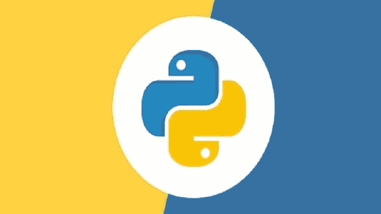
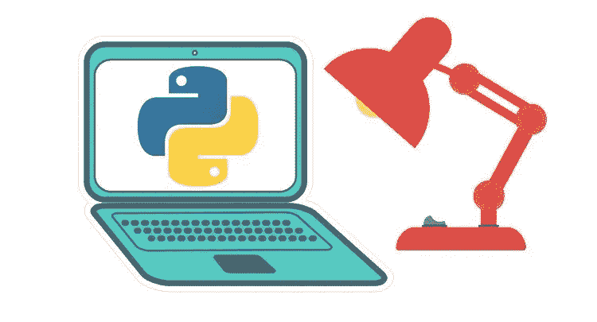
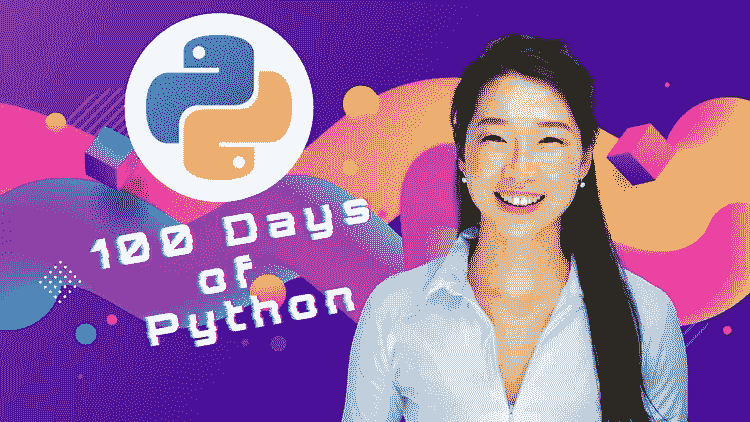
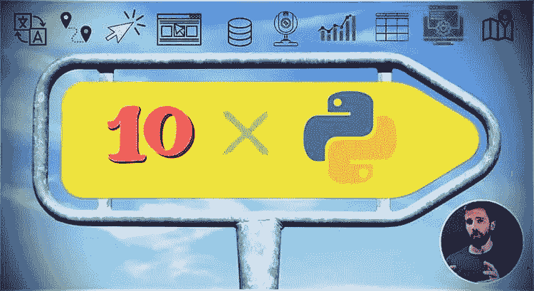
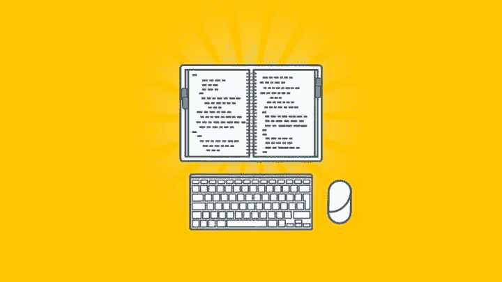
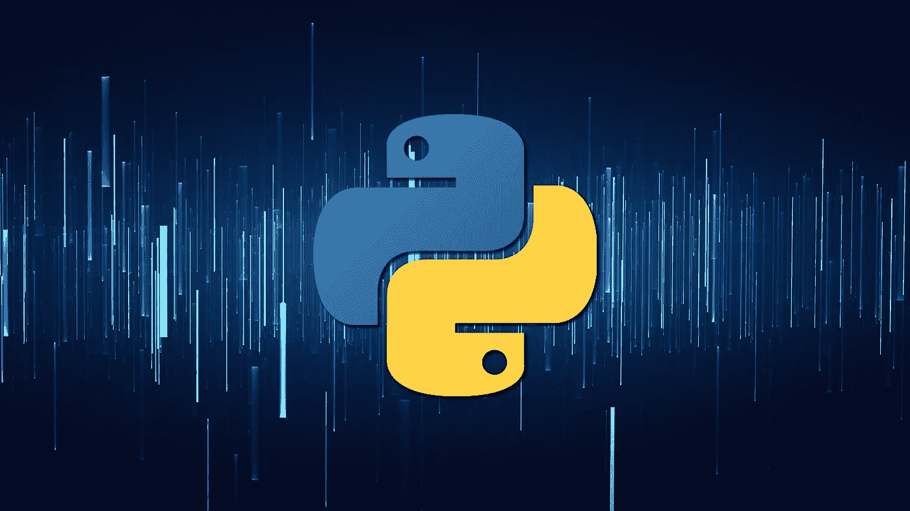
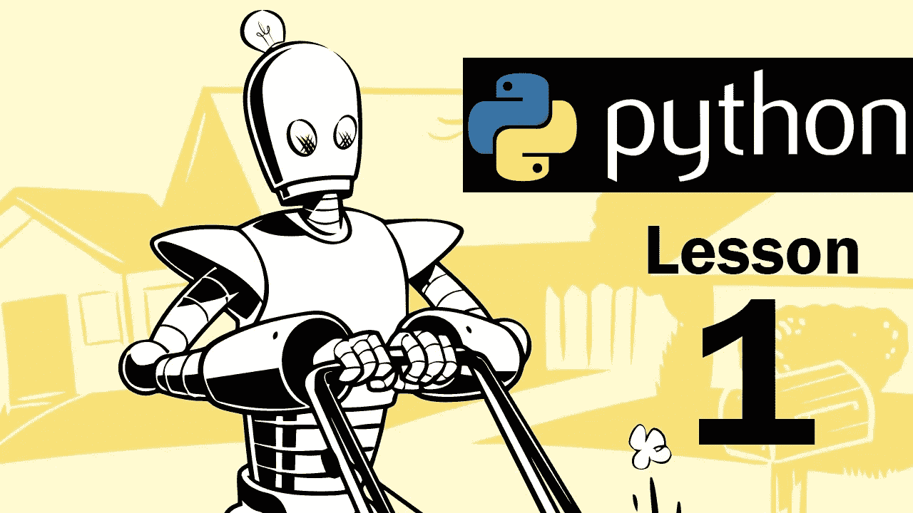

# 2023 年 Python 开发者的 10 个最佳 Udemy 课程

> 原文：<https://medium.com/javarevisited/10-best-python-3-courses-on-udemy-ddd4e3ec5dbf?source=collection_archive---------0----------------------->

## 我最喜欢的 2023 年 Udemy 在线学习 Python 的 Python 编程课程。它包含了学习使用 Python 进行 web 开发和数据科学的最佳 Udemy 课程。

大家好，如果你想在 2023 年学习 Python 编程语言，并在网上寻找学习 Python 的最佳 Udemy 课程，那么你来对地方了。

之前，我已经分享了 [**最佳 Python 3 课程**](/better-programming/top-5-courses-to-learn-python-in-2018-best-of-lot-26644a99e7ec)[最佳 Python 入门书籍](/javarevisited/my-favorite-books-to-learn-python-in-depth-77465633b46e)，以及**[**2023 年学习 Python 的最佳网站**](/javarevisited/10-free-python-tutorials-and-courses-from-google-microsoft-and-coursera-for-beginners-96b9ad20b4e6) ，无论是初学者还是有经验的 Python 开发者，但在本文中，我将在 Udemy 上分享 2023 年学习的 **10 门最佳 Python 课程。****

**这包括*动手*和*基于项目的课程*，你将在实践中学习，我的意思是你将实际使用 Python 构建项目。该列表包括 Python 开发人员的最佳 Udemy 课程，不仅可以学习 Python，还可以使用 Python 构建 web 和机器学习项目。**

**这是学习任何新技术或技能的最佳途径，包括 Python。顺便说一句，说到在线学习，Udemy 是我最想去的地方，因为它价格实惠，而且有一些高质量的课程。
参加 Udemy 上的[在线课程比 YouTube 好得多，因为课程结构非常好，有练习、测验、练习和实践学习。唯一的问题是，你需要花很多时间去寻找最好的课程，而这些课程往往隐藏在网络课程的汪洋大海中。我花了很多时间在 Udemy 上浏览课程，为我自己和我的团队，也为我的读者找到合适的课程。

这就是为什么我知道 Udemy 上的哪些课程值得你花时间，因为钱真的不是问题，因为他们的课程非常非常实惠，你不会找到任何 **$9.99** 的培训课程来学习像](/javarevisited/my-favorite-udemy-online-courses-for-programmers-and-software-engineers-f9d941dd0035) [Python](https://javarevisited.blogspot.com/2020/01/top-10-free-interactive-online-courses.html) 、[数据科学](https://javarevisited.blogspot.com/2018/03/top-5-data-science-and-machine-learning-online-courses-to-learn-online.html)、 [Web 开发](https://javarevisited.blogspot.com/2018/02/top-5-online-courses-to-learn-web-development.html)、 [DevOps](https://javarevisited.blogspot.com/2018/09/10-devops-courses-for-experienced-java-developers.html) 、 [Java](https://javarevisited.blogspot.com/2018/05/top-5-java-courses-for-beginners-to-learn-online.html) 和其他技术技能。

还有，我必须恭喜你在 2023 年选择学习 Python。Python 是最受欢迎的技能和通用编程语言之一，你可以用它来创建 web 应用程序、自动化枯燥的任务、进行 web 抓取、数据分析，甚至创建机器学习模型。Python 似乎无所不能。

我一直在分享很多有用的 Python 资源；以前我分享过 [**书籍**](https://www.java67.com/2019/08/top-5-books-to-learn-python-for-beginners.html)**[**教程**](/javarevisited/10-free-python-tutorials-and-courses-from-google-microsoft-and-coursera-for-beginners-96b9ad20b4e6)**[**免费课程**](/swlh/5-free-python-courses-for-beginners-to-learn-online-e1ca90687caf) ， [**最佳 python 认证**](https://javarevisited.blogspot.com/2020/02/10-best-coursera-courses--for-python.html) ，今天我要分享的是 Udemy 的最佳 Python 课程。******

****该列表还包括一些课程，在这些课程中，您将学习基本的 Python 框架、库和工具，如 [Django](/javarevisited/my-favorite-courses-to-learn-django-for-beginners-2020-ac172e2ab920?source=---------5------------------) 、 [Flask](/javarevisited/5-best-python-flask-courses-for-beginners-2f262f8e23da) 、 [Pandas](https://becominghuman.ai/5-best-courses-to-learn-pythons-pandas-libary-for-data-analysis-and-data-science-34b62abb0e96) 、 [Python for Data Science](/javarevisited/5-reasons-to-learn-python-for-data-science-16a9d4c44d6d) 和[Web develop en](/javarevisited/top-10-courses-to-learn-python-for-web-development-in-2020-best-of-lot-efe11fb6d212)t，这样您就可以用 Python 做任何您想做的事情。

这些都是每天学习 Python 的百万程序员信赖的**优质课程。我更加强调选择基于项目和动手操作的课程，在这些课程中，你将通过做一些事情来真正学习 Python，比如删除 web 数据以找到从芝加哥到洛杉矶的最便宜的航班等。Python 无所不能。******

# ****2023 年学习 Python 的 10 大 Udemy 课程****

****这里是学习 Python 的最佳 Udemy 课程列表，不要再浪费你的时间了。这些是从 Udemy 上的大量在线 Python 课程中精选的 Python 3 在线课程，Udemy 上有超过 10，000 门课程，用于学习 Python 编程语言以及与 Python 相关的一切。

虽然我将分享来自 [Udemy](/javarevisited/100-free-programming-and-web-development-courses-on-udemy-free-resource-center-3f8415eb5e6f) 的不止一门 Python 课程，但你不需要全部完成，其中大部分课程本身就很完整，你应该坚持你与讲师联系的课程。为此，只需观看免费课程的预览，如果你能够不前进或跳过地浏览之前的课程，那么这是一个很好的迹象，表明你既喜欢内容也喜欢教师，并且能够投入到课程中。****

## ****1.2023 年完整的 Python 训练营:在 Python 3 中从零到英雄，作者何塞·波尔蒂利亚****

****这是学习 Python 最值得推荐也是最受欢迎的 Udemy 课程。这是几个 Python 专家和朋友推荐给我的，我必须说我没有失望。这是一门训练营式的课程，侧重于实践和动手学习。****

****这门课由何塞·波尔蒂利亚教授，他是我最喜欢的 Udemy 导师之一，也是一位畅销书作家。他的教学风格简单而有力，这意味着你可以很快学会 Python，并开始自己做事情。

这是少有的既能学习 Python 2 又能学习 Python 3 的课程之一！，虽然你的首要任务应该是学习 Python，但是如果你需要维护一个用 Python 编写的、没有移植的 Python 项目，你可能需要 Python 2 的知识。

这是学习 Python 最好的 Udemy 课程之一，同样适合从未编程和从另一种编程语言如 [Java](/javarevisited/10-best-places-to-learn-java-online-for-free-ce5e713ab5b2) 、 [C++](/javarevisited/top-10-courses-to-learn-c-for-beginners-best-and-free-4afc262a544e) 、 [JavaScript](/javarevisited/my-favorite-free-tutorials-and-courses-to-learn-javascript-8f4d0a71faf2) 或 [Ruby](/javarevisited/10-best-ruby-on-rails-courses-for-beginners-dca4d66e9f7b) 编程的初学者。对于了解基础知识但希望将技能提升到更高水平的 Python 程序员来说，这也是一门很棒的课程。****

******这里是加入本课程的链接**——[2023 完整 Python 训练营:在 Python 3 中从零到英雄](https://click.linksynergy.com/deeplink?id=JVFxdTr9V80&mid=39197&murl=https%3A%2F%2Fwww.udemy.com%2Fcourse%2Fcomplete-python-bootcamp%2F)****

****

K**** 

## ****2.[代码 100 天——2023 年 Python Pro 训练营全集，作者 Angela Yu](https://click.linksynergy.com/deeplink?id=JVFxdTr9V80&mid=39197&murl=https%3A%2F%2Fwww.udemy.com%2Fcourse%2F100-days-of-code%2F)****

****如果出于某种原因，你无法理解何塞·波尔蒂利亚的教学风格，那么这是学习 Python 的一个很好的替代课程。这是一个基于实践和项目的课程，也是涵盖 Python 3 概念的最新课程，Angela Yu 是 Udemy 的另一位出色的讲师。

这个课程也是一个训练营式的 Python 课程，你将在 100 天内构建 100 个 Python 项目。你将学习建立网站、游戏、应用程序，加上抓取和数据科学，学习 Python 概念并掌握。****

****由 [**Angela Yu**](https://click.linksynergy.com/deeplink?id=CuIbQrBnhiw&mid=39197&murl=https%3A%2F%2Fwww.udemy.com%2Fuser%2F4b4368a3-b5c8-4529-aa65-2056ec31f37e%2F) 教授，这是 2023 年学习 Python 编程最全面、最新的课程之一。这是一个完整的 python 课程，包含 60 个小时的内容、667 个讲座、229 篇文章、116 个可下载资源，学习 Python 基础知识、数据科学、[数据可视化](https://www.java67.com/2018/06/data-structure-and-algorithm-interview-questions-programmers.html)、机器学习、[桌面图形应用](https://javarevisited.blogspot.com/2020/07/top-5-courses-to-learn-tkinter-and-pyqt.html)和[用于 web 开发的 Python](https://www.java67.com/2020/06/top-5-courses-to-learn-python-for-web-development.html)。****

****您将学习如何使用现代框架，如 Selenium、Beautiful Soup、Request、Flask、Pandas、NumPy、Scikit Learn、Plotly、Matplotlib、Seaborn 等等。****

******这里是加入本课程的链接** — [100 天的代码—2023 年完整的 Python Pro 训练营](https://click.linksynergy.com/deeplink?id=JVFxdTr9V80&mid=39197&murl=https%3A%2F%2Fwww.udemy.com%2Fcourse%2F100-days-of-code%2F)****

********

## ****3.[Python 大型课程:构建 10 个真实世界的应用](https://click.linksynergy.com/deeplink?id=JVFxdTr9V80&mid=39197&murl=https%3A%2F%2Fwww.udemy.com%2Fcourse%2Fthe-python-mega-course%2F)****

****这是 Udemy 上最好的基于项目的 Python 课程之一。由 Ardit Sulce 教授，本课程将通过制作令人惊叹的 Python 应用程序来教授您高级 Python 3 概念，而不仅仅是一个、两个或三个，您将在本课程中构建 10 个 Python 项目。

这些项目还涉及不同的领域，向您展示 Python 的全部功能。例如，您将创建一个 web scraper 来了解使用 Python 从 web 上收集数据有多容易，还将创建一个 portfolio 网站并将其发布到真实的服务器上来学习使用 Python 进行 web 开发。

我最喜欢的项目包括**创建一个翻译英语单词的 Python 应用**和**创建一个检测移动物体的网络摄像头应用**。这些只是一些例子，在这门课中，你会学到很多有用和令人兴奋的东西。我强烈推荐这个课程给任何喜欢构建项目和学习的人。****

******这里是加入本课程的链接**——[Python 大型课程:构建 10 个真实世界的应用](https://click.linksynergy.com/deeplink?id=JVFxdTr9V80&mid=39197&murl=https%3A%2F%2Fwww.udemy.com%2Fcourse%2Fthe-python-mega-course%2F)****

********

## ****4.[学习 Python 编程大师班](https://click.linksynergy.com/deeplink?id=JVFxdTr9V80&mid=39197&murl=https%3A%2F%2Fwww.udemy.com%2Fcourse%2Fpython-the-complete-python-developer-course%2F)****

****这是 Udemy 上另一个从零开始学习 Python 3 的最好的 Python 课程。由 Tim Buchalaka 和他的团队教授，对于没有编程和编码经验的人来说，这是一门理想的课程。****

****Python 编程大师班课程也非常全面，您会发现许多测验、练习和问题来巩固您的学习。

课程有超过 50 个小时的学习资料， [**25 个编码问题**](https://www.java67.com/2018/06/data-structure-and-algorithm-interview-questions-programmers.html) ，14 个可以下载的资源，16 篇可以学习的文章。该课程也是 Udemy 上评价很高的 Python 课程，在近 42，469 名评级程序员中平均得分为 4.5。

说到社交证明，已经有超过 184，202 名学生注册了这门课程，这也说明了这门 Python 课程有多受欢迎。****

******这里是报名参加本课程**——[学习 Python 编程大师班](https://click.linksynergy.com/deeplink?id=JVFxdTr9V80&mid=39197&murl=https%3A%2F%2Fwww.udemy.com%2Fcourse%2Fpython-the-complete-python-developer-course%2F)的链接****

********

## ****5.[完整的 Python Web 课程:构建 8 个 Python Web 应用](https://click.linksynergy.com/deeplink?id=JVFxdTr9V80&mid=39197&murl=https%3A%2F%2Fwww.udemy.com%2Fcourse%2Fthe-complete-python-web-course-learn-by-building-8-apps%2F)****

****这是何塞·萨尔瓦蒂耶拉在 Udemy 上的另一个 Python 课程，我强烈推荐给想用 Python 做 web 开发的人。****

****如标题所示，这是一门完全基于实践和项目的课程，您将[构建 8 个 Python web 应用程序](/javarevisited/8-projects-you-can-buil-to-learn-python-in-2020-251dd5350d56)并将其部署到 Heroku 中，以便您可以从互联网上访问它们。

你不仅要使用 Python 和 web 编程语言设计、开发和部署引人入胜的 web 应用程序，更重要的是，你要理解互联网是如何工作的，以及 web 应用程序是如何开发和使用的。

您还将使用 [MongoDB](/javarevisited/5-best-mongodb-courses-to-learn-nosql-for-beginners-in-2020-42df5af5496c) 数据库作为后端。这个课程还会教你 REST API，但是列表上还有一个课程是关于用 Python 学习 REST API 的更详细的内容。****

******这里是加入本课程的链接** — [完整的 Python Web 课程:构建 8 个 Python Web 应用](https://click.linksynergy.com/deeplink?id=JVFxdTr9V80&mid=39197&murl=https%3A%2F%2Fwww.udemy.com%2Fcourse%2Fthe-complete-python-web-course-learn-by-building-8-apps%2F)****

********

## ****6.[Python 圣经|用 Python 编程所需的一切](https://click.linksynergy.com/deeplink?id=JVFxdTr9V80&mid=39197&murl=https%3A%2F%2Fwww.udemy.com%2Fcourse%2Fthe-python-bible%2F)****

****这是 Udemy 上的另一个基于项目的 Python 基础课程。在这门 Python 实践课程中，您将在 2023 年使用 Python 构建 11 个有趣的项目。****

****这将教会你用 Python 编码所需要知道的一切，包括语法、逻辑、代码构造、打包以及如何运行 Python 程序。

您将学习 Python 中的[数据结构和算法](https://javarevisited.blogspot.com/2020/11/python-data-structure-algorithm-course.html)，[面向对象编程](/javarevisited/my-favorite-courses-to-learn-object-oriented-programming-and-design-in-2019-197bab351733?source=---------103------------------)，以及如何使用 Python 中的循环、函数和变量。****

****该课程非常吸引人，有趣，基于项目，非常适合 [**深入学习 Python**](https://www.java67.com/2020/05/top-5-courses-to-learn-python-in-depth.html)。如果你想成为一名 Python 专家，并且还想构建有趣的项目，那么你应该参加这个课程。****

******这是加入 Python 课程的链接**——[Python 圣经|用 Python 编程所需的一切](https://click.linksynergy.com/deeplink?id=JVFxdTr9V80&mid=39197&murl=https%3A%2F%2Fwww.udemy.com%2Fcourse%2Fthe-python-bible%2F)****

********

## ****7. [Python A-Z:具有真实练习的数据科学 Python！](https://click.linksynergy.com/deeplink?id=JVFxdTr9V80&mid=39197&murl=https%3A%2F%2Fwww.udemy.com%2Fcourse%2Fpython-coding%2F)****

****你们中的许多人可能正在学习 Python，以进入数据科学和机器学习领域，当谈到学习数据科学时，我总是去 Udemy，从[克里尔·叶列缅科](https://click.linksynergy.com/deeplink?id=CuIbQrBnhiw&mid=39197&murl=https%3A%2F%2Fwww.udemy.com%2Fuser%2Fkirilleremenko%2F)和他的 SuprDataScience 团队那里找到高级 Python 课程。

这是一门这样的课程，你将从[数据分析](https://javarevisited.blogspot.com/2020/08/top-10-coursera-certifications-to-learn-Data-Science-Visualization-and-Data-Analysis.html)和[数据科学](/javarevisited/my-favorite-data-science-and-machine-learning-courses-from-coursera-udemy-and-pluralsight-eafc73acc73f)的角度学习 Python 编程。在本课程中，您还将学习基本的数据科学技能，如统计分析、数据挖掘和可视化以及 Python。

简而言之，如果你正在为数据科学学习 Python，那么这是你的理想课程。****

******此处是加入本课程的链接—**[Python A-Z:Python For Data Science(带真实练习)！](https://click.linksynergy.com/deeplink?id=JVFxdTr9V80&mid=39197&murl=https%3A%2F%2Fwww.udemy.com%2Fcourse%2Fpython-coding%2F)****

********

## ****8.用 Flask 和 Python 休息 API****

****这又是一个牛逼的 Udemy 课程，学习 Python 用 Flask 开发 REST APIs。在本课程讲师中，何塞·萨尔瓦蒂耶拉将教你如何用 Python、 [Flask](https://javarevisited.blogspot.com/2020/01/top-5-courses-to-learn-flask-for-web-development-with-python.html) 、Flask-RESTful 和 Flask-SQLAlchemy 构建专业的 REST APIs。

如果你不知道 Flask 是一个创建 web 应用程序的流行框架，不像 [Django](/javarevisited/my-favorite-courses-to-learn-django-for-beginners-2020-ac172e2ab920) ，它是轻量级的，只提供必要的功能，其余的留给开发者。****

****这使得它非常灵活，并且有许多 Python 模块来补充 Flask。如果你想用 Python 开发一个 REST API，那么这是你的理想选择。不过，别忘了看预告片，我相信你会发现何塞·萨尔瓦蒂耶拉的风格非常迷人。****

******这里是加入本课程的链接** — [使用 Flask 和 Python 的 REST API](https://click.linksynergy.com/deeplink?id=JVFxdTr9V80&mid=39197&murl=https%3A%2F%2Fwww.udemy.com%2Fcourse%2Frest-api-flask-and-python%2F)****

********

## ****9.[用 Python 编程自动化枯燥的东西](https://click.linksynergy.com/deeplink?id=JVFxdTr9V80&mid=39197&murl=https%3A%2F%2Fwww.udemy.com%2Fcourse%2Fautomate%2F)【Udemy】****

****许多人学习 Python 来实现自动化，因为 Python 提供了一种简单的方法来编写脚本，而用其他编程语言编写脚本通常需要 100 行代码。如果你也开始学习自动化 Python，那么你可能熟悉经典的 Python 书籍， [**用 Python 自动化枯燥的东西**](https://www.amazon.com/Automate-Boring-Stuff-Python-Programming/dp/1593275994?tag=javamysqlanta-20) ，我也开始用那本书学习 Python。****

****并且，当我在 [*Udemy*](/javarevisited/15-best-udemy-courses-programmers-can-buy-on-black-friday-and-cyber-monday-2020-a803874f41d9) 上发现这个同名的 Python 自动化课程时，我惊喜万分。由 Al Sweigart 创建的这个 Python 课程将教你如何使用 Python 来提高生产力。这是一门非常适合希望实现自动化的办公人员、学者和管理人员的课程。****

****在这个 9.5 小时的课程中，您将学习如何以编程方式生成和更新 Excel 文件，抓取网站并获取信息，如您最喜欢的 Python 课程</javarevisited/8-advanced-python-programming-courses-for-intermediate-programmer-cc3bd47a4d19>*的免费 Udemy 代码，将文档解析为不同格式，甚至发送电子邮件。*****

*****超过 100 万学生加入了这个课程，它有超过 10 万个 4.7 评论，这使它成为 Udemy 上最好的 Python 课程之一。如果你想用 Python 学习自动化，我强烈推荐你这门 Python 课程。这对初学者和中级开发人员都很好。*****

**********

## *****10. [Python 和 Django 全栈 Web 开发者训练营](https://click.linksynergy.com/deeplink?id=JVFxdTr9V80&mid=39197&murl=https%3A%2F%2Fwww.udemy.com%2Fcourse%2Fpython-and-django-full-stack-web-developer-bootcamp%2F)*****

*****这是由何塞·波尔蒂利亚创建的另一个 gem 课程，他是我最喜欢的 Udemy 导师之一，也是这个列表中第一个课程的作者。在本课程中，你将学习如何用 [HTML](/javarevisited/10-best-html-and-css-courses-for-beginners-in-2021-6757eec00032) 、 [CSS](/javarevisited/10-best-css-online-courses-for-beginners-and-experienced-developers-54aa2e8c0253) 、 [Bootstrap](/javarevisited/6-best-bootstrap-online-courses-for-web-designers-and-developers-a688e192b2e2) 、 [JavaScript](/javarevisited/10-best-online-courses-to-learn-javascript-in-2020-af5ed0801645) 、jQuery、Python 3 和 [Django](/javarevisited/7-free-courses-to-learn-django-framework-in-python-bd50acc8484) 来构建网站。

如果你不知道 [Django](https://www.java67.com/2020/06/top-5-courses-to-learn-django-and-python-for-web-development.html) 是强大的 Python 框架之一，它使 web 开发变得非常简单。您可以使用 Django 快速创建一个功能齐全的网站。*****

*****这门课程非常适合任何想成为使用 Python 的全栈 web 开发人员的人，如果你的目标是成为使用 Python 的全栈开发人员，请加入这门课程。*****

*******这是加入本课程的链接** — [Python 和 Django 全栈 Web 开发者训练营](https://click.linksynergy.com/deeplink?id=JVFxdTr9V80&mid=39197&murl=https%3A%2F%2Fwww.udemy.com%2Fcourse%2Fpython-and-django-full-stack-web-developer-bootcamp%2F)*****

**********

## *****11.[2023 年完成 Python 开发者:零到精通](https://click.linksynergy.com/deeplink?id=JVFxdTr9V80&mid=39197&murl=https%3A%2F%2Fwww.udemy.com%2Fcourse%2Fcomplete-python-developer-zero-to-mastery%2F)*****

*****这是另一个在 Udemy 上学习 2023 年 Python 3 的动手、基于项目的课程。该课程由讲师 Andrei Neagoie 创建，是 Udemy 上评分最高的 Python 课程之一，强烈推荐给初学者。

在本课程中，你不仅要用 Python 和 BeautifulSoup 构建 *12+现实世界的项目*如专业作品集网站和 Web Scraper，还要用 Python 学习 [Web 开发](/javarevisited/10-best-java-full-stack-web-development-courses-to-join-in-2020-6cd6cd2e5868)、[机器学习](/javarevisited/top-10-machine-learning-and-data-science-certifications-and-training-courses-for-beginners-and-a6308497b764?source=---------43----------------------------)。

总之，学习 Python 对于 web 开发和机器学习来说是最好的课程之一。如果你学习 Python 是为了成为一名 web 开发人员，那么你应该参加这个课程。*****

*******这里是加入这个 Python 课程的链接**——[2023 年完成 Python 开发者:零到精通](https://click.linksynergy.com/deeplink?id=JVFxdTr9V80&mid=39197&murl=https%3A%2F%2Fwww.udemy.com%2Fcourse%2Fcomplete-python-developer-zero-to-mastery%2F)*****

**********

*****顺便说一句，如果你喜欢安德烈的教学风格，那么你会很高兴地知道，安德烈已经开设了自己的学院，名为 [**ZTM 学院**](https://academy.zerotomastery.io/a/aff_fvgz1fnn/external?affcode=441520_zytgk2dn) (零到精通学院)，在那里你可以获得他的所有课程(包括这门课)，每月只需[$ 39](https://academy.zerotomastery.io/a/aff_c0gnlvf7/external?affcode=441520_zytgk2dn)。*****

*****如果你打算参加多门 Andrei 的课程来学习 Python 和 Web 开发，我强烈推荐去 ZTM 学院。您还可以使用我的代码 **FRIENDS10** 获得您选择的任何套餐的 10%折扣。*****

*****<https://academy.zerotomastery.io/a/aff_c0gnlvf7/external?affcode=441520_zytgk2dn>  

以上就是 2023 年学习 Python 编程的**最佳 Udemy 课程**。这些都是高质量的课程，并且大多数都是基于项目的，在这里你将构建真实的项目来学习 Python。

由于阅读、观看和聆听是一种被动的工作，我强烈建议你*参加一个基于项目的课程* e，在那里你的思维会积极地工作，你会更好更快，Udemy 有许多 Python 课程，其中的项目非常适合初学者

你可以从这个列表中购买一到两个免费的 Python 课程</swlh/5-free-python-courses-for-beginners-to-learn-online-e1ca90687caf>**，并坚持下去，事实上，如果你理解任何概念都有困难，就反复观看它们。您还可以向讲师和其他学习该课程的 Python 程序员提问，Udemy 提供了这种便利，您应该充分利用它。

Python 也是一门很棒的学习编码的编程语言，对于当今世界的任何人来说都是一项很棒的技能。编码可以让你自动化事情，表达自己，也可以赚钱，无论是在家做自由职业者，还是在一家跨国的财富 500 强硅谷公司找一份工作。**

**像谷歌、微软、亚马逊、苹果和脸书这样的科技巨头都喜欢 Python，这些科技公司有很多 Python 开发者的工作。

其他 **Python 文章和教程**你可能喜欢:**

*   **[5 个免费学习 Python 编码的网站](https://javarevisited.blogspot.com/2019/09/5-websites-to-learn-python-for-free.html)**
*   **[2023 年可以构建的 8 个 Python 项目](/javarevisited/8-projects-you-can-buil-to-learn-python-in-2020-251dd5350d56)**
*   **[Python 和 JavaScript——从哪个开始比较好？](https://javarevisited.blogspot.com/2019/05/python-vs-javascript-which-programming-language-beginners-should-learn.html)**
*   **[深入学习 Python 的 10 门免费在线课程](https://javarevisited.blogspot.com/2018/12/10-free-python-courses-for-programmers.html)**
*   **[哈佛和 IBM 的 9 门数据科学课程](https://becominghuman.ai/9-data-science-and-machine-learning-courses-by-harvard-ibm-udemy-and-others-12a0c7c23ec1)**
*   **[面向数据科学和机器学习的 8 大 Python 库](https://javarevisited.blogspot.com/2018/10/top-8-python-libraries-for-data-science-machine-learning.html)**
*   **[Python 开发者的五大 Web 开发框架](https://javarevisited.blogspot.com/2019/04/top-5-python-web-development-frameworks.html)**
*   **[2023 年学习数据科学 Python 的前 5 本书](https://javarevisited.blogspot.com/2019/08/top-5-python-books-for-data-science-and-machine-learning.html)**
*   **[面向程序员的 10 本免费 Python 编程书籍](http://www.java67.com/2017/05/top-7-free-python-programming-books-pdf-online-download.html)**
*   **[深入学习 Python 的 10 门免费课程](https://hackernoon.com/10-free-python-programming-courses-for-beginners-to-learn-online-38312f3b9912)**
*   **[为什么 Python 是数据科学的最佳编程语言](https://javarevisited.blogspot.com/2020/05/why-python-is-best-programming-language.html)**

**感谢您阅读本文。如果你觉得 Udemy 2023 年的这些 ***最佳 Python 培训课程*** 有用，那么请与你的朋友和同事分享。如果您有任何问题或反馈，请留言。**

****p . s .**——如果你是 Python 编程新手，想更好地学习 Python，但正在寻找免费课程，那么不要担心。如果你赶时间，我建议你先从[**Python 编程入门**](http://bit.ly/2D5vvnV) 课程开始，它完全免费，你需要做的就是创建一个 Udemy 账户来注册这门课程。**

**<http://bit.ly/2D5vvnV> *******