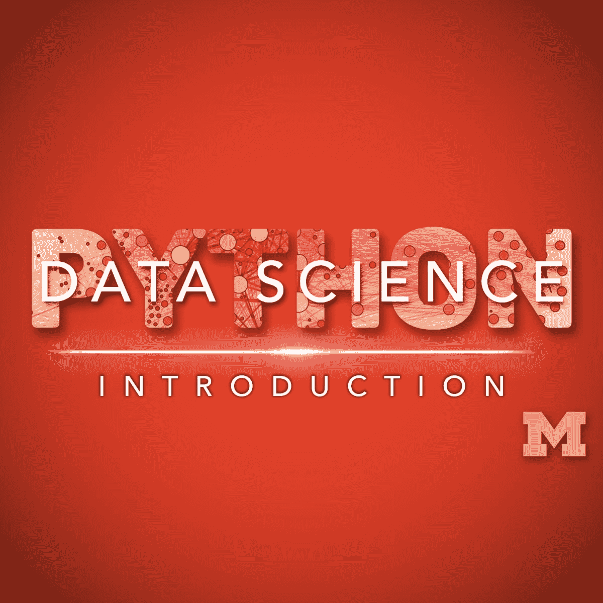
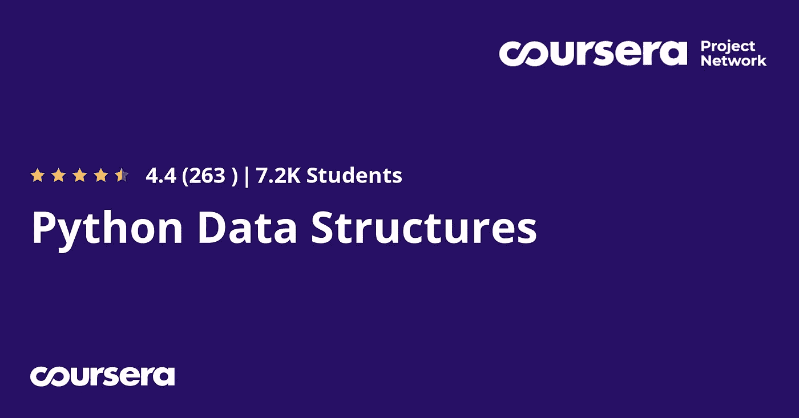
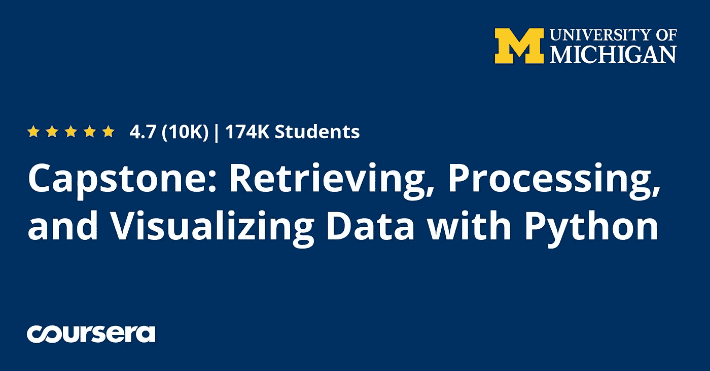
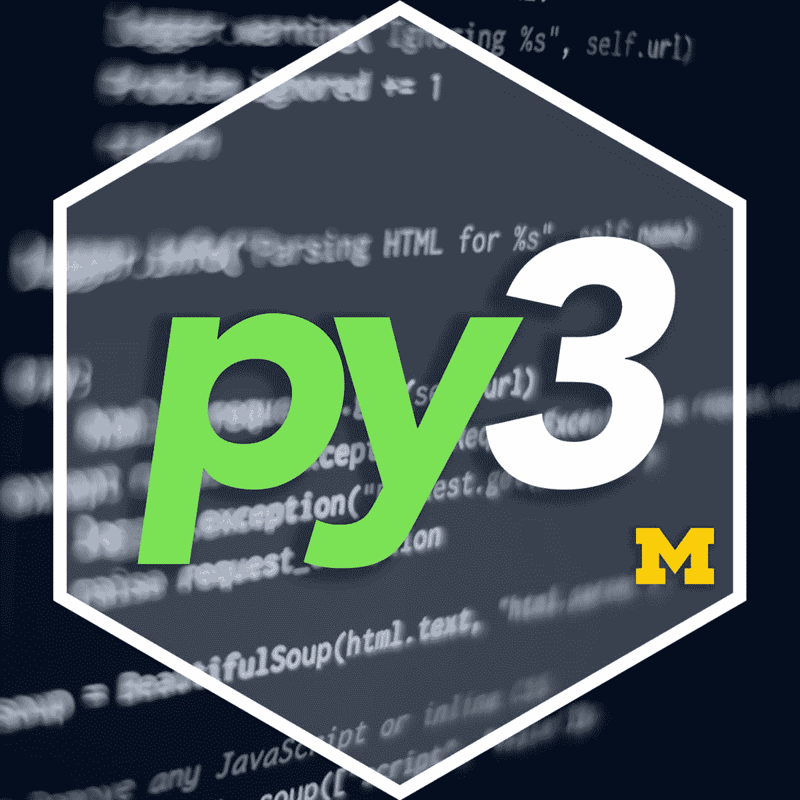
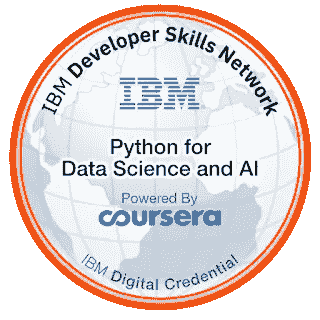
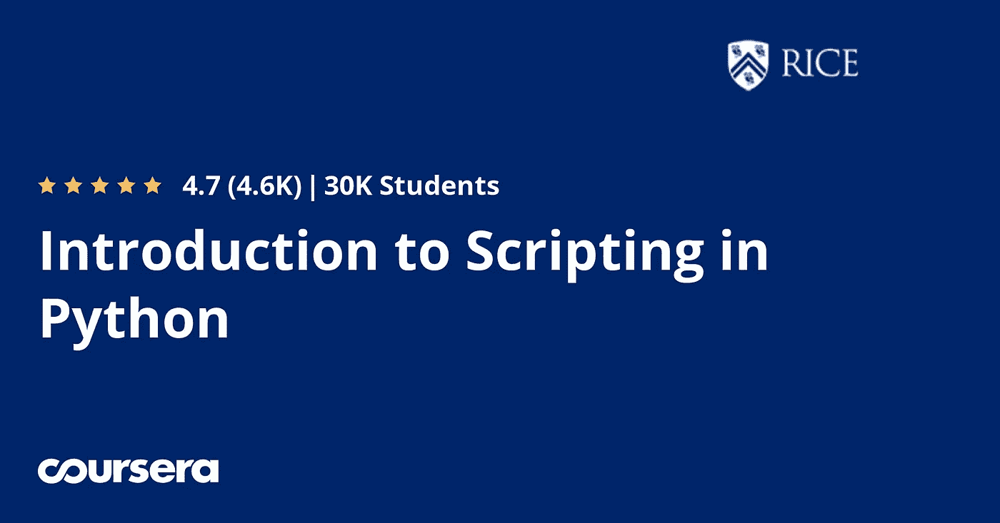

# 2023 年 Coursera 上学习编码的 11 个最佳 Python 认证和课程

> 原文：<https://medium.com/javarevisited/10-best-python-certification-courses-from-coursera-4576890eb6b3?source=collection_archive---------0----------------------->

## 这些是 Python 最好的 Coursera 课程。你可以加入这些专业，既学习 Python 又获得认证，其中大多数课程都是免费审核的。

大家好，如果你想学习 Python 并寻找最好的 Python 课程和认证，那么你来对地方了。之前我已经分享过 [**最好的初学 Python 课程**、](/better-programming/top-5-courses-to-learn-python-in-2018-best-of-lot-26644a99e7ec)、[最好的 Python 书籍](/javarevisited/my-favorite-books-to-learn-python-in-depth-77465633b46e)、[最好的 Python 项目](/javarevisited/8-projects-you-can-buil-to-learn-python-in-2020-251dd5350d56)、[最好的学习 Python 的网站](/javarevisited/10-free-python-tutorials-and-courses-from-google-microsoft-and-coursera-for-beginners-96b9ad20b4e6)，今天我要分享的是 Coursera 最好的 Python 认证。

虽然有很多学习 Python 编程的在线平台，但是 [**Coursera**](https://coursera.pxf.io/c/3294490/1164545/14726?u=https%3A%2F%2Fwww.coursera.org%2F) 是其中最著名的一个。Coursera 最大的好处是它提供了世界顶尖大学的课程，比如密歇根大学和美国前 20 名大学之一的莱斯大学。

它还获得了 IBM 和 Google 等组织以及密歇根大学等世界顶级大学颁发的最佳 Python 认证。这就是为什么许多人涌向 Coursera 学习 Python 和其他计算机科学和软件工程技能。

Coursera 的信任度也很高，这也是为什么当你把 [Coursera 认证](https://javarevisited.blogspot.com/2020/02/does-udemy-coursera-edx-educative-or.html)放在简历和 LinkedIn 上的时候，招聘人员会注意的原因。他们的课程也很深入，结构良好，这为您提供了证明这些认证的信心和知识。因为所有这些，越来越多的人选择 Coursera 作为他们的在线学习之旅。甚至许多组织都选择 Coursera 作为他们的学习伙伴，这意味着如果你的组织与 Coursera 合作，你可以免费获得许多顶级的 Coursera 认证。

虽然我之前分享了一些来自 Udemy 和其他平台的 [**最佳 Python 课程，但我一直被要求为 Python 和数据科学的最佳 Coursera 课程写一篇类似的文章，这篇文章是写给所有申请过*最佳 Coursera 课程和 Python 和计算机科学认证*的人的。

既然我们已经谈论了 Coursera，那就让我们稍微谈谈**](https://hackernoon.com/top-5-courses-to-learn-python-in-2018-best-of-lot-26644a99e7ec) **[Python](https://dev.to/javinpaul/why-every-programmer-should-learn-python-in-2019-157i) 因为如果你在这里，那么你不仅对 Coursera 感兴趣，更重要的是，对 Python 感兴趣。一句话，这是一种编程语言，可能是你在 2021 年能学到的最直接的主流编程语言。

与学习 JavaScript 侧重于 Web 开发不同，学习 Python 打开了很多大门。你不仅可以用 Django 和 [Flask](https://javarevisited.blogspot.com/2020/01/top-5-courses-to-learn-flask-for-web-development-with-python.html) 创建一个 Web 应用，还可以用不同的 Python 库做很多自动化，用 [Pandas](https://javarevisited.blogspot.com/2019/10/top-5-courses-to-learn-pandas-for-data-analysis-python.html) 、 [TensorFlow](https://dev.to/javinpaul/10-of-the-best-tensorflow-courses-to-learn-machine-learning-from-coursera-and-udemy-37bf) 、和 [PyTorch](https://www.java67.com/2020/06/top-5-courses-to-learn-pytorch-and-keras.html) 成为数据科学家和机器学习专家。**

简而言之，Python 的范围非常广，每个人都应该学习 Python。

对了，如果你喜欢 Udemy 课程那么我也推荐 Jose Portiall 的 [**完整 Python Bootcamp:从零到英雄**](http://bit.ly/2BY5LJC)Python 课程。这是地球上最受欢迎的 Python 课程。超过 1，164，741(100 多万)名学生已经加入了该课程。

 [## Python 训练营:学习 Python 编程和代码培训

### 这是 Udemy 上最全面、最直接的 Python 编程语言课程！你是否…

bit.ly](http://bit.ly/2BY5LJC) 

# 2023 年 Coursera 上的 11 个最佳 Python 课程和认证

既然我们已经接触了 Python 和 Coursera，现在是时候深入了解 Coursera 为想要学习 Python 的有抱负的程序员提供的课程和认证了。

虽然 Coursera 上有很多[很棒的 Python 课程，但我只收录了其中的精华，我的很多朋友、同事都信任这些课程，并向我推荐了这些课程。也没有必要一次完成所有这些课程；相反，如果你参加像](https://dev.to/javinpaul/7-python-online-courses-for-beginners-and-intermediate-programmers-1h4k)[**Python for Everybody Specialization**](https://coursera.pxf.io/c/3294490/1164545/14726?u=https%3A%2F%2Fwww.coursera.org%2Fspecializations%2Fpython)这样的 Coursera Specialization，你会得到更好的服务，它将相关课程与实践项目捆绑在一起，教你一项技能，而不仅仅是语法和语义。

无论如何，不要再浪费你的时间了，下面是我列出的 Python 和计算机科学的最佳 Coursera 课程:

## 1.[面向所有人的编程(Python 入门)](https://coursera.pxf.io/c/3294490/1164545/14726?u=https%3A%2F%2Fwww.coursera.org%2Flearn%2Fpython)

这是 Python 上最受欢迎和最好的 Coursera 课程之一。事实证明，已经有超过 975，145 名学生注册入学。它由密歇根大学提供，密歇根大学不仅是美国，也是世界上最重要的学术机构之一。密歇根大学的平均课程费用约为 15，000 美元，但由于 Coursera，你可以免费学习这门课程，但如果你想获得证书，那么你需要支付专业化费用，如果我没有错的话，每月费用约为 39 美元。

顾名思义，本课程旨在教大家使用 Python 进行计算机编程的基础知识。它将向您展示如何从 Python 中的一系列简单指令构建一个程序的基础，这对于绝对的初学者来说非常有用。

这门课程没有先决条件，除了最简单的数学之外，它避开了所有内容。任何有一定计算机经验的人都应该能够掌握这门课程的内容。本课程将涵盖教材《Python 面向所有人》的第 1-5 章

**这里是加入这个 Python 课程的链接**——[为大家编程](https://coursera.pxf.io/c/3294490/1164545/14726?u=https%3A%2F%2Fwww.coursera.org%2Flearn%2Fpython)

本课程涵盖 Python 3，这是 Python 最流行的版本，并为更高级的 Python 课程提供了一个良好的启动平台，如使用 Python 进行 Web 报废、访问数据库以及用 Python 进行数据分析。本课程也是[**Python for Everybody specialization**](https://coursera.pxf.io/c/3294490/1164545/14726?u=https%3A%2F%2Fwww.coursera.org%2Flearn%2Fpython)的一部分，这意味着完成本课程将计入您的认证。

 [## 面向所有人的编程(Python 入门)

### 本课程旨在教大家使用 Python 进行计算机编程的基础知识。我们涵盖了如何…

coursera.pxf.io](https://coursera.pxf.io/c/3294490/1164545/14726?u=https%3A%2F%2Fwww.coursera.org%2Flearn%2Fpython) 

## 2.[谷歌 IT 自动化与 Python 专业证书](https://coursera.pxf.io/c/3294490/1164545/14726?u=https%3A%2F%2Fwww.coursera.org%2Fprofessional-certificates%2Fgoogle-it-automation)

如果你想学习一门几乎在任何行业都使用的编程语言，我推荐你学习 python。这种编程语言用于数据科学、机器学习、人工智能。这个专业证书，[**Google IT Automation with Python**](https://coursera.pxf.io/c/3294490/1164545/14726?u=https%3A%2F%2Fwww.coursera.org%2Fprofessional-certificates%2Fgoogle-it-automation)很推荐开始学习 Python。

该专业证书将帮助您学习 python 语言以及如何使用它来自动化您的日常任务，这在某些情况下可能非常有帮助。你也会发现这种语言的力量和能力。

您将从学习 python 语言的速成课程开始，然后使用它与您的操作系统进行交互。然后您将学习如何使用 Git & Github 以及一些调试技术。最后，学习如何将 python 自动化用于云和现实世界的任务。

**这里是在 Coursera 上加入这个谷歌认证的链接—** [谷歌 IT 自动化与 Python 专业证书](https://coursera.pxf.io/c/3294490/1164545/14726?u=https%3A%2F%2Fwww.coursera.org%2Fprofessional-certificates%2Fgoogle-it-automation)

## 3. [Python 数据结构](https://coursera.pxf.io/c/3294490/1164545/14726?u=https%3A%2F%2Fwww.coursera.org%2Flearn%2Fpython-data)

良好的数据结构知识对于所有级别的程序员都是必不可少的，对于 bootcamp 开发人员和没有计算机科学学位的人来说尤其重要，但不用担心，因为本课程将介绍 [Python 编程语言的核心数据结构。](https://www.python.org/)它已经教授了超过 326，270 名学生的数据结构。

你将越过过程化编程的基础，探索我们如何使用 Python 内置的数据结构，如列表、字典和元组，来执行日益复杂的数据分析。

本课程将涵盖教材[“面向所有人的 Python”](https://www.amazon.com/Python-Everybody-Exploring-Data/dp/1530051126?tag=javamysqlanta-20)的第 6-10 章，也是面向所有人的 Python 专业化的一部分。如果你不需要证书，只是想用 Python 提高你的数据结构和算法技能，你也可以免费进入这个课程。

**这里是加入本课程** — [Python 数据结构](https://coursera.pxf.io/c/3294490/1164545/14726?u=https%3A%2F%2Fwww.coursera.org%2Flearn%2Fpython-data)的链接

## 4.[使用 Python 访问 Web 数据](https://coursera.pxf.io/c/3294490/1164545/14726?u=https%3A%2F%2Fwww.coursera.org%2Flearn%2Fpython-network-data)

这是 Python 面向所有人专业的另一门课程，也是最重要的课程之一。本课程将向你展示，你可以把互联网当作一个重要的数据来源。

您将学习如何抓取、解析和读取 web 数据，以及使用 web APIs 访问数据，并使用 Python 处理 [HTML](https://javarevisited.blogspot.com/2019/05/top-5-html-5-and-css-3-courses-for-web-developers.html) 、XML 和 JSON 数据格式。本课程将涵盖教材《Python 面向所有人》的第 11-13 章

为了从本课程中获得最大收益，您应该熟悉教材第 1-10 章中的内容以及本专业的前两门课程。

**这里是加入这个 Python 课程**——[使用 Python 访问 Web 数据](https://coursera.pxf.io/c/3294490/1164545/14726?u=https%3A%2F%2Fwww.coursera.org%2Flearn%2Fpython-network-data)的链接

超过 253，796 名学生已经从这门课程中受益，并且像其他 [Coursera 课程](/javarevisited/top-10-coursera-certificates-to-start-your-career-in-cloud-data-science-ai-mainframe-and-it-558690c83587)一样，它是**免费审核**。

## 5.[通过 Python 和 SQL 使用数据库](https://coursera.pxf.io/c/3294490/1164545/14726?u=https%3A%2F%2Fwww.coursera.org%2Flearn%2Fpython-databases)

这是 Coursera 上 Python for Everybody Specialization 的第四门课程，它将教您结构化查询语言( [SQL](https://javarevisited.blogspot.com/2018/05/top-5-sql-and-database-courses-to-learn-online.html) )的基础知识，以及作为多步数据收集、分析和处理工作的一部分存储数据的基本数据库设计。

本课程使用 SQLite3 作为其数据库，您将通过访问该数据库来构建网络爬虫以及多步数据收集和可视化流程。你还会找到 [D3.js](https://javarevisited.blogspot.com/2019/09/top-5-courses-to-learn-d3js-best.html) 库来做基本的数据可视化。

本课程将涵盖《面向所有人的 Python》一书的第 14-15 章要成功完成本课程，您应该熟悉教材第 1-13 章中的内容以及本专业的前三门课程。

已经有超过 188，647 名 Python 程序员加入了这个课程，如果不需要证书的话是免费学习的。

**以下是加入本课程的链接** — [使用 Python 和 SQL 数据库](https://coursera.pxf.io/c/3294490/1164545/14726?u=https%3A%2F%2Fwww.coursera.org%2Flearn%2Fpython-databases)

## 6.[顶点:用 Python 检索、处理和可视化数据](https://coursera.pxf.io/c/3294490/1164545/14726?u=https%3A%2F%2Fwww.coursera.org%2Flearn%2Fpython-data-visualization)

如果你还记得的话，每个 Coursera 专业都有一个实践项目，你需要完成这个项目才能获得相关证书，这个课程是[“Python for Everybody”](https://coursera.pxf.io/c/3294490/1164545/14726?u=https%3A%2F%2Fwww.coursera.org%2Fspecializations%2Fpython)专业的项目，也就是*最受欢迎的 Coursera 专业 Python* 的项目。在这个顶点项目中，您将使用 Python 构建一系列应用程序来检索、处理和可视化数据。项目将涉及专业的所有要素。

在顶石的第一部分，你将做一些可视化工作来熟悉正在使用的技术，然后进行他们自己的项目来可视化他们拥有或能够找到的一些其他数据。

超过 60，084 名 Python 开发者上过这门课，如果你正在寻找一个 Python 项目来开发动手技能，这是你应该做的项目。在完成这个项目和其他相关课程后，你还会收到一份结业证书，可以放在你的 LinkedIn 个人资料里。

**这里是加入 Coursera 项目**——[顶点:用 Python 检索、处理和可视化数据](https://coursera.pxf.io/c/3294490/1164545/14726?u=https%3A%2F%2Fwww.coursera.org%2Flearn%2Fpython-data-visualization)的链接

## 7. [Python 函数、文件和字典](https://coursera.pxf.io/c/3294490/1164545/14726?u=https%3A%2F%2Fwww.coursera.org%2Flearn%2Fpython-functions-files-dictionaries)

这是 Coursera 上另一个深入学习 Python 的很棒的课程。介绍了字典数据结构和用户自定义函数。

您还将了解局部和全局变量、可选和关键字参数传递、命名函数和 lambda 表达式、Python 的排序函数，以及如何通过传入另一个函数作为输入来控制排序的顺序。

本课程是 [**Python 3 编程专精**](https://coursera.pxf.io/c/3294490/1164545/14726?u=https%3A%2F%2Fwww.coursera.org%2Fspecializations%2Fpython-3-programming) 的一部分，是 Coursera 上的另一个顶级 Python 专精，你会在这个专精上做一个情感分析项目。

你还将从一个文件中读入模拟社交媒体数据，计算情感得分，并写出。csv 文件。它涵盖了教科书“Python 编程基础”的第 10-16 章，这是本课程的配套文本(可选和免费)。

**这里是加入 Python 3 课程**——[Python 函数、文件和字典](https://coursera.pxf.io/c/3294490/1164545/14726?u=https%3A%2F%2Fwww.coursera.org%2Flearn%2Fpython-functions-files-dictionaries)的链接

## 8. [Python 项目:pillow、tesseract 和 OpenCV](https://coursera.pxf.io/c/3294490/1164545/14726?u=https%3A%2F%2Fwww.coursera.org%2Flearn%2Fpython-project)

这是另一个 Python 项目，我觉得非常有趣和有用。这个项目是 Python 3 编程专门化的一部分，适合于投资组合。

作为这个项目的一部分，你将学习第三方 API，并被展示如何使用 Python 图像库(pillow)操作图像，如何将光学字符识别应用于图像以识别文本(tesseract 和 py-tesseract)，以及如何使用流行的 [OpenCV](https://www.java67.com/2020/07/top-5-courses-to-learn-computer-vision-opencv-python.html) 库识别图像中的人脸。

本课程结束时，你将使用 Python 3 的三个不同库创建一个真实世界的数据分析项目。

该课程最适合已经学习了 Python 3 编程专业的前四门课程的学员。已经掌握了 [Python 编程技能](/swlh/5-free-python-courses-for-beginners-to-learn-online-e1ca90687caf)但希望通过动手实践真实世界数据分析项目的学习者也可以从本课程中受益。

**这里是加入 Coursera Python 课程** — [Python 项目的链接:pillow、tesseract 和 OpenCV](https://coursera.pxf.io/c/3294490/1164545/14726?u=https%3A%2F%2Fwww.coursera.org%2Flearn%2Fpython-project)

## 9.[Python 中的数据科学简介](https://coursera.pxf.io/c/3294490/1164545/14726?u=https%3A%2F%2Fwww.coursera.org%2Flearn%2Fpython-data-analysis)

学习 Python 的一个重要原因是在数据科学领域谋职，但传统的 Python 课程不会从这个角度教你，这就是这门课程的亮点。

它是专门为使用 Python 学习数据科学而设计的，超过 310，335 名注册学生证实了这一事实。

本课程将向学习者介绍 python 编程环境的基础知识，包括基本的 python 编程技术，如 lambdas、读取和操作 CSV 文件，以及 [NumPy 库](/javarevisited/6-best-online-courses-to-learn-numpy-for-beginners-60120f611e06)。

还将介绍使用流行的 python [pandas 数据科学库](https://javarevisited.blogspot.com/2019/10/top-5-courses-to-learn-pandas-for-data-analysis-python.html)的数据操作和清理技术，并介绍作为数据分析中心数据结构的 Series 和 DataFrame 的抽象，以及如何有效使用 groupby、merge 和 pivot tables 等函数的教程。

**这里是加入本 Python 课程**—[Python 中的数据科学简介](https://coursera.pxf.io/c/3294490/1164545/14726?u=https%3A%2F%2Fwww.coursera.org%2Flearn%2Fpython-data-analysis)的链接

在本课程结束时，学生将能够获取表格数据，清理它，操作它，并运行基本的推断统计分析。本课程是 Python 专业 [**应用数据科学的一部分。**](https://coursera.pxf.io/c/3294490/1164545/14726?u=https%3A%2F%2Fwww.coursera.org%2Fspecializations%2Fapplied-data-science)

## 10.[用于数据科学和人工智能的 Python](https://coursera.pxf.io/c/3294490/1164545/14726?u=https%3A%2F%2Fwww.coursera.org%2Flearn%2Fpython-for-applied-data-science-ai)

这是另一门侧重于使用 Python 的数据科学和人工智能的课程。这是一门入门课程，将帮助您开始学习 Python 数据科学，以及一般的编程。这个适合初学者的 Python 课程将在几个小时内带你从零开始学习 Python 编程。它是由 IBM 提供的，IBM 是世界上历史最悠久、最负盛名的软件公司之一。本课程可以申请多个专业或专业证书项目。完成本课程将计入您在以下任何计划中的学习:

*   [**IBM 数据科学专业证书**](https://coursera.pxf.io/c/3294490/1164545/14726?u=https%3A%2F%2Fwww.coursera.org%2Fprofessional-certificates%2Fibm-data-science)
*   [IBM 应用人工智能专业证书](https://coursera.pxf.io/c/3294490/1164545/14726?u=https%3A%2F%2Fwww.coursera.org%2Fprofessional-certificates%2Fapplied-artifical-intelligence-ibm-watson-ai)
*   [应用数据科学专业](https://coursera.pxf.io/c/3294490/1164545/14726?u=https%3A%2F%2Fwww.coursera.org%2Fspecializations%2Fapplied-data-science)

**这是加入本课程** — [Python 用于数据科学和人工智能](https://coursera.pxf.io/c/3294490/1164545/14726?u=https%3A%2F%2Fwww.coursera.org%2Flearn%2Fpython-for-applied-data-science-ai)的链接

## 11.[Python 专门化中的脚本简介](https://coursera.pxf.io/c/3294490/1164545/14726?u=https%3A%2F%2Fwww.coursera.org%2Fspecializations%2Fintroduction-scripting-in-python)

我最初开始学习 Python 是为了编写脚本和自动化一项乏味的任务，是的，我正在读那本书。我想在 Perl 和 Python 之间做出选择，Python 显然是赢家，因为它的流行和机会。

如果你打算学习 Python 脚本，那么这是 Python 程序员最好的 Coursera 专业之一。

这个专业化也是为那些想要掌握[基本编程技能](/javarevisited/top-10-pluralsight-courses-to-learn-programming-and-software-development-during-covid-19-stay-at-30b7d8a4f88f)的初学者设计的。它包含四门课程，涵盖 Python 3 中的关键编程概念，帮助您做好使用 Python 执行日常脚本任务的准备。这些脚本知识还将为你在数据科学、软件工程或其他涉及编程的学科中的职业生涯打下坚实的基础，你还将获得一份证书，在你的简历中展示出来。

**这是加入本课程**——[Python 专业化脚本简介](https://coursera.pxf.io/c/3294490/1164545/14726?u=https%3A%2F%2Fwww.coursera.org%2Fspecializations%2Fintroduction-scripting-in-python)的链接

顺便说一句，如果你觉得 Coursera 课程和专业化很有用，那么你也应该加入 Coursera Plus 课程，这是 Coursera 的一个订阅计划，为你提供**无限制访问**他们最受欢迎的课程、专业化、专业证书和指导项目。它每年花费大约 399 美元，但是它完全物有所值，因为你可以获得无限制的证书

 [## Coursera Plus |无限制访问 7，000 多门在线课程

### 用 Coursera Plus 投资你的职业目标。无限制访问 90%以上的课程、项目…

coursera.pxf.io](https://coursera.pxf.io/c/3294490/1164545/14726?u=https%3A%2F%2Fwww.coursera.org%2Fcourseraplus) 

以上就是关于 Python**最佳 Coursera 课程和认证**的全部内容。我的课程不仅涵盖了 Python 基础知识，还包括使用 Python 访问 Web scrapping、脚本、数据库访问等等。

我还加入了一门关于 Python 数据结构的课程，以构建您的计算机科学基础，并加入了一个 Python 实践项目，您可以从中获得一些实际工作。

你可以选择自己喜欢的课程，也可以加入 Coursera Specialization，比如[**Python for Everybody Specialization**](https://coursera.pxf.io/c/3294490/1164545/14726?u=https%3A%2F%2Fwww.coursera.org%2Flearn%2Fpython)，这不仅会迫使你以结构化的方式学习，还会授予你一个证书来展示你的 Python 技能。

如果你是初学者，想学 Python 找工作或者加薪，建议你参加一个 Coursera 专精，拿个证书。很有帮助。

其他 **Python 编程书籍和课程**你可能喜欢

*   [2021 年学习 Python 的 10 个理由](https://javarevisited.blogspot.com/2018/05/10-reasons-to-learn-python-programming.html)
*   [初学 Python 的 5 大课程](https://javarevisited.blogspot.com/2018/03/top-5-courses-to-learn-python-in-2018.html)
*   【Udemy 的 10 门最佳 Python 和编码课程
*   [2021 年学习 Python 编程的前 5 本书](https://javarevisited.blogspot.com/2019/07/top-5-books-to-learn-python-in-2019.html#axzz6CF1B6UO6)
*   [面向 Python 开发者和初学者的 8 个项目](/javarevisited/8-projects-you-can-buil-to-learn-python-in-2020-251dd5350d56)
*   [学习数据科学和机器学习的 10 门课程](https://dev.to/javinpaul/10-data-science-and-machine-learning-courses-for-programmers-looking-to-switch-career-57kd)
*   [Python 和 JavaScript——从哪个开始比较好？](https://javarevisited.blogspot.com/2019/05/python-vs-javascript-which-programming-language-beginners-should-learn.html)
*   [微软和谷歌的 10 个免费 Python 教程](/javarevisited/10-free-python-tutorials-and-courses-from-google-microsoft-and-coursera-for-beginners-96b9ad20b4e6)
*   [深入学习 Python 的 10 门免费在线课程](https://javarevisited.blogspot.com/2018/12/10-free-python-courses-for-programmers.html)
*   [5 Python 中的数据科学和机器学习课程](https://javarevisited.blogspot.com/2018/03/top-5-data-science-and-machine-learning-online-courses-to-learn-online.html)
*   [面向程序员的 10 门 Python 课程和认证](/better-programming/top-5-courses-to-learn-python-in-2018-best-of-lot-26644a99e7ec)
*   [学习 Python 的十大免费教程](https://dev.to/javinpaul/top-5-places-to-learn-python-programming-for-free-m4c)
*   [学习数据科学的五大 Python 书籍](https://javarevisited.blogspot.com/2019/08/top-5-python-books-for-data-science-and-machine-learning.html)
*   [Python vs . Java——初学者应该学习哪种编程语言？](https://javarevisited.blogspot.com/2018/06/java-vs-python-which-programming-language-to-learn-first.html)
*   [面向程序员的 10 本免费 Python 编程书籍](http://www.java67.com/2017/05/top-7-free-python-programming-books-pdf-online-download.html)

感谢您阅读本文。如果你喜欢最著名的在线学习平台之一 Coursera 的这些*最好的 Python 课程、专业和认证，那么请与你的朋友和同事分享。如果您有任何问题或反馈，请留言。*

如果你正在 Udemy 寻找最好的 Python 课程，那么我强烈推荐你加入 Jose Portiall 的 [**完整 Python 训练营:在 Python 课程中从零到英雄**](http://bit.ly/2BY5LJC) 。这是地球上最受欢迎的 Python 课程。超过 1，164，741(100 多万)名学生已经加入了该课程。

 [## Python 训练营:学习 Python 编程和代码培训

### 这是 Udemy 上最全面、最直接的 Python 编程语言课程！你是否…

bit.ly](http://bit.ly/2BY5LJC)