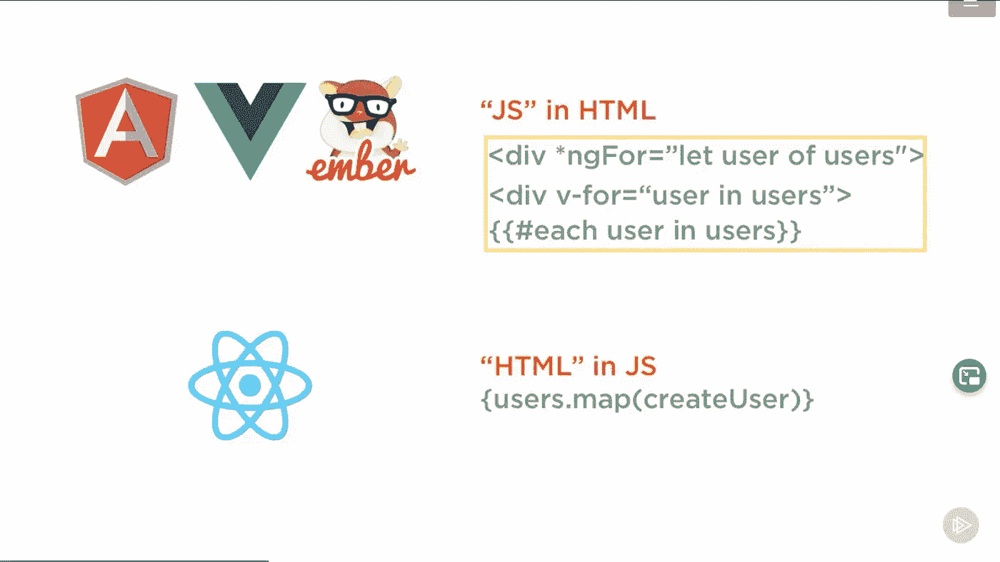
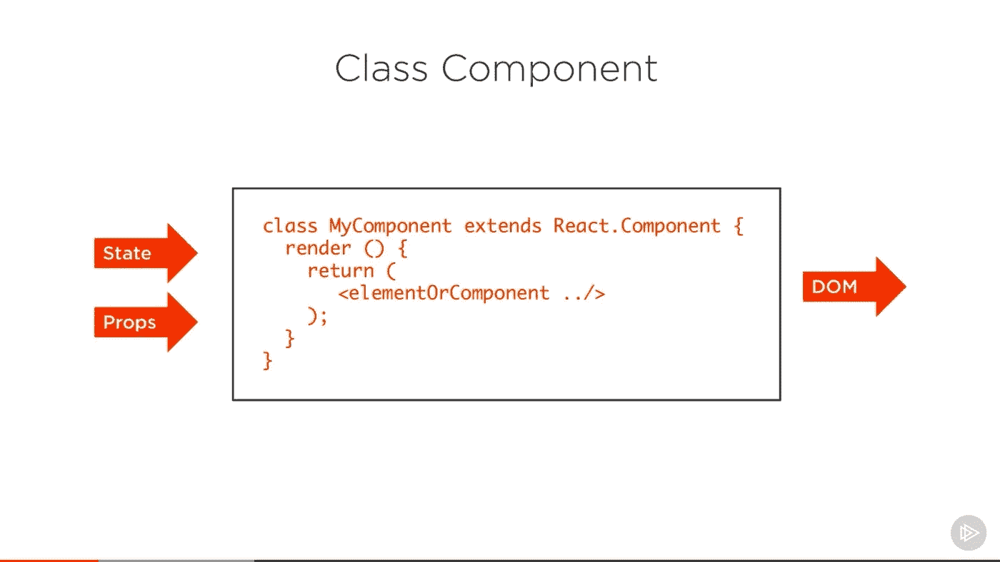
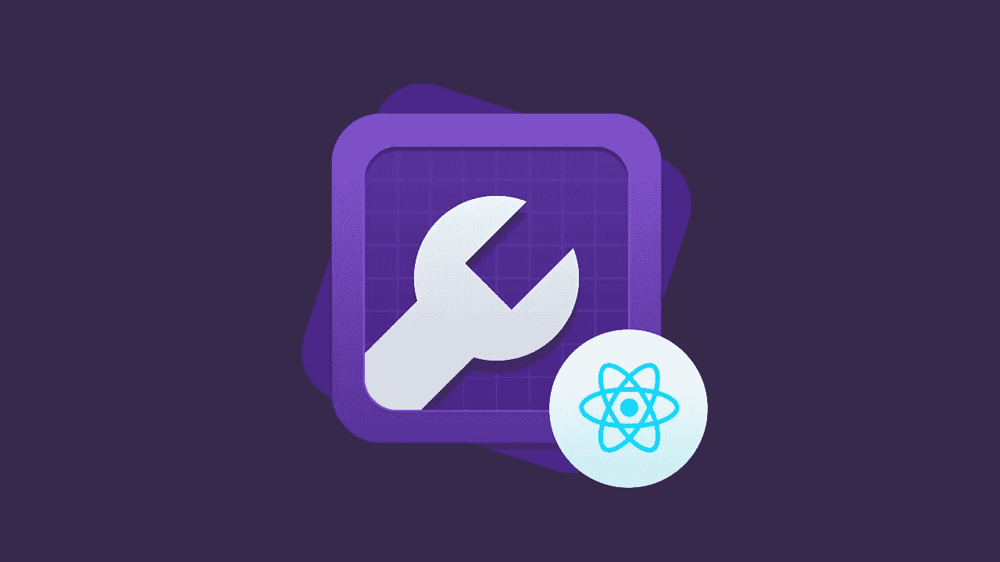
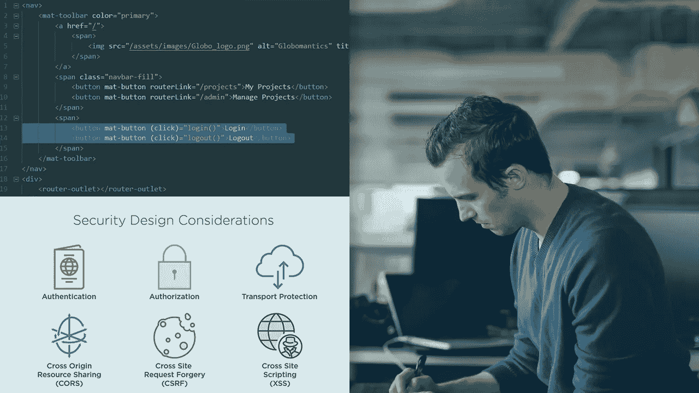
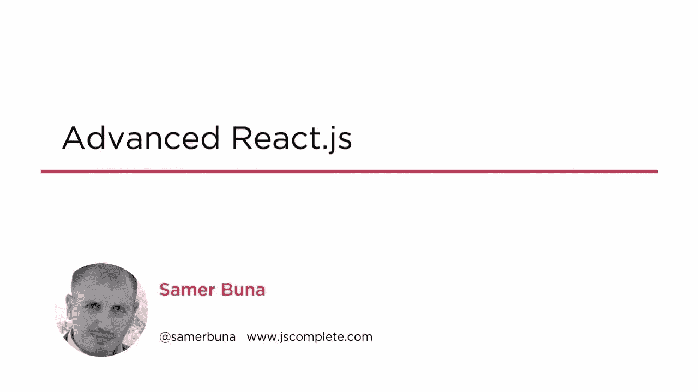

# 2023 年学习 React.js 的 10 门最佳 Pluralsight 课程

> 原文：<https://medium.com/javarevisited/10-best-react-courses-from-pluralsight-for-beginners-and-experienced-developers-80b7c640cca3?source=collection_archive---------0----------------------->

## 我最喜欢的在线学习和掌握 React.js 的 Pluralsight 课程。它包括学习 React 基础知识、语句管理、props、React 钩子和 Redux 的课程

大家好，如果你想在 2023 年学习 React.js，并在 2023 年寻找学习 React.js 的最佳资源，那么你来对地方了。早些时候，我已经分享了 [**最佳 React.js 课程**](/@javinpaul/top-5-courses-to-learn-react-js-in-2019-best-of-lot-fa02cd96cdf0) 、 [**书籍**](/javarevisited/5-best-react-js-books-for-beginners-and-experienced-web-developers-e7b90b1ab9d2?source=---------36----------------------------) 、[React 开发人员路线图](/javarevisited/the-2019-react-js-developer-roadmap-9a8e290b8a56)、[学习 React](/javarevisited/6-best-websites-to-learn-react-js-coding-for-free-ba7ec5c43433) 和 [React.js 项目的最佳地点，供初学者使用](/javarevisited/5-projects-you-can-build-to-learn-react-js-ffaaac23d4f0)，在这篇文章中，我将为初学者和有经验的 web 开发人员分享学习 React.js 的最佳 Pluralsight 课程。

毫无疑问 [React.js](https://reactjs.org/) 是最受欢迎的前端库，对拥有 React 技能的人有很大的需求。Java 开发人员正在学习如何成为全栈开发人员，JavaScript 开发人员也是如此。

React 是一个基于组件的前端库，允许我们创建可重用的 UI 组件。它允许开发人员创建可以更改数据的大型 web 应用程序，而无需重新加载页面。

React 的主要目的是成为快速、可伸缩和简单的 UI 应用程序，这也是 React 在 web 开发人员和全栈开发人员中如此受欢迎的主要原因。

这个列表包含了来自 [**Pluralsight**](https://pluralsight.pxf.io/c/1193463/424552/7490?u=https%3A%2F%2Fwww.pluralsight.com) 的最好的 React.js 课程，这是一个受欢迎的在线门户网站，拥有超过 7500 门学习技术技能的高质量课程。我特别为高级模式的初学者选择了 React 课程，这样你可以掌握 React 基础知识以及高级概念，如状态管理和使用 Redux 或 Hooks。

学完这些课程后，你对 React 有了足够的了解，可以称自己为 React 开发者了。但是，我也建议你不仅要学习这些课程，还要在你尝试构建一个项目的过程中，尝试和实践这些课程。

如果您对某个特定功能的工作原理感到好奇，或者想要进行实验，那么在您学习的过程中在您的机器上进行实验是理解这些概念的最佳方式。

顺便说一句，如果你喜欢从 Udemy 课程中学习，那么我强烈推荐你加入 Udemy 上 Maximillian Schwarzmuler 的[**React——完整指南(包括钩子、React 路由器、Redux)**](https://click.linksynergy.com/deeplink?id=CuIbQrBnhiw&mid=39197&murl=https%3A%2F%2Fwww.udemy.com%2Fcourse%2Freact-the-complete-guide-incl-redux%2F) 课程。在线学习 React 的最好和最新的课程之一，你可以在 Udemy sales 上只花 9.9 美元。

 [## React 16:完整课程(包括 React 路由器 4 和 Redux)

### 它在 20e 年 5 月被完全更新和重新录制——它教授 React 的最新版本…

udemy.com](https://click.linksynergy.com/deeplink?id=CuIbQrBnhiw&mid=39197&murl=https%3A%2F%2Fwww.udemy.com%2Fcourse%2Freact-the-complete-guide-incl-redux%2F) 

# 从初学者到高级 Web 开发人员的 10 个最佳 React.js 课程

在不浪费你更多时间的情况下，这里有一个最好的 Pluralsight 课程列表，可以在线学习 React.js。通过学习这些课程，你实际上可以在一个周末学习 React.js 课程，如果你已经熟悉 React，那么你可以选择其中之一来学习高级 React 概念，如 React 路由器、 [Redux](https://javarevisited.blogspot.com/2018/08/top-5-react-js-and-redux-courses-to-learn-online.html#axzz5r06B3egD) 、 [Hooks](/javarevisited/top-10-free-courses-to-learn-react-js-c14edbd3b35f?source=extreme_sidebar---------0-2----------------------) 和 Flux。

该列表包含从初学者到有经验的开发人员的课程。它甚至包含一个基于项目的课程，在这个课程中，您将学习如何使用 React.js 构建一个问答游戏

## 1.[反应:大局](https://pluralsight.pxf.io/c/1193463/424552/7490?u=https%3A%2F%2Fwww.pluralsight.com%2Fcourses%2Freact-big-picture)

这是 Pluralsight 上的入门级别 React.js 课程，如果您从未在 React 中做过任何事情，并且希望了解它的工作原理以及如何开始，您应该参加该课程。顾名思义，本课程提供了 React.js 的 1000 英尺概述。

本课程由[科里·豪斯](https://pluralsight.pxf.io/c/1193463/424552/7490?u=https%3A%2F%2Fwww.pluralsight.com%2Fauthors%2Fcory-house) e 创建，他是 Pluralsight 上最好的 React.js 讲师之一，可以用来探索为什么 React 值得考虑，需要考虑的权衡，以及 React 可能适合或不适合你的原因。

**这里是加入本课程的链接** — [反应:大图](https://pluralsight.pxf.io/c/1193463/424552/7490?u=https%3A%2F%2Fwww.pluralsight.com%2Fcourses%2Freact-big-picture)

## 2.[反应:入门](https://pluralsight.pxf.io/c/1193463/424552/7490?u=https%3A%2F%2Fwww.pluralsight.com%2Fcourses%2Freact-js-getting-started)

这是 Pluralsight 上最适合初学者的 React.js 课程。由[萨梅尔·布纳](https://pluralsight.pxf.io/c/1193463/424552/7490?u=https%3A%2F%2Fwww.pluralsight.com%2Fauthors%2Fsamer-buna)创建，这个课程将让你开始运行并使用 React.js 创建东西

您将学习 React 方法，使用带有 [React 挂钩](/javarevisited/top-10-free-courses-to-learn-react-js-c14edbd3b35f)的类和函数组件构建丰富的交互式 ui，并用它构建一个儿童游戏。

如果你是 React.js 的完全初学者，我强烈推荐这个 Pluralsight 课程，在 2023 年学习 React。

**以下是加入本课程的链接** — [反应:开始](https://pluralsight.pxf.io/c/1193463/424552/7490?u=https%3A%2F%2Fwww.pluralsight.com%2Fcourses%2Freact-js-getting-started)

## 3.[反应基础](https://pluralsight.pxf.io/c/1193463/424552/7490?u=https%3A%2F%2Fwww.pluralsight.com%2Fcourses%2Freact-fundamentals-update)

这是 Pluralsight 上最好的 React.js 课程之一，特别是对于想要深入学习 React.js 的中级开发人员。创造了利亚姆·麦克伦南这门课程开始深入反应。

您将了解关键的 React 概念，例如:

*   成分
*   JSX
*   事件
*   形式
*   状态

如果你只上这里列出的一门课，那就上这门课吧，详细地[学习 React.js](https://javarevisited.blogspot.com/2019/04/10-free-angular-and-react-courses-for.html) 是有好处的。

**这是加入本课程的链接**——[反应基础](https://pluralsight.pxf.io/c/1193463/424552/7490?u=https%3A%2F%2Fwww.pluralsight.com%2Fcourses%2Freact-fundamentals-update)

## 4.[使用 React 钩子](https://pluralsight.pxf.io/c/1193463/424552/7490?u=https%3A%2F%2Fwww.pluralsight.com%2Fcourses%2Fusing-react-hooks)

完成 Pluralsight 的 fundamentals React.js 课程后，您应该为学习像 hooks 这样的高级新概念打下了良好的基础。 [React 钩子](https://www.java67.com/2021/11/top-6-courses-to-learn-react-hooks.html)带来状态和生命周期事件以对功能组件做出反应。这也有助于简化以前复杂的代码。由 Peter Kellner 创建的这个 *Pluralsight React.js 课程*有助于学习使用 React 挂钩的技术，包括 [Redux](https://javarevisited.blogspot.com/2018/08/top-5-react-js-and-redux-courses-to-learn-online.html#axzz5r06B3egD) 与 React 上下文类似的状态管理。

**这里是加入本课程的链接** — [使用 React 挂钩](https://pluralsight.pxf.io/c/1193463/424552/7490?u=https%3A%2F%2Fwww.pluralsight.com%2Fcourses%2Fusing-react-hooks)

## 5.项目:用 React 建立一个测验组件

你知道建立一个项目是学习 React.js 的最好方法吗？但是，这也是最难做到的事情之一，不再是了。Pluralsight 提供指导项目，您可以与讲师一起构建项目，这是一门基于项目的课程。Jon Friskics 创建的

，在这个项目中，你将按照我们的说明，用 [React 16.x](/@javinpaul/top-5-courses-to-learn-react-js-in-2019-best-of-lot-fa02cd96cdf0) 构建一个简单的测验组件。您将跨不同的文件创建几个组件，将数据作为道具传递，并在组件链中上下传播事件。这将使你能够应用到目前为止所学的任何东西。

**这是加入本课程** — [项目的链接:用 React](https://pluralsight.pxf.io/c/1193463/424552/7490?u=https%3A%2F%2Fwww.pluralsight.com%2Fprojects%2Fbuild-a-quiz-component-with-react) 构建一个测验组件

## 6.[用 React 和 Flux 创建应用](https://pluralsight.pxf.io/c/1193463/424552/7490?u=https%3A%2F%2Fwww.pluralsight.com%2Fcourses%2Freact-flux-building-applications)

这是 Pluralsight 上的另一个顶级 React.js 课程，非常适合中级 React 开发者。本课程由 React expert 和我最喜欢的 Pluralsight 讲师之一 Cory House 创建，

本中级和[高级 React.js 课程](/javarevisited/top-10-free-courses-to-learn-react-js-c14edbd3b35f?source=extreme_main_feed----d3a191ac6ed-----5-1--------------------561c2dc6_a2b4_41e0_b7be_1d97edbf631c--8)将通过构建一个管理 Pluralsight 课程数据的数据驱动应用程序，教你如何使用 React、React Router 和 Flux。

本课程使用现代客户端开发栈，包括 create-react-app、Node、Webpack、Babel 和 [Bootstrap](/javarevisited/7-free-courses-to-learn-bootstrap-for-web-designers-and-developers-5135215648f1) 。

**这是加入本课程的链接**——[用 React 和 Flux 创建应用](https://pluralsight.pxf.io/c/1193463/424552/7490?u=https%3A%2F%2Fwww.pluralsight.com%2Fcourses%2Freact-flux-building-applications)

## 7.[用 React 和 Redux 创建应用](https://pluralsight.pxf.io/c/1193463/424552/7490?u=https%3A%2F%2Fwww.pluralsight.com%2Fcourses%2Freact-redux-react-router-es6)

这是另一个中级和高级水平的 React.js 课程，非常适合有经验的程序员和希望深入学习 React.js 的人。

这个课程也是由 Cory House 创建的，Cory House 是 Pluralsight 上很受欢迎的 React 讲师。这个在线课程将教你如何使用 React、Redux、React 路由器和现代 JavaScript ( [ES6](/javarevisited/12-free-courses-to-learn-javascript-and-es6-for-beginners-and-experienced-developers-aa35874c9a32) )用 React 构建一个应用。

您还将学习如何使用 Webpack、Babel、Jest、React 测试库、Enzyme 等来构建自定义 React 开发环境，并从头开始构建流程。简而言之，另一个很棒的关于深入学习 React 的课程

**这是加入本课程的链接**——[用 React 和 Redux 创建应用](https://pluralsight.pxf.io/c/1193463/424552/7490?u=https%3A%2F%2Fwww.pluralsight.com%2Fcourses%2Freact-redux-react-router-es6)

## 8.[造型反应组件](https://pluralsight.pxf.io/c/1193463/424552/7490?u=https%3A%2F%2Fwww.pluralsight.com%2Fcourses%2Freact-styling-components)

如果您想知道如何设计 React.js 组件的样式，这是深入学习它们的一个很好的课程。由 Jake Trent 创建的这个 [Pluralsight react.js 课程](https://javarevisited.blogspot.com/2020/08/top-10-pluralsight-courses-to-learn-React.js.html)提供了流行选项的一个很好的概述，因此你可以选择一个对你的项目很有效的方法。

您还将发现许多流行的 React 组件样式化方法，并通过在每个组件中实现一个小的样式化项目来使用它们。

完成本课程后，您将具备使用 [CSS](https://javarevisited.blogspot.com/2020/09/top-5-css-cascading-style-sheet-courses-for-beginners.html) 或 [Bootstrap](https://javarevisited.blogspot.com/2020/07/top-5-courses-to-learn-bootstrap-in.html) 设计 React 组件的必要技能和知识。

**以下是加入本课程的链接—** [造型反应组件](https://pluralsight.pxf.io/c/1193463/424552/7490?u=https%3A%2F%2Fwww.pluralsight.com%2Fcourses%2Freact-styling-components)

## 9.[使用 Auth0 保护应用](https://pluralsight.pxf.io/c/1193463/424552/7490?u=https%3A%2F%2Fwww.pluralsight.com%2Fcourses%2Freact-auth0-authentication-security)

对于任何 web 项目来说，认证是另一件必须做的事情，通过本课程，您将能够轻松地将 React 应用程序连接到 Auth0。由 Cory House 创建的

本课程将教你如何在 React 应用中处理授权和认证。使用现代安全协议实现登录、注册和安全 API 调用，包括 [OAuth 2.0](/javarevisited/top-10-courses-to-learn-spring-security-and-oauth2-with-spring-boot-for-java-developers-8f0222d6066d?source=---------5-----------------------) 、OpenID Connect 和 JWT 令牌。

**以下是参加本课程的链接—** [使用 Auth0 保护应用](https://pluralsight.pxf.io/c/1193463/424552/7490?u=https%3A%2F%2Fwww.pluralsight.com%2Fcourses%2Freact-auth0-authentication-security)

## 10. [Advanced React.js](https://pluralsight.pxf.io/c/1193463/424552/7490?u=https%3A%2F%2Fwww.pluralsight.com%2Fcourses%2Freactjs-advanced)

这是 Pluralsight 上的另一个高级 React.js 课程。由 REact:入门课程的讲师萨梅尔·布纳创建，这门 Pluralsight 课程深入研究了 React.js 的[全栈 JavaScript](/javarevisited/top-10-online-courses-to-become-a-fullstack-web-developer-in-2020-d608a6b63232) ，并学习了上下文 API、HOCs、外部状态、性能优化、异步 API、测试、部署等高级概念。

**这里是加入本课程的链接—** [Advanced React.js](https://pluralsight.pxf.io/c/1193463/424552/7490?u=https%3A%2F%2Fwww.pluralsight.com%2Fcourses%2Freactjs-advanced)

顺便说一句，你需要一个 Pluralsight 会员才能进入这些课程，费用大约是每月 29 美元或每年 299 美元(14%的折扣)。

如果你还没有 [Pluralsight 会员资格](https://pluralsight.pxf.io/c/1193463/424552/7490?u=https%3A%2F%2Fwww.pluralsight.com%2Flearn)，我鼓励你去办一个，因为它可以让你访问他们 7000 多门关于所有最新主题的在线课程，比如前端和后端开发、机器学习等。它还包括交互式测验、练习和最新的认证材料。他们还有 10 天的免费试用期，你可以用它来试用第一批课程。

 [## Pluralsight |个人免费试用

### 刚刚通过#思科 DEVASC 200-901 考试！考试很难，但这是一次很棒的经历。我很高兴能成为……

pluralsight.pxf.io](https://pluralsight.pxf.io/c/1193463/424552/7490?u=https%3A%2F%2Fwww.pluralsight.com%2Fpricing%2Ffree-trial) 

以上就是 Pluralsight 上的 **best React.js 课程。一旦你完成了这些，你就学会了构建一些重要的应用程序。因此，这些因素的组合将使您处于开始开发 React 应用程序的正确位置。你不会成为专家，但你将能够开发应用程序。在你可能喜欢的课程

其他 **React 和 Web 开发课程**中，你已经开发了不少**

*   [2023 年 React JS 开发者路线图](https://hackernoon.com/the-2018-react-js-roadmap-4d0a43814c02)
*   [React 开发人员的 7 门最佳 Next.js 课程](/javarevisited/7-best-online-courses-to-learn-next-js-for-react-developers-ced862a3864)
*   [5 为初学者反应本地项目想法](https://javarevisited.blogspot.com/2021/05/5-projects-you-can-do-to-learn-react-native.html#axzz6vs8zuM8M)
*   [2023 年学习 Web 开发的五大课程](/better-programming/my-5-favorite-courses-to-learn-web-development-in-2019-a5e74167f8b2)
*   [面向 Web 开发人员的十大 JavaScript 教程和课程](https://javarevisited.blogspot.com/2018/06/top-10-courses-to-learn-javascript-in.html)
*   [2023 年学习 React Native 的 5 门课程](/javarevisited/top-5-react-native-courses-for-mobile-application-developers-b82febdf8a46?source=---------112------------------)
*   [Web 开发人员学习 TypeScript 的五大课程](https://javarevisited.blogspot.com/2018/07/top-5-courses-to-learn-typescript.html)
*   [学习 Angular 和 React.js 的 10 门免费课程](/javarevisited/10-free-angular-and-react-js-courses-from-udemy-and-coursera-best-of-lot-e67f7d811e6b?source=---------44----------------------------)
*   [2023 年最值得学习的 5 本书 react . js](https://www.java67.com/2020/03/top-5-books-to-learn-reactjs-for-beginners.html)
*   [学习 Java 和 Web 开发的十大 Pluralsight 课程](https://javarevisited.blogspot.com/2017/12/top-10-pluralsight-courses-java-and-web-developers.html)

感谢您阅读本文。如果您发现这些来自 Pluralsight 的 React.js 课程很有用，请与您的朋友和同事分享，他们会很感激的。

另外，如果你喜欢 Udemy 的课程，我还建议你去看看 Udemy 网站上 Maximillian Schwarzmuler 的[**React——完全指南(包括钩子、React 路由器、Redux)**](https://click.linksynergy.com/deeplink?id=CuIbQrBnhiw&mid=39197&murl=https%3A%2F%2Fwww.udemy.com%2Fcourse%2Freact-the-complete-guide-incl-redux%2F) 课程。这个长达 48 小时的课程是在线学习 React 的最佳和最新课程之一，您只需在 Udemy sales 上支付 9.9 美元。

 [## React 16:完整课程(包括 React 路由器 4 和 Redux)

### 它在 2023 年 5 月被完全更新和重新录制——它教授 React 的最新版本…

udemy.com](https://click.linksynergy.com/deeplink?id=CuIbQrBnhiw&mid=39197&murl=https%3A%2F%2Fwww.udemy.com%2Fcourse%2Freact-the-complete-guide-incl-redux%2F)