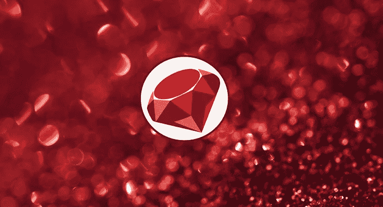
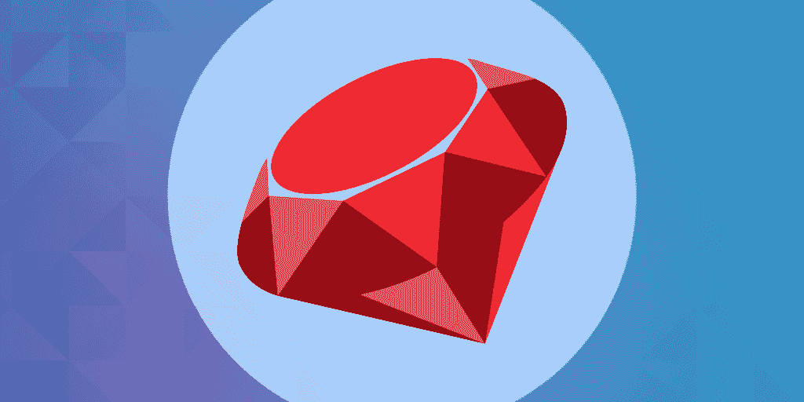
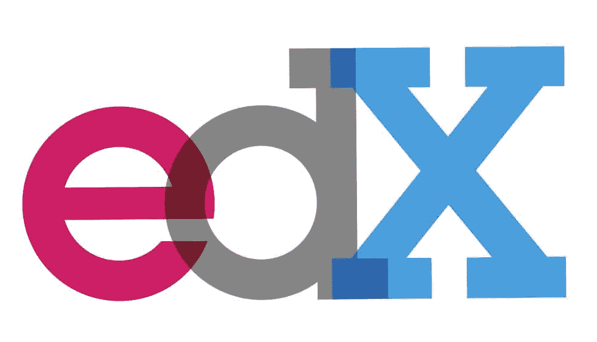
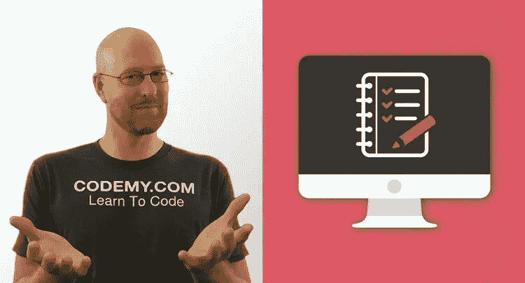
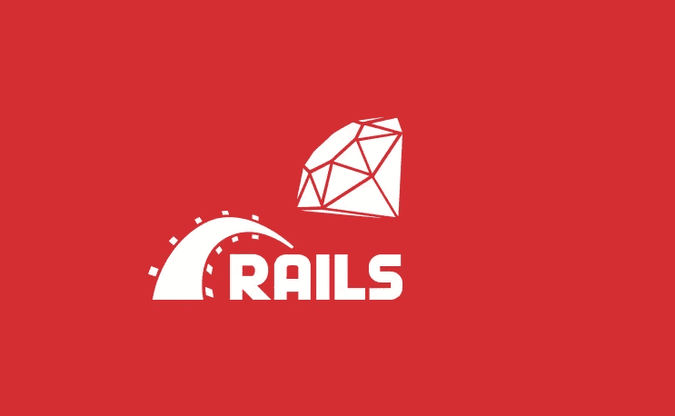
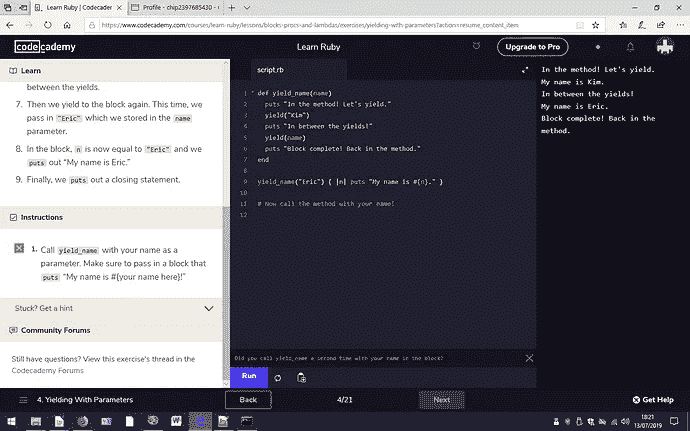
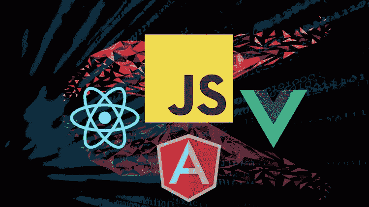

# 2023 年初学 Web 开发的 10 门最佳 Ruby 和 Rails 课程

> 原文：<https://medium.com/javarevisited/10-best-ruby-on-rails-courses-for-beginners-dca4d66e9f7b?source=collection_archive---------0----------------------->

## 我最喜欢的在线课程是从 Udemy、Coursera、edX 和 Educative 学习 Ruby 编程语言以及 2023 年 Ruby on Rails 开发框架。

image_credit —教育性

大家好，如果你想学习 Ruby 编程语言或 Ruby on Rails，一个 2023 年领先的 web 开发框架，并寻找最好的在线课程，那么你来对地方了。

前面我已经分享过 [**最好的 Python Web 开发课程**](/javarevisited/top-10-courses-to-learn-python-for-web-development-in-2020-best-of-lot-efe11fb6d212) 和 [**书籍**](/javarevisited/my-favorite-books-to-learn-python-in-depth-77465633b46e) **，**而今天我要分享的是初学者最好的 Ruby 和 Rails 课程。我从流行的在线学习网站如 Udemy、edX、Codecademy 和 Educative 策划了这个课程，它们适合初学者和中级开发者。

但是，在此之前，我们先来谈谈 Ruby，web 开发人员最喜爱的语言。你有没有过这样的感觉，某些编程语言是为了让机器更容易理解，而不是让我们——实际上是在编程的人——更容易理解？

对于像 JavaScript 这样的语言，代码语法可以变得非常密集，非常快——通常以牺牲应用程序的速度和重量为代价，但 Ruby 完全不同，它是为人类设计的。

它很优雅，我们读起来很自然，写起来也很容易。它的设计非常灵活，可以用多种方法解决一个问题(这样你就可以花更多的时间来提高效率，而不用花太多的时间去敲打你的桌子)。它以简单的方式处理抽象，使它成为初学者的理想语言。

当初创公司和资金紧张的小公司开始使用 Ruby 构建他们的 web 应用程序时，ruby 迅速走红。这是发布完整应用程序的最快方式之一，它可以免费使用，并且可以轻松扩展。

Ruby On Rails 的流行显示了 Ruby 的重要性。Rails 是一个现代的 web 应用程序框架，由 Github、Shopify、Hulu 和许多其他应用程序组成。

现在对 Ruby on Rails 开发者的需求很大。

通过使用 Rails，你可以建立一个像 Etsy 这样的市场，包括图片，添加一个前端到你的后端开发，下订单，接受付款，连接用户到列表，添加用户，最后在 Heroku 服务器上部署项目，在本课程中所有这些都使用 ruby on rails。

但是如果没有扎实的 Ruby 知识，学习曲线会非常陡峭。我不建议在没有 Ruby 的情况下跳入 Rails。如果你不了解 Ruby，不要担心，我早前分享过一些 [*免费的 Ruby 编程课程*](/javarevisited/top-5-free-courses-to-learn-ruby-and-rails-for-beginners-best-of-lot-e149fe03c964) ，你可以免费加入学习 Ruby。

# 2023 年初学 Web 开发的 10 门最佳 Ruby 和 Rails 在线课程

这篇文章向您展示了许多在线课程，其中一些是付费的，其他的是免费的，即使您是一个编程初学者，也可以学习和掌握这个 Ruby 框架，也许在学习了其中一些课程后，您可以开始新的职业生涯。

这些课程是由专家创建的，受到已经加入本课程的成千上万开发人员的信任。它们也是从像 [Udemy](/javarevisited/my-favorite-udemy-online-courses-for-programmers-and-software-engineers-f9d941dd0035) 、 [Codecademy](/javarevisited/pluralsight-or-udemy-d9a94d2e8ee) 、 [edX](https://javarevisited.blogspot.com/2021/05/top-10-edx-courses-and-certificates-for.html#axzz6v6xLSPvq) 、 [Educative](/javarevisited/20-free-educative-courses-for-programmers-and-software-engineers-a7135028350c) 、 [Coursera](https://javarevisited.blogspot.com/2020/08/top-10-coursera-courses-specilizations-and-certifications.html) 、 [Pluralsight](/javarevisited/top-10-pluralsight-courses-to-learn-programming-and-software-development-during-covid-19-stay-at-30b7d8a4f88f) 这样的网站上挑选出来的，而且价格非常便宜，尤其是 Udemy 的课程，你只需花 10 美元就可以在不时举行的 Udemy 大减价上买到。

为了不浪费你更多的时间，这里是我列出的学习 Ruby 编程语言和 Ruby on Rails 的最佳在线课程，Ruby on Rails 是最流行的 web 开发框架之一，它允许你快速创建现代 web 应用程序。

## 1.[完整的 Ruby on Rails 开发者课程](https://click.linksynergy.com/deeplink?id=JVFxdTr9V80&mid=39197&murl=https%3A%2F%2Fwww.udemy.com%2Fcourse%2Fthe-complete-ruby-on-rails-developer-course%2F)

这是 Udemy 上 2023 年学习 Ruby on Rails 最全面的在线课程之一。本课程包含超过 45 小时的视频内容，首先学习 ruby 语言，然后学习 Ruby on Rails 框架。

由技术专家兼企业家罗布·珀西瓦尔(Rob Percival)和 T2(mash rur hoss ain)创建的这门课程将帮助你成为一名完全的 Ruby on Rails 开发人员，你将学习如何创建 Ruby 应用程序，如何设计你的应用程序风格，如何进行身份验证，然后创建一些应用程序，如聊天应用程序和软件即服务等。

以下是您将在本课程中学到的主要内容:

*   如何创建 Ruby on Rails 应用程序？
*   如何设计和构建你能想象到的任何 web 应用程序
*   如何成为一名 Ruby 开发者

总的来说，这是一门很棒的实践课程，适合初学者或任何想成为 web 应用程序开发人员的人学习 Ruby on Rails:它涵盖了 Rails 5 和 6。

**这里是加入这个在线课程的链接** — [完整的 Ruby on Rails 开发者课程](https://click.linksynergy.com/deeplink?id=JVFxdTr9V80&mid=39197&murl=https%3A%2F%2Fwww.udemy.com%2Fcourse%2Fthe-complete-ruby-on-rails-developer-course%2F)

## 2. [Ruby on Rails 6:学习 25+ gems，打造创业 MVP 2023](https://click.linksynergy.com/deeplink?id=CuIbQrBnhiw&mid=39197&murl=https%3A%2F%2Fwww.udemy.com%2Fcourse%2Fruby-on-rails-6-learn-20-gems-build-an-e-learning-platform%2F)

如果你正在寻找一个基于项目的课程来学习 2023 年的 Ruby on Rails，那么这个课程非常适合你。在本课程中，您不仅将学习 Ruby on Rails 6 版本，还将通过构建一些东西来提高您的 Ruby on Rails 技能，从而学习 25 种以上最流行的 Ruby on Rails gems。

这个长达 21 小时的实践课程由 Yaroslav Shmarov 创建，他是 Ruby on Rails 的工程师和教师，也是 7x hackathon 的获奖者，您将编写代码并构建一个高级的电子学习平台，如 [Udemy](/javarevisited/10-best-udemy-online-courses-for-java-developers-4c9ab70cd01f) 或 Skillshare。

本 Ruby on Rails 6 课程包含:

*   200 场视频讲座
*   12 小时的视频内容
*   涵盖了 28 个 gem 和许多 Rails 特性(Webpacker、ActiveStorage、ActionMailer、ActionText 等)。)
*   获取源代码

该课程不仅教你如何使用 Ruby 创建真实世界的应用程序，还教你使用不同的 gem 和特性的最佳实践。您还将学习解决开发和生产中的不同问题，这是专业 Ruby 开发人员的一项关键技能。

简而言之，这是学习 gems 如何工作以及如何使用 Ruby on Rails 进行实际操作的最全面、最新、最清晰的课程之一。我向初学者和中级 Ruby 开发者强烈推荐这门课程。

**这里是加入本课程的链接**——[Ruby on Rails 6:学习 25+ gems，打造创业 MVP 2023](https://click.linksynergy.com/deeplink?id=CuIbQrBnhiw&mid=39197&murl=https%3A%2F%2Fwww.udemy.com%2Fcourse%2Fruby-on-rails-6-learn-20-gems-build-an-e-learning-platform%2F)

## 3.[Ruby on Rails 简介](https://www.educative.io/courses/introduction-to-ruby-on-rails?affiliate_id=5073518643380224)【教育性最好的课程】

这是另一个很棒的交互式在线课程，面向没有任何经验的初学者，首先学习 [Ruby 编程语言](https://www.ruby-lang.org/en/)，然后转向 ruby on rails 框架，理解其结构，并与数据库交互，如创建和删除，然后将前端与该框架集成，以创建一个完整的 web 应用程序。

这门入门课程将为您提供大量交互式插图、练习以及变量、内置类、对象、条件、块等不可或缺的主题支持的动手实践！

以下是您将在 Ruby on Rails 课程中学到的重要内容:

1.  Ruby on Rails 的基础知识
2.  模型-视图-控制器(MVC)架构的基础
3.  如何创建和使用 Rails 迁移
4.  如何在 Rails 上执行创建、读取、更新和删除(CRUD)操作
5.  如何配置您的路线、模型、视图和控制器
6.  如何为您的应用程序编写和运行测试

首先，您将学习如何创建一个新项目，将其部署到 Rails 服务器，以及 Rails 设计模式。之后，您将学习如何执行 CRUD 操作、处理用户认证和管理会话。

完成本课程后，您将对 Ruby on Rails 有很好的了解，能够创建自己的项目组合。

**这里是加入本课程**—[Ruby on Rails 简介](https://www.educative.io/courses/introduction-to-ruby-on-rails?affiliate_id=5073518643380224)的链接

而且，如果你发现教育平台和他们的互动课程很有用，那么你还可以获得 [**教育订阅**](https://www.educative.io/subscription?affiliate_id=5073518643380224) ，每月只需 14.9 美元，不仅可以访问本课程，还可以访问他们的 210 多门课程。它非常划算，非常适合准备编码面试

<https://www.educative.io/subscription?affiliate_id=5073518643380224>  

## 4.[剖析 Ruby on Rails 5](https://click.linksynergy.com/deeplink?id=JVFxdTr9V80&mid=39197&murl=https%3A%2F%2Fwww.udemy.com%2Fcourse%2Fprofessional-rails-5-development-course%2F)【Udemy 课程】

这是另一个面向中级程序员的 Ruby on Rails 课程，这些程序员了解 Ruby 编程语言，但希望使用 Ruby on Rails 框架创建 web 应用程序。

这是一门让人身临其境的课程。它是专门为那些目标是通过努力学习成为专业开发人员的编码训练营学生设计的。

从建立自己的开发环境，到学习数据流、数据管理、验证和调试，直到创建一个完整的 web 应用程序，你将学到一切。

有超过 35 个小时的视频课程，完成课程后，您将构建一个专业级 Rails 应用程序。它也是 Udemy 上评分最高的课程之一，超过 18000 名学生的平均评分为 4.6 分。

**这里是加入这个课程的链接**——[解剖铁轨上的红宝石 5](https://click.linksynergy.com/deeplink?id=JVFxdTr9V80&mid=39197&murl=https%3A%2F%2Fwww.udemy.com%2Fcourse%2Fprofessional-rails-5-development-course%2F)

## 5.[使用 Ruby on Rails 的敏捷开发](https://www.awin1.com/cread.php?awinmid=6798&awinaffid=631878&clickref=&p=%5B%5Bhttps%3A%2F%2Fwww.edx.org%2Fcourse%2Fagile-development-using-ruby-on-rails-the-basics)【Edx 课程】

如果你计划使用 Ruby on Rails 创建一个 Saas 项目，那么这个课程非常适合你。在本课程中，您将学习 Ruby on Rails 的基础知识，以 Saas 的形式设计、开发和部署您的 web 应用程序

该课程由加州伯克利大学提供，可在顶级在线学习平台 edX 上获取。审计是免费的，这意味着你可以免费学习，但如果你想要一个证书，你需要付费。

本课程将向您传授开发高质量、真实世界的 Ruby 应用程序的敏捷技术，以及专业人员使用的同类最佳工具，包括 GitHub、Pivotal Tracker、Travis CI、Heroku、

正如我所说，该课程是免费学习，但你也可以添加一个认证证书，费用为 149 美元。

**这里是加入本课程的链接** — [使用 Ruby on Rails 进行敏捷开发](https://www.awin1.com/cread.php?awinmid=6798&awinaffid=631878&clickref=&p=%5B%5Bhttps%3A%2F%2Fwww.edx.org%2Fcourse%2Fagile-development-using-ruby-on-rails-the-basics)

## 6.[使用 Rails 5 的专业 Ruby on Rails 开发者](https://click.linksynergy.com/deeplink?id=JVFxdTr9V80&mid=39197&murl=https%3A%2F%2Fwww.udemy.com%2Fcourse%2Fpro-ruby-on-rails-rails5%2F)

这是一门中级课程，面向已经了解 Ruby 语言并希望学习 ruby on rails，并开始使用这个框架构建他们的第一个 web 应用程序的人。

由[罗布·帕西瓦尔](https://click.linksynergy.com/deeplink?id=CuIbQrBnhiw&mid=39197&murl=https%3A%2F%2Fwww.udemy.com%2Fuser%2Frobpercival%2F)创建，这门课程将教会你一切，从设计前端页面，与用户合作，创建认证系统，最后创建一些有趣的项目。

以下是您将在本课程中学到的关键技能:

*   如何使用 Ruby on Rails 构建 web 应用
*   如何为复杂的 web 应用程序构建自动化测试套件
*   如何使用 Ruby on Rails 进行后端开发

总体 **20 小时**的高质量内容，每次视频讲座后都有文字讲座，并附有代码和说明。你还会在 Q & A 区和现场聊天中得到专业助教的帮助！。我参加了一个很棒的课程来学习 Ruby on Rails，并成为一名专业开发人员。

**这里是加入本课程的链接** — [使用 Rails 5 的专业 Ruby on Rails 开发者](https://click.linksynergy.com/deeplink?id=JVFxdTr9V80&mid=39197&murl=https%3A%2F%2Fwww.udemy.com%2Fcourse%2Fpro-ruby-on-rails-rails5%2F)

## 7.[面向 Web 开发的 Ruby On Rails](https://click.linksynergy.com/deeplink?id=JVFxdTr9V80&mid=39197&murl=https%3A%2F%2Fwww.udemy.com%2Fcourse%2Fruby-on-rails-for-web-development%2F)

理解任何编程语言或框架最成功的方法就是实践，ruby on rails 就是其中之一，本课程将教你作为一个 web 开发初学者如何使用这个框架。

本课程由 Udemy 的多产讲师之一 John Elder 创建，他将教你如何在 Ruby on Rails 中从头开始创建一个像 Pinterest 这样的网站，并将其部署在 Heroku web 服务器上，在 AWS S3 bucket 上部署图像。

谈到社交证明，这个 5 小时长的课程平均有 243 名评论者的 4.2 分，并且有非常积极的评论。因为我是基于项目的实践课程的狂热爱好者，所以我向任何想通过做重要项目来学习的人强烈推荐这个 Ruby on Rails 课程。

**这是加入本课程的链接**——[Ruby On Rails For Web Development](https://click.linksynergy.com/deeplink?id=JVFxdTr9V80&mid=39197&murl=https%3A%2F%2Fwww.udemy.com%2Fcourse%2Fruby-on-rails-for-web-development%2F)

## 8. [Ruby on Rails 基础](https://click.linksynergy.com/deeplink?id=JVFxdTr9V80&mid=39197&murl=https%3A%2F%2Fwww.udemy.com%2Fcourse%2Fhow-to-learn-ruby-on-rails%2F)【Udemy 课程】

这是 2023 年初学者学习 Ruby on Rails 的又一个很棒的入门课程。这个课程将教你，Ruby，从安装 Rails 和构建你的第一个 web 应用程序开始。

之后，您将探索 Ruby on rails 服务器的文件系统，了解 Rails 控制台以及 Rails 中的路由、数据库管理和认证，并最终在 Heroku 服务器上部署应用程序。

以下是您将在本课程中学到的重要内容:

*   如何构建全功能的 Ruby on Rails 应用程序
*   如何将 web 应用程序部署到 web
*   如何使用 Rails 处理 API
*   如何开发 MVC(模型视图控制器)应用程序
*   如何在 web 应用程序中构建和定制 RESTful 服务

总的来说，学习 Ruby on Rails 是一门很好的课程。完成课程后，你将获得一个 **Ruby on Rails 基础**结业证书，你将踏上成为一名专业 Rails 开发人员的道路！

**这里是加入本课程** — [Ruby on Rails 基础](https://click.linksynergy.com/deeplink?id=JVFxdTr9V80&mid=39197&murl=https%3A%2F%2Fwww.udemy.com%2Fcourse%2Fhow-to-learn-ruby-on-rails%2F)的链接

## 9.[从 Codecademy 学习 Ruby](https://www.pjtra.com/t/TUJGR0lLR0JHRklJSkhCR0ZISk1N?url=https%3A%2F%2Fwww.codecademy.com%2Flearn%2Flearn-ruby)【免费互动课程】

如果你正在寻找一个学习 Ruby 编程语言的交互式课程，那么你会喜欢 Codecademy 的这个免费的 Ruby 课程，Codecademy 是一个流行的在线学习平台，允许你直接从浏览器运行代码。

在本课程中，您将熟悉 Ruby 和基本编程概念，包括变量、循环、控制流，以及最重要的面向对象编程。你将有机会在一个最终项目中测试你的理解，这个项目是你在本地完成的。

**这里是加入本课程的链接**——[从 Codecademy 学习 Ruby](https://www.pjtra.com/t/TUJGR0lLR0JHRklJSkhCR0ZISk1N?url=https%3A%2F%2Fwww.codecademy.com%2Flearn%2Flearn-ruby)

## 10.[React JS+Angular+Rails 5 boot camp](https://click.linksynergy.com/deeplink?id=CuIbQrBnhiw&mid=39197&murl=https%3A%2F%2Fwww.udemy.com%2Fcourse%2Fangular-on-rails-course%2F)【Udemy 课程】

如果你正在寻找一门课程来掌握使用 ruby on rails 进行后端 web 开发，以及使用 ReactJS 和 Angular 这两个最流行的前端框架进行前端开发，那么这门课程非常适合你。

在这个长达 13.5 小时的课程中，您将学习如何构建真实世界的 React JS 和 Angular 应用程序，这些应用程序利用 Ruby on Rails 作为后端 AP，并创建 Etsy、Yelp 和 Craiglist 等网站

您将了解如何在不刷新页面的情况下实现路由、数据绑定、数据更新等功能。您还将学习如何在 Ruby on Rails API 和 JavaScript 框架前端之间集成认证，这是当今 web 开发领域的一项关键技能。

这也是 Udemy 上评分最高的 Rails 5 课程之一，超过 4300 名学生对它的平均评分为 4.7，这非常了不起。

**这里是加入这个课程的链接**——[React JS+Angular+Rails 5 boot camp](https://click.linksynergy.com/deeplink?id=CuIbQrBnhiw&mid=39197&murl=https%3A%2F%2Fwww.udemy.com%2Fcourse%2Fangular-on-rails-course%2F)

以上就是 2023 年初学者学习 Ruby on Rails 的**最佳在线课程**。在开发后端时，Ruby on rails 是 PHP 的一个强大竞争对手，如果你不愿意付费学习这种神奇的语言，你可以参加上面提到的课程来学习这个框架，或者观看免费的 YouTube 视频和博客。

您可能喜欢的其他**编程资源**

*   [学习 Java 编程语言的前 5 门课程](https://javarevisited.blogspot.com/2018/05/top-5-java-courses-for-beginners-to-learn-online.html#axzz6qnblZnVj)
*   [初学者学习 Python 3 的 5 门最佳课程](https://www.java67.com/2020/05/top-5-courses-to-learn-python-in-depth.html)
*   [从零开始学习 JavaScript 的 10 门最佳课程](https://www.java67.com/2020/10/best-javascript-courses-for.html)
*   [学习 Golang 编程语言的 5 门最佳课程](https://www.java67.com/2019/12/top-5-courses-to-learn-go-or-golang.html)
*   [我最喜欢的科特林初学者课程](/javarevisited/top-5-courses-to-learn-kotlin-in-2020-dfc3fa7706d8)
*   【Java 开发人员学习 Scala 的 10 门最佳课程
*   [我最喜欢的初学者学习 C++的课程](/javarevisited/top-10-courses-to-learn-c-for-beginners-best-and-free-4afc262a544e)
*   [2023 年加入的 10 门最佳 C 编程课程](/javarevisited/10-best-c-programming-courses-for-beginners-2c2c1f6bcb12)
*   [学习 R 编程语言的 10 门最佳课程](/javarevisited/10-best-r-programming-courses-for-data-science-and-statistics-8f84ebec4974)
*   [初学者学习 SQL 的 10 个最佳课程](/hackernoon/top-5-sql-and-database-courses-to-learn-online-48424533ac61)
*   [我最喜欢的初学者 Linux 课程](/javarevisited/top-10-courses-to-learn-linux-command-line-in-2020-best-and-free-f3ee4a78d0c0)

感谢您阅读本文。如果你觉得这些**最好的 Ruby on Rails 和 Web 开发在线课程**有用，那么请与你的朋友和同事分享。如果您有任何问题或反馈，请留言。

**P. S.** —如果你正在寻找免费的在线课程来学习 Ruby 编程语言以及 Ruby on Rails，那么你也可以在 Udemy 上查看这个[**30 天内 8 个漂亮的 Ruby on Rails 应用程序& TDD —沉浸式**](https://click.linksynergy.com/deeplink?id=CuIbQrBnhiw&mid=39197&murl=https%3A%2F%2Fwww.udemy.com%2Fcourse%2F8-beautiful-ruby-on-rails-apps-in-30-days%2F) 课程。这个长达 15 小时的 Ruby 实践课程是完全免费的。

<https://click.linksynergy.com/deeplink?id=CuIbQrBnhiw&mid=39197&murl=https%3A%2F%2Fwww.udemy.com%2Fcourse%2F8-beautiful-ruby-on-rails-apps-in-30-days%2F> 