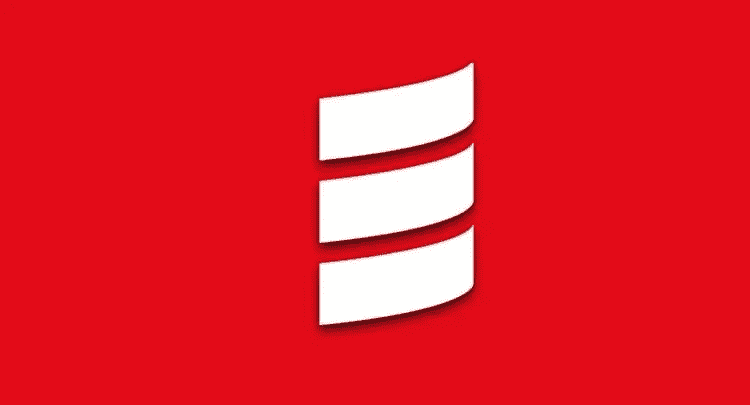
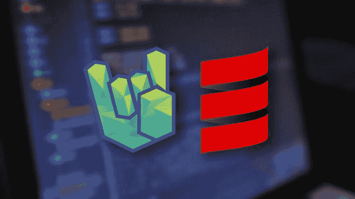
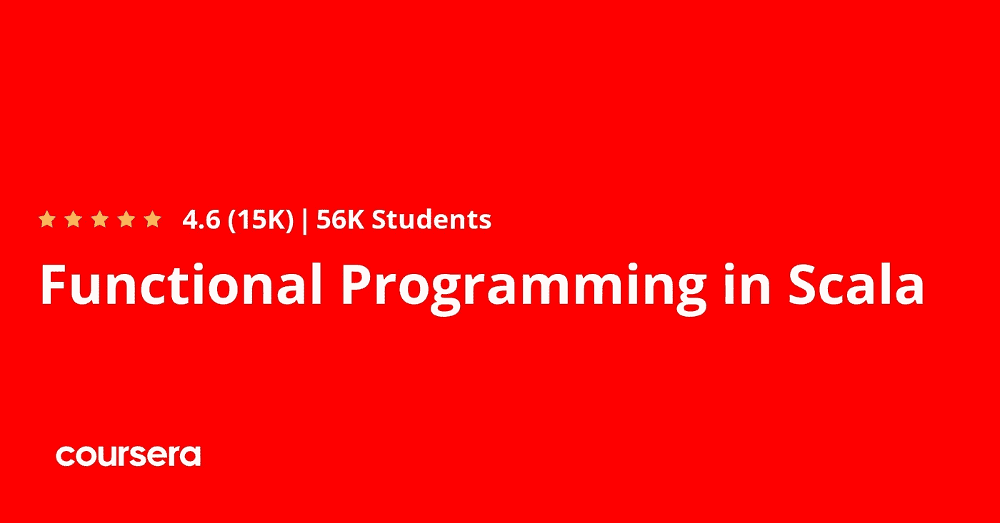
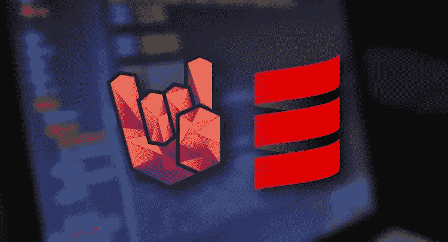
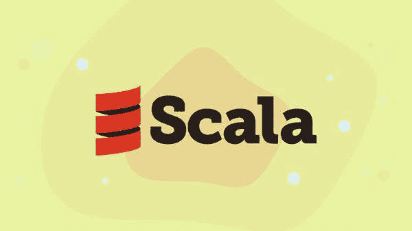
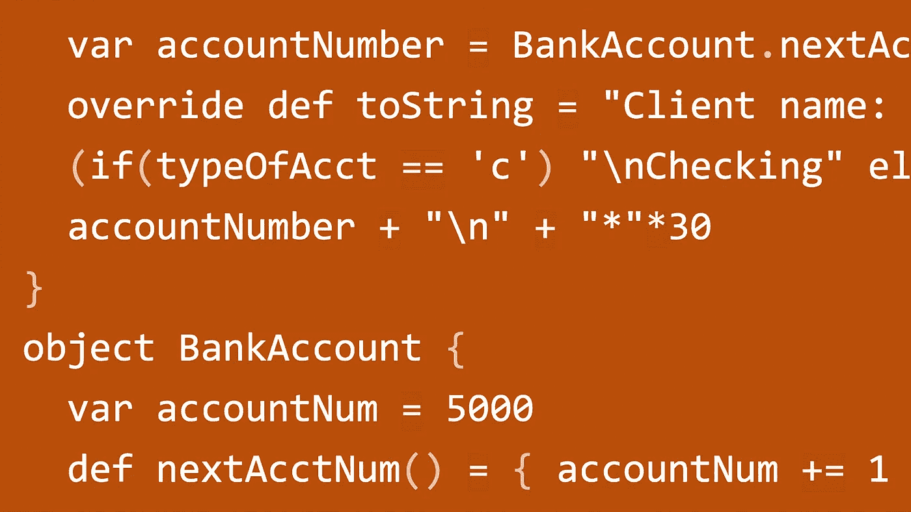

# 2023 年学习函数式编程的 10 个最好的 Scala 课程和教程

> 原文：<https://medium.com/javarevisited/10-best-scala-and-functional-programming-online-courses-for-beginners-b6461b27bf?source=collection_archive---------0----------------------->

## 我最喜欢的从 Udemy，Coursera，和 Pluralsight 学习和掌握 Scala 编程语言的课程，包括 best Akka，和面向初学者的 Spark 在线课程。

image_credit — Udemy

如果你想学习 Scala 和函数式编程以及关键的 Scala 框架，如 Akka 和 Apache Spark，并寻找最好的课程开始你的旅程，那么你来对地方了。前面我已经为 Java 开发者分享了 [**最好的 Scala 书籍**](/javarevisited/5-best-scala-and-functional-programming-books-to-learn-in-2021-97ec9e56f2bd) 和 [**免费的 Scala 课程**](https://javarevisited.blogspot.com/2019/01/5-free-scala-programming-courses-for-java-programmers-learn-online.html) ，而今天我要为程序员和 Java 开发者分享的是最好的 Scala 课程。

*披露—顺便说一句，其中一些链接是附属链接，如果你使用我的链接加入这些课程，我可能会得到报酬。*

这些是真正最好的 Scala 和函数式编程课程，来自网站，如 [Udemy](https://click.linksynergy.com/fs-bin/click?id=JVFxdTr9V80&offerid=323058.9410&type=3&subid=0) 、 [Coursera](https://coursera.pxf.io/c/3294490/1164545/14726?u=https%3A%2F%2Fwww.coursera.org%2F) 、 [Pluralsight](https://pluralsight.pxf.io/c/1193463/424552/7490?u=https%3A%2F%2Fwww.pluralsight.com%2Flearn) 和 [Educative](https://www.educative.io/subscription?affiliate_id=5073518643380224) ，由专家如 Martin oder skey(Scala 的创造者)创建，你将有机会向创造者学习 Scala。

它们也非常实惠，因为 Coursera 的课程是免费学习的，Udemy 的课程只需 10 美元就可以在 T21 的 Udemy sales 网站上买到。

如果你不知道，Scala 是服务器端开发的现代编程语言之一。它既是一种面向对象的编程语言，也是一种由 EPFL 的 Martin Odersky 开发的函数式语言，被认为是一种新的和现代的多范例编程语言，旨在简洁优雅地表达通用编程语言设计。

[Scala](/javarevisited/why-java-developer-should-learn-scala-programming-in-2020-3ca01a47eb0d)术语是单词 **Scalable Language** 的首字母缩略词，它是一种静态类型语言，这意味着变量需要为其分配一个类型，比如整数等等，并且变量只能保存该类型。Scala 的另一个好处是，它可以运行在 [Java 虚拟机](/javarevisited/7-best-courses-to-learn-jvm-garbage-collection-and-performance-tuning-for-experienced-java-331705180686) e 以及 NetBeans 等最常用的 IDE 上。

**Java 库可与 Scala 代码**互操作。像 Java 一样，Scala 是面向对象的，使用了让人想起 C 编程语言的花括号语法。

Scala 还有许多函数式编程语言的高级特性，比如**curry**、**类型推理、不变性、惰性求值和模式匹配。**它还有一个高级类型系统，支持代数数据类型、匿名类型、协方差、逆变和高阶类型。

Java 中没有的 Scala 的其他特性包括运算符重载、可选参数、命名参数、原始字符串和无检查异常。本课程涵盖了许多这些灵活的功能。

更重要的是， **Scala 为你提供了** [**工具**](https://javarevisited.blogspot.com/2020/09/top-10-scala-and-groovy-frameworks-java.html) **来轻松有效地构建可扩展的程序。它是一种静态类型的高级语言，将函数式编程和面向对象编程结合成一个灵活的包。

这篇文章将向你展示*最好的 Scala 和函数式编程课程*，可以帮助你在很短的时间内掌握这门语言，并探索它的所有特性，以便你利用这门语言的力量。**

所以在 2023 年充分利用这些*最好的课程来学习 Scala 和函数式编程，给你的职业生涯一个助力。学习如何用 Scala 编程，Scala 是目前世界上最流行的编程语言之一——不仅仅是在开发人员中，甚至是在像 Twitter 和 LinkedIn 这样的大公司中。*

# 2023 年初学者学习函数式编程的 10 门最佳 Scala 在线课程

以下是学习 Scala 和函数式编程的最佳在线课程列表。该列表包含初学者和中级 Scala 课程。它也有来自 [Udemy](https://click.linksynergy.com/fs-bin/click?id=JVFxdTr9V80&offerid=323058.9410&type=3&subid=0) 、 [Coursera](https://coursera.pxf.io/c/3294490/1164545/14726?u=https%3A%2F%2Fwww.coursera.org%2F) 、 [Pluralsight](https://pluralsight.pxf.io/c/1193463/424552/7490?u=https%3A%2F%2Fwww.pluralsight.com%2Flearn) 和 [Educative](https://www.educative.io/subscription?affiliate_id=5073518643380224) 的最好的课程，这是几个最好的在线学习网站。

## 1. [Scala &面向初学者的函数式编程](https://click.linksynergy.com/deeplink?id=JVFxdTr9V80&mid=39197&murl=https%3A%2F%2Fwww.udemy.com%2Fcourse%2Frock-the-jvm-scala-for-beginners%2F)【Udemy】

对于任何有 python 或 C++等语言编程经验的人来说，如果你想扩展你的知识以获得 Scala，那么这个课程就很适合你，因为它将教你如何在某些领域使用这种语言并利用它的力量。

在本课程中，您将学到:

*   理解 Scala 的工作原理。
*   开发强大的工具。
*   使用文件系统。

从这种语言的基础开始，如表达式和函数，然后移动到面向对象的编程和继承，以及匿名类和对象，最后使用小文件系统，如创建和删除文件和许多其他命令。

**这里是加入这个 Scala 课程的链接**——[Scala&面向初学者的函数式编程](https://click.linksynergy.com/deeplink?id=JVFxdTr9V80&mid=39197&murl=https%3A%2F%2Fwww.udemy.com%2Fcourse%2Frock-the-jvm-scala-for-beginners%2F)

## 2.Scala:大图

如果你想在很短的时间内学习 Scala 函数式编程语言，并且是一个没有这方面经验的初学者，那么你可以注册这门 Pluralsight 课程，它涵盖了这种语言的所有内容。

首先从这门函数式语言的基础开始，它将贯穿整个课程，例如变量和值，然后转移到一些高级主题，例如匿名函数类以及集合和模式，最后，您将看到如何使用 Scala 进行一种特殊的编程，称为并发编程。

您将在本课程中学到以下内容:

*   Scala 语言基础。
*   Scala 中的模式匹配。
*   Scala 中的并发编程。

**这里是加入这个最好的 Scala 课程的链接** — [Scala:大图](https://pluralsight.pxf.io/c/1193463/424552/7490?u=https%3A%2F%2Fwww.pluralsight.com%2Fcourses%2Fscala-big-picture)

顺便说一句，你需要一个 [**Pluralsight 会员**](https://pluralsight.pxf.io/c/1193463/424552/7490?u=https%3A%2F%2Fwww.pluralsight.com%2Flearn) 才能加入这个课程，费用大约是每月 29 美元或每年 299 美元(14%的折扣)。我向所有程序员强烈推荐这个订阅，因为它提供了超过 7000 个在线课程的即时访问，以学习任何技术技能。或者，你也可以使用他们的 [**10 天免费通行证**](https://pluralsight.pxf.io/c/1193463/424552/7490?u=https%3A%2F%2Fwww.pluralsight.com%2Flearn) 免费观看这门课程。

<https://pluralsight.pxf.io/c/1193463/424552/7490?u=https%3A%2F%2Fwww.pluralsight.com%2Flearn>  

## 3.[Scala 专业化中的函数式编程](https://coursera.pxf.io/c/3294490/1164545/14726?u=https%3A%2F%2Fwww.coursera.org%2Fspecializations%2Fscala)【Coursera】

Coursera 上最好、最全面的专业化课程，从零开始教你 Scala 编程语言，并用一些框架非常有效地编写程序，如 [Apache Spark](/javarevisited/5-free-courses-to-learn-apache-spark-in-2020-bdff2d60c800) 和其他技术等等。

像往常一样从变量、数据类型和循环等基础开始，然后你将应用你在 Scala 中学到的知识来构建更大的应用程序，这样你将在整个课程中获得实践经验，并最终将所有这些应用于大数据行业。

你将在本课程中学到:

*   这门语言的基础。
*   Spark 等一些技术。
*   在大数据中使用 Scala。

总的来说，这是一门学习 Scala 和函数式编程的全面而结构良好的课程。

**这里是加入本课程**—[Scala 专业化](https://coursera.pxf.io/c/3294490/1164545/14726?u=https%3A%2F%2Fwww.coursera.org%2Fspecializations%2Fscala)中的函数式编程的链接

顺便说一下，如果你计划参加多个 Coursera 课程或专业，那么考虑参加 [**Coursera Plus 订阅**](https://coursera.pxf.io/c/3294490/1164545/14726?u=https%3A%2F%2Fwww.coursera.org%2Fcourseraplus) ，它将为你提供无限制的访问他们最受欢迎的课程、专业、专业证书和指导项目的机会。它每年花费大约 399 美元，但它完全值得你的钱，因为你可以获得无限的证书。

<https://coursera.pxf.io/c/3294490/1164545/14726?u=https%3A%2F%2Fwww.coursera.org%2Fcourseraplus>  

## 4.[高级 Scala 和函数式编程](https://click.linksynergy.com/deeplink?id=JVFxdTr9V80&mid=39197&murl=https%3A%2F%2Fwww.udemy.com%2Fcourse%2Fadvanced-scala%2F)【Udemy】

本文的最后一个课程建议是针对 Scala 的高级人员，他们有一些基础经验，或者可能是中级用户，希望扩展他们在这种函数式编程语言方面的知识，并成为顶级开发人员。

在本课程中，您将学到:

*   Scala 高级编程。
*   高级函数程序设计。
*   Scala 工具。

从高级模式匹配开始，然后转到一些高级函数式编程，以及通过一些练习获得一些经验的惰性评估，然后您将转到函数式[并发编程](https://javarevisited.blogspot.com/2018/06/top-5-java-multithreading-and-concurrency-courses-experienced-programmers.html)，如并行编程和 JVM 线程。

**这里是加入这个 Scala 课程**——[高级 Scala 和函数式编程](https://click.linksynergy.com/deeplink?id=JVFxdTr9V80&mid=39197&murl=https%3A%2F%2Fwww.udemy.com%2Fcourse%2Fadvanced-scala%2F)的链接

## 5.[面向大数据和 ML 的 Scala 和 Spark](https://click.linksynergy.com/deeplink?id=JVFxdTr9V80&mid=39197&murl=https%3A%2F%2Fwww.udemy.com%2Fcourse%2Fscala-and-spark-for-big-data-and-machine-learning%2F)【Udemy】

如果你有兴趣学习大数据主题以及使用名为 Scala 的现代编程语言进行机器学习，那么这门课程非常适合你，因为你可以在一门课程中从初学者到高级水平学习这些技术。

在本课程中，您将学到:

*   如何使用 Scala 编码？
*   面向大数据的 Scala。
*   机器学习的 Scala。

你将从在不同的机器上安装 Scala 环境开始，例如 [Linux](/javarevisited/top-10-courses-to-learn-linux-command-line-in-2020-best-and-free-f3ee4a78d0c0?source=collection_home---4------0-----------------------) 等等，然后作为初学者学习如何使用 Scala 编码，例如变量和数据类型，以及你将在本课程中制作的一些项目，最后跳到使用这种语言来创建机器学习模型。

**这是本课程的链接** — [Scala 和 Spark for Big Data 和 ML](https://click.linksynergy.com/deeplink?id=JVFxdTr9V80&mid=39197&murl=https%3A%2F%2Fwww.udemy.com%2Fcourse%2Fscala-and-spark-for-big-data-and-machine-learning%2F)

## 6.[从零开始学习 Scala】【教育性】](https://www.educative.io/courses/learn-scala-from-scratch?affiliate_id=507351864338022)

这是 2023 年又一个为初学者学习 Scala 的牛逼在线课程。这门课程的 USP 是，它是一门基于文本的交互式课程，来自 [Educative](https://www.educative.io/subscription?affiliate_id=5073518643380224) ，一个新的学习平台，允许你直接从浏览器运行代码。

这意味着您可以在不安装或设置环境的情况下执行 Scala 程序。

本课程将帮助你保持领先地位，制作出色的、可扩展的应用程序，并学习一门令人垂涎的新编程语言。这门课的另一个好处是你可以免费旁听这门课。这意味着如果你正在寻找一个免费的 Scala 编程课程，那么你可以看看这个。

**这里是加入本课程的链接**——[从零开始学习 Scala】](https://www.educative.io/courses/learn-scala-from-scratch?affiliate_id=507351864338022)

而且，如果你发现教育平台和他们的互动课程很有用，那么你还可以获得 [**教育订阅**](https://www.educative.io/subscription?affiliate_id=5073518643380224) ，它不仅提供这门课程，还提供他们 100 多门课程，每月只需 **$14.99** 。它非常划算，非常适合准备编码面试和学习新的技术技能。

<https://www.educative.io/subscription?affiliate_id=5073518643380224>  

## 7.[**Scala 基础培训**](http://linkedin-learning.pxf.io/c/1193463/449670/8005?u=https%3A%2F%2Fwww.linkedin.com%2Fscala-essential-training)【LinkedIn 学习】

这是另一个从头学习 Scala 的很棒的课程，非常适合初学者和想在业余时间学习 Scala 的 Java 开发人员。

本课程将帮助您开始使用 Scala，因此您可以利用它提供的独特功能。您将首先学习类型推理、变量、循环、函数和运算符的基础知识。

之后，您将了解如何使用控制台读取文件、执行模式匹配、处理异常等等。最后，学习如何使用类、字段、方法和对象。

**以下是参加本课程**—[Scala 基础培训](http://linkedin-learning.pxf.io/c/1193463/449670/8005?u=https%3A%2F%2Fwww.linkedin.com%2Fscala-essential-training)的链接

## 8.[带 Scala 的 Akka Essentials 摇滚 JVM](https://click.linksynergy.com/deeplink?id=JVFxdTr9V80&mid=39197&murl=https%3A%2F%2Fwww.udemy.com%2Fcourse%2Fakka-essentials%2F)

到目前为止，我们已经看到了学习 Scala 和函数式编程的基础和高级课程，但如果你想成为一名专业的 Scala 开发人员，那么你还需要学习 Akka 和 Spark 等框架，本课程将教你 Akka，这是 Java 和 Scala 开发人员的最佳并发框架之一。

本课程面向需要设计复杂和可伸缩并发应用的 Scala 程序员。在本课程中，你将学习带有 Scala 的 Akka actor 模型，并编写并行、并发和容错系统

以下是您将在本课程中学到的内容:

*   如何用参与者而不是线程和锁创建并发应用程序
*   如何设计有监督的容错系统
*   如何为各种场景配置 Akka
*   如何测试 actor 系统
*   如何使用 Akka 模式和最佳实践

这门课程是为有 Scala 和[函数式编程](/javarevisited/8-best-lambdas-stream-and-functional-programming-courses-for-java-developers-3d1836a97a1d)经验的程序员开设的，不适合初学者。如果你是初学者，最好先从上面的课程中学习 Scala，然后从这个开始。

**这里是加入这门课程** — [带 Scala 的 Akka 基础](https://click.linksynergy.com/deeplink?id=JVFxdTr9V80&mid=39197&murl=https%3A%2F%2Fwww.udemy.com%2Fcourse%2Fakka-essentials%2F)的链接

## 9. [Akka HTTP with Scala |摇滚 JVM](https://click.linksynergy.com/deeplink?id=JVFxdTr9V80&mid=39197&murl=https%3A%2F%2Fwww.udemy.com%2Fcourse%2Fakka-http%2F)

如果你想用 Scala 编程语言编写反应式微服务和 REST APIs，那么这是 Scala 开发者最好的 Udemy 课程。

在本课程中，**您将学习如何使用强大的 Akka HTTP 编写反应式微服务、后端和 REST APIs。**你还将自己编写 2000 多行 Akka 代码，在指导下，你将成为一名 Scala 开发大师。

这是本课程涵盖的主题—

*   反应式微服务
*   在几分钟内停止 API
*   服务器和客户端 HTTP
*   JSON 集成
*   Websockets
*   JSON Web 令牌(JWT)授权
*   与 Akka 演员和 Akka 流无缝互动

简而言之，是针对需要设计大规模反应式 HTTP 后端和微服务的 Scala/Akka 程序员的高级课程。

**这里是加入这个 Akka 课程的链接**——[Akka HTTP with Scala](https://click.linksynergy.com/deeplink?id=JVFxdTr9V80&mid=39197&murl=https%3A%2F%2Fwww.udemy.com%2Fcourse%2Fakka-http%2F)

## 10. [Apache Spark 与 Scala——大数据实践！](https://click.linksynergy.com/deeplink?id=JVFxdTr9V80&mid=39197&murl=https%3A%2F%2Fwww.udemy.com%2Fcourse%2Fapache-spark-with-scala-hands-on-with-big-data%2F)

Spark 是很多 Java 开发者学习 Scala 的重要原因之一。如果你不知道， **Apache Spark** 是一个分布式、开源、通用的集群计算框架。它是数据处理领域最大的开源项目。

Spark 承诺提供出色的性能，并打包了更高级别的库，包括对 SQL 查询、流数据、机器学习和图形处理的支持。

Spark 在使用 Scala 编程语言时效果最佳，本课程**包括一个 Scala 速成班**让你快速上手。

这门课动手性很强；在我们一起编写、分析和运行真实代码的过程中，您将花费大部分时间跟随教师——无论是在您自己的系统上，还是在使用 Amazon 的 Elastic MapReduce 服务的云中。

它有**超过 8 小时的视频**内容包括在内，有**超过 20 个越来越复杂的真实例子**你可以自己构建、运行和研究。按照你自己的步调，按照你自己的时间表来完成它们。本课程最后概述了其他基于 Spark 的技术，包括 Spark SQL、Spark Streaming 和 GraphX。

**这里是加入这个令人敬畏的课程**——[Apache Spark with Scala](https://click.linksynergy.com/deeplink?id=JVFxdTr9V80&mid=39197&murl=https%3A%2F%2Fwww.udemy.com%2Fcourse%2Fapache-spark-with-scala-hands-on-with-big-data%2F)的链接

以上就是 2023 年**学习 Scala 编程语言的最佳在线课程**。Scala 是一种在大数据和机器学习中广泛使用的函数式语言，一些研究表明，在简历中使用 Scala 语言的员工将比其他人获得更高的工资，所以现在这篇文章将改变你对 Scala 的看法，并考虑学习这种精彩的语言。

其他**编程课程**和**文章**你可能喜欢

*   [2023 年 Java 开发者路线图](https://javarevisited.blogspot.com/2019/10/the-java-developer-roadmap.html)
*   [学习 Scala 编程的 10 个理由](https://javarevisited.blogspot.com/2018/01/10-reasons-to-learn-scala-programming.html)
*   [用 Scala 学习 Apache Spark 的 5 门免费课程](https://www.java67.com/2018/04/5-free-apache-spark-course-for-java-scala-python-developers.html)
*   [3 Java 开发者可以学习的编程语言](https://javarevisited.blogspot.com/2018/02/top-3-jvm-languages-java-programmer-learn.html)
*   [学习 Scala 编程的免费书籍](https://javarevisited.blogspot.com/2014/01/top-5-free-books-to-learn-scala-programming-PDF.html)
*   [我最喜欢的学习软件架构的课程](/javarevisited/top-5-courses-to-learn-software-architecture-in-2020-best-of-lot-5d34ebc52e9)
*   [2023 年 Java 开发者应该学会的 10 件事](https://javarevisited.blogspot.com/2017/12/10-things-java-programmers-should-learn.html#axzz5atl0BngO)
*   [深入学习 Spring 框架的 5 门课程](https://javarevisited.blogspot.com/2018/06/top-6-spring-framework-online-courses-Java-programmers.html)
*   [2023 年学习 Spring 框架的前 6 门课程](https://javarevisited.blogspot.com/2018/06/top-6-spring-framework-online-courses-Java-programmers.html)
*   [学习机器学习和数据科学的 10 门课程](https://javarevisited.blogspot.com/2018/10/data-science-and-machine-learning-courses-using-python-and-R-programming.html)
*   [面向程序员的 2023 年 DevOps 路线图](https://javarevisited.blogspot.com/2018/09/the-2018-devops-roadmap-your-guide-to-become-DevOps-Engineer.html)
*   [2023 年学习 Spring Boot 的十大课程](/javarevisited/top-10-courses-to-learn-spring-boot-in-2020-best-of-lot-6ffce88a1b6e)
*   [Java 和 Web 开发人员应该学习的 10 个框架](https://javarevisited.blogspot.com/2018/01/10-frameworks-java-and-web-developers-should-learn.html)
*   [面向程序员的 5 大 Java 设计模式课程](https://javarevisited.blogspot.com/2018/02/top-5-java-design-pattern-courses-for-developers.html)
*   [5 门免费课程学习芯泉和 Spring Boot](http://www.java67.com/2017/11/top-5-free-core-spring-mvc-courses-learn-online.html)
*   [面向程序员和工程师的 10 门 DevOps 课程](https://javarevisited.blogspot.com/2018/09/10-devops-courses-for-experienced-java-developers.html)
*   [面向 Java 开发人员的前 30 个 Scala 面试问题](https://javarevisited.blogspot.com/2017/03/top-30-scala-and-functional-programming.html)

感谢您阅读本文。如果你喜欢这些*最好的 Scala 和函数式编程课程*，那么请分享给你的朋友和同事。如果您有任何问题或反馈，请留言。

**P. S. —** 如果你认真学习 Scala 编程语言和 Akka 之类的框架，但正在寻找免费的在线课程，那么你也可以查看 Udemy 上的 [**Scala 编程迷你新手训练营**](https://click.linksynergy.com/deeplink?id=JVFxdTr9V80&mid=39197&murl=https%3A%2F%2Fwww.udemy.com%2Fcourse%2Fscala-programming-complete-mini-boot-camp-beginner-to-advance%2F) 免费课程。这个 1 小时 30 分钟的免费课程是在线学习 Scala 的好机会。

<https://click.linksynergy.com/deeplink?id=JVFxdTr9V80&mid=39197&murl=https%3A%2F%2Fwww.udemy.com%2Fcourse%2Fscala-programming-complete-mini-boot-camp-beginner-to-advance%2F> 