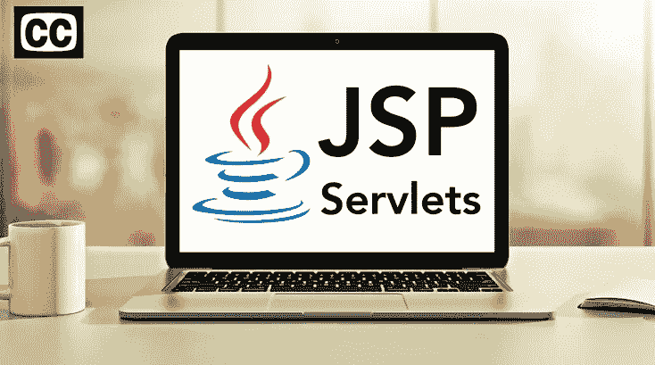
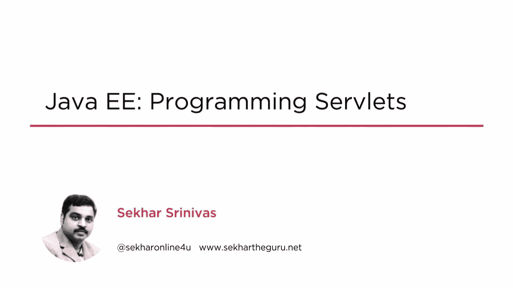
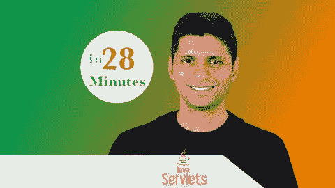

# 2023 年 Java 开发人员在线学习的 10 门最佳 Servlet 和 JSP 课程

> 原文：<https://medium.com/javarevisited/10-best-servlet-and-jsp-online-courses-for-java-developers-d23cf6902360?source=collection_archive---------1----------------------->

## 我最喜欢的 2023 年学习 Servlet 和 JSP (Java Server Pages)的在线课程，面向 Udemy、Pluralsight 等在线门户上的全栈 Java 开发者。

image_credit — udemy

嘿，Java 程序员，如果你想学习 Servlet 和 JSP，并寻找最好的 Servlet 和 JSP 在线课程，那么你来对地方了。过去，我曾分享过 [**免费 Servlet 和 JSP 课程**](/javarevisited/6-free-courses-to-learn-servlet-jsp-and-java-fx-in-2020-best-of-lot-720201c84f63?source=---------12------------------) ，今天，我将分享来自 Udemy、Coursera 和 Pluralsight 等网站的*最佳 Servlet 和 JSP 在线课程*。

要用 Java 构建 web 应用程序，您需要理解高级框架下的库和概念，这些在线课程将帮助您做到这一点。

许多 Java web 框架，如 [Struts](https://javarevisited.blogspot.com/2011/11/struts-interview-questions-answer-j2ee.html) 或 [Spring MVC](https://javarevisited.blogspot.com/2020/08/top-5-courses-to-learn-spring-mvc-for.html) ，都是建立在 Servlet 和 Java 服务器页面规范和基础库之上的。为了充分理解这些框架如何工作并有效地使用它们，您应该理解这些框架建立的基础。

这些*最好的 Servlet 和 JSP 课程*是由专家创建的，受到成千上万学习 Servlet 和 JSP 的开发者的信任。你也可以加入他们，在家里或办公室在线学习这些关键技术。

对于 Java 开发人员来说，Servlet 和 JSP 是两种最重要的 web 技术。在框架时代，您可能不会直接使用 Servlet 和 JSP，但是了解这样的基础知识总是有帮助的。

即使您正在使用 Spring MVC 或任何其他框架来创建 Java web 应用程序，了解 Servlet 和 JSP 对于调试和排除产品错误也大有帮助。如果你想学习 Servlet 和 JSP 并寻找最好的在线培训课程，那么你来对地方了。

[**Servlet**](https://javaee.github.io/javaee-spec/javadocs/javax/servlet/Servlet.html) 是一个 Java 类，用于增加应用专用服务器可以处理的主机数量。因此，它的主要用途是扩大一台服务器可以托管的网站和应用程序的数量。

虽然他们的主要目标是扩展可以托管 web 服务器的应用程序，但是他们也可以回复其他类型的请求。因此，对于这种类型的应用程序，有特定于 HTTP 的 servlet 类。

另一方面，还有 JSP，它是一个文本文档，里面包含两种不同类型的文本。一部分是静态数据，另一部分是动态数据。第一种可以在许多不同的基于文本的格式中找到，比如 HTML、XML 或 SVG。动态部分必须由 JSP 元素来表达。

# 2023 年初学者学习 Servlet 和 JSP 的 10 个最佳在线课程

为了不浪费你的时间，这里列出了学习 Servlet 和 JSP 的最佳在线课程，这是成为 Java web 开发人员需要学习的两项关键 Java web 技术。

这些课程是由经验丰富的 Java 开发人员和专业培训师创建的，它们也是来自 [Udemy](/javarevisited/15-best-udemy-courses-programmers-can-buy-on-black-friday-and-cyber-monday-2020-a803874f41d9) 和 [Pluralsight](/javarevisited/top-10-pluralsight-courses-to-learn-programming-and-software-development-during-covid-19-stay-at-30b7d8a4f88f) 的评分最高的 Servlet 和 JSP 课程。

## 1.[全栈 Java 开发者——Java+JSP+Restful WS+Spring](https://click.linksynergy.com/deeplink?id=JVFxdTr9V80&mid=39197&murl=https%3A%2F%2Fwww.udemy.com%2Fcourse%2Ffull-stack-java-developer-java%2F)

对于 Fullstack Java 开发人员来说，这是学习 Java、Servlet、JSP 以及 RESTful Web 服务的最佳课程。本课程涵盖了服务器端 Java 开发所需的一切。

这个 Udemy 课程结合了所有连接到数据库的方法，并学习如何以一种信息丰富且有吸引力的方式连接数据库。在这里，您将学习所有的基本概念、工具、功能和必要的主题，这些通常是 Java 开发人员在 web 应用程序开发过程中需要的。

课程从 Java 开始，包括多线程、Lambdas、集合调试、 [Git](/javarevisited/7-best-courses-to-master-git-and-github-for-programmers-d671859a68b2) 介绍。然后我们将转向 JSP 和 Servlets。一旦我们完成了 JSP 和 Servlets，我们将开始探索 Hibernate。将使用 JSP 和 Hibernate 构建一个应用程序。

**这里是加入本课程的链接——**[全栈 Java 开发者——Java+JSP+Restful WS+Spring](https://click.linksynergy.com/deeplink?id=JVFxdTr9V80&mid=39197&murl=https%3A%2F%2Fwww.udemy.com%2Fcourse%2Ffull-stack-java-developer-java%2F)

## 2.[servlet 和 JSP 教程:用 Java 学习 Web 应用程序](https://click.linksynergy.com/deeplink?id=JVFxdTr9V80&mid=39197&murl=https%3A%2F%2Fwww.udemy.com%2Fcourse%2Fjavawebtut%2F)

在本课程中，您将学习如何使用 Java web 编程技术创建动态网站。它是为那些已经掌握 Java 知识并希望提高这种编程语言技能的人准备的。

本教程包括 10 个小时的视频课程、2 篇文章和 3 个可下载资源，并教授如何在互联网上免费部署自己的项目应用程序、如何使用核心服务器端技术，以及如何利用 [Java 编程语言](/javarevisited/top-5-java-online-courses-for-beginners-best-of-lot-1e1e240a758)的力量创建动态网站。这个过程需要你的基本 Java 知识，通过实现 Servlets、JSP 和 JSTL，你将能够像大公司一样创建现代交互式网站。

**这里是加入本课程的链接**—[servlet 和 JSP 教程:用 Java 学习 Web 应用](https://click.linksynergy.com/deeplink?id=JVFxdTr9V80&mid=39197&murl=https%3A%2F%2Fwww.udemy.com%2Fcourse%2Fjavawebtut%2F)

## 3.[面向初学者的 JSP、Servlets 和 JDBC:构建一个数据库应用](https://click.linksynergy.com/deeplink?id=JVFxdTr9V80&mid=39197&murl=https%3A%2F%2Fwww.udemy.com%2Fcourse%2Fjsp-tutorial%2F)

本教程是 Servlets 和 JSP Udemy 的畅销书是有原因的。是一个简单的教程，以非常直观的方式展示了基础知识。

您将学习如何从头开始构建一个全功能的 JSP 和 Servlets web 应用程序，为创建项目设置不同的环境，使用这种技术读取 HTML 表单数据，构建一个[数据库](/hackernoon/top-5-sql-and-database-courses-to-learn-online-48424533ac61)，以及更多有趣的应用程序。

共包含 8 个半小时的视频教程，31 篇文章，49 个可下载内容。如你所见，它有很多你一生都可以接触到的文件。当然，拥有一个 Java 知识库是必要的，拥有一些 HTML 知识也是有用的。

**这里是加入这个在线课程**——[JSP、Servlets 和 JDBC 的链接:](https://click.linksynergy.com/deeplink?id=JVFxdTr9V80&mid=39197&murl=https%3A%2F%2Fwww.udemy.com%2Fcourse%2Fjsp-tutorial%2F)

## 4.[凯文·琼斯的《Java Web 基础知识》](https://pluralsight.pxf.io/c/1193463/424552/7490?u=https%3A%2F%2Fwww.pluralsight.com%2Fcourses%2Fjava-web-fundamentals)【plural sight】

这是 Pluralsight 上 Java 开发者学习 Servlet 和 JSP 最好的课程之一。本课程由 Java 资深人士之一、我最喜欢的导师凯文·琼斯创建，它将教你学习创建 Java 应用程序所需的关于 Servlet、JSP 和标记库的一切。

以下是您将在本课程中学到的重要内容:

1.  如何使用 Servlet 构建 Web 应用程序
2.  使用 JSP 从服务器返回 HTML 内容
3.  在 web 应用中结合使用 Servlet 和 JSP
4.  使用过滤器压缩数据
5.  使用事件处理程序

本课程还讨论了使用 Servlets 作为控制器，Java 服务器页面作为视图的模型-视图-控制器模式。您还将学习如何在标记库中隐藏复杂的 UI 交互。总的来说，这是一个学习 Servlet 和 JSP 的很好的在线课程。

**这里是加入本课程的链接** — [Java Web 基础](https://pluralsight.pxf.io/c/1193463/424552/7490?u=https%3A%2F%2Fwww.pluralsight.com%2Fcourses%2Fjava-web-fundamentals)

## 5. [Java Servlet、JSP 和 Hibernate:构建电子商务网站](https://click.linksynergy.com/deeplink?id=JVFxdTr9V80&mid=39197&murl=https%3A%2F%2Fwww.udemy.com%2Fcourse%2Fjava-servlet-jsp-and-hibernate-build-a-complete-website%2F)

这是在 Udemy 上学习 Servlet 和 JSP 最好的基于项目的在线课程之一。Nam 开设了一门课程，专注于创建您自己的电子商务网站，客户可以在这里浏览产品、查看详细信息并撰写客户评论。

通过本课程，您可以使用自己创建的客户面板控制所有客户的产品和订单。它还教授一些很酷的东西，比如实现与 PayPal 或信用卡支付的支付集成。

你将通过一个示例项目学习如何做到这一点，该项目包括创建一个销售[书籍的网络电子商务](https://javarevisited.blogspot.com/2017/01/best-books-to-learn-servlet-and-jsp.html)，他将在课程中教授你。学习这门课程后，你将终生拥有 59 小时的视频和 201 种可下载资源。

**这里是加入这个最佳课程** — [Java Servlet、JSP 和 Hibernate:构建电子商务网站](https://click.linksynergy.com/deeplink?id=JVFxdTr9V80&mid=39197&murl=https%3A%2F%2Fwww.udemy.com%2Fcourse%2Fjava-servlet-jsp-and-hibernate-build-a-complete-website%2F)的链接

## 6.[Java EE:SEK har Srinivasan 的 Servlets 编程](https://pluralsight.pxf.io/c/1193463/424552/7490?u=https%3A%2F%2Fwww.pluralsight.com%2Fcourses%2Fjava-ee-programming-servlets) [Pluralsight]

这个 Pluralsight 在线课程专门关注 Java servlets 的使用。通过学习本课程，您将了解如何在 Eclipse 中配置 Tomcat webserver，以及如何读取请求和响应头。

您将从 servlet 架构和生命周期的完整概述开始。首先，您将在 [Eclipse](/javarevisited/top-10-courses-to-learn-eclipse-junit-and-mockito-for-java-developers-4de1e8d62b96?source=collection_home---4------1-----------------------) 中看到一个 [Tomcat web 服务器](https://javarevisited.blogspot.com/2013/07/how-to-configure-https-ssl-in-tomcat-6-7-web-server-java.html)的配置，并且您将学习如何读取请求和响应头。

之后，您将学习如何将过滤器应用于 servlet，并了解关于跟踪会话数据、web 注释和全球化 servlet 的许多细节。最后，您将了解 servlet 中的异步编程、servlet 的调试、打包和部署。

本课程结束时，您将对使用 Java servlets 进行 web 开发有一个更全面的了解。所需软件:Tomcat 和 Eclipse。

**这里是加入本课程的链接**——[Java EE:编程 servlet](https://pluralsight.pxf.io/c/1193463/424552/7490?u=https%3A%2F%2Fwww.pluralsight.com%2Fcourses%2Fjava-ee-programming-servlets)

你需要一个 [Pluralsight 会员](https://pluralsight.pxf.io/c/1193463/424552/7490?u=https%3A%2F%2Fwww.pluralsight.com%2Flearn)才能加入这个课程，费用大约是每月 29 美元或每年 299 美元(14%的折扣)。

我向所有程序员强烈推荐这个订阅，因为它提供了超过 7000 个在线课程的即时访问，以学习任何技术技能。或者，你也可以使用他们的 [**10 天免费通行证**](https://pluralsight.pxf.io/c/1193463/424552/7490?u=https%3A%2F%2Fwww.pluralsight.com%2Flearn) 免费观看这个课程。

<https://pluralsight.pxf.io/c/1193463/424552/7490?u=https%3A%2F%2Fwww.pluralsight.com%2Flearn>  

## 7. [JSP 和 Servlets 完整课程](https://click.linksynergy.com/deeplink?id=JVFxdTr9V80&mid=39197&murl=https%3A%2F%2Fwww.udemy.com%2Fcourse%2Fjsp-and-servlets-the-complete-course%2F)

这是 Udemy 为有经验的 Java 开发人员提供的另一个全面的 JSP 和 Servlet 编程培训课程。本培训课程涵盖了使用 JSP 和 Servlets 的动态 web 开发。它专注于基础层面的关键概念，这不仅对有经验的程序员有益，对初学者也有好处。您将通过动手练习和示例学习如何创建和部署[servlet](https://docs.oracle.com/javaee/6/api/javax/servlet/Servlet.html)和 [JSP](https://en.wikipedia.org/wiki/Jakarta_Server_Pages) 。

在此过程中，您还将了解 Servlet 生命周期以及如何从头开始构建功能完整的 JSP 和 Servlet web 应用程序。教程包括 5 个半小时的点播视频教程。

**这是加入本课程** — [JSP 和 Servlets 完整课程](https://click.linksynergy.com/deeplink?id=JVFxdTr9V80&mid=39197&murl=https%3A%2F%2Fwww.udemy.com%2Fcourse%2Fjsp-and-servlets-the-complete-course%2F)的链接

## 8.[Java EE:servlet 和 Java server Pages(JSP)](http://linkedin-learning.pxf.io/c/1193463/449670/8005?u=https%3A%2F%2Fwww.linkedin.com%2Flearning%2Fjava-ee-servlets-and-javaserver-pages-jsp)【LinkedIn Learning】

这是为 Java EE 开发人员学习 Servlets 和 JSP 的另一个很棒的课程。该课程由 Ketkee Aryaman 创建，由 LinkedIn 旗下的教育机构 LinkedIn Learning 提供。

本课程从基础开始，涵盖了 servlets 和 JSP 的基础知识。您将学习如何设置您的环境，如何使用 [GET 和 POST 请求](https://www.java67.com/2014/08/difference-between-post-and-get-request.html)，以及转发和重定向。

之后，您将学习 JSP 或 Java Server Pages，这是一种用于服务器端渲染的技术。您将首先回顾一些基本概念，比如 JSP 生命周期。

本课程还包括会话管理、过滤器和监听器。最后，她介绍了 JSP 标准标签库(JSTL)核心模块和 **fmt 模块**，以及定制标签的开发。

**这里是加入本课程的链接**—[Java EE:servlet 和 JavaServer Pages (JSP)](http://linkedin-learning.pxf.io/c/1193463/449670/8005?u=https%3A%2F%2Fwww.linkedin.com%2Flearning%2Fjava-ee-servlets-and-javaserver-pages-jsp)

顺便说一下，你需要一个 [LinkedIn Learning 会员](http://linkedin-learning.pxf.io/c/1193463/449670/8005?u=https%3A%2F%2Fwww.linkedin.com%2Flearning%2Fsubscription%2Fproducts)来观看这个课程，这个课程每月花费大约 29.99 美元，但是你也可以通过参加他们的 [**1 个月免费试用**](http://linkedin-learning.pxf.io/c/1193463/449670/8005?u=https%3A%2F%2Fwww.linkedin.com%2Flearning%2Fsubscription%2Fproducts) 来免费观看这个课程，这是一个探索他们 16000 多门最新技术在线课程的好方法。

  

## 9.[面向初学者的 JSP 和 servlet](https://click.linksynergy.com/deeplink?id=JVFxdTr9V80&mid=39197&murl=https%3A%2F%2Fwww.udemy.com%2Fcourse%2Fjsp-and-servlets-for-beginners%2F)【Udemy 最佳课程】

这是 Udemy 为初学者提供的另一个学习 JSP 和 Servlets 的很棒的课程。由 Bushan Sigur 创建的这个长达 6 小时的课程将通过构建一个成熟的数据库应用程序来帮助您成为 JSP 和 Servlet 方面的专家

本课程从客户端和服务器架构的介绍开始，然后您将获得 JSP 和 Servlet 的高级概述。之后，您将建立一个开发环境，并使用 JSP 和 Servlets 构建一个 JDBC 数据库 Web 应用程序

以下是您将在本课程中学到的内容

*   Servlet 和 Servlet 方法的生命周期
*   [ServletConfig](https://www.java67.com/2012/09/difference-between-servletconfig-and-servletcontext-j2ee-jsp.html) 和 [ServletContext](https://javarevisited.blogspot.com/2012/03/how-to-get-servletcontext-in-servlet.html)
*   ServletContextListener
*   [请求调度](https://www.java67.com/2016/09/difference-between-include-and-forward-in-Servlet-JSP.html)
*   JSP 表达式、JSP 脚本小程序和 JSP 声明
*   表达式语言
*   JSTL 图书馆

学完本课程后，您将对 JSP 和 Servlet 以及如何使用它们来构建 Web 应用程序有更好的理解。

**这里是加入本课程** — [JSP 和 Servlets 初学者](https://click.linksynergy.com/deeplink?id=JVFxdTr9V80&mid=39197&murl=https%3A%2F%2Fwww.udemy.com%2Fcourse%2Fjsp-and-servlets-for-beginners%2F)的链接

## 10.[Java servlet 和 JSP —用 25 个步骤构建 Java EE(JEE)应用程序【免费】](https://click.linksynergy.com/deeplink?id=JVFxdTr9V80&mid=39197&murl=https%3A%2F%2Fwww.udemy.com%2Fcourse%2Flearn-java-servlets-and-jsp-web-application-in-25-steps%2F)

这是学习 Java Servlet 和 JSP 的免费 Udemy 课程。由我最喜欢的 Udemy 导师 Ranga Karnam 创建，他是许多 Udemy 畅销 Java 课程的作者，如本 [**春季微服务课程**](https://click.linksynergy.com/deeplink?id=JVFxdTr9V80&mid=39197&murl=https%3A%2F%2Fwww.udemy.com%2Fcourse%2Fmicroservices-with-spring-boot-and-spring-cloud%2F) ，它将一步一步地教你 Servlet 和 JSP。

在这个免费的 Servlet JSP 课程中，您将学习使用 Java Servlets 和 JSP 以及登录和注销功能开发基本 Todo 管理应用程序的基础知识。

您将使用 Java Web 编程的核心技术构建一个动态网站。您将了解 Java Web 应用程序开发的基本概念— HTTP 协议、请求-响应周期、Java Servlets、JSP。

您还将一步一步地构建网站，步骤超过 25 步。作为 Java Web 应用程序开发的入门课程，本课程将是完美的第一步。

总的来说，这是一门学习 Servlet 和 JSP 的好课程，非常适合初学者理解基础知识&继续对 web 应用程序开发感兴趣，最重要的是它是免费的。

**这里是免费参加本课程的链接**—[Java servlet 和 JSP —用 25 个步骤构建 Java EE(JEE)应用](https://click.linksynergy.com/deeplink?id=JVFxdTr9V80&mid=39197&murl=https%3A%2F%2Fwww.udemy.com%2Fcourse%2Flearn-java-servlets-and-jsp-web-application-in-25-steps%2F)

以上是关于**学习 Servlet 和 JSP、【Java 开发人员的两种核心 web 技术的最佳在线课程。如果你想了解如何制作看起来既现代又酷的 Java 页面，JSP 和 Servlets 是一个很好的组合，可以大大提高网站的质量。这会让他们看起来很漂亮，很专业。在本文中，我们为您带来了一些最佳课程，您可以根据自己的具体需求选择这些课程。我希望它能帮助你把你的专业水平提高到一个新的水平，这样你就可以每天都保持进步。

其他**编程资源文章**您可能喜欢探索**

*   [面向 Java 开发者的 5 门免费 Spring 框架课程](http://www.java67.com/2017/11/top-5-free-core-spring-mvc-courses-learn-online.html)
*   [成为全栈 Java 开发人员的前 5 门课程](https://javarevisited.blogspot.com/2020/04/top-5-courses-to-become-full-stack-java-developer-with-Angular-and-Reactjs.html#axzz6Nq9yk7Sc)
*   [我最喜欢的学习软件架构的课程](/javarevisited/top-5-courses-to-learn-software-architecture-in-2020-best-of-lot-5d34ebc52e9)
*   [与 Spring Boot 一起学习微服务的 5 大课程](https://javarevisited.blogspot.com/2018/02/top-5-spring-microservices-courses-with-spring-boot-and-spring-cloud.html#axzz6JJFPbsyP)
*   [2023 年学习网页开发的 5 门课程](http://javarevisited.blogspot.sg/2018/02/top-5-online-courses-to-learn-web-development.html#axzz57wed1PWd)
*   [深入学习 Spring 的十大课程](/javarevisited/10-best-online-courses-to-learn-spring-framework-in-2020-f7f73599c2fd)
*   [5 门免费学习核心 Java 的在线课程](http://javarevisited.blogspot.sg/2017/11/top-5-free-java-courses-for-beginners.html#axzz4zuIICRs9)
*   [学习 Spring MVC 的前 5 门课程](https://javarevisited.blogspot.com/2020/08/top-5-courses-to-learn-spring-mvc-for.html)
*   [面向有经验的 Java 开发人员的 5 大 Java 设计模式课程](http://javarevisited.blogspot.sg/2018/02/top-5-java-design-pattern-courses-for-developers.html)
*   [学习 Java 设计模式的 7 门最佳课程](/javarevisited/7-best-online-courses-to-learn-object-oriented-design-pattern-in-java-749b6399af59?source=---------10------------------)
*   [学习 Java 微服务的 7 大课程](/javarevisited/top-5-courses-to-learn-microservices-in-java-and-spring-framework-e9fed1ba804d)
*   [编程/编码工作面试的 10 门课程](http://javarevisited.blogspot.sg/2018/02/10-courses-to-prepare-for-programming-job-interviews.html)
*   [面向 Java 开发人员的 10 门高级 Spring Boot 课程](/javarevisited/10-advanced-spring-boot-courses-for-experienced-java-developers-5e57606816bd)
*   [初学者学习 Spring Cloud 的 5 大课程](https://javarevisited.blogspot.com/2018/04/top-5-spring-cloud-courses-for-java.html)
*   [学习 learn Shell 脚本的 5 门课程](http://javarevisited.blogspot.sg/2018/02/5-courses-to-learn-shell-scripting-in-linux.html)
*   [10 个面向 Java 开发者的免费 Spring Boot 教程和课程](/javarevisited/10-free-spring-boot-tutorials-and-courses-for-java-developers-53dfe084587e)

感谢您阅读本文。如果您发现这些*最佳 Servlet 和 JSP 在线课程*对学习全栈 Java 开发有用，那么请与您的朋友和同事分享它们。如果您有任何问题或反馈，请留言。

**p . s .**——如果你渴望学习 Servlet 和 JSP 并成为一名 Java web 开发人员，但又在寻找免费的在线培训课程，那么你也可以看看 Udemy 上 Ranga Karnam 的这个[**Java Servlet 和 JSP——用 25 个步骤**](http://bit.ly/2CTC6yD) 构建 Java EE(JEE)应用程序的课程。这是完全免费的，你只需要一个 Udemy 帐户就可以加入这个课程。

<http://bit.ly/2CTC6yD> 