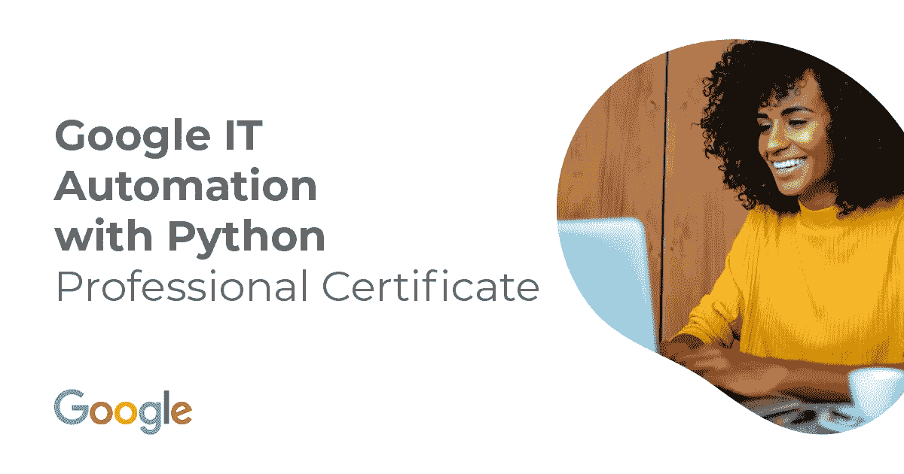
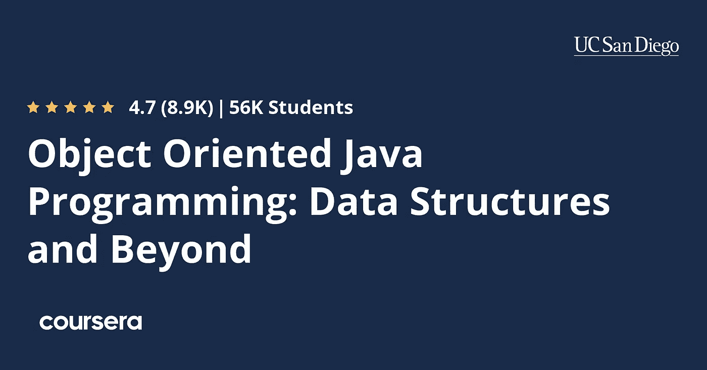
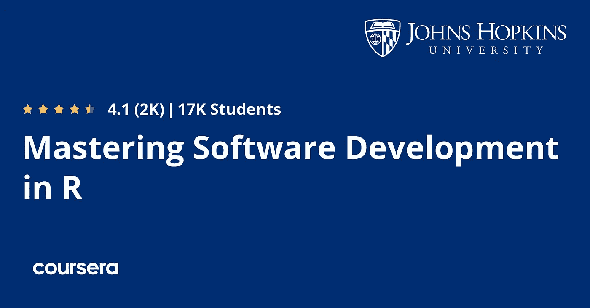
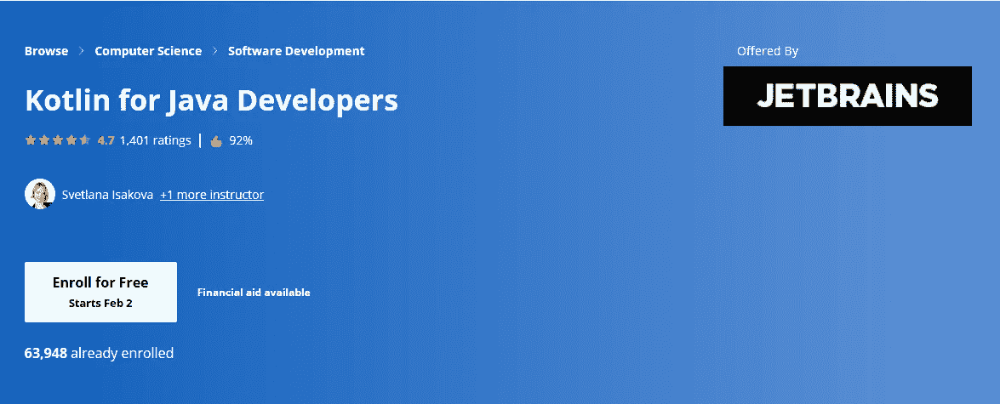
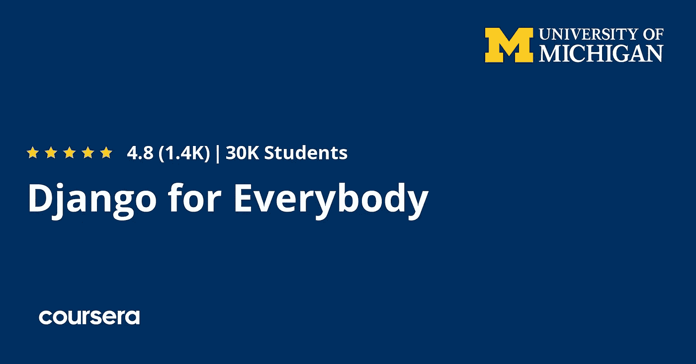

# 2023 年 Coursera 的 10 个最佳软件开发课程和认证

> 原文：<https://medium.com/javarevisited/10-best-software-development-courses-certifications-from-coursera-4ccc59aae201?source=collection_archive---------0----------------------->

## 这些是学习 Java、Python、C、R、Django 和一般软件开发的最佳 Coursera 课程和认证

大家好，如果你想成为一名软件开发人员，并在 Coursera 上寻找最好的软件开发课程，那么你来对地方了。之前，我已经分享了 web 开发的 [**最佳 Coursera 课程**](/javarevisited/10-best-coursera-courses-for-web-development-and-web-design-9ec54ed92dd9) ，以及学习 Python 的 [*最佳 Coursera 认证*](/javarevisited/10-best-python-certification-courses-from-coursera-4576890eb6b3) ，今天，我将分享学习 Java、Python、R、C 和一般软件开发的最佳 Coursera 认证和课程。

到 2026 年，软件开发和编程预计将增长约 13%，这意味着现在是进入这一领域并学习软件开发和编程新技能的最佳时机，无论是 [web 开发](https://javarevisited.blogspot.com/2018/01/top-10-udemy-courses-for-java-and-web-developers.html)、[移动应用](https://javarevisited.blogspot.com/2018/02/5-react-native-courses-to-learn-mobile-development-using-JavaScript.html)还是[物联网](https://www.java67.com/2020/06/top-5-course-to-learn-internet-of-things-IoT.html)，所以你需要做不可能的事情，以保持在竞争对手之上。

如今，学习过程和方法发生了很大变化，出现了许多在线平台，将教师与学生联系起来，分享知识和技能，并在完成课程后获得认证，软件开发就是其中之一。

一个这样的在线学习平台是 Coursera，它带来了来自世界上最好的大学的在线课程，如密歇根大学、耶鲁大学、约翰·霍普斯金大学，以及世界上最大的科技公司，如谷歌、IBM 和亚马逊。

今天我将与大家分享 Coursera 为学习软件开发提供的一些最好的 *est 课程，如果你完成了课程并留在比赛中，就有能力获得认证。Coursera 认证非常有价值，你可以将它们放入你的简历或 LinkedIn 个人资料中，以展示你的技能。虽然这些课程是免费审核的，这意味着你可以免费参加学习，但你需要支付认证费用，这是有意义的。*

# 2023 年计算机科学和软件开发十大 Coursera 课程

在不浪费你更多时间的情况下，这里列出了软件开发和计算机科学的最佳 Coursera 课程、认证、专业和项目。该清单包括学习基本技能的课程，如 [Java](/javarevisited/10-free-courses-to-learn-java-in-2019-22d1f33a3915) 、 [Python](/swlh/5-free-python-courses-for-beginners-to-learn-online-e1ca90687caf) 、 [Android](/hackernoon/top-5-courses-to-learn-android-for-java-programmers-667e03d995b4) 、 [R](https://becominghuman.ai/top-5-free-courses-to-learn-r-programming-for-data-science-and-statistics-in-2020-305bf1c6f24e) 、 [Kotlin](/javarevisited/top-5-courses-to-learn-kotlin-in-2020-dfc3fa7706d8?source=---------16------------------) 、[网页设计](/javarevisited/7-free-courses-to-learn-bootstrap-for-web-designers-and-developers-5135215648f1)、[网页开发](/better-programming/my-5-favorite-courses-to-learn-web-development-in-2019-a5e74167f8b2)、计算机视觉等等。

## 1. [Java 编程与软件工程基础](https://coursera.pxf.io/c/3294490/1164545/14726?u=https%3A%2F%2Fwww.coursera.org%2Fspecializations%2Fjava-programming)

开始使用 java 进行软件开发职业生涯的最佳课程之一，因此您可以从学习这种语言的基础知识开始，如变量和循环，以及一些高级知识，如在文件中读写数据，您将使用您所学的知识来创建复杂的软件，以解决现实世界中的问题。

**这里是加入本 Java 课程的链接** — [Java 编程和软件工程基础](https://coursera.pxf.io/c/3294490/1164545/14726?u=https%3A%2F%2Fwww.coursera.org%2Fspecializations%2Fjava-programming)

## 2.[用 Python Google IT 自动化](https://coursera.pxf.io/c/3294490/1164545/14726?u=https%3A%2F%2Fwww.coursera.org%2Fprofessional-certificates%2Fgoogle-it-automation)【专业证书】

另一个很好的 python 软件开发职业课程，从之前没有这种语言的经验开始，转到如何使用 python 与系统交互，以及如何在项目中使用 Git 和 Github，之后您将看到如何在云中自动化过程，如部署和更新。

以下是加入这一专业认证的链接—[Google IT Automation with Python](https://coursera.pxf.io/c/3294490/1164545/14726?u=https%3A%2F%2Fwww.coursera.org%2Fprofessional-certificates%2Fgoogle-it-automation)

## 3.[面向对象的 Java 编程:数据结构和超越专门化](https://coursera.pxf.io/c/3294490/1164545/14726?u=https%3A%2F%2Fwww.coursera.org%2Fspecializations%2Fjava-object-oriented)

这是 Coursera 的另一个很棒的软件开发课程，涵盖了软件开发的中级主题。

在这个专业中，您将学习面向对象的编程原则，这将使您能够充分发挥 Java 的潜力，并且您将实现数据结构和算法，以一种既高效又易于使用的方式组织大量数据。

您还将练习批判性地评估您自己的代码，并且您将建立技术交流技能，这将帮助您为软件工程师的工作面试和协作工作做好准备。

在最后的顶点项目中，你将运用你的技能来分析从现实世界(社会)网络中收集的数据。谷歌贡献了真实世界的项目，并让其工程师作为客座讲师参与这些课程

**这里是加入本课程的链接** — [面向对象 Java 编程:数据结构和超越专门化](https://coursera.pxf.io/c/3294490/1164545/14726?u=https%3A%2F%2Fwww.coursera.org%2Fspecializations%2Fjava-object-oriented)

## 3.[掌握 R 中的软件开发](https://coursera.pxf.io/c/3294490/1164545/14726?u=https%3A%2F%2Fwww.coursera.org%2Fspecializations%2Fr)

本课程将教您使用 R 语言进行软件开发，从初学者开始，学习这种语言的基础知识，然后学习一些高级主题，如 OOP，以及使用 R 语言和数据可视化工具编写包，最后是一个顶点项目。

这里是加入这个 R 课程的链接— [掌握 R 中的软件开发](https://coursera.pxf.io/c/3294490/1164545/14726?u=https%3A%2F%2Fwww.coursera.org%2Fspecializations%2Fr)

## 4.[安卓应用开发](https://coursera.pxf.io/c/3294490/1164545/14726?u=https%3A%2F%2Fwww.coursera.org%2Fspecializations%2Fandroid-app-development)

在没有任何经验的情况下开始 android 应用程序开发职业生涯的最佳课程之一，从 Java 语言的基础开始，然后继续学习如何使用它来创建 android 应用程序，并添加一些功能和一些真正的应用程序，如 RSS reader 应用程序以及自动化测试和许多其他主题。

**这里是加入这个安卓课程的链接**——[安卓应用开发](https://coursera.pxf.io/c/3294490/1164545/14726?u=https%3A%2F%2Fwww.coursera.org%2Fspecializations%2Fandroid-app-development)

## 5.[用机器学习检测假新闻](https://coursera.pxf.io/c/3294490/1164545/14726?u=https%3A%2F%2Fwww.coursera.org%2Fprojects%2Fnlp-fake-news-detector)【项目】

这个基于项目的课程将教你机器学习来预测假新闻，你首先要在处理之前导入和清理你的数据，并执行一些其他活动，如可视化，然后训练神经网络，并在真实世界的数据中使用 LSTM 深度学习。

**这里是加入这个项目的链接** — [用机器学习检测假新闻](https://coursera.pxf.io/c/3294490/1164545/14726?u=https%3A%2F%2Fwww.coursera.org%2Fprojects%2Fnlp-fake-news-detector)

## 6.[面向 Java 开发人员的 kot Lin](https://coursera.pxf.io/c/3294490/1164545/14726?u=https%3A%2F%2Fwww.coursera.org%2Flearn%2Fkotlin-for-java-developers)

该课程以 Kotlin[初学者的身份教你变量、循环、函数等基础知识，然后转到一些中级主题，如 Lambda 和操作、面向对象编程和类，最后是库函数、集合和序列等等。](/javarevisited/7-free-courses-to-learn-kotlin-in-2020-327c3872c1e1?source=collection_home---4------2-----------------------)

本课程由 Kotlin 和 IntelliJIDEA 的创建者 JetBrains 创建。

**这里是加入本课程的链接** — [面向 Java 开发人员的 kot Lin](https://coursera.pxf.io/c/3294490/1164545/14726?u=https%3A%2F%2Fwww.coursera.org%2Flearn%2Fkotlin-for-java-developers)

## 7.计算机视觉

这个基于项目的课程是为那些已经掌握了 python 的技能并且想要使用 OpenCV 学习计算机视觉的人准备的，你可以从理解基本知识开始，比如使用 OpenCV 和 matplotlib 导入图像，然后对图像进行一些改变，比如调整大小、翻转、绘制线条和形状以及一些基本的东西。

**这是加入这个网页开发课程**——[计算机视觉](https://coursera.pxf.io/c/3294490/1164545/14726?u=https%3A%2F%2Fwww.coursera.org%2Fprojects%2Fcomputer-vision-opencv-for-images)的链接

## 8. [C 为大家](https://coursera.pxf.io/c/3294490/1164545/14726?u=https%3A%2F%2Fwww.coursera.org%2Flearn%2Fc-for-everyone)

学习 C 编程语言[的好课程](/javarevisited/10-best-c-programming-courses-for-beginners-2c2c1f6bcb12)从这种语言的环境开始，然后学习基本知识，如运算符、声明、函数、返回和类，然后学习一些高级主题，如指针和数组，并通过期末考试来测试您对这种语言的了解。

**这是加入这个网页开发课程** — [C 给大家](https://coursera.pxf.io/c/3294490/1164545/14726?u=https%3A%2F%2Fwww.coursera.org%2Flearn%2Fc-for-everyone)的链接

## 9.姜戈为每个人

针对 python 用户的另一个学习使用 [Django](/javarevisited/my-favorite-courses-to-learn-django-for-beginners-2020-ac172e2ab920) 开发 web 应用程序的很好的课程，该课程假设您已经掌握了一些 python 的基础知识，并且学习了 Django 如何与 SQL 等数据库进行交互，以及如何使用 Django 库来创建 web 应用程序并添加一些功能。

**这是加入这个网络开发课程的链接**—[Django for every one](https://coursera.pxf.io/c/3294490/1164545/14726?u=https%3A%2F%2Fwww.coursera.org%2Fspecializations%2Fdjango)

## 10.面向所有人的网络应用

这是一个学习使用 PHP 开发 web 应用程序的很好的课程，所以你需要有一些前端技术的基础，比如 HTML 和 CSS，你可以从学习数据库技术开始，比如 SQL，然后使用 PHP 来创建后端的实际代码和一些其他语言，比如 JavaScript 和 jQuery。

**这是加入这个网络开发课程**的链接— [面向所有人的网络应用](https://coursera.pxf.io/c/3294490/1164545/14726?u=https%3A%2F%2Fwww.coursera.org%2Fspecializations%2Fweb-applications)

以上就是 2023 年学习软件开发和计算机科学的**最佳 Coursera 课程**的全部内容。无论你是 IT 专家还是编程专家，你都需要一个证书来验证你的技能和知识，并向你的员工展示，这篇文章向你展示了这个行业中一些最好的证书。

顺便说一句，如果你发现 Coursera 的课程、专业和认证有用，因为它们是由世界各地的知名公司和大学提供的，那么我强烈推荐你加入 Coursera 的订阅计划 [**Coursera Plus**](https://coursera.pxf.io/c/3294490/1164545/14726?u=https%3A%2F%2Fwww.coursera.org%2Fcourseraplus) 。

 [## Coursera Plus |无限制访问 7，000 多门在线课程

### 用 Coursera Plus 投资你的职业目标。无限制访问 90%以上的课程、项目…

coursera.pxf.io](https://coursera.pxf.io/c/3294490/1164545/14726?u=https%3A%2F%2Fwww.coursera.org%2Fcourseraplus) 

这个 Coursera 会员计划让您可以无限制地访问他们最受欢迎的课程、专业、专业证书和指导项目。它的费用大约为每年 399 美元，但它完全值得，因为你可以获得无限的证书，事实上，如果你参加多个专业和认证，它是划算的。

你可能喜欢的其他 **Coursera 和编程文章**

*   [学习云计算的 10 门最佳 Coursera 课程](https://javarevisited.blogspot.com/2020/08/top-10-coursera-certifications-to-learn-cloud-computing-aws.html#axzz6WK1yC5WW)
*   [Coursera Plus Review——在 Coursera 上学习的更好方式](https://javarevisited.blogspot.com/2020/08/coursera-plus-better-way-to-take-coursera-courses-specilizations-certification.html)
*   [学习 Web 开发的十大 Coursera 课程](https://javarevisited.blogspot.com/2020/08/top-10-coursera-certifications-to-learn-web-development.html)
*   [2023 年程序员十大课程](https://javarevisited.blogspot.com/2020/08/top-10-coursera-courses-specilizations-and-certifications.html)
*   [学习数据科学的十大课程](https://javarevisited.blogspot.com/2020/08/top-10-coursera-certifications-to-learn-Data-Science-Visualization-and-Data-Analysis.html)
*   [面向程序员和开发人员的 Coursera 十大项目](https://javarevisited.blogspot.com/2020/08/top-10-coursera-projects-to-learn-essential-programming-skills.html)
*   [你可以在 Coursera 上在线申请的前 5 个计算机科学学位](https://javarevisited.blogspot.com/2020/04/is-it-possible-to-get-master-of-computer-science-degree-online-coursera.html)
*   [Udemy vs Coursera？学理工和编程哪个好](https://javarevisited.blogspot.com/2020/01/coursera-vs-udemy-which-is-better-for-programming-tech.html)
*   【Coursera 证书对工作和事业有帮助吗
*   [学习 Python 的 10 个 Coursera 专业和认证](https://javarevisited.blogspot.com/2020/02/10-best-coursera-courses--for-python.html)
*   [5 个最佳 Coursera 程序员职业证书](https://javarevisited.blogspot.com/2019/10/top-5-coursera-professional-certificates-for-programmers-IT-professionals.html)
*   [2023 年学习 Python 可以做的 8 个项目](/javarevisited/8-projects-you-can-buil-to-learn-python-in-2020-251dd5350d56)
*   [开始职业生涯的十大 Coursera 认证](/javarevisited/top-10-coursera-certificates-to-start-your-career-in-cloud-data-science-ai-mainframe-and-it-558690c83587)
*   [2023 年学习人工智能的 7 门最佳课程](/javarevisited/7-best-courses-to-learn-artificial-intelligence-in-2020-26d59d62f6fe)
*   [Udemy vs 复数视线？哪个学习平台比较好？](https://javarevisited.blogspot.com/2019/10/udemy-vs-pluralsight-review-which-is-better-to-learn-code.html)
*   [Udemy vs CodeCademy vs one month？](https://javarevisited.blogspot.com/2019/09/codecademy-vs-udemy-vs-onemonth-which-is-better-for-learning-code.html#axzz6VYKcmyZz)
*   Udemy vs Educative vs CodeCademy？新手哪个好
*   [你可以在 Coursera Online 上获得 5 个数据科学学位](https://www.java67.com/2020/06/top-5-data-science-degree-you-can-earn-online-coursera-edx.html)
*   [Coursera 的 10 项数据科学和机器学习认证](/javarevisited/top-10-machine-learning-and-data-science-certifications-and-training-courses-for-beginners-and-a6308497b764)

感谢阅读这篇文章。如果你喜欢这些为软件开发人员设计的最好的 Coursera 课程，那么请与你的朋友和同事分享。如果您有任何问题或反馈，请留言。

如果你正在寻找学习 Java 和软件开发技能的最佳 Udemy 课程，那么你也可以看看我列出的 [**程序员和软件开发人员最佳 Udemy 课程**](https://javarevisited.blogspot.com/2019/08/top-10-udemy-courses-and-certifications-for-programmers.html) 。包含了最好的 Udemy 课程，学习 Java、Python、Git，以及其他软件开发所需的必备技能。

 [## 2023 年面向程序员和开发者的 10+最佳 Udemy 课程

### 大家好，毫无疑问，Udemy 是最受欢迎的电子学习平台之一，它的帮助越来越大…

medium.com](/javarevisited/my-favorite-udemy-online-courses-for-programmers-and-software-engineers-f9d941dd0035)