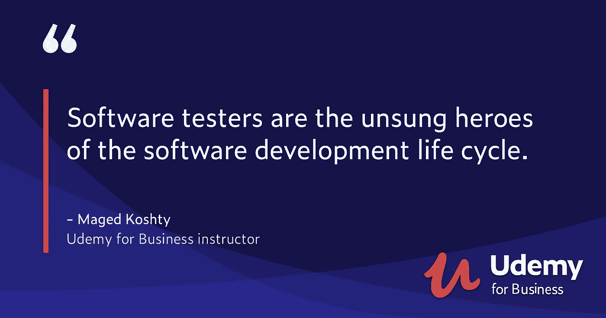
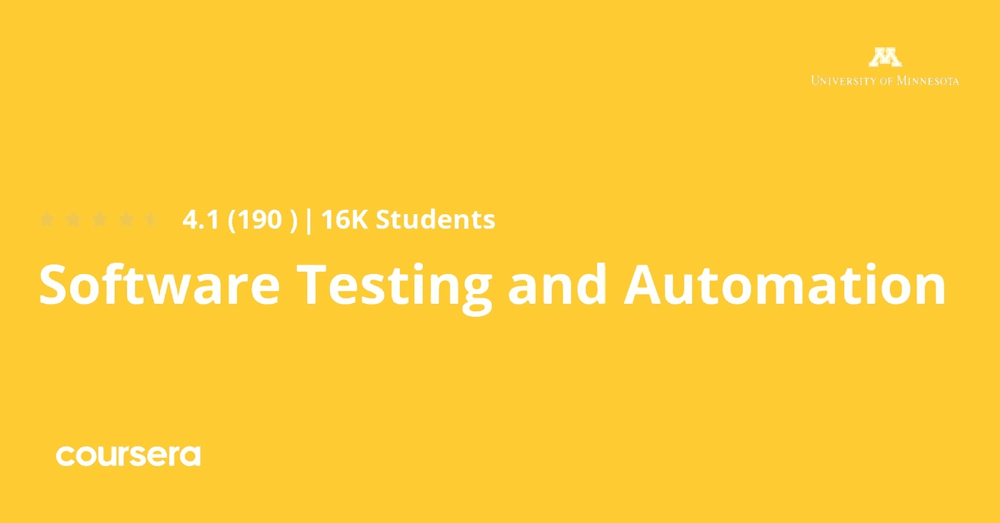
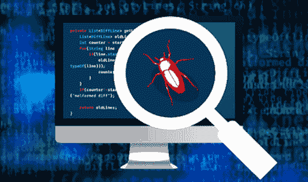
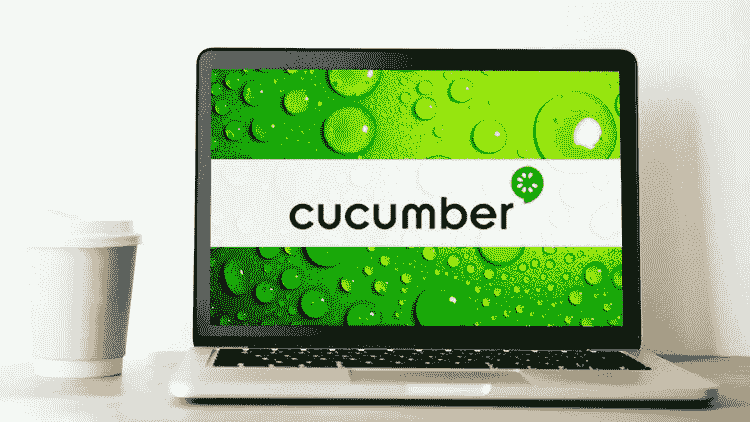
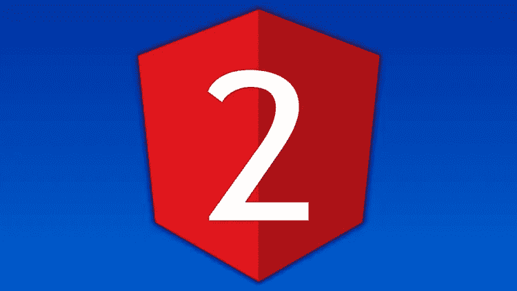
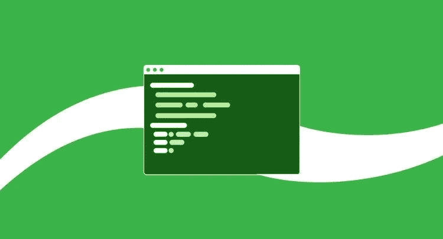

# 2023 年面向初学者的 10 门最佳软件测试在线课程

> 原文：<https://medium.com/javarevisited/10-best-software-testing-courses-for-beginners-a8c625b89664?source=collection_archive---------0----------------------->

## 软件测试、自动化测试和质量分析师的最佳在线课程列表，学习工具、实践和成为软件测试员的一切。

如果你想学习软件测试，包括手工和自动化测试，并寻找最好的在线课程来掌握这一热门的工作技能，那么你来对地方了。

过去，我已经分享了最好的免费在线课程来学习基本的自动化测试工具，如 [Selenium](/javarevisited/my-favorite-free-courses-to-learn-selenium-web-drive-for-automation-testing-2f248c8fe6aa) 、 [Appium](https://javarevisited.blogspot.com/2020/08/top-5-courses-to-learn-appium-for-automation-testing.html) 和 [JUnit](https://www.java67.com/2018/02/5-free-eclipse-and-junit-online-courses-java-developers.html) ，今天，我将分享最好的课程来学习软件测试，并开始你作为软件测试员或质量分析师(QA)的职业生涯。

这些是最好的在线课程，来自像 Udemy、T2、Pluralsight、T4、Coursera 和 edX 这样的网站。这是免费和付费课程的结合，因为 edX 和 Coursera 课程是免费学习的，如果你想获得认证，你只需要付费。

软件测试是一种识别任何软件内部缺陷并加以纠正的方法，同时也是在将软件发布给最终用户之前检查软件质量是否满足市场需求的方法。由于每家软件公司都要求在向市场推出应用程序或软件之前对其进行测试，因此这种被称为软件测试工程师的工作一直都很吃香。据《glassdoor.com》报道，这份工作的平均年薪是 8.3 万美元，如果是老年人，年薪可以提高到 9.7 万美元。这是一条利润丰厚的职业道路，有很多现场和远程工作机会。作为[业务分析师](https://javarevisited.blogspot.com/2018/10/top-5-carrer-options-for-experienced-java-programmers.html)和[项目经理](/javarevisited/what-next-for-senior-developers-in-tech-project-manager-technical-architect-or-a-devops-engineer-b532a80c9ba1)，你也可以在职业生涯中成长。

现在，你已经了解了什么是软件测试以及它的一些好处，如果你读完这篇文章，你还会看到一些在线课程，这些课程将帮助你掌握这些技能并更深入地学习。

# 2023 年要学习的 10 门最佳软件测试课程

在不浪费你更多时间的情况下，这里有最好的在线课程，你现在就可以加入，学习软件和自动化测试，并在 2023 年成为一名质量分析师(QA)或软件测试员。

这个列表包括了从 [Udemy](/javarevisited/my-favorite-udemy-online-courses-for-programmers-and-software-engineers-f9d941dd0035) 、 [Coursera](/javarevisited/18-coursera-courses-you-can-join-in-2020-to-learn-from-the-worlds-top-tech-companies-google-74af46967d1e?source=collection_home---4------0-----------------------) 、 [Pluralsight](/javarevisited/pluralsight-free-weekend-2020-3e0ff26e7a31) 和 [edX](/javarevisited/10-free-best-edx-certifications-and-courses-to-learn-online-3473d466f968) 等网站上获得的初级和高级软件测试课程。这些课程也很实惠，Udemy 的课程只需 10 美元就可以在每个月都会举行的几次 Udemy 大减价中买到。

## 1.[完整的 2023 年软件测试训练营](https://click.linksynergy.com/deeplink?id=JVFxdTr9V80&mid=39197&murl=https%3A%2F%2Fwww.udemy.com%2Fcourse%2Ftesterbootcamp%2F)

这是 2023 年学习软件测试最好的 Udemy 课程。这门课程是由 QA 工程师和测试专家 [Tarek Roshdy](https://click.linksynergy.com/deeplink?id=JVFxdTr9V80&mid=39197&murl=https%3A%2F%2Fwww.udemy.com%2Fuser%2Ftrq-rshd%2F) 创建的，这门课程提供了你学习软件测试所需的一切。

以下是您将在本课程中学到的技能列表:

1.  基本理论概念
2.  测试用例编写和 bug 报告
3.  测试管理工具(Testlink)
4.  敏捷测试基础和敏捷工具(JIRA)
5.  黑盒技术(等价划分-边界值分析-决策表测试-状态转换测试-用例测试)
6.  白盒技术(语句覆盖-决策覆盖-路径覆盖-MC/DC-循环覆盖)
7.  自由测试(Bugfinders-ut est-tester work-Crossover)
8.  性能测试和
9.  API 测试和移动测试

还有更多。本课程还通过一些常见的面试问题为你参加软件测试员面试做准备。总的来说，这是开启你软件测试生涯的 ht 最佳课程之一。这对 ISTQB 认证**也有好处。**

**这是加入本课程的链接**—[2023 年软件测试训练营](https://click.linksynergy.com/deeplink?id=JVFxdTr9V80&mid=39197&murl=https%3A%2F%2Fwww.udemy.com%2Fcourse%2Ftesterbootcamp%2F)

## 2.软件测试和自动化专业化【Coursera】

任何一种软件的开发者，如果想通过深入的课程学习在将产品推向市场之前对其进行软件测试的技能和知识，都可以在 [Coursera](https://javarevisited.blogspot.com/2020/08/top-10-coursera-courses-specilizations-and-certifications.html) 上参加这个专业课程。

和往常一样，每门课程都以软件测试及其好处的介绍开始。然后学习如何通过实践进行黑盒和白盒测试，以及自动化测试，从而在短时间内生成大量的测试。

在本课程中，您将学到:

*   自动化测试。
*   黑白盒测试。
*   移动和网络测试。

最后，看看如何使用 selenium 工具进行移动和 web 测试。

**这是加入本课程** — [软件测试和自动化专业](https://coursera.pxf.io/c/3294490/1164545/14726?u=https%3A%2F%2Fwww.coursera.org%2Fspecializations%2Fsoftware-testing-automation)的链接

顺便说一句，如果你觉得 Coursera 的课程有用，那么我也建议你加入 Coursera Plus 的订阅计划，这是 Coursera 的一个订阅计划，可以让你无限制地访问他们最受欢迎的课程、专业、专业证书和指导项目。它每年花费大约 399 美元，但是它完全值得你的钱，因为你得到了无限的证书。

<https://coursera.pxf.io/c/3294490/1164545/14726?u=https%3A%2F%2Fwww.coursera.org%2Fcourseraplus>  

## 3.[自动化软件测试](https://www.awin1.com/cread.php?awinmid=6798&awinaffid=631878&clickref=&p=%5B%5Bhttps%3A%2F%2Fwww.edx.org%2Fcourse%2Fdelftx-automated-software-testing)【edX】

以另一个关于自动化测试的大课程结束这篇文章为了更快的结果和更有效的工作，你可以在 edx 上获得这个关于自动化软件测试的专业证书。

你将在这门课中学到:

*   使用自动化测试来测试任何软件。
*   自动化测试的局限性。
*   开发可测试的架构。

从理解软件测试的基础开始，然后是功能测试、结构测试和代码覆盖，例如分析源代码的结构、开发可测试的架构和这种技术的局限性等等。

**这是加入本课程**——[自动化软件测试](https://www.awin1.com/cread.php?awinmid=6798&awinaffid=631878&clickref=&p=%5B%5Bhttps%3A%2F%2Fwww.edx.org%2Fcourse%2Fdelftx-automated-software-testing)的链接

## 4.[从零开始的深度软件测试培训课程](https://click.linksynergy.com/deeplink?id=JVFxdTr9V80&mid=39197&murl=https%3A%2F%2Fwww.udemy.com%2Fcourse%2Fqa-software-testing-training-course%2F)

根据软件的不同，软件测试有两种方法，手动和自动。在 Udemy 的课程中，你会看到如何进行这两种方法以及更多的概念。从介绍软件测试开始，如认证和确认，然后更详细地介绍软件的生命周期，并编写软件需求的场景。

在本课程中，您将学到:

*   软件测试方法介绍。
*   测试执行步骤以及如何执行。
*   使用不同的工具进行测试。

稍后，您将看到测试执行步骤，管理执行和生成报告，以及缺陷生命周期和过程管理工作，等等。

**这里是加入本课程** — [软件测试深度培训课程](https://click.linksynergy.com/deeplink?id=JVFxdTr9V80&mid=39197&murl=https%3A%2F%2Fwww.udemy.com%2Fcourse%2Fqa-software-testing-training-course%2F)的链接

## 5.[Cucumber with Java——用较少的代码构建自动化框架](https://click.linksynergy.com/deeplink?id=JVFxdTr9V80&mid=39197&murl=https%3A%2F%2Fwww.udemy.com%2Fcourse%2Fcucumber-tutorial%2F)

如果你是一个想学习测试，特别是自动化测试的 Java 开发人员，或者是一个测试 Java 应用程序的测试人员，这是你使用 Cucumber 学习 Java 自动化测试的最好的在线课程。

本课程由软件测试专家 Rahul Shetty 创建，将教你用最少的代码设计强大的测试框架(Selenium，Appium，API)的黄瓜 BDD 方法。

以下是您将在本课程中学到的内容:

1.  如何使用黄瓜规则定义黄瓜特征文件
2.  黄瓜自动化术语
3.  黄瓜的数据驱动测试
4.  数据表特性及其重要性
5.  开发可重用组件的正则表达式
6.  使用示例关键字参数化测试
7.  黄瓜挂钩和标签功能

以上所有的主题都是从零开始讨论的，有很多实际的例子可以更好的理解，这使得本课程对 Java 开发人员和软件测试人员来说都很棒。

**这是加入本课程的链接**——[用 Java 黄瓜——用更少的代码构建自动化框架](https://click.linksynergy.com/deeplink?id=JVFxdTr9V80&mid=39197&murl=https%3A%2F%2Fwww.udemy.com%2Fcourse%2Fcucumber-tutorial%2F)

## 6.[用 Python 进行自动化软件测试](https://click.linksynergy.com/deeplink?id=JVFxdTr9V80&mid=39197&murl=https%3A%2F%2Fwww.udemy.com%2Fcourse%2Fautomated-software-testing-with-python%2F)

这是一门在 Udemy 上学习 Python 自动化测试的很棒的课程。这个课程是由 Python 专家[何塞·萨尔瓦蒂耶拉](https://click.linksynergy.com/deeplink?id=JVFxdTr9V80&mid=39197&murl=https%3A%2F%2Fwww.udemy.com%2Fuser%2Fjosesalvatierra%2F)创建的，他是我最喜欢的 Udemy 导师之一。

本课程将教你学习使用 Python、BDD、Selenium WebDriver 和 Postman 进行自动化软件测试所需的一切，重点是 web 应用程序

本课程包含所有最新技术，供您在专业和个人项目中使用，例如:

*   unittest 库，Python 的标准自动化软件测试库
*   嘲讽和打补丁，是测试时减少依赖性的两个基本工具；
*   单元测试、集成测试、系统测试和验收测试——所有类型的测试都包括在内；
*   Postman 便于开发时的协作和测试；
*   用于自动化浏览器测试的 Selenium WebDriver
*   Git 和 Travis 来持续集成您的项目。

简而言之，这是 Python 开发人员以及任何想学习如何测试 Python 应用程序，尤其是 python web 应用程序的软件测试人员的最佳测试课程之一。

**这里是加入本课程的链接** — [用 Python 进行自动化软件测试](https://click.linksynergy.com/deeplink?id=JVFxdTr9V80&mid=39197&murl=https%3A%2F%2Fwww.udemy.com%2Fcourse%2Fautomated-software-testing-with-python%2F)

## 7.[用 Jasmine 测试 Angular(之前的 Angular 2)应用](https://click.linksynergy.com/deeplink?id=JVFxdTr9V80&mid=39197&murl=https%3A%2F%2Fwww.udemy.com%2Fcourse%2Ftesting-angular-apps%2F)

测试 web 应用是一项非常受欢迎的技能，因为许多测试人员不知道如何测试 React 和 Angular 应用。如果你对测试 web 应用感兴趣，那么这是一门非常适合你的课程。

本课程由最高评级的 Udemy 讲师之一 Mosh Hamedani 创建，将教你如何为 Angular 应用编写单元和集成测试，并自信地部署它们。

这是你在这门课中学到的主要东西-

*   如何为你的 Angular 应用编写干净且可维护的测试
*   如何找到测试覆盖了多少代码
*   如何为可重用组件编写测试
*   如何为组件模板编写测试
*   为表单编写测试
*   如何为确认框编写测试
*   如何为导航创建测试
*   如何为属性指令编写测试
*   如何使用异步操作

总的来说，这是一个学习如何使用 Jasmine 测试角度应用的极好的课程。如果你以前上过 Mosh 的任何课程，你知道你会得到什么。高质量的视频和音频，出色的交付，没有混乱，这使它真正成为一个伟大的资源。

**这是加入本课程的链接**——[用 Jasmine 测试 Angular 4(之前的 Angular 2)应用](https://click.linksynergy.com/deeplink?id=JVFxdTr9V80&mid=39197&murl=https%3A%2F%2Fwww.udemy.com%2Fcourse%2Ftesting-angular-apps%2F)

## 8.[带 Java 的 Selenium WebDriver 基础到高级+框架](https://click.linksynergy.com/deeplink?id=JVFxdTr9V80&mid=39197&murl=https%3A%2F%2Fwww.udemy.com%2Fcourse%2Fselenium-real-time-examplesinterview-questions%2F)

毫无疑问，Selenium 对于任何自动化测试人员来说都是最重要的工具，任何软件测试课程列表如果没有 Selenium 课程都是不完整的。

这是在线学习 Selenium WebDeriver 的最佳课程之一。由测试专家 Rahul Shetty 创建，这是一个庞大的课程，教你所有软件自动化测试人员应该知道的测试 Java 应用程序的技术。

以下是你将在本课程中学到的关键技能—

*   深入研究 Selenium Webdriver
*   在所有支持的浏览器中自动化 Web 应用程序的实例
*   使用高级 WebDriver 处理富 Web UI 的策略
*   您在 WebDriver 中面临的实时挑战和解决方案
*   硒网格和硒的现场项目
*   面试问题讨论及解决方案
*   像 TestNG，Maven，Ant，Jenkins，Log4j，Cucumber 等工具
*   测试执行报告
*   数据驱动框架和混合框架
*   页面对象模型框架
*   使用 Selenium 进行数据库测试
*   使用硒进行性能测试
*   借助 Sauce labs 和移动自动化实现云自动化

对于手工测试人员、对学习自动化感兴趣的非编程意识测试人员，以及想要学习自动化测试的 Java 开发人员来说，这是一门完美的课程。

**这是参加本课程的链接**——[Selenium web driver with Java-basic to Advanced+Frameworks](https://click.linksynergy.com/deeplink?id=JVFxdTr9V80&mid=39197&murl=https%3A%2F%2Fwww.udemy.com%2Fcourse%2Fselenium-real-time-examplesinterview-questions%2F)

## 9 [商业分析师:软件测试过程&技术](https://click.linksynergy.com/deeplink?id=JVFxdTr9V80&mid=39197&murl=https%3A%2F%2Fwww.udemy.com%2Fcourse%2Fsoftware-testing-business-analyst%2F)

如果你想要一门课程，给你一个小的介绍和更多关于如何做软件测试的实践课程，让你的项目没有错误，更成功地准备好投放市场，那么请随意加入 Udemy 上的这门课程。你将学习软件测试的概念和这一过程的目标，以及软件测试的步骤和测试文档，如测试案例和场景。

在本课程中，您将学到:

*   软件测试和文档。
*   如何记录和跟踪 bug？
*   追踪你的 bug 的有用工具。

在此之后，您将看到缺陷管理，以及如何使用诸如 [Excel](https://javarevisited.blogspot.com/2019/09/top-5-courses-to-learn-microsoft-excel-macros-vba-and-data-visualization.html) 、SharePoint 等工具来记录和跟踪它，以确保它在发布给最终用户之前得到解决。

这里是加入这个令人敬畏的课程的链接— [业务分析师:软件测试过程&技术](https://click.linksynergy.com/deeplink?id=JVFxdTr9V80&mid=39197&murl=https%3A%2F%2Fwww.udemy.com%2Fcourse%2Fsoftware-testing-business-analyst%2F)

## 10.[自动化测试:端到端](https://pluralsight.pxf.io/c/1193463/424552/7490?u=https%3A%2F%2Fwww.pluralsight.com%2Fcourses%2Fautomated-testing-end-to-end)

如果你是一个为自己或领导工作的自由开发人员，并且想学习自动化测试以获得更快的结果、更快的反馈和更高的生产率，你可以现在就注册这个 Pluralsight 课程。

您将在本课程中学到以下内容:

*   自动化测试过程。
*   集成测试。
*   功能 UI 测试。

您将会看到关于自动化测试的介绍，以及自动化过程和手工测试之间的区别。

之后，您将看到该流程中涉及的各个阶段，以及集成测试功能 UI 测试，如使用[自动化工具](/javarevisited/top-10-tools-for-automation-testing-in-java-b615c2d57f54)以及如何编写您自己的功能工具，等等。

**这里是加入这个测试课程**——[自动化测试:端到端](https://pluralsight.pxf.io/c/1193463/424552/7490?u=https%3A%2F%2Fwww.pluralsight.com%2Fcourses%2Fautomated-testing-end-to-end)的链接

顺便说一下，你需要一个 [Pluralsight 会员](https://pluralsight.pxf.io/c/1193463/424552/7490?u=https%3A%2F%2Fwww.pluralsight.com%2Flearn)才能加入这个课程，费用大约是每月 29 美元或每年 299 美元(14%的折扣)。我向所有程序员强烈推荐这个订阅，因为它提供了超过 7000 个在线课程的即时访问，以学习任何技术技能。或者，你也可以使用他们的 [**10 天免费通行证**](https://pluralsight.pxf.io/c/1193463/424552/7490?u=https%3A%2F%2Fwww.pluralsight.com%2Flearn) 免费观看这门课程。

<https://pluralsight.pxf.io/c/1193463/424552/7490?u=https%3A%2F%2Fwww.pluralsight.com%2Flearn>  

以上就是 2023 年**要学的最好的软件测试课程**。你可以加入这些课程，成为一名 QA 分析师和软件测试员。软件测试对于任何工具、产品或服务来说都是一个必不可少的过程，公司需要在将其推向市场之前对其进行验证和确认，如果该产品威胁到人们的生命安全，那么就会给客户造成损失或者陷入麻烦。

其他 **Java 和测试资源**你可能会觉得有用

*   [2023 年 5 门免费学习 JUnit 的课程](http://www.java67.com/2018/02/5-free-eclipse-and-junit-online-courses-java-developers.html)
*   学习硒和黄瓜的 7 门最佳课程
*   [深入学习 JUnit 和 Mockito 的 5 门最佳课程](/javarevisited/5-courses-to-learn-junit-and-mockito-in-2019-best-of-lot-f217d8b93688?source=---------20------------------)
*   [2023 年最需要学习的 5 门课程](https://javarevisited.blogspot.com/2020/08/top-5-courses-to-learn-appium-for-automation-testing.html)
*   [面向 Java 和 DevOps 专业人员的 10 门免费 Docker 课程](https://javarevisited.blogspot.sg/2018/02/10-free-docker-container-courses-for-Java-Developers.html)
*   [破解 AWS 解决方案架构师专业考试的 5 门最佳课程](https://javarevisited.blogspot.com/2020/04/top-5-course-to-crack-aws-solution-architect-professional-sap-c01-certification-exam.html)
*   [初学者的 5 个最佳硒课程](https://javarevisited.blogspot.com/2020/08/top-5-courses-to-learn-selenium-for.html)
*   [学习单元测试和 TDD 的前 5 本书](https://javarevisited.blogspot.com/2014/08/top-5-books-to-learn-unit-testing-junit-tdd-Java-programmers.html)
*   [通过 AWS 云从业者认证的前 5 门课程](https://javarevisited.blogspot.com/2020/02/top-5-courses-to-crack-aws-certified-cloud-practitioner-exam-certification-clf-c01.html)
*   [10 个最佳 Eclipse、JUnit 和 Mockito 课程](/javarevisited/top-10-courses-to-learn-eclipse-junit-and-mockito-for-java-developers-4de1e8d62b96?source=collection_home---4------1-----------------------)
*   [5 门最佳 Kubernetes 开发者认证课程](https://javarevisited.blogspot.com/2020/09/top-5-courses-to-crack-certified-kubernetes-application-develope-certification-CKAD-exam.html)
*   [10 Docker 和 Kubernetes 程序员课程](https://dev.to/javinpaul/top-10-courses-to-learn-docker-and-kubernetes-for-programmers-4lg0)
*   [程序员学习 AWS 和云的 10 门免费课程](/javarevisited/top-10-courses-to-learn-amazon-web-services-aws-cloud-in-2020-best-and-free-317f10d7c21d)
*   [5 门最佳 Kubernetes 管理员认证课程](https://javarevisited.blogspot.com/2020/09/top-5-courses-to-become-certified-Kubernetes-administrator-KCA.html)
*   [通过码头工人助理认证的前 5 门课程](https://javarevisited.blogspot.com/2020/09/top-5-courses-to-crack-docker-certified-associate-certification.html)

感谢您阅读本文。如果你喜欢这些*最好的软件测试和自动化测试在线课程*成为一名软件测试员和 QA，那么请与你的朋友和同事分享。如果您有任何问题或反馈，请留言。

**【p . s .】**——如果你真的想成为一名软件测试员或 QA，但正在寻找免费的在线课程来开始你的职业生涯，那么你也可以在 Udemy 上查看这个 [**软件测试员的一切【免费】**](https://click.linksynergy.com/deeplink?id=JVFxdTr9V80&mid=39197&murl=https%3A%2F%2Fwww.udemy.com%2Fcourse%2Feverything-for-software-tester%2F) 课程。这个课程是完全免费的，你只需要一个 Udemy 帐户就可以加入这个课程。

<https://click.linksynergy.com/deeplink?id=JVFxdTr9V80&mid=39197&murl=https%3A%2F%2Fwww.udemy.com%2Fcourse%2Feverything-for-software-tester%2F> 