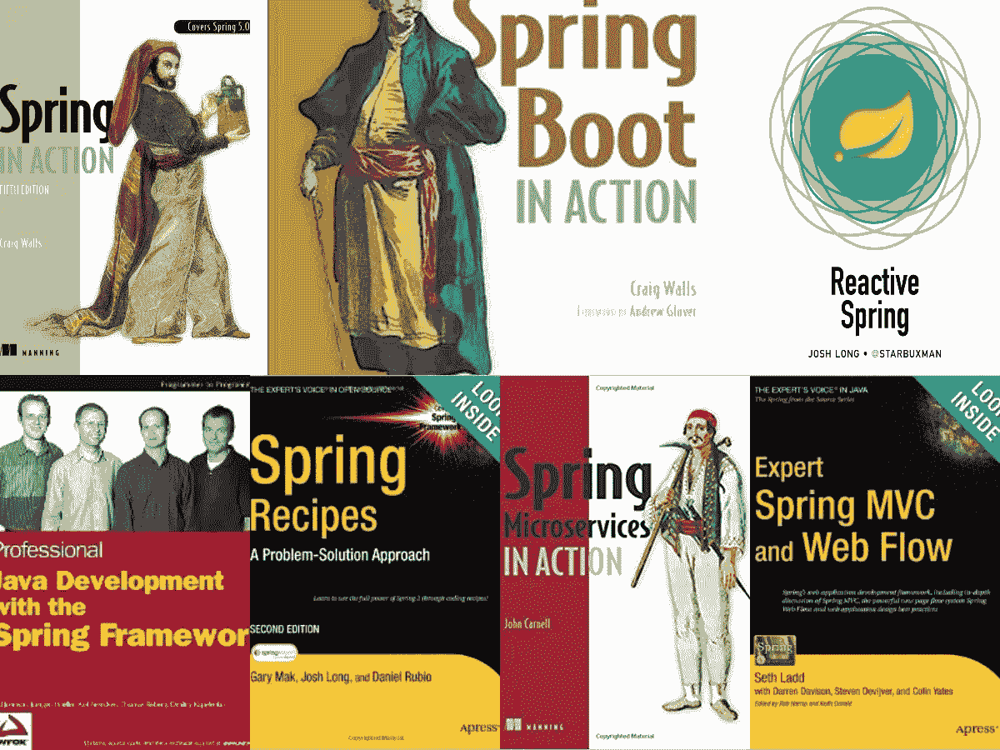
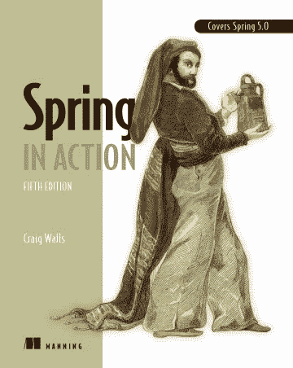
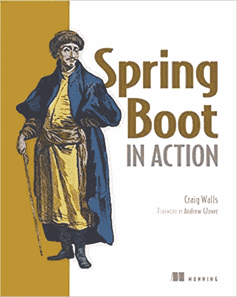
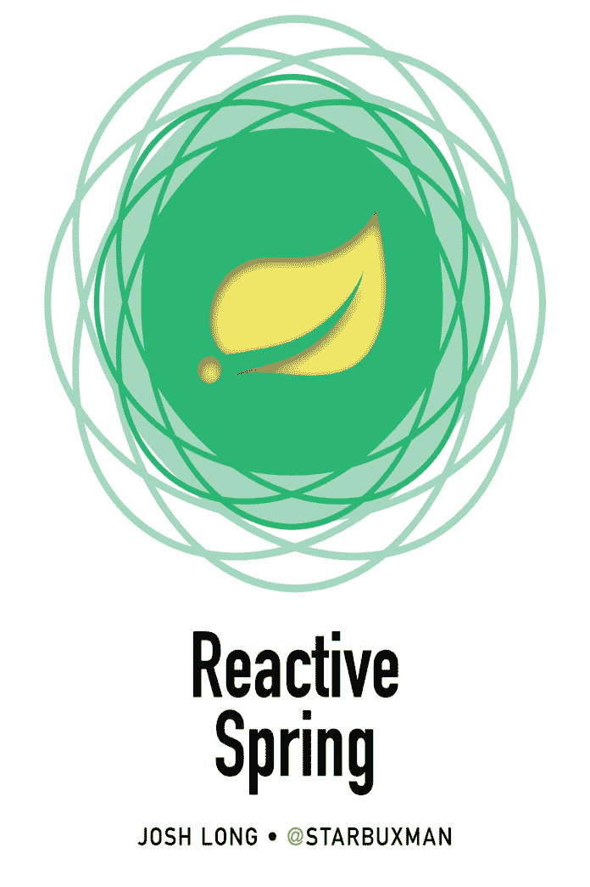
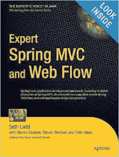
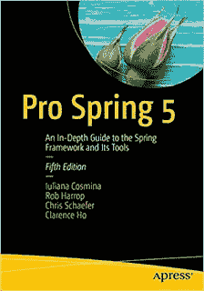
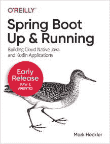
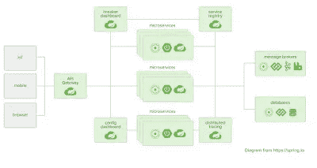

# 2023 年 Java 开发人员的 10 本最佳 Spring 框架书籍

> 原文：<https://medium.com/javarevisited/10-best-spring-framework-books-for-java-developers-360284c37036?source=collection_archive---------0----------------------->

## Java 开发人员深入学习核心 Spring、Spring Boot、Spring Security 和 Spring MVC 的最佳 Spring 书籍集

大家好，如果你是一名 Java 开发人员，想要掌握 Spring 框架并寻找最好的书籍，那么你来对地方了。之前，我已经分享了[最佳 Spring 框架课程](/javarevisited/10-best-online-courses-to-learn-spring-framework-in-2020-f7f73599c2fd)，在本文中，我将分享深入学习 Spring 框架的最佳书籍。该列表包括关于 Spring Core、Spring MVC、Spring Boot 甚至 Spring Security 的书籍。

如果你知道的话，Spring 和 Spring MVC 是最流行的 Java 框架之一，现在大多数新的 Java 项目都使用 Spring。Java 程序员经常会问类似*学习 Spring MVC* 哪些书好或者*学习 Spring 框架*什么书最好等等问题。

其实有很多书和课程可以[学习 Spring](/javarevisited/top-10-free-courses-to-learn-spring-framework-for-java-developers-639db9348d25) 、 [Spring Boo](/javarevisited/10-advanced-spring-boot-courses-for-experienced-java-developers-5e57606816bd?source=collection_home---4------0-----------------------) t、 [Spring MVC](https://www.java67.com/2012/08/spring-interview-questions-answers.html) ，但是只有某些书因为内容、例子，或者他们解释 Spring 框架中涉及的概念的方式，才可以被认为是好的。

与[Java 编程十大书籍](http://javarevisited.blogspot.com/2013/01/top-5-java-programming-books-best-good.html)类似，我们将在本文中介绍一些关于 Spring 的好书，它们不仅帮助初学者开始使用 Spring，还教授一些最佳实践。

要学习一项新技术或一个新框架，最好的方法可能是开始寻找提供的文档，而 [Spring Framework](https://spring.io/projects/spring-framework) 在这方面并不缺乏。Spring 提供了优秀的、详细的文档来使用 Spring 框架的各种特性，但是尽管如此，没有什么可以取代一本好书。

幸运的是，spring 和 Spring MVC 都得到了几个很好的标题，它们不仅解释了像[依赖注入和控制反转](http://javarevisited.blogspot.com/2012/12/inversion-of-control-dependency-injection-design-pattern-spring-example-tutorial.html)这样的概念，这是 Spring 框架的核心，而且涵盖了 Spring 的另一个重要方面。

以下是一些关于 Spring 和 Spring MVC 的好书，可以帮助你学习 Spring。Java 开发人员也经常[一起学习 Spring](/javarevisited/top-5-spring-professional-certification-exam-resources-for-java-developers-3ef9fa42fe13?source=---------38------------------) 和 [Hibernate](/javarevisited/top-5-hibernate-online-training-courses-for-beginners-and-advance-java-programmers-469460596b2b) 因为大量需求 Java Web 开发人员的简历中有 Hibernate 和 Spring。

# 2023 年学习 Spring 框架、Spring MVC、Spring Boot 和 Spring 安全的十大书籍

下面是我列出的*学习 Spring MVC 和 Spring 框架*的十大书籍。如果你在春天遇到任何其他值得加入这个列表的好书，请告诉我。

## 1.[春天在行动(第五版)](https://www.amazon.com/Spring-Action-Craig-Walls/dp/1617294942?tag=javamysqlanta-20)

我的许多读者认为曼宁的《春天在行动》是学习春天的最佳书籍之一。这似乎是一本值得一读的书。我简单看过它的内容，确实涵盖了 Spring 和 Spring MVC。

所以如果你在找一本既学习 Spring MVC 用于 web 开发，又学习 Spring core 用于在核心 Java 应用中使用 Spring 框架作为 DI 和 IOC 容器的通俗读物，那么 Spring in Action 绝对是正确的选择。

为了更快更好地学习，您还可以将本书与 [**Spring Framework 5:初学者到大师**](https://click.linksynergy.com/fs-bin/click?id=JVFxdTr9V80&subid=0&offerid=323058.1&type=10&tmpid=14538&RD_PARM1=https%3A%2F%2Fwww.udemy.com%2Fspring-framework-5-beginner-to-guru%2F) 课程相结合，帮助您进行初始设置，并提供更主动的学习。

## 2. [Spring Boot 在行动](https://www.amazon.com/Spring-Boot-Action-Craig-Walls/dp/1617292540?tag=javamysqlanta-20)

这是向 Craig Walls 学习 Spring Boot 的最好的书，Craig Walls 通过他的经典著作 *Spring in Action* 教授了大多数 Java 开发人员 Spring 框架。

克雷格有一种奇妙的能力，用简单的语言和漂亮的类比解释复杂而乏味的概念。除此之外，你还会在这本书里找到许多美丽的例子。

这本书涵盖了 Spring Boot 几乎所有的基本主题，从[自动配置](http://www.java67.com/2018/06/top-15-spring-boot-interview-questions-answers-java-jee-programmers.html)和初学者依赖，以及 Spring Boot 如何简化 Java 开发的一般概念。

这本书进一步探索了高级概念，如 Spring Boot 致动器，以了解 Spring Boot 应用程序内部发生了什么。它还着眼于 Spring Boot CLI，用 [Groovy](http://javarevisited.blogspot.sg/2018/02/top-3-jvm-languages-java-programmer-learn.html#axzz56WXxxAC0) 进行更简单的 Java Spring 开发。

万一你想要更主动的学习，你可以把这本书和 Udemy 的**[**100 步学 Spring Boot——初学者到专家**](https://click.linksynergy.com/fs-bin/click?id=JVFxdTr9V80&subid=0&offerid=323058.1&type=10&tmpid=14538&RD_PARM1=https%3A%2F%2Fwww.udemy.com%2Fspring-boot-tutorial-for-beginners%2F) 课程结合起来，两全其美。**

****

## **3.[弹簧微服务在行动](https://www.amazon.com/Spring-Microservices-Action-John-Carnell/dp/1617293989?tag=javamysqlanta-20)**

**软件开发界越来越倾向于微服务架构，因为它在开发、支持、部署、可伸缩性和可靠性方面提供了许多好处。

谢天谢地 Spring framework 提供了 [Spring Boot](https://javarevisited.blogspot.com/2018/05/top-5-courses-to-learn-spring-boot-in.html) 和 [Spring Cloud](https://dzone.com/articles/top-5-books-to-learn-spring-boot-and-spring-cloud) 这样的工具，可以用来用 Java 写微服务。

如果你热衷于用 Spring 框架进行微服务开发，那么这本书就是给你的。**

**如果你愿意，还可以把这本书与同为博主、Udemy 畅销书作家的 Ranga Karnam 的《与 Spring Boot 的 [**大师微服务》和《春云**](https://click.linksynergy.com/deeplink?id=JVFxdTr9V80&mid=39197&murl=https%3A%2F%2Fwww.udemy.com%2Fcourse%2Fmicroservices-with-spring-boot-and-spring-cloud%2F) 结合起来。如果你正在寻找一些实用的知识，这是一个很好的课程。**

****

## **[4。反作用弹簧](https://www.amazon.com/Reactive-Spring-Josh-Long-ebook/dp/B08H4QZFM8/?tag=javamysqlanta-20)**

**反应式编程是软件开发的未来，这似乎是另一本关于使用 Spring 学习反应式编程的好书。**

**这本书将涵盖反应式编程中的重要概念，包括 project Reactor 和反应式流规范、数据访问、web 编程、带有 RSocket 等协议的 RPC、测试、集成和合成等。**

**这本书现在已经完成了。我还没有读过这本书，但很快就会读了，我把它放在这里是因为乔希·朗(作者)自己推荐了这本书。你可以在亚马逊上买到这本书，现在有平装本和 Kindle 两种版本。**

**如果你需要课程，可以去 Udemy 上看看这个[用 Spring 框架进行反应式编程](https://click.linksynergy.com/deeplink?id=JVFxdTr9V80&mid=39197&murl=https%3A%2F%2Fwww.udemy.com%2Fcourse%2Freactive-programming-with-spring-framework-5%2F)的课程。这是一门学习 Reactive 编程和 WebFlux 框架的实践课程，但如果你需要更多的选择，你也可以查看这个[最佳 Spring Boot Reactive 和 WebFlux 课程列表。](/javarevisited/7-best-webflux-and-reactive-spring-boot-courses-for-java-programmers-33b7c6fa8995)**

****

## **5.[春运安保在行动](https://www.amazon.com/Spring-Security-Action-Laurentiu-Spilca/dp/1617297739?tag=javamysqlanta-20)**

**这是一本优秀的书，最初我觉得很无聊。当我读到前几章的时候，我正要把它放下，但是真正的行动是从春天安全的深潜开始的。**

**这本书有很多示例代码，它不仅要求你阅读，还要求你工作；我的意思是，尝试和测试示例应用程序，并与每个新概念一起构建，这非常好。

它也很好地解释了基本细节，因为它告诉你当你添加`<http>`标签时会发生什么，[什么是安全上下文](https://javarevisited.blogspot.com/2018/02/what-is-securitycontext-and-SecurityContextHolder-Spring-security.html)，拦截 url 的顺序如何重要，以及使用`security=none`省略 CSS 和 JavaScript 其他 URL 的后果。

总而言之，这是一本完整的书，不仅涵盖了基础知识，还涵盖了高级细节，此外，它也是最新的课程，因为它涵盖了 Spring Security 5，如果你需要一门课程，那么你也可以将这本书与 [**Spring Security Core:初学者到大师**](https://click.linksynergy.com/deeplink?id=JVFxdTr9V80&mid=39197&murl=https%3A%2F%2Fwww.udemy.com%2Fcourse%2Fspring-security-core-beginner-to-guru%2F) Udemy 课程结合起来。**

****

**我非常感谢《春天的安全在行动》的作者和出版商 laurențiu·斯皮克和曼宁创作了这本优秀的书。**

## **6.ExpertSpring MVC 和 Web Flow**

**Seth Ladd，Darren Davison，Steven Devijver，Colin Yates 的专家 Spring MVC 和 Web Flow 是我最喜欢的关于 Spring MVC 的书籍之一，也可以说是 Spring MVC 中最好的书籍之一。它深入介绍了 Spring MVC 和 web flow，并通过简单的解释解释了每个概念。

我向任何正在学习 Spring MVC 框架的初学者强烈推荐这本书。他们关于 Spring 基础的章节也是学习 Spring 中依赖注入和控制反转的最好方法之一，我自己[从那一章学到了 d I 和 IOC](http://javarevisited.blogspot.com/2013/06/spring-helloworld-example-in-java-using-3.0-dependency-injection.html) 。

这是我向任何熟悉 Java web 技术或任何类似 Struts 的 MVC 框架的 Java web 开发人员推荐的春季书籍。此外，在我看来，他们关于 Spring 基础的章节是从 Spring 框架开始的最佳方式之一。

唯一缺失的一点是，这本书只讲了 Spring MVC 和 web flow，没有讲整个 Spring 框架。如果你想要一个全面的指南，那么你也可以加入本书的[**Spring Master Class——初级到专家**](https://click.linksynergy.com/fs-bin/click?id=JVFxdTr9V80&subid=0&offerid=323058.1&type=10&tmpid=14538&RD_PARM1=https%3A%2F%2Fwww.udemy.com%2Fspring-tutorial-for-beginners%2F) 课程，深入学习 Spring MVC 和 Spring Core。本课程是本书的完美伴侣，因为它涵盖了本书没有涵盖的领域。**

****

## **7.[春季 5 食谱——解决问题的方法](https://www.amazon.com/Spring-5-Recipes-Problem-Solution-Approach/dp/1484227891?tag=javamysqlanta-20)**

**这又是一本关于 Spring Framework 的好书，我最喜欢了。这本书是 Spring 菜谱或者如何在 Spring 框架下做的集合。**

**在每个 Spring 食谱中，你都会学到一些新概念，这也有助于学习 Spring 的基础知识，比如它们的食谱，帮助我学习[何时使用 ApplicationContext 和 BeanFactory](http://javarevisited.blogspot.ca/2012/11/difference-between-beanfactory-vs-applicationcontext-spring-framework.html) 以及[构造函数与设置函数的注入](http://javarevisited.blogspot.sg/2012/11/difference-between-setter-injection-vs-constructor-injection-spring-framework.html)。

这本书的一大亮点是，它是一种**解决问题的方法**。因为它的教学风格不同于任何流行的书籍，所以它是 Spring 文档的一个很好的补充。**

**这些书还提供了许多 spring 技术的精彩报道，如 [Spring Security](http://javarevisited.blogspot.sg/2011/11/ldap-authentication-active-directory.html) 、 [Spring Boot](https://dev.to/javinpaul/top-10-courses-to-learn-spring-boot-and-microservices-for-java-programmers-3hjg) 、[微服务](/javarevisited/top-5-courses-to-learn-microservices-in-java-and-spring-framework-e9fed1ba804d)、Spring JDBC、Spring 和 [EJB](http://javarevisited.blogspot.com/2012/03/top-10-ejb-interview-question-and.html) 、JMX、电子邮件，并且还有一章是关于脚本的。

如果你喜欢关于问题解决方法的书籍，那么你会喜欢阅读 Spring Recipes，这不是 Spring 中最好的书，但仍然是一本好书，并且肯定会在 Spring 框架上的*前 10 本书的名单中。***

****

## **8.使用 Spring 框架进行专业 Java 开发**

**这本书的主要亮点是它的作者之一是 Rod Johnson，他也创建了 Spring 框架。所以你得到了他对 Spring 的看法，以及应该如何使用 Spring，Spring 中应该遵循的最佳实践是什么，比如[何时使用 Setter 注入和 Constructor 注入](http://javarevisited.blogspot.com/2012/11/difference-between-setter-injection-vs-constructor-injection-spring-framework.html)。

这本书很好的覆盖了 Spring 框架，包括 Spring-core、Spring MVC、Spring ORM 支持等。此外，本书中的例子很容易理解，并且它也关注于[单元测试](http://javarevisited.blogspot.com/2012/08/best-practices-to-write-junit-test.html)，这是很好的实践。

虽然我对这本书评价不高，如果你的重点是 [Spring MVC](https://javarevisited.blogspot.com/2018/11/top-20-spring-mvc-interview-questions-answers-for-java-developers.html) 那么*专家 Spring MVC 和 Web flow* 是最好的 Spring 书籍。如果您正在寻找 Spring 特性的概述，那么 Spring 文档是最好的读物。

正如我说过的，这本书的积极之处在于《知春》来自作者罗德·约翰逊本人。一旦你对 Spring 框架有了基本的了解，你就可以阅读这本书，让作者来查看它。**

****

## **9. [Pro 弹簧 5.0](https://www.amazon.com/Pro-Spring-Depth-Guide-Framework/dp/1484228073?tag=javamysqlanta-20)**

**Pro Spring 是一开始就学习 Spring 框架的最佳书籍之一。这本书非常庞大，试图涵盖大多数 Spring 概念，像 Spring 基础、 [JDBC 支持](http://javarevisited.blogspot.com/2012/06/jdbc-database-connection-pool-in-spring.html)、事务支持、Spring AOP、 [Spring Web MVC](/javarevisited/21-spring-mvc-rest-interview-questions-answers-for-beginners-and-experienced-developers-21ad3d4c9b82) 、Spring 测试等等。

这本书的优点是它很传统，容易阅读，它解释了概念，后面是一个很好的例子，这是一个很好的学习方法。令人担忧的是纯粹的规模；到目前为止，我还没有完成这本书，只是提到了一些话题。

好的一点是这本书涵盖了 **Spring 5.0，**也就是最新的稳定版。正如我所说的，这是关于 Spring 框架的最全面的书籍之一，对于任何想通过一本书来学习 Spring 框架的人来说，Pro Spring 5.0 是一个不错的选择。**

**如果你正在寻找一些学习 Hibernate 和 Spring 的好书，那么你也可以看看我的文章 [5 本学习 Hibernate 的好书](http://javarevisited.blogspot.com/2014/01/top-5-hibernate-books-for-java-programmers-learning.html)。**

****

## **10. [Spring Boot:开始运行](https://www.amazon.com/Spring-Boot-Running-Building-Applications/dp/1492076988?tag=javamysqlanta-20)**

**这是一本学习 Spring Boot 的好书，作者是来自 VMware 的 Mark Heckler，他是 Spring 的幕后公司，他指导你了解 Spring Boot 的架构和方法，以及调试、测试和部署等主题。我**

**如果你想用 Spring Boot 快速有效地开发[云原生 Java](/hackernoon/top-5-spring-boot-and-spring-cloud-books-for-java-developers-75df155dcedc?source=---------23------------------) 或 [Kotlin](/javarevisited/top-5-courses-to-learn-kotlin-in-2020-dfc3fa7706d8?source=---------16------------------) 应用——使用反应式编程、构建 API 和创建各种数据库访问——这本书就是为你准备的。这仍是一部进展中的作品，但值得一读。**

**为了更好的学习体验，你也可以将这本书与欧根·帕拉斯基夫的[**Learn Spring:The Certification Class**](https://courses.baeldung.com/p/ls-certification-class?utm_source=javarevisited&utm_medium=web&utm_campaign=lss&affcode=22136_bkwjs9xa)结合起来，这可能是从头开始学习 Spring 5 和 Spring Boot 2 的最佳课程，以一种有指导的、以代码为中心的方式**

****

## **11.Spring 文档**

**Spring framework 文档位于 SpringSource 网站上，这里是 Spring framework 3.1 HTML 格式的 Spring 文档的链接【https://spring.io/docs 虽然这不是一本书，但是 Spring 教程和 Spring 文档是学习 Spring framework 的另外两个来源，我强烈推荐。

主要原因是它们是免费的、高度综合的，并且有大量的例子来支持各种概念和特性。另外,**参考文档中最好的部分之一是它们用可用的最新 Spring 版本进行了更新**。用 Spring 的每个新版本更新书籍比更新文档更棘手。结合任何 Spring 书籍的 Spring 文档是学习 Spring 框架的最佳途径。**

**学习 Spring MVC，可以把 Spring 文档和更早的 Spring 书、**专家 Spring MVC 和 Web Flow、** [**Spring Framework:初学者到大师**](https://click.linksynergy.com/fs-bin/click?id=JVFxdTr9V80&subid=0&offerid=323058.1&type=10&tmpid=14538&RD_PARM1=https%3A%2F%2Fwww.udemy.com%2Fspring-framework-5-beginner-to-guru%2F) 课程联系起来，进行实用的、动手的学习。**

****

**这些是学习 Spring 框架和 Spring MVC 的一些**最佳书籍**。由于 Spring Framework 的更新和新发布，Spring 文档是独一无二的。鉴于 Spring 框架在新 Java 开发工作中的流行，每个 Java 开发人员都应该努力学习 Spring 框架。**

**其他**为 Java 程序员推荐书籍和课程****

*   **布莱恩·汉森的《春季基础》**
*   **完整的 Java 开发者路线图([指南](https://javarevisited.blogspot.com/2019/10/the-java-developer-roadmap.html#123))**
*   **面向 Java 开发人员的 10 大 Spring Boot 课程([课程](https://dev.to/javinpaul/top-10-courses-to-learn-spring-boot-and-microservices-for-java-programmers-3hjg))**
*   **Java 开发人员学习 Hibernate 的 5 本好书([见此](http://javarevisited.blogspot.com/2014/01/top-5-hibernate-books-for-java-programmers-learning.html))**
*   **布莱恩·汉森对 Spring MVC 4 的介绍([见](https://pluralsight.pxf.io/c/1193463/424552/7490?u=https%3A%2F%2Fwww.pluralsight.com%2Fcourses%2Fspring-mvc4-introduction))**
*   **每个程序员都应该读的 10 本书([多读](http://java67.blogspot.com/2015/03/10-books-every-programmer-and-software-engineer-read.html))**
*   **排名前五的数据结构和算法书籍([看这里](http://javarevisited.blogspot.com/2015/07/5-data-structure-and-algorithm-books-best-must-read.html))**
*   **快速学习 Java 8 的 5 本好书([见这里](http://java67.blogspot.com/2015/07/5-books-learn-java-8-functional-programming.html))**
*   **学习编程算法的 10 本好书([阅读更多](http://java67.blogspot.com/2015/09/top-10-algorithm-books-every-programmer-read-learn.html))**
*   **11 本很棒的免费 Java 编程书籍 PDF ( [下载](http://java67.blogspot.com/2013/11/10-free-java-programing-books-download-PDF-HTML.html))**
*   **学习春云的前 5 门课程([课程](https://javarevisited.blogspot.com/2018/02/top-5-spring-microservices-courses-with-spring-boot-and-spring-cloud.html))**
*   **深入学习 Spring 框架的前 5 门课程([课程](https://javarevisited.blogspot.com/2018/06/top-6-spring-framework-online-courses-Java-programmers.html))**
*   **有经验的程序员应该读的 5 本 Spring 框架书籍([书籍](https://javarevisited.blogspot.com/2018/04/5-spring-framework-books-experienced-Java-developers-2018.html))**

**感谢您阅读本文。如果你喜欢这些 *Spring 框架书籍*，那么请与你的朋友和同事分享。如果您有任何问题、反馈或建议，请留言。**

**如果你想深入学习如何使用 Spring MVC 开发 RESTful Web 服务，我建议你参加由欧根·帕拉斯基夫教授的 [**REST with Spring 认证课程**](http://courses.baeldung.com/p/rest-with-spring-the-certification-class?affcode=22136_bkwjs9xa) 。用 Spring MVC 学习 REST 最好的课程之一。**

**<http://courses.baeldung.com/p/rest-with-spring-the-certification-class?affcode=22136_bkwjs9xa> **