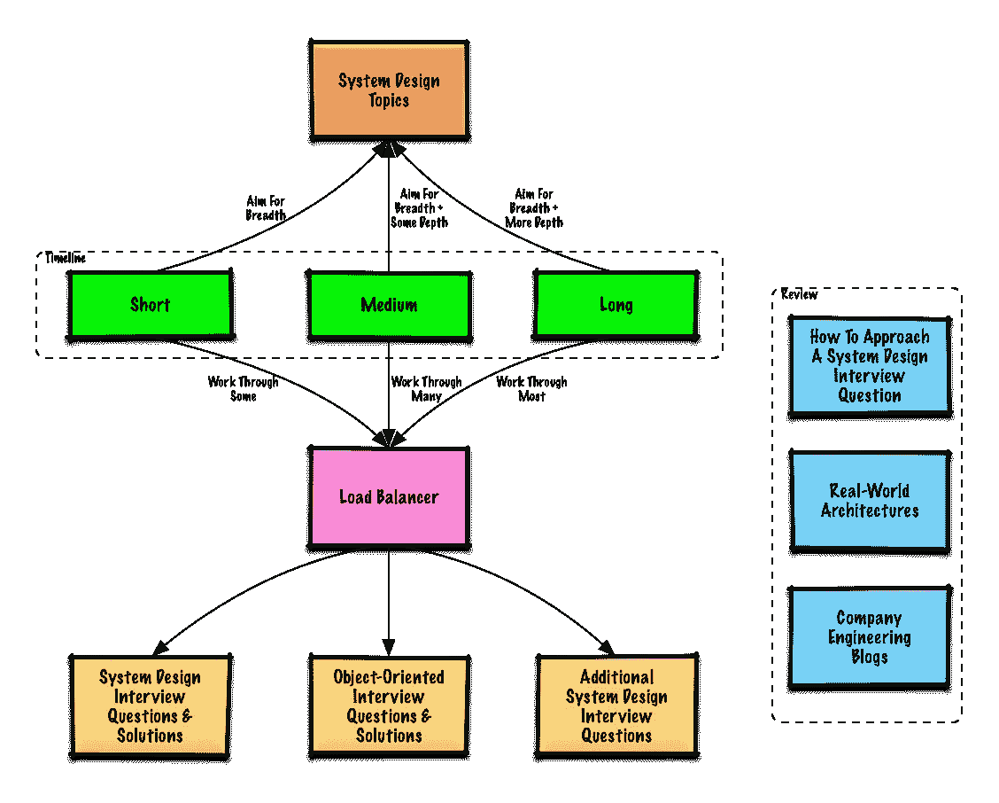
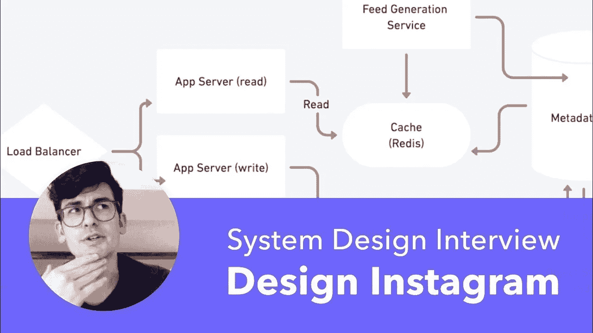
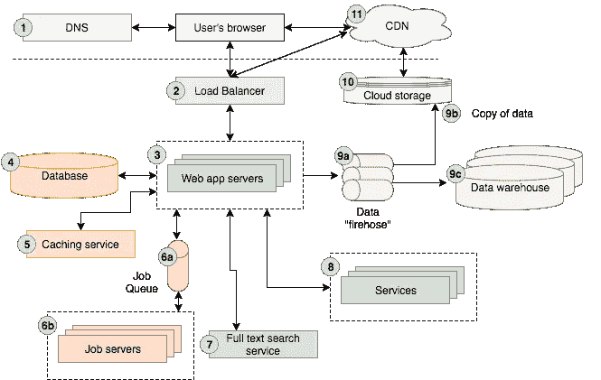
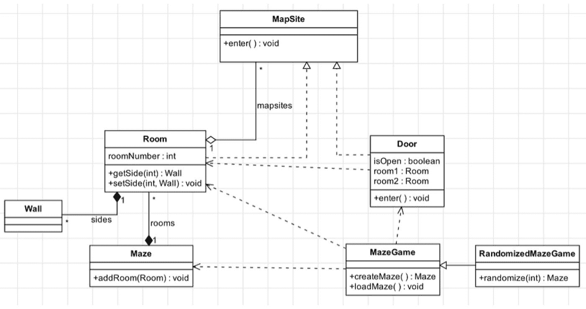
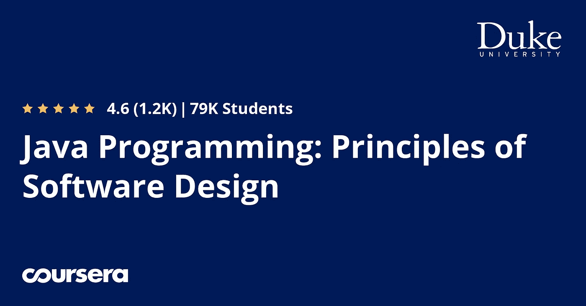
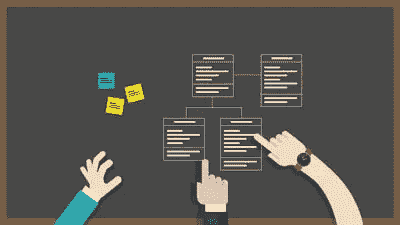

# 2023 年编码面试 10 大最佳系统设计课程

> 原文：<https://medium.com/javarevisited/10-best-system-design-courses-for-coding-interviews-949fd029ce65?source=collection_archive---------0----------------------->

## 这些是 2023 年学习 Udemy、edX 和 Educative 的系统设计的最佳在线课程

你好伙计们，如果你正在准备编码面试并寻找**最佳系统设计课程**，那么你来对地方了。系统设计是最难的主题之一，许多候选人无法回答与系统设计、可伸缩性、负载平衡和故障转移相关的问题，而这些问题是通过面试的关键。

我分享对编码面试有用的课程已经有一段时间了，就像之前一样，我已经分享了 [**最佳算法课程**](/javarevisited/7-best-courses-to-learn-data-structure-and-algorithms-d5379ae2588?source=---------18------------------)[SQL 课程](/hackernoon/top-5-sql-and-database-courses-to-learn-online-48424533ac61)[动态编程](/javarevisited/6-best-dynamic-programming-courses-for-coding-interviews-14744060923c)和[面向程序员的 Linux 课程](/javarevisited/top-10-courses-to-learn-linux-command-line-in-2020-best-and-free-f3ee4a78d0c0?source=collection_home---4------0-----------------------)，今天，我将谈论掌握面试系统设计的最佳在线课程。

这些系统设计课程选自流行的在线学习平台和网站，如 [Udemy](/javarevisited/10-best-udemy-online-courses-for-java-developers-4c9ab70cd01f) 、 [Coursera](/javarevisited/18-coursera-courses-you-can-join-in-2020-to-learn-from-the-worlds-top-tech-companies-google-74af46967d1e?source=collection_home---4------0-----------------------) 、 [edX](/javarevisited/10-free-best-edx-certifications-and-courses-to-learn-online-3473d466f968) 和 [Educative](https://javarevisited.blogspot.com/2020/05/top-10-educative-courses-for-programmers.html) ，这些课程是由看过双方访谈的专家创建的。

一路上，我还分享了有用的系统设计 YouTube 视频，在那里你可以了解一些[流行的系统设计问题](/javarevisited/25-software-design-interview-questions-to-crack-any-programming-and-technical-interviews-4b8237942db0)，比如停车场和设计一个像 Whatsapp 或微信这样的免费信使服务。

系统设计面试在脸书、亚马逊、苹果、网飞和谷歌等科技巨头和 FAANG 公司非常常见。他们不同于[编码面试](/javarevisited/20-binary-tree-algorithms-problems-from-coding-interviews-c5e5a384df30)或[数据结构和算法面试](/hackernoon/50-data-structure-and-algorithms-interview-questions-for-programmers-b4b1ac61f5b0)，但可能更难。

这些在线课程将帮助你学会在谷歌、优步和其他 FAANG 公司等科技公司进行系统设计面试的有用技巧。

# 2023 年程序员和开发者的 10 门最佳系统设计课程

在不浪费你更多时间的情况下，这里是我列出的一些学习软件设计和架构的很棒的、互动的、有趣的在线课程。这些确实是你可以参加的学习这一基本技能或提高你的系统设计技能的最好的在线课程。

## 1.[掌握系统设计采访弗兰克·凯恩](https://click.linksynergy.com/deeplink?id=JVFxdTr9V80&mid=39197&murl=https%3A%2F%2Fwww.udemy.com%2Fcourse%2Fsystem-design-interview-prep%2F)

如果你正在寻找 Udemy 课程为系统设计做准备，那么你应该看看这个由前亚马逊招聘经理 Frank Kane 教授的系统设计面试课程。

在本课程中，Frank 分享了他在 FAANG 面试中处理系统设计问题的第一手经验。您不仅会学到解决系统设计问题的所有技巧、概念和方法，还会练习许多经典的系统设计问题，如 URL shorter、Web Crawler 和设计餐馆预订系统。

在这个长达 5 小时的系统设计课程中，您将学到以下重要内容:

*   学习扩展分布式系统和服务车队的技术
*   数据库技术和“ **NoSQL** ”解决方案概述
*   如何使用**缓存**来提高可伸缩性和性能
*   如何设计**弹性**和处理故障
*   如何使用**分布式存储**解决方案
*   如何用 Apache Spark 处理**大数据**
*   **云计算**资源概述

除此之外，它还提供了六个完整的模拟面试，包括真实世界的系统设计面试问题以及成功进行技术面试的一般提示和技巧。您还将学习构建系统设计面试的面试策略

使本课程与其他系统设计课程不同的是 Frank Kane 的第一手经验以及他的声音和教学风格，这确实使学习变得非常有吸引力和富有成效。

**这里是加入本课程的链接**——[掌握系统设计面试](https://click.linksynergy.com/deeplink?id=JVFxdTr9V80&mid=39197&murl=https%3A%2F%2Fwww.udemy.com%2Fcourse%2Fsystem-design-interview-prep%2F)

## 2.[钻研制度设计面试](https://www.educative.io/collection/5668639101419520/5649050225344512?affiliate_id=5073518643380224)【教育性】

这是我学习软件设计或系统设计时最喜欢的课程之一。它是为你准备系统设计面试而创建的，但是你也可以用它来学习一般的系统设计方法。

[*钻研系统设计面试*](https://www.educative.io/collection/5668639101419520/5649050225344512?affiliate_id=5073518643380224) *，*是详细描述大规模分布式系统设计问题的第一门课程(或书)之一。即使您以前从事过分布式系统的工作，您也可以从本课程中学到很多东西。

作者创建了本课程，为您提供设计选择(包括利弊)，以便您能够理解需求，比较方法，并为手头的问题提出最佳解决方案。

他们还注意不要提供适合 45 分钟讨论的解决方案。这使得课程非常有趣

**这是参加本课程** — [系统设计面试](https://www.educative.io/collection/5668639101419520/5649050225344512?affiliate_id=5073518643380224)的链接

即使你没有准备[编码面试](https://hackernoon.com/10-data-structure-algorithms-and-programming-courses-to-crack-any-coding-interview-e1c50b30b927)，我也建议你参加这个课程来提高你的系统设计技能。他们现在也有一个续集叫做[探索先进的系统设计](https://www.educative.io/courses/grokking-adv-system-design-intvw?affiliate_id=5073518643380224)，这更加增强了这个伟大的课程。

## 3. [ByteByteGo 系统设计面试课程由 Alex Xu](https://bytebytego.com?fpr=javarevisited)

如果你正在准备系统设计面试，那么你很有可能遇到过著名的 [**《系统设计面试》——一本内部人士指南**](https://www.amazon.com/System-Design-Interview-insiders-Second/dp/B08CMF2CQF/?tag=javamysqlanta-20) 的书，这是我最喜欢的一本书，也是继 [*设计数据密集型应用*](https://www.amazon.com/Designing-Data-Intensive-Applications-Reliable-Maintainable/dp/1449373321?tag=javamysqlanta-20) 之后最值得推荐的一本系统设计书。

但是，没有多少人知道他在 [ByteByteGo](https://bytebytego.com?fpr=javarevisited) 还有一门优秀的配套系统设计课程，在那里你可以更深入地学习系统设计。

本课程不仅涵盖了他在书中教授的所有内容，还包括了本课程独有的额外材料，我尤其喜欢他详细的系统设计图，该图不仅解释了体系结构，还解释了系统的具体工作原理和实现方式。

无论你是否读过这本书，这门课程都是不容忽视的。你不仅会学到如何设计大型系统，还会学到几个关键的计算机科学概念，这些概念将会为你服务很长一段时间。你可以参加这个课程，年费大约 50 美元，我强烈推荐这个课程给任何想深入学习系统设计的人。

**以下是参加本课程**——[徐](https://bytebytego.com?fpr=javarevisited)系统设计面试课程的链接

## 4.[指数系统设计面试课程](https://www.tryexponent.com/courses/system-design-interview?ref=javinpaul2)【最佳网站】

这是软件工程师准备参加谷歌、亚马逊、网飞、Meta 和苹果等公司的系统设计面试的另一个很好的资源。本系统设计课程与列表中其他课程的不同之处在于互动课程和练习，它们真正有助于理解系统设计概念。

在这个交互式系统设计课程中，你将学习如何用深入的例子和基本概念来回答系统设计问题。他们还提供完整的面试演练和模拟面试，这可以帮助你评估你的准备水平，并通过在真实的面试场景中练习来平静你的紧张情绪。

这门课程由雅各布·西蒙(Jacob Simon)教授，他是一名前 Dropbox 工程师，经历过同样的过程，教授了超过 14，000 人的系统设计概念。

本课程分为两部分，第一部分你将学习系统设计的基础知识，第二部分你将练习系统设计问题，如设计 Facebook Messenger、设计 URL shortner、设计 Twitter、Instagram、YouTube、抖音和停车场。

您还将了解一些回答系统设计问题的技巧，以及如何将一个整体应用程序分解为微服务架构。这实际上是一个很好的系统设计面试准备网站，他们也有亚马逊、脸书和谷歌面试的专门课程。我强烈建议你去看看。

**这里是指数加入本课程**——[系统设计面试课程的链接](https://www.tryexponent.com/courses/system-design-interview?ref=javinpaul2)

## 5.[精通编码面试:系统设计+架构](https://academy.zerotomastery.io/a/aff_z8vtj3dk/external?affcode=441520_zytgk2dn)【ZTM】

这是一门相对较新的系统设计和架构在线课程，最近由张一华和安德鲁·尼高里在 ZTM 学院推出。ZTM 代表“零到精通”,由广受欢迎的 Udemy 讲师 Andrew 创建，以一笔费用提供他所有最畅销的课程。

在本课程中，您将学习系统设计，牢记 FAANG 访谈，如基本系统设计概念、水平和垂直扩展、弹性、如何在主动-主动和主动-被动模式下运行、部署策略、工具等。

以下是您将在本系统设计课程中学到的重要内容:

1.  CAP 定理
2.  TCP 和 UDP 协议
3.  缩放(水平和垂直缩放)
4.  缓存、DNS 和负载平衡器
5.  数据库、作业、队列和服务
6.  云、集群和 ACID

总的来说，这是一个很好的、最新的系统设计面试课程，尤其是学习基本的系统设计概念和架构。

**这里是加入本课程的链接** — [掌握编码面试:系统设计+架构](https://academy.zerotomastery.io/a/aff_z8vtj3dk/external?affcode=441520_zytgk2dn)

顺便说一句，你需要一个 [**ZTM 会员**](https://academy.zerotomastery.io/a/aff_c0gnlvf7/external?affcode=441520_zytgk2dn) 才能观看这个课程，这个课程每月花费大约 39 美元，但也提供了许多像这样超级吸引人和有用的课程。您还可以使用优惠券代码 FRIENDS10 获得本课程或您选择的任何订阅的 10%折扣。

 [## 学习需求技能。被录用。推进你的事业。|零到精通

### 最终你是唯一能控制它的人。呵呵......每个人学习的速度不同，但是学生…

academy.zerotomastery.io](https://academy.zerotomastery.io/a/aff_c0gnlvf7/external?affcode=441520_zytgk2dn) 

## 6.[软件设计和架构专业化课程](https://coursera.pxf.io/c/3294490/1164545/14726?u=https%3A%2F%2Fwww.coursera.org%2Fspecializations%2Fsoftware-design-architecture)

这是从 Coursera(一个伟大的在线门户网站)学习软件设计和架构的另一个结构良好的课程。它由阿尔伯塔大学提供，由王信明交付。

该专业包含五门在线课程，教授您面向对象设计、设计模式、软件架构和面向服务架构( [SOA](https://javarevisited.blogspot.com/2019/09/top-5-courses-to-learn-soa-service-oriented-architecture-microservices.html) )。

专业化还包括一个项目，完成课程后你将获得证书。这个专业最棒的部分是你将学习[软件设计和架构](https://javarevisited.blogspot.com/2019/03/5-courses-programmers-can-join-to-learn.html)背后的科学。

一旦你知道了相关的模式和原则，与你的程序员同事和利益相关者交流你的计划就容易多了。您还将获得从设计角度批判性地看待软件或代码的能力。

**这是加入本软件设计课程** — [软件设计和架构专业化](https://coursera.pxf.io/c/3294490/1164545/14726?u=https%3A%2F%2Fwww.coursera.org%2Fspecializations%2Fsoftware-design-architecture)的链接

## 7.[Udemy 上脸书理工学院领导的系统设计面试指南](https://click.linksynergy.com/deeplink?id=JVFxdTr9V80&mid=39197&murl=https%3A%2F%2Fwww.udemy.com%2Fcourse%2Fsystem-design-a-comprehensive-guide%2F)

这是另一个 Udemy 畅销书课程，为初学者和有经验的程序员准备系统设计面试。它讨论了产品公司目前提出的大多数问题的解决方案，并通过简单的真实例子解释了各种概念。

通过学习本课程，您将了解在系统设计面试中可能遇到的所有常见问题的解决方案，例如:

1.  TinyURL 的系统设计
2.  Airbnb 的系统设计
3.  Whatsapp messenger 的系统设计
4.  Youtube 的系统设计

还有更多…

您还将成为一些常见概念的专家，这些概念从系统设计的角度来看是很重要的，它们在现实系统中的应用也是如此。本课程中涉及的一些关键概念包括:

1.  负载平衡器
2.  隐藏所
3.  数据库ˌ资料库
4.  同步或异步
5.  SQL 或 NoSQL
6.  消息队列
7.  数据库设计

本课程由一位脸书工程师教授，他已经通过了 FAANG 公司的系统设计面试，本课程是一个学习他的经验的好机会。

**这里是加入本课程的链接** - [系统设计面试指南](https://click.linksynergy.com/deeplink?id=JVFxdTr9V80&mid=39197&murl=https%3A%2F%2Fwww.udemy.com%2Fcourse%2Fsystem-design-a-comprehensive-guide%2F)

## 8.[网络应用&软件架构 101](https://www.educative.io/courses/web-application-software-architecture-101?affiliate_id=5073518643380224)

这是 Educative 的又一门学习 Web 应用架构的优秀课程。在本课程中，您将了解不同的架构风格，如 monolith、[微服务](/javarevisited/top-5-courses-to-learn-microservices-in-java-and-spring-framework-e9fed1ba804d)、客户端-服务器、3 层架构、分散式对等架构，以及请求和数据如何在 web 应用程序中移动。

您还将了解如何从大处着眼，从层次、性能、可伸缩性和高可用性方面进行思考，这是当今应用程序的必备条件。

本课程不仅介绍了不同的体系结构模式，还解释了每种方法的优缺点，并带您经历一个不同的场景，其中某个特定的体系结构比其他的更适合。

**这里是加入本架构课程** — [Web 应用&软件架构 101](https://www.educative.io/courses/web-application-software-architecture-101?affiliate_id=5073518643380224) 的链接

老实说，这是最好的设计和架构课程，不仅对高级开发人员，而且对每个软件开发人员都是如此，因为它将拓展你的思维过程，让你成为一个更自信的 web 开发人员。

现在的课程有很大的折扣，只需 53 美元，原价 79 美元，对他们来说有点贵，但是值得。

另一方面，如果你喜欢 Educative 这个平台，你也可以购买订阅，每月只需 17 美元 **(** [**五折**](https://www.educative.io/subscription?affiliate_id=5073518643380224) **)** ，我有一个，强烈推荐你去获得。

 [## 介绍:教育性订阅。获得无限制的访问权限！

### Educative 提供编程和编码面试准备课程，涵盖几乎每一个框架，语言，和…

www.educative.io](https://www.educative.io/subscription?affiliate_id=5073518643380224) 

## 9[edX 的数据结构和软件设计](https://www.awin1.com/cread.php?awinmid=6798&awinaffid=631878&clickref=&p=%5B%5Bhttps%3A%2F%2Fwww.edx.org%2Fcourse%2Fdata-structures-and-software-design%5D%5D)

这是学习系统设计和软件设计的另一个很好的课程。本课程是软件开发专业证书课程 CS 基础的一部分。

本课程将通过教你如何编写“好的”软件，使你的技能更上一层楼，这些软件能够恰当地表示和组织数据，易于维护，并且具有高质量。

您不仅将学习如何将一组需求转化为高质量的[软件设计](http://javarevisited.blogspot.sg/2012/06/20-design-pattern-and-software-design.html#axzz55mVSPFfH)，还将学习如何编写易于阅读、理解和修改的高效代码。

这是一个学习两项基本技能[数据结构](https://www.java67.com/2019/07/top-10-online-courses-to-learn-data-structure-and-algorithms-in-java.html)和[软件设计](/javarevisited/top-5-courses-to-learn-software-architecture-in-2020-best-of-lot-5d34ebc52e9)的免费课程。该课程为期 4 周，每周需要 8-10 小时的努力。课程也提供证书，但是需要付费。

**这里是加入本设计课程** — [数据结构和软件设计](https://www.awin1.com/cread.php?awinmid=6798&awinaffid=631878&clickref=&p=%5B%5Bhttps%3A%2F%2Fwww.edx.org%2Fcourse%2Fdata-structures-and-software-design%5D%5D)的链接

## 10.[摇摆系统设计](https://click.linksynergy.com/deeplink?id=JVFxdTr9V80&mid=39197&murl=https%3A%2F%2Fwww.udemy.com%2Fcourse%2Frocking-system-design%2F)【新 Udemy 课程】

这是为系统设计面试做准备的另一个很好的课程。这个 Udemy 课程由云架构师 Rajdeep Saha 创建，它将使用真实的案例研究来教你如何准备这些面试。

您将对关键主题以及如何进行系统设计面试有一个很好的了解。本课程涵盖常见的[系统设计问题](https://dzone.com/articles/21-object-oriented-and-system-design-problems-to-p)的真实案例研究。

这里有一些你将在这个系统设计课程中学到的示例问题-

*   如何设计一个类似优步的 App(样题)
*   如何创建一个电子商务应用程序，并将其扩展到数百万用户
*   如何创建一个网站在网上卖电影票？将其扩展到数百万用户。
*   你会如何在社交网络中创建 feed 帖子？

总的来说，这是一门适合准备系统设计面试的课程。谈到社会证明，超过 3K 的学生参加了这门课程。

**这里是加入本课程的链接**——[准备系统设计面试](https://click.linksynergy.com/deeplink?id=JVFxdTr9V80&mid=39197&murl=https%3A%2F%2Fwww.udemy.com%2Fcourse%2Fpreparing-for-system-design-interviews%2F)

## 11.[安全软件设计专业](https://coursera.pxf.io/c/3294490/1164545/14726?u=https%3A%2F%2Fwww.coursera.org%2Fspecializations%2Fsecure-software-design)【Coursera】

这是一个很好的 Coursera 认证和学习安全设计的课程。安全性是现代软件设计的一个基本问题，这个专业的重点是教你如何设计安全的软件。

在 Coursera 专业化认证中有四门课程，不仅会向您展示安全软件设计的实践，还会向您介绍工具和安全线程以及如何减轻它们。

与 Coursera 的其他专业一样，所有四门课程都是免费审核的，但如果你需要一份结业证书，你需要支付少量费用，这可以添加到你的简历或 LinkedIn 个人资料中。

此证书赋予您向世界展示您对安全软件设计的了解的权利。科罗拉多大学提供这门课程。

**这是参加本课程** — [安全软件设计专业](https://coursera.pxf.io/c/3294490/1164545/14726?u=https%3A%2F%2Fwww.coursera.org%2Fspecializations%2Fsecure-software-design)的链接

顺便说一下，如果你计划参加多个 Coursera 课程或专业，那么考虑参加 [**Coursera Plus 订阅**](https://coursera.pxf.io/c/3294490/1164545/14726?u=https%3A%2F%2Fwww.coursera.org%2Fcourseraplus) ，它将为你提供无限制的访问他们最受欢迎的课程、专业、专业证书和指导项目的机会。

它每年花费大约 399 美元，但它完全值得你的钱，因为你可以获得无限的证书。

 [## Coursera Plus |无限制访问 7，000 多门在线课程

### 用 Coursera Plus 投资你的职业目标。无限制访问 90%以上的课程、项目…

coursera.pxf.io](https://coursera.pxf.io/c/3294490/1164545/14726?u=https%3A%2F%2Fwww.coursera.org%2Fcourseraplus) 

## 12.[系统设计:Whatsapp 或微信之类的信使服务——面试问题](https://www.youtube.com/watch?v=5m0L0k8ZtEs)

这是另一个 YouTube 视频，在这里你可以学习解决另一个流行的系统设计面试问题，关于设计 Whatsapp 或微信之类的消息应用程序。

这是一个[系统设计面试问题](https://www.java67.com/2018/05/top-20-system-design-interview-questions-answers-programming.html)在亚马逊、脸书、谷歌、微软和许多初创公司被问到:如何设计一个像 Whatsapp、微信或 Facebook messenger 这样的 Messenger 服务？

讲师将指导您完成这个面试问题，为您提供谈话要点，并指出要问的正确问题。一个快速简单的解释，即使这是你的第一个系统设计面试问题。

下面是 YouTube 视频，你可以观看它来解决这个系统设计问题:

## 13. [Java 编程:软件设计原理](https://coursera.pxf.io/c/3294490/1164545/14726?u=https%3A%2F%2Fwww.coursera.org%2Flearn%2Fjava-programming-design-principles)【Coursera】

这是 Java 程序员学习软件设计原理的一门极好的课程。在本课程中，您将学习如何使用多个类用 Java 解决现实世界中的问题。

您还将使用 Java 接口创建可伸缩的编程解决方案。认识到软件工程不仅仅是写代码，它还包括逻辑思维和设计。

作为课程的一部分，你还将学习一个分析和整理地震数据的程序，并开发一个预测文本生成器。如果你是一名 Java 程序员，我强烈推荐你学习这门课程。

它也是 [*Java 编程和软件工程基础专业化*](/javarevisited/review-of-courseras-java-programming-software-engineering-fundamentals-specialization-4dcfa0ed2de4) 的一部分，已经帮助许多程序员开始了他们的 [Java 职业生涯](https://javarevisited.blogspot.com/2018/10/top-5-carrer-options-for-experienced-java-programmers.html)。

**这里是加入本 Java 设计课程** — [Java 编程:软件设计原理](https://coursera.pxf.io/c/3294490/1164545/14726?u=https%3A%2F%2Fwww.coursera.org%2Flearn%2Fjava-programming-design-principles)的链接

## 14.[掌握 Java 面向对象设计—作业+解决方案](https://click.linksynergy.com/deeplink?id=JVFxdTr9V80&mid=39197&murl=https%3A%2F%2Fwww.udemy.com%2Fmastering-object-oriented-design-in-java%2F)

Java 开发人员的一个问题是，他们知道如何编码，但是他们不知道如何编写有用的行业标准的面向对象软件。本课程试图填补这一空白。

在本课程中，您不仅将学习使用抽象类和接口的面向对象编程和设计，还将学习 OOP 设计原则，如[立体和轮廓模式](https://dev.to/javinpaul/top-10-object-oriented-design-principles-for-writing-clean-code-4pe1)，以及设计模式，如[构建器](http://javarevisited.blogspot.sg/2012/06/builder-design-pattern-in-java-example.html)、[观察者](http://javarevisited.blogspot.sg/2011/12/observer-design-pattern-java-example.html)和[装饰器](http://www.java67.com/2013/07/decorator-design-pattern-in-java-real-life-example-tutorial.html)，这些对于编写模块化和灵活的代码至关重要。

这门课程也有作业，在作业中你可以将知识应用到从头开始的软件设计中，这对于真正掌握这项宝贵的技能是非常重要的。

这门课程是由 Udemy 畅销书讲师之一 Imtiaz Ahmad 创建的，已经有超过 19363 名学生注册了这门课程。

以下是加入本课程的链接— [掌握 Java 面向对象设计](https://click.linksynergy.com/deeplink?id=JVFxdTr9V80&mid=39197&murl=https%3A%2F%2Fwww.udemy.com%2Fmastering-object-oriented-design-in-java%2F)

## 15.停车场—系统设计面试问题

这是一个很好的 YouTube 视频，解释了如何解决一个流行的停车场系统设计面试问题。

本视频教程涵盖了以下使用案例

1.  当用户进入时给他一张票
2.  2.用户退出时生成价格。

他们还讨论了 API、数据库模型和数据库选择、如何使其分布式，以及并发性，并发性是关键的系统设计概念，也是编码面试中经常被问到的问题。

下面是你可以观看的完整视频，学习如何解决这个流行的系统设计面试问题。

## 16.[软件架构&现代大型系统的设计](https://click.linksynergy.com/deeplink?id=JVFxdTr9V80&mid=39197&murl=https%3A%2F%2Fwww.udemy.com%2Fcourse%2Fsoftware-architecture-design-of-modern-large-scale-systems%2F)

这是另一个学习高级系统设计的 Udemy 课程。这门课程不仅对编写面试代码有用，对你的日常工作也很有用。

本课程介绍了高级系统设计的基本原理。无论你是想学习更多关于分布式系统的本科生，还是渴望*在一家顶级科技公司中通过系统设计面试*，你都将从这门课程中受益！

以下是您将在本课程中学到的重要内容:

*   在设计大型系统时，你会考虑哪些因素
*   大型软件系统的构件
*   设计大规模应用时的权衡管理

总的来说，这是一门很好的课程，可以学习高级系统设计和一些有用的概念，如可伸缩性、高可用性、可靠性和性能。

**这里是加入本课程** — [软件架构&现代大规模系统设计](https://click.linksynergy.com/deeplink?id=JVFxdTr9V80&mid=39197&murl=https%3A%2F%2Fwww.udemy.com%2Fcourse%2Fsoftware-architecture-design-of-modern-large-scale-systems%2F)的链接

## 17.[务实的制度设计](https://click.linksynergy.com/deeplink?id=JVFxdTr9V80&mid=39197&murl=https%3A%2F%2Fwww.udemy.com%2Fcourse%2Fpragmatic-system-design%2F)【Udemy 最佳课程】

这是另一个很棒的在线课程，学习系统设计的基础知识，如缩放、数据库、缓存、粉碎等等。讲师声称这是你唯一需要通过系统设计面试的课程

以下是您将在本课程中学到的关键技能:

*   了解什么是负载平衡器，以及如何在您的系统中实现它们。
*   获取有关关系和非关系数据库的知识。不同种类的 [NoSQL 数据库](/javarevisited/5-best-mongodb-courses-to-learn-nosql-for-beginners-in-2020-42df5af5496c)将被详细介绍。
*   了解各种分布式数据架构，如 GFS、 [Hadoop](/javarevisited/top-10-courses-to-learn-big-data-and-hadoop-best-of-lot-23ef8691633f) 和 [Spark](/javarevisited/5-free-courses-to-learn-apache-spark-in-2020-bdff2d60c800) 。
*   了解如何使用分片来提高系统性能。我们还将讨论分片数据库的各种策略。
*   了解消息队列和 [Kafka](/javarevisited/top-10-apache-kafka-online-training-courses-and-certifications-621f3c13b38c) 的不同用途。
*   加深对缓存的理解。了解缓存回收和数据访问策略。还讨论了 Redis 和 Memcached

你可以看到很多有用的主题被涵盖，而这些主题在典型的系统设计面试课程中通常是不会被涵盖的。我建议观看本课程的预览，如果你觉得有趣，并与讲师联系，那么这可能是一个建立你的系统设计技能的伟大资源。

**这里是加入本课程的链接—** [语用系统设计](https://click.linksynergy.com/deeplink?id=JVFxdTr9V80&mid=39197&murl=https%3A%2F%2Fwww.udemy.com%2Fcourse%2Fpragmatic-system-design%2F)

## 18.[探寻高级系统设计面试](https://www.educative.io/courses/grokking-adv-system-design-intvw?affiliate_id=5073518643380224)【教育性】

这是一门从 Educative 学习软件架构和系统设计的高级课程，Educative 是我最喜欢的交互式学习平台之一，这门课程就像他们流行的 [*钻研系统设计*](https://www.educative.io/collection/5668639101419520/5649050225344512?affiliate_id=5073518643380224) 课程的高级版本。

设计系统和架构软件是高级软件工程师的主要职责之一。但是没有实践很难掌握，很少有人有机会从头开始从事大型项目。

这个高级系统设计课程解决了这个问题。它让您有机会深入了解最常见的分布式系统类型，包括键值存储、分布式消息传递和流系统、分布式文件存储系统等等。

通过使用一些最著名的系统的实际用例，您将看到系统设计者在设计系统时考虑的架构。然后，您将评估最初的开发人员必须考虑的各种权衡，以及是什么促使他们在给定约束的情况下选择特定的设计。

在这个过程中，您还将了解一组用于解决分布式系统中一些最常见问题的[设计模式](/javarevisited/7-best-online-courses-to-learn-object-oriented-design-pattern-in-java-749b6399af59?source=---------10------------------)。这些在系统设计面试中特别方便。

如果你有一个面试，或者你对软件设计/架构感兴趣，那么你可以利用这个课程来提高你的系统设计技能，做更好的准备。

**这是参加本课程的链接**——[高级系统设计面试](https://www.educative.io/courses/grokking-adv-system-design-intvw?affiliate_id=5073518643380224)

而且，如果你找到了教育平台和他们的探索课程，比如探索系统设计面试，然后考虑购买 [**教育订阅**](https://www.educative.io/subscription?affiliate_id=5073518643380224) ，每月只需 14.9 美元就可以访问他们的 250 多门课程。非常划算，非常适合准备编码面试。

 [## 教育无限:保持领先

### 我们听到了您的反馈。你现在只需支付一次费用，就可以获得 Educative 上的所有课程。

www.educative.io](https://www.educative.io/subscription?affiliate_id=5073518643380224) 

以上是关于软件设计和架构的**最佳学习课程**。正如我所说的，在这些技能上投入时间和精力对你的职业生涯和成为一名更好的软件开发人员大有帮助。

他们也帮助你破解面试编码，因为面向对象设计和系统设计是编程工作面试不可或缺的一部分。如果你需要一些实践，你也可以看教育类的 [*钻研系统设计*](https://www.educative.io/collection/5668639101419520/5649050225344512?affiliate_id=5073518643380224) 课程。

您可能希望探究的其他**文章**

*   [2023 年 Java 和 Web 开发人员应该学会的 10 件事](http://javarevisited.blogspot.sg/2017/12/10-things-java-programmers-should-learn.html#axzz53ENLS1RB)
*   [Udemy vs . CodeCademy vs . one month](https://javarevisited.blogspot.com/2019/09/codecademy-vs-udemy-vs-onemonth-which-is-better-for-learning-code.html)
*   前端开发人员应该学习的 10 个技能
*   [我最喜欢的学习网页开发的课程](/better-programming/my-5-favorite-courses-to-learn-web-development-in-2019-a5e74167f8b2)
*   [2023 年 10 种编程语言展望](http://www.java67.com/2017/12/10-programming-languages-to-learn-in.html)
*   [Java 开发者应该知道的 10 个测试工具](http://javarevisited.blogspot.sg/2018/01/10-unit-testing-and-integration-tools-for-java-programmers.html)
*   [2023 年学习 Python 的 5 大课程](/better-programming/top-5-courses-to-learn-python-in-2018-best-of-lot-26644a99e7ec)
*   [2023 年 Java 开发者应该学习的 5 个框架](http://javarevisited.blogspot.sg/2018/04/top-5-java-frameworks-to-learn-in-2018_27.html)
*   [每个 Java 开发者都应该知道的 10 个工具](https://javarevisited.blogspot.com/2019/02/10-tools-advanced-java-developers-should-know.html)
*   [学习 Java 大数据和 Apache Spark 的 5 门课程](http://javarevisited.blogspot.sg/2017/12/top-5-courses-to-learn-big-data-and.html)
*   [2023 年每个 Java 程序员都应该读的 10 本书](http://www.java67.com/2018/02/10-books-java-developers-should-read-in.html)
*   [Java 开发人员在日常工作中使用的 10 种工具](http://javarevisited.blogspot.sg/2017/03/10-tools-used-by-java-programming-Developers.html#axzz55lrMRnNC)
*   [成为更好的 Java 程序员的 10 个技巧](https://javarevisited.blogspot.com/2018/05/10-tips-to-become-better-java-developer.html)

感谢您阅读本文。如果你喜欢这些*最好的软件架构和系统设计课程*，那么请分享给你的朋友和同事，他们会很欣赏的。如果您有任何问题或反馈，请留言。

**p . s .**——如果你想学习面向对象编程和设计，那么你也可以看看这个 [**免费 OOP 课程列表**](https://www.java67.com/2018/02/5-free-object-oriented-programming-online-courses.html) 来建立你的基础，填补你理解上的空白。

 [## 面向程序员的 5 门免费面向对象编程在线课程

### 成为 DevOps 工程师的图解指南，包含相关课程的链接

medium.com](/swlh/5-free-object-oriented-programming-online-courses-for-programmers-156afd0a3a73)