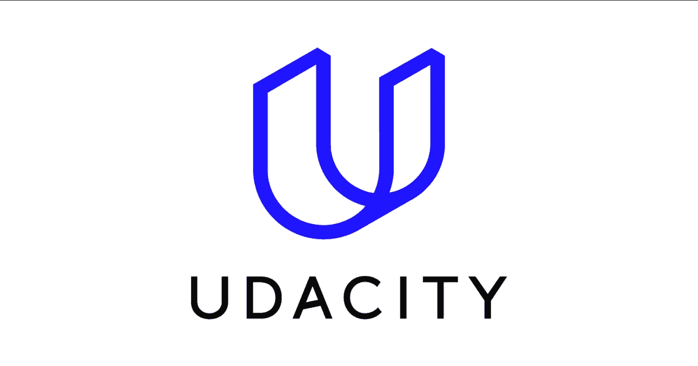
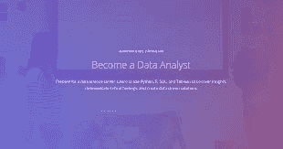
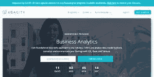
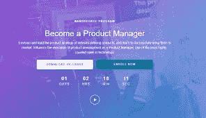
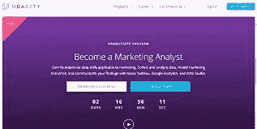

# 2023 年学习基本技术技能的 10 个最佳 Udacity 课程和纳米学位

> 原文：<https://medium.com/javarevisited/10-best-udacity-courses-and-nano-degrees-to-learn-essential-tech-skills-b27ed94c8a08?source=collection_archive---------0----------------------->

## 想成为程序员或者数据科学家？这里有最好的 Udacity 课程和纳米学位项目，你可以在 2023 年学习基本的技术技能

大家好，如果你正在寻找最好的 Udacity 课程和纳米学位项目，那么你来对地方了。过去，我曾分享过 Udemy 、 [Coursera](https://javarevisited.blogspot.com/2019/10/top-5-coursera-professional-certificates-for-programmers-IT-professionals.html) 、 [Educative](https://javarevisited.blogspot.com/2020/05/top-10-educative-courses-for-programmers.html) 、Whizlabs 和 [CodeCademy](https://javarevisited.blogspot.com/2022/02/top-10-codecademy-career-paths-to-start.html) 的[最佳课程，在这篇文章中，我将分享 Udacity 的最佳在线课程来学习技术技能。](/javarevisited/10-best-udemy-online-courses-for-java-developers-4c9ab70cd01f)

你会找到最好的 Udacity 课程来学习全栈开发、机器学习、深度学习、数字营销，以及许多面向职业的课程，以便在 2023 年成为产品经理、数据分析师和软件工程师。

但首先要做的是。**到底什么是 Udacity？它基本上是一家在线教育提供商，提供大规模开放在线课程，也称为 MOOCs。**

相比其他同类平台，set[**uda city**](https://imp.i115008.net/c/3294490/786224/11298?u=https%3A%2F%2Fwww.udacity.com%2F)**与众不同的是，它更侧重于岗位培训。它还提供一种叫做纳米学位的东西，专注于技术行业所需的技能。它由视频讲座和项目组成，与知名大学或领先的技术公司合作。**

**根据数据显示，[**uda city**](https://imp.i115008.net/c/3294490/786224/11298?u=https%3A%2F%2Fwww.udacity.com%2F)**拥有超过 1100 万名学生，是全球第四大在线课程提供商。它还有一个超过 200 门课程的目录。最棒的是其中一些是完全免费的。****

****该平台特别受谷歌和微软等领先科技公司的欢迎，因为它根据这些公司所需的技术技能创建了高度专业化的学习计划。****

****Udacity 还提供 Udacity 职业服务，包括简历和求职信评论以及 LinkedIn 和 GitHub 评论。****

# ****2023 年 10 个最佳 Udacity 课程和纳米学位****

****我们已经为你做了艰苦的工作，并在 Udacity 寻找平台上最好的课程。这就是我们如何列出这个清单的。它包含了各种各样的课程，如果你想学习新的东西或提高你的技能，你来对地方了。请继续阅读，了解更多信息。****

## ****1.[全栈 Web 开发者](https://imp.i115008.net/c/3294490/786224/11298?u=https%3A%2F%2Fwww.udacity.com%2Fcourse%2Ffull-stack-web-developer-nanodegree--nd0044)【uda city 纳米学位项目】****

****本课程将使您能够设计和开发强大的现代 web 应用程序，这些应用程序可以作为企业日常使用的应用程序、网站和系统的基础。****

******课程时长:4 个月******

******课程评分:4.6 星(满分 5 分)******

******课程导师:Amy Hua******

******课程价格:4 个月 1000 美元******

********

## ****2.[成为机器学习工程师](https://imp.i115008.net/c/3294490/786224/11298?u=https%3A%2F%2Fwww.udacity.com%2Fcourse%2Faws-machine-learning-engineer-nanodegree--nd189)【uda city】****

****这门课程将帮助你满足不断增长的对机器学习工程师的需求，并掌握所有必要的技能，这些技能将大大增强你的工作前景。****

******课程时长:3 个月******

******课程评分:4.6 星(满分 5 分)******

******课程导师:马特·伦纳德、路易斯·塞拉诺和珍妮弗·斯塔布******

******课程价格:5 个月 1277 美元******

********

## ****3.[深度学习【uda city】](https://imp.i115008.net/c/3294490/786224/11298?u=https%3A%2F%2Fwww.udacity.com%2Fcourse%2Fdeep-learning-nanodegree--nd101)****

****在本课程中，您将了解深度学习，这是正在改变世界的人工智能快速进步的基础。在本课程中，您将学习如何应用您自己的深度神经网络进行图像分类和生成等工作。****

******课程时长:4 个月******

******课程评分:4.6 星(满分 5 分)******

****课程讲师:马特·伦纳德****

******课程价格:4 个月 1000 美元******

********

## ****4.[成为数据分析师【uda city】](https://imp.i115008.net/c/3294490/786224/11298?u=https%3A%2F%2Fwww.udacity.com%2Fcourse%2Fdata-analyst-nanodegree--nd002)****

****在本课程中，您将使用 Python、SQL 和统计学来发现见解并创建数据驱动的解决方案。****

******课程时长:4 个月******

******球场评分:4.6 星(满分 5 分)******

******课程讲师:乔希·伯纳德******

******课程价格:4 个月 1000 美元******

********

## ****5.[成为区块链开发者【uda city】](https://imp.i115008.net/c/3294490/786224/11298?u=https%3A%2F%2Fwww.udacity.com%2Fcourse%2Fblockchain-developer-nanodegree--nd1309)****

****通过本课程，您将学习如何使用比特币和以太坊协议，并为现实世界的应用构建项目。****

******课程时长:4 个月******

******课程评分:4.6 星(满分 5 分)******

******课程讲师:布兰迪·卡马乔******

******课程价格:4 个月 1000 美元******

********

## ****6.[成为数字营销人员【uda city】](https://imp.i115008.net/c/3294490/786224/11298?u=https%3A%2F%2Fwww.udacity.com%2Fcourse%2Fdigital-marketing-nanodegree--nd018)****

****本课程将帮助您获得实践经验，以便您能够开展现场营销活动。这门课是由该领域一些最杰出的专家讲授的。****

****课程期限:3 个月****

****课程评分:4.7 星(满分 5 分)****

****课程讲师:安科·奥德纳特、丹尼尔·科布和朱莉娅·阿斯皮纳尔****

****课程价格:3 个月 766 美元****

********

## ****7.[商业分析【乌达城】](https://imp.i115008.net/c/3294490/786224/11298?u=https%3A%2F%2Fwww.udacity.com%2Fcourse%2Fbusiness-analytics-nanodegree--nd098)****

****在本课程中，您将获得适用于许多行业的基本数据技能。您将能够收集和分析数据，并用 SQL、Excel 和 Tableau 交流您的发现。****

******课程时长:3 个月******

******课程评分:4.6 星(满分 5 分)
课程讲师:乔希·伯纳德******

******课程价格:3 个月 750 美元******

********

## ****8.[成为产品经理【uda city】](https://imp.i115008.net/c/3294490/786224/11298?u=https%3A%2F%2Fwww.udacity.com%2Fcourse%2Fproduct-manager-nanodegree--nd036)****

****本课程将帮助您领导行业定义产品的产品策略，然后成功地将它们推向市场。****

******课程期限:4 个月******

******课程评分:4.6 星(满分 5 分)******

******课程讲师:安娜斯塔西娅根******

******课程价格:4 个月 100 美元******

********

## ****9.[成为营销分析师【uda city】](https://imp.i115008.net/c/3294490/786224/11298?u=https%3A%2F%2Fwww.udacity.com%2Fcourse%2Fmarketing-analytics-nanodegree--nd028)****

****在本课程中，您将学习如何收集和分析数据，模拟营销场景，然后用 Excel、Google Analytics 和 Data Studio 交流您的发现。****

******课程期限:3 个月******

******球场评分:4.8 星(满分 5 分)******

******课程导师:布拉德·贝特索尔******

******课程价格:3 个月 750 美元******

********

## ****10.[成为数据产品经理【uda city】](https://imp.i115008.net/c/3294490/786224/11298?u=https%3A%2F%2Fwww.udacity.com%2Fcourse%2Fmarketing-analytics-nanodegree--nd028)****

****在本课程中，您将学习如何利用数据和构建产品，在正确的时间为正确的用户提供正确的体验。您还将学习如何领导数据驱动型产品的开发，以赢得市场。****

******课程时长:3 个月******

******课程评分:4.8 星(满分 5 分)******

****课程讲师:JJ·米克拉特****

******课程价格:3 个月 750 美元******

********

# ****Udacity 上的常见问题****

******1。Udacity 是用来做什么的？******

****与其他类似平台相比，Udacity 的与众不同之处在于它更专注于职业培训。它还提供一种叫做纳米学位的东西，专注于技术行业所需的技能。它由视频讲座和项目组成，与知名大学或领先的技术公司合作。****

******2。Udacity 能给你找份工作吗？******

****该平台特别受谷歌和微软等领先科技公司的欢迎，因为它根据这些公司所需的技术技能创建了高度专业化的学习计划。****

******3。谁创造了 Udacity？******

****Udacity 由巴斯蒂安·特龙和大卫·史蒂文斯创建。****

## ****结论****

****我们找到了。这些是迄今为止 Udacity 平台上最好的课程和纳米学位。它由一系列不同的课程和纳米学位组成，将帮助你在生活中取得成功。如果你喜欢这 10 个最好的 Udacity 课程，为什么不与你的朋友和家人分享呢？此外，如果您有任何疑问或问题，请留下您的评论，我们将立即回复您。****