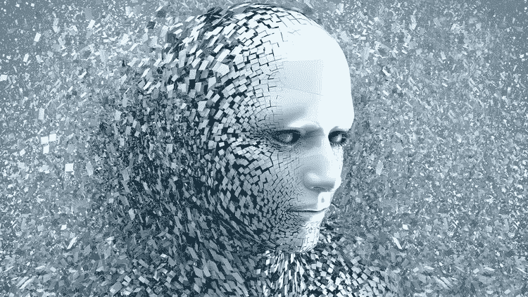
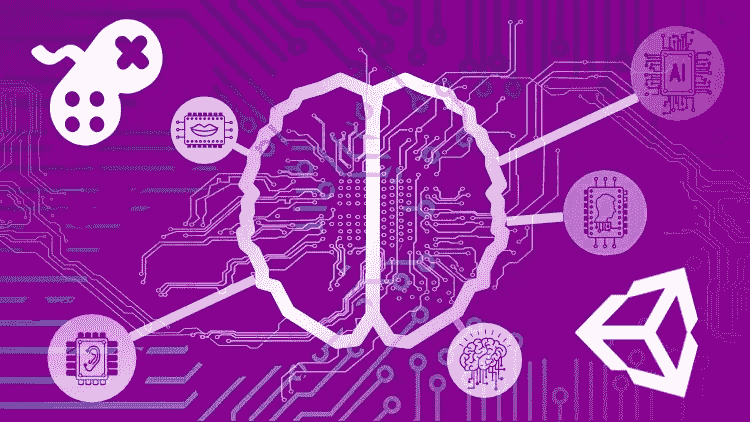
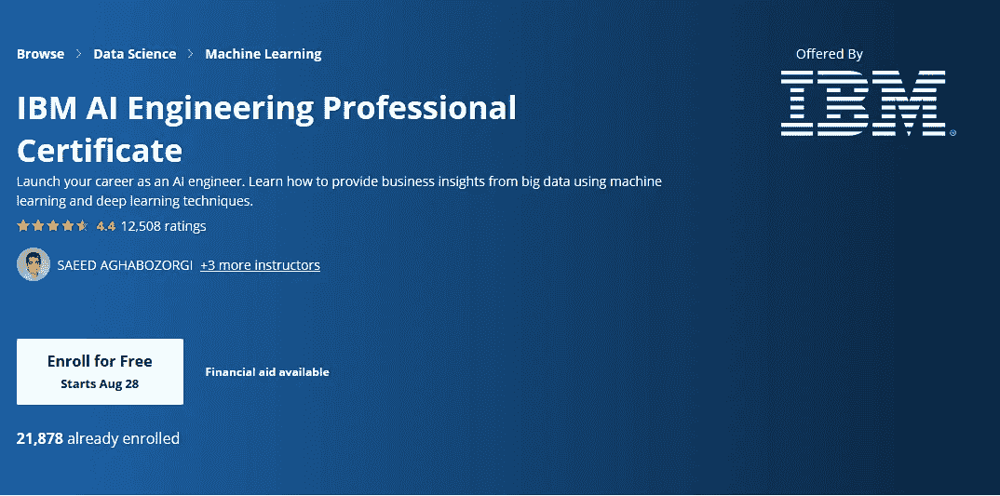
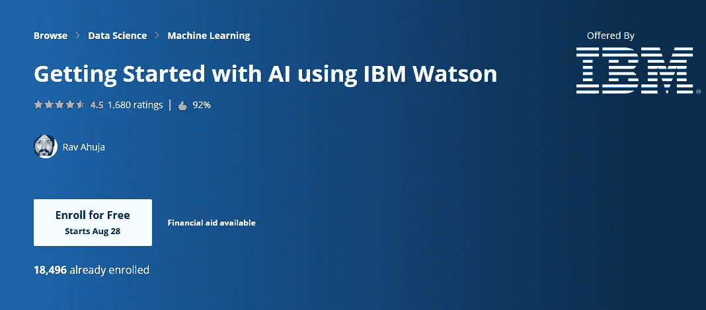
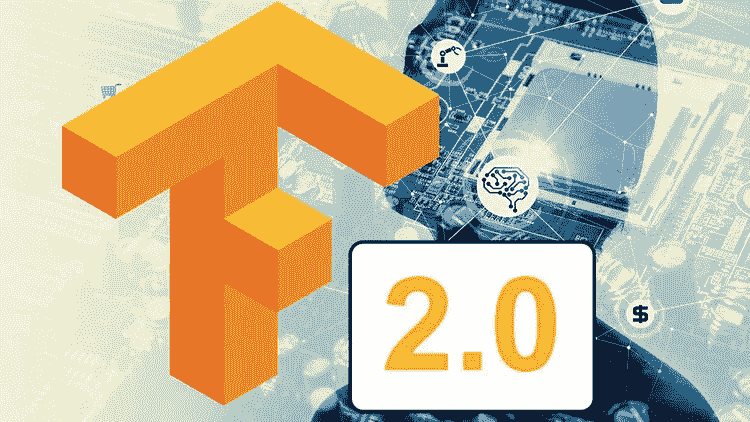

# 2023 年用 Python 学习人工智能的 10 大课程

> 原文：<https://medium.com/javarevisited/10-best-udemy-and-coursera-courses-to-learn-artificial-intelligence-in-2020-ec77ad13bdc1?source=collection_archive---------0----------------------->

## 这些是 Udemy 和 Coursera 学习人工智能最好的在线课程。

迈克尔·泽兹奇在 [Unsplash](https://unsplash.com?utm_source=medium&utm_medium=referral) 上的照片

大家好，人工智能是技术中不断增长的领域之一，许多开发人员正试图学习人工智能，以将他们的职业生涯提升到一个新的水平。

如果你是一名 Python 开发者，并且正在寻找用 Python 学习人工智能的*最佳课程*，那么你来对地方了。

之前，我已经分享了学习 [**Python**](/javarevisited/10-best-python-certification-courses-from-coursera-4576890eb6b3?source=extreme_sidebar----d3a191ac6ed-----0-1----------------------) **，** [**云计算**](/javarevisited/10-best-aws-google-cloud-and-azure-courses-and-certification-from-coursera-to-join-in-2021-5c5e2029a8e7) **，** [**软件开发**](/javarevisited/10-best-software-development-courses-certifications-from-coursera-4ccc59aae201) **t，以及** [**Web 开发** t](/javarevisited/10-best-coursera-courses-for-web-development-and-web-design-9ec54ed92dd9) 的最佳课程和认证，在这篇文章中，我将分享学习 AI 基础知识的最佳课程以及一些实践

我第一次接触 AI 是在 DeepMind 击败国际象棋最优秀的选手之一加里·卡斯帕罗夫的时候。早在 20 世纪 90 年代，人工智能已经走过了漫长的道路。现在，**谷歌正在使用相同的 DeepMind 将其数据中心的电费减少 40%** ，埃隆·马斯克正在谈论无人驾驶汽车。

如果你是一名科技极客或者程序员，这些都是人工智能的一些迷人例子，每次听到一个人工智能的故事，我都真的被迷住了。虽然所有这些都很好，也很有趣，但作为一名程序员，我也在如何编写 AI 代码上花了一些时间？我不是在谈论大问题，只是学习如何为你的利益使用人工智能或根据你自己的需要定制人工智能将在不久的将来大有作为，我正在通过加入在线课程和查看开放人工智能健身房等网站上的代理来学习所有这些。

如果你不知道的话， **Open AI Gym** 是埃隆·马斯克这样的企业家支持的项目。它为开发和比较强化学习算法提供了一个工具包。它支持教导代理从走路到玩游戏(如 Pong、Goes、Doom、Breakout 或 Pinball)的一切。由于游戏是我的另一个兴趣领域，如果你不知道，我通过编写像井字游戏、突围、俄罗斯方块和国际象棋这样的游戏来学习编码，开发 AI 来构建游戏似乎是学习人工智能的一个好主意。

如果你仔细观察，游戏为构建人工智能提供了完美的环境。当你有一个能够打败游戏的[算法](https://www.java67.com/2019/07/top-10-online-courses-to-learn-data-structure-and-algorithms-in-java.html)时，你就知道同样的原理也可以应用于解决现实世界的问题。这正是谷歌和特斯拉等许多科技巨头遵循的方法。

如果你和我一样，**想在 2023 年用 Python** 学习 AI 或人工智能，并寻找一些优秀的在线课程，那么你来对地方了。在这篇文章中，我将分享一些 2023 年用 Python 学习人工智能的最佳在线课程。

# 2023 年用 Python 学习人工智能的 10 门最佳课程

网上有很多学习人工智能的课程，但是大部分都很枯燥或者太专业，即使是有多年经验的程序员也不例外。

因为我总是相信简单和令人兴奋的东西，所以我只选择了一门理论和实践相结合的课程。这些课程不仅教你如何构建人工智能，还会启发你学习人工智能。

## 1. [AI for Every One 吴恩达(Coursera)](https://coursera.pxf.io/c/3294490/1164545/14726?u=https%3A%2F%2Fwww.coursera.org%2Flearn%2Fai-for-everyone)

吴恩达是一个通过他经典的机器学习课程启发了数百万人工智能和机器学习开发者的人。他也是 Coursera 的创始人、Google Brain 的负责人、百度的首席科学家、地球上最受欢迎的机器学习课程的讲师。

如果你在想这是不是真的？是的，[*Coursera 上的机器学习课程*](https://coursera.pxf.io/c/3294490/1164545/14726?u=https%3A%2F%2Fwww.coursera.org%2Flearn%2Fmachine-learning) 已有超过 460 万学生选修，这使其成为机器学习的热门课程。你可以自己查数字。

当 [**吴恩达**](https://coursera.pxf.io/c/3294490/1164545/14726?u=https%3A%2F%2Fwww.coursera.org%2Finstructor%2Fandrewng) 在 Twitter 上宣布这个课程时，我知道这是我必须加入的事情，尽管我已经参加了几堂人工智能的课程，但我从这个课程中学到了很多。

**以下是加入本课程的链接——**[**AI for everybody 作者吴恩达**](https://coursera.pxf.io/c/3294490/1164545/14726?u=https%3A%2F%2Fwww.coursera.org%2Flearn%2Fai-for-everyone)

本课程全面概述了什么是人工智能，以及在人工智能背景下讨论的各种概念的含义。它帮助你建立你的词汇，这样你就可以在线和离线与程序员同事和其他人讨论人工智能。顺便说一句，如果你觉得 Coursera 的课程有用，那么我也建议你加入 Coursera Plus 的订阅计划，这是 Coursera 的一个订阅计划，可以让你无限制地访问他们最受欢迎的课程、专业、专业证书和指导项目。它每年花费大约 399 美元，但是它完全物有所值，因为你可以获得无限制的证书

 [## Coursera Plus |无限制访问 7，000 多门在线课程

### 用 Coursera Plus 投资你的职业目标。无限制访问 90%以上的课程、项目…

coursera.pxf.io](https://coursera.pxf.io/c/3294490/1164545/14726?u=https%3A%2F%2Fwww.coursera.org%2Fcourseraplus) 

## [2。人工智能 A-Z:学习如何构建人工智能(Udemy)](https://click.linksynergy.com/deeplink?id=JVFxdTr9V80&mid=39197&murl=https%3A%2F%2Fwww.udemy.com%2Fcourse%2Fartificial-intelligence-az%2F)

这是我学习人工智能的第一门课，这很容易，因为我是导师基里尔·叶列缅科和他的超级数据科学团队的超级粉丝。

参加过他的深度学习课程，我知道这是多么吸引人，鉴于这个课题的复杂性，这是我的首要要求。我不想因为大量使用[数学](https://javarevisited.blogspot.com/2019/09/top-5-statistics-and-mathematics-course-for-data-science.html)和神经网络而陷入困境，相反，我想要一门能够激励我学习更多的课程，而且我必须说，我没有失望。

本课程将教你如何结合数据科学、机器学习和深度学习的力量，为现实世界的应用创建强大的人工智能，如在《突围》中创建人工智能来击败游戏，在《毁灭战士》中通过一个关卡，以及为自动驾驶汽车创建逻辑。

说到社会证明，已经有超过 101，411 名学生注册了这门课程，平均下来，这门课程得到了 11，452 分中的 4.4 分，这是非常惊人的。非常感谢基里尔·叶列缅科和他的整个超级数据科学团队创造了这个令人敬畏的课程。

**以下是加入本课程的链接—** [人工智能 A-Z:学习如何构建人工智能(Udemy)](https://click.linksynergy.com/deeplink?id=JVFxdTr9V80&mid=39197&murl=https%3A%2F%2Fwww.udemy.com%2Fcourse%2Fartificial-intelligence-az%2F)

## [3。Unity 人工智能入门指南。](https://click.linksynergy.com/deeplink?id=JVFxdTr9V80&mid=39197&murl=https%3A%2F%2Fwww.udemy.com%2Fcourse%2Fartificial-intelligence-in-unity%2F) (Udemy)

这是我在 Udemy 上的另一门课程，学习如何在游戏中使用 AI。如果你不知道，Unity 是开发各种视频游戏的最受欢迎的游戏引擎之一，他们使用人工智能根据玩家的能力使游戏变得困难。如果你是一名游戏设计师或游戏开发者，如果你的非玩家角色缺乏动力和野心，那么你可以加入这个课程，学习如何让他们更加真实可信。

在本课程中，课程讲师 Penny 利用她在游戏、图形领域超过 25 年的国际知名教学风格和知识，揭示了用于在游戏中创建可信角色行为的最受欢迎的人工智能技术，并撰写了两本关于游戏人工智能的获奖书籍。

在整个课程中，你将跟随旨在教授你当今游戏中使用的基本人工智能技术的实践研讨会。如果你喜欢视频游戏，并想了解更多关于人工智能在那里的应用，这是为你开设的课程。

**以下是加入本课程的链接—**[Unity 人工智能初学者指南](https://click.linksynergy.com/deeplink?id=JVFxdTr9V80&mid=39197&murl=https%3A%2F%2Fwww.udemy.com%2Fcourse%2Fartificial-intelligence-in-unity%2F)

## 4.[人工智能(AI) Coursera 简介](https://coursera.pxf.io/c/3294490/1164545/14726?u=https%3A%2F%2Fwww.coursera.org%2Flearn%2Fintroduction-to-ai)

这是 Coursera 中学习人工智能的另一个精彩课程。在本课程中，您将学习什么是人工智能(AI)，探索人工智能的用例及应用，了解人工智能概念，以及机器学习、[深度学习、](https://javarevisited.blogspot.com/2019/08/top-5-courses-to-learn-deep-learning.html)和神经网络等术语。

你还将接触到围绕 AI 的各种问题和担忧，比如道德和偏见、&乔布斯，并获得专家关于学习和开始 AI 职业生涯的建议。

您还将通过一个迷你项目展示人工智能的实际应用，并在成功完成项目后获得证书

本课程不需要任何编程或计算机科学专业知识，旨在向任何人介绍人工智能的基础知识，无论您是否有技术背景。

**这里是加入本课程的链接——**[人工智能(AI)简介](https://coursera.pxf.io/c/3294490/1164545/14726?u=https%3A%2F%2Fwww.coursera.org%2Flearn%2Fintroduction-to-ai)

## [5。人工智能:Python 中的强化学习](https://click.linksynergy.com/deeplink?id=JVFxdTr9V80&mid=39197&murl=https%3A%2F%2Fwww.udemy.com%2Fcourse%2Fartificial-intelligence-reinforcement-learning-in-python%2F) Udemy

如果你不知道，强化学习是 AI 的一大部分，本课程提供了深度强化学习的完整指南。它帮助你在技术层面上理解强化学习。也有助于你理解强化学习和心理学的关系。

强化学习最近因在 AI 中做了一些奇妙的事情而出名，比如在 2016 年，我们看到谷歌的 AlphaGo 击败了围棋世界冠军。我们看到人工智能在玩像《毁灭战士》和《超级玛丽》这样的电子游戏。

很像深度学习，很多理论是在 70 年代和 80 年代发现的，但直到最近我们才能够直接观察到可能的惊人结果。谈到社交证明，这门课程已经得到了超过 28，000 名学生的信任，平均而言，它在近 5，000 名参与者中获得了 4.6 分，这是一个惊人的成绩。如果你正在寻找一个纯粹的人工智能技术课程，这是一个加入。

**以下是加入本课程的链接—** [人工智能:Python 中的强化学习](https://click.linksynergy.com/deeplink?id=JVFxdTr9V80&mid=39197&murl=https%3A%2F%2Fwww.udemy.com%2Fcourse%2Fartificial-intelligence-reinforcement-learning-in-python%2F)

## 6. [IBM AI 工程专业证书](https://coursera.pxf.io/c/3294490/1164545/14726?u=https%3A%2F%2Fwww.coursera.org%2Fprofessional-certificates%2Fai-engineer) — Coursera

这个 6 门课程的专业证书旨在为你提供在 AI 或 ML 工程师的职业生涯中取得成功所需的工具。

在这门最好的 Coursera AI 课程中，你将学习机器学习和深度学习的基本概念，包括监督和非监督学习，使用 Python 等编程语言。

您将应用流行的机器学习和深度学习库，如 SciPy、ScikitLearn、Keras、PyTorch 和 Tensorflow 来解决涉及对象识别、计算机视觉、图像和视频处理、文本分析、自然语言处理(NLP)、推荐系统和其他类型的分类器的行业问题。

通过动手项目，您将获得使用 Apache Spark 在大数据上扩展机器学习算法的基本数据科学技能。您将构建、训练和部署不同类型的深度架构，包括卷积神经网络、递归网络和自动编码器。

除了获得 Coursera 的专业证书，你还将获得 IBM 的**数字徽章，认可你在 AI 工程方面的熟练程度。**

**这里是加入本课程的链接**——[IBM AI 工程专业证书](https://coursera.pxf.io/c/3294490/1164545/14726?u=https%3A%2F%2Fwww.coursera.org%2Fprofessional-certificates%2Fai-engineer)

## 7.[使用 IBM Watson 的人工智能入门— Coursera](https://coursera.pxf.io/c/3294490/1164545/14726?u=https%3A%2F%2Fwww.coursera.org%2Flearn%2Fai-with-ibm-watson)

在这门 Coursera 课程中，您将学习如何使用 IBM Watson 快速轻松地开始人工智能。

您将了解 Watson 的工作方式，熟悉其使用案例和现实生活中的客户端示例，并了解 IBM 的几项 Watson 人工智能服务，这些服务使任何人都可以轻松应用人工智能并构建智能应用。您还将与几个 Watson 服务合作，演示人工智能的实际应用。

本课程也是以下专业和证书的一部分:

*   [AI 基础人人专精](https://coursera.pxf.io/c/3294490/1164545/14726?u=https%3A%2F%2Fwww.coursera.org%2Fspecializations%2Fai-foundations-for-everyone)
*   [IBM 应用人工智能专业证书](https://coursera.pxf.io/c/3294490/1164545/14726?u=https%3A%2F%2Fwww.coursera.org%2Fprofessional-certificates%2Fapplied-artifical-intelligence-ibm-watson-ai)

这意味着完成本课程将计入您在上述任何项目中的学习

本课程不需要任何编程或计算机科学专业知识，是为任何人设计的，无论你是否有技术背景。

**这是加入本课程的链接** — [使用 IBM Watson 开始学习人工智能](https://coursera.pxf.io/c/3294490/1164545/14726?u=https%3A%2F%2Fwww.coursera.org%2Flearn%2Fai-with-ibm-watson)

## 8. [Tensorflow 2.0:深度学习和人工智能](https://click.linksynergy.com/deeplink?id=JVFxdTr9V80&mid=39197&murl=https%3A%2F%2Fwww.udemy.com%2Fcourse%2Fdeep-learning-tensorflow-2%2F)

这是为那些想通过建立模型和解决现实世界问题来学习 AI 的严肃的人准备的。在本课程中，您将学习用于计算机视觉、时间序列预测、NLP、GANs、强化学习等的神经网络。

这个课程关注的是*广度*而不是*深度*，较少的理论有利于构建更酷的东西。如果你正在寻找一个更理论密集的课程，这不是它。

**这是加入本课程** — [商业人工智能](https://click.linksynergy.com/deeplink?id=JVFxdTr9V80&mid=39197&murl=https%3A%2F%2Fwww.udemy.com%2Fcourse%2Fai-for-business%2F)的链接

## 9.[商业人工智能](https://click.linksynergy.com/deeplink?id=JVFxdTr9V80&mid=39197&murl=https%3A%2F%2Fwww.udemy.com%2Fcourse%2Fai-for-business%2F)

这是另一个很棒的 Udemy 课程，为商务人士学习人工智能。由基里尔·叶列缅科和他的超级数据科学团队创建，这门课程将教你如何用人工智能解决方案解决现实世界的商业问题

您将通过几个案例研究来学习如何优化业务流程、最小化成本和最大化收入。通过本课程，您将获得一本 100 页的书，涵盖商业人工智能的所有内容！。

**这是加入本课程** — [商业人工智能](https://click.linksynergy.com/deeplink?id=JVFxdTr9V80&mid=39197&murl=https%3A%2F%2Fwww.udemy.com%2Fcourse%2Fai-for-business%2F)的链接

## 10.[人工智能大师班](https://click.linksynergy.com/deeplink?id=JVFxdTr9V80&mid=39197&murl=https%3A%2F%2Fwww.udemy.com%2Fcourse%2Fartificial-intelligence-masterclass%2F) — Udemy

这是在 Udemy 上学习 AI 的终极课程。在本课程中，您将获得 10 小时的逐步指导和完整的路线图，以从头开始构建您自己的混合人工智能模型。

您还将学习如何基于最健壮的混合智能系统开发最强大的人工智能模型。到目前为止，这个模型被证明是人工智能创造的最好的艺术状态，在所有人工智能比赛中以令人难以置信的高分击败了它的前辈。

除此之外，我们还将获得两个 AI 框架中的完整实现:TensorFlow 和 Keras。

**这里是加入本课程**——[人工智能大师班](https://click.linksynergy.com/deeplink?id=JVFxdTr9V80&mid=39197&murl=https%3A%2F%2Fwww.udemy.com%2Fcourse%2Fartificial-intelligence-masterclass%2F)的链接

以上就是 2023 年用 Python 学习人工智能或 AI 的一些**最佳课程。**我曾试图将一些关于人工智能的非技术课程包括在内，如伟大的吴恩达的 [*AI for Every One*](https://coursera.pxf.io/c/3294490/1164545/14726?u=https%3A%2F%2Fwww.coursera.org%2Flearn%2Fai-for-everyone) ，只是为了理解人工智能的业务和一般方面，这远比实际学习如何为特定领域或问题构建人工智能重要得多。

其他**面向程序员的机器学习和 AI 资源**

*   [2023 年学习数据科学的 10 本书和课程](/javarevisited/top-10-resources-to-learn-data-science-and-machine-learning-best-of-lot-f153e1f44e89)
*   [面向数据科学和机器学习的 8 大 Python 库](https://javarevisited.blogspot.com/2018/10/top-8-python-libraries-for-data-science-machine-learning.html)
*   [2023 年学习 Python 的 5 大课程](https://hackernoon.com/top-5-courses-to-learn-python-in-2018-best-of-lot-26644a99e7ec)
*   [面向数据科学家的 10 大 TensorFlow 课程](https://dev.to/javinpaul/10-of-the-best-tensorflow-courses-to-learn-machine-learning-from-coursera-and-udemy-37bf)
*   [面向程序员的 10 门机器学习和深度学习课程](https://hackernoon.com/top-5-courses-to-learn-python-in-2018-best-of-lot-26644a99e7ec)
*   [2023 年学习 Python 的 10 个理由](https://hackernoon.com/10-reasons-to-learn-python-in-2018-f473dc35e2ee)
*   [学习机器学习的 5 大免费课程](https://www.java67.com/2019/01/5-free-courses-to-learn-machine-and-deep-learning-in-2019.html)
*   [初学者学习 TensorFlow 的 5 大课程](https://hackernoon.com/top-5-tensorflow-and-ml-courses-for-programmers-8b30111cad2c)
*   [学习高级数据科学的前 5 门课程](https://hackernoon.com/top-5-data-science-and-machine-learning-course-for-programmers-e724cfb9940a)
*   [学习数据科学数学和统计的 5 门课程](https://javarevisited.blogspot.com/2019/09/top-5-statistics-and-mathematics-course-for-data-science.html)
*   [学习数据科学 Tableau 的前 5 门课程](https://javarevisited.blogspot.com/2019/07/top-5-tableau-online-courses-and-certifications-for-data-science-engineers.html)
*   [学习数据科学 Python 的 5 本书](https://javarevisited.blogspot.com/2019/08/top-5-python-books-for-data-science-and-machine-learning.html)
*   [初学者学习数据科学的 10 门课程](https://hackernoon.com/10-machine-learning-data-science-and-deep-learning-courses-for-programmers-7edc56078cde)
*   [初学者学习 Python 的 10 门免费课程](https://hackernoon.com/10-free-python-programming-courses-for-beginners-to-learn-online-38312f3b9912)
*   [学习熊猫数据分析的 5 大课程](https://javarevisited.blogspot.com/2019/10/top-5-courses-to-learn-pandas-for-data-analysis-python.html)

感谢您阅读本文。如果你喜欢 Udemy 和 Coursera 的*最佳人工智能或 AI 课程，那么请分享给你的朋友和同事。如果您有任何问题或反馈，请留言。

**P. S.** —如果你是认真的想进入人工智能和机器学习领域，我也建议你学习 Python，这是机器学习和人工智能最有价值的技能之一。如果您需要资源，请查看以下 [**最佳 Python 课程**](/better-programming/top-5-courses-to-learn-python-in-2018-best-of-lot-26644a99e7ec) 列表，开始您的旅程。*

 [## Python 训练营:学习 Python 编程和代码培训

### 这是 Udemy 上最全面、最直接的 Python 编程语言课程！你是否…

bit.ly](http://bit.ly/2BY5LJC)