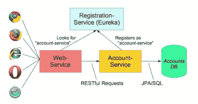
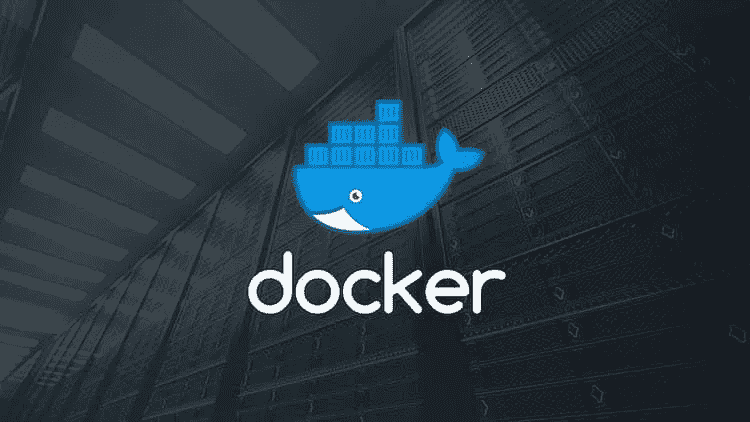
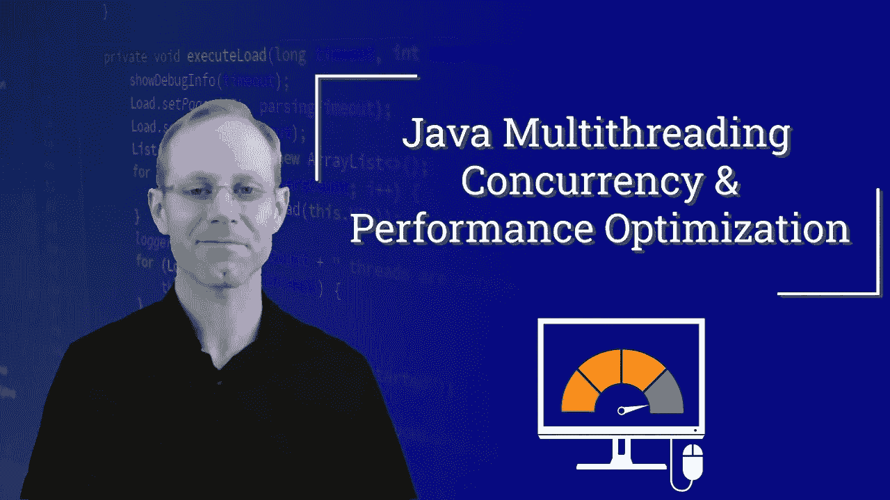
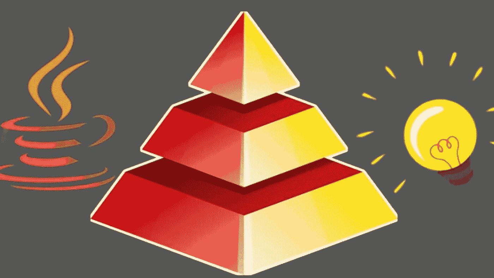

# 2023 年 Java 开发人员的 10 门最佳 Udemy 课程

> 原文：<https://medium.com/javarevisited/10-best-udemy-online-courses-for-java-developers-4c9ab70cd01f?source=collection_archive---------1----------------------->

## 学习 Java、Spring Framework、干净代码、重构、多线程、并发、Maven、Docker、Git 和 Jenkins 的最佳 Udemy 课程

image_credit —重构金字塔(Java) —将代码清理到链中

大家好，如果你是一名 Java 开发人员，或者想在 2023 年成为一名专业的 Java 开发人员，并且正在寻找最好的 Udemy 课程，那么你来对地方了。之前我已经分享过 [**软件开发者最佳 Udemy 课程**](/javarevisited/my-favorite-udemy-online-courses-for-programmers-and-software-engineers-f9d941dd0035) ，今天我要分享的是 Java 开发者最佳 Udemy 课程。

这个列表包括学习 Java 基本技能的课程，如[核心 Java](https://javarevisited.blogspot.com/2020/04/top-10-advanced-core-java-courses-for-experienced-developers.html#axzz6KyOHbmCo) 、 [Spring 框架](/javarevisited/10-best-online-courses-to-learn-spring-framework-in-2020-f7f73599c2fd)、[干净代码](/javarevisited/clean-code-a-must-read-coding-book-for-programmers-9dc80494d27c)、[重构](/javarevisited/7-best-courses-to-learn-refactoring-and-clean-coding-in-java-47bea3c67006)、[多线程](https://javarevisited.blogspot.com/2018/06/top-5-java-multithreading-and-concurrency-courses-experienced-programmers.html)、[并发](/javarevisited/6-multithreading-and-concurrency-books-every-java-programmer-should-read-b6a08d2aae54)、 [Maven](/javarevisited/top-10-free-courses-to-learn-maven-jenkins-and-docker-for-java-developers-51fa7a1e66f6?source=collection_home---4------3-----------------------) 、 [Docker](/@javinpaul/10-free-courses-to-learn-docker-and-devops-for-frontend-developers-691ac7652cee?source=---------94------------------) 、 [Git](/javarevisited/7-best-courses-to-master-git-and-github-for-programmers-d671859a68b2) 和 [Jenkins](/javarevisited/7-best-courses-to-learn-jenkins-and-ci-cd-for-devops-engineers-and-software-developers-df2de8fe38f3) 。这些都是 Java 专业人士必备的技能。

我已经分享了关于每个主题的终极最佳 Udemy 课程，你可以挑选并更好地学习该主题。如果你认为还有另一个很棒的 Udemy 课程应该在这个列表中，Java 开发人员可以随意推荐。

# 202 年 Java 程序员十大 Udemy 课程`3`

下面是我从 Udemy 上为 Java 和 Web 开发人员列出的一些最好的课程。这包括关于 Java、Spring 5、Spring Boot 2、Git、Maven、Jenkins、Docker、REST API、微服务和一般 web 开发的课程。这应该是 2023 年要学习和更新的一个很好的技能列表。

## 1.[完整的 Java Masterclass](https://click.linksynergy.com/fs-bin/click?id=JVFxdTr9V80&subid=0&offerid=323058.1&type=10&tmpid=14538&RD_PARM1=https%3A%2F%2Fwww.udemy.com%2Fjava-the-complete-java-developer-course%2F)

首先，如果你是一名专业的 Java 开发人员，你必须学习最新的 Java 版本，比如 Java 9、10、11 和 17。

即使你不使用 Jigsaw，Java 9 中也有一些值得一看的 API 增强，比如在 JDK 11 中创建一个[地图](http://javarevisited.blogspot.sg/2017/08/how-to-remove-key-value-pairs-from-hashmap-java8-example.html)或[列表](http://www.java67.com/2017/10/java-8-convert-arraylist-to-hashmap-or.html)更适应 JDK 9 中引入的新工厂方法。

本课程最近进行了更新，涵盖了 Java 11，并很好地概述了 JDK 9、JDK 11 和 JDK 17 的所有新功能。

**这里是加入本课程的链接** — [完整的 Java 大师班](https://click.linksynergy.com/fs-bin/click?id=JVFxdTr9V80&subid=0&offerid=323058.1&type=10&tmpid=14538&RD_PARM1=https%3A%2F%2Fwww.udemy.com%2Fjava-the-complete-java-developer-course%2F)

## 2. [Spring 框架:初学者到大师](https://click.linksynergy.com/fs-bin/click?id=JVFxdTr9V80&subid=0&offerid=323058.1&type=10&tmpid=14538&RD_PARM1=https%3A%2F%2Fwww.udemy.com%2Fspring-framework-5-beginner-to-guru%2F)

这是目前在 Spring framework 5 和 Spring Boot 2 上可用的最现代和最全面的 Spring Framework 课程之一。

本课程由约翰·汤姆逊教授，他是 Spring world 方面的权威，之前曾作为 Spring Source 顾问为 Pivotal 客户工作，也曾在 Spring One 上发言。

如果你真的想学习 Spring 5 的新特性，比如。反应式编程，那么这就是适合你的课程。

**这里是加入本课程的链接** — [Spring 框架:初学者到大师](https://click.linksynergy.com/fs-bin/click?id=JVFxdTr9V80&subid=0&offerid=323058.1&type=10&tmpid=14538&RD_PARM1=https%3A%2F%2Fwww.udemy.com%2Fspring-framework-5-beginner-to-guru%2F)

## 3.[面向 Java 开发者的 Docker](https://click.linksynergy.com/fs-bin/click?id=JVFxdTr9V80&subid=0&offerid=323058.1&type=10&tmpid=14538&RD_PARM1=https%3A%2F%2Fwww.udemy.com%2Fdocker-for-java-developers%2F)

顾名思义，这门课程是专门为 Java 开发者设计的。您将了解如何使用 Docker 来增强您的企业 Java 开发。

一旦您对 Docker 及其在软件开发和部署方面的价值有了基本的了解，您就可以学习本课程。

**这里是加入本课程的链接**——[面向 Java 开发者的 Docker](https://click.linksynergy.com/fs-bin/click?id=JVFxdTr9V80&subid=0&offerid=323058.1&type=10&tmpid=14538&RD_PARM1=https%3A%2F%2Fwww.udemy.com%2Fdocker-for-java-developers%2F)

## 4.[主微服务与 Spring Boot 和春云](https://click.linksynergy.com/fs-bin/click?id=JVFxdTr9V80&subid=0&offerid=323058.1&type=10&tmpid=14538&RD_PARM1=https%3A%2F%2Fwww.udemy.com%2Fmicroservices-with-spring-boot-and-spring-cloud%2F)

开发 RESTful web 服务和微服务很有趣，Spring Boot、Spring Web MVC、Spring Web Services 和 JPA 的结合让这变得更加有趣。在本课程中，您将学习如何使用 Spring Cloud 实现微服务。

本课程分为两部分:RESTful web 服务和微服务。在课程的第一部分，您将学习 RESTful web 服务的基础知识，第二部分重点介绍微服务。

**以下是加入本课程的链接**——[与 Spring Boot 和春云一起掌握微服务](https://click.linksynergy.com/fs-bin/click?id=JVFxdTr9V80&subid=0&offerid=323058.1&type=10&tmpid=14538&RD_PARM1=https%3A%2F%2Fwww.udemy.com%2Fmicroservices-with-spring-boot-and-spring-cloud%2F)

## 5.[詹金斯，从零到英雄:成为 DevOps 詹金斯大师](https://click.linksynergy.com/deeplink?id=JVFxdTr9V80&mid=39197&murl=https%3A%2F%2Fwww.udemy.com%2Fcourse%2Fjenkins-from-zero-to-hero%2F)

如果你想在 2023 年让你的 DevOps 技能更上一层楼，这是适合你的课程。在本课程中，您将学习如何与 Jenkins 一起构建自动化持续集成管道。

您还将理解持续检查、持续集成和持续部署的基本概念，以及它们之间的区别。

**以下是加入本课程的链接**——[詹金斯，从零到英雄:成为 DevOps 詹金斯大师](https://click.linksynergy.com/deeplink?id=JVFxdTr9V80&mid=39197&murl=https%3A%2F%2Fwww.udemy.com%2Fcourse%2Fjenkins-from-zero-to-hero%2F)

## 6.[Git Complete:Git 的权威分步指南](https://click.linksynergy.com/fs-bin/click?id=JVFxdTr9V80&subid=0&offerid=323058.1&type=10&tmpid=14538&RD_PARM1=https%3A%2F%2Fwww.udemy.com%2Fgit-complete%2F)

Git 是目前最流行的版本控制系统。它不同于 SVN 或 CVS，因为它是一个分布式版本控制系统，这意味着您可以在本地存储库提交更改，然后您可以立即将其推送到 Github 或远程存储库。

本课程提供了 Git 的完整概述，包括安装、[分支](http://javarevisited.blogspot.sg/2013/04/difference-between-trunk-tags-and-branch-svn-cvs-git-scm-subversion.html#axzz538VTwUNp)和合并、从 Github 下载项目、重置基础、存储、在命令行上使用 Git bash，以及标记重要的里程碑。

**这里是加入本课程**—[Git Complete:Git 的权威分步指南](https://click.linksynergy.com/fs-bin/click?id=JVFxdTr9V80&subid=0&offerid=323058.1&type=10&tmpid=14538&RD_PARM1=https%3A%2F%2Fwww.udemy.com%2Fgit-complete%2F)

## 7. [Maven 速成班](https://click.linksynergy.com/fs-bin/click?id=JVFxdTr9V80&subid=0&offerid=323058.1&type=10&tmpid=14538&RD_PARM1=https%3A%2F%2Fwww.udemy.com%2Fmavencrashcourse%2F)

这是给不了解 Maven 的 Java 开发者用的，Maven 是 Java 程序员必备的技能之一。理想情况下，你应该早点学会，但如果你没有，现在还不晚。你可以通过这个速成课程在几天内学会 Maven。

由于 Maven 是 Java 项目最受欢迎的构建工具，也使依赖管理更加舒适，我强烈建议每个 Java 开发人员在 2023 年学习 Maven，如果他们还没有的话。

**这里是加入本课程**——[Maven 速成班](https://click.linksynergy.com/fs-bin/click?id=JVFxdTr9V80&subid=0&offerid=323058.1&type=10&tmpid=14538&RD_PARM1=https%3A%2F%2Fwww.udemy.com%2Fmavencrashcourse%2F)的链接

## 8.[Docker Mastery:Docker 船长的全套工具集](https://click.linksynergy.com/fs-bin/click?id=JVFxdTr9V80&subid=0&offerid=323058.1&type=10&tmpid=14538&RD_PARM1=https%3A%2F%2Fwww.udemy.com%2Fdocker-mastery%2F)

Docker 是 2023 年 Java 开发者需要学习的另一项必备技能。Docker 为您的移动和 web 应用程序提供了一种新的开发和部署方式。在当前的分布式开发和实现世界中，它越来越成为一项基本技能。

本课程不仅介绍了 Docker 的概况，还提供了不同 Docker 工具的完整概述。

**这里是加入本课程的链接**——[码头工人掌握:码头工人船长的全套工具](https://click.linksynergy.com/fs-bin/click?id=JVFxdTr9V80&subid=0&offerid=323058.1&type=10&tmpid=14538&RD_PARM1=https%3A%2F%2Fwww.udemy.com%2Fdocker-mastery%2F)

## 9.[弹簧框架 5 的反应式编程](https://click.linksynergy.com/fs-bin/click?id=JVFxdTr9V80&subid=0&offerid=323058.1&type=10&tmpid=14538&RD_PARM1=https%3A%2F%2Fwww.udemy.com%2Freactive-programming-with-spring-framework-5%2F)

约翰·汤姆逊教授的另一门优秀的高级课程，特别关注 Spring 5 的反应式编程。

本课程提供构建反应式应用程序的实践经验，利用反应式数据类型和[web flux](/javarevisited/7-best-webflux-and-reactive-spring-boot-courses-for-java-programmers-33b7c6fa8995)——这两者都是 Spring Framework 5 的新特性。

**这里是加入本课程** — [用 Spring 框架 5 进行反应式编程](https://click.linksynergy.com/fs-bin/click?id=JVFxdTr9V80&subid=0&offerid=323058.1&type=10&tmpid=14538&RD_PARM1=https%3A%2F%2Fwww.udemy.com%2Freactive-programming-with-spring-framework-5%2F)的链接

## 10. [Java 多线程，并发，&性能优化](https://click.linksynergy.com/deeplink?id=JVFxdTr9V80&mid=39197&murl=https%3A%2F%2Fwww.udemy.com%2Fcourse%2Fjava-multithreading-concurrency-performance-optimization%2F)

多线程和并发性是 Java 开发人员最需要的技能之一。对很好理解多线程和并发的 Java 开发人员要求很高，但同时，这也是很难掌握的课题之一。

如果你想让你的并发技能更上一层楼，想成为 Java 中多线程、并发和并行编程的专家，特别强调高性能，那么我向你强烈推荐这门课程。

我把它放在第一位是有原因的，因为这可能是列表中最重要的课程，强烈推荐每个 Java 开发人员都去学习。

**这里是加入本课程的链接** — [Java 多线程、并发、&性能优化](https://click.linksynergy.com/deeplink?id=JVFxdTr9V80&mid=39197&murl=https%3A%2F%2Fwww.udemy.com%2Fcourse%2Fjava-multithreading-concurrency-performance-optimization%2F)

## 11.[重构金字塔(Java) —逐渐清理代码](https://click.linksynergy.com/deeplink?id=JVFxdTr9V80&mid=39197&murl=https%3A%2F%2Fwww.udemy.com%2Fcourse%2Fpyramid-of-refactoring-java-interpreter-factories%2F)

这是 Java 开发人员提高编码技能的又一门高级课程。你将逐渐学习如何编写干净的代码，并注意到新出现的[设计模式](/javarevisited/7-best-online-courses-to-learn-object-oriented-design-pattern-in-java-749b6399af59)，如解释器、流畅构建器、工厂方法

这是“重构金字塔”系列的第一个模块，致力于实现干净的代码。这个系列还有几门课程。

讲师使用重构技术，并实时执行所有更改，这有助于您理解重构如何提高代码质量。如果你对代码质量很认真，那么这个课程会给你很大帮助。

**这里是加入本课程的链接**——[重构金字塔(Java)——逐步清理代码](https://click.linksynergy.com/deeplink?id=JVFxdTr9V80&mid=39197&murl=https%3A%2F%2Fwww.udemy.com%2Fcourse%2Fpyramid-of-refactoring-java-interpreter-factories%2F)

以上是针对 Java 和 Web 开发人员的一些顶级 Udemy 课程。Udemy 定期举办[疯狂促销](https://click.linksynergy.com/fs-bin/click?id=JVFxdTr9V80&offerid=323058.9410&type=3&subid=0)，每门课程只需 10 美元，这是购买你喜欢的课程的绝佳机会，然后你可以在方便的时候选修。Udemy 让你可以终身使用你购买的课程，这意味着你可以随时制作。

其他**编程文章**你可能喜欢

*   [2023 年 Java 开发者路线图](https://javarevisited.blogspot.com/2019/10/the-java-developer-roadmap.html)
*   [2023 年 Java 程序员应该学会的 10 件事](https://javarevisited.blogspot.com/2017/12/10-things-java-programmers-should-learn.html#axzz5atl0BngO)
*   [2023 年前端和后端开发者路线图](https://javarevisited.blogspot.com/2019/02/the-2019-web-developer-roadmap.html)
*   [2023 年你可以学习的 10 种编程语言](http://www.java67.com/2017/12/10-programming-languages-to-learn-in.html)
*   [每个 Java 开发人员都应该知道的 10 个工具](http://www.java67.com/2018/04/10-tools-java-developers-should-learn.html)
*   [学习 Java 编程语言的 10 个理由](http://javarevisited.blogspot.sg/2013/04/10-reasons-to-learn-java-programming.html)
*   [Java 和 Web 开发者应该学习的 10 个框架](http://javarevisited.blogspot.sg/2018/01/10-frameworks-java-and-web-developers-should-learn.html)
*   [Udemy 与 plural sight——哪个对编码员更好](https://javarevisited.blogspot.com/2019/10/udemy-vs-pluralsight-review-which-is-better-to-learn-code.html)
*   [2023 年成为更好的 Java 开发人员的 10 个技巧](http://javarevisited.blogspot.sg/2018/05/10-tips-to-become-better-java-developer.html)
*   [2023 年需要学习的 5 大 Java 框架](http://javarevisited.blogspot.sg/2018/04/top-5-java-frameworks-to-learn-in-2018_27.html)
*   [2023 年学习 Python 的 10 个理由](https://javarevisited.blogspot.com/2018/05/10-reasons-to-learn-python-programming.html)
*   每个 Java 开发人员都应该知道的 10 个测试库

感谢您阅读本文。如果你喜欢 Udemy 的这些 Java 和 Web 开发课程，请与你的朋友分享。如果您有任何问题或反馈，请留言。

**P.S.** —如果你在考虑学习 2023 年新的编程语言，寻找思路，可以看看我关于 2023 年 十大编程语言 [**的帖子。**](http://www.java67.com/2017/12/10-programming-languages-to-learn-in.html)

</javarevisited/5-best-programming-languages-to-get-a-sofware-developer-job-in-google-3d8c83c444d6> 