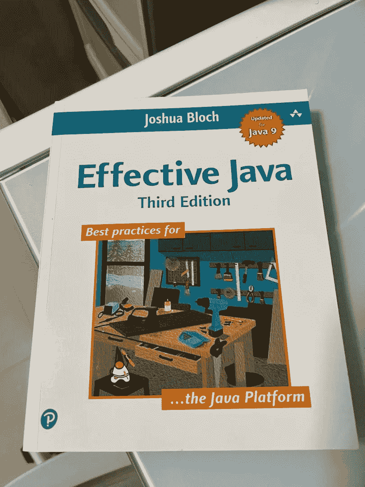

# 每个有经验的 Java 开发人员都应该阅读的 10 本书

> 原文：<https://medium.com/javarevisited/10-books-every-experienced-java-developer-should-read-51eb033e863f?source=collection_archive---------0----------------------->

## 正在寻找能让您的 Java 技能更上一层楼的书籍吗？这里是我最喜欢的给有经验的开发者看的 Java 书籍

除了编程，我的爱好之一是读书。我的智能手机和 PC 上有数百本电子书，我自己也有数十本书，尤其是与 Java 相关的。