# 2023 年 Java 开发人员应该阅读的 23 本书

> 原文：<https://medium.com/javarevisited/10-books-java-developers-should-read-in-2020-e6222f25cc72?source=collection_archive---------0----------------------->

[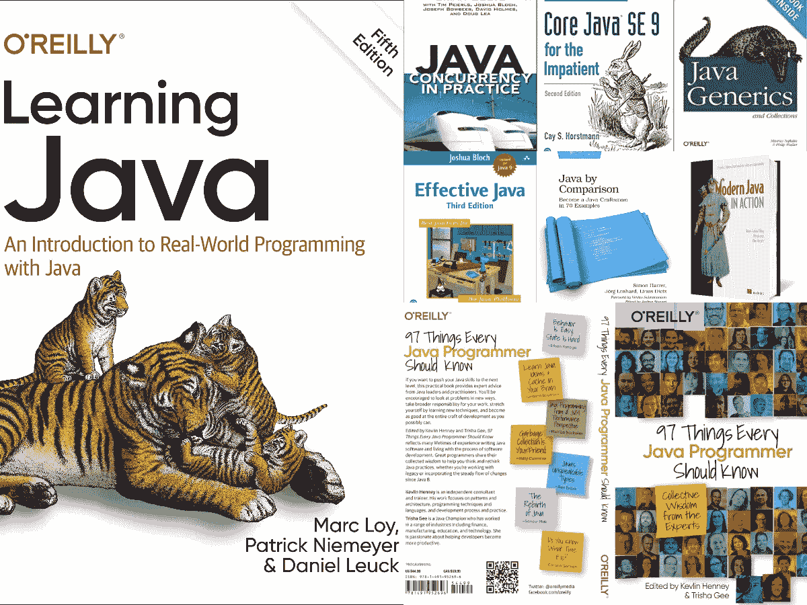](https://click.linksynergy.com/deeplink?id=JVFxdTr9V80&mid=39197&murl=https%3A%2F%2Fwww.udemy.com%2Fcourse%2Fmicroservices-with-spring-boot-and-spring-cloud%2F)

大家好，如果你是一名 Java 开发人员，想知道 2023 年读什么，那么你来对地方了。在本文中，我将分享 Java 开发者可以阅读的关于 Java、Spring 和相关技术的 10 本书。

我已经为更倾向于学习架构知识的有经验的 Java 开发人员准备了书籍，他们为[云](/javarevisited/5-best-courses-to-learn-spring-cloud-and-microservices-1ddea1af7012)、[微服务](/javarevisited/top-5-courses-to-learn-microservices-in-java-and-spring-framework-e9fed1ba804d)、 [Java 9](http://www.java67.com/2018/01/top-10-java-9-tutorials-and-courses.html) 到 Java 14 特性、Spring 5 特性进行开发，并考虑学习 [Kotlin](https://javarevisited.blogspot.com/2018/02/5-courses-to-learn-kotlin-programming-java-android.html) 来提高他们的生产力。

不过，我没有忘记初级和经验不足的 Java 开发人员，或者一些考虑在 2023 年开始 Java 世界之旅的人。

我还收录了 2023 年你可以阅读学习近期 Java 版本的书籍。一些书籍，如《T2》为缺乏耐心的人准备的《核心 Java SE 9》和《T4 Java:初学者指南》已经更新，涵盖了 Java SE 9 的发布。

这意味着如果你刚刚开始学习 Java 或想学习，这些是开始学习的理想书籍。除非我们说的是 [Head First Java](http://www.java67.com/2015/05/best-book-to-learn-java-for-beginners.html) ，否则从旧书入手毫无意义。

我真的希望 Head First Java 的第三版早该出版了，作者和出版商应该注意更新这本书，以包括 [Java 8](https://javarevisited.blogspot.com/2018/08/top-5-java-8-courses-to-learn-online.html) 和 [Java 9](https://www.freecodecamp.org/news/these-are-the-best-free-courses-to-help-you-learn-java-8-and-java-9-a7615c8644ab/?source=search_post---------9) 中的变化，但是，对于刚刚开始学习用 Java 编程而没有任何编程经验的人来说，这仍然是一本好书。

我最近加入这个列表的一个是**云原生 Java** ，是我最近发现的。这本书看起来棒极了，因为它涵盖了使用 [Spring Boot](https://hackernoon.com/top-5-online-courses-to-learn-spring-boot-in-2019-c2fd7a0282c2) 、 [Spring Cloud](https://javarevisited.blogspot.com/2018/04/top-5-spring-cloud-courses-for-java.html#axzz5e0d26KMT) 和 Cloud Foundry 为云开发 Java 应用程序这一迫切需要的主题。我还没有通读，但是到目前为止，看起来很不可思议。

# 面向所有技能水平的程序员的 23 本 Java 书籍

在 2023 年，你可以阅读很多好书来提高你的 Java 知识和技能，但是几乎不可能把它们都读完。尽管如此，与此同时，也有你不想错过的个别书籍，如 [Effective Java 第三版](https://javarevisited.blogspot.com/2017/10/effective-java-3rd-edition-coming-soon.html#axzz5Nf1J69kw)，这就是为什么我把它列在我的清单的第一位。

这个列表包含了关于 Java 9 和 10 特性、 [Spring 5](/javarevisited/10-best-online-courses-to-learn-spring-framework-in-2020-f7f73599c2fd) 、 [Kotlin](/javarevisited/7-free-courses-to-learn-kotlin-in-2020-327c3872c1e1) 、[软件架构](https://www.java67.com/2019/09/top-5-courses-to-learn-system-design.html)、[微服务](https://javarevisited.blogspot.com/2018/02/top-5-spring-microservices-courses-with-spring-boot-and-spring-cloud.html)、云的书籍，并学习 Java 8 发布的基本要素。

## 1.[钻研 Java 面试](https://gumroad.com/l/QqjGH)

这是我 10 年来的第一本书。如果你关注我，那么你可能知道我从 2010 年开始写 Java 文章，但是我没有任何书或课程，今年我已经完成了。现在，我有了自己的书— [寻找 Java 面试](https://gumroad.com/l/QqjGH)和自己的 Udemy 课程— [春季认证实践考试](https://www.udemy.com/course/spring-professional-practice-test-questions-vmware-edu-certification/?referralCode=7419B0A2C8AB79F0520E)。

破解 Java 面试并不容易，其中一个主要原因是 Java 非常庞大。要成为一名优秀的 Java 开发人员，需要掌握很多概念和 API。

许多擅长数据结构和算法、系统设计、SQL 和数据库等一般主题的人未能通过 Java 面试，因为他们没有花时间学习核心 Java 概念和基本 API 和软件包，如 Java 集合框架、多线程、JVM 内部、JDBC、设计模式和面向对象编程。

本书旨在填补这一空白，并向您介绍这些主题中的经典 Java 面试问题。

**这里是购买这本书的链接**——[寻找 Java 访谈](https://gumroad.com/l/QqjGH)

这本书也可以在亚马逊上为 Kindle 书迷购买，你可以在这里花 9.9 美元购买。

## 2.[每个 Java 程序员都应该知道的 97 件事:来自专家的集体智慧](https://www.amazon.com/Things-Every-Java-Programmer-Should/dp/1491952695/?tag=javamysqlanta-20)

这是同类书中的一本，在这里你将从世界各地的 Java 专家那里学到 97 件重要的事情。这本书由 [Trisha Gee](https://medium.com/u/65e525bb6e47?source=post_page-----e6222f25cc72--------------------------------) 和 [Kevlin Henney](https://medium.com/u/d9a09a07fe23?source=post_page-----e6222f25cc72--------------------------------) 编辑。这本书包括来自 97 位专家的 Java 编程建议，如 [Mala Gupta](https://medium.com/u/439aa1c2e46e?source=post_page-----e6222f25cc72--------------------------------)

你应该知道的 97 件事情中的几件:

*   “行为容易，状态难”——Edson Yanaga
*   “学习 Java 习惯用法并将其存储在大脑中”——作者 [Jeanne Boyarsky](https://medium.com/u/8d2bb6bc11d9?source=post_page-----e6222f25cc72--------------------------------)
*   “从 JVM 性能角度看 Java 编程”——作者 [Monica Beckwith](https://medium.com/u/61ef13f51b58?source=post_page-----e6222f25cc72--------------------------------)
*   “垃圾收集是你的朋友”——霍利·K·卡明斯
*   “Java 不可描述的类型”——[本·埃文斯](https://medium.com/u/61f7d78ffe04?source=post_page-----e6222f25cc72--------------------------------)
*   《Java 的重生》——[桑德·麦](https://medium.com/u/e77092f1acb5?source=post_page-----e6222f25cc72--------------------------------)
*   “你知道现在几点了吗？”克里斯汀·戈尔曼

> 如果你只想看书，我认为你应该在 2023 年读这本书，它肯定会给你留下持久的印象，并帮助你成为一名更好的开发人员。

非常感谢 Java 社区创造了这本了不起的书。

[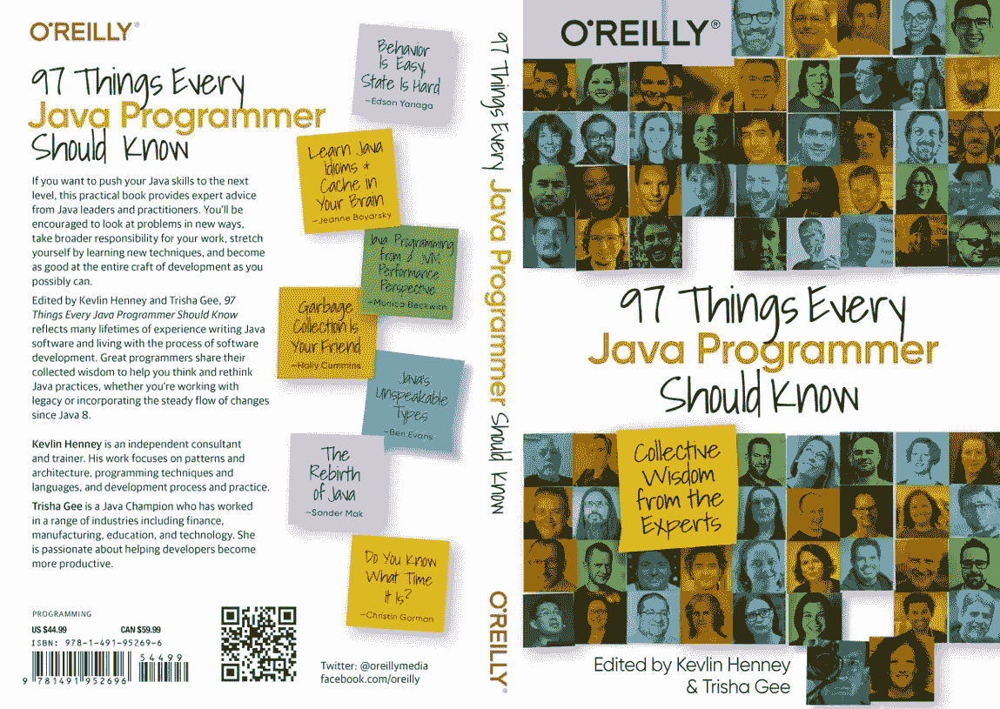](https://www.amazon.com/Things-Every-Java-Programmer-Should/dp/1491952695/?tag=javamysqlanta-20)

## 3.[云原生 Java](https://www.amazon.com/Cloud-Native-Java-Designing-Resilient/dp/1449374646?tag=javamysqlanta-20)

大家好，如果你读到这里，那么你已经赢得了奖金，这就是为什么我要分享 2023 年最有用的 Java 书籍之一，Cloud Native Java。

如今的软件开发都是关于云、微服务、分布式架构等。本实用指南 Josh Long 和 Kenny Bastani 向 Java/JVM 开发人员展示了如何使用、 [Spring Cloud](https://dzone.com/articles/top-5-spring-cloud-courses-for-java-developers-to) 和 Cloud Foundry 构建更好更快的 Java 应用程序。

这是有经验的 Java 程序员的必读书籍之一。尽管它处理了一个高级主题，我还是强烈推荐这本书给每一个 Java 开发人员。

如果你愿意，你也可以将这本书与同为博主、Udemy 畅销书作家的 Ranga Karnam 的《Spring Boot 与春云 大师微服务》相结合。如果你正在寻找一些实用的知识，这是一个很好的课程。

## 4.[有效 Java 第三版](https://www.amazon.com/Effective-Java-3rd-Joshua-Bloch/dp/0134685997/?tag=javamysqlanta-20)

如果你还没有学过，这将是你 2023 年要读的第一本书。第三版早就应该发布了，而且发布的正是时候。新版本还涵盖了 JDK 7、8 和 9 的功能。这实际上是 Joshua Bloch 给 Java 开发人员写的最好的书，你会学到很多关于如何正确使用 Java 编程语言和他们的 API 的知识。我只花了一周左右的时间来阅读这本书，但我发现自己一直在寻找新的内容，尤其是关于 Java Se 8 和 Java 9 的内容。我通过阅读这本书了解了 Java 模块化，它也帮助我理清了我对 Java 8 特性的一些误解。

顺便说一句，如果你是 Java 编程的新手，那么你也可以将这本书与 Udemy 上的 Java masterclass 的完整课程结合起来。最新的课程之一，涵盖了最新版本中的新 Java 特性。

[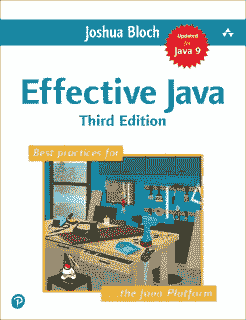](https://www.amazon.com/Effective-Java-3rd-Joshua-Bloch/dp/0134685997/?tag=javamysqlanta-20)

## 5.[现代 Java 菜谱](https://www.amazon.com/Modern-Java-Recipes-Solutions-Difficult/dp/149197317X?tag=javamysqlanta-20)

如果你喜欢食谱，那么这本书是一本好书。如题，它包含了 Java 8 和 9 中严重问题的简单解决方案。

您将了解如何使用 lambda 表达式、方法引用和流 API 使用 Java 8 习惯用法编写代码。

如果你想通过学习教程和例子来学习 Java 8 和 Java 9，这是一本非常好的书。如果你需要资源，那么你也可以看看我列出的[学习 Java 8 到 Java 14](/javarevisited/top-5-courses-to-learn-new-features-of-java-8-to-java-13-107eb51d2a13) 的最佳在线课程，这是一个学习 Java 新特性的短期课程集。

[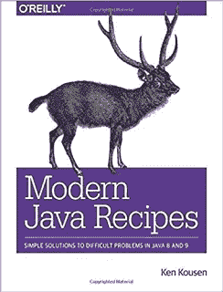](https://www.amazon.com/Modern-Java-Recipes-Solutions-Difficult/dp/149197317X?tag=javamysqlanta-20)

## 6. [Java 9 模块化](https://www.amazon.com/Java-Modularity-Developing-Maintainable-Applications/dp/1491954167/?tag=javamysqlanta-20)

Java 9 版本的亮点之一是 Java 模块化或 Java 模块，这本书提供了关于该主题的最全面的内容。

说到 Java 9 模块，作者 Sanders Mak 是个权威，我上过他的一些 Java 9 课程像 [**Java 9 模块**](https://pluralsight.pxf.io/c/1193463/424552/7490?u=https%3A%2F%2Fwww.pluralsight.com%2Fcourses%2Fjava-9-modularity-first-look) 和[**Java 9 的新特性**](https://pluralsight.pxf.io/c/1193463/424552/7490?u=https%3A%2F%2Fwww.pluralsight.com%2Fcourses%2Fjava-9-whats-new) 在 Pluralsight 上，我可以很有把握地说，在你把时间和金钱投入到这本书上之后，你不会失望的。

顺便说一句，你需要每个月 29 美元或每年 299 美元的课程的会员资格。这种订阅是物有所值的，因为它提供了 7000 多门课程。或者，你也可以使用他们的 [**10 天免费通行证**](https://pluralsight.pxf.io/c/1193463/424552/7490?u=https%3A%2F%2Fwww.pluralsight.com%2Flearn) 来访问这些课程。

## 7.[不耐烦的核心 Java SE 9(第二版)](http://www.java67.com/2018/02/3-books-to-learn-java-from-scratch-in.html)

如果你急着学 Java，那么这就是我推荐给你的书。我是凯西·s·霍斯特曼作品的忠实粉丝，也非常喜欢他所涵盖的大量细节。

看过他其他关于 [Java 8](/javarevisited/7-best-java-tutorials-and-books-to-learn-lambda-expression-and-stream-api-and-other-features-3083e6038e14) 、 [Scala](https://javarevisited.blogspot.com/2019/01/5-free-scala-programming-courses-for-java-programmers-learn-online.html) 、[核心 Java](/javarevisited/10-free-courses-to-learn-java-in-2019-22d1f33a3915) 的书，可以说看完这本书你也会成为他的粉丝。

最近已经更新涵盖了 [Java SE 9 特性](/javarevisited/5-courses-to-learn-java-9-features-in-depth-373f7afcf9fa)，如果你想学习 Java 9，那么这是你 2023 年应该读的第一本书。顺便说一句，我们目前正在开发 Java 14，所以仍然有点过时，但是任何一本书都很难跟上 Java 6 个月的发布周期。

因此，学习 Java 的最好方法是将这本书与更新的课程结合起来，如 Udemy 上 Tim Buchalaka 的[**完整的 Java 大师班**](https://click.linksynergy.com/fs-bin/click?id=JVFxdTr9V80&subid=0&offerid=323058.1&type=10&tmpid=14538&RD_PARM1=https%3A%2F%2Fwww.udemy.com%2Fjava-the-complete-java-developer-course%2F) ，它不仅能给你一些主动的指导学习，还能帮助你快速学习 Java。

[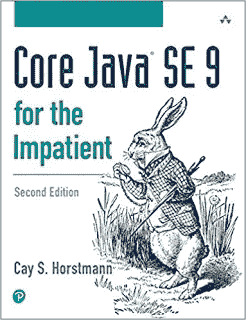](http://www.java67.com/2018/02/3-books-to-learn-java-from-scratch-in.html)

## 8.[春天微服务在行动](https://www.amazon.com/Spring-Microservices-Action-John-Carnell/dp/1617293989?tag=javamysqlanta-20)

软件开发界越来越倾向于微服务架构，因为它在开发、支持、部署、可伸缩性和可靠性方面提供了许多好处。

谢天谢地 Spring framework 提供了类似 [Spring Boot](https://javarevisited.blogspot.com/2018/05/top-5-courses-to-learn-spring-boot-in.html) 和 [Spring Cloud](https://dzone.com/articles/top-5-books-to-learn-spring-boot-and-spring-cloud) 的工具，可以用来用 Java 写微服务。

如果你热衷于用 Spring 框架进行微服务开发，那么这本书就是给你的。

如果你愿意，你也可以将这本书与同为博主、Udemy 畅销书作家的 Ranga Karnam 的《与 Spring Boot 的 [**大师微服务》和《春云**](https://click.linksynergy.com/deeplink?id=JVFxdTr9V80&mid=39197&murl=https%3A%2F%2Fwww.udemy.com%2Fcourse%2Fmicroservices-with-spring-boot-and-spring-cloud%2F) 相结合。如果你正在寻找一些实用的知识，这是一个很好的课程。

[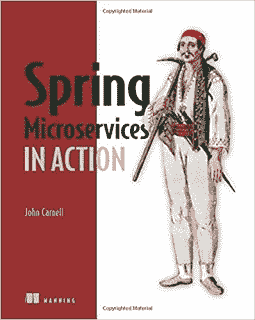](https://manning.com/books/spring-microservices-in-action?a_aid=javarevisited&a_bid=93d4e4f4)

## 9.[清洁建筑](http://javarevisited.blogspot.sg/2017/09/clean-architecture-by-uncle-bob-martin.html#axzz4tzMEHSJw)

这是我去年读过的一本书，非常喜欢。我是 Robert C. Martin 或者包括 Bob 的忠实粉丝，读过他的 [Clean Code](http://javarevisited.blogspot.sg/2017/10/clean-code-by-uncle-bob-book-review.html) 和 [Clean Coder](http://javarevisited.blogspot.sg/2014/09/top-6-books-to-learn-programming-coding.html#axzz4tzMEHSJw) 的书，我必须说这本书完成了 clean codebook 的三部曲。这本书将告诉你如何创建一个能够经受时间考验的软件架构，并且消除对设计模式和软件架构的误解。如果你是一名经验丰富的 Java 开发人员，并且正在考虑成为一名解决方案架构师，那么这是你应该在 2023 年阅读的一本书。如果你需要课程，可以看看我之前的文章[我最喜欢的学习软件架构的课程](/javarevisited/top-5-courses-to-learn-software-architecture-in-2020-best-of-lot-5d34ebc52e9)。

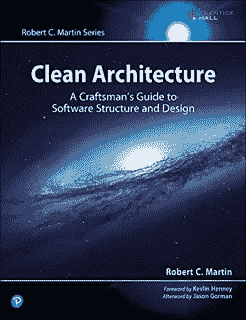

## 10.[春季 5 食谱:解决问题的方法](https://www.amazon.com/Spring-5-Recipes-Problem-Solution-Approach/dp/1484227891?tag=javamysqlanta-20)

Spring 5 是流行的 Java 应用程序开发框架的最新版本，它在 Spring 中引入了反应式编程特性。毫无疑问，Spring 是 Java 开发中最流行的框架，所以了解一下 [Spring 5](https://javarevisited.blogspot.com/2018/06/top-6-spring-framework-online-courses-Java-programmers.html) 中的新特性并保持最新是值得的。

我个人喜欢食谱，因为它们是基于任务的方法，这也是为什么我在其他学习的[春季 5 本书中选择了这本书。它不仅涵盖了 Spring 5 的新特性，还涵盖了早期版本中的所有其他增强功能。简而言之，它教你如何在 Spring 5 中编码。如果你需要一门课程，可以把这本书和 Udemy 网站上 John Thomspon 的《Spring Framework 5:初学者到大师》结合起来。深入学习 Spring 5 是一门很棒的课程。](/javarevisited/5-advanced-spring-framework-books-experienced-java-developers-should-read-in-2020-best-of-lot-2a786fc5ad31?source=---------6-----------------------)

## 11.[科特林在行动](http://javarevisited.blogspot.sg/2018/02/top-3-jvm-languages-java-programmer-learn.html#axzz56WXxxAC0)

Java 开发人员学习其他 JVM 语言，如 [Scala](https://dev.to/javinpaul/why-java-programmer-should-learn-scala-and-functional-programming-5hej) 、 [Groovy](https://javarevisited.blogspot.com/2017/08/top-5-books-to-learn-groovy-for-java.html#axzz5dPh77Fzl) 和 Closure，成为通晓多种语言的程序员，这是很常见的，Kotlin 无疑是这一时刻的领导者。

2017 年，谷歌宣布 Kotlin 作为 Google IO 中 Android 开发的官方语言，从此对学习 [Kotlin](/javarevisited/kotlin-vs-scala-which-is-right-for-you-dc91db366b0) 产生了浓厚的兴趣。然而，更重要的是，它提供了生产力优势，并且是 100%的 Java。所以，如果你想在 2023 年学习一门 JVM 语言，我会说，学习 Kotlin 就好了，如果你需要一门课程来结合这本书更好地学习，你可以加入 Udemy 上的 [**完整的 Android Kotlin 开发者课程**](https://click.linksynergy.com/deeplink?id=JVFxdTr9V80&mid=39197&murl=https%3A%2F%2Fwww.udemy.com%2Fcourse%2Fthe-complete-kotlin-developer-course%2F) ，这是学习 Kotlin 最深入和最实用的课程之一。

[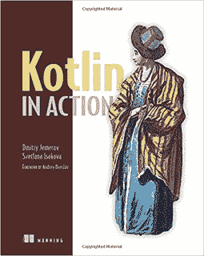](https://click.linksynergy.com/deeplink?id=JVFxdTr9V80&mid=39197&murl=https%3A%2F%2Fwww.udemy.com%2Fcourse%2Fthe-complete-kotlin-developer-course%2F)

## 12. [Java:初学者指南，第七版](http://javarevisited.blogspot.sg/2017/12/top-20-java-books-of-2017-which-you-can-read-in-2018.html#axzz58AXV2r1A)

这是又一本从零开始学习核心 Java 的经典书籍。这本书的第七版现在已经出来了，更新后涵盖了 Java SE 9。

如果你想在 2023 年用 Java 开始你的编程生涯，那么你可以看看这本[学习现代 Java](https://www.freecodecamp.org/news/must-read-books-to-learn-java-programming-327a3768ea2f/) 的书。

这比列表中的第二本书更全面，第二本书也涵盖了 Java 9(T21)，但是很难找到一本涵盖 Java 14(Java 的最新版本)的书。

这就是为什么我建议你参加一个在线课程，在阅读本书的同时学习 Java。如果你需要推荐，请查看 Udemy 上的 [Java 编程完全初学者](https://click.linksynergy.com/deeplink?id=JVFxdTr9V80&mid=39197&murl=https%3A%2F%2Fwww.udemy.com%2Fcourse%2Fjava-programming-tutorial-for-beginners%2F)课程。

## 13. [Spring Boot:启动并运行](https://www.oreilly.com/library/view/spring-boot-up/9781492076971/)

这是一本学习 Spring Boot 的好书，作者是来自 VMware 的 [Mark Heckler](https://medium.com/u/5fda8d47ecf8?source=post_page-----e6222f25cc72--------------------------------) ，他是 Spring 的幕后公司，引导你了解 Spring Boot 的架构和方法，以及调试、测试和部署等主题。我

如果你想用 Spring Boot 快速有效地开发云原生 Java 或 Kotlin 应用——使用反应式编程、构建 API 和创建各种数据库访问——这本书正适合你。这仍是一部进展中的作品，但值得一读。

为了获得更好的学习体验，你还可以将这本书与欧根·帕拉斯基夫的[**Learn Spring:The Certification Class**](https://courses.baeldung.com/p/ls-certification-class?utm_source=javarevisited&utm_medium=web&utm_campaign=lss&affcode=22136_bkwjs9xa)结合起来，这可能是从头开始学习 Spring 5 和 Spring Boot 2 的最佳课程，以一种有指导的、以代码为中心的方式

[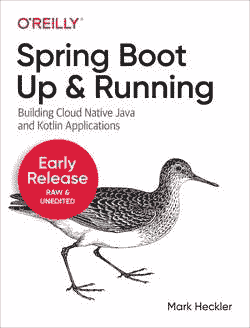](https://courses.baeldung.com/p/ls-certification-class?utm_source=javarevisited&utm_medium=web&utm_campaign=lss&affcode=22136_bkwjs9xa)

## 14.[反作用弹簧](https://www.amazon.com/Reactive-Spring-Josh-Long-ebook/dp/B08H4QZFM8/?tag=javamysqlanta-20)

反应式编程是软件开发的未来，这似乎是另一本关于使用 Spring 学习反应式编程的好书。

这本书将涵盖反应式编程中的重要概念，包括 project Reactor 和反应式流规范、数据访问、web 编程、带有 RSocket 等协议的 RPC、测试、集成和组合等等。

这本书现在已经完成了。我还没有读过这本书，但很快就会读了，我把它写在这里是因为乔希·朗(作者)自己推荐了这本书。

你可以在亚马逊上买到这本书，它现在有 Kindle 版本。

**这里是购买本书的链接**——[反应弹簧](https://www.amazon.com/Reactive-Spring-Josh-Long-ebook/dp/B08H4QZFM8/?tag=javamysqlanta-20)

## 15. [Java 对比:成为 Java 工匠 70 例](https://amzn.to/2l33Aul)

对于真正想磨练自己的 Java 技能，成为一名 Java 工匠的 Java 程序员来说，这又是一本很棒的书。这不是一本关于句法和语义的书，而是如何以更好的方式做现实世界中的事情。如果你想成为每个公司都想雇佣的专业 Java 开发人员，那么这本书就是为你准备的。

这本书是由[西蒙·哈勒](https://medium.com/u/6b7feee84681?source=post_page-----e6222f25cc72--------------------------------)、@约尔格·伦哈德、[莱纳斯·迪茨](https://medium.com/u/222d811c0898?source=post_page-----e6222f25cc72--------------------------------)这些 Java 和 clean code 圈的知名人士写的。这本书充满了干净代码的建议，这并不奇怪。如果你知道，提高你的[编码技能的最好方法之一](/javarevisited/6-coding-books-every-programmers-and-software-developers-should-read-620124886c8f)就是将你的代码与专业程序员进行比较，但是并不是每个人都有机会与专家一起工作。

这本书为你提供了一个难得的机会，你可以将你的代码与 Java 专家的代码进行比较，然后从你的错误和新发现中学习。

[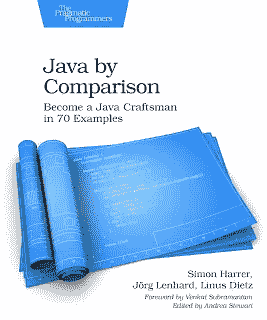](https://amzn.to/2l33Aul)

这本书通过简单易懂的例子，将有缺陷的代码与改进的例子进行比较，提供了提升编码风格的实用建议。在这个过程中，你会学到一些方便的技巧和窍门，以及一个有经验的 Java 程序员需要知道的常见错误。

简而言之，每一个 Java 开发人员都应该阅读的一本实用、实用、解释清楚的书。如果你喜欢有效的 Java，我想你也会喜欢这本书。

## 16.[Ng-Book——关于 Angular 的全集](https://gumroad.com/a/221148275)

这并不完全是一本 Java 书，但却是一本值得 Java 开发人员阅读的书，尤其是那些使用 Angular 和 Javascript 构建前端的全栈 Java 开发人员。

这本书，也被称为 Ng-Book，经常被称为 Angular 的圣经。如果你正在寻找一个简单而详细的角度世界指南，那么这本书是给你的。

另外，还有什么比框架开发者自己写的书更好的呢？

**作者和撰稿人:** [内特·默里](https://medium.com/u/6538666cdb34?source=post_page-----e6222f25cc72--------------------------------) [费利佩·库里](https://medium.com/u/2dc4fd2962e7?source=post_page-----e6222f25cc72--------------------------------) [阿里·勒纳](https://medium.com/u/aca4e71969df?source=post_page-----e6222f25cc72--------------------------------) [卡洛斯·塔沃尔达](https://medium.com/u/bb2517e9de0b?source=post_page-----e6222f25cc72--------------------------------) [尼克·拉博伊](https://medium.com/u/a51dc06b165e?source=post_page-----e6222f25cc72--------------------------------) [伯克·荷兰](https://medium.com/u/d4377b6d15d2?source=post_page-----e6222f25cc72--------------------------------)

第一章介绍如何编写第一个 Angular 9 应用程序，第二章介绍如何使用注释和类型将数据绑定到组件以及 Typescript 的介绍。它的价格是 79 美元，你可以在亚马逊或者他们自己的网站上购买。他们还提供了一个**免费章节**，你可以在这里下载其 PDF。

[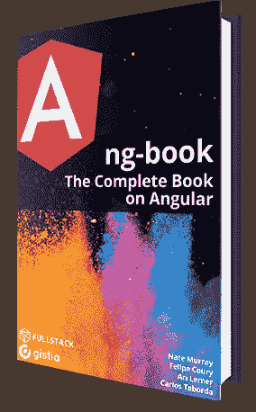](https://gumroad.com/a/221148275)

如果你愿意，你也可以将这本书与马克西米连在 Udemy 上的[**Angular——完整指南**](https://click.linksynergy.com/fs-bin/click?id=JVFxdTr9V80&subid=0&offerid=323058.1&type=10&tmpid=14538&RD_PARM1=https%3A%2F%2Fwww.udemy.com%2Fthe-complete-guide-to-angular-2%2F) 课程结合起来，它也涵盖 Angular，是任何寻求主动学习的人的可靠资源。

## 17.[AWS 的好部分:穿过杂乱的东西](https://www.educative.io/courses/good-parts-of-aws?affiliate_id=5073518643380224)

这是另一本不完全是 Java 的书，但也值得 Java 开发人员阅读，尤其是那些在 AWS 工作的人。由于云正在改变 Java 应用程序的开发方式，Java 开发人员有必要了解 AWS、Azure 和 GCP 等云计算平台，学习 AWS 是有意义的，因为它是市场领导者。

并且，这是你可以在网上找到的学习实用 AWS 的最佳书籍之一。这本书是由拥有 15 年 AWS 工作经验的前亚马逊工程师丹尼尔·瓦萨洛和 T2·乔希·普肖尔所写。

这不是你典型的 AWS 参考书。你不会在 AWS 文档中找到这里分享的大部分知识。这里的目标是帮助你认识到不使用 AWS 的哪些功能是愚蠢的——这些功能已经通过了时间的考验，是互联网上大多数东西的支柱。

这是 Gumroad 上的一本电子书，如果你喜欢读书，那么你也可以看看《T4》**AWS**电子书的精彩部分。如果你使用上面的链接买书，有 20%的折扣。

[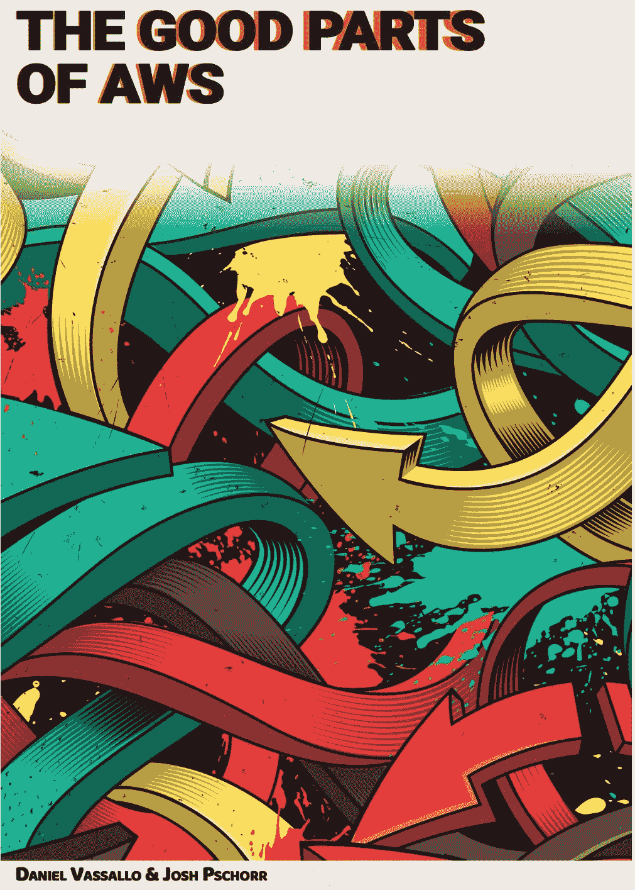](https://gumroad.com/a/703100019/MsVlG?offer_code=javinpaul)

而且，如果你更喜欢从课程中学习，这本书上还有一个互动课程，在那里你将学习一种技术，用于帮助做出可靠的技术选择，而不会在面对如此多的选择时陷入瘫痪。

你将从浏览 AWS 提供的最基本的服务开始，比如 DynamoDB、S3、EC2。每一部分都详细说明了它的用法、优缺点、为什么应该(或不应该)使用它，等等。

**这里是报名参加本课程的链接—**[**AWS 的好部分:穿越杂乱**](https://www.educative.io/courses/good-parts-of-aws?affiliate_id=5073518643380224)

你可以购买这门课程，也可以获得教育会员资格来学习这门课程。如果你问我，我建议你购买<https://www.educative.io/subscription?affiliate_id=5073518643380224>**教育订阅，每月花费 **$17** (现在打五折)，对于需要不断学习的程序员和软件工程师来说，完全值得。感谢[教育团队](https://medium.com/u/163aa84775f6?source=post_page-----e6222f25cc72--------------------------------)提供这个令人敬畏的课程。**

## **18.[杰出的开发者](https://gumroad.com/a/749663347)**

**这是另一本书，虽然不完全是关于 Java 的，但是对包括 Java 程序员在内的任何软件开发人员都非常有用。这本书是由兰德尔·卡纳和他的 T2 创作的，这是一本关于求职、面试和获得工作的完整指南**

**如果你厌倦了无休止的求职，感觉自己的简历没有被看到，这本书将帮助你制作一份出色的简历，让它脱颖而出，并被你想要的公司看到。**

**Kanna 分享了他的故事，讲述了她是如何让谷歌、脸书和 LinkedIn 等公司通过创建在线形象来联系我的。**

**如果你想在科技行业找到一份[的高薪工作？想让公司向你伸出援手，那么你应该读读这本书。](/javarevisited/these-are-the-highest-paying-tech-jobs-programmers-can-aim-to-increase-their-pay-c59e1eeb6904?source=---------96------------------)**

****这里是购买这本书的链接**——[杰出开发者](https://gumroad.com/a/749663347)**

**[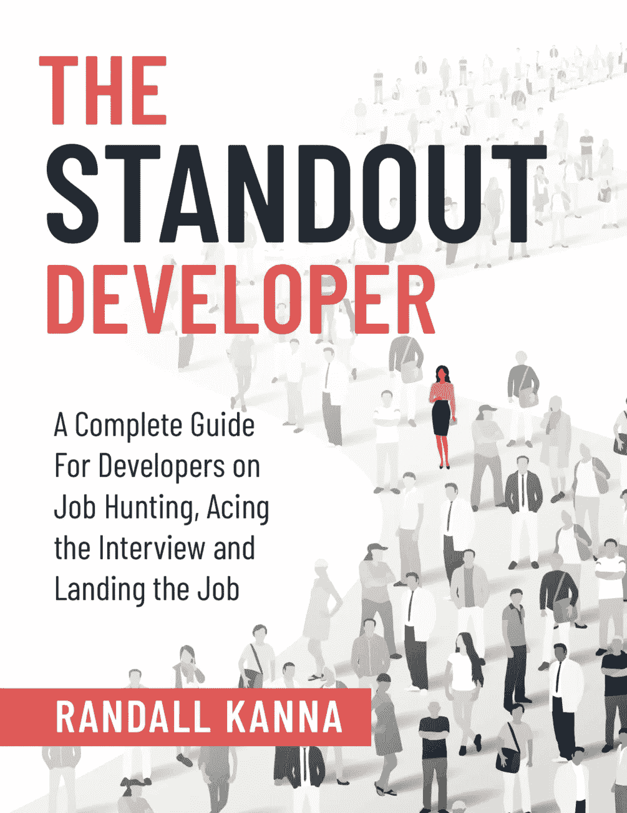](https://gumroad.com/a/749663347)**

## **19.[黑客入侵 Spring Boot 2.3:反应版](https://www.amazon.com/Hacking-Spring-Boot-2-3-Reactive-ebook/dp/B086722L4L?tag=javamysqlanta-20)**

**如果你正在寻找一本掌握新版 Spring Boot 和反应式编程的书，那么这本书就是给你的。由 Greg L. Turnquist 创作的这本书是反应式编程的新浪潮，它将教你创建一个可伸缩的 Java 应用程序的关键技术。**

**以下是你将在本书中学到的关键内容:**

*   **网络和数据访问**
*   **开发者工具和测试支持**
*   **操作特征**
*   **[码头集装箱](/javarevisited/top-10-free-courses-to-learn-jenkins-docker-and-kubernetes-for-devops-in-2020-best-of-lot-62a0541ffeb3)**
*   **使用 BlockHound 发现瓶颈**
*   **信息发送**
*   **安全性**

**使用 Project Reactor 编写，您的应用程序将以前所未有的方式扩展。**

**格雷格·l·特恩奎斯特是 Spring Boot 和春天的权威。他在 Spring 团队工作，是 VMware 的首席开发人员。他是 Spring HATEOAS、Spring Data、Spring Boot、R2DBC 和 MongoDB 的 Spring Session 的提交者。他还写了 Packt 最畅销的书名， [*学习 Spring Boot 2.0 第二版*](https://www.amazon.com/Learning-Spring-Boot-2-0-microservices-ebook/dp/B01LPRN0Z8?tag=javamysqlanta-20) 。**

****

## **20。 [**树莓 Pi 上的 Java 入门**](https://www.amazon.com/Getting-Started-Java-Raspberry-Pi-ebook/dp/B085G6GNDF?tag=javamysqlanta-20)**

**这本书提供了一种不同的学习 Java 的方法，将它与 Raspberry Pi 和电子元件结合起来，作者是[弗兰克·德尔博特](https://medium.com/u/a6ee926d3fc8?source=post_page-----e6222f25cc72--------------------------------)**

**除了对 [Java](/javarevisited/10-free-courses-to-learn-java-in-2019-22d1f33a3915?source=collection_home---4------8-----------------------) 、 [JavaFX](/javarevisited/6-free-courses-to-learn-servlet-jsp-and-java-fx-in-2020-best-of-lot-720201c84f63) 和 [Maven](/javarevisited/top-10-free-courses-to-learn-maven-jenkins-and-docker-for-java-developers-51fa7a1e66f6?source=collection_home---4------3-----------------------) 的简短介绍之外，还有大量的例子让你学会使用和控制 LED、按钮、LCD 和 LED 显示器、传感器……等等。使用 Pi4J、 [Spring](/javarevisited/10-best-online-courses-to-learn-spring-framework-in-2020-f7f73599c2fd) 、Mosquitto MQTT、H2、Arduino 等概念验证 Java 应用解释不同的框架和程序。**

**如果您是 Java 新手，您将通过跟随示例一点一点地学习这门语言。作为一名经验丰富的 Java 程序员，你将学会如何扩展你的知识，如何用简单便宜的组件控制你周围的世界。**

**这本书在亚马逊和 Leanpub 上有电子书，在 Elektor 上有纸质书。**

**如果你喜欢课程，Frank 也有一门关于 Udemy 的课程— [**在树莓 PI 上使用 Java 和 Java FX**](https://click.linksynergy.com/deeplink?id=JVFxdTr9V80&mid=39197&murl=https%3A%2F%2Fwww.udemy.com%2Fcourse%2Fuse-java-11-and-java-fx-11-on-a-raspberry-pi%2F)来学习更多关于在 Java 中使用树莓 PI 的知识。**

**[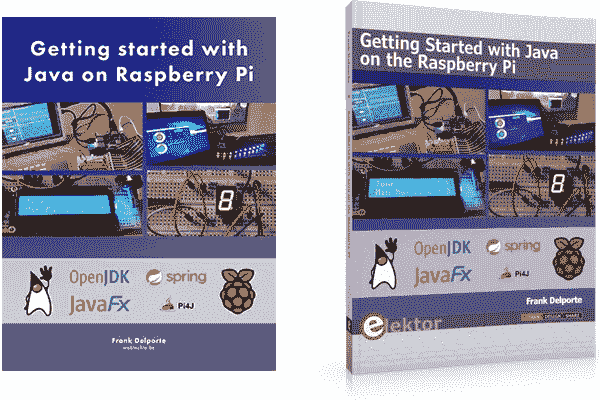](https://click.linksynergy.com/deeplink?id=JVFxdTr9V80&mid=39197&murl=https%3A%2F%2Fwww.udemy.com%2Fcourse%2Fuse-java-11-and-java-fx-11-on-a-raspberry-pi%2F)**

## **21.[学习 Java:用 Java 进行真实世界编程的介绍](https://www.amazon.com/Learning-Java-Introduction-Real-World-Programming/dp/1492056278/?tag=javamysqlanta-20)**

**这是另一本可以用来学习 Moden Java 的书。这本书涵盖到 Java SE 11，还不错。**

**这本书很容易阅读，作者 [Marc Loy](https://medium.com/u/580e2b280919?source=post_page-----e6222f25cc72--------------------------------) 、 [Patrick Niemeyer](https://medium.com/u/f40d54194d34?source=post_page-----e6222f25cc72--------------------------------) 和 [Daniel Leuck](https://medium.com/u/b1872c50d516?source=post_page-----e6222f25cc72--------------------------------) 已经做了很好的工作，用有趣的、引人注目的和现实的例子向你介绍 Java 基础知识。**

**您还将了解 Java 类库、编程技术和习惯用法，着眼于构建真正的应用程序。**

**此外，为了获得更好的学习体验，请将本书与更新的课程相结合，如由 Tim Buchalaka 在 Udemy 上撰写的[**完整的 Java Masterclass**](https://click.linksynergy.com/fs-bin/click?id=JVFxdTr9V80&subid=0&offerid=323058.1&type=10&tmpid=14538&RD_PARM1=https%3A%2F%2Fwww.udemy.com%2Fjava-the-complete-java-developer-course%2F) ，它不仅能为您提供一些主动的指导学习，还能帮助您快速学习 Java。**

**[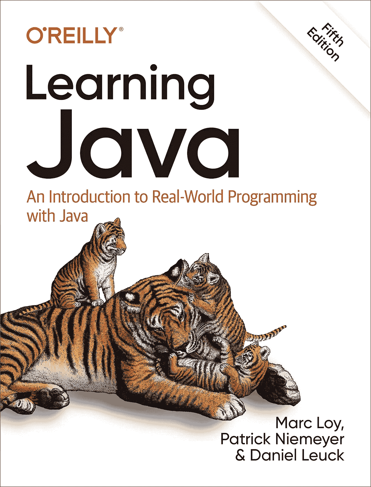](https://click.linksynergy.com/fs-bin/click?id=JVFxdTr9V80&subid=0&offerid=323058.1&type=10&tmpid=14538&RD_PARM1=https%3A%2F%2Fwww.udemy.com%2Fjava-the-complete-java-developer-course%2F)**

## **22.[开始 Java 8 语言特性](https://www.amazon.com/Beginning-Java-Language-Features-Expressions/dp/1430266589?tag=javamysqlanta-20)**

**尽管 Java SE 8 首次发布已经快 4 年了，但仍有许多 Java 开发人员尚未开始使用 Java 8。

如果你是他们中的一员，或者正在努力理解 [lambda 表达式](http://javarevisited.blogspot.sg/2014/02/10-example-of-lambda-expressions-in-java8.html#axzz58JWfSRgv)，Stream API，Optional，以及其他 Java 8 增强功能的人，那么你一定要看这本书。

这是 3 本书的合集，直白地解释了你的 Java 8 基础知识。该作者的另外两本书从 Java 8 的角度涵盖了高级主题，如 [JDBC](http://www.java67.com/2018/03/top-5-free-jdbc-courses-for-java.html) 、Swing、Java FX 和 Java 网络 API。**

**如果你需要课程，也可以在 Udemy 上 checkout [**用 Lambdas 和 Ranga Rao Karnam 的 Stream API**](https://click.linksynergy.com/deeplink?id=JVFxdTr9V80&mid=39197&murl=https%3A%2F%2Fwww.udemy.com%2Fcourse%2Ffunctional-programming-with-java%2F) 学习 Java 中的函数式编程。这是学习 JAva 函数式编程的一门很棒的实践课程。**

**[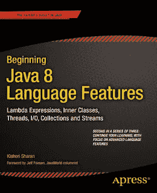](https://www.amazon.com/Beginning-Java-Language-Features-Expressions/dp/1430266589?tag=javamysqlanta-20)**

## **23.[Java 故障排除](https://www.amazon.com/exec/obidos/ASIN/1617299774?tag=javamysqlanta-20)**

**这是一本新的 Java 书籍，初学者和有经验的 Java 开发人员都可以阅读，以学习如何有效地排除 Java 应用程序的故障。实际上，对于想学习如何调试和优化 JVM 应用程序的高级 Java 开发人员来说，这是一本很好的读物。**

**[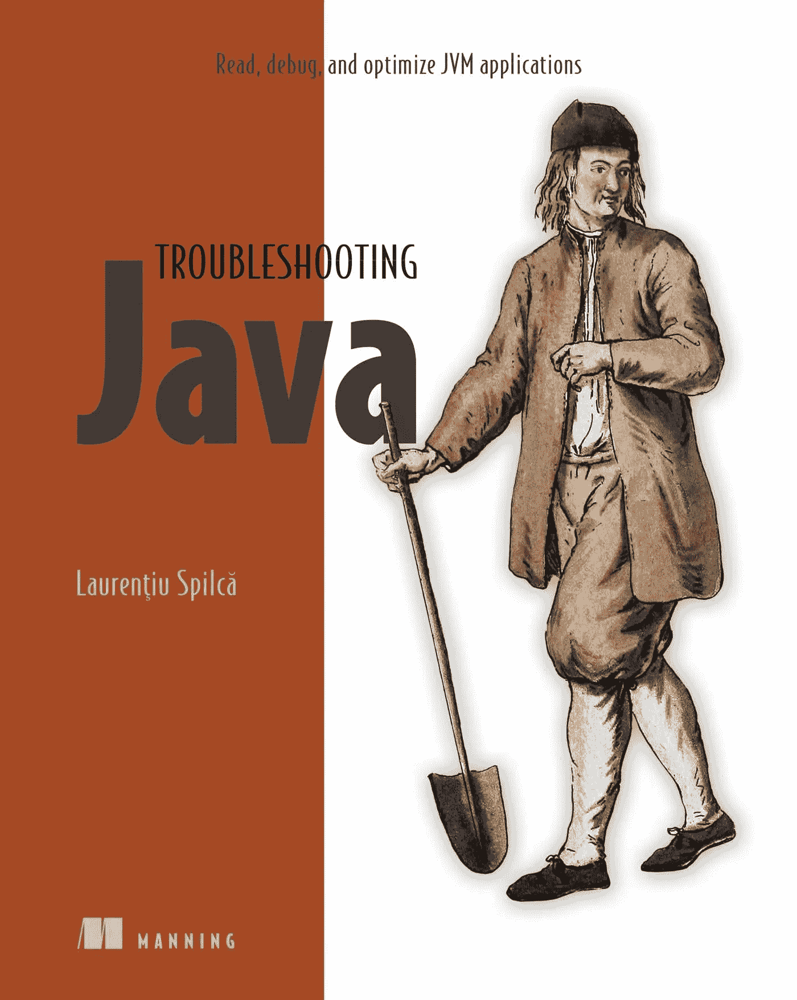](https://www.amazon.com/exec/obidos/ASIN/1617299774?tag=javamysqlanta-20)**

**以上是 Java 开发人员在 2023 年可以阅读的一些有趣而有用的书籍。说实话，有很多东西要学，甚至要让自己跟上 Java 世界发生的事情，比如 Java 9 到 Java 17，Spring 5，[微服务](/javarevisited/top-5-courses-to-learn-microservices-in-java-and-spring-framework-e9fed1ba804d)， [Kotlin](https://hackernoon.com/top-5-kotlin-programming-courses-for-java-and-android-programmers-49e842b8af1a) 等。这些书不仅能为你提供最新的知识，还能增进你对新功能的理解。

其他 **Java 文章**你可能喜欢**

*   **[2023 年 Java 开发者路线图](https://javarevisited.blogspot.com/2019/10/the-java-developer-roadmap.html#axzz64YOHJ2TL)**
*   **[成为全栈 Java 开发人员的前 5 门课程](https://javarevisited.blogspot.com/2020/04/top-5-courses-to-become-full-stack-java-developer-with-Angular-and-Reactjs.html#axzz6Nq9yk7Sc)**
*   **[2023 年 Java 开发者应该学会的 10 件事](http://javarevisited.blogspot.sg/2017/12/10-things-java-programmers-should-learn.html#axzz53ENLS1RB)**
*   **[10 门高级核心 Java 课程](https://javarevisited.blogspot.com/2020/04/top-10-advanced-core-java-courses-for-experienced-developers.html)**
*   **[Kotlin 还是 Java？Android 开发者选择哪个比较好？](http://javarevisited.blogspot.sg/2018/02/kotlin-vs-java-which-language-android.html)**
*   **[学习 Spring 框架的 10 门免费课程](/javarevisited/top-10-free-courses-to-learn-spring-framework-for-java-developers-639db9348d25)**
*   **[Java 程序员的 10 个日常工具](http://javarevisited.blogspot.sg/2017/03/10-tools-used-by-java-programming-Developers.html#axzz55lrMRnNC)**
*   **[学习春天和 Spring Boot 在线的 5 门免费课程](http://www.java67.com/2017/11/top-5-free-core-spring-mvc-courses-learn-online.html)**
*   **[2023 年 Java 开发人员应该学习的 10 个框架](http://www.java67.com/2018/01/top-10-web-mobile-and-big-data-framework-libraries-technologies-programmers-should-learn-in-2018.html)**
*   **[成为解决方案架构师的前 5 门课程](https://hackernoon.com/top-5-courses-to-become-a-software-architect-or-solution-architect-t05f3650)**
*   **[成为更好的 Java 开发人员的 10 个技巧](https://javarevisited.blogspot.com/2018/05/10-tips-to-become-better-java-developer.html#axzz5jwmmAbXI)**
*   **[Python 还是 Java？从哪种语言开始比较好？](http://javarevisited.blogspot.sg/2013/11/java-vs-python-which-programming-laungage-to-learn-first.html#axzz55UE6mabh)**
*   **[Java 开发人员的五大 Spring Boot 特性](https://javarevisited.blogspot.com/2018/11/top-5-spring-boot-features-java.html)**
*   **[学习 Docker、Jenkins 和 Maven 的 10 门免费课程](/javarevisited/top-10-free-courses-to-learn-maven-jenkins-and-docker-for-java-developers-51fa7a1e66f6)**

**感谢您阅读本文。如果你喜欢这些书，那么请分享给你的朋友和同事。如果你有任何建议或者任何你认为 Java 开发者应该在 2023 年阅读的书，那么请留言。**

**如果你正在寻找一些高级课程来成为一名更好的 Java 开发人员，我还建议你去看看 Educative 上的 [**Web 应用和软件架构 101**](https://www.educative.io/courses/web-application-software-architecture-101?affiliate_id=5073518643380224) 课程，这是学习现代软件架构的较好课程之一。**

**<https://www.educative.io/courses/web-application-software-architecture-101?affiliate_id=5073518643380224>  

**P. P. S —** 快速更新，[**Pluralsight 免费周末 2023**](https://pluralsight.pxf.io/c/1193463/871467/7490) 就在这里，你可以在这个周末免费访问所有 7000+ Pluralsight 课程和项目。好好利用这一点，学习一项新技能或提升现有技能。不要错过这个，这只是这个周末。这又是一个链接:

<https://pluralsight.pxf.io/c/1193463/871467/7490> **