# 2023 年初学者学习的 13 个最佳角度课程

> 原文：<https://medium.com/javarevisited/10-courses-to-learn-angular-for-web-development-6da1bd2856dc?source=collection_archive---------0----------------------->

## 2023 年我最喜欢的学习 web 开发 Angular 框架的在线培训课程

[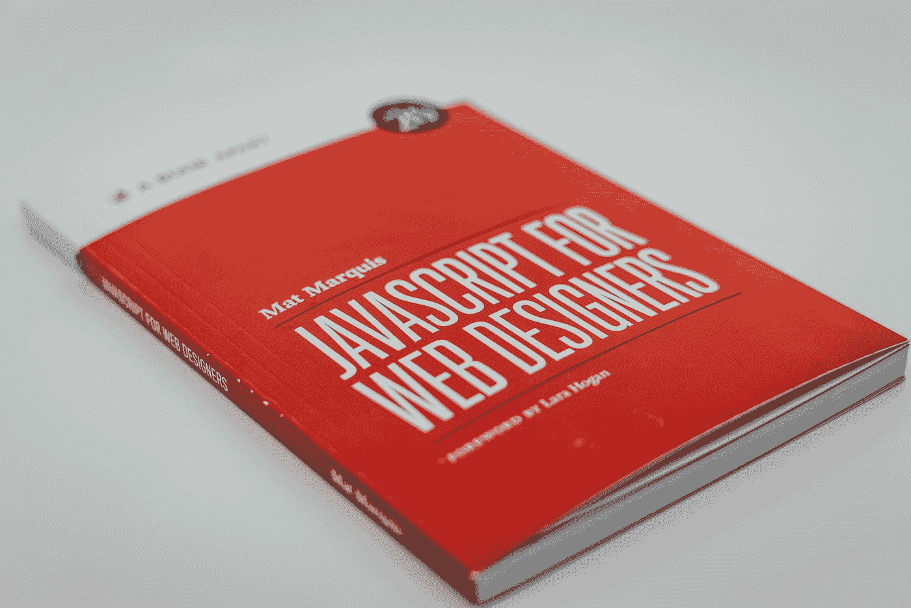](https://click.linksynergy.com/fs-bin/click?id=JVFxdTr9V80&subid=0&offerid=323058.1&type=10&tmpid=14538&RD_PARM1=https%3A%2F%2Fwww.udemy.com%2Fthe-complete-guide-to-angular-2%2F)

🇨🇭·克劳迪奥·施瓦茨| @purzlbaum 在 [Unsplash](https://unsplash.com?utm_source=medium&utm_medium=referral) 上拍摄的照片

如果你是一名 web 开发人员，或者想学习 Angular 进行 Web 开发，并且正在寻找一些优秀的资源，如[书籍](/javarevisited/top-10-angular-books-and-courses-for-beginners-and-experienced-web-developers-best-of-lot-9a2dae87f04c)、[在线课程](https://javarevisited.blogspot.com/2019/04/10-free-angular-and-react-courses-for.html)和[教程](https://dev.to/javinpaul/10-books-tutorials-and-courses-to-learn-angular-in-2019-2m0l)，那么你来对地方了。以前分享过一些[最佳角度教程](https://javarevisited.blogspot.com/2018/06/top-10-angular-tutorials-and-courses-for-web-developers.html)。

今天，在这篇文章中，我将分享一些在 2023 年学习现代 web 开发的*最佳角度课程*。如果你不知道 Angular 是什么，以及它如何帮助你开发现代的 web 开发，让我先给你一个简单的概述。

Angular 是谷歌最受欢迎的 JavaScript 前端框架之一，它允许你构建一个现代的大型电子商务 web 应用程序以及一个在浏览器上运行的单页面 web 应用程序。

它使用 [TypeScript](https://javarevisited.blogspot.com/2018/07/top-5-courses-to-learn-typescript.html) 编程语言，这是 [JavaScript](https://javarevisited.blogspot.com/2018/06/top-10-courses-to-learn-javascript-in.html) 的超集，为编写更好的代码提供了更多功能。它还具有高度的可扩展性和高性能，这是可以理解的，因为谷歌落后于 Angular。

谈谈 [TypeScript](http://www.java67.com/2018/05/top-5-free-typescript-courses-to-learn.html) ，这是微软创造的一种新的编程语言，它通过提供更多的类型安全和功能，如允许创建一个类来增强 JavaScript，但它的缺点是你不能在浏览器中运行 TypeScript，但不用担心，你可以将 TypeScript 代码编译成可以在浏览器上运行的 JavaScript。

[TypeScript](/javarevisited/top-10-free-typescript-courses-to-learn-online-best-of-lot-44bce9da41d1) 的另一个好处是它附带了 ES6 特性，这可以产生更好的 JavaScript 代码。由于这些原因，Angular 团队选择 TypeScript 作为官方语言来创建 Angular 应用程序。

顺便说一下，如果你是 TypeScript 新手，想在 2023 年学习 TypeScript，并且需要一门课程，那么我强烈推荐你加入 Udemy 上的 [**理解 TypeScript**](https://click.linksynergy.com/fs-bin/click?id=JVFxdTr9V80&subid=0&offerid=323058.1&type=10&tmpid=14538&RD_PARM1=https%3A%2F%2Fwww.udemy.com%2Funderstanding-typescript%2F) 课程，这是学习 TypeScript 的最佳在线课程之一。

</javarevisited/7-best-courses-to-learn-typescript-in-depth-58439e1ce729>  

# 2023 年学习 Angular 框架的 13 门最佳课程

在不浪费你更多时间的情况下，这里是我收集的一些 2023 年学习这个优秀框架的最佳角度课程。它包含了一些市场上最好的角网上课程，价格非常实惠。

虽然这些课程的原价大约是 150 到 200 美元，但我在最近的 Udemy 特卖中以每节课 9.9 美元的价格购买了它们，你可以这样做。它不会比星巴克的一个三明治和一杯咖啡多花你多少钱。

## 1.[角度—完整指南](https://click.linksynergy.com/fs-bin/click?id=JVFxdTr9V80&subid=0&offerid=323058.1&type=10&tmpid=14538&RD_PARM1=https%3A%2F%2Fwww.udemy.com%2Fthe-complete-guide-to-angular-2%2F)

这是学习角框架最好的课程之一；它全面、有趣、最新，涵盖了流行的 Angular 框架的最新版本 Angular 1。

我也是这门课的指导老师马克西米利安的超级粉丝。他知识渊博，教学技能高超。它不仅告诉你理论，还告诉你如何在生活中做事。

也上过他的 React 课程( [**React 16-完全指南**](https://click.linksynergy.com/fs-bin/click?id=JVFxdTr9V80&subid=0&offerid=323058.1&type=10&tmpid=14538&RD_PARM1=https%3A%2F%2Fwww.udemy.com%2Freact-the-complete-guide-incl-redux%2F) )，因为他的风格和内容成为了粉丝。

正如我所说的，这门课程非常全面，包含超过 440 堂课和 27.5 小时的内容。这意味着你将会学到所有你想知道的关于 Angular 的知识，并且使用 Angular 框架创建一个真实的项目。

这个课程的结构也非常好，这意味着即使你对 Angular 完全陌生，你也会从单词 go 开始学习。课程从基础开始，比如*什么是 Angular* 以及它比传统的 JavaScript 开发模型有什么好处。

> 以下是查看本课程的链接— [**Angular —完整指南**](https://click.linksynergy.com/fs-bin/click?id=JVFxdTr9V80&subid=0&offerid=323058.1&type=10&tmpid=14538&RD_PARM1=https%3A%2F%2Fwww.udemy.com%2Fthe-complete-guide-to-angular-2%2F)

[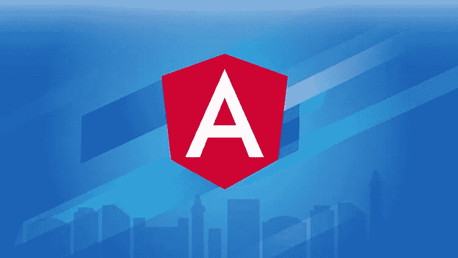](https://click.linksynergy.com/fs-bin/click?id=JVFxdTr9V80&subid=0&offerid=323058.1&type=10&tmpid=14538&RD_PARM1=https%3A%2F%2Fwww.udemy.com%2Fthe-complete-guide-to-angular-2%2F)

一旦你理解了 Angular 解决的问题，你将更倾向于了解不同的 Angular 特性以及是什么让它如此令人印象深刻，比如组件、指令、数据绑定、服务和[依赖注入](https://javarevisited.blogspot.sg/2015/06/difference-between-dependency-injection.html)。Max 深入介绍了所有这些基本概念。

不仅如此，您还将了解调试、路由、模块、单页应用、工作 NgRx、Angular CLI、Observables 和 Angular 11 的新功能。

简而言之，*学习 Angular* 的最佳课程，值得你花每一分钱。当然，原价是 199 美元，但你可以在 Udemy 的闪购上以 9.99 美元买到，他们每个月都要进行几次闪购。

## 2.[前端 JavaScript 框架:Angular](https://coursera.pxf.io/c/3294490/1164545/14726?u=https%3A%2F%2Fwww.coursera.org%2Flearn%2Fangular) 【最佳 Coursera 课程】

这是香港科技大学在 Coursera 上提供的一个非常棒的从零开始学习 Angular 的免费课程。在本课程中，您将学习如何使用 TypeScript 来使用 Angular。

作为练习的一部分，首先将向您介绍 Angular 环境中的 Typescript 特性，然后您将学习如何使用 Angular 材料和 Angular Flex-Layout 进行响应式 UI 设计。

您还将学习 Angular 的各个方面，包括组件、指令和服务。您将了解数据绑定、角度路由器以及它们在开发单页面应用程序中的用途。

因此，如果你正在寻找一个免费的课程，开始从舒适的办公室和家里学习 Angular，那么这是一个。参加过该课程的人中有 24%开启了新的职业道路，39%获得了实实在在的职业利益，如晋升和加薪。

> 这里是查看本课程的链接— [前端 JavaScript 框架:Angular](https://coursera.pxf.io/c/3294490/1164545/14726?u=https%3A%2F%2Fwww.coursera.org%2Flearn%2Fangular)

[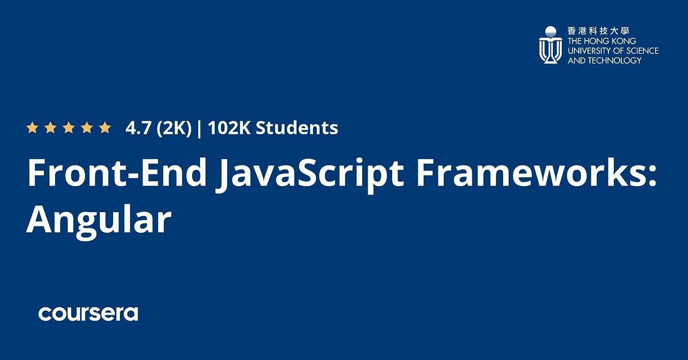](https://coursera.pxf.io/c/3294490/1164545/14726?u=https%3A%2F%2Fwww.coursera.org%2Flearn%2Fangular)

如果你愿意，你也可以通过完成本课程和 [**全栈 Web 和多平台移动应用开发专业化**](https://coursera.pxf.io/c/3294490/1164545/14726?u=https%3A%2F%2Fwww.coursera.org%2Fspecializations%2Ffull-stack-mobile-app-development) 获得证书，但那不是免费的，你需要每月支付 39 美元。

<https://coursera.pxf.io/c/3294490/1164545/14726?u=https%3A%2F%2Fwww.coursera.org%2Fspecializations%2Ffull-stack-mobile-app-development>  

或者，你也可以加入 [**Coursera Plus**](https://coursera.pxf.io/c/3294490/1164545/14726?u=https%3A%2F%2Fwww.coursera.org%2Fcourseraplus) ，它提供无限制的访问最好的 Coursera 课程、认证和专业的机会。

<https://coursera.pxf.io/c/3294490/1164545/14726?u=https%3A%2F%2Fwww.coursera.org%2Fcourseraplus>  

## 3.[2023 年完成角度开发者:零到精通](https://academy.zerotomastery.io/a/aff_sfk5z7pb/external?affcode=441520_zytgk2dn)

这是 2023 年学习 Angular 的又一个牛逼课程。由 ZTM 学院的 Andrei '和他的团队创建的这个基于项目的课程将从头开始教你 Angular(正式名称为 AngularJS/Angular.js ),并向你介绍 2023 年 Angular 开发者的现代工具链。

在这个过程中，您将使用 Angular、TypeScript、 [*WebAssembly*](/javarevisited/7-best-webassembly-and-blazor-courses-for-beginners-to-learn-online-8e0cdd61be28) 、 [*Rust*](/javarevisited/7-best-rust-programming-courses-and-books-for-beginners-in-2021-2ed2311af46c) 、RxJS、 [*Tailwind CSS*](/javarevisited/6-best-books-and-courses-to-learn-tailwind-css-5889c254ad2b) 、 [Firebase](/javarevisited/5-best-firebase-and-firestore-courses-for-frontend-developers-88052b0d3e74) 等等构建一个大型视频共享应用程序。

这是一个全栈应用程序，不同于大多数 Angular 教程或在线课程，这是一个理想的课程，适合希望一步一步学习和掌握 Angular 的开发者，从零开始，一直到能够被顶级公司聘用

**这里是加入本课程的链接**—[2023 年完成 Angular Developer](https://academy.zerotomastery.io/a/aff_sfk5z7pb/external?affcode=441520_zytgk2dn)

[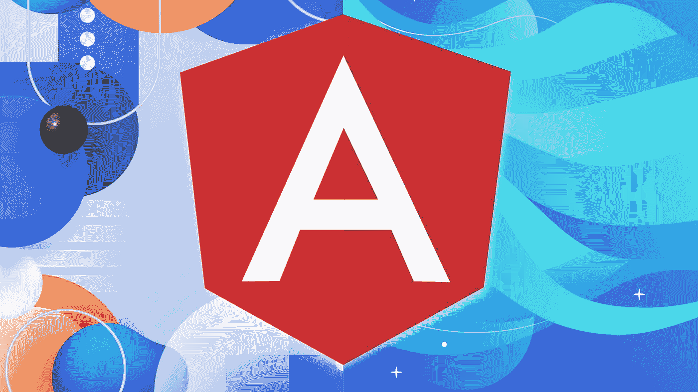](https://academy.zerotomastery.io/a/aff_sfk5z7pb/external?affcode=441520_zytgk2dn)

顺便说一句，你需要一个 [**ZTM 会员**](https://academy.zerotomastery.io/a/aff_c0gnlvf7/external?affcode=441520_zytgk2dn) 来观看这个课程，这个课程每月花费大约 39 美元，但是也提供了许多超级吸引人和有用的课程，比如这个 [*JavaScript Web 项目:20 个项目来建立你的作品集*](https://academy.zerotomastery.io/p/javascript-projects?affcode=441520_zytgk2dn) 课程。你也可以使用我的代码 **FRIENDS10** 来获得你选择的任何套餐的 10%的折扣。

<https://academy.zerotomastery.io/a/aff_c0gnlvf7/external?affcode=441520_zytgk2dn>  

## 4.[棱角分明的大师级](https://www.educative.io/courses/getting-started-with-angular?affiliate_id=5073518643380224)【教育性】

这是一个从 Educative 学习 Angular 的新课程，Educative 是一个基于文本的在线学习平台，它允许您直接从浏览器上编写和运行您的程序。

以下是您将在本课程中学到的内容:

1.  典型 Angular 应用程序的架构，以及如何使用组件和模块来构建应用程序的各个部分。
2.  探索服务、依赖注入、可观察对象和 RxJs。
3.  NgRx，这是一个用于管理 Angular 的反应状态的库。
4.  测试和包装产品的角度应用。

总的来说，这是一个从零开始学习 Angular 的很好的互动课程。最后，你的投资组合将会有一个很棒的新应用程序，同时你也会更好地理解如何从头开始设计一个 Angular 应用程序。

**这里是加入本课程的链接**——[棱角大师班](https://www.educative.io/courses/getting-started-with-angular?affiliate_id=5073518643380224)

[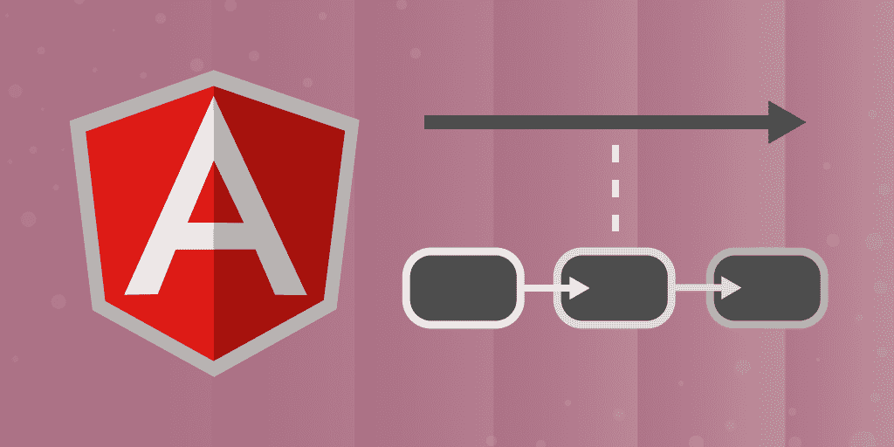](https://www.educative.io/courses/getting-started-with-angular?affiliate_id=5073518643380224)

而且，如果你觉得教育平台和他们基于文本的互动课程很吸引人，那么考虑购买 [**教育订阅**](https://www.educative.io/subscription?affiliate_id=5073518643380224) ，每月只需 18 美元就可以获得他们的 100 多门课程。非常划算，非常适合准备编码面试。

<https://www.educative.io/subscription?affiliate_id=5073518643380224>  

## 5.Deborah Kurata 在 Pluralsight 上的文章

这是从 [*复数视线*](/javarevisited/top-10-pluralsight-courses-to-learn-programming-and-software-development-during-covid-19-stay-at-30b7d8a4f88f) 学习 Angular 的另一个奇妙课程。你可以在看完上一个关于 Angular: The Big Picture 之后查看这个课程。

这是更多的实践操作，您将学习如何创建优秀的 web 应用程序，并通过快速使用 Agular 的组件、模板和服务来了解最新的应用程序开发技术。

您还将设置您的环境，了解组件、模板和数据绑定以及它们如何协同工作，了解如何使用强类型代码构建干净的组件，构建嵌套组件，如何使用依赖注入来注入您构建的服务，以及如何使用 HTTP、导航和路由来检索数据。

> 以下是查看本课程的链接— [Angular:入门](https://pluralsight.pxf.io/c/1193463/424552/7490?u=https%3A%2F%2Fwww.pluralsight.com%2Fcourses%2Fangular-2-getting-started-update)

[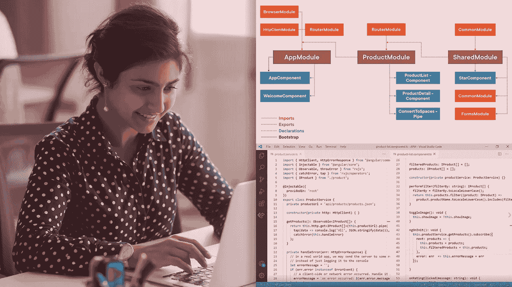](https://pluralsight.pxf.io/c/1193463/424552/7490?u=https%3A%2F%2Fwww.pluralsight.com%2Fcourses%2Fangular-2-getting-started-update)

顺便说一下，你需要一个 [Pluralsight 会员](https://pluralsight.pxf.io/c/1193463/424552/7490?u=https%3A%2F%2Fwww.pluralsight.com%2Fpricing)才能加入 Pluralsight 课程，费用大约为每月 29 美元或每年 299 美元(14%的折扣)。如果你没有这个计划，我强烈推荐你加入，因为它能促进你的学习，而且作为一名程序员，你总是需要学习新的东西。

或者，你也可以使用他们的 **1** [**0 天免费试用**](https://pluralsight.pxf.io/c/1193463/424552/7490?u=https%3A%2F%2Fwww.pluralsight.com%2Flearn) 免费观看本课程。

<https://pluralsight.pxf.io/c/1193463/424552/7490?u=https%3A%2F%2Fwww.pluralsight.com%2Flearn>  

他们现在还提供 33%的折扣，这意味着你只需花 199 美元就能获得他们的年度会员资格，并节省 100 美元，这对任何热爱学习的程序员来说都是一笔大数目

## 6.[ng-book:Angular-full 套装完整指南](https://gumroad.com/a/221148275/FlvVl)

如果你更喜欢书本而不是网络课程，或者想把马克斯的课程和书本结合起来，那么我强烈推荐你去看看内特·默里、费利佩·库里、阿里·勒纳和卡洛斯·塔沃尔达的电子书。

这是一本关于 Angular 11 的深入、完整、最新的书，受到 Angular 专家的强烈推荐。

这本书涵盖了从初学者到专家你需要知道的关于 Angular 的一切。这包括这本书，书中每个例子的所有源代码，一个为初学者准备的长达 3 小时的角度截屏，以及示例应用程序的完整源代码。

**这里是获取这个 Ng 书包的链接**——[Ng-Book:Angular 11](https://gumroad.com/a/221148275/FlvVl)完全指南

[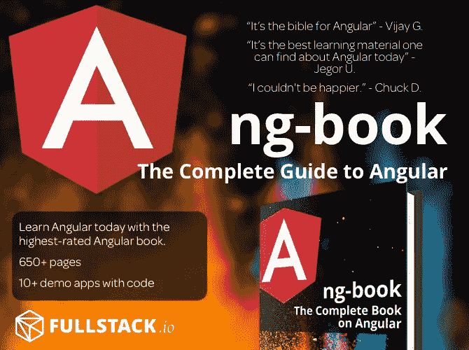](https://gumroad.com/a/221148275/FlvVl)

## 7.Udemy 上为忙碌的开发人员开设的角度速成班

顾名思义，这是为赶时间的开发人员开设的 Angular 速成班。它不像 Max 的课程那样全面，但仍然很好地解释了 Angular 框架的所有关键特征。

这门课程也是顶级的，已经有超过 4.5 万名学生注册了这门课程，所以这不是一件需要任何社会证明的事情。

这门课程的结构也非常好，它包含了超过 137 堂课和 10.5 小时的内容。在介绍 Angular 之后，比如什么是 Angular，它提供了什么优于 [JavaScript](http://www.java67.com/2018/04/top-5-free-javascript-courses-to-learn.html) 的好处，它深入探讨了 Angular 应用的架构，并设置了开发环境。

一旦你准备好了开发环境，你就开始构建你的第一个 Angular 应用程序，并学习 Angular 项目的结构。这种边做边学的方式让它变得超级有用。

> 这里是查看这个课程的链接— [忙碌开发者的角度速成班](https://click.linksynergy.com/fs-bin/click?id=JVFxdTr9V80&subid=0&offerid=323058.1&type=10&tmpid=14538&RD_PARM1=https%3A%2F%2Fwww.udemy.com%2Fangular-crash-course%2F)

[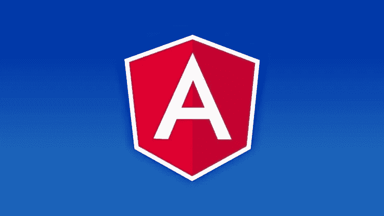](https://click.linksynergy.com/fs-bin/click?id=JVFxdTr9V80&subid=0&offerid=323058.1&type=10&tmpid=14538&RD_PARM1=https%3A%2F%2Fwww.udemy.com%2Fangular-crash-course%2F)

之后，它会花一些时间解释 TypeScript 基础知识，Angular 开发的官方语言，以及一个 JavaScript 超集，它为 JavaScript 开发人员提供了 [OOP 特性](http://javarevisited.blogspot.sg/2012/03/10-object-oriented-design-principles.html)。

TypeScript 之后都是[角](https://javarevisited.blogspot.com/2018/06/5-best-courses-to-learn-angular.html)，从基础概念开始，处理事件，构建可重用组件，指令，模板驱动表单，反应式表单，路由，消费 HTTP 服务。

简而言之，这是一门学习 Angular 的完美课程，适合那些无法花一个月时间学习 Angular 的忙碌开发人员。即使你只花 1 个小时，通过学习这门课程，你也可以在一周内学会 Angular。

## 8.[完整的角度课程:从初级到高级](https://click.linksynergy.com/fs-bin/click?id=JVFxdTr9V80&subid=0&offerid=323058.1&type=10&tmpid=14538&RD_PARM1=https%3A%2F%2Fwww.udemy.com%2Fthe-complete-angular-master-class%2F)

这是 Udemy 上的另一个精彩的角度课程，在内容和覆盖面上与第一个课程非常相似。它也非常全面，包含 376 个讲座中组织的 30 多个小时的内容。

这实际上是第二个课程的延伸，因为来自 CodeWithMosh.com 的教练 Mosh Hamedani 只解释了让你立刻有所收获的要点。在这个过程中，他采取了完整的覆盖角度。

现在，如果你问我这门课和 Max 的课的主要区别，那就是这门课提供的基于项目的开发。

> 以下是查看本课程的链接— [完整的角度课程:初级到高级](https://click.linksynergy.com/fs-bin/click?id=JVFxdTr9V80&subid=0&offerid=323058.1&type=10&tmpid=14538&RD_PARM1=https%3A%2F%2Fwww.udemy.com%2Fthe-complete-angular-master-class%2F)

[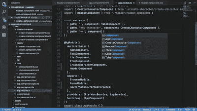](https://click.linksynergy.com/fs-bin/click?id=JVFxdTr9V80&subid=0&offerid=323058.1&type=10&tmpid=14538&RD_PARM1=https%3A%2F%2Fwww.udemy.com%2Fthe-complete-angular-master-class%2F)

您将使用 [Angular](http://www.java67.com/2018/01/top-5-free-angular-js-online-courses-for-web-developers.html) 、 [Firebase](http://www.java67.com/2018/01/top-10-web-mobile-and-big-data-framework-libraries-technologies-programmers-should-learn-in-2018.html) 和 [Bootstrap 4](https://javarevisited.blogspot.com/2018/01/10-frameworks-java-and-web-developers-should-learn.html) 开发一个真正的电子商务应用程序，并学习许多开发人员通常在工作中学习的东西，如认证和授权、购物卡和其他产品管理模块。

如果你喜欢边做边学，那么这就是适合你的*最佳角度课程*。这种角度课程的原始成本约为 200 美元，但目前在 Udemy 中仅售 10.99 美元。

过去，我曾分享过一个[免费角课程](http://www.java67.com/2018/01/top-5-free-angular-js-online-courses-for-web-developers.html)的列表，你们很多人都喜欢，但反馈是关于分享一些最好的课程，即使是付费的。

<https://javarevisited.blogspot.com/2019/04/10-free-angular-and-react-courses-for.html>  

这是有道理的，有时我们不介意为真正好的东西付出一点点代价，因为无论如何我们都在这上面花了很多时间，这是我写这篇文章的主要原因。

## 9.[前后倾斜](https://click.linksynergy.com/fs-bin/click?id=JVFxdTr9V80&subid=0&offerid=323058.1&type=10&tmpid=14538&RD_PARM1=https%3A%2F%2Fwww.udemy.com%2Fangular-4-front-to-back%2F)

这是另一门关于角度的课程。买什么课程都可以先看看。它不像这个列表中的第一和第三个课程那样全面，但这使它比其他课程更有用，尤其是如果你快没时间了。

本课程的创建绝对有利于任何水平的开发人员。你只需要对 [HTML](http://www.java67.com/2018/02/5-free-html-and-css-courses-to-learn-web-development.html) 和 [JavaScript](https://javarevisited.blogspot.com/2018/06/top-10-courses-to-learn-javascript-in.html) 有一些基本的了解，就万事俱备了。

课程从零开始，给你讲解如何设置 Angular 11 的开发环境，下载启动 Angular CLI。

> 这里是查看本课程的链接— [从前到后](https://click.linksynergy.com/fs-bin/click?id=JVFxdTr9V80&subid=0&offerid=323058.1&type=10&tmpid=14538&RD_PARM1=https%3A%2F%2Fwww.udemy.com%2Fangular-4-front-to-back%2F)

[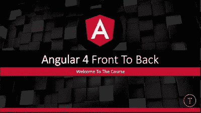](https://click.linksynergy.com/fs-bin/click?id=JVFxdTr9V80&subid=0&offerid=323058.1&type=10&tmpid=14538&RD_PARM1=https%3A%2F%2Fwww.udemy.com%2Fangular-4-front-to-back%2F)

然后，课程进入角度的基础和细节，你将学习基本的角度特性，如组件、指令、模板、事件、服务、路由器等。

您还将学习使用 Firebase 的新 FireStore 平台开发一个具有身份验证和数据存储功能的高级客户端管理系统项目。

总的来说，如果你能联系到老师，这是一门学习 Angular 的极好课程。我个人很喜欢第一个课程，因为我发现 Max 的解释比任何人都有用，但你可以在购买前自由尝试。

## [10。Angular & NodeJS —平均堆叠指南【2023 版】](https://click.linksynergy.com/deeplink?id=JVFxdTr9V80&mid=39197&murl=https%3A%2F%2Fwww.udemy.com%2Fcourse%2Fangular-2-and-nodejs-the-practical-guide%2F)

这是我最喜欢的 Udemy 导师 Maximilian Schwarzüller 的另一个课程精华，它不仅涵盖了角度，还涵盖了节点和均值堆栈。

在本课程中，您将通过构建一个真实的应用程序，学习如何将 Angular 前端连接到 NodeJS & Express & MongoDB 后端

> 以下是查看本课程的链接— [Angular & NodeJS —平均堆栈指南](https://click.linksynergy.com/deeplink?id=JVFxdTr9V80&mid=39197&murl=https%3A%2F%2Fwww.udemy.com%2Fcourse%2Fangular-2-and-nodejs-the-practical-guide%2F)

[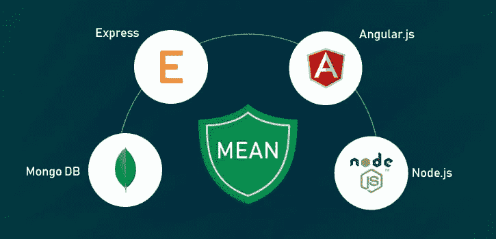](https://click.linksynergy.com/deeplink?id=JVFxdTr9V80&mid=39197&murl=https%3A%2F%2Fwww.udemy.com%2Fcourse%2Fangular-2-and-nodejs-the-practical-guide%2F)

## 11.[棱角分明:乔·埃马斯的《大局观》](https://pluralsight.pxf.io/c/1193463/424552/7490?u=https%3A%2F%2Fwww.pluralsight.com%2Fcourses%2Fng-big-picture)

到目前为止，我们已经看到了来自 [Udemy](https://javarevisited.blogspot.com/2019/08/top-10-udemy-courses-and-certifications-for-programmers.html) 和 [Coursera](https://javarevisited.blogspot.com/2020/02/10-best-coursera-courses--for-python.html#axzz6G15UISw6) 的最佳角度课程，现在，我将与您分享来自 [Pluralsight](https://javarevisited.blogspot.com/2017/12/top-10-pluralsight-courses-java-and-web-developers.html) 的顶级角度课程。这只是 3 门课程，你可以在 3 天或一个周末内学习 Angular。

如果你对 Angular 一无所知，但是你想学习它来开始你的 web 开发生涯，那么这应该是你应该参加的第一门课程。

本课程将向您介绍 Angular 的高层次观点，帮助您更好地理解 Angular，以利于您自己的开发，或者学习何时使用 Angular 而不是其他前端框架。

首先，您将了解 Angular 的好处。接下来，你会发现它的架构。最后，您将探索一些技巧、窍门、陷阱，以及 Angular 的发展方向。

学完本课程后，您将拥有 Angular 的技能和知识，可以帮助您学习它的语法和 API，或者帮助您为下一个项目选择一个框架。

> 以下是查看本课程的链接— [Angular: The Big Picture](https://pluralsight.pxf.io/c/1193463/424552/7490?u=https%3A%2F%2Fwww.pluralsight.com%2Fcourses%2Fng-big-picture)

<https://pluralsight.pxf.io/c/1193463/424552/7490?u=https%3A%2F%2Fwww.pluralsight.com%2Fcourses%2Fng-big-picture>  

## 12.[棱角分明的架构和最佳实践](https://pluralsight.pxf.io/c/1193463/424552/7490?u=https%3A%2F%2Fwww.pluralsight.com%2Fcourses%2Fangular-architecture-best-practices)丹·瓦林著

这是 Dan Wahlin 在 Pluralsight 上的一个关于 Angular 的高级课程，它是我在周末学习 Angular 的 3 门课程系列的一部分。你可以在完成我上面提到的前两个课程后参加这个课程，以便在 3 天内对 Angular 有一个很好的了解和练习。

在本课程中，您将学习架构概念、最佳实践，以及如何解决出现的一些更具挑战性的任务。您将发现组件通信技术。

接下来，您将学习状态管理和代码组织。最后，您将探索一般的最佳实践、性能考虑等。

完成本课程后，您将具备构建易于重构和维护的可靠应用程序架构所需的技能和知识。

> 以下是查看本课程的链接— [角度架构和最佳实践](https://pluralsight.pxf.io/c/1193463/424552/7490?u=https%3A%2F%2Fwww.pluralsight.com%2Fcourses%2Fangular-architecture-best-practices)

<https://pluralsight.pxf.io/c/1193463/424552/7490?u=https%3A%2F%2Fwww.pluralsight.com%2Fcourses%2Fangular-architecture-best-practices>  

## 13.[角度要领(角度 2+带打字稿)](https://click.linksynergy.com/fs-bin/click?id=JVFxdTr9V80&subid=0&offerid=323058.1&type=10&tmpid=14538&RD_PARM1=https%3A%2F%2Fwww.udemy.com%2Fangular-essentials-angular-2-angular-4-with-typescript%2F)

这个课程是他其他角度课程的浓缩形式，比如第一个，这可能是 [Udemy](https://javarevisited.blogspot.com/2019/08/top-10-udemy-courses-and-certifications-for-programmers.html) 上最受欢迎的课程。

本课程是为赶时间并想快速学习 Angular 的人或熟悉 Angular 并想复习所有重要概念的人而创建的。

正如我之前说过的，我是 Max 的超级粉丝，我真的很喜欢他的教学技巧、知识和演讲。如果你上过他在 [React](https://click.linksynergy.com/fs-bin/click?id=JVFxdTr9V80&subid=0&offerid=323058.1&type=10&tmpid=14538&RD_PARM1=https%3A%2F%2Fwww.udemy.com%2Freact-the-complete-guide-incl-redux%2F) 或 [AWS 无服务器 API](https://click.linksynergy.com/fs-bin/click?id=JVFxdTr9V80&subid=0&offerid=323058.1&type=10&tmpid=14538&RD_PARM1=https%3A%2F%2Fwww.udemy.com%2Faws-serverless-a-complete-introduction%2F)上的任何课程，那么你就知道他的课非常全面，内容丰富，目的明确，有趣。

> 以下是查看本课程的链接— [角度要素](https://click.linksynergy.com/fs-bin/click?id=JVFxdTr9V80&subid=0&offerid=323058.1&type=10&tmpid=14538&RD_PARM1=https%3A%2F%2Fwww.udemy.com%2Fangular-essentials-angular-2-angular-4-with-typescript%2F)

在本课程中，您将了解到 Angular 的一切，如 [TypeScript](https://javarevisited.blogspot.com/2018/07/top-5-courses-to-learn-typescript.html) 、Angular CLI(Angular 团队提供的用于创建 Angular 项目的工具)以及 Angular 本身。

一旦您通过学习本课程学习了 Angular，您可以随时通过加入第一门课程或学习本课程中提供的其他几个补充材料来进行更深入的学习。

这就是学习 web 开发角度框架的一些最好的课程。Angular 在当今世界是一项非常有用的技能，它不仅能帮助你找到一份 web 开发人员的工作，还能帮助你创建自己的网站和应用程序。您可以快速创建一个单页应用程序来开始您的在线投资。

其他**有用的在线课程**你可能喜欢的
[2023 年 Web 开发者路线图](https://javarevisited.blogspot.com/2019/02/the-2019-web-developer-roadmap.html)
[面向 Java 开发者的 5 门免费 Spring 框架课程](http://www.java67.com/2017/11/top-5-free-core-spring-mvc-courses-learn-online.html)
[2023 年学习 React Native 的 5 门课程](http://javarevisited.blogspot.sg/2018/02/5-react-native-courses-to-learn-mobile-development-using-JavaScript.html)
[2023 年学习 Web 开发的前 5 门课程](https://javarevisited.blogspot.com/2018/02/top-5-online-courses-to-learn-web-development.html)
[学习大数据和 Apache Spark 的 5 门课程](http://javarevisited.blogspot.com/2017/12/top-5-courses-to-learn-big-data-and.html)
[前 10 名 JavaScript 教程和课程为 2023 年学 Spring Boot](https://javarevisited.blogspot.com/2018/06/top-10-courses-to-learn-javascript-in.html)
[2023 年学 Python 的前 5 门课程](http://www.java67.com/2018/02/5-free-python-online-courses-for-beginners.html)
[2023 年 React JS 开发者路线图](https://javarevisited.blogspot.com/2018/10/the-2018-react-developer-roadmap.html)
[10 JavaScript 框架 Fullstack 开发者应该知道的](http://www.java67.com/2019/01/top-10-javascript-frameworks-and-libraries-for-web-developers.html)

感谢您阅读本文。如果你喜欢这些*最佳角度课程*，那么请分享给你的朋友和同事。如果您有任何问题或反馈，请留言。

**p . s .**——如果你正在寻找一些免费课程来启动你的 Angular 之旅，你也可以看看这个 [**Angular for 初学者课程**](https://click.linksynergy.com/deeplink?id=JVFxdTr9V80&mid=39197&murl=https%3A%2F%2Fwww.udemy.com%2Fangular-for-beginners-course%2F) ，它提供了 Angular 框架的快速介绍，重点介绍了它最常用的部分，也为 Angular 11 进行了更新。

<https://click.linksynergy.com/deeplink?id=JVFxdTr9V80&mid=39197&murl=https%3A%2F%2Fwww.udemy.com%2Fangular-for-beginners-course%2F>  

## 您可能喜欢的其他文章:

</javarevisited/top-10-angular-books-and-courses-for-beginners-and-experienced-web-developers-best-of-lot-9a2dae87f04c>  </javarevisited/my-favorite-free-tutorials-and-courses-to-learn-javascript-8f4d0a71faf2>  </javarevisited/10-javascript-frameworks-and-libraries-to-learn-in-2020-best-of-lot-5f61f86c60b4> 