# 2023 年破解编码面试的 15 门最佳数据结构、算法、编程课程

> 原文：<https://medium.com/javarevisited/10-data-structure-algorithms-and-programming-courses-to-crack-any-coding-interview-e1c50b30b927?source=collection_archive---------1----------------------->

## 你在准备 2023 年的编码与编程工作面试吗？这里有最好的资源和在线课程，让你自信地破解编码面试。

[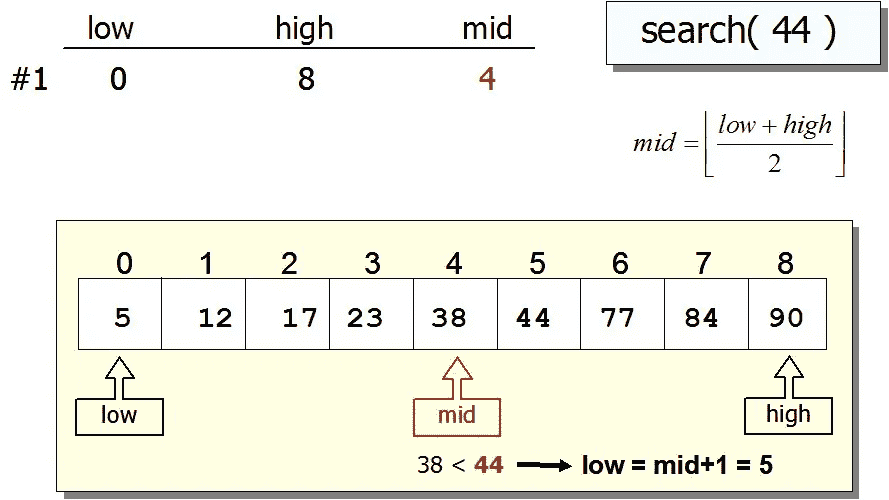](https://click.linksynergy.com/fs-bin/click?id=JVFxdTr9V80&subid=0&offerid=562016.1&type=10&tmpid=14538&RD_PARM1=https%3A%2F%2Fwww.udemy.com%2Fcoding-interview-bootcamp-algorithms-and-data-structure%2F)

许多初级开发人员梦想在大型科技公司工作，但是，老实说，找到第一份工作从来都不容易。事实上，这是你一生中最难的事情之一，你需要尽最大努力在你梦想的公司找到一份工作。

大多数计算机科学毕业生梦想为谷歌、T2、脸书、T4、亚马逊、微软和苹果工作，但只有少数程序员能通过艰难的编码面试。

编码工作面试失败的一个最重要的原因是缺乏知识和实践。很明显，如果你不知道学什么，那么你注定会失败，因此提前做好准备变得越来越重要。

不幸的是，在破坏了我在微软和亚马逊的机会之后，我知道这一点有点太晚了，但你不需要。你可以从我的经历中学习，为你的编程工作面试做更好的准备。

所以，最大的问题是，你如何准备编码/编程工作面试？你应该熟读哪些科目？你需要解决哪些问题？你如何处理编码和其他技术相关的问题？

当我寻找我的第一份工作时，没有多少帮助；我们完全依赖编程语言和数据结构的教科书来准备面试，但在过去的 10 年里情况发生了变化。

如今，你不仅有专门的书籍来准备编码面试，如 [*破解编码面试问题*](http://www.amazon.com/Cracking-Coding-Interview-6th-Edition/dp/0984782850/?tag=javamysqlanta-20)*，而且你还有[在线课程](https://click.linksynergy.com/fs-bin/click?id=JVFxdTr9V80&subid=0&offerid=562016.1&type=10&tmpid=14538&RD_PARM1=https%3A%2F%2Fwww.udemy.com%2Fdata-structure-and-algorithms-analysis%2F)和编码训练营来练习编码面试，如 [*掌握编码面试:大科技(FAANG)面试*](https://academy.zerotomastery.io/a/aff_nqb6sg6w/external?affcode=441520_zytgk2dn) 由 ZTM 学院。*

**

*我真的很喜欢新兵训练营，因为他们的方法、专注和严格的实践，但他们有点贵，不是每个正在找工作的计算机科学毕业生都负担得起。如果你愿意，你还可以获得一个 [**ZTM 会员**](https://academy.zerotomastery.io/a/aff_c0gnlvf7/external?affcode=441520_zytgk2dn) 来获得不仅是这个课程，还有其他关于系统设计和开发的编码面试课程。*

* [## 学习需求技能。被录用。推进你的事业。|零到精通

### 最终你是唯一能控制它的人。呵呵......每个人学习的速度不同，但是学生…

academy.zerotomastery.io](https://academy.zerotomastery.io/a/aff_c0gnlvf7/external?affcode=441520_zytgk2dn) 

另一个选择是像[软件工程师面试释放](https://click.linksynergy.com/fs-bin/click?id=JVFxdTr9V80&subid=0&offerid=562016.1&type=10&tmpid=14538&RD_PARM1=https%3A%2F%2Fwww.udemy.com%2Fsoftware-engineer-interview-unleashed%2F)这样的在线课程，它们既便宜又能给你提供类似于你在编码训练营中得到的那种互动指导。

在热门的课程网站上有很多编程面试课程，比如 Udemy、Coursera、T21 和 PluralSight，但是你需要选择正确的课程来帮助你实现你的目标。

 [## 掌握软件工程面试

### 作为一名计算机科学家，你已经达到了一个重要的里程碑，并且正在成为一名有能力的程序员。你现在知道如何解决…

coursera.com](https://click.linksynergy.com/deeplink?id=JVFxdTr9V80&mid=40328&murl=https%3A%2F%2Fwww.coursera.org%2Flearn%2Fcs-tech-interview) 

# 15+编程和编码面试最佳数据结构和算法课程

在这篇文章中，我将分享一些最好的在线课程，为编码/编程工作面试做准备，根据你的经验和技能，你可以从这个列表中选择一到两门课程，为你的下一次工作面试做准备。

这些课程大多集中在[数据结构和算法](https://hackernoon.com/50-data-structure-and-algorithms-interview-questions-for-programmers-b4b1ac61f5b0)上，这对于任何编码面试来说都是最重要的话题，但它们也教你解决问题和工作面试的其他方面，例如来自编程语言的问题，如 [Java](http://www.java67.com/2018/08/top-10-free-java-courses-for-beginners-experienced-developers.html) 和 [C++](http://www.java67.com/2018/02/5-free-cpp-courses-to-learn-programming.html) 、[数据库](https://javarevisited.blogspot.com/2018/05/top-5-sql-and-database-courses-to-learn-online.html)和 [SQL](http://www.java67.com/2018/02/5-free-oracle-and-microsoft-sql-server-online-courses.html) 概念、 [Linux 命令](http://www.java67.com/2018/02/5-free-linux-unix-courses-for-programmers-learn-online.html)等。

一旦你完成了这些在线培训课程，你就有足够的知识去参加你的工作面试，也知道去哪里进一步提高。

## 1.[数据结构与算法分析—面试](https://click.linksynergy.com/deeplink?id=JVFxdTr9V80&mid=39197&murl=https%3A%2F%2Fwww.udemy.com%2Fcourse%2Fdata-structures-and-algorithms-dsa%2F&u1=JAVAREVISITED)

这可能是 JavaScript 程序员最好的编码面试课程了。虽然不需要编程语言，但如果你不懂 Java，作者会教你。

在本课程中，您将学习如何分析算法，如[搜索](https://javarevisited.blogspot.com/2017/04/recursive-binary-search-algorithm-in-java-example.html)、[排序](http://www.java67.com/2018/03/how-to-implement-radix-sort-in-java.html)以及其他算法。

你还将学习如何将代码复杂度从一个 Big-O 级别降低到另一个级别，这是给面试官留下深刻印象的重要技能。

此外，您将学习不同类型的数据结构以及如何选择正确的数据结构来解决问题。

记住，选择正确的数据结构可以极大地提高应用程序的 CPU 和内存性能。

例如，用一个集合来解决[重复元素问题](https://javarevisited.blogspot.com/2018/04/how-to-find-k-missing-numbers-in-array-java.html)就变得容易多了。您还将学习如何为每个数据结构找到 Big-O。

最终，您将能够编写运行速度更快、占用内存更少的代码。您还将学习如何使用许多程序员忘记准备的一种技术来分析问题。

**这里是加入本课程的链接** — [编程大师面试:数据结构+算法](https://click.linksynergy.com/deeplink?id=JVFxdTr9V80&mid=39197&murl=https%3A%2F%2Fwww.udemy.com%2Fcourse%2Fdata-structures-and-algorithms-dsa%2F&u1=JAVAREVISITED)

[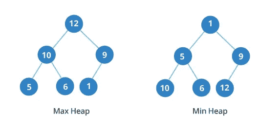](https://click.linksynergy.com/deeplink?id=JVFxdTr9V80&mid=39197&murl=https%3A%2F%2Fwww.udemy.com%2Fcourse%2Fdata-structures-and-algorithms-dsa%2F&u1=JAVAREVISITED)

这是所有级别程序员的理想课程，尤其是 Java 程序员。如果你正在寻找一个好的 Java 编程/编码面试课程，这是一个。你可以用它从头开始，或者只是在去面试前复习一下知识。

 [## 数据结构与算法分析-工作面试

### 编写运行更快、使用更少内存的代码，为软件工程师的工作面试做准备

udemy.com](https://click.linksynergy.com/fs-bin/click?id=JVFxdTr9V80&subid=0&offerid=562016.1&type=10&tmpid=14538&RD_PARM1=https%3A%2F%2Fwww.udemy.com%2Fdata-structure-and-algorithms-analysis%2F) 

## 2.[钻研系统设计面试](https://www.educative.io/collection/5668639101419520/5649050225344512?affiliate_id=5073518643380224)

如果你参加过编码面试，那么你可能知道处理系统设计问题是不容易的，尤其是如果你没有太多现实世界软件开发的经验。

缓存、可伸缩性、容错、[微服务](https://javarevisited.blogspot.com/2018/02/top-5-spring-microservices-courses-with-spring-boot-and-spring-cloud.html)、数据库设计等东西对设计软件很重要，但不容易掌握。这个课程很好地介绍了在设计一个新的系统，比如一个网站，一个应用程序，或者仅仅是一个应用程序时，你需要记住的所有东西。如果你想通过编码面试，这门课程是必不可少的，但是即使你没有为面试做准备，你也会通过这门课程学到很多关于软件架构师和设计的知识，最终使你成为一名更好的程序员。

**这里是加入本课程的链接**——[钻研系统设计面试](https://www.educative.io/collection/5668639101419520/5649050225344512?affiliate_id=5073518643380224)

[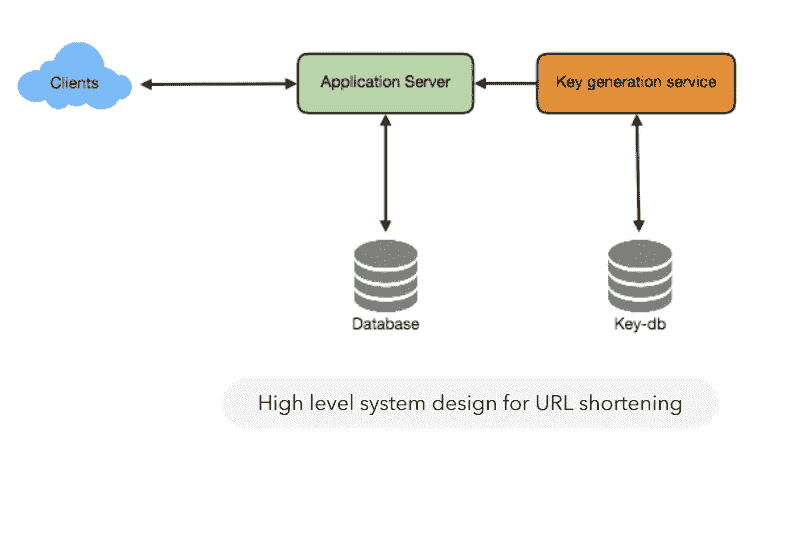](https://www.educative.io/collection/5668639101419520/5649050225344512?affiliate_id=5073518643380224)

## 3. [ByteByteGo 作者 Alex Xu](https://bytebytego.com?fpr=javarevisited https://bit.ly/3P3eqMN)

如果您需要系统设计准备的另一种选择，那么您也可以查看 Alex Xu 的 [ByteByteGo](https://bytebytego.com?fpr=javarevisited https://bit.ly/3P3eqMN) ，他是系统设计最重要的书籍之一《流行的系统设计访谈—内部人员指南第 1 和第 2 部分》的作者。

这个网站有许多易于理解的系统设计图表，这不仅使学习概念变得容易，而且还能记住它们。这个网站就像他的系统设计书和新内容的数字版本，只有在这里可以找到。

去年我参加了大约 10 次面试，我发现系统设计是最难的一轮，因为它非常庞大，我还没有真正为面试官关注的所有问题做好准备，如高可用性、可伸缩性、弹性、SQL 与 NoSQL、分布式系统等，在这里，我很快就学会了很多

以下是了解更多信息的链接— [ByteByteGo 作者 Alex Xu](https://bytebytego.com?fpr=javarevisited https://bit.ly/3P3eqMN)

[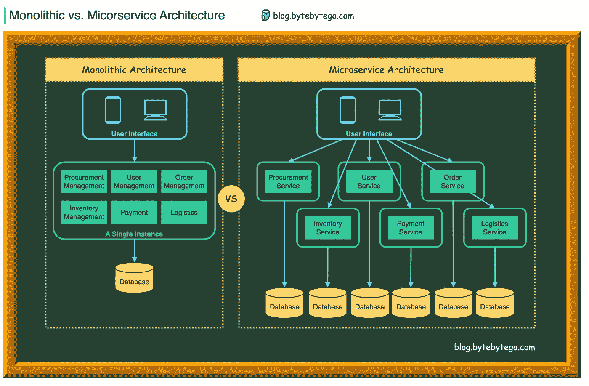](https://bytebytego.com?fpr=javarevisited https://bit.ly/3P3eqMN)

## 4.[掌握编码面试:大科技(FAANG)面试](https://click.linksynergy.com/deeplink?id=JVFxdTr9V80&mid=39197&murl=https%3A%2F%2Fwww.udemy.com%2Fcourse%2Fmaster-the-coding-interview-big-tech-faang-interviews%2F&u1=JAVAREVISITED)

这是一个很棒的面试编码课程，由一位前谷歌面试官创建。如果你是一名软件工程师，并且正在谷歌、脸书、Snapchat 或 Airbnb 等大型科技巨头中寻找工作，那么这就是适合你的课程。

它是专门为大学毕业生和正在大的科技公司和创业公司找工作的初级开发人员设计的。

你不仅会学到[数据结构](https://javarevisited.blogspot.com/2018/01/top-5-free-data-structure-and-algorithm-courses-java--c-programmers.html)和[算法](https://javarevisited.blogspot.com/2017/10/grokking-algorithms-by-aditya-bhargava-best-beginner-book.html)以及面试所需的其他技术信息，而且你还将有机会看到电话面试和现场面试的实际例子，并看到它们是如何被评估的。

**这里是加入本课程的链接** — [掌握编码面试:大科技(FAANG)面试](https://click.linksynergy.com/deeplink?id=JVFxdTr9V80&mid=39197&murl=https%3A%2F%2Fwww.udemy.com%2Fcourse%2Fmaster-the-coding-interview-big-tech-faang-interviews%2F&u1=JAVAREVISITED)

## 5.[寻找编码面试:编码问题的模式](https://www.educative.io/collection/5668639101419520/5671464854355968?affiliate_id=5073518643380224)

这是来自[教育](https://medium.com/u/85b9909ed1cf?source=post_page-----e1c50b30b927--------------------------------)平台的另一门精彩课程，为编码面试做准备。与其他通过解决问题来准备编码面试的在线课程不同，本课程将教你如何找到*潜在的编码模式*，这样你就可以在编码面试中解决类似的问题。如果你想在谷歌、微软、亚马逊、苹果、脸书、网飞或任何一家 FAANG 公司的编码面试中胜出，这种发现模式和培养编码意识的技巧是必须的。为什么？因为他们经常给你出一个你从来没见过的编码问题。如果你知道如何将问题分解成可识别的模式，你就能解决它们。

我强烈推荐这个课程给任何准备编码面试的人，但是就像之前的课程一样，即使你没有准备面试，你也可以加入这个课程来提高你的编码技能，成为一个更好的开发人员。

**这是加入本课程的链接**——[寻找编码面试:编码问题的模式](https://www.educative.io/collection/5668639101419520/5671464854355968?affiliate_id=5073518643380224)

[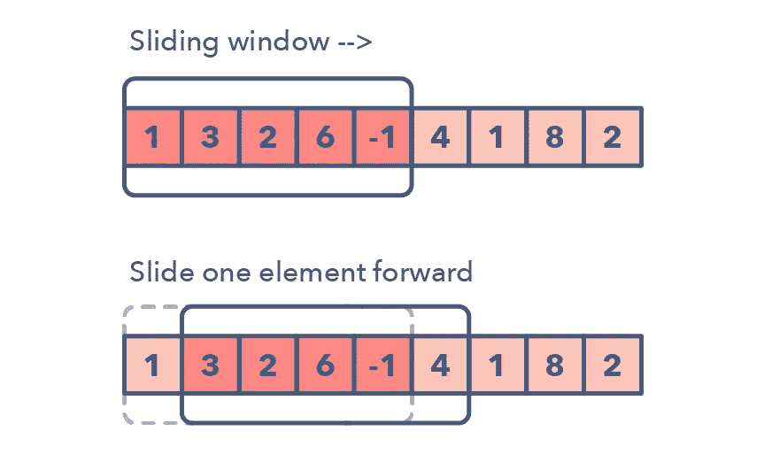](https://www.educative.io/collection/5668639101419520/5671464854355968?affiliate_id=5073518643380224)

而且，如果你发现教育平台很有用，那么你也可以考虑购买 [**教育订阅**](https://www.educative.io/subscription?affiliate_id=5073518643380224) ，这样你每月只需花费**14.9 美元**就可以获得他们的 100 多门课程。

 [## 介绍:教育性订阅。获得无限制的访问权限！

### 提升技能不一定是一场斗争。通过 Educative Unlimited 获得所有+课程的完全访问权限，并获得工具…

www.educative.io](https://www.educative.io/subscription?affiliate_id=5073518643380224) 

有时你需要这种灵活性，加入你想要的课程，而不是购买它。如果你打算在一年内参加几门以上的教育课程，这也是一个更好的交易。

## 6.[掌握编码面试:数据结构+算法](https://academy.zerotomastery.io/p/master-the-coding-interview-data-structures-algorithms?affcode=441520_zytgk2dn)

在本课程中，您不仅将学习如何当场解决编码挑战，还将学习如何处理面试官提出的关于复杂性和改进的棘手问题。

该课程还包括一个非常快速的计算机科学问题训练营，这些问题涉及[数据结构](https://javarevisited.blogspot.com/2013/03/top-15-data-structures-algorithm-interview-questions-answers-java-programming.html)、[算法](http://javarevisited.blogspot.sg/2015/01/top-20-string-coding-interview-question-programming-interview.html)、[位操作](https://javarevisited.blogspot.com/2014/06/how-to-count-number-of-set-bits-or-1s.html)和[并发性](https://javarevisited.blogspot.com/2018/08/how-to-avoid-deadlock-in-java-threads.html)。总的来说，准备软件工作面试的一个完整的包。

这是你的终极编码面试训练营。获得更多的工作机会，协商加薪:获得你想要的工作所需要的一切你都将在本课程中学到。不仅仅是技术和编码技能，还有谈判，这可以让 10K 在你的最终报价中轻松达到 3 万英镑。

**这里是加入本课程的链接**——[掌握编码面试:数据结构+算法](https://academy.zerotomastery.io/p/master-the-coding-interview-data-structures-algorithms?affcode=441520_zytgk2dn)

[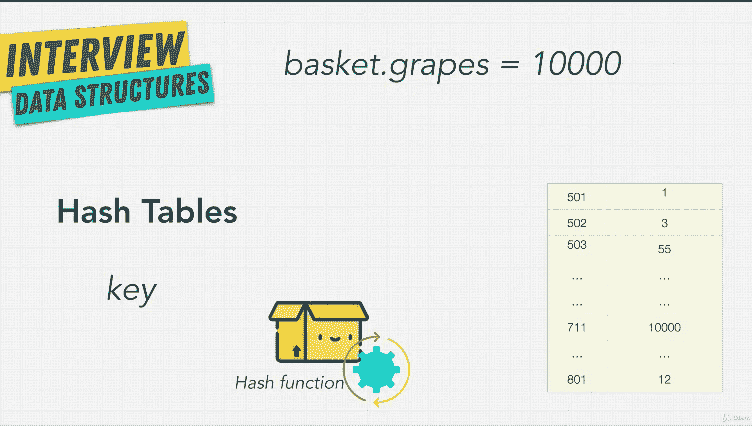](https://academy.zerotomastery.io/p/master-the-coding-interview-data-structures-algorithms?affcode=441520_zytgk2dn)

你可以在 Udemy 或[零到精通](https://academy.zerotomastery.io/p/academy?affcode=441520_zytgk2dn)、[安德烈·尼戈伊](https://medium.com/u/942670ffec21?source=post_page-----e1c50b30b927--------------------------------)自己的编码学校上参加这个课程，在那里他的所有课程(Python、JavaScript、算法、Deno)都可以在一个订阅下获得。

当然，如果你喜欢 Andrei 的教学风格和质量，我强烈推荐订阅该课程，它不仅具有 264 美元的年成本效益，还可以免费访问他们添加到平台的所有未来课程。使用我的代码朋友 10 获得 10%的折扣

**这里是参加零到精通学院**课程的链接— [精通编码面试](https://academy.zerotomastery.io/p/master-the-coding-interview-data-structures-algorithms?affcode=441520_zytgk2dn)

 [## 掌握编码面试:数据结构+算法

### 一些顶级技术公司的 Ace 编码访谈“学习、实现和使用不同的数据结构”

academy.zerotomastery.io](https://academy.zerotomastery.io/p/master-the-coding-interview-data-structures-algorithms?affcode=441520_zytgk2dn) 

## [7。编码面试训练营:算法+数据结构](https://click.linksynergy.com/fs-bin/click?id=JVFxdTr9V80&subid=0&offerid=562016.1&type=10&tmpid=14538&RD_PARM1=https%3A%2F%2Fwww.udemy.com%2Fcoding-interview-bootcamp-algorithms-and-data-structure%2F)

这是一个用 JavaScript 写的编码面试指南。作者自己也花了很多时间来研究谷歌、脸书和亚马逊的面试问题，并分享了他以正确方式回答问题的经验。

在本课程中，您将发现大量常见算法问题，包括从“[反转字符串](http://www.java67.com/2012/12/how-to-reverse-string-in-java-stringbuffer-stringbuilder.html)”到“[寻找二叉树的叶节点](https://javarevisited.blogspot.com/2016/12/how-to-count-number-of-leaf-nodes-in-java-recursive-iterative-algorithm.html)”的所有内容

本课程还概述了面试中最重要的数据结构，如[列表](http://javarevisited.blogspot.sg/2015/02/simple-junit-example-unit-tests-for-linked-list-java.html)、[集合](http://www.java67.com/2013/08/ata-structures-in-java-programming-array-linked-list-map-set-stack-queue.html)、[映射](http://www.java67.com/2017/08/top-10-java-hashmap-interview-questions.html)、[堆栈](http://javarevisited.blogspot.sg/2017/03/difference-between-stack-and-queue-data-structure-in-java.html#axzz56fRo1HGs)、[队列](http://javarevisited.blogspot.sg/2013/03/top-15-data-structures-algorithm-interview-questions-answers-java-programming.html#axzz56fRo1HGs)、[树、](http://javarevisited.blogspot.sg/2015/10/how-to-implement-binary-search-tree-in-java-example.html#axzz4wnEtnNB3)等。

它还提供了处理[系统设计面试](http://www.java67.com/2018/05/top-20-system-design-interview-questions-answers-programming.html)的实用技巧，这对缺乏设计真实系统经验的初学者来说有时很难。

**这里是加入本课程的链接** — [编码面试训练营:算法+数据结构](https://click.linksynergy.com/fs-bin/click?id=JVFxdTr9V80&subid=0&offerid=562016.1&type=10&tmpid=14538&RD_PARM1=https%3A%2F%2Fwww.udemy.com%2Fcoding-interview-bootcamp-algorithms-and-data-structure%2F)

[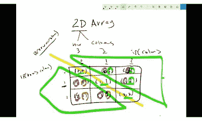](https://click.linksynergy.com/fs-bin/click?id=JVFxdTr9V80&subid=0&offerid=562016.1&type=10&tmpid=14538&RD_PARM1=https%3A%2F%2Fwww.udemy.com%2Fcoding-interview-bootcamp-algorithms-and-data-structure%2F)

## [8。脱离:编程和编码面试](https://click.linksynergy.com/fs-bin/click?id=JVFxdTr9V80&subid=0&offerid=562016.1&type=10&tmpid=14538&RD_PARM1=https%3A%2F%2Fwww.udemy.com%2Fbreak-away-coding-interviews-1%2F)

对于 Java 和 C 程序员来说，这是另一个很好的面试复习课程。与前面的课程相似，它也涵盖了一些基本概念，如指针、[字符串、](http://www.java67.com/2018/04/21-string-programming-and-coding-interview-questions-answers.html)、链表、[排序、](http://www.java67.com/2014/07/quicksort-algorithm-in-java-in-place-example.html)[位操作、](https://javarevisited.blogspot.com/2014/06/how-to-count-number-of-set-bits-or-1s.html)、[数据结构、](http://www.java67.com/2018/06/data-structure-and-algorithm-interview-questions-programmers.html)[系统设计](http://www.java67.com/2018/05/top-20-system-design-interview-questions-answers-programming.html)。

大多数解决方案是用 C 编程语言给出的，有些是用 Java 给出的。

对于刚毕业的工程师和有经验的程序员来说，这是一门很好的课程，他们想在去面试之前温习一下他们的数据结构和算法概念。

**这里是加入本课程的链接** — [脱离:编程和编码面试](https://click.linksynergy.com/fs-bin/click?id=JVFxdTr9V80&subid=0&offerid=562016.1&type=10&tmpid=14538&RD_PARM1=https%3A%2F%2Fwww.udemy.com%2Fbreak-away-coding-interviews-1%2F)

## 9.[动态规划简介—编码面试准备](https://click.linksynergy.com/fs-bin/click?id=JVFxdTr9V80&subid=0&offerid=562016.1&type=10&tmpid=14538&RD_PARM1=https%3A%2F%2Fwww.udemy.com%2Fdynamic-programming%2F)

如果你知道动态编程，许多编码问题可以很容易地解决，但是我发现许多开发人员甚至不知道它，包括一些有经验的人。

[本课程](https://click.linksynergy.com/fs-bin/click?id=JVFxdTr9V80&subid=0&offerid=562016.1&type=10&tmpid=14538&RD_PARM1=https%3A%2F%2Fwww.udemy.com%2Fdynamic-programming%2F)将教你动态编程，以提高你的算法知识，并为你参加软件工程编码面试做准备。

您还将学习几个 1 维和 2 维动态规划问题，以及如何推导递归关系并为其编写一个[递归解](https://javarevisited.blogspot.com/2017/04/recursive-binary-search-algorithm-in-java-example.html)，然后为问题编写一个并在几分钟内编写代码。

**这里是加入本课程的链接**——[动态编程入门——编码面试准备](https://click.linksynergy.com/fs-bin/click?id=JVFxdTr9V80&subid=0&offerid=562016.1&type=10&tmpid=14538&RD_PARM1=https%3A%2F%2Fwww.udemy.com%2Fdynamic-programming%2F)

[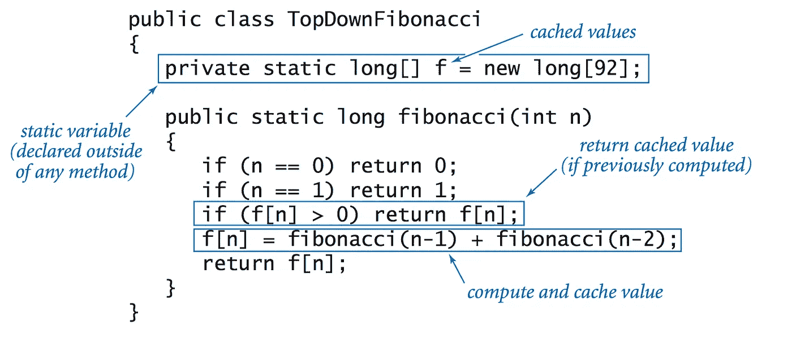](https://click.linksynergy.com/fs-bin/click?id=JVFxdTr9V80&subid=0&offerid=562016.1&type=10&tmpid=14538&RD_PARM1=https%3A%2F%2Fwww.udemy.com%2Fdynamic-programming%2F)

本课程涉及的一些 [*动态编程问题*](/@javinpaul/20-dynamic-programming-interview-questions-with-solutions-2a144b1a1e07) 有:

1.  爬楼梯
2.  买卖股票
3.  0/1 背包
4.  最长公共子串
5.  最长公共子序列

总的来说是学习动态编程的好课程。即使你没有准备编码工作面试，你也可以参加这个课程，只是为了提高你的动态编程和算法知识。该课程同时使用了 [Java](https://javarevisited.blogspot.com/2018/08/top-5-free-java-8-and-9-courses-for-programmers.html) 和 [Python](http://javarevisited.blogspot.sg/2018/03/top-5-courses-to-learn-python-in-2018.html) ，因此对 Java 和 Python 开发者都有用。

## 10. [Python 用于数据结构、算法和面试！](https://click.linksynergy.com/fs-bin/click?id=JVFxdTr9V80&subid=0&offerid=562016.1&type=10&tmpid=14538&RD_PARM1=https%3A%2F%2Fwww.udemy.com%2Fpython-for-data-structures-algorithms-and-interviews%2F)

这是专门为 Python 开发者设计的数据结构、算法、[编码面试课程](https://click.linksynergy.com/fs-bin/click?id=JVFxdTr9V80&subid=0&offerid=562016.1&type=10&tmpid=14538&RD_PARM1=https%3A%2F%2Fwww.udemy.com%2Fpython-for-data-structures-algorithms-and-interviews%2F)。这是一门现代课程，侧重于 Github 和 LinkedIn 个人资料之类的东西来打动新人。

它还能帮助你创建一份优秀的简历，而这是许多程序员所忽略的。记住，是你的简历给了你一个面试的机会，如果它不好，你甚至不会得到面试电话。

在本课程中，您不仅将学习所有主要的数据结构和算法，而且在准备课程的模拟面试后，还将获得 ace [编码面试](http://www.java67.com/2018/05/top-75-programming-interview-questions-answers.html)。总的来说，Python 程序员最好的编码面试课程之一。

**这里是加入本课程的链接**——[数据结构、算法和面试的 Python！](https://click.linksynergy.com/fs-bin/click?id=JVFxdTr9V80&subid=0&offerid=562016.1&type=10&tmpid=14538&RD_PARM1=https%3A%2F%2Fwww.udemy.com%2Fpython-for-data-structures-algorithms-and-interviews%2F)

## 11. [11 个必不可少的编码面试问题+编码练习！](https://click.linksynergy.com/fs-bin/click?id=JVFxdTr9V80&subid=0&offerid=562016.1&type=10&tmpid=14538&RD_PARM1=https%3A%2F%2Fwww.udemy.com%2F11-essential-coding-interview-questions%2F)

在你解决了工作面试中最常见的一些问题之前，面试准备工作是不会结束的。[本课程](https://click.linksynergy.com/fs-bin/click?id=JVFxdTr9V80&subid=0&offerid=562016.1&type=10&tmpid=14538&RD_PARM1=https%3A%2F%2Fwww.udemy.com%2F11-essential-coding-interview-questions%2F)提供了如何以循序渐进的方式解决 11 个这样的问题。

这是一个短期课程，我建议你只参加其他课程，但它有利于学习如何根据你现有的数据结构和算法知识来处理一个完全未知的问题。

**以下是加入本课程的链接**——[11 个必不可少的编码面试问题+编码练习！](https://click.linksynergy.com/fs-bin/click?id=JVFxdTr9V80&subid=0&offerid=562016.1&type=10&tmpid=14538&RD_PARM1=https%3A%2F%2Fwww.udemy.com%2F11-essential-coding-interview-questions%2F)

[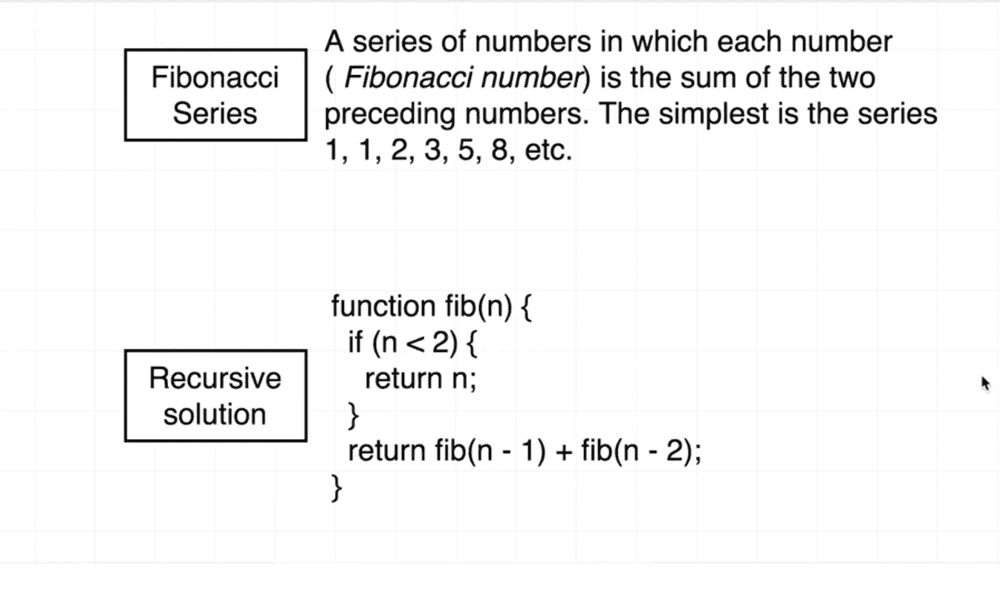](https://click.linksynergy.com/fs-bin/click?id=JVFxdTr9V80&subid=0&offerid=562016.1&type=10&tmpid=14538&RD_PARM1=https%3A%2F%2Fwww.udemy.com%2F11-essential-coding-interview-questions%2F)

## 12. [200+ SQL 面试问题](https://click.linksynergy.com/fs-bin/click?id=JVFxdTr9V80&subid=0&offerid=562016.1&type=10&tmpid=14538&RD_PARM1=https%3A%2F%2Fwww.udemy.com%2Fsql-interview-questions%2F)

SQL 查询和数据库相关的问题在编程工作面试中非常常见，因此对于计算机科学毕业生或程序员来说，提前准备 SQL 问题非常重要。

[本课程](https://click.linksynergy.com/fs-bin/click?id=JVFxdTr9V80&subid=0&offerid=562016.1&type=10&tmpid=14538&RD_PARM1=https%3A%2F%2Fwww.udemy.com%2Fsql-interview-questions%2F)为编程工作面试提供 200+ SQL 查询和问题。

[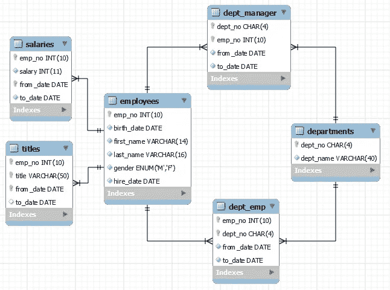](https://click.linksynergy.com/fs-bin/click?id=JVFxdTr9V80&subid=0&offerid=562016.1&type=10&tmpid=14538&RD_PARM1=https%3A%2F%2Fwww.udemy.com%2Fsql-interview-questions%2F)

我还讨论了一些问题，比如在我之前的帖子中找到[第二高的工资](https://javarevisited.blogspot.com/2016/01/4-ways-to-find-nth-highest-salary-in.html)和[第 n 高的工资](https://javarevisited.blogspot.com/2015/11/2nd-highest-salary-in-oracle-using-rownumber-rank-example.html)，你可能想检查一下。

## 13.[算法和数据结构—第一部分](https://pluralsight.pxf.io/c/1193463/424552/7490?u=https%3A%2F%2Fwww.pluralsight.com%2Fcourses%2Falgorithms-data-structures-part-one)

这是学习数据结构和算法的最好的 Pluralsight 课程之一，这是任何编码面试的最重要的主题。

在本课程中，您将看到核心数据结构和算法，它们是任何地方的应用程序的构建块。您将了解它们是如何工作的，并看到可以应用到下一个项目中的真实例子。

顺便说一句，你需要一个 Pluralsight 会员才能进入这个课程，费用大约是每月 29 美元或每年 299 美元(14%的折扣)。

如果你没有 Pluralsight 会员资格，我鼓励你申请一个，因为它可以让你访问他们 7000 多门关于所有最新主题的在线课程，如前端和后端开发、机器学习等。它还包括交互式测验、练习和最新的认证材料。

或者，你也可以使用他们的 [**10 天免费试用**](https://pluralsight.pxf.io/c/1193463/424552/7490?u=https%3A%2F%2Fwww.pluralsight.com%2Flearn) 免费观看本课程。

## 14. [200+面向初学者的 Java 面试问题](https://click.linksynergy.com/fs-bin/click?id=JVFxdTr9V80&subid=0&offerid=562016.1&type=10&tmpid=14538&RD_PARM1=https%3A%2F%2Fwww.udemy.com%2Fjava-interview-questions-and-answers%2F)

本课程特别针对申请 Java 开发人员工作的 Java 程序员或开发人员。

由于 Java 非常庞大，不可能准备好所有的东西，尤其是在短时间内，这也是本课程的难点所在。

它提供了来自 Java 不同领域的 200 多个 Java 面试问题的范例。除此之外，你还可以看到我在过去 5 年中收集的 [140+个 Java 问题，这些问题是我自己以及朋友和同事收集的。](http://javarevisited.blogspot.sg/2015/10/133-java-interview-questions-answers-from-last-5-years.html)

这组问题很好地代表了你在真实面试中可能遇到的 Java 问题。

**这里是加入本课程的链接**——[200+Java 初学面试问题](https://click.linksynergy.com/fs-bin/click?id=JVFxdTr9V80&subid=0&offerid=562016.1&type=10&tmpid=14538&RD_PARM1=https%3A%2F%2Fwww.udemy.com%2Fjava-interview-questions-and-answers%2F)

## 15.[寻找编码面试的动态编程模式](https://www.educative.io/collection/5668639101419520/5633779737559040?affiliate_id=5073518643380224)

这是我从 Educative 为准备编码面试的程序员选择的第三门课程，因为 Educative 真的有最好的编码面试课程。本课程从编码访谈中解决了动态编程的另一个难题。

如果你不知道动态编程是一种通过将复杂问题分解成更小的类似问题来解决复杂问题的技术。它使用[递归](https://javarevisited.blogspot.com/2017/03/how-to-reverse-linked-list-in-java-using-iteration-and-recursion.html)和[记忆](https://www.java67.com/2016/05/fibonacci-series-in-java-using-recursion.html)来解决单个部分，以最终解决更大的问题，但不容易掌握。

本课程将为您提供掌握动态编程所需的所有知识，您将通过解决面试中最常见的动态编程问题来学习，以便您在真正需要时准备好解决它们。

**这里是加入本课程的链接** — [探索编码面试的动态编程模式](https://www.educative.io/collection/5668639101419520/5633779737559040?affiliate_id=5073518643380224)

[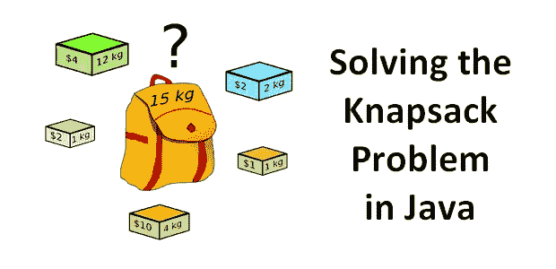](https://www.educative.io/collection/5668639101419520/5633779737559040?affiliate_id=5073518643380224)

以上就是为编码或编程工作面试准备的一些最好的课程。正如我所说，在编码面试中成功的关键是能够实时地思考问题和编码。

你需要大量的练习才能做到。谢天谢地，有很多网站可以让你练习编码问题。一旦你完成了这些课程中的一门，你可以试着解决我列出的 50 个编码问题。

 [## 50+数据结构和算法程序员面试问题

### 有很多计算机科学毕业生和程序员申请编程、编码和软件…

medium.com](/hackernoon/50-data-structure-and-algorithms-interview-questions-for-programmers-b4b1ac61f5b0) 

# 现在，您已经为编码面试做好了准备

这些是准备编程面试的一些最好的课程。他们会教你数据结构和算法，帮助你在面试中表现出色。

我在我的[博客](http://java67.com/)上也分享了很多编程面试问题，如果你真的感兴趣，可以随时去那里搜索。

这些**常见的编码、数据结构和算法问题**是你需要知道的，以成功面试任何公司，无论规模大小，任何级别的编程工作。

如果你想在 2023 年找一份编程或软件开发的工作，你可以从这份算法和工作面试课程清单开始准备。

良好的数据结构和算法知识对于成功编写面试代码非常重要，这也是你应该集中大部分注意力的地方。

其他**编程面试资源**你可能喜欢:
[50+数据结构与算法问题](https://hackernoon.com/50-data-structure-and-algorithms-interview-questions-for-programmers-b4b1ac61f5b0)
[30+编程面试中的链表问题](http://javarevisited.blogspot.sg/2017/07/top-10-linked-list-coding-questions-and.html#axzz4xXS86IVo)
[30+编码面试中的基于数组的问题](http://javarevisited.blogspot.sg/2015/06/top-20-array-interview-questions-and-answers.html#axzz4tUeeQOAU)
[10 编程面试中的 SQL 查询](http://www.java67.com/2013/04/10-frequently-asked-sql-query-interview-questions-answers-database.html)
[50+程序员电话面试问题](https://javarevisited.blogspot.com/2015/02/50-programmer-phone-interview-questions-answers.html#axzz5C5tt0mTL)
[数据结构与算法:深潜使用 Java](http://bit.ly/2F5V1uW)
[面向 Java 开发者的结构与算法书籍](http://www.java67.com/2015/09/top-10-algorithm-books-every-programmer-read-learn.html)
[从 0 到 1:Java 中的数据结构&算法](https://click.linksynergy.com/fs-bin/click?id=JVFxdTr9V80&subid=0&offerid=323058.1&type=10&tmpid=14538&RD_PARM1=https%3A%2F%2Fwww.udemy.com%2Ffrom-0-to-1-data-structures%2F)
[7 门学习数据结构与算法的最佳课程](/javarevisited/7-best-courses-to-learn-data-structure-and-algorithms-d5379ae2588)
[20+基于二叉树的编码问题面试](/javarevisited/20-binary-tree-algorithms-problems-from-coding-interviews-c5e5a384df30)
[编码面试前 25 名系统设计问题](/javarevisited/25-software-design-interview-questions-to-crack-any-programming-and-technical-interviews-4b8237942db0)

## 结束语

谢谢，你坚持到了文章的结尾…祝你编程面试好运！这当然不容易，但是通过学习这些课程，你比其他候选人领先一步。

如果你喜欢这篇文章，那么请分享给你的朋友和同事，别忘了在 Twitter 上关注 [javinpaul](https://twitter.com/javinpaul) ！

> 如果你想翻译这篇文章，或者在你的博客、网站或出版物上重新发表，请给我的电子邮件 savingfunda@gmail.com 留言，我通常会答应的。

**附言**如果你喜欢书，那么你也可以看看我列出的 [10 本书，为编码面试做准备](http://www.java67.com/2017/06/10-books-to-prepare-technical-coding-job-interviews.html)。

**P. P. S.** —如果你需要一些免费的资源，可以查看这个 [**免费数据结构与算法课程**](http://javarevisited.blogspot.com/2018/01/top-5-free-data-structure-and-algorithm-courses-java--c-programmers.html) 列表，开始准备。

**其他文章上** [**中**](https://medium.com/u/504c7870fdb6?source=post_page-----b657a195aa07----------------------) **你可能喜欢:**

 [## 2023 年编码面试 10 大最佳系统设计课程

### 这些是 2021 年学习 Udemy，edX，Educative 进行编码面试的最好的在线课程。

medium.com](/javarevisited/10-best-system-design-courses-for-coding-interviews-949fd029ce65)  [## 2023 年编码面试的 6 门最佳动态编程课程

### 这些是从 Udemy，Educative 和 Coursera 学习动态编程的最佳课程，适用于…

medium.com](/javarevisited/6-best-dynamic-programming-courses-for-coding-interviews-14744060923c)  [## Java、C/C++和 Python 初学者的 10 本最佳数据结构和算法书籍

### 算法是语言不可知的，任何称职的程序员都应该能够将它们转换成他们自己的代码…

medium.com](/javarevisited/10-best-books-for-data-structure-and-algorithms-for-beginners-in-java-c-c-and-python-5e3d9b478eb1)  [## 破解任何编程和技术面试的 25 个软件设计面试问题

### 常见系统设计问题和有用资源的链接

medium.com](/javarevisited/25-software-design-interview-questions-to-crack-any-programming-and-technical-interviews-4b8237942db0)*