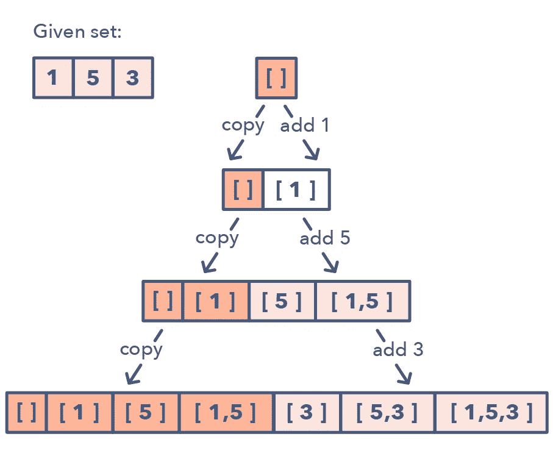

# 程序员本周应该阅读的 10 篇数据结构和算法文章

> 原文：<https://medium.com/javarevisited/10-data-structure-and-algorithms-articles-programmer-should-read-this-week-585404a9403b?source=collection_archive---------0----------------------->

**图片—** [**探寻编码面试:编码题模式**](https://www.educative.io/collection/5668639101419520/5671464854355968?affiliate_id=5073518643380224)

伙计们，你们好吗？我已经很久没有在这里写东西了，所以我在这里，与你分享几篇本周可以阅读的关于**数据结构和算法**的好文章。一路上，我也会分享一些有趣的书籍和课程，给那些想深入探讨这个重要话题的人。

所以，不要再浪费你的时间了，下面是我列出的程序员本周可以阅读的 10 篇数据结构和算法文章:

# 14 种模式来面对任何编码面试问题

这是我本周最喜欢的一篇文章，我是法希姆·哈克的超级粉丝，喜欢他的文章，所以你可能会觉得有点党派偏见，但是一旦你读了这篇文章，你就会同意我的观点。

本文将教你一些解决面试中编码问题的常用技巧，如双指针法、递归、快慢指针法、滑动窗口、动态编程等等。

实际上，这篇文章只是对他们的课程— [**探索编码面试:编码问题的模式**](https://www.educative.io/collection/5668639101419520/5671464854355968?affiliate_id=5073518643380224) 的介绍，所以如果你想深入研究这些模式，你也可以看看这个课程。

<https://hackernoon.com/14-patterns-to-ace-any-coding-interview-question-c5bb3357f6ed>  

# 初级开发人员应该探索的 10 门(免费)数据结构和算法课程

这是我在 [Hackernoon](https://medium.com/u/4a8a924edf41?source=post_page-----585404a9403b--------------------------------) 上的文章，我已经分享了一堆有用的免费课程来学习数据结构和算法。这些课程不仅会教你基本的数据结构，如[数组](/javarevisited/20-array-coding-problems-and-questions-from-programming-interviews-869b475b9121)、[链表](/javarevisited/top-20-linked-list-coding-problems-from-technical-interviews-90b64d2df093)、[二叉树](/javarevisited/20-binary-tree-algorithms-problems-from-coding-interviews-c5e5a384df30)和哈希表，还会教你高级的数据结构，如 TRIE、自平衡树如 AVL 和红黑树、图等。如果你喜欢从免费资源中学习，那么你会喜欢这些课程。

<https://hackernoon.com/10-free-data-structure-and-algorithm-courses-junior-developers-should-explore-978b72871af5>  

# Rohan Paul[用 JavaScript 解决经典的二和三和问题](https://medium.com/u/b9a1f20ae787?source=post_page-----585404a9403b--------------------------------)

我一直在学习 JavaScript，还有什么比用这种语言解决编码问题更能让它不断进步。这不仅能帮助你学习语法，还能帮助你用语言建立逻辑。如果你喜欢解决编码问题，你会喜欢这篇文章。

洛汗，如果你想加入我们的刊物，可以和我聊聊吗？我喜欢你的文章，很高兴能在这里接待你。

</@paulrohan/solving-the-classic-two-sum-and-three-sum-problem-in-javascript-7d5d1d47db03>  

顺便说一句，在你去参加编码面试之前，你应该对数据结构和算法有基本的了解。如果您是数据结构和算法的新手，根据哪种编程语言最适合您，这里有一些课程可以更新您的知识，例如:

1.  [**数据结构和算法:Java 开发人员使用 Java 的深度探讨**](https://click.linksynergy.com/fs-bin/click?id=JVFxdTr9V80&subid=0&offerid=323058.1&type=10&tmpid=14538&RD_PARM1=https%3A%2F%2Fwww.udemy.com%2Fdata-structures-and-algorithms-deep-dive-using-java%2F)
2.  [**Python 中的算法和数据结构**](https://click.linksynergy.com/deeplink?id=JVFxdTr9V80&mid=39197&murl=https%3A%2F%2Fwww.udemy.com%2Falgorithms-and-data-structures-in-python%2F) 给热爱 Python 的人
3.  [**JavaScript 算法与数据结构大师班**](https://click.linksynergy.com/fs-bin/click?id=JVFxdTr9V80&subid=0&offerid=508237.1&type=10&tmpid=14538&RD_PARM1=https%3A%2F%2Fwww.udemy.com%2Fjs-algorithms-and-data-structures-masterclass%2F) 由柯尔特·斯蒂尔面向 JavaScript 程序员开设
4.  [**掌握数据结构&使用 C 和 C++的算法**](https://click.linksynergy.com/deeplink?id=JVFxdTr9V80&mid=39197&murl=https%3A%2F%2Fwww.udemy.com%2Fdatastructurescncpp%2F) 适合擅长 C/C++的人

# Avik Das 对动态编程的图形化介绍

动态编程是一个有趣的概念，也非常有用，尤其是当你准备编码面试的时候。本文从不同的角度和不同的方式介绍了动态编程，这可能会帮助你更好地学习它。

</future-vision/a-graphical-introduction-to-dynamic-programming-2e981fa7ca2>  

如果您想了解更多关于动态编程的知识，这里有一些资源可以帮助您更好地学习动态编程:

1.  [**动态规划介绍—编码面试准备**](https://click.linksynergy.com/deeplink?id=JVFxdTr9V80&mid=39197&murl=https%3A%2F%2Fwww.udemy.com%2Fdynamic-programming%2F)
2.  [**动态编程— I**](https://click.linksynergy.com/deeplink?id=JVFxdTr9V80&mid=39197&murl=https%3A%2F%2Fwww.udemy.com%2Fdynamic-programming-i%2F)

<https://www.udemy.com/dynamic-programming-i/?ranMID=39197&ranEAID=JVFxdTr9V80&ranSiteID=JVFxdTr9V80-T3QMOAjEm7WgbeG0fMHuIA&LSNPUBID=JVFxdTr9V80>  

# 《数据结构 101:图表——初学者的直观介绍》,作者:埃斯特法尼亚·卡辛纳·纳沃恩

图表是最重要的数据结构之一，但初学者往往会忽略它，认为它太复杂而难以理解。如果你觉得图表不合你的胃口，这篇文章可能会帮助你改变你的看法。我真的很喜欢这篇文章。

Estefania Cassingena Navone ，我很喜欢你在 [freeCodeCamp](https://medium.com/u/8b318225c16a?source=post_page-----585404a9403b--------------------------------) 上的文章，很乐意在这里接待你，如果你有兴趣在@ javarevisited 上发表，请与我联系

</free-code-camp/data-structures-101-graphs-a-visual-introduction-for-beginners-6d88f36ec768>  

# 142 掌握编码的资源 [SeattleDataGuy](https://medium.com/u/41cd8f154e82?source=post_page-----585404a9403b--------------------------------)

准备编码面试的巨大资源集合，如果你喜欢解决编码问题，你会在这里找到很多。我有点难过没有找到我的任何文章，因为它们中的一些像 [**50+算法问题**](https://hackernoon.com/50-data-structure-and-algorithms-interview-questions-for-programmers-b4b1ac61f5b0) 和 [20+字符串编码问题](https://hackernoon.com/20-string-coding-interview-questions-for-programmers-6b6735b6d31c)对于准备编码面试的程序员来说非常有用，但嘿，这仍然是一个非常好的收藏。

</better-programming/the-software-engineering-study-guide-bac25b8b61eb>  

# 如何准备竞技编程？由安德烈·马尔格劳伊

这是一篇旧文章，但我上周才读过。它讲述了作者如何在计算奥林匹克竞赛中赢得 4 枚金牌中的 3 枚，并分享了一些为竞争性编程做准备的非常好的见解和技术。我真的很喜欢这篇文章，我知道你也会喜欢它。

</@andreimargeloiu/how-to-prepare-for-competitive-programming-396d557e0c12>  

Andrei Margeloiu，你愿意和我们一起参加 Javarevisited 吗？我很乐意在这里接待你，你的故事值得分享。

# 谷歌面试问题解构:亚历克斯·戈莱克的同义查询

我喜欢阅读任何关于谷歌面试过程的东西，每当我看到讨论谷歌面试问题的故事，我都会确保阅读它。如果你也有类似的爱好，那么这篇文章是给你的。

给你一些背景资料 [Alex Golec](https://medium.com/u/fc349a0617c0?source=post_page-----585404a9403b--------------------------------) 曾在谷歌工作，目前在纽约 Reddit 工作，所以他肯定知道谷歌的面试流程。

</@alexgolec/google-interview-problems-synonymous-queries-36425145387c>  

[Alex Golec](https://medium.com/u/fc349a0617c0?source=post_page-----585404a9403b--------------------------------) ，如果你正在读这封信，加入我们吧，我很乐意将你添加为 Javarevisited 的作者。

# 搜索算法——书评作者[贾文保罗](https://medium.com/u/bb36d8439904?source=post_page-----585404a9403b--------------------------------)

我的另一个故事是关于我非常喜欢的一本书。这是我向每一个初学者和有志于学习算法和数据结构的计算机科学毕业生推荐的书。

这本[书](https://www.amazon.com/Grokking-Algorithms-illustrated-programmers-curious/dp/1617292230/?tag=javamysqlanta-20)没有涵盖所有的数据结构，但是无论它涵盖了什么，它都做得很好。我真的很喜欢这些图片，它们让我清楚地理解了这些概念。如果你像我一样是视觉学习者，那么你会喜欢这本书。

<https://hackernoon.com/grokking-algorithms-book-review-aa4459da93f5>  

如果你想读这本书，这里有链接— [**搜索算法:程序员图解指南**](https://www.amazon.com/Grokking-Algorithms-illustrated-programmers-curious/dp/1617292230/?tag=javamysqlanta-20)

顺便说一句，如果你需要更多的选择，特别是深入研究数据结构和算法的在线课程，以进行编码面试和一般编程视角，这些是我为 Java、Python 和 JavaScript 开发人员推荐的在线课程:

1.  [**数据结构和算法:Java 开发人员使用 Java 的深度探讨**](https://click.linksynergy.com/fs-bin/click?id=JVFxdTr9V80&subid=0&offerid=323058.1&type=10&tmpid=14538&RD_PARM1=https%3A%2F%2Fwww.udemy.com%2Fdata-structures-and-algorithms-deep-dive-using-java%2F)
2.  [**Python 中的算法和数据结构**](https://click.linksynergy.com/deeplink?id=JVFxdTr9V80&mid=39197&murl=https%3A%2F%2Fwww.udemy.com%2Falgorithms-and-data-structures-in-python%2F) 给热爱 Python 的人
3.  [**JavaScript 算法与数据结构大师班**](https://click.linksynergy.com/fs-bin/click?id=JVFxdTr9V80&subid=0&offerid=508237.1&type=10&tmpid=14538&RD_PARM1=https%3A%2F%2Fwww.udemy.com%2Fjs-algorithms-and-data-structures-masterclass%2F) 由柯尔特·斯蒂尔为 JavaScript 程序员开设

感谢到目前为止阅读这篇文章的朋友们，祝你们愉快，享受学习 Java 和算法的过程。

> 我们也在寻找作家，并在 javarestived 上投稿，所以如果你有兴趣在 javarestived 上发表你的故事，请在这篇文章中给我留言或评论，我会把你添加为作家。

## 您可能喜欢的其他媒体文章:

</hackernoon/10-data-structure-algorithms-and-programming-courses-to-crack-any-coding-interview-e1c50b30b927>  </javarevisited/25-software-design-interview-questions-to-crack-any-programming-and-technical-interviews-4b8237942db0>  </javarevisited/top-20-linked-list-coding-problems-from-technical-interviews-90b64d2df093> 