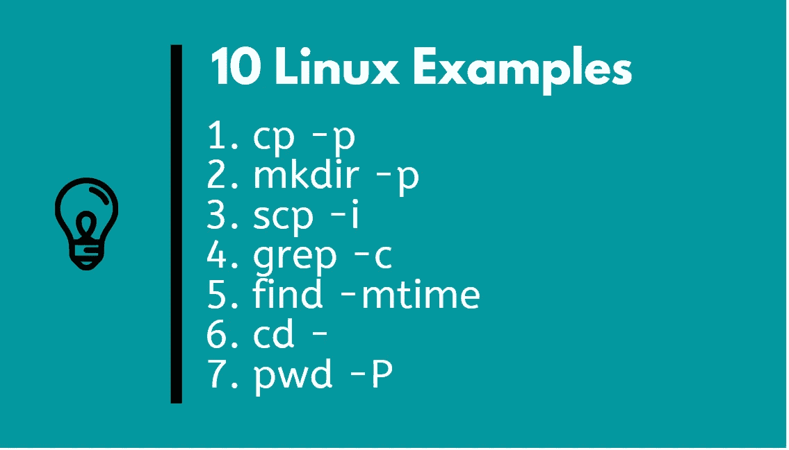
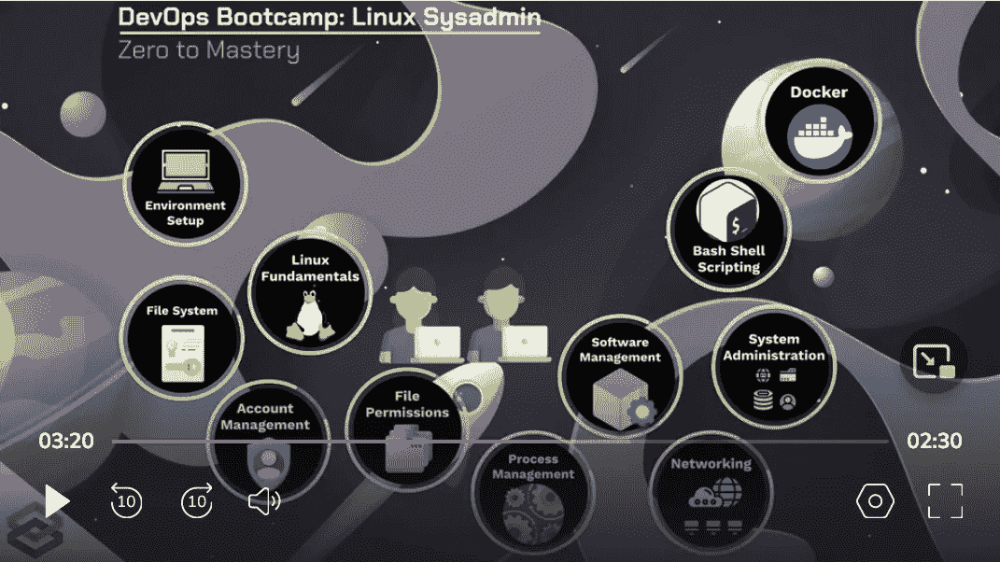
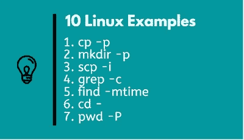

# 每个开发人员和开发者都应该学习的 10 个 Linux 命令

> 原文：<https://medium.com/javarevisited/10-essential-linux-commands-every-developer-and-devops-should-know-9df39391aac7?source=collection_archive---------0----------------------->

## 你会惊讶地发现，许多有经验的程序员并不知道这些强大的 Linux 命令选项的基本命令

[](https://click.linksynergy.com/deeplink?id=JVFxdTr9V80&mid=39197&murl=https%3A%2F%2Fwww.udemy.com%2Fcourse%2Flearn-linux-in-5-days%2F)

大家好，你可能在网上读过很多关于流行的 Linux 命令的文章，但是这篇文章有点不同。在本文中，我将分享一些基本 Linux 命令的**鲜为人知的选项**，如 [find](https://javarevisited.blogspot.com/2018/08/10-example-of-find-command-in-unix-linux.html) 、 [grep](https://javarevisited.blogspot.com/2011/06/10-examples-of-grep-command-in-unix-and.html) 、 [mkdir](https://javarevisited.blogspot.com/2014/09/how-to-create-complex-directory-tree-unix-mkdir-command-example.html#axzz5QiHfvmbQ) 等，许多 Linux 用户，包括程序员，甚至在使用该命令相当一段时间后都不知道这些选项。

例如,`, cp -p`是我很晚才发现的一个选项，但自从我发现它以来，我一直在定期使用它，因为它保留了时间戳，我可以看到这个文件最初是何时创建的。

我将在本帖中分享 10 个 Linux 命令示例<https://javarevisited.blogspot.com/2020/08/10-examples-of-essential-linux-commands.html>***，我相信你会喜欢的，如果你已经知道它们，那么你很有可能在评论区与我们分享类似的内容。***

***如果你在 Linux 主机上做过软件开发和支持，那么你可能会体验到 Linux 命令的威力。它们是运行服务器端应用程序和命令行的最重要的工具，掌握基本和高级 Linux 命令对成为更好的程序员和 IT 专业人员大有帮助。***

***我个人喜欢学习新的 Linux 命令来提高我的工具集和生产力，每次我发现一些有用的选项或一个新命令，我都感到非常兴奋。今天，我将分享一些非常流行的 Linux 命令的最有用的选项，你可能会认为应该早点知道。***

***这些是我们很多人日常使用的命令，比如`cp`、`mkdir`、 [grep](https://www.java67.com/2017/07/how-to-find-all-files-containing-matching-text-grep-command-example.html) 、 [netstat](https://javarevisited.blogspot.com/2022/12/10-example-of-netstat-command-in-unix.html) 、 [SCP](https://javarevisited.blogspot.com/2022/12/10-example-of-scp-secure-copy-command.html) ，但是仍然有一些我们不知道的有用选项。至少即使在使用这些 UNIX 命令多年之后，我也不知道其中的许多命令。

这些命令行选项不会让你成为 Linux 超级用户，但肯定会为你提供一些有用的信息，这些信息将在未来拯救你的一天，但是如果你不熟悉这些命令本身，那么我也建议你参加一个全面的课程，如**[***Linux Mastery:在 11.5 小时内掌握 Linux 命令行***](/javarevisited/top-10-courses-to-learn-linux-command-line-in-2020-best-and-free-f3ee4a78d0c0) 从头开始学习 Linux 命令。如果您事先了解 command，这些选项会更有意义。*****

*****[](https://javarevisited.blogspot.com/2018/02/5-courses-to-learn-shell-scripting-in-linux.html)*****

# *****常用 Linux 命令的 10 个强大的命令行选项*****

*****你可能会想，为什么我要分享这些 Linux 命令选项？嗯，我写这篇文章并分享这些 Linux 例子有很多好处。首先，它帮助我巩固知识，通过分享，我更好地学习和记住了这些 Linux 命令行选项。*****

*****我分享这些选择的另一个原因是希望向你们所有人学习。当谈到 Linux 命令行时，每个人都知道一两个窍门，通过分享我保存的技巧，我希望看到来自你们这些家伙的这样的瑰宝。因此，请随意分享过去对您有帮助的 Linux 命令选项。*****

*****为了不浪费你更多的时间，这里有一些不为人知但很有用的常用 Linux 命令选项，我觉得我应该早点知道。*****

## *****1.cp -p(保留时间戳)*****

*****你肯定使用过`cp` 命令来复制文件或目录，但是你知道如何在复制文件或目录时保存时间戳吗？我没有，至少几个月前没有。*****

*****当您复制文件时， *cp — p* 命令将**保存时间戳。这非常有用，尤其是在更改文件时进行备份。备份文件的时间戳对于故障排除等非常重要。*******

```
*****$ cp - p $file*****
```

*****当我第一次从一个支持人员那里知道这个选项时，我就像 **OMG，我怎么能错过这个选项这么多年**，但这就是现实，有时我们在眼前寻找一个非常重要的东西，并追逐一个不存在的新的闪亮的东西。*****

*****顺便说一句，如果你是 Linux 新手，那么我也推荐你去看看 [**DevOps Bootcamp:学习 Linux &成为 Linux 系统管理员**](https://academy.zerotomastery.io/a/aff_glpct39t/external?affcode=441520_zytgk2dn) ，这是 ZTM 学院的一门非常棒的综合性 Linux 课程。这是我最喜欢的程序员和 DevOps 工程师在线培训课程之一。*****

*****[](https://academy.zerotomastery.io/a/aff_glpct39t/external?affcode=441520_zytgk2dn)*****

*****顺便说一句，你需要一个 [**ZTM 会员**](https://academy.zerotomastery.io/a/aff_c0gnlvf7/external?affcode=441520_zytgk2dn) 才能观看这个课程，这个课程每月花费大约 39 美元，但也提供了许多像这样的超级有趣和有用的课程。您还可以使用优惠券代码 FRIENDS10 获得本课程或您选择的任何订阅的 10%折扣。*****

## *****2.mkdir -p(创建目录结构)*****

*****我相信你已经使用过 [mkdir 命令](https://javarevisited.blogspot.com/2014/09/how-to-create-complex-directory-tree-unix-mkdir-command-example.html)来创建目录，有时你可能会在一个接一个地创建复杂的目录结构时感到沮丧。*****

*****如果您知道 [*mkdir -p 选项*](https://javarevisited.blogspot.com/2014/09/how-to-create-complex-directory-tree-unix-mkdir-command-example.html) 可以在父目录不存在的情况下复制父目录，那么您可以节省很多时间。

例如，当你复制一个文件/app/config/app.properties 时，如果这些目录不存在，它会自动创建这些目录。*****

```
*****$ mkdir - p*****
```

*****如果 mkdir 命令对你来说是新的，那么我强烈推荐你参加一个全面的 Linux 课程，比如 Udemy 上的[**5 天学会 Linux 和提升你的职业**](https://click.linksynergy.com/deeplink?id=JVFxdTr9V80&mid=39197&murl=https%3A%2F%2Fwww.udemy.com%2Fcourse%2Flearn-linux-in-5-days%2F) 来学习这些基本的 Linux 命令，并学习如何在一个单一的命令中创建一个复杂的目录结构。*****

*****[](https://click.linksynergy.com/deeplink?id=JVFxdTr9V80&mid=39197&murl=https%3A%2F%2Fwww.udemy.com%2Fcourse%2Flearn-linux-in-5-days%2F)*****

## *****3.scp -i(使用身份文件的无密码文件复制)*****

*****这是另一个有用的 Linux 选项，是我很晚才发现的 SCP 之类的常见命令。SCP 命令用于将文件和目录从一台主机安全地复制到另一台主机。*****

*****当你使用 SCP 复制文件时，它会询问你的用户名和密码，但是如果你使用脚本，你最好使用**无密码 SCP** ，这就是 scp -i 的用处。它可以使用身份文件从远程主机复制文件，而不是使用您当前的用户名。*****

*****身份文件包含登录远程主机和复制文件所需的 ssh 密钥。*****

```
*****$ scp -i /home/appuser/.ssh/id_rsa_app 
        datauser@host:/app/data/outbound/stocks.xml*****
```

*****这里的身份文件:`id_rsa_app`包含“datauser”的私有/公共密钥。这个选项的美妙之处在于，如果您运行这个命令，它不会要求您输入密码。*****

## *****4.grep -c*****

*****很多时候我们想知道文件中是否包含一个匹配的单词，而 [grep 命令](https://www.java67.com/2017/07/grep-command-example-list-only-file-names-matching-string.html)只是告诉你这一点，但是有时候你也想知道这个特定的关键字在文件中出现了多少次？我是说，匹配关键词的可能性。*****

*****这就是 grep -c 的用武之地。它会告诉你匹配关键字的数量。
举个例子，*****

```
*****$ grep -c "keyword" app.log*****
```

*****将打印“关键字”在 app.log 文件中出现的次数。更多 grep 例子，我建议你看看我的帖子 [10 个 grep 初学者例子](https://javarevisited.blogspot.com/2011/06/10-examples-of-grep-command-in-unix-and.html)。*****

## *****5.find -mtime(按修改时间搜索文件)*****

*****find 命令是 Linux 中最强大的命令之一，我花了相当多的时间学习许多有用的 find 命令选项来提高我的生产率。你可以在我之前关于 Linux 中 find 命令的 10 个例子的文章中找到它们。*****

*****其中之一是`-mtime`,这是修改时间的快捷方式，可以用来搜索最近修改过的文件，如几小时或几天。这是非常有用的，而故障诊断，以检查是否有人碰过任何重要的文件。例如*****

```
*****$ find -mtime -3*****
```

*****将打印在不到 3 天内或最近 3 天内修改过的文件。也可以像使用+3 天一样搜索 3 天以上。可以进一步查看 [**Linux 精通:11.5 小时掌握 Linux 命令行**](https://click.linksynergy.com/deeplink?id=JVFxdTr9V80&mid=39197&murl=https%3A%2F%2Fwww.udemy.com%2Fcourse%2Flinux-mastery%2F) 了解更多开发者必备的 Linux 命令。*****

*****[](https://click.linksynergy.com/deeplink?id=JVFxdTr9V80&mid=39197&murl=https%3A%2F%2Fwww.udemy.com%2Fcourse%2Flinux-mastery%2F)*****

## *****6.cd —(带您到上一个目录)*****

*****我们都用过 cd，但你知道如何快速转到上一个目录吗？嗯，这就是 `“cd -”`要做的。它会将您带到上一个目录。是的，即使没有任何选项，cd 命令也是强大的。*****

*****老实说，我很幸运知道这个项目有点早，从那以后，我几乎每天都在使用它。这也是我最喜欢的在命令提示符下工作更快的技巧之一，也是我之前分享的在 Linux 下工作更快的 1 [*0 技巧之一。*](https://javarevisited.blogspot.com/2018/07/10-tips-on-working-fast-in-unix-or-linux.html)*****

```
*****$ cd /home/test1/
$ cd /opt/bin/
$ cd -
/home/test1/*****
```

## *****7.pwd -P(显示软链接目录的实际路径)*****

*****这又是一个基本的 Linux 命令，你会在你的第一堂 Linux 课上学到，但是有多少人知道这个选项？让我问你另一种方式，你如何找到一个链接的文件夹的实际路径？这就是`pwd-P`的作用。*****

*****只是 pwd 会告诉你当前的文件夹与你跟随的路径，这也可以被链接，但`pwd -P`会告诉你实际的文件夹位置，如下例所示:*****

```
*****$ pwd
/com/unicorn/app/current
$ pwd -P
/com/unicorn/app/1.0.23*****
```

*****在这种情况下，当前实际上是指向版本 1.0.23 文件夹的链接。*****

## *****8.tail -f(查看文件的实时更新)*****

*****对于最常见的 Linux 命令之一，这是另一个有用的选项。如果您还没有遇到 tail，它用于从底部查看文件的内容，tail -f 让您看到实时更新。这个选项对于查看您的日志文件是否在移动以及当前记录了什么特别有用。*****

```
*****$ tail -f app.log*****
```

*****将向您显示日志文件的最后几行，这些日志文件将随着进程对该文件的写入而不断更新。如果你想了解更多关于 tail 和其他重要的 Linux 命令，你也可以查看 David Clinton 的 Pluralsight 上的[**Linux 命令行入门**](https://pluralsight.pxf.io/c/1193463/424552/7490?u=https%3A%2F%2Fwww.pluralsight.com%2Fcourses%2Fgetting-started-linux-command-line) 课程。*****

*****[](https://pluralsight.pxf.io/c/1193463/424552/7490?u=https%3A%2F%2Fwww.pluralsight.com%2Fcourses%2Fgetting-started-linux-command-line)*****

*****顺便说一句，你需要一个 Pluralsight 会员才能观看本课程，或者，你可以使用他们的 [10 天免费试用](https://pluralsight.pxf.io/c/1193463/424552/7490?u=https%3A%2F%2Fwww.pluralsight.com%2Flearn)来免费访问本课程。*****

*****<https://pluralsight.pxf.io/c/1193463/424552/7490?u=https%3A%2F%2Fwww.pluralsight.com%2Flearn> ***** 

## *****9.netstat -p(打印连接进程的进程 id)*****

*****`[nestat](https://www.java67.com/2022/08/10-examples-of-netstat-command-in-linux.html)` 是一个强大的 Linux 网络命令，通常用于查找正在监听特定端口的进程，但是你知道[T3 如何打印正在监听端口的进程 id 吗？](https://javarevisited.blogspot.com/2015/11/how-to-find-pid-of-process-listening-on-a-port-unix-netstat-lsof-command-examples.html)*****

*****这就是`netstat -p`的作用。它打印每个套接字所属的程序的进程 id 和名称。这很有用，因为如果你不想的话，你现在也可以杀死这个进程。*****

```
*****$ netstat -nap | grep LISTEN*****
```

*****这个 Linux 命令将打印所有正在监听某个端口的进程的进程 id 和端口。我是说服务器。如果你想了解更多，你可以进一步查看这个 [Linux 教程](https://javarevisited.blogspot.com/2015/11/how-to-find-pid-of-process-listening-on-a-port-unix-netstat-lsof-command-examples.html)的相同主题。*****

## *****10.for 循环(适用于重复任务的自动化)*****

*****这不完全是一个 Linux 命令，而是一个基本的 bash shell 构造，它允许您自动化一些任务。例如，如果您的应用程序在 5 台生产主机上运行，您想检查它们是否有足够的空间。*****

*****不用使用 [ssh](https://javarevisited.blogspot.com/2020/05/10-example-of-ssh-command-in-linux-and.html) 访问每台主机并手动检查，这需要大约 10 到 15 分钟，您只需运行这个 shell 脚本，几秒钟就可以完成。*****

```
*****$ for h in host1, host2, host3, host4, host5; 
do ssh "${h}" "df -h /app/logs"; 
done*****
```

*****这是您将会看到的最基本的 shell 脚本之一，但是它非常强大，在过去它为我节省了大量的时间。*****

*****同样，我强烈建议程序员学习 shell 脚本，特别是 bash shell 脚本，如果您需要资源，我推荐这个交互式 shell 脚本课程，它将教您从头开始编写 shell 脚本所需的一切，包括您可以在浏览器上执行 shell 脚本的平台。*****

*****[](https://www.educative.io/courses/bash-for-programmers?affiliate_id=5073518643380224)*****

*****而且，如果你发现教育平台和他们的互动课程很有用，那么你还可以获得 [**教育订阅**](https://www.educative.io/subscription?affiliate_id=5073518643380224) ，它不仅提供这门课程，还提供他们的 500 多门课程，每月仅需 14.9 美元。它非常划算，非常适合准备编码面试*****

*****【https://www.educative.io/subscription? affiliate _ id = 5073518643380224*****

*****这就是所有关于**普通 Linux 命令**的内容，每个程序员和开发者都应该早些知道或者今年学习。每当我发现这些珍品时，我真的对 Linux 命令感到惊讶。*****

*****我知道这些只是冰山一角，还有很多流行的 Linux 命令更有用的选项，比如 find、grep、ssh、 [curl](http://javarevisited.blogspot.sg/2017/03/10-examples-of-curl-command-in-unix-and-Linux.html) 、 [lsof](http://javarevisited.blogspot.sg/2016/06/10-example-of-lsof-command-in-unix-linux.html) 、df、 [chmod](http://javarevisited.blogspot.com/2012/03/10-example-of-chmod-command-in-unix.html) 、 [tar](http://javarevisited.blogspot.com/2011/11/tar-command-in-unix-linux-example.html) ，很多像我一样的程序员都不知道。如果你认为你知道一个不太流行但非常有用的命令选项，请在评论中与我们分享。*****

*******相关 Linux 命令教程*******

*   *****程序员和开发人员的 10 门最佳 Linux 课程([课程](/javarevisited/top-10-courses-to-learn-linux-command-line-in-2020-best-and-free-f3ee4a78d0c0?source=collection_home---4------0-----------------------))*****
*   *****我最喜欢的在 Linux 中快速工作的技巧*****
*   *****如何在 Linux 中从主机名获取 IP 地址([命令](http://javarevisited.blogspot.com/2011/09/find-hostname-from-ip-address-to.html))*****
*   *****学习 Bash 脚本的 5 门最佳课程([课程](https://javarevisited.blogspot.com/2018/02/5-courses-to-learn-shell-scripting-in-linux.html))*****
*   *****Linux 中 xargs 命令的 10 个示例([示例](http://javarevisited.blogspot.com/2012/06/10-xargs-command-example-in-linux-unix.html))*****
*   *****初学者学习 Linux 的 5 门免费课程([免费课程](https://hackernoon.com/top-5-free-linux-courses-for-programmers-4a433b4edade))*****
*   *****Linux 中日期命令的 10 个例子([例子](http://javarevisited.blogspot.com/2012/06/10-examples-of-date-command-in-unix.html))*****
*   *****如何在 UNIX 中创建、更新和删除软链接([命令](http://javarevisited.blogspot.com/2011/04/symbolic-link-or-symlink-in-unix-linux.html))*****
*   *****UNIX 中 Vim 的 10 个示例([示例](http://javarevisited.blogspot.com/2011/06/vi-editor-in-unix-example-tutorial-and.html))*****
*   *****我最喜欢的课程深入学习 VIM 编辑器([课程](https://javarevisited.blogspot.com/2020/04/top-5-courses-to-learn-vim-editor-in-Linux.html))*****
*   *****Linux 中的 10 个 cut 命令示例([示例](http://javarevisited.blogspot.sg/2017/04/10-examples-of-cut-command-in-unix-and-Linux.html))*****
*   *****Linux 中 sort 命令的 5 个示例([示例](http://javarevisited.blogspot.com/2011/08/unix-sort-command-example-tutorial.html))*****
*   *****深入学习 Bash 脚本的 6 门免费课程([免费课程](https://www.java67.com/2019/04/top-5-free-course-to-learn-bash-shell-scripting-linux.html))*****
*   *****Linux 中 kill 命令的 5 个示例([示例](http://javarevisited.blogspot.com/2011/12/kill-command-unix-linux-example.html))*****
*   *****每个 Linux 超级用户应该阅读的 10 本书([书](https://javarevisited.blogspot.com/2017/01/top-10-unix-and-linux-system-programming-books-best-of-lot-must-read.html))*****

*****感谢您阅读本文。如果你喜欢这些适用于初学者的基本 Linux 命令，请与你的朋友和同事分享。如果您有任何问题或反馈，请留言。

**附言——**如果您是 Linux 新手，并且正在寻找免费的在线培训课程来学习 Linux 中的基本命令和概念，那么我也建议您查看 Udemy 上的 [***学习 Linux 命令行:基本命令***](/javarevisited/7-best-linux-courses-for-developers-cloud-engineers-and-devops-in-2021-7415314087e1) 课程。它是完全免费的，超过 50，000 名学生注册了这门课程。你只需要一个免费的 Udemy 帐户就可以参加这个课程。*****

*****<https://javarevisited.blogspot.com/2021/06/5-websites-to-learn-linux-command-line.html> *****