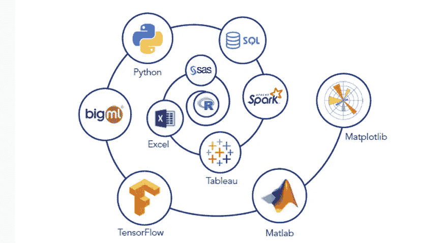
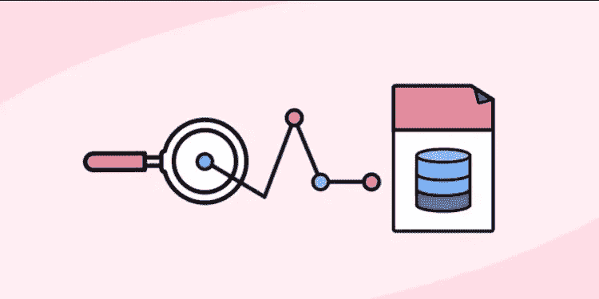
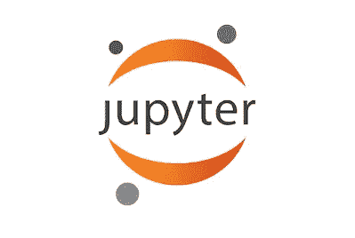
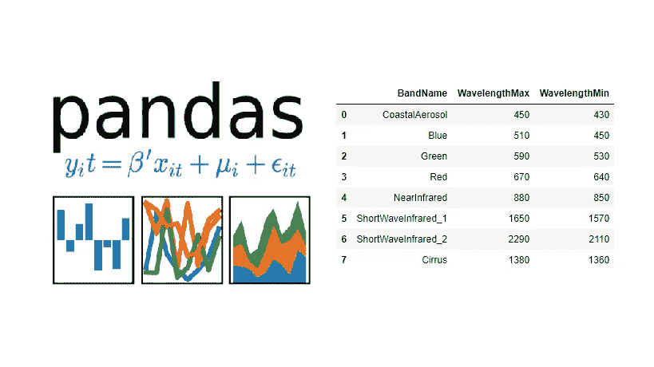
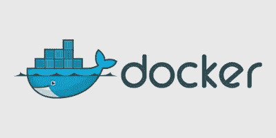
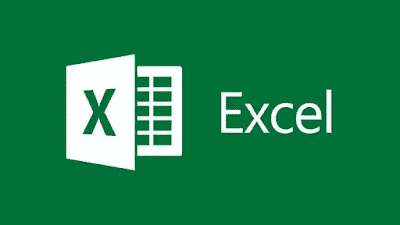
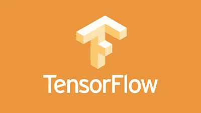
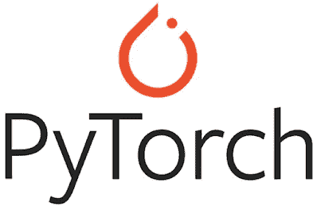
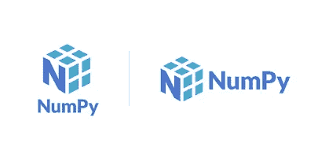
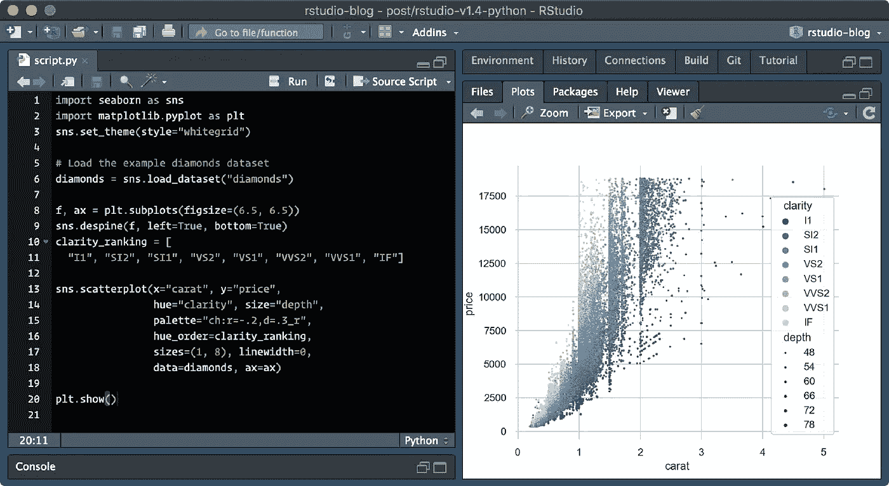

# 数据工程师和数据科学家应该在 2023 年学习的 10 大工具

> 原文：<https://medium.com/javarevisited/10-essential-tools-data-scientists-should-learn-in-2022-acbae6558643?source=collection_archive---------0----------------------->

## 这些是数据科学、数据分析和数据工程的基本工具，你可以通过学习在工作中变得更好

image_credit —教育性

大家好，如果你正在学习数据科学并寻找数据科学家应该知道的基本工具，那么你来对地方了。在过去，我已经分享了 [**最佳数据科学课程**](/javarevisited/my-favorite-data-science-and-machine-learning-courses-from-coursera-udemy-and-pluralsight-eafc73acc73f) 、[数据科学书籍](/javarevisited/6-best-python-books-for-data-science-and-machine-learning-in-2021-2f41d9fbf8be)和 [*最佳数据科学认证*](/javarevisited/is-courseras-ibm-data-science-professional-certification-worth-it-review-656e0b504fdf) ，在本文中，我将分享 2023 年你可以学习的最重要的数据科学工具。

工具对于专业开发人员来说非常重要，因为俗话说开发人员的能力取决于他们的工具，这意味着如果你想成为一名更好的专业人员，你应该学习你所在行业的工具，这在**数据科学**和[数据分析](https://becominghuman.ai/5-best-courses-to-learn-pythons-pandas-libary-for-data-analysis-and-data-science-34b62abb0e96)领域更加重要。

作为数据科学角色的一部分，您经常需要处理大量数据，还需要清理、整理和转换数据，然后需要可视化以获得洞察力。如果你不知道合适的工作工具，这是不可能的，这就是为什么数据科学家学习基本工具对他们的日常工作很重要。

前面已经分享了 [*程序员必备工具*](/javarevisited/10-tools-and-libraries-every-software-developers-should-learn-e05e636a5577) *s* 、 [*Java 开发者*](https://javarevisited.blogspot.com/2019/02/10-tools-advanced-java-developers-should-know.html#axzz5fnFWQ1EI) 、 [*Web 开发者*](https://javarevisited.blogspot.com/2021/06/10-tools-web-developers-should-learn-in.html) 前面和今天，我要分享一些数据科学家和机器学习有志者必备的工具。

如果你想在令人兴奋的数据科学和机器学习领域发展事业，那么这些工具可以帮助你的日常工作。

你很有可能已经熟悉了一些工具，如 [SQL](/javarevisited/top-5-sql-and-database-courses-to-learn-online-48424533ac61) 、Jupyter Notebook、[熊猫](https://javarevisited.blogspot.com/2019/10/top-5-courses-to-learn-pandas-for-data-analysis-python.html)和 [Tableau](/javarevisited/my-favorite-courses-to-learn-tableau-for-data-science-and-visualization-46623ba5b424) ，这很好，但掌握它们可以让你成为更好的数据科学家。

如果你没有听说过这些工具和技术，那么不要担心，我也分享了在线课程来学习这种*对数据科学和机器学习工程师*有用的工具。

# 数据科学家和机器学习开发者的 10 个最佳工具和技能

在不浪费你更多时间的情况下，这里有一些数据科学家和机器学习开发者应该在 2023 年学习的最佳工具。很可能你已经知道这些工具和技能，因为它们对于数据科学和数据分析是必不可少的，但如果你不知道，现在是学习它们的好时机。

顺便说一下，你不需要学习所有的工具，除非你真的想成为数据科学或机器学习的英雄，很可能你已经熟悉这些工具和库。所以，挑一个对你来说最重要的，先学习它，然后从第二个开始。

## 1.结构化查询语言

SQL 不仅是任何数据科学家的必备工具，也是任何程序员和技术人员如 IT 支持、QA、BA 和项目经理的必备工具。

如果您的数据存储在关系数据库中，如 [Oracle](/javarevisited/6-best-pl-sql-and-oracle-courses-for-beginners-to-learn-online-effd07d5fd2) 、 [Microsoft SQL Server](/javarevisited/5-best-courses-to-learn-microsoft-sql-server-in-depth-e9f11b73c14a?source=---------40----------------------------) 、 [MySQL](/javarevisited/top-5-courses-to-learn-mysql-in-2020-4ffada70656f) 、 [PostgreSQL](/javarevisited/7-best-free-postgresql-courses-for-beginners-to-learn-in-2021-3bf369d73794) ，甚至 SQLLite，那么学习 SQL 会让您的生活更轻松。

SQL 允许您从/向数据库中读取和写入数据，这是任何数据科学家和从事数据分析和可视化工作的人的日常任务。

至少，您应该熟悉 SELECT、UPDATE、DELETE 和 INSERT 命令以及基本的 SQL 概念，如 JOIN、聚合函数，如 COUNT、AVG、MAX、MIN、子查询，以及使用别名编写 SQL 查询。

如果你想在 2020 年学习 SQL，并且需要一个资源，那么我强烈推荐你在 Udemy 上查看一下何塞·波尔蒂利亚的完整的 SQL 训练营 课程。

## 2.Jupyter 笔记本

Jupyter Notebook 是数据科学家和人们在云上试验不同机器学习模型的另一个伟大工具。它不仅允许您从浏览器运行 Python 代码，还是与不同的数据科学家和团队成员协作的一个很好的工具。

如果你正在云中工作，并在那里创建你的*深度学习模型*，那么你可以使用 Jupyter Notebook 与数据科学家同事分享你的代码和实验。

我强烈推荐数据科学家学习 Jupyter 笔记本，以便有效地与其他团队成员协作，如果您需要资源，请查看此[**Python A-Z:Python For Data Science With Real exercise！**](https://click.linksynergy.com/deeplink?id=JVFxdTr9V80&mid=39197&murl=https%3A%2F%2Fwww.udemy.com%2Fcourse%2Fpython-coding%2F) 这将教你如何在 Jupytor 笔记本上编码。

## 3.熊猫

这是一个在处理数据时必不可少的 Python 库。它经常被吹捧为数据科学家 [*必读的 Python 库*](https://becominghuman.ai/10-free-courses-to-learn-python-machine-learning-libraries-scikit-learn-numpy-pandas-keras-3c77ba1a6907?source=---------13------------------) ，因为它为您提供了处理原始数据的所有工具。

因为数据是任何数据科学项目的中心，所以您经常会得到不适合任何分析的原始数据。

为了分析和可视化数据，你首先需要做清理和归一化，熊猫可以帮你做到。这就像 SQL 与类固醇和完美的，如果你玩的数据存储在文件，如 CSV 转储。

我强烈推荐数据科学家学习熊猫，如果你需要资源，可以从 Udemy 上 Boris Paskhaver 的 [**熊猫和 Python 数据分析课程**](https://click.linksynergy.com/deeplink?id=JVFxdTr9V80&mid=39197&murl=https%3A%2F%2Fwww.udemy.com%2Fcourse%2Fdata-analysis-with-pandas%2F) 开始。你可以在优购上花 9.9 美元买到这门课程。

## 4.码头工人

就像 SQL 一样，Docker 是另一个工具，它不仅对数据科学家有用，而且对任何类型的开发人员都有用。它允许你构建你的应用程序，并放在一个容器中，这个容器包含了你的应用程序运行所需的一切，从操作系统到运行时，比如 [Java](/javarevisited/top-5-java-online-courses-for-beginners-best-of-lot-1e1e240a758) ，[。NET](/javarevisited/7-best-online-courses-to-learn-asp-net-core-and-mvc-in-depth-a68c1b728090) 和 [NodeJS](/javarevisited/top-10-online-courses-to-learn-node-js-in-depth-8ef0e31ca139) 拥有你的程序需要运行的各种第三方库。

通过学习 Docker，数据科学家可以轻松地与其他数据科学家分享他们的应用程序和代码，无论有无数据。

如果你想成为一名更好的开发人员，我强烈建议你学习 Docker，如果你需要资源，AcadMind 和 Maximillian Schwarzmuller 的《Docker Kubernetes:实用指南》是一个很好的起点。

## 5.微软优越试算表

XLS 或微软 Excel 可能是最古老和最流行的数据分析工具。它不仅允许你存储和过滤数据，还可以用不同的图表来显示数据。它通常是交易员、项目经理以及现在的数据科学家的首选工具。

它不是为处理像 [Pandas](https://javarevisited.blogspot.com/2021/11/top-5-free-pandas-courses-for-beginners.html) 或甚至 [SQL](https://www.java67.com/2021/10/5-best-udemy-courses-to-learn-sql-and-database-.html) 这样的大量数据而设计的，但它确实非常适合处理有限的数据集。我向数据科学家和任何需要处理原始数据和规范化数据的程序员强烈推荐 Microsoft Excel。

如果你需要资源那么你可以查看这本 [**微软 Excel — Excel 从初级到高级课程**](https://click.linksynergy.com/deeplink?id=JVFxdTr9V80&mid=39197&murl=https%3A%2F%2Fwww.udemy.com%2Fcourse%2Fmicrosoft-excel-2013-from-beginner-to-advanced-and-beyond%2F) 凯尔皮尤 2023 年从零开始学习 Excel。

## 6.张量流

这是另一个受数据科学家和机器学习爱好者欢迎的 Python 库。由谷歌开发的 [TensorFlow](/@javinpaul/top-10-courses-to-learn-tensorflow-for-machine-learning-in-2020-39a31e7cd84b) 用于构建简单和复杂的深度学习模型。

它在人工智能领域非常受欢迎，因为它允许机器学习开发者创建具有许多层的大规模神经网络。张量流主要用于分类、感知、理解、发现、预测和创造。对于任何严肃的数据科学家和机器学习开发者来说，这是一个必须知道的库，你应该花一些时间来掌握它。如果你需要资源，我推荐去看看 Udemy 上懒人程序员团队的 [**Tensorflow 2.0:深度学习与人工智能课程**](https://click.linksynergy.com/deeplink?id=JVFxdTr9V80&mid=39197&murl=https%3A%2F%2Fwww.udemy.com%2Fcourse%2Fdeep-learning-tensorflow-2%2F) 。

## 7.Pytorch

与 TensorFlow 类似，PyTorch 是另一个用于创建神经网络模型的免费开源机器学习库。由脸书人工智能研究实验室(FAIR)开发的 [Pytorch](/javarevisited/5-best-pytorch-and-keras-courses-for-deep-learning-in-2021-c9ba377b1170) 被大量用于计算机视觉和自然语言处理等应用。如果您不知道是否应该学习 PyTorch 或 TensorFlow，让我告诉您 Tensorflow 对于生产模型和可伸缩性来说更好。它是为生产准备的，并通过了大量谷歌数据的压力测试。

另一方面，PyTorch 更容易学习，也更容易使用，因此，相对更适合激情项目和快速构建原型。如果你想学习 PyTorch 并需要资源，那么你可以在 Udemy 上查看懒惰程序员的这个 [**PyTorch:深度学习和人工智能**](https://click.linksynergy.com/deeplink?id=JVFxdTr9V80&mid=39197&murl=https%3A%2F%2Fwww.udemy.com%2Fcourse%2Fpytorch-deep-learning%2F) 课程。

## 8.NumPy

这是另一个对数据科学和开发者有用的 Python 库。NumPy 提供了一个高性能的多维数组对象和工具来处理这些数组。这是用 [Python](/javarevisited/10-best-python-3-courses-on-udemy-ddd4e3ec5dbf) 进行科学计算的基础包，从它的名字就可以看出这一点。

如我所说，它提供了多维数组和矩阵，以及对这些数组进行操作的大量高级数学函数集合。

这对任何数据科学家来说都是必不可少的，你应该学习它。如果你需要一个资源，请看这个 [**深度学习必备:Udemy 上懒人程序员的 Python 中的 Numpy 栈(V2+)**](https://click.linksynergy.com/deeplink?id=JVFxdTr9V80&mid=39197&murl=https%3A%2F%2Fwww.udemy.com%2Fcourse%2Fdeep-learning-prerequisites-the-numpy-stack-in-python%2F) 课程。

## 9.（舞台上由人扮的）静态画面

Tableau 是商业智能行业中使用的一种功能强大且发展最快的数据可视化工具。它有助于将原始数据简化为非常容易理解的格式。

使用 [Tableau](https://javarevisited.blogspot.com/2019/07/top-5-tableau-online-courses-and-certifications-for-data-science-engineers.html) 可以非常快速地进行数据分析，并且以仪表板和工作表的形式创建可视化效果。

如果你想提高你的数据可视化技能，那么在 2023 年学习 Tableau 是前进的最佳方式，如果你需要资源，我强烈推荐这个由基里尔·叶列缅科和他的超级数据科学团队在 Udemy 上举办的 [**Tableau 训练营课程**](https://click.linksynergy.com/deeplink?id=JVFxdTr9V80&mid=39197&murl=https%3A%2F%2Fwww.udemy.com%2Fcourse%2Ftableau10%2F) ，在 2023 年从头开始学习 Tableau。

## 10.r 工作室

Python 是数据科学领域最流行的编程语言，大多数数据科学家都用它来进行数据分析，而 R 是另一种非常适合统计计算的编程语言。如果你正在学习 R ,那么你也应该花些时间学习 R studio，这是一款面向 R 程序员的流行工具。

RStudio 是 R 的集成开发环境(IDE ),有两种格式:RStudio Desktop 是常规的桌面应用程序，而 RStudio Server 运行在远程服务器上，允许使用 web 浏览器访问 R Studio。

如果你想在 2020 年学习 RStudio，那么你可以查看[**R Programming A-Z:R For Data Science 的真实练习！**](https://click.linksynergy.com/deeplink?id=JVFxdTr9V80&mid=39197&murl=https%3A%2F%2Fwww.udemy.com%2Fcourse%2Fr-programming%2F) 课程由基里尔·叶列缅科在 Udemy 上讲解。这是一个 10.5 小时的课程，学习 R 和 RStudio 的一切，你可以在 Udemy sales 上只花 10 美元购买。

以上是关于数据科学和机器学习开发者的一些**最佳工具。**我强烈建议你掌握这些工具，它们将帮助你的日常工作，如数据清理、按摩、数据转换、数据可视化、与其他数据科学家分享数据科学实验，以及训练模式和图像识别的神经网络。

其他文章**程序员和数据科学家**可能喜欢

*   [初学者学习数据科学的 10 门课程](https://hackernoon.com/10-machine-learning-data-science-and-deep-learning-courses-for-programmers-7edc56078cde)
*   [为什么 Python 是数据科学的最佳编程语言](https://javarevisited.blogspot.com/2020/05/why-python-is-best-programming-language.html)
*   [使用 Python 和 AI 构建聊天机器人的 5 大课程](https://javarevisited.blogspot.com/2019/12/want-to-build-chat-bots-using-ai.html)
*   [面向数据科学和机器学习的 8 大 Python 库](https://javarevisited.blogspot.com/2018/10/top-8-python-libraries-for-data-science-machine-learning.html)
*   [面向数据科学家的 10 大 TensorFlow 课程](https://dev.to/javinpaul/10-of-the-best-tensorflow-courses-to-learn-machine-learning-from-coursera-and-udemy-37bf)
*   [学习熊猫数据分析的 5 大课程](https://javarevisited.blogspot.com/2019/10/top-5-courses-to-learn-pandas-for-data-analysis-python.html)
*   [面向程序员的 10 门机器学习和深度学习课程](https://hackernoon.com/top-5-courses-to-learn-python-in-2018-best-of-lot-26644a99e7ec)
*   [学习数据科学数学和统计的 5 门课程](https://javarevisited.blogspot.com/2019/09/top-5-statistics-and-mathematics-course-for-data-science.html)
*   [学习数据科学 Python 的 5 本书](https://javarevisited.blogspot.com/2019/08/top-5-python-books-for-data-science-and-machine-learning.html)
*   [10 张 Coursera 证书开启云计算和数据科学职业生涯](/javarevisited/top-10-coursera-certificates-to-start-your-career-in-cloud-data-science-ai-mainframe-and-it-558690c83587)
*   [学习机器学习的 5 大免费课程](https://www.java67.com/2019/01/5-free-courses-to-learn-machine-and-deep-learning-in-2019.html)
*   [最佳课程数据分析和数据科学课程](https://javarevisited.blogspot.com/2020/08/top-10-coursera-certifications-to-learn-Data-Science-Visualization-and-Data-Analysis.html)

非常感谢您阅读这篇文章。如果您发现这些最佳工具对您的数据科学、分析和可视化工作有用，请与您的朋友和同事分享。如果您有任何问题或反馈，请留言。

页（page 的缩写）如果你是数据科学、数据分析和机器学习领域的新手，并且需要资源来开始学习数据科学，那么你也可以查看 Coursera 和约翰霍普金斯大学的这些 [**最佳数据科学课程，这是 2023 年学习数据分析和数据科学的最佳平台之一。**](/javarevisited/11-best-coursera-certifications-and-courses-for-data-science-and-analysis-in-2021-65ce1ac810a5)

 [## Coursera 和约翰霍普金斯大学 2023 年排名前五的数据科学课程和认证-最佳…

### 你好，伙计们，如果你想在数据科学和机器学习领域开始职业生涯，并寻找最好的…

javarevisited.blogspot.com](https://javarevisited.blogspot.com/2021/05/best-johns-hopkins-courses-for-data-science-coursera.html)