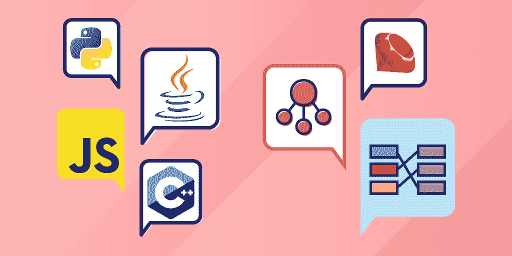
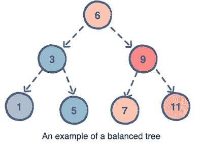
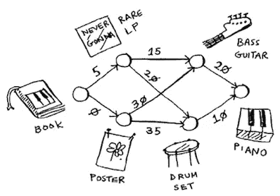
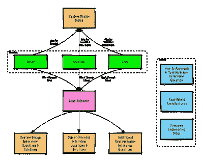
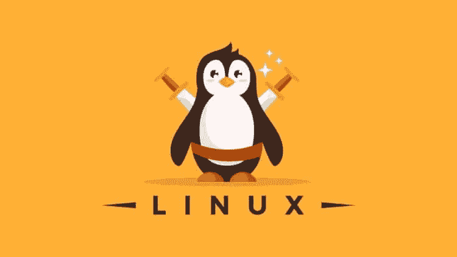
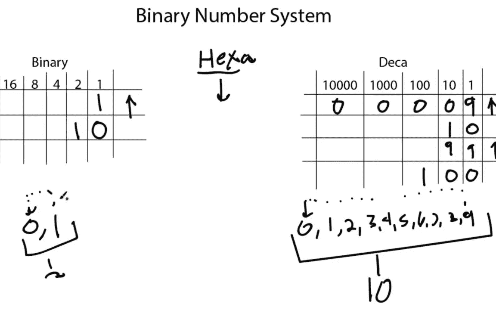
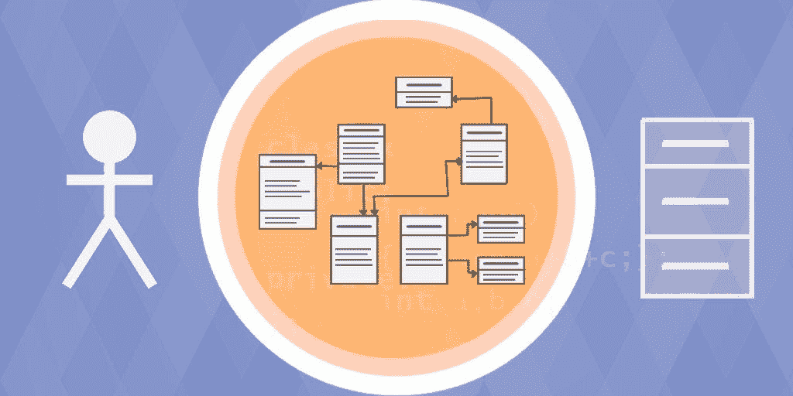
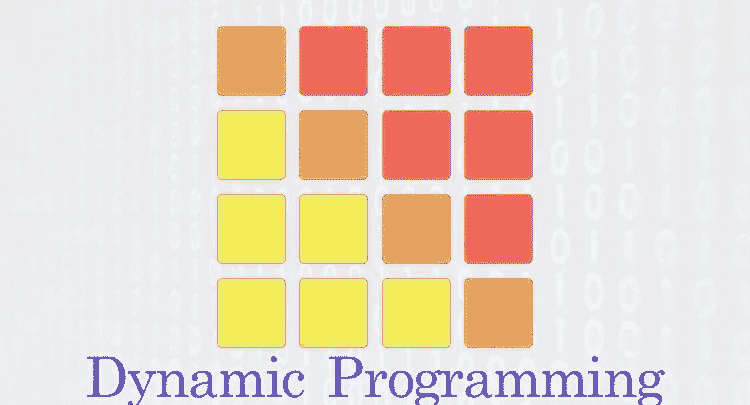
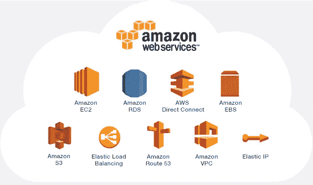

# 你可以为 2023 年的编码和编程工作面试准备的 10 个基本话题

> 原文：<https://medium.com/javarevisited/10-essential-topics-and-resources-for-coding-and-programm-job-interviews-4017cac3a522?source=collection_archive---------0----------------------->

## 列出了你在编程工作面试中需要的基本话题和技能，以及学习它们的资源。

image_source —教育性

伙计们，毫无疑问，破解编程工作面试并不容易，如果你想破解谷歌、微软和亚马逊等科技公司的编程面试就更难了，但你仍然可以通过仔细规划和准备最重要的基本主题来破解，如[数据结构和算法](/javarevisited/50-data-structure-and-algorithms-interview-questions-for-programmers-b4b1ac61f5b0)、[系统设计](/javarevisited/25-software-design-interview-questions-to-crack-any-programming-and-technical-interviews-4b8237942db0)、[多线程和并发性](/javarevisited/8-best-multithreading-and-concurrency-courses-for-experienced-java-developers-8acfd3b25094)、 [SQL 和数据库设计](/hackernoon/top-5-sql-and-database-courses-to-learn-online-48424533ac61)、OOP、Linux 概念、计算机网络，当然还有努力提高你的**解决问题的技能**

**作为 [Java 的作者和编程博客](http://javarevisited.blogspot.com/)的作者，我经常收到关于**如何准备编码面试的询问？** *如何通过谷歌或微软的软件开发人员面试？*或者我怎样才能在亚马逊或脸书上找到软件开发的工作？

在脸书和 LinkedIn 上逐一回答了我的许多读者后，我想整理出一份*编码面试的基本主题清单*。这份清单将为你准备任何科技公司的面试提供一个良好的开端，比如谷歌和亚马逊。然而，即使你不是针对谷歌，只是想要一份软件开发人员的工作，你仍然可以准备这些主题。事实上，为谷歌、亚马逊、苹果和脸书这样的科技巨头做准备意味着你远远领先于其他候选人，你很可能会获得许多小公司、创业公司和投资银行的工作机会。这就是为什么我建议瞄准更高的目标，因为即使你没有得到你想要的，你仍然会得到许多程序员想要的工作机会。

另一个需要注意的关键是，不同的面试需要不同的技巧。比如，当你去参加一个 [**Java 开发者面试**](https://javarevisited.blogspot.com/2020/04/top-10-courses-to-crack-java-programming-interviews.html) **，**你必然会了解 Java。同样，对于一个 Python 开发者面试来说，期望你了解 Python 和一些流行的 Python 框架，比如[**Django**](https://javarevisited.blogspot.com/2019/04/top-5-python-web-development-frameworks.html)**和 [Flask](https://javarevisited.blogspot.com/2020/01/top-5-courses-to-learn-flask-for-web-development-with-python.html) 。

对于一个 web 开发人员来说， [HTML](/javarevisited/10-best-html-and-css-courses-for-beginners-in-2021-6757eec00032) 、 [CSS](/javarevisited/10-best-css-online-courses-for-beginners-and-experienced-developers-54aa2e8c0253) 和 [JavaScript](/javarevisited/10-best-online-courses-to-learn-javascript-in-2020-af5ed0801645) 是核心技能，除了现代 Web 开发框架如[**【Angular】**](https://javarevisited.blogspot.com/2018/06/5-best-courses-to-learn-angular.html)、 [React](https://javarevisited.blogspot.com/2018/08/top-5-react-js-and-redux-courses-to-learn-online.html#axzz5r06B3egD) 和 [Vue.js](https://javarevisited.blogspot.com/2019/08/top-5-online-courses-to-learn-vue.js-best.html) 之外，还有一点 [node.js](/javarevisited/7-free-courses-to-learn-node-js-in-2020-2f1dd6722b49?source=---------10------------------) 。我不会触及这个话题，但我会分享通过所有这些面试所需的基本技能。它们也被称为核心编程技能，每个软件开发人员都应该知道这一点。****

# ****你应该为编码和编程面试准备的 10 个主题****

****无论如何，不要再浪费你的时间了，这里是我的主题列表，你可以准备一下，以增加你在谷歌、亚马逊和微软编程工作面试中的机会。****

## ****1.数据结构****

****作为一名程序员，如果你不能使用 [Django](https://javarevisited.blogspot.com/2020/07/top-5-courses-to-learn-django-in-2020.html) 或 [React，](https://javarevisited.blogspot.com/2018/08/top-5-react-js-and-redux-courses-to-learn-online.html#axzz5r06B3egD)编写 web 应用程序，这是可以的，但如果你不知道哈希表如何工作以及何时使用列表而不是数组，这就不好了？还有，**B 树比数组有什么优势？**数据结构和算法是计算机科学和程序设计的核心，每个软件开发人员都应该具备扎实的数据结构基础知识。为了编写用户喜欢的健壮、高性能的应用程序，必须对数据结构有很好的理解。想象一下，如果脸书或谷歌花 1 分钟让你登录，你永远不会去那里，忘记他们有多重要。性能是至关重要的，除非你了解你的程序是如何工作的，你的数据是如何存储的，否则你将一事无成。

在 [*技术面试*](/hackernoon/10-data-structure-algorithms-and-programming-courses-to-crack-any-coding-interview-e1c50b30b927) 中，会要求你针对时间和空间优化你的解决方案。除非您对代码的工作方式以及数据的存储和访问方式有着深刻的理解，否则您无法做到这一点。

这可能是编码面试最重要的话题，你要好好准备。****

****最起码，你应该知道[数组](https://javarevisited.blogspot.com/2015/06/top-20-array-interview-questions-and-answers.html#axzz5dCg1cNYo)、[链表](https://javarevisited.blogspot.com/2017/07/top-10-linked-list-coding-questions-and.html)、[二叉树](https://www.java67.com/2020/02/top-40-binary-tree-interview-questions.html)、二叉查找树、自平衡树，如 AVL 树、哈希表(或 Java 和 Python 中已知的映射或字典)、堆栈、队列和图。

你应该了解如何从这些数据结构中存储和访问元素，以及所涉及的计算成本。您还应该对何时使用特定的数据结构(如快速搜索数组)进行比较分析，哈希表更好。尽管如此，对于更快的添加和删除，链表将优于数组。如果你需要资源来提高速度，我建议你选择一门数据结构课程，其中的例子用你最熟悉的语言来展示。对于 Java devs，我推荐 [**数据结构与算法:Java**](https://click.linksynergy.com/fs-bin/click?id=JVFxdTr9V80&subid=0&offerid=323058.1&type=10&tmpid=14538&RD_PARM1=https%3A%2F%2Fwww.udemy.com%2Fdata-structures-and-algorithms-deep-dive-using-java%2F) 中的深潜，对于 Python devs，我推荐 Udemy 上 Python 课程中的算法与数据结构。你可以在这里查看课程。****

********

## ****2.算法****

****虽然了解数组、链表和 tres 等基本数据结构很重要，但学习如何使用这些数据结构也同样重要。如果你不知道线性搜索和二分搜索法算法的区别，不知道在`O(log n)`和`O(n²)`中运行意味着什么，你需要花一些时间学习算法。

这可能就是一个微调过的应用程序和一个缓慢的、蹩脚的进程之间的区别，这个进程挂起的次数比它工作的次数多。至少，你应该知道排序算法，比如[快速排序](https://javarevisited.blogspot.com/2014/08/quicksort-sorting-algorithm-in-java-in-place-example.html)、[合并排序](https://www.java67.com/2018/03/mergesort-in-java-algorithm-example-and.html)、堆排序等等。像二分搜索法这样的搜索算法，以及一些图形算法，如最快路线查找算法，这些算法是许多送货和打车应用程序(如优步、Grab 和 Ola)的基础。你还应该理解你用来排序数组的库方法是如何工作的，它内部使用哪种算法，以及什么时候不同的算法会做得更好。

强烈建议你深入准备这个题目。如果你需要一个资源，Thomas H. Cormen 的《 [**算法入门》，**](http://www.amazon.com/dp/0072970545/?tag=javamysqlanta-20) 是最值得推荐的资源，但它不适合胆小的人。对于不那么吓人的条目，我会推荐 Aditya Bhargava 的 [**搜索算法**](https://www.amazon.com/Grokking-Algorithms-illustrated-programmers-curious/dp/1617292230/?tag=javamysqlanta-20) 书和 Coursera 上的算法课程。****

********

## ****3.系统设计****

****这是你需要为编程工作面试做好准备的另一个重要话题，尤其是在大型科技公司，比如谷歌、T2、微软、T4、亚马逊和脸书。你需要对如何设计你的解决方案有一些想法，从架构到编码。

系统设计其实非常庞大。从高层次来说，它涵盖了软件架构等内容，我指的是单片和微服务架构之间的优势，以及在 NoSQL 和 SQL 数据库之间的选择。它涵盖了我们将如何设计一个可以处理 10000 个并发用户的应用程序。并包括可伸缩性等内容。****

****这里有一些你应该知道的基本系统设计概念:****

1.  ****负载平衡****
2.  ****贮藏****
3.  ****数据划分****
4.  ****指数****
5.  ****委托书****
6.  ****冗余和复制****
7.  ****SQL 与 NoSQL****
8.  ****分布式系统****

****在较低的层次上，它涵盖了面向对象的编程和设计，其中谈到了设计您的类及其关系，遵循良好的编码实践，以及软件设计原则，如 SOLID。****

****正因为如此，许多候选人努力回答系统设计问题，如果你想成功，你必须特别强调这一技能。****

****如果你需要资源，我建议你查看关于 Educative 的 [**系统设计面试**](https://www.educative.io/collection/5668639101419520/5649050225344512?affiliate_id=5073518643380224) 课程，这是由那些科技公司的招聘经理准备的，它还会带你了解常见的系统设计面试问题。****

********

## ****4.多线程和并发****

****并发性是雇主最想要的技能之一，也是面试中最热门的话题之一。因为它显示了你设计一个能有效利用资源的程序的能力，但同时这也是一个很难掌握的话题，这也是面试官喜欢它的原因。****

****并发性可以用来衡量你的专业知识和技术深度，通常是你整体招聘水平的一个关键决定因素。无论你是刚刚开始职业生涯还是想换工作，花点时间掌握并发性都没什么坏处。至少，您应该了解线程、进程、共享内存、监视器、锁、*临界区*和延迟回调。了解如何避免[竞争条件](http://javarevisited.blogspot.sg/2012/02/what-is-race-condition-in.html#axzz59AbkWuk9)和[死锁](/hackernoon/how-to-avoid-a-deadlock-while-writing-concurrent-programs-java-example-988bb07db25f)会更好。

练习经典的并发性面试问题，如[生产者-消费者](https://www.java67.com/2012/12/producer-consumer-problem-with-wait-and-notify-example.html)、用餐哲学家等，也可以教会你很多关于并发性和多线程的知识，让你有信心想象多线程并行运行时代码和数据是如何工作的。如果你有一个面试，那么我强烈建议你加倍关注并发性。这是因为我知道这可能是大多数面试中提出的最具挑战性的话题之一，即使对于有经验的开发人员也是如此。然而，掌握并发性将使你比其他候选人有相当大的优势。

如果你需要资源，强烈建议你去看看 C.H. Afzal 关于 Educative 的 [**多线程与并发面试问题**](https://www.educative.io/courses/java-multithreading-for-senior-engineering-interviews?affiliate_id=5073518643380224) 。本课程包含用 Python、Java、C#和 Ruby 解决的最常见的并发面试问题。仔细阅读这些问题会让你对并发和多线程有一个很好的了解。****

********

## ****5.数据库设计和 SQL****

****作为一名软件开发人员，使用关系数据库是你需要的一项关键技能，无论你处于职业生涯的哪个阶段，这项技能都会伴随着你。从小到大每个公司都用一个 DBMS，所以很可能你会遇到不同的数据模型，类型 so 数据库( [NoSQL](/javarevisited/5-best-mongodb-courses-to-learn-nosql-for-beginners-in-2020-42df5af5496c) 和 [SQL](https://www.java67.com/2018/02/5-free-database-and-sql-query-courses-programmers.html) )，以及对各个公司的依赖。

知道如何在数据库管理系统中构建数据至关重要。你应该使用实体关系(ER)模型吗？分层模型？三模式架构？****

****这些选择可能会令人生畏，但了解不同的数据组织方式是有好处的，因为当您从 [Oracle](/javarevisited/top-10-free-courses-to-learn-microsoft-sql-server-and-oracle-database-in-2020-6708afcf4ad7) 转换到 [SQL Server](/javarevisited/5-best-courses-to-learn-microsoft-sql-server-in-depth-e9f11b73c14a) 或 [PostgreSQL](/javarevisited/7-best-free-postgresql-courses-for-beginners-to-learn-in-2021-3bf369d73794) 等数据库供应商时，您可以通过最少的手工编码来插入。

作为一名程序员，你还应该了解 SQL，不仅仅是语法，还有数据库实际上如何运行你的查询，如何执行连接，如何使用索引，以及表扫描、索引扫描和索引查找之间的区别。这些细节不仅对编码面试很重要，对日常工作也很重要。

如果你需要资源，我建议你通读一下 [**【软件工程师数据库设计基础】**](https://www.educative.io/courses/database-design-fundamentals?affiliate_id=5073518643380224) ，在那里你会学到不同的概念和技术，你可以用它们来组织你的数据，并探索为什么你应该用特定的方法来解决某些问题。****

********

****您还将接触到标准化等技术，这些技术有助于提高数据库的效率，并避免重复。我还建议你参加一个以 SQL 为中心的课程，比如何塞·波尔蒂利亚在 Udemy 上的 [**完整的 SQL 训练营**](https://click.linksynergy.com/deeplink?id=JVFxdTr9V80&mid=39197&murl=https%3A%2F%2Fwww.udemy.com%2Fcourse%2Fthe-complete-sql-bootcamp%2F) ，因为 SQL 查询和数据库设计一样，也是编码面试的重要部分。****

****<https://click.linksynergy.com/deeplink?id=JVFxdTr9V80&mid=39197&murl=https%3A%2F%2Fwww.udemy.com%2Fcourse%2Fthe-complete-sql-bootcamp%2F>  

我还建议阅读 Markus Winand 所著的《SQL 性能解释》 一书，以更好地理解 SQL 查询的一般工作原理。**** 

## ****6.Linux 命令和概念****

****Linux 是世界上最流行的服务器端应用程序操作系统，大多数尖端解决方案都运行在 Linux 上，这就是为什么知道如何在 Linux 机器上工作非常重要。****

****虽然编程面试不太关注 Linux，除非你是为了 IT 支持或者 [DevOps](/javarevisited/top-10-courses-to-learn-devops-for-experienced-programmers-d93b666db151) 面试，但是学习基本的 Linux 概念和命令总是很棒的。****

****至少，您知道如何在 Linux 中找到文件，如何检查进程状态，编写简单的 bash 脚本，找到进程并杀死它。像 Linux 如何引导、文件和目录、权限等概念也很重要。****

****如果你在 Linux 工作过，那么你可以很容易地回答这些问题，但是如果你需要一个复习课程，那么我推荐你参加 Udemy 上的 [**Linux 掌握:在 11.5 小时的**](https://click.linksynergy.com/deeplink?id=JVFxdTr9V80&mid=39197&murl=https%3A%2F%2Fwww.udemy.com%2Fcourse%2Flinux-mastery%2F) 课程中掌握 Linux 命令行。这是一个非常有趣的课程，可以快速学习基本的 Linux 命令。****

********

## ****7.计算机科学基础****

****这是另一个被许多程序员忽略的重要话题，但是你可以准备好它来获得一些竞争优势。像谷歌、亚马逊和脸书这样的公司专注于雇佣懂得基本原理的人才，比如计算机内部如何工作。****

****你还应该知道比特和字节的转换，二进制和十进制，存储，不同的 CPU 架构，以及 CPU 和内存如何协同工作。****

****虽然这些对你们中的一些人来说似乎很不相关，但老实说，它们非常非常重要，如果你很好地了解它们，那么你就可以思考更好的解决方案，解决复杂的问题。****

****如果你需要进修课程，我强烈推荐你加入 Udemy 上的 [**计算机科学 101:掌握编程背后的理论**](https://click.linksynergy.com/deeplink?id=JVFxdTr9V80&mid=39197&murl=https%3A%2F%2Fwww.udemy.com%2Fcourse%2Fcomputer-science-101-master-the-theory-behind-programming%2F) 。这是一门学习二进制和十进制以及其他计算机基础知识的好课程。****

********

## ****8.计算机网络****

****除了计算机科学基础知识之外，你可以好好准备的另一个话题是计算机网络。最起码，你应该了解基本的协议，比如 HTTP、FTP、SSH、TCP、UDP 等。****

****以下是您可以在计算机网络上准备的主题:****

*   ****计算机网络如何工作****
*   ****网络拓扑****
*   ****网络设备和布线****
*   ****OSI 和 TCP/IP 模型****
*   ****IP 寻址和子网划分****
*   ****交换机和路由器****
*   ****无线网络****
*   ****网络安全性****
*   ****网络规划和设计流程****

****对于 IT 专业人员来说，不需要学习实现级的细节，只需要知道概念和它们做什么就很重要了。如果你需要进修课程，我建议你参加面向非技术人员的<https://click.linksynergy.com/deeplink?id=JVFxdTr9V80&mid=39197&murl=https%3A%2F%2Fwww.udemy.com%2Fcourse%2Fintroduction-to-computer-networks%2F>**计算机网络入门，这对技术人员和非技术人员都很好。******

************

## ******9.面向对象编程[OOP 概念]******

******面向对象的编程概念，也称为 OOP 概念，是你应该为编程工作面试准备的另一个重要话题。至少你应该熟悉 OOP 的构建模块，比如******

1.  ******抽象******
2.  ******多态性******
3.  ******包装******
4.  ******遗产******
5.  ******作文******
6.  ******类别和对象******

******以及一些棘手的概念，如重载、覆盖、虚拟调度、委托，以及如何将现实世界的对象建模到 OOP 中。******

******您还可以花一些时间了解面向对象的分析和设计(OOAD ),这是一个使用 OOP 解决复杂问题并创建类、对象和定义它们之间关系的过程。******

******如果你需要面向对象设计和分析的资源，我推荐[头一本面向对象设计](http://www.amazon.com/dp/0596008678/?tag=javamysqlanta-20)书来学习基础知识和 [**探索面向对象面试**](https://www.educative.io/collection/5668639101419520/5692201761767424?affiliate_id=5073518643380224) 课程来进行一些实践。******

********

****我在这篇文章中推荐了几个教育性的课程，因为它们非常适合编写面试代码。你既可以单独购买，也可以考虑购买 [**教育订阅**](https://www.educative.io/subscription?affiliate_id=5073518643380224) ，只需 **$14.9** 就可以获得他们 100 多门互动课程，这是你为准备编码面试所能做的最好投资。****

****<https://www.educative.io/subscription?affiliate_id=5073518643380224> **** 

## ****10.动态规划****

****虽然大多数人将[动态编程](/javarevisited/6-best-dynamic-programming-courses-for-coding-interviews-14744060923c)作为算法的一部分，但我将它作为一个单独的主题提及，因为它是一个艰难且具有挑战性的主题，许多程序员没有为这个主题做好准备。****

****[*动态编程(DP)问题*](/javarevisited/20-dynamic-programming-interview-questions-with-solutions-2a144b1a1e07) s 可能是编码面试中最令人生畏的。即使实际上很清楚一个问题是否可以使用 DP 来解决(这种情况很少发生)，甚至知道从哪里开始解决也是相当具有挑战性的。除非你接受了解决 DP 问题的方法培训。****

****在最近的编码访谈中，我也至少看到了一个来自动态编程的问题，这促使我特别强调这个主题。****

****我建议至少解决[常见的动态规划问题](https://javarevisited.blogspot.com/2021/03/top-dynamic-programming-problems-for-coding-interviews.html#axzz6rtXMHF8g)，比如背包模式、斐波那契数列，以及更多的问题，以学习如何识别一个问题是否可以用动态规划来解决，以及如何处理它们。****

****如果你需要资源，我建议你在 Udemy 上查看 [**【掌握动态编程的艺术】**](https://click.linksynergy.com/deeplink?id=JVFxdTr9V80&mid=39197&murl=https%3A%2F%2Fwww.udemy.com%2Fcourse%2Fmaster-the-art-of-dynamic-programming%2F) 。这是一个很好的小课程，你不仅会学到动态编程，还会学到递归和回溯来解决复杂的问题。****

********

## ****10.AWS、Docker 和 Kubernetes[额外主题]****

****虽然这五项技能绝对是编写面试代码的必备技能，但如今雇主也在寻找像 AWS、Docker 和 Kubernetes 这样的现代技术技能，这使得它们成为技术面试的重要主题。

由于云计算是下一个大事件，并且这十年的软件开发将是云原生的，软件开发人员最好了解云和现代部署工具，如[**Docker**](https://javarevisited.blogspot.com/2018/02/10-free-docker-container-courses-for-Java-Developers.html)**和 [**Kubernetes**](https://javarevisited.blogspot.com/2019/05/top-5-courses-to-learn-docker-and-kubernetes-for-devops.html) 。如果你想保持领先，给你的雇主一个雇用你而不是下一个候选人的理由，这也很重要。******

****对于 AWS 和 Cloud 来说，你可以做的另一件事就是获得认证，不是因为没有认证就找不到工作，而是为了更好地学习，并获得对你技能的认可。

对于 AWS 来说，我建议你至少有一个 [**AWS 云从业者认证**](https://click.linksynergy.com/deeplink?id=JVFxdTr9V80&mid=39197&murl=https%3A%2F%2Fwww.udemy.com%2Fcourse%2Faws-certified-developer-associate-dva-c01%2F) 来展示必要的云技能，而如果你更喜欢微软 Azure，那么 Azure Fundamentals([**AZ-900**](https://javarevisited.blogspot.com/2020/02/top-5-courses-to-crack-az-900-microsoft-azure-fundamentals-certification-exam.html))是一个很好的入门认证。****

********

****Docker 是一个容器，它允许您将应用程序作为一个整体来运行，以及所有的依赖项。这使得开发和部署更加容易，特别是对于[微服务](/javarevisited/top-5-courses-to-learn-microservices-in-java-and-spring-framework-e9fed1ba804d)。因为容器使得云部署更易于管理，所以管理者也更容易扩展和缩减。

[Kubernetes](https://javarevisited.blogspot.com/2020/06/top-5-courses-to-learn-kubernetes-for-devops-and-certification.html) 是一个容器编排工具，这意味着它可以大规模使用管理器容器。部署和管理几个容器很容易，但当您必须为 Amazon prime Sale 这样的促销活动部署数百个容器，然后需要在流量恢复正常后将其拆除时，就不容易了。Kubernetes 可以为您做到这一点，并提供自动化和安心。虽然 Docker 和 Kubernetes 都不是程序员的必备技能，但从工作的角度来看却是必不可少的。我推荐每一个软件开发人员或有抱负的程序员学习 Docker 和 Kubernetes，如果你需要资源，Stephen Grider 在 Udemy 上的在线课程 [**Docker 和 Kubernetes:完整指南**](https://click.linksynergy.com/deeplink?id=JVFxdTr9V80&mid=39197&murl=https%3A%2F%2Fwww.udemy.com%2Fdocker-and-kubernetes-the-complete-guide%2F) 是一个很好的起点。****

********

****这就是你为破解谷歌、微软、苹果、脸书和亚马逊等公司的编程和编码面试准备的一些最重要的话题。除了这些主题，我还列出了一些最好的书籍和课程，你可以用来学习这些技能，为下一次编码面试做更好的准备。

**其他你可能喜欢的编程和 Java 文章******

*   ****[2023 年破解编码面试 10 门课程](https://javarevisited.blogspot.com/2018/02/10-courses-to-prepare-for-programming-job-interviews.html#axzz5oeVu3CYQ)****
*   ****[10 个网站练习编码问题](https://www.java67.com/2019/05/10-great-resources-for-programming-job-interview-questions.html)****
*   ****[准备技术编程/编码工作面试的 10 本书](http://www.java67.com/2017/06/10-books-to-prepare-technical-coding-job-interviews.html)****
*   ****[每个程序员都应该读的 10 本算法书](http://www.java67.com/2015/09/top-10-algorithm-books-every-programmer-read-learn.html)****
*   ****[面向 Java 开发人员的五大数据结构和算法书籍](http://javarevisited.blogspot.sg/2016/05/5-free-data-structure-and-algorithm-books-in-java.html#axzz4uXETWjmV)****
*   ****[我最喜欢的免费课程深入学习算法](https://medium.freecodecamp.org/these-are-the-best-free-courses-to-learn-data-structures-and-algorithms-in-depth-4d52f0d6b35a)****
*   ****[面向 Java 开发者的 10 门免费数据结构课程](http://www.java67.com/2019/02/top-10-free-algorithms-and-data.html)****
*   ****来自访谈的 50 个数据结构和算法编码问题****
*   ****[学习 Docker 和 Kubernetes 的十大课程](https://dev.to/javinpaul/top-10-courses-to-learn-docker-and-kubernetes-for-programmers-4lg0)****
*   ****[2023 年学习 AWS 的 10 大免费课程](https://dev.to/javinpaul/top-10-free-courses-to-learn-aws-in-2020-529e)****
*   ****[程序员学习 Docker 的 10 门免费课程](/javarevisited/top-10-free-courses-to-learn-maven-jenkins-and-docker-for-java-developers-51fa7a1e66f6)****
*   ****[破解编程工作面试的课程列表](https://hackernoon.com/10-data-structure-algorithms-and-programming-courses-to-crack-any-coding-interview-e1c50b30b927)****
*   ****[破解编程面试的 10 个技巧和 101 个编码问题](https://dev.to/javinpaul/101-coding-problems-and-few-tips-to-crack-your-next-programming-interviews-402a)****
*   ****[编码面试的 10 门最佳系统设计课程](/javarevisited/10-best-system-design-courses-for-coding-interviews-949fd029ce65)****
*   ****[6 门最佳面试动态编程课程](/javarevisited/10-best-system-design-courses-for-coding-interviews-949fd029ce65)****
*   ****[100+面试的数据结构和编码问题](http://www.java67.com/2018/06/data-structure-and-algorithm-interview-questions-programmers.html)****

****感谢您阅读本文。如果你觉得这些*编码和编程求职面试技巧和话题*有用，那么请分享给你的朋友和同事。****

****如果您有任何问题或反馈，请留言。

**附言——**如果你的目标是 FAANG(脸书、亚马逊、苹果、网飞和谷歌)公司，那么我也建议你参加 ZTM 学院 Andrei Neagoie 教授的 [**掌握编码面试:大型技术(FAANG)面试**](https://academy.zerotomastery.io/p/master-the-coding-interview-faang-interview-prep?affcode=441520_zytgk2dn) 课程。FAANG 面试是最难破解的，本课程是破解 FAANG 面试的宝贵资源。****

****<https://academy.zerotomastery.io/p/master-the-coding-interview-faang-interview-prep?affcode=441520_zytgk2dn>  

您还可以使用我们的代码朋友 10 获得任何会员 10%的折扣。****