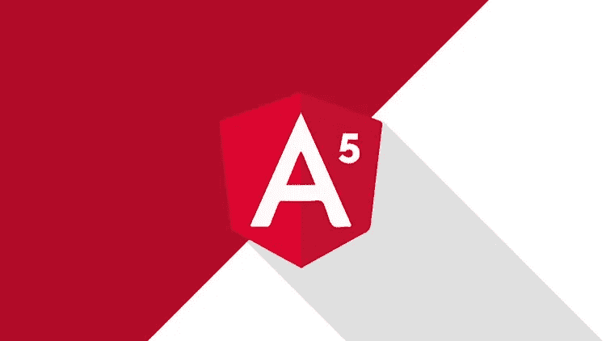
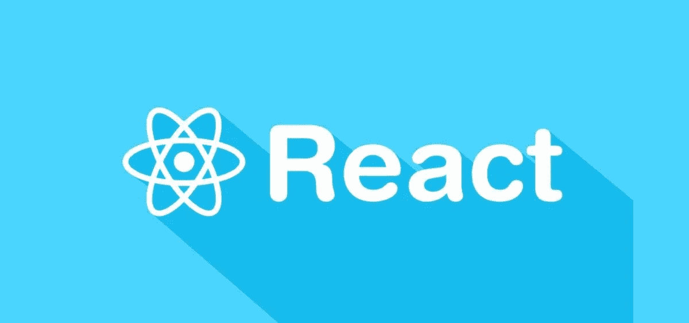
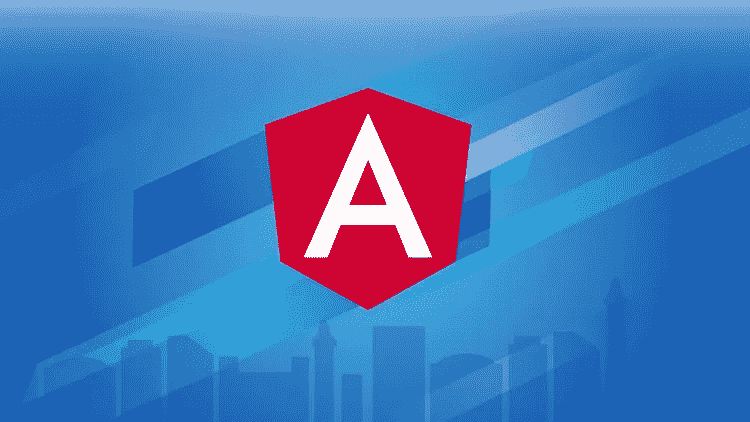
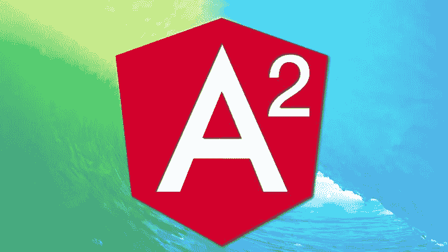
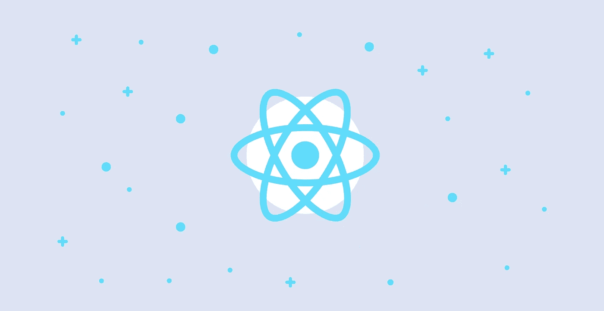

# 2023 年学习 Angular 和 React.js 的 10 门最佳免费课程

> 原文：<https://medium.com/javarevisited/10-free-angular-and-react-js-courses-from-udemy-and-coursera-best-of-lot-e67f7d811e6b?source=collection_archive---------0----------------------->

## 这些是从 Udemy、Coursera 和 Pluralsight 学习 Angular 和 React.js 的最好的免费在线课程

毫无疑问， [Angular](https://javarevisited.blogspot.com/2018/06/5-best-courses-to-learn-angular.html) 和 [React](https://javarevisited.blogspot.com/2018/08/top-5-react-js-and-redux-courses-to-learn-online.html) (也称为 Angular JS 和 React JS)是现代 web 开发，尤其是前端开发最流行的两个框架。

Angular 开创了使用 [JavaScript](https://javarevisited.blogspot.com/2018/06/top-10-courses-to-learn-javascript-in.html) 开发网络应用的新方式，但现在 React 和 [Vue.js](https://javarevisited.blogspot.com/2019/08/top-5-online-courses-to-learn-vue.js-best.html) 将这种方式带到了另一个层次。

最近我看到越来越多的人在学习 React。顺便说一下，今天的世界都是关于[全栈开发人员](https://javarevisited.blogspot.com/2019/01/10-web-development-frameworks-fullstack-developer-should-learn.html)就像你应该知道如何端到端地开发一个 web 应用程序，从前端到后端，这就是为什么作为一个全栈 Java 开发人员，你应该反应或角度框架。

如果你不了解它们，并且还在使用 [JSP](/javarevisited/6-free-courses-to-learn-servlet-jsp-and-java-fx-in-2020-best-of-lot-720201c84f63) 和 JSF 为 Java Web 应用程序开发 GUI，那么你就错过了很多，你将在与熟悉这些框架的年轻 Java 开发人员的竞争中落后。

反正既然来了，你会发现很多免费的在线课程可以学， [React](/javarevisited/top-10-free-courses-to-learn-react-js-c14edbd3b35f) ，还有 [Angular](/javarevisited/top-10-free-courses-to-learn-angular-framework-in-2020-bb62148c73d3) 自己在线。

我知道，有些人不喜欢免费课程，主要是担心它们质量低劣和浪费时间，但情况并非总是如此，尤其是在 [Udemy](https://javarevisited.blogspot.com/2018/01/top-10-udemy-courses-for-java-and-web-developers.html) 上的免费课程。我发现，许多导师最初因为推广原因而免费提供他们的付费课程，以便越来越多的学生可以加入他们，他们可以获得大量的评级和评论，以建立社交证明。这没什么不好，因为你有机会免费看这些课程，但你也应该提供诚实的评论和评级，这是许多教师所期望的。

一旦你注册，它将终身免费。此外，一旦他们达到他们的推广目标，他们就将课程转化为付费课程，这就是为什么有时你点击一个链接说免费课程；实际上并不是免费的。这里的要点是，课程的质量往往是你从 Udemy 上的付费课程中获得的，因为它们实际上是暂时免费的付费课程。

顺便说一句，如果你可以花几块钱学习 Angular 和 React 这样的技能，那么我强烈建议你在 Udemy 上看看 academy mind 的[**Angular——完全指南**](https://click.linksynergy.com/deeplink?id=JVFxdTr9V80&mid=39197&murl=https%3A%2F%2Fwww.udemy.com%2Fcourse%2Fthe-complete-guide-to-angular-2%2F) 和 Stephen Grider 的[**Modern React with Redux**](https://click.linksynergy.com/deeplink?id=JVFxdTr9V80&mid=39197&murl=https%3A%2F%2Fwww.udemy.com%2Fcourse%2Freact-redux%2F)课程。它们只是学习 Angular 和在线反应的最佳材料。

<https://click.linksynergy.com/deeplink?id=JVFxdTr9V80&mid=39197&murl=https%3A%2F%2Fwww.udemy.com%2Fcourse%2Fthe-complete-guide-to-angular-2%2F>  <https://click.linksynergy.com/deeplink?id=JVFxdTr9V80&mid=39197&murl=https%3A%2F%2Fwww.udemy.com%2Fcourse%2Freact-redux%2F>  

# 2023 年 Web 开发人员学习的 10 大免费 Angular 和 React 课程和教程

如果你今年的目标之一是学习 [React JS](https://javarevisited.blogspot.com/2018/10/the-2018-react-developer-roadmap.html) 或 [Angular](https://javarevisited.blogspot.com/2018/06/top-10-angular-tutorials-and-courses-for-web-developers.html#axzz5Ie75bPFF) ，那么你来对地方了。在过去，我已经分享了一些最好的在线培训课程来学习 [Angular](/javarevisited/10-courses-to-learn-angular-for-web-development-6da1bd2856dc) 和 [React](/@javinpaul/top-5-courses-to-learn-react-js-in-2019-best-of-lot-fa02cd96cdf0) ，今天，我将分享一些免费课程。

无论如何，不要再浪费你的时间了，下面是我为 [web 开发](/better-programming/my-5-favorite-courses-to-learn-web-development-in-2019-a5e74167f8b2)准备的一些 ***免费课程，学习 Angular 和 React 框架*** 。

## 1.[从零开始学棱角](https://click.linksynergy.com/deeplink?id=JVFxdTr9V80&mid=39197&murl=https%3A%2F%2Fwww.udemy.com%2Fangular-5%2F)

这是一个长达一小时的速成班，学习 Angular 5 版本的基础知识。这可能看起来有点老，但尽管推出了 Angular 9，Angular 5 仍然非常受欢迎。谈到这门课程，近 44，000 名学生给了它平均 4.3 分的评分，他们对这门课程的质量印象深刻。

非常感谢指导老师加里·西蒙创建了这个课程，并对所有程序员和 web 开发人员免费开放。

**这里是加入本课程的链接** — [从零开始学习 Angular 5](https://click.linksynergy.com/deeplink?id=JVFxdTr9V80&mid=39197&murl=https%3A%2F%2Fwww.udemy.com%2Fangular-5%2F)

## 2.[反应基本面(Udemy)](https://click.linksynergy.com/deeplink?id=JVFxdTr9V80&mid=39197&murl=https%3A%2F%2Fwww.udemy.com%2Freact-fundamentals%2F)

这是另一个学习 Udemy 上 React 或 React JS 库的短期课程。你可能已经知道 React 是一个基于组件的 JavaScript 库，它允许你使用可重用的组件来构建用户界面。您也可以创建自己的组件。本课程涵盖 React JS 的基本概念，如 React 元素。

1.  JSX
2.  成分
3.  小道具
4.  状态
5.  生命周期方法
6.  容器
7.  表单和输入管理
8.  条件渲染
9.  反应路由器 V4

谈到社会证明，这门课程得到了近 15，000 名学生的平均 4.3 分的评分，这令人印象深刻。非常感谢 Edvinas Daugirdas 老师创建了这个课程并保持免费。

**以下是参加本课程的链接**—[React Fundamentals(Udemy)](https://click.linksynergy.com/deeplink?id=JVFxdTr9V80&mid=39197&murl=https%3A%2F%2Fwww.udemy.com%2Freact-fundamentals%2F)

## 3.[角 2+](https://click.linksynergy.com/deeplink?id=JVFxdTr9V80&mid=39197&murl=https%3A%2F%2Fwww.udemy.com%2Fgetting-started-with-angular-2%2F) 入门

这是另一个在 Udemy 上学习 Angular 的优秀免费课程。在本课程中，你将学习如何用 Angular 构建一个简单但有实际价值的应用程序。

在此过程中，您还将了解如何使用一些最常见的角度特性，如组件、指令、表单、 [HTTP](https://javarevisited.blogspot.com/2016/05/what-are-idempotent-and-safe-methods-of-HTTP-and-REST.html) 等等 1。

说起社会证明，这门课也是来自接近 3 万学生的 4.2 评级课程，印象相当深刻。非常感谢讲师 Ryan Chenkie 创建了这个课程，并对 web 开发人员免费开放。

**以下是加入本课程的链接**—[Angular 2+入门](https://click.linksynergy.com/deeplink?id=JVFxdTr9V80&mid=39197&murl=https%3A%2F%2Fwww.udemy.com%2Fgetting-started-with-angular-2%2F)

## 4.[仅 1 小时基本反应完毕](https://click.linksynergy.com/deeplink?id=JVFxdTr9V80&mid=39197&murl=https%3A%2F%2Fwww.udemy.com%2Freact-basic-in-just-1-hour%2F)

本课程为学习如何用 [JavaScript](/javarevisited/10-best-online-courses-to-learn-javascript-in-2020-af5ed0801645) 构建 React 应用程序的基本概念和工作流程提供了快速指南。

在这一过程中，你将会学到关键的 React 概念，比如状态和过程、事件处理、嵌套和重用组件，以及如何在父组件和子组件之间传输数据。这门课程在 Udemy 网站上平均得到了近 46000 名学生的 4.1 分，令人印象深刻。这么大一批学生能保持这么高的分数，很不容易。

非常感谢导师 Leo Trieu 发布了这个课程，并让我们所有人免费使用

**这是加入本课程的链接**——[1 小时内基本反应](https://click.linksynergy.com/deeplink?id=JVFxdTr9V80&mid=39197&murl=https%3A%2F%2Fwww.udemy.com%2Freact-basic-in-just-1-hour%2F)

.

## 5.[角度快速速成班](https://click.linksynergy.com/deeplink?id=JVFxdTr9V80&mid=39197&murl=https%3A%2F%2Fwww.udemy.com%2Fangular-fast-crash-course%2F)

这是另一个在 Udemy 上学习 Angular 的免费课程，但比之前所有课程的时间稍长。它包含了 3.5 小时的内容和 Angular 框架的重要基础知识。

您将学习如何使用 [Angular](https://dev.to/javinpaul/10-books-tutorials-and-courses-to-learn-angular-in-2019-2m0l) 启动并运行，以及如何使用 Angular 5 及更高版本创建应用程序。

谈到社会证明，这门课程得到了近 18，000 名学生和学习者的平均 4.4 分，这充分说明了它的可信度。

非常感谢 Edwin Díaz 讲师和 code Faculty Solutions 创建了这个课程，并对程序员免费开放。

**这里是加入本课程**——[角度快速速成班](https://click.linksynergy.com/deeplink?id=JVFxdTr9V80&mid=39197&murl=https%3A%2F%2Fwww.udemy.com%2Fangular-fast-crash-course%2F)的链接

## 6. [React 和 Redux Masterclass](https://click.linksynergy.com/deeplink?id=JVFxdTr9V80&mid=39197&murl=https%3A%2F%2Fwww.udemy.com%2Flearning-react-and-redux-decoupling-with-stateless-components%2F)

这是 Udemy 的又一个学习 React 和 Redux 的短小精悍的课程。该课程包含 2 个小时的内容，涵盖 React 和 [Redux](https://javarevisited.blogspot.com/2018/08/top-5-react-js-and-redux-courses-to-learn-online.html#axzz5r06B3egD) 。

课程最精彩的地方在于，它教你如何编写解耦的 React.js 和 Redux 代码，这对于一个现实世界的应用来说是非常重要的。谈到社会证明，这门课程得到了大约 8000 名学生的平均 4.1 分的评价，对于一个免费的班级来说，这已经不错了。非常感谢 Mateusz Grzesiukiewicz 老师创建了这个课程并免费开放。

**这里是加入本课程**——[React 和 Redux 大师班](https://click.linksynergy.com/deeplink?id=JVFxdTr9V80&mid=39197&murl=https%3A%2F%2Fwww.udemy.com%2Flearning-react-and-redux-decoupling-with-stateless-components%2F)的链接

## 7.[棱角大师 2——一本正经的课程](https://click.linksynergy.com/deeplink?id=JVFxdTr9V80&mid=39197&murl=https%3A%2F%2Fwww.udemy.com%2Fangular-2-tutorial%2F)

这是另一个学习 Udemy 上的 Angular 框架的课程。该课程是免费的，包含大约 2.5 小时的内容。最好学习如何用 [Angular](https://javarevisited.blogspot.com/2019/04/10-free-angular-and-react-courses-for.html) 开发单页 app。

在本课程中，您将学习如何使用 [Angular 2](http://www.java67.com/2018/01/top-5-free-angular-js-online-courses-for-web-developers.html) 和 [Node.js](/javarevisited/top-10-online-courses-to-learn-node-js-in-depth-8ef0e31ca139) 建立您的开发环境，然后学习如何从头开始创建 Angular 应用程序。

说起社会证明，该课程是 Udemy 上评价最高的免费角课程之一。近 6500 名学生平均给它打了 4.5 分。

非常感谢 Grant Klimaytys 讲师创建了这门课程，并一直免费提供。

**这里是加入本课程的链接** — [角度大师 2——一本正经的课程](https://click.linksynergy.com/deeplink?id=JVFxdTr9V80&mid=39197&murl=https%3A%2F%2Fwww.udemy.com%2Fangular-2-tutorial%2F)

## 8.[反作用对比角度对比 Vue.js 示例](https://click.linksynergy.com/deeplink?id=JVFxdTr9V80&mid=39197&murl=https%3A%2F%2Fwww.udemy.com%2Freact-vs-angular-vs-vuejs-by-example%2F)

web 开发人员的一个常见疑惑是在 Angular、React 和 [Vue.js](https://www.java67.com/2020/07/5-free-courses-to-learn-vuejs-in-2020.html) 之间做出选择。它们都很好，各有利弊，但这门课程为你提供了一个独一无二的机会，让你自己做出决定。

在本课程中，你将构建一个 [React App](https://javarevisited.blogspot.com/2020/08/top-10-pluralsight-courses-to-learn-React.js.html) ，一个 Angular App，和一个 [Vue.js app](https://javarevisited.blogspot.com/2019/08/top-5-online-courses-to-learn-vue.js-best.html) 。在这之后，你应该能够理解它们之间的区别，并决定哪一个最适合你。

谈到社会证明，这门课程得到了近 42，000 名学生的平均 4.3 分的评分，这非常令人印象深刻，也充分说明了这门课程的质量。

**以下是加入本课程的链接**—[React vs Angular vs . vue . js 举例](https://click.linksynergy.com/deeplink?id=JVFxdTr9V80&mid=39197&murl=https%3A%2F%2Fwww.udemy.com%2Freact-vs-angular-vs-vuejs-by-example%2F)

## 9.[角度 2:入门](https://pluralsight.pxf.io/c/1193463/424552/7490?u=https%3A%2F%2Fwww.pluralsight.com%2Fcourses%2Fangular-2-getting-started)

Pluralsight 是我最喜欢的学习新事物的地方之一，因为它提供了 5000 多门课程，每月费用仅为 29 美元。

这就像软件开发者的网飞。就像网飞，你继续看电影；你会发现在 Pluralsight 上学到了很多东西。

说起这门课，在[复数视线](https://javarevisited.blogspot.com/2017/12/top-10-pluralsight-courses-java-and-web-developers.html)中学习 Angular 2+是最受欢迎的课之一。它也非常全面，涵盖了角相当好。

唯一的事情是，这个课程不是完全免费的，因为你需要 [Pluralsight 会员资格](/javarevisited/7000-free-pluralsight-courses-to-build-in-demand-tech-skills-without-leaving-your-house-40edb50a8cf2)才能进入这个课程，但是如果你正在寻找一个学习 Angular 的综合课程，这是你应该加入的课程。

非常感谢 Deborah Kurata 老师和 Pluralsight 教授这门优秀的课程。

**以下是加入本课程的链接**——[Angular 2:入门](https://pluralsight.pxf.io/c/1193463/424552/7490?u=https%3A%2F%2Fwww.pluralsight.com%2Fcourses%2Fangular-2-getting-started)

## 10.[反应基础](https://pluralsight.pxf.io/c/1193463/424552/7490?u=https%3A%2F%2Fwww.pluralsight.com%2Fcourses%2Freact-fundamentals-update)

React 是世界上最受欢迎的创建现代 web 用户界面的库之一。React 最好的部分是组件，这在本课程中有所涉及。

该课程获得了 118 个 4 星评级，拥有超过 4 个小时的内容，这使得它成为端到端学习 Rect 的一门优秀课程。

最后，非常感谢利亚姆·麦克伦南老师和 Pluralsight 创建了这个课程。

**这是参加本课程** — [反应基础](https://pluralsight.pxf.io/c/1193463/424552/7490?u=https%3A%2F%2Fwww.pluralsight.com%2Fcourses%2Freact-fundamentals-update)的链接

顺便说一句，这个课程不是免费的，你需要 Pluralsight 会员资格才能进入这个课程。顺便说一句，如果你是第一次，你仍然可以通过注册一个 [**10 天的免费试用**](http://pluralsight.pxf.io/c/1193463/424552/7490?u=https%3A%2F%2Fwww.pluralsight.com%2Flearn) **，**来免费访问该课程，它将为你提供 200 分钟的免费观看时间。

## 11.[全栈反应](https://gumroad.com/a/934179955)

如果你喜欢边看课程边看书，那么这本书是给你的。一个明智的开发人员会希望对 web 开发有一个全面的了解。为了获得这一点，你应该使用一些其他的由经验丰富的专业人员使用的学科。

在本书中，您将从 Anthony Accomazzo、Nate Murray、Ari Lerner、Clay 奥尔索普、David Guttman 和 Tyler McGinnis 等专家那里学习 Full Stack React。几乎没有哪本书能让你有机会在一个地方向这么多专家学习。

这本书拓宽了我们对多种框架和采用全栈开发方式的理解。在理解了这篇重要文章中的主题后，你将成为一个自信的开发者。所有的贡献者都是受人尊敬的作者和开发人员，对许多语言和框架都有丰富的经验

这里是购买这本书的链接。[全栈反应](https://gumroad.com/a/934179955)

以上就是学习 Angular 或 React 框架的一些**最好的免费课程。正如我所说，学习这些框架对于 web 开发人员来说是必要的，但对于一个[全栈 Java 开发人员](https://javarevisited.blogspot.com/2020/04/top-5-courses-to-become-full-stack-java-developer-with-Angular-and-Reactjs.html#axzz6Nq9yk7Sc)来说也是至关重要的。它们不仅允许您创建单页 web 应用程序，还简化了您创建网页的方式。

其他**编程文章和资源**你可能喜欢**

*   [2023 年网络开发者路线图](https://javarevisited.blogspot.com/2019/02/the-2019-web-developer-roadmap.html)
*   [2023 年学习 Angular 的十大课程](/javarevisited/10-courses-to-learn-angular-for-web-development-6da1bd2856dc)
*   [Java 和 Web 开发人员应该学习的 10 个框架](https://javarevisited.blogspot.com/2018/01/10-frameworks-java-and-web-developers-should-learn.html)
*   [为有经验的开发者提供的 10 门免费 Java 课程](http://www.java67.com/2018/08/top-10-free-java-courses-for-beginners-experienced-developers.html)
*   [5 门免费课程学习芯泉和 Spring Boot](http://www.java67.com/2017/11/top-5-free-core-spring-mvc-courses-learn-online.html)
*   [我最喜欢的学习 GraphQL 的课程](/javarevisited/top-5-graphql-tutorials-and-courses-for-beginners-fb5543506fc2)
*   [2023 年学习 Docker 的 10 门免费课程](http://www.java67.com/2018/02/5-free-docker-courses-for-java-and-DevOps-engineers.html)
*   [2023 年 React JS 开发者路线图](https://hackernoon.com/the-2018-react-js-roadmap-4d0a43814c02)
*   [面向 DevOps 工程师的五大免费 Kubernetes 课程](https://javarevisited.blogspot.com/2019/01/top-5-free-kubernetes-courses-for-DevOps-Engineer.html#axzz5d2bEyYmv)
*   [2023 年学习 Maven 和 Jenkins 的 5 门免费课程](http://www.java67.com/2018/02/6-free-maven-and-jenkins-online-courses-for-java-developers.html)
*   [面向程序员的 2023 年 DevOps 路线图](https://javarevisited.blogspot.com/2018/09/the-2018-devops-roadmap-your-guide-to-become-DevOps-Engineer.html)
*   [Web 开发人员应该知道的 10 个 JavaScript 框架](http://www.java67.com/2019/01/top-10-javascript-frameworks-and-libraries-for-web-developers.html)
*   [在线学习 5 门最佳 React.js 课程](/javarevisited/5-best-react-js-books-for-beginners-and-experienced-web-developers-e7b90b1ab9d2)
*   [2023 年学习 React Native 的 5 大课程](/@javinpaul/top-5-react-native-courses-for-mobile-application-developers-b82febdf8a46?source=---------112------------------)
*   [5 本最适合初学者的 React.js 书籍](/javarevisited/5-best-react-js-books-for-beginners-and-experienced-web-developers-e7b90b1ab9d2)
*   [学习 React 钩子和上下文 API 的 10 门免费课程](/javarevisited/top-10-free-courses-to-learn-react-js-c14edbd3b35f)

感谢您阅读本文。如果你喜欢这些免费的 Angular 和 React 课程，那么请分享给你的朋友和同事。如果您有任何问题或反馈，请留言。

**p . s .**——如果你是 web 开发世界的新手，想要学习所有的东西，Web 开发人员应该知道没有比柯尔特·斯蒂尔的 Web 开发人员训练营 更好的课程了。这将是一个网站开发者需要知道的所有技术。

<https://click.linksynergy.com/fs-bin/click?id=JVFxdTr9V80&subid=0&offerid=634352.1&type=10&tmpid=14538&RD_PARM1=https%3A%2F%2Fwww.udemy.com%2Fthe-web-developer-bootcamp%2F>  

如果你更喜欢书本而不是在线课程，或者想把马克斯的课程和书本结合起来，那么我强烈推荐你去看看内特·默里、@阿里·勒纳和卡洛斯·塔沃尔达的 [**ng-book**](https://gumroad.com/a/221148275/FlvVl) 。这是一本关于 Angular 11 的深入、完整、最新的书，受到 Angular 专家的强烈推荐。