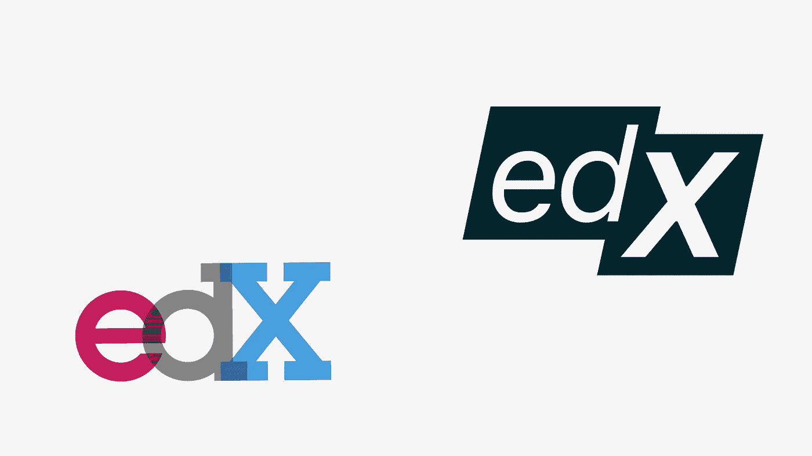
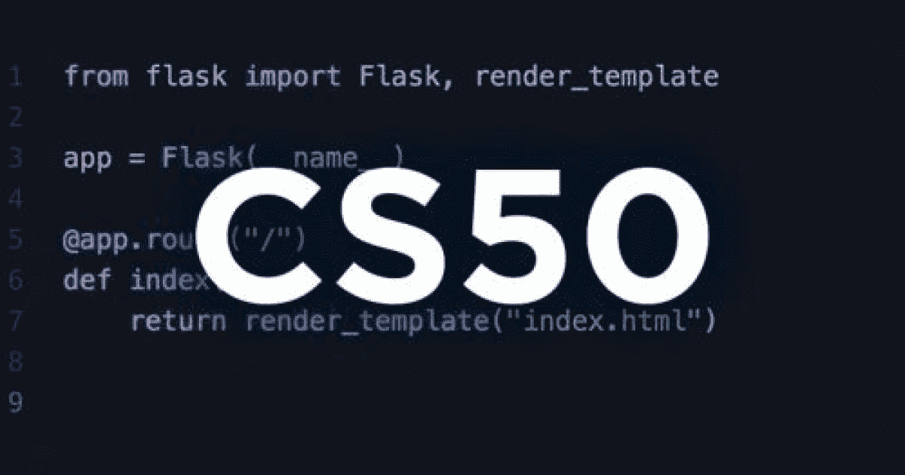
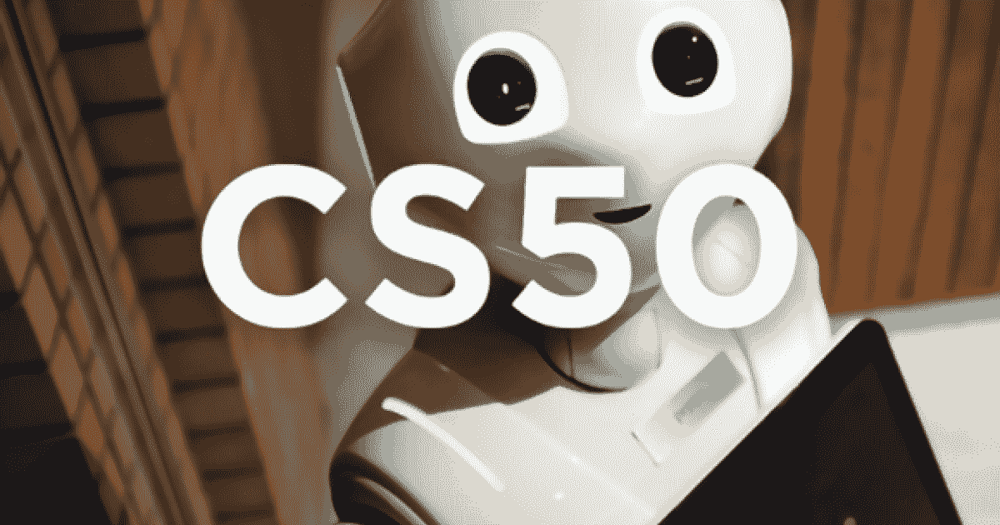
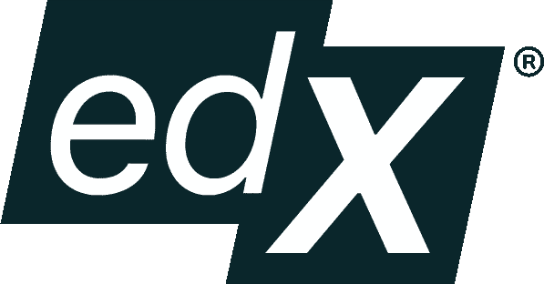
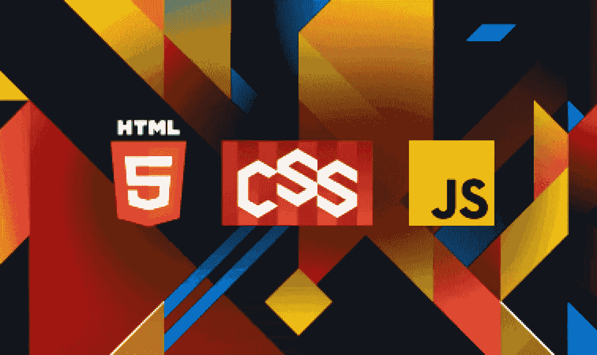
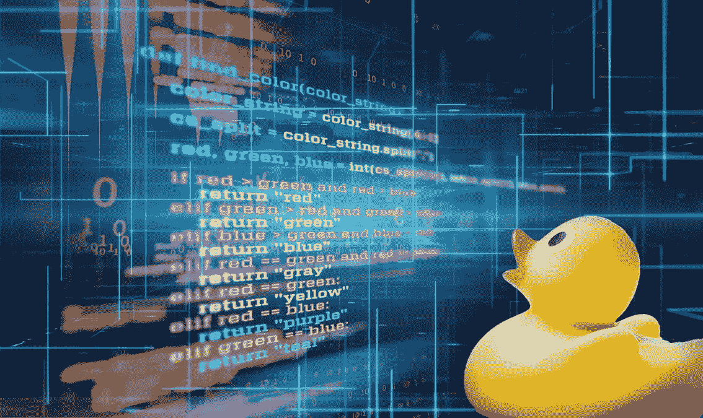
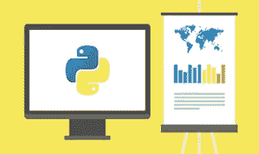
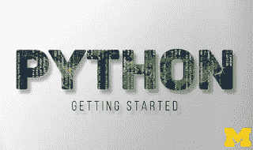

# 2023 年在线学习 10 种最佳 edX 认证和免费课程

> 原文：<https://medium.com/javarevisited/10-free-best-edx-certifications-and-courses-to-learn-online-3473d466f968?source=collection_archive---------1----------------------->

## 这些是 2023 年免费学习 Python、数据科学、计算机科学、编程、前端开发等最好的 edX 课程和认证。

大家好，如果你正在寻找最好的在线课程和认证来加入 edX，那么你来对地方了。此前，我已经分享了来自**[**Coursera**](/javarevisited/10-best-coursera-certifications-and-courses-for-beginners-b13e930f2830)[**plural sight**](/javarevisited/10-best-react-courses-from-pluralsight-for-beginners-and-experienced-developers-80b7c640cca3)的最佳课程，在本文中，我将分享 2023 年加入的 b *est edX 编程与开发课程*。**

**如果你不知道的话， [edX](https://www.awin1.com/cread.php?awinmid=6798&awinaffid=631878&clickref=&p=) 是由两所主要大学麻省理工学院和哈佛大学设计的大型电子学习平台之一，成立于 2012 年，旨在为全球几乎每个行业提供在线教育，从商业和营销到编程和 web 开发。**

**edX 最好的一点是，它提供哈佛和麻省理工学院的免费在线大学课程。所以，你得到了一个免费向世界顶尖大学学习的机会，是不是很神奇？

edX 平台也有不同类型的课程和证书如 [MicroMaster](https://www.awin1.com/cread.php?awinmid=6798&awinaffid=631878&platform=dl&ued=https%3A%2F%2Fwww.edx.org%2Fmicromasters) 和[Professional certificate](https://www.awin1.com/cread.php?awinmid=6798&awinaffid=631878&platform=dl&ued=https%3A%2F%2Fwww.edx.org%2Fprofessional-certificate)s 由微软、IBM 等多家机构和密歇根、麻省理工、哈佛、宾夕法尼亚等多所顶尖大学提供。**

**麻省理工和哈佛提供的 edX 内容大部分都是免费学习的，也就是说你可以免费学习但是需要付费买证书。它们与 Coursera 的**非常相似，同样提供来自世界顶尖大学和机构的在线学习资料。****

**** [## Coursera |顶级教育工作者的在线课程和证书。免费加入

### 在线学习，从耶鲁大学、密歇根大学、斯坦福大学等顶尖大学和领先公司获得有价值的证书…

coursera.pxf.io](https://coursera.pxf.io/c/3294490/1164545/14726?u=https%3A%2F%2Fwww.coursera.org%2F) 

今天，在这篇文章中，您将探索一些针对软件开发人员的最佳课程和证书，它们可以帮助您促进您的职业发展，并从顶级组织获得一些经验和知识。

这份名单包括哈佛等世界顶尖大学以及 IBM 等顶尖科技公司的课程和专业证书。它还拥有学习需求技能的课程和证书，如[计算机科学](/javarevisited/8-best-computer-science-courses-for-beginners-to-learn-online-696379aa4e96)、 [Web 开发](/javarevisited/10-best-coursera-courses-for-web-development-and-web-design-9ec54ed92dd9)、 [Python](/javarevisited/10-best-python-certification-courses-from-coursera-4576890eb6b3) 、[数据科学](/javarevisited/my-favorite-data-science-and-machine-learning-courses-from-coursera-udemy-and-pluralsight-eafc73acc73f)、分析学、[人工智能](/javarevisited/7-best-courses-to-learn-artificial-intelligence-in-2020-26d59d62f6fe?source=---------17------------------)和[深度学习](/javarevisited/10-free-deep-learning-courses-for-beginners-37b5de61f8dc)。

# 向哈佛和麻省理工学院学习的 10 个最佳 edX 专业证书和课程

在不浪费你更多时间的情况下，这里有 edX 程序员和开发人员可以参加的最好的在线课程和认证。

## 1. [CS50 的计算机科学入门](https://www.awin1.com/cread.php?awinmid=6798&awinaffid=631878&clickref=&p=%5B%5Bhttps%3A%2F%2Fwww.edx.org%2Fcourse%2Fcs50s-introduction-to-computer-science)【免费】

这门课程是哈佛大学完全免费提供的整个 edX 平台中著名的计算机科学课程，它教学生如何思考算法来有效地解决问题，同时还有一些编程语言，如 [Python](/javarevisited/8-advanced-python-programming-courses-for-intermediate-programmer-cc3bd47a4d19) 、 [C](/javarevisited/top-10-free-interactive-programming-courses-from-educative-for-beginners-to-learn-in-2021-713cbf96d4eb) 、 [JavaScript](/javarevisited/my-favorite-free-tutorials-and-courses-to-learn-javascript-8f4d0a71faf2) 等等。

这是大卫·j·马兰教授的入门课程。你还将学习关键的计算机科学概念，如抽象、[算法](/javarevisited/7-best-courses-to-learn-data-structure-and-algorithms-d5379ae2588?source=---------18------------------)、[数据结构](/javarevisited/top-10-free-data-structure-and-algorithms-courses-for-beginners-best-of-lot-ad807cc55f7a?source=grid_home---------0-2-----------------18---ce729948_f262_4982_a7a1_a5058c8fe9fa--)、封装、资源管理、安全、软件工程和 web 开发。

已经有超过 2，951，637 人加入了这个课程，这充分说明了这个免费 edX 课程的受欢迎程度。它可以自定进度，完全免费，如果你每周花 6 到 8 个小时，大约需要 12 周才能完成。

**这是加入本课程的链接** — [CS50 的计算机科学入门](https://www.awin1.com/cread.php?awinmid=6798&awinaffid=631878&clickref=&p=%5B%5Bhttps%3A%2F%2Fwww.edx.org%2Fcourse%2Fcs50s-introduction-to-computer-science)

****

## ****2.CS50 的[用 Python 介绍人工智能](https://www.awin1.com/cread.php?awinmid=6798&awinaffid=631878&clickref=&p=%5B%5Bhttps%3A%2F%2Fwww.edx.org%2Fcourse%2Fcs50s-introduction-to-artificial-intelligence-with-python)【免费】****

****这是哈佛大学提供的另一门很棒的免费课程，也是学习如何使用[机器学习](/javarevisited/10-free-machine-learning-courses-for-beginners-181f83b4c816)和[计算机视觉](/javarevisited/5-best-computer-vision-courses-for-beginners-85f901a8f88a)解决现实世界问题的最佳课程****

****本课程使用 [Python 编程语言](/javarevisited/python-or-java-which-programming-language-beginners-should-learn-in-2020-de992b2650ec)及其各种库，探索作为现代人工智能基础的概念和算法，及其在游戏引擎、手写识别和机器翻译等技术上的应用。****

****你不仅将学习如何使用它们，还将学习如何设计和创建[神经网络](/javarevisited/top-5-advanced-deep-learning-and-neural-network-courses-to-learn-in-2020-a273f5eddca5?source=---------16----------------------------)，并利用其学习复杂问题和更多与人工智能相关的概念的能力。****

****谈到社会证明，超过 366，805 名学生已经加入了这一热门的 edX 免费人工智能课程。它是自定进度的、在线的、完全免费的。按照每周 7 至 10 小时的速度，完成本课程大约需要 7 周时间。****

******这里是加入本课程**——[Python 人工智能入门](https://www.awin1.com/cread.php?awinmid=6798&awinaffid=631878&clickref=&p=%5B%5Bhttps%3A%2F%2Fwww.edx.org%2Fcourse%2Fcs50s-introduction-to-artificial-intelligence-with-python)的链接****

********

## ****3.[哈佛的数据科学认证](https://www.awin1.com/cread.php?awinmid=6798&awinaffid=631878&platform=dl&ued=https%3A%2F%2Fwww.edx.org%2Fprofessional-certificate%2Fharvardx-data-science)****

****这是 edX 最受欢迎的数据科学专业证书之一。这个全面的计划是由哈佛大学创建的，旨在从一开始就指导您如何成为一名数据科学家。****

****从 Python 等数据科学家中流行的 [R 编程语言](/javarevisited/10-best-r-programming-courses-for-data-science-and-statistics-8f84ebec4974)的基础开始，然后转向一些统计概念，以及如何使用 R 语言中的 ggplot2 库和[机器学习](/javarevisited/top-10-machine-learning-and-data-science-certifications-and-training-courses-for-beginners-and-a6308497b764)进行数据可视化，以及如何应用一些概念，如线性回归。****

****在此过程中，您还将熟悉用于实践数据科学家的基本工具，如 [Unix/Linux](/javarevisited/7-best-linux-courses-for-developers-cloud-engineers-and-devops-in-2021-7415314087e1) 、 [git 和 GitHub](/javarevisited/top-10-free-courses-to-learn-git-and-github-best-of-lot-967aa314ea) 以及 RStudio。****

****顺便说一下，这个专业证书不是免费的，因为它是课程的组合。这是一门自定进度的课程，大约需要一年半的时间完成，每周 2-3 小时。****

******这里是了解更多**——[哈佛的数据科学认证](https://www.awin1.com/cread.php?awinmid=6798&awinaffid=631878&platform=dl&ued=https%3A%2F%2Fwww.edx.org%2Fprofessional-certificate%2Fharvardx-data-science)****

********

## ****4.[前端 Web 开发人员专业证书](https://www.awin1.com/cread.php?awinmid=6798&awinaffid=631878&platform=dl&ued=https%3A%2F%2Fwww.edx.org%2Fprofessional-certificate%2Fw3cx-front-end-web-developer)****

****这是另一个最好的，W3C 机构提供了大量的专业证书，教学生开始前端 web 开发人员职业生涯所需的编程语言。****

****在这个项目中，你将开始学习现代 HTML5 的基础知识和一些高级功能，如 web 组件和 API，然后使用 CSS 设计你的网站，并使用 Javascript 添加一些动画等等。****

****这也是一个自定进度的课程，如果你每周工作 5 到 7 个小时，大约需要 7 个月完成，这是可以实现的。同样，这不是免费的，因为它是一个专业证书，包含多门课程。****

******这里是加入这个项目的链接**——[前端 Web 开发者职业证书](https://www.awin1.com/cread.php?awinmid=6798&awinaffid=631878&platform=dl&ued=https%3A%2F%2Fwww.edx.org%2Fprofessional-certificate%2Fw3cx-front-end-web-developer)****

********

## ****5.[Python 编程入门【专业证书】](https://www.awin1.com/cread.php?awinmid=6798&awinaffid=631878&platform=dl&ued=https%3A%2F%2Fwww.edx.org%2Fprofessional-certificate%2Fintroduction-to-python-programming)****

****这是佐治亚理工学院为希望使用 Python 编程语言(世界上最流行的编程语言之一)学习计算机科学基础知识的人提供的另一个受欢迎的 edX 专业证书。****

****本专业认证课程旨在面向愿意以 python 开发人员[开始职业生涯的初学者，从 python 编程的基础开始，如变量、循环、运算符、调试，然后转向一些高级主题，如函数、处理文件和数据以及面向对象编程。](/javarevisited/top-10-courses-to-learn-python-for-web-development-in-2020-best-of-lot-efe11fb6d212)****

****您还将了解创建有用程序的核心数据结构:字符串、列表、字典和文件操作。这也是一门付费的自定进度课程，需要大约 5 个月的时间才能完成 9 到 10 个小时的日常工作。不过，你会收到一份证书，并在简历中展示出来。****

******这里是加入这个认证的链接**——[Python 编程入门](https://www.awin1.com/cread.php?awinmid=6798&awinaffid=631878&platform=dl&ued=https%3A%2F%2Fwww.edx.org%2Fprofessional-certificate%2Fintroduction-to-python-programming)****

********

## ****6.[用 Python 可视化数据](https://www.awin1.com/cread.php?awinmid=6798&awinaffid=631878&platform=dl&ued=https%3A%2F%2Fwww.edx.org%2Fcourse%2Fvisualizing-data-with-python)【免费】****

****由名为 IBM 的大公司设计的针对 python 开发人员的最佳课程，教他们如何使用这种美丽的编程语言 [Python](/javarevisited/6-best-python-books-for-data-science-and-machine-learning-in-2021-2f41d9fbf8be) 来可视化他们的数据，使用一些库，如 matplotlib seaborn 和 Folium 来制作交互式地图。****

****这门课程也是完全免费的，已经有超过 50，562 名学生注册。它也是自定进度的，需要大约 5 周时间完成，每天投入 2 到 4 个小时。****

********

## ****7.[分析:基本工具和方法](https://www.awin1.com/cread.php?awinmid=6798&awinaffid=631878&platform=dl&ued=https%3A%2F%2Fwww.edx.org%2Fmicromasters%2Fgtx-analytics-essential-tools-and-methods)【微大师计划】****

****这门分析课程是佐治亚理工学院教授学生如何使用 python 和 r 等多种编程语言的最佳课程之一。****

****作为本课程的一部分，您将学习如何创建一些数据可视化，了解分析的模型和方法，以及如何有效地应用它们来解决您的问题，并学习统计学和机器学习等。****

****这是一个 MicroMaster 程序，因此它不是免费的，而且它也有点贵，整个程序要 2475 美元。但是，这是一个教师指导的项目，作业和考试都有具体的截止日期，这意味着你将获得真正的课堂学习体验。****

******这里是了解更多** — [分析:基本工具和方法](https://www.awin1.com/cread.php?awinmid=6798&awinaffid=631878&platform=dl&ued=https%3A%2F%2Fwww.edx.org%2Fmicromasters%2Fgtx-analytics-essential-tools-and-methods)的链接****

********

## ****8.[IBM 应用人工智能专业认证](https://www.awin1.com/cread.php?awinmid=6798&awinaffid=631878&platform=dl&ued=https%3A%2F%2Fwww.edx.org%2Fprofessional-certificate%2Fibm-applied-ai)****

****这一全面的 edX 专业证书课程是为那些愿意深入研究人工智能和神经网络而不需要任何先验知识的学生设计的。****

****您将从头开始学习 python 的基础知识，使用这种编程语言和 OpenCV 计算机视觉库以及数据科学中的一些概念创建图像分类器。****

****这也是一个自定进度的计划，需要大约 6 个月的时间完成，每周 3 到 5 个小时。如果你能每天花更多的时间，你就能早点完成。****

****下面是加入这个认证的链接— [应用人工智能专业认证](https://www.awin1.com/cread.php?awinmid=6798&awinaffid=631878&platform=dl&ued=https%3A%2F%2Fwww.edx.org%2Fprofessional-certificate%2Fibm-applied-ai)****

********

## ****9.[人人编程(Python 入门)](https://www.awin1.com/cread.php?awinmid=6798&awinaffid=631878&platform=dl&ued=https%3A%2F%2Fwww.edx.org%2Fcourse%2Fprogramming-for-everybody-getting-started-with-pyt)【免费】****

****学习 python 编程语言的另一个很棒的免费 edX 课程是密歇根大学提供的面向所有人的编程，它将带您从计算机编程的简单概念开始，然后转到如何使用变量条件执行(如循环和函数)来创建一些简单程序等等的实践课程。****

********

## ****10.[IBM 颁发的深度学习专业证书](https://www.awin1.com/cread.php?awinmid=6798&awinaffid=631878&platform=dl&ued=https%3A%2F%2Fwww.edx.org%2Fprofessional-certificate%2Fdeep-learning)****

****使用 python 语言和其他库(如 Keras PyTorch 和 TensorFlow)从零开始学习深度学习并将其应用于现实世界问题的最佳和全面的专业证书。****

****您将使用这些库创建用于监督和非监督学习的神经网络，以及卷积神经网络等等。****

******以下是加入本课程的链接—**[IBM 颁发的深度学习专业证书](https://www.awin1.com/cread.php?awinmid=6798&awinaffid=631878&platform=dl&ued=https%3A%2F%2Fwww.edx.org%2Fprofessional-certificate%2Fdeep-learning)****

********

****这就是为软件开发人员、数据科学家、web 开发人员以及任何想在信息技术领域开始职业生涯的人提供的所有**最佳 edX 课程和专业证书**。edX 使电子学习比以往任何时候都更加容易和便宜，所以你可以在许多行业学习最好和全面的软件开发课程，而不必离开你的家或花那么多钱上大学。****

****您可能喜欢的其他**编程资源******

*   ****[开始职业生涯的十大 Coursera 认证](/javarevisited/top-10-coursera-certificates-to-start-your-career-in-cloud-data-science-ai-mainframe-and-it-558690c83587)****
*   ****【React 开发者的 10 个最佳 Pluralsight 课程****
*   ****[Udemy vs 复数视线？哪个学习平台比较好？](https://javarevisited.blogspot.com/2019/10/udemy-vs-pluralsight-review-which-is-better-to-learn-code.html)****
*   ****[学习网页开发的十大 Coursera 课程](https://javarevisited.blogspot.com/2020/08/top-10-coursera-certifications-to-learn-web-development.html)****
*   ****[Udemy vs CocdeCademy vs one month？](https://javarevisited.blogspot.com/2019/09/codecademy-vs-udemy-vs-onemonth-which-is-better-for-learning-code.html#axzz6VYKcmyZz)****
*   ****[2023 年程序员 10 大课程课程](https://javarevisited.blogspot.com/2020/08/top-10-coursera-courses-specilizations-and-certifications.html)****
*   ****[学习数据科学的十大 Coursera 课程](https://javarevisited.blogspot.com/2020/08/top-10-coursera-certifications-to-learn-Data-Science-Visualization-and-Data-Analysis.html)****
*   ****[向顶级科技公司学习的 18 门 Coursera 课程](/javarevisited/18-coursera-courses-you-can-join-in-2020-to-learn-from-the-worlds-top-tech-companies-google-74af46967d1e?source=collection_home---4------0-----------------------)****
*   ****[面向程序员和开发人员的 Coursera 十大项目](https://javarevisited.blogspot.com/2020/08/top-10-coursera-projects-to-learn-essential-programming-skills.html)****
*   ****[Udemy vs Coursera？学理工和编程哪个好](https://javarevisited.blogspot.com/2020/01/coursera-vs-udemy-which-is-better-for-programming-tech.html)****
*   ****[Coursera 证书对工作和事业有帮助吗](https://javarevisited.blogspot.com/2020/02/does-udemy-coursera-edx-educative-or.html)****
*   ****学习 Python 的 10 个 Coursera 专业化认证****
*   ****[5 个最佳 Coursera 程序员职业证书](https://javarevisited.blogspot.com/2019/10/top-5-coursera-professional-certificates-for-programmers-IT-professionals.html)****
*   ****[2023 年学习 Python 可以做的 8 个项目](/javarevisited/8-projects-you-can-buil-to-learn-python-in-2020-251dd5350d56)****
*   ****[学习云计算的 10 门最佳 Coursera 课程](https://javarevisited.blogspot.com/2020/08/top-10-coursera-certifications-to-learn-cloud-computing-aws.html#axzz6WK1yC5WW)****
*   ****[Coursera Plus Review——在 Coursera 上学习的更好方式](https://javarevisited.blogspot.com/2020/08/coursera-plus-better-way-to-take-coursera-courses-specilizations-certification.html)****
*   ****[Udemy vs Educative vs Codecademy？新手用哪个比较好](/javarevisited/codecademy-or-pluralsight-which-is-a-better-platform-to-learn-coding-skills-59251a080642)****
*   ****【Coursera 的 10 项数据科学和机器学习认证****

****感谢您阅读本文。如果你觉得这些*最佳 edX 课程和认证*有用，那么请与你的朋友和同事分享。如果您有任何问题或反馈，请留言。****

******p . s .**——如果你正在寻找 2023 年最好的 Udemy 课程和认证，那么你也可以看看我列出的 [**程序员和软件开发人员最好的 Udemy 课程**](https://javarevisited.blogspot.com/2019/08/top-10-udemy-courses-and-certifications-for-programmers.html) 。包含了最好的 Udemy 在线课程，学习 Java 编程、Python、Git，以及其他软件开发所需的必备技能。****

**** [## 2023 年软件开发与编程的 15 门最佳 Udemy 课程

### 这些是你能在 Udemy 的黑色星期五和 2020 年网络周上买到的最好的在线课程

medium.com](/javarevisited/15-best-udemy-courses-programmers-can-buy-on-black-friday-and-cyber-monday-2020-a803874f41d9)****