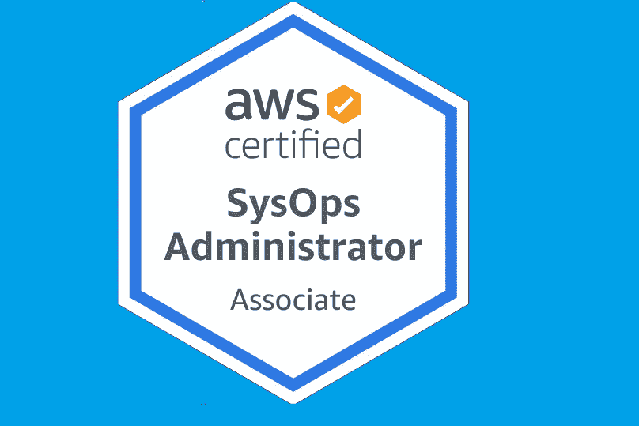
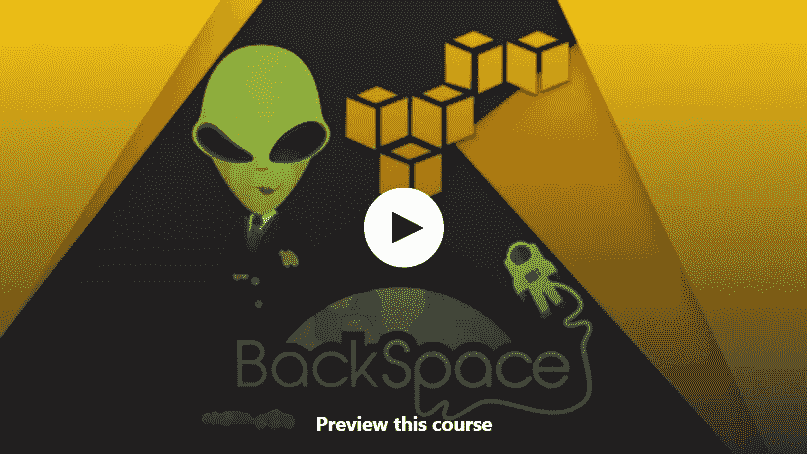
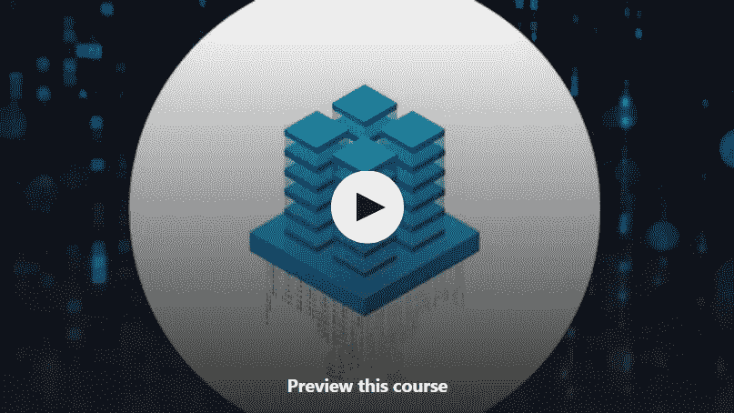
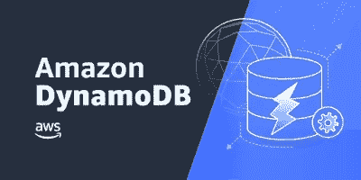
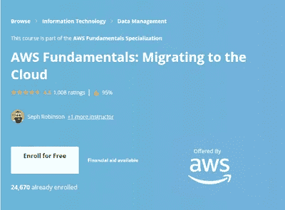
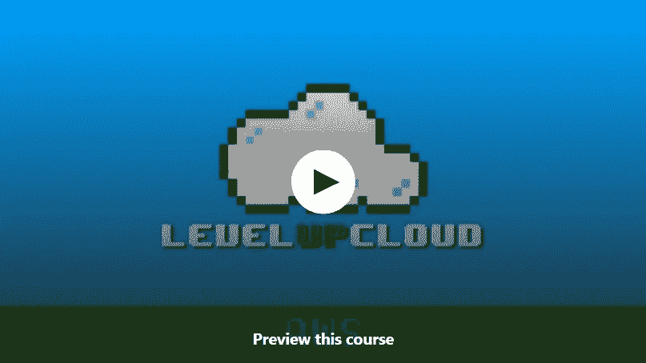
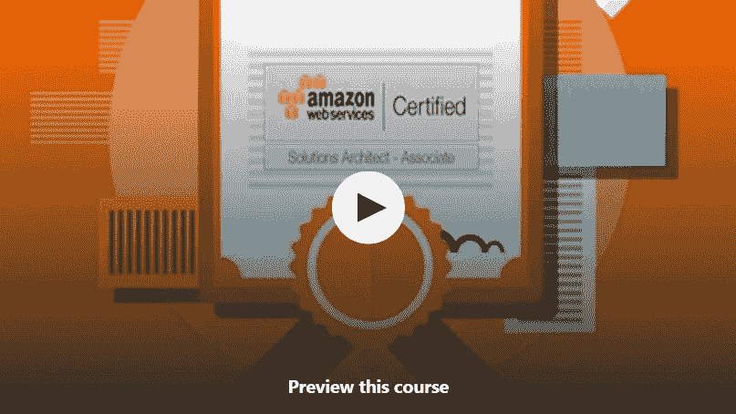

# 2023 年破解 AWS SysOps 管理员助理认证考试(SO1-C02)的 10 门最佳免费课程

> 原文：<https://medium.com/javarevisited/10-free-courses-to-crack-aws-sysops-administrator-associate-certification-exam-so1-c01-20fc02c9471e?source=collection_archive---------0----------------------->

## 2023 年 AWS SysOps 管理员助理认证考试的免费在线培训课程列表。

大家好，如果你正在准备 2023 年的 AWS SysOps 管理员助理认证考试，并在寻找免费的在线课程，那么你来对地方了。

过去，我已经分享了[最佳 AWS 系统操作课程](/javarevisited/6-best-aws-sysops-online-courses-for-devops-engineers-to-become-a-certified-aws-sysops-5c2ae9dad31d)和[实践测试](https://javarevisited.blogspot.com/2020/06/top-5-aws-certified-sysops-admin-associate-certification-exam.html)，今天我将分享 5 门免费在线课程，你可以用它们来准备这项享有盛誉的 AWS 系统操作认证。

作为一名普通的系统管理员可能会给你足够的曝光率，但是如果你有适当的认证，那么你将会得到至少两倍的曝光率。既然你在这里寻找通过 AWS SysOps 管理员助理考试的**免费课程，你无疑对获得证书感兴趣。**

在 2023 年，每个国家都在努力抗击疫情，每个人都被迫呆在家里，在这个时候获得认证和培养技能是一个伟大的决定。一旦这个疫情消失了，每个公司都会寻找有技能的员工，拥有 AWS SysOps 管理员助理证书会让你比竞争对手更有优势。

虽然 AWS 认证很重要，但是如果你不知道这个主题，你会面临很多麻烦。为了让您远离各种麻烦，我们创建了一个 10 门免费在线课程的列表，帮助您通过 AWS SysOps 管理员助理考试。

这些课程中的每一门都将帮助你理解[什么是 AWS](/javarevisited/top-10-courses-to-learn-amazon-web-services-aws-cloud-in-2020-best-and-free-317f10d7c21d)以及你如何执行各种操作。如果你致力于这项认证，并寻找在线培训材料，那么你来对地方了。

顺便说一下，如果你真的想在第一次尝试中通过这个著名的考试，那么我也强烈推荐你参加 Udemy 网站上由夏羽·马雷克举办的 [**终极 AWS 认证系统管理员助理 2023**](https://click.linksynergy.com/deeplink?id=JVFxdTr9V80&mid=39197&murl=https%3A%2F%2Fwww.udemy.com%2Fcourse%2Fultimate-aws-certified-sysops-administrator-associate%2F) 课程。

 [## 终极 AWS 认证系统运行管理员助理 2023

### 2020 年 5 月更新]:更新了 50+个视频，以跟上 AWS UI 的变化。【2019 年 7 月更新】:讲座很少…

udemy.com](https://click.linksynergy.com/deeplink?id=JVFxdTr9V80&mid=39197&murl=https%3A%2F%2Fwww.udemy.com%2Fcourse%2Fultimate-aws-certified-sysops-administrator-associate%2F) 

这是一门优秀的、全面的、最新的课程，它将帮助你在第一次尝试时就通过这一享有盛誉的认证。这不是免费的，但它完全值得你的时间和金钱。

# 2023 年通过 AWS SysOps 管理员助理考试的 10 门免费课程

为了不浪费您的时间，这里列出了 5 个免费的在线课程，您可以参加这些课程来学习 AWS，并成为 AWS 认证的 SysOps 管理员助理。这些免费课程涵盖了基本的 AWS 主题，如 S3、 [EC2、](https://javarevisited.blogspot.com/2020/08/top-5-courses-to-learn-amazon-aws-ec-2.html) [DynamoDB](https://www.java67.com/2020/08/top-5-courses-to-learn-aws-s3-and-dynamoDB-in-depth.html) 、 [CloudFormation](https://javarevisited.blogspot.com/2020/08/top-5-courses-to-learn-aws-cloudformation-in-depth.html) 等。

这份名单还包括 Udemy、freeCodeCamp 和 Coursera(T21)的免费在线培训课程，这是云计算和 AWS 的两个最好的在线学习平台。

## 1.[亚马逊网络服务(AWS)——从零到英雄](https://click.linksynergy.com/deeplink?id=JVFxdTr9V80&mid=39197&murl=https%3A%2F%2Fwww.udemy.com%2Fcourse%2Famazon-web-services-aws-v%2F)

这个免费课程可以在 Udemy 上找到，它是由 BackSpace Academy 创建的。超过 10 万名学生注册了这门课程，它是互联网上排名最高的免费课程之一。

在本课程中，您的讲师将向您传授 AWS 及其服务的方方面面。除此之外，在课程中，使用有趣的动画，以便快速传达信息。

对我来说，为了通过 AWS SysOps 管理员考试，这是我可以参加的最好的免费在线课程之一。

这是一个 3 小时长的视频课程，涵盖了与 AWS 相关的所有内容和概念，可以帮助您通过 AWS 认证考试。老师的声音非常清晰，语速也很容易被非英语人士理解。

*这是参加本课程的链接* — [亚马逊网络服务——从零到英雄](https://click.linksynergy.com/deeplink?id=JVFxdTr9V80&mid=39197&murl=https%3A%2F%2Fwww.udemy.com%2Fcourse%2Famazon-web-services-aws-v%2F)

## 2.[亚马逊网络服务(AWS):云形成](https://click.linksynergy.com/deeplink?id=JVFxdTr9V80&mid=39197&murl=https%3A%2F%2Fwww.udemy.com%2Fcourse%2Famazon-web-services-aws-cloudformation%2F)

如果你在寻找行业级的信息，那么 AWS: CloudFormation 课程正适合你。本课程简短明了，内容丰富。

本课程由“Monjur Ahmed 博士”创建，通过本课程，讲师将尝试教授 AWS 平台中的自动化范围。

本课程专为对实际行业级培训更感兴趣的学员设计。到目前为止，已经有 12000 名学生注册了这门课程，在 Udemy 上的评分是 4.2 分(满分 5 分)。除此之外，我们在课程中找不到任何瑕疵。老师使用了所有的现代技术来简化学习过程。从声音到图像，每样东西都处理得很好，足够清晰，让人在第一次尝试时就能理解。

*这里是加入本课程的链接*——[AWS:cloud formation](https://click.linksynergy.com/deeplink?id=JVFxdTr9V80&mid=39197&murl=https%3A%2F%2Fwww.udemy.com%2Fcourse%2Famazon-web-services-aws-cloudformation%2F)

## 3. [AWS 教程— DynamoDB 和数据库迁移服务](https://click.linksynergy.com/deeplink?id=JVFxdTr9V80&mid=39197&murl=https%3A%2F%2Fwww.udemy.com%2Fcourse%2Fnamrata-h-shah-aws-tutorials-dynamodb-and-database-migration-service%2F)

如果你对数据库领域感兴趣，那么这个课程就是为你准备的。然而，这似乎是一门专门的数据库课程，这也是我们将这门课程放在这个列表中的原因。

这个课程是为所有期待在 AWS 工作的 AWS 爱好者设计的。本课程将向您简要介绍 AWS 数据库及其迁移服务。

在这里，讲师涵盖了可能帮助你操纵或处理数据库中数据的每一个基本操作。本课程分为两个不同的部分，第一部分教你数据库的基础知识，而第二部分则侧重于 [DynamoDB](/javarevisited/7-best-aws-s3-and-dynamodb-courses-for-beginners-in-2021-a8a44b6066da) 。

如果你正在寻找可以教“[如何通过 AWS 认证考试”](https://javarevisited.blogspot.com/2019/08/how-to-crack-aws-certified-solution-architect-exam.html)的东西，另一方面，如果你对数据库感兴趣，那么这个课程就是为你准备的。

*以下是加入本课程的链接* — [DynamoDB 和 DB 迁移服务](https://click.linksynergy.com/deeplink?id=JVFxdTr9V80&mid=39197&murl=https%3A%2F%2Fwww.udemy.com%2Fcourse%2Fnamrata-h-shah-aws-tutorials-dynamodb-and-database-migration-service%2F)

## 4.[亚马逊 DynamoDB:建立 NoSQL 数据库](https://click.linksynergy.com/deeplink?id=JVFxdTr9V80&mid=40328&murl=https%3A%2F%2Fwww.coursera.org%2Flearn%2Fdynamodb-nosql-database-driven-apps)【Udemy】

另一门与数据库相关的课程，但这一次，它是一门完整的课程，涵盖了数据库的每一个细节。这个课程可能看起来与你无关，但是它将帮助你探索不同的服务 AWS，这将使你成为一个全面的 AWS 专家。

它可能不会直接帮助你，但在某个地方它会起到非常关键的作用。本课程很特别，因为它包括实时实验室实践，您可以在其中亲身体验 AWS 云服务的不同组件。

这是一个 8 小时长的视频课程，将帮助您解锁与 [AWS 云](https://javarevisited.blogspot.com/2020/08/top-10-coursera-certifications-to-learn-cloud-computing-aws.html)相关的不同机会。

除此之外，这是你现在可以在 AWS 上获得的最新课程，因此，所有的新功能都将介绍给你。超过 3000 名学生注册了这门课程，其中 20 名学生给这门课程打了五星。

*这里是加入本课程*——[亚马逊 DynamoDB](https://click.linksynergy.com/deeplink?id=JVFxdTr9V80&mid=40328&murl=https%3A%2F%2Fwww.coursera.org%2Flearn%2Fdynamodb-nosql-database-driven-apps) 的链接

## 5. [AWS 基础:向云迁移](https://coursera.pxf.io/c/3294490/1164545/14726?u=https%3A%2F%2Fwww.coursera.org%2Flearn%2Faws-fundamentals-cloud-migration)【Coursera】

该课程在 Coursera 上提供，它涵盖了通过 AWS 认证考试所需的所有内容。除此之外，在这 4 周的课程中，您将探索与 AWS 相关但不同于系统管理员的其他几个职业机会。如果你对自己的兴趣感到困惑，那么这门课程就是专门为你开设的。

该课程是 [**AWS 基础专业化**](https://coursera.pxf.io/c/3294490/1164545/14726?u=https%3A%2F%2Fwww.coursera.org%2Fspecializations%2Faws-fundamentals)**的一部分，已有超过 23000 名学生报名参加。根据 Coursera 的数据，大约 40%的学生已经开始创业或做一些与此相关的事情。他们对工作不再感兴趣。

本课程分为不同的阶段，为了明确某个特定的阶段，你必须解决各种测验和问题。您的讲师将根据您的表现评估您的答案/解决方案。他们将决定你是否有资格获得提升。

如果您正在寻找一门能让您对 AWS 及其服务有更多了解的课程，那么这门课程是您的最佳选择。**

***以下是参加本课程的链接* — [AWS 基础知识:向云迁移](https://coursera.pxf.io/c/3294490/1164545/14726?u=https%3A%2F%2Fwww.coursera.org%2Flearn%2Faws-fundamentals-cloud-migration)**

****

**顺便说一句，如果你计划参加多个 Coursera 课程或专业，那么考虑参加 [**Coursera Plus 订阅**](https://coursera.pxf.io/c/3294490/1164545/14726?u=https%3A%2F%2Fwww.coursera.org%2Fcourseraplus) ，它为你提供无限制的访问他们最受欢迎的课程、专业、专业证书和指导项目的机会。**

** [## Coursera Plus |无限制访问 7，000 多门在线课程

### 用 Coursera Plus 投资你的职业目标。无限制访问 90%以上的课程、项目…

coursera.pxf.io](https://coursera.pxf.io/c/3294490/1164545/14726?u=https%3A%2F%2Fwww.coursera.org%2Fcourseraplus)** 

## **6.AWS 系统操作管理员助理课程(FreeCodeCamp)**

**这是一门 14 小时的综合课程，为您免费获得 AWS SysOps 管理员助理认证做准备。**

**AWS SysOps 管理员助理(SO1-C01)是为在 [DevOps](/javarevisited/13-best-courses-to-learn-devops-for-senior-developers-in-2020-a2997ff7c33c) 领域寻求职业发展的个人设计的。本课程涵盖与配置、自动化、修补以及监控云服务和虚拟服务器相关的 DevOps 主题。**

**在专家培训师 Exam Pro 的 Andrew Brown 教授的全部课程结束时，您将准备好参加 [AWS SysOps 管理员助理](https://javarevisited.blogspot.com/2020/07/top-5-courses-to-pass-aws-sysops-administrator-associate-certification-exam.html) —并通过考试！**

**以下是在 Youtube 上观看免费 AWS SysOps 认证课程的链接:**

## **7.[学习亚马逊网络服务(AWS):完整介绍](https://click.linksynergy.com/deeplink?id=JVFxdTr9V80&mid=39197&murl=https%3A%2F%2Fwww.udemy.com%2Fcourse%2Flearn-amazon-web-services-the-complete-introduction%2F)**

**这是另一个深入学习 AWS 的综合性免费课程。这个长达 5 个半小时的课程与任何付费课程一样好，将教你在 [AWS 云平台](https://javarevisited.blogspot.com/2020/08/top-10-coursera-certifications-to-learn-cloud-computing-aws.html)中流畅工作所需的所有 AWS 核心服务。**

**该课程由 Level up Cloud 和 LinuxAcademy 创建，旨在让任何对信息技术有基本了解的人都能够利用 AWS 提供的惊人功能。**

**以下是您将详细了解的*基本 AWS 服务*:**

*   **亚马逊**简单存储服务** (S3)**
*   **Amazon**Lambda**——作为一种服务发挥作用**
*   **AWS **弹性简单计算服务** (EC2)**

**讲师还回顾了 AWS 目前提供的每一项服务，并定期更新该课程，这对准备 AWS 认证的人来说是一个很好的资源。**

***这里是加入本课程的链接*——[学习亚马逊网络服务(AWS):完整介绍](https://click.linksynergy.com/deeplink?id=JVFxdTr9V80&mid=39197&murl=https%3A%2F%2Fwww.udemy.com%2Fcourse%2Flearn-amazon-web-services-the-complete-introduction%2F)**

****

## **8. [AWS 认证解决方案架构师助理介绍](https://click.linksynergy.com/deeplink?id=JVFxdTr9V80&mid=39197&murl=https%3A%2F%2Fwww.udemy.com%2Fcourse%2Faws-certified-solutions-architect-associate-in-30-days%2F)【免费】**

**虽然这个免费的 Udemy 课程非常适合准备 AWS 认证解决方案架构师，但是您也可以利用它来准备 [AWS SysOps 认证](/javarevisited/7-best-aws-sysops-administrator-associate-certification-practice-test-mock-exams-and-dumps-3578d07e4f5b)，因为这两个考试之间有很多重叠。**

**任何想要获得亚马逊网络服务认证的人都必须参加本课程，因为它回答了一些关键问题:**

*   **你为什么想学习 AWS 并获得认证？**
*   **备考资源从哪里开始找？**
*   **如何在 30 天内学习备考？**
*   **考试目标和测量的领域是什么？**
*   **你的考试包括题型会有哪些变化？**
*   **考试需要重点学习哪些 AWS 服务？**

**您应该利用这个免费课程来成功准备您的认证考试。**

***这里是加入这个免费课程的链接* — [AWS 认证解决方案架构师助理介绍](https://click.linksynergy.com/deeplink?id=JVFxdTr9V80&mid=39197&murl=https%3A%2F%2Fwww.udemy.com%2Fcourse%2Faws-certified-solutions-architect-associate-in-30-days%2F)**

****

## **9.[面向开发者和开发者的 AWS S3(有史以来最快的方式)](https://click.linksynergy.com/deeplink?id=JVFxdTr9V80&mid=39197&murl=https%3A%2F%2Fwww.udemy.com%2Fcourse%2F2020-aws-s3-for-devops-and-developers-fastest-way-ever%2F)**

**大多数人准备 AWS SysOps 认证是因为他们想成为一名 [DevOps 工程师](/javarevisited/7-best-linux-courses-for-developers-cloud-engineers-and-devops-in-2021-7415314087e1)，事实上，DevOps 是通过该认证的一个重要主题。**

**在本课程中，您将学到一些有用的实用技能，如:**

1.  **如何在亚马逊 S3 上托管网站**
2.  **如何防止你的亚马逊 S3 文件的热链接(窃取带宽)**
3.  **如何创建一个安全的 s3 存储桶并向其中添加文件**
4.  **了解使用 Amazon s3 plus 的定价和成本，并估算您的成本。**
5.  **如何像专业人士一样在亚马逊 AWS 管理控制台中导航**
6.  **如何管理和加密您的 s3 文件**

**对于云工程师、DevOps 工程师以及任何准备 AWS SysOps 认证的人来说，这是一门很棒的课程。**

***这里是加入这个免费课程的链接*——[面向开发者和开发者的 AWS S3](https://click.linksynergy.com/deeplink?id=JVFxdTr9V80&mid=39197&murl=https%3A%2F%2Fwww.udemy.com%2Fcourse%2F2020-aws-s3-for-devops-and-developers-fastest-way-ever%2F)**

****

## **10. [AWS IAM 大师班【免费 Udemy 课程】](https://click.linksynergy.com/deeplink?id=JVFxdTr9V80&mid=39197&murl=https%3A%2F%2Fwww.udemy.com%2Fcourse%2Faws-iam-masterclass%2F)**

**这是另一个深入学习 AWS IAM 的免费课程。AWS 身份和访问管理是所有 AWS 认证的重要主题，包括 [AWS SysOps 管理员认证](/javarevisited/6-best-aws-sysops-online-courses-for-devops-engineers-to-become-a-certified-aws-sysops-5c2ae9dad31d) (SOC-C01)。**

**这个**身份介绍&访问管理**关于**亚马逊 AWS** 的课程将带你从 **IAM 基础**到精通 AWS IAM。您将学习 IAM AWS 的请求流架构，从基础到高级概念。**

**以下是您将在本课程中学到的内容:**

1.  **AWS IAM 基础知识[身份和访问管理]**
2.  **了解 AWS IAM 的架构**
3.  **AWS IAM 管理用户、组、角色和策略**
4.  **AWS IAM 跨帐户角色访问**
5.  **AWS KMS —密钥管理服务**

**您还将使用许多核心的**亚马逊网络服务(AWS)** **IAM** 服务来培养实践技能。**

***这里是加入这个免费课程的链接* — [AWS IAM 大师班](https://click.linksynergy.com/deeplink?id=JVFxdTr9V80&mid=39197&murl=https%3A%2F%2Fwww.udemy.com%2Fcourse%2Faws-iam-masterclass%2F)**

****

**以上是关于 2023 年通过 AWS SysOps 管理员助理考试的**免费在线课程**。所有这些课程都旨在让您成为 AWS 服务专家。没有一门课程会教你通过 AWS 认证考试的小技巧或窍门。

要成为一名成功的 AWS 服务系统管理员，你必须浏览资源，需要了解他们平台的每一点。除非你有实际和实用的知识，否则获得专业证书不会有任何帮助。因此，彻底地学习每一门课程，努力理解教给你的每一个概念。之后，你可以解决一些练习题来检查你的准备水平，然后参加考试，并在第一次尝试中通过。**

**如果你需要一些练习考试的建议，这里有我推荐的 AWS 系统管理员认证考试:**

1.  **实践考试:AWS 认证 SysOps 管理员助理由夏羽·马瑞克( [**195 题**](https://click.linksynergy.com/deeplink?id=JVFxdTr9V80&mid=39197&murl=https%3A%2F%2Fwww.udemy.com%2Fcourse%2Fpractice-exams-aws-certified-sysops-administrator-associate%2F) )**
2.  **Jon Bonso 参加的 AWS 认证系统运行管理员助理实践考试[ [**330 题**](https://click.linksynergy.com/deeplink?id=JVFxdTr9V80&mid=39197&murl=https%3A%2F%2Fwww.udemy.com%2Fcourse%2Faws-certified-sysops-administrator-associate-practice-exams-soa-c01%2F) ]**
3.  **AWS 认证 SysOps 管理员转储作者大卫·梅耶尔**[**887 题**](https://www.certification-questions.com/practice-exam/amazon/aws-sysops?affiliateCode=fcff36fd-557a-4713-abf6-973e9924770f&utm_source=Javin&utm_medium=affiliate&utm_campaign=affiliate)****
4.  ******AWS 认证 SysOps 管理员助理，由 Whizlabs [ [**700 多个问题**](https://shrsl.com/25qji) ]******

**** [## 模拟考试:AWS 认证系统管理员助理

### 准备 AWS 认证 SysOps 管理员助理 SOA-C01？这是模拟考试课程，为您提供…

udemy.com](https://click.linksynergy.com/deeplink?id=JVFxdTr9V80&mid=39197&murl=https%3A%2F%2Fwww.udemy.com%2Fcourse%2Fpractice-exams-aws-certified-sysops-administrator-associate%2F) 

一旦你开始在这些测试中得分超过 80+，你就应该准备好参加真正的考试了。

万事如意

您可能喜欢的其他 **AWS 云计算文章**

*   [官方 AWS SysOps 认证指南](https://aws.amazon.com/certification/certified-sysops-admin-associate/)
*   [破解 AWS 开发者助理考试的 5 门免费课程](https://www.java67.com/2020/08/top-5-free-courses-to-pass-aws-cloud.html)
*   [排名前五的谷歌云课程和认证](https://javarevisited.blogspot.com/2019/07/top-5-google-cloud-platform-gcp-courses-certifications-online.html)
*   [如何破解 AWS 解决方案架构师助理考试](https://javarevisited.blogspot.com/2019/08/how-to-crack-aws-certified-solution-architect-exam.html)
*   [破解 AWS 解决方案架构师助理认证的前 5 门课程](https://javarevisited.blogspot.com/2019/05/top-5-courses-to-crack-aws-solutions-architect-associate-certification-exam-SAA-C01.html#axzz5rHwAwycj)
*   [面向 Java 开发人员的五大 AWS 和云课程](https://javarevisited.blogspot.com/2020/05/top-5-cloud-courses-for-java-and-spring-boot-developers.html)
*   [初学者和有经验的开发人员学习 AWS 的 5 大课程](https://javarevisited.blogspot.com/2020/05/top-5-amazon-web-services-aws-courses-for-beginners-and-experienced-programmers.html)
*   [破解 AWS 认证开发人员助理考试的前 5 门课程](https://javarevisited.blogspot.com/2020/05/top-5-courses-to-crack-aws-certified-developer-associate-certification-exam.html)
*   [学习亚马逊网络服务的 5 门免费课程](https://www.java67.com/2018/05/top-5-amazon-web-services-or-aws-courses-to-learn-online.html)
*   [成为 AWS DevOps 工程师专业人员的 5 门课程](https://javarevisited.blogspot.com/2020/04/top-5-course-to-crack-aws-certified-devops-engineer-professional-exam-certification.html)
*   [成为 AWS 解决方案架构师专家的前 5 门课程](https://javarevisited.blogspot.com/2020/04/top-5-course-to-crack-aws-solution-architect-professional-sap-c01-certification-exam.html)
*   [破解 AWS DevOps 工程师考试的前 5 门课程](https://javarevisited.blogspot.com/2020/04/top-5-course-to-crack-aws-certified-devops-engineer-professional-exam-certification.html)
*   [破解 AWS 解决方案架构师专业考试的前 5 门课程](https://javarevisited.blogspot.com/2020/04/top-5-course-to-crack-aws-solution-architect-professional-sap-c01-certification-exam.html)
*   [5 次免费的 AWS 解决方案架构师助理实践测试、转储和模拟考试](https://javarevisited.blogspot.com/2019/08/top-5-free-aws-solution-architect-Associate-certification-dumps-practice-questions.html)
*   [AWS 云从业者(CLF-C01)前 5 名模拟测试和考试转储](https://javarevisited.blogspot.com/2020/03/top-5-aws-certified-cloud-practitioner-mock-test-practice-questions.html)
*   [通过 AWS 云从业者考试的 5 门最佳课程](https://javarevisited.blogspot.com/2020/02/top-5-courses-to-crack-aws-certified-cloud-practitioner-exam-certification-clf-c01.html)
*   [如何准备 AWS 解决方案架构师认证](/javarevisited/top-10-courses-to-learn-amazon-web-services-aws-cloud-in-2020-best-and-free-317f10d7c21d)

感谢您阅读本文。如果你喜欢这些 *AWS 认证系统管理员课程*，请与你的朋友和同事分享。如果您有任何问题或反馈，请留言。

如果你能花几块钱学习像 AWS 这样有价值的技能，那么我也强烈推荐你参加 Udemy 网站上夏羽·马瑞克的 [**终极 AWS 认证系统管理员助理 2023**](https://click.linksynergy.com/deeplink?id=JVFxdTr9V80&mid=39197&murl=https%3A%2F%2Fwww.udemy.com%2Fcourse%2Fultimate-aws-certified-sysops-administrator-associate%2F) **课程**。这是一门优秀的、全面的、最新的课程，它将帮助你在第一次尝试时就通过这一享有盛誉的认证。

 [## 终极 AWS 认证系统运行管理员助理 2023

### 2020 年 5 月更新]:更新了 50+个视频，以跟上 AWS UI 的变化。【2019 年 7 月更新】:讲座很少…

udemy.com](https://click.linksynergy.com/deeplink?id=JVFxdTr9V80&mid=39197&murl=https%3A%2F%2Fwww.udemy.com%2Fcourse%2Fultimate-aws-certified-sysops-administrator-associate%2F)****