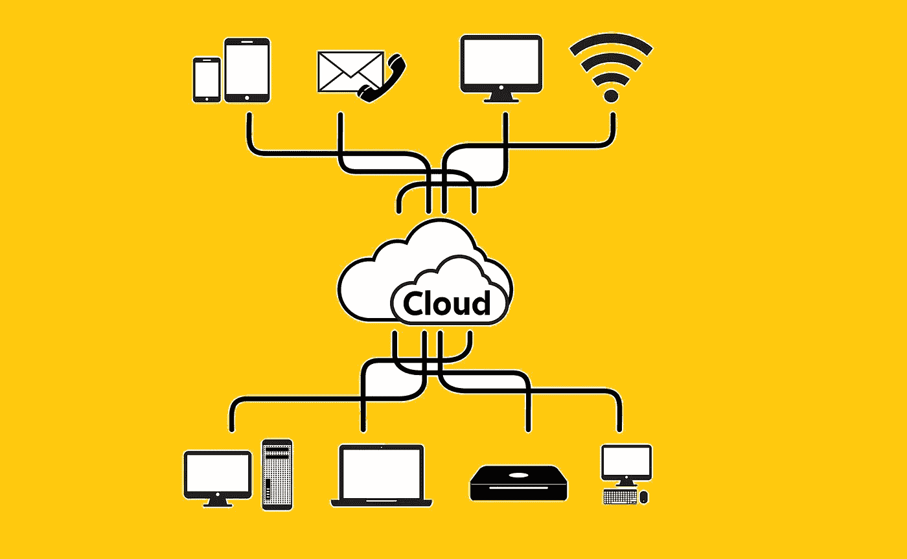
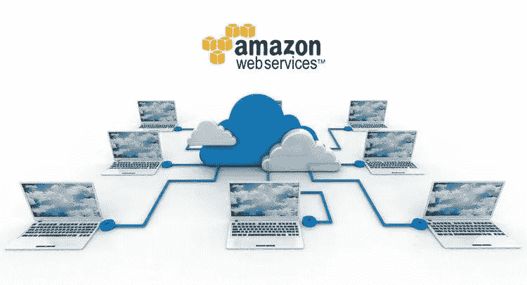
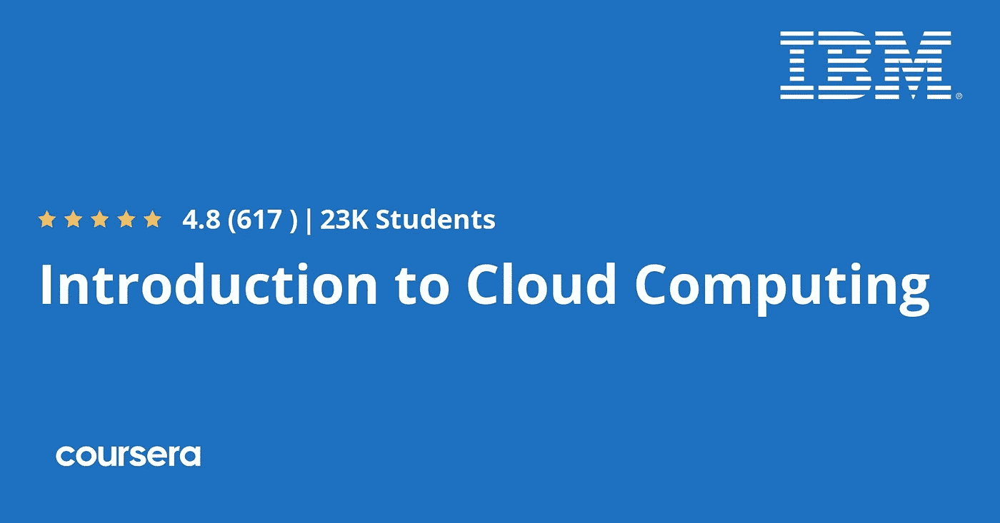
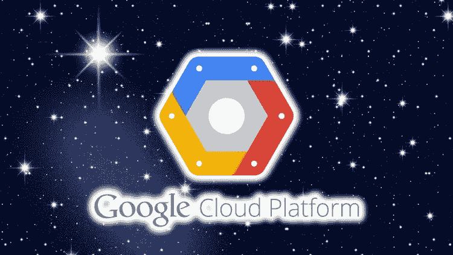
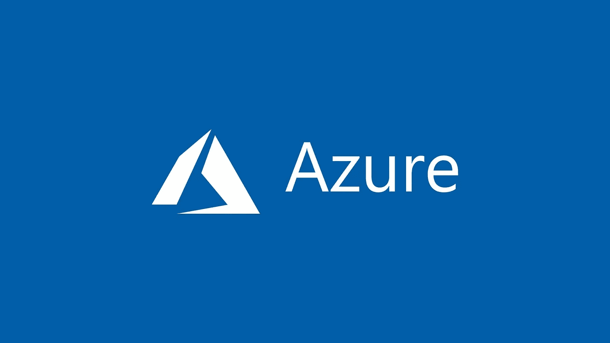
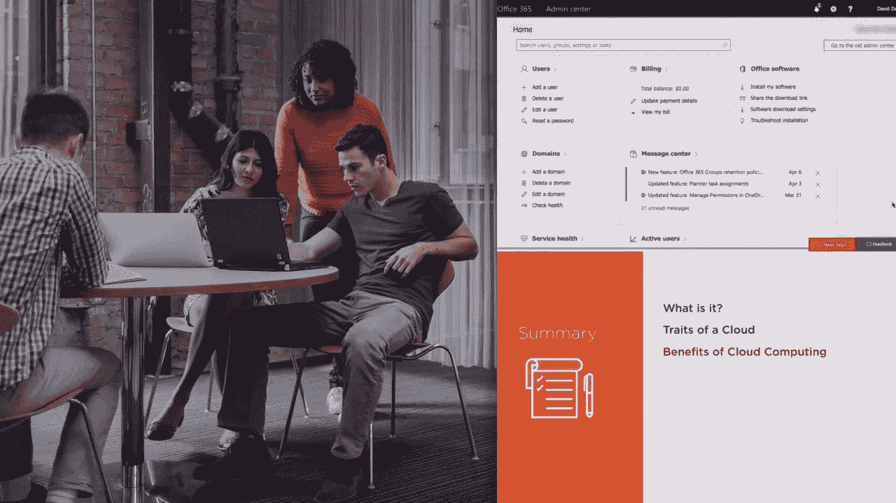
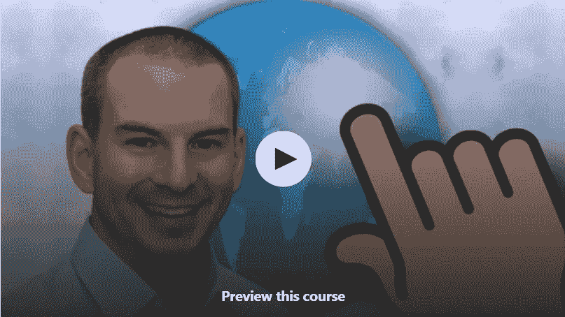
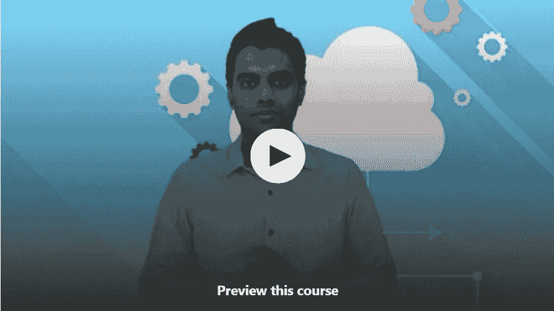
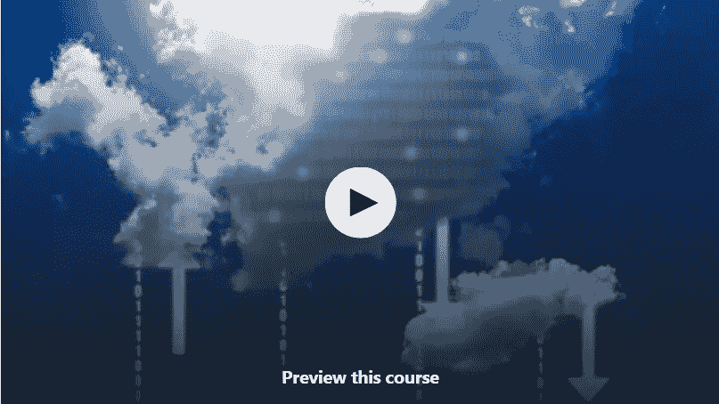

# 2023 年初学者学习云计算的 10 门最佳免费课程

> 原文：<https://medium.com/javarevisited/10-free-courses-to-learn-cloud-computing-for-beginners-4f3cd984ddb1?source=collection_archive---------0----------------------->

## 我最喜欢的免费在线课程，用于学习 AWS、Azure 和来自 Udemy、Coursera、Edureka 和 Youtube 的谷歌云平台的初学者

image_credit — udemy

你好，如果你想在 2023 年学习云计算(这真的很棒！！)并寻找最好的免费资源(如在线课程)来启动您的云计算之旅，那么您来对地方了。前面我已经分享过 [**免费课程学习 AWS**](/javarevisited/10-free-courses-to-crack-aws-sysops-administrator-associate-certification-exam-so1-c01-20fc02c9471e) 、**[**Google Cloud**](/javarevisited/7-free-online-courses-to-crack-google-cloud-associate-cloud-engineer-ace-certification-exam-in-2cf0b297aed)、 [**微软 Azure**](/javarevisited/my-favorite-free-microsoft-azure-cloud-courses-for-beginners-to-learn-in-2020-3418524bb531) ，今天我要分享的是 f *ree 云计算初学者课程*。**

**云计算通过互联网提供对计算资源(如 CPU、存储、网络、安全、分析和其他软件平台)的访问，并允许任何人部署应用程序来按需利用这些服务，由于规模经济，成本要低得多。**

**这种对计算资源更容易的访问推动了创新，越来越多的公司正在向云迁移。最终，每个人都希望专注于他们的业务，将基础设施和计算留给像谷歌、微软和亚马逊这样的人来管理，他们肯定能做得更好。**

**[云计算](/javarevisited/5-best-cloud-computing-courses-to-learn-in-2020-f5f091159401)是现代开发人员的一项基本技能，因为大多数新开发都发生在云上，并且将会发生在云中。**

**如果您不熟悉云的工作方式以及基本的云概念和术语，如 IaaS、PaaS、SaaS、计算、存储、网络等，那么您就有落后的风险。**

**现在，每个 It 专业人员都必须学习云计算，这对于全栈开发人员**[**系统管理员**](/javarevisited/7-best-aws-sysops-administrator-associate-certification-practice-test-mock-exams-and-dumps-3578d07e4f5b)[**devo PS 工程师**](https://javarevisited.blogspot.com/2018/09/10-devops-courses-for-experienced-java-developers.html#axzz6cRYpiwdu) 以及其他与基础设施和代码密切相关的人员来说更为重要，但对于项目经理、解决方案架构师、业务分析和销售人员来说同样重要，这就是这些免费云计算课程将帮助您的地方。****

****如果你现在还不确定*什么是云计算*那么就把它想象成亚马逊或微软的电脑，在那里你运行你的应用程序。它是您租用来运行服务的提供商的数据中心。****

****用更专业的术语来说，云计算是由一些公司提供的软件和硬件的组合，如[亚马逊网络服务](https://javarevisited.blogspot.com/2019/08/top-5-free-aws-solution-architect-Associate-certification-dumps-practice-questions.html) ( AWS)、[谷歌云](/javarevisited/5-best-courses-to-learn-google-cloud-platform-gcp-in-2021-169093a3771a)和[微软 Azure](/javarevisited/10-best-microsoft-azure-courses-for-beginners-and-experienced-developers-d41a454834c0) ，为那些希望部署他们的解决方案或在线服务并可以随时随地使用这些数据的公司托管文件和数据。

云计算工程师的需求量很大，你可以通过在平台上参加一些在线课程，如 [Udemy](/javarevisited/100-free-programming-and-web-development-courses-on-udemy-free-resource-center-3f8415eb5e6f) 、 [Coursera](/javarevisited/18-coursera-courses-you-can-join-in-2020-to-learn-from-the-worlds-top-tech-companies-google-74af46967d1e?source=collection_home---4------0-----------------------) 、 [Pluralsight](/javarevisited/top-10-pluralsight-courses-to-learn-programming-and-software-development-during-covid-19-stay-at-30b7d8a4f88f) 、 [edX](/javarevisited/10-free-best-edx-certifications-and-courses-to-learn-online-3473d466f968) 等，学习运行云计算、管理他们、保护你的数据等技能。这篇文章提出了 2023 年学习云计算的最佳免费课程，敬请关注。****

****顺便说一句，如果你是一名 Java 开发人员，想从 Java 开发人员的角度了解更多关于分布式系统和云计算的知识，那么我也推荐你加入 Udemy 上 Michael Pogrebinsky 的 [**分布式系统&带 Java 的云计算**](https://click.linksynergy.com/deeplink?id=JVFxdTr9V80&mid=39197&murl=https%3A%2F%2Fwww.udemy.com%2Fcourse%2Fdistributed-systems-cloud-computing-with-java%2F) 课程。这不是免费的，但你可以在优购上花 9.9 美元买到。****

**** [## 使用 Java 的分布式系统和云计算

### Michael Pogrebinsky 是一名经验丰富的软件工程师和软件架构师。在他的职业生涯中，他…

udemy.com](https://click.linksynergy.com/deeplink?id=JVFxdTr9V80&mid=39197&murl=https%3A%2F%2Fwww.udemy.com%2Fcourse%2Fdistributed-systems-cloud-computing-with-java%2F) 

# 2023 年学习云计算的 10 门免费在线课程(AWS、GCP 和 Azure)

为了不浪费你更多的时间，这里列出了 2023 年学习云计算的免费在线课程。该列表包括学习云计算的课程，包括最受欢迎的三个云平台 [AWS](/javarevisited/5-best-aws-courses-for-beginners-and-experienced-developers-to-learn-in-2021-563212409fbd) 、 [GCP](/javarevisited/5-best-courses-to-learn-google-cloud-platform-gcp-in-2021-169093a3771a) 和[微软 Azure](/javarevisited/10-best-microsoft-azure-courses-for-beginners-and-experienced-developers-d41a454834c0) 。

这些免费课程是从 [Udemy](/javarevisited/15-best-udemy-courses-programmers-can-buy-on-black-friday-and-cyber-monday-2020-a803874f41d9) 、 [Coursera](/javarevisited/18-coursera-courses-you-can-join-in-2020-to-learn-from-the-worlds-top-tech-companies-google-74af46967d1e?source=collection_home---4------0-----------------------) 和 [Pluralsight](/javarevisited/top-10-pluralsight-courses-to-learn-programming-and-software-development-during-covid-19-stay-at-30b7d8a4f88f) 中挑选出来的。它们是由专家创建的，出于教育和营销目的免费提供，虽然它们不是很全面，但它们非常适合初学者开始学习基本的云计算概念以及云计算的一般工作方式。

## 1.[使用亚马逊网络服务的云计算](https://click.linksynergy.com/deeplink?id=JVFxdTr9V80&mid=39197&murl=https%3A%2F%2Fwww.udemy.com%2Fcourse%2Fcloud-computing-with-amazon-web-services-part-1%2F)【免费】

让我们从亚马逊 AWS 课程开始吧，它被认为是网飞、Linkedin 和 Twitch 等大公司中最受欢迎的云服务提供商。这个免费课程几乎有 3 个小时的视频内容，超过 5k 的注册人数。

本课程从介绍 AWS 服务开始，然后转到实践课程，您将学习如何创建用于托管您的 web 应用程序的 EC2 实例。然后，你将了解 S3 云存储，你把你的文件和数据放在云端。

您还将学习管理用户和组、配置云基础设施、使用 amazon SES 发送电子邮件等等。

**这是加入本课程的链接** — [使用亚马逊网络服务的云计算](https://click.linksynergy.com/deeplink?id=JVFxdTr9V80&mid=39197&murl=https%3A%2F%2Fwww.udemy.com%2Fcourse%2Fcloud-computing-with-amazon-web-services-part-1%2F)

****

## ****2.[云计算介绍](https://coursera.pxf.io/c/3294490/1164545/14726?u=https%3A%2F%2Fwww.coursera.org%2Flearn%2Fintroduction-to-cloud)【免费 Coursera 课程】****

****如果你只是想从理论上而不是实践上学习云计算，那么你可能需要看看这个关于 Coursera 平台上云计算的 IBM 入门课程。该课程有近 15，000 名学生注册，是系列课程的一部分。

本课程从了解云计算的发展以及云上不同类型的部署模型(如 Saas、Iaas、Paas)开始。****

****然后你会看到云计算架构和虚拟化，比如虚拟机，还有[无服务器计算](/javarevisited/7-best-serverless-and-aws-lambda-courses-to-learn-in-2021-de1820111c85)和[微服务](/javarevisited/5-best-courses-to-learn-spring-cloud-and-microservices-1ddea1af7012)。最后，一些关于云安全的课程，比如身份、访问管理和云加密。****

****这里是加入这个免费课程的链接— [**云计算简介**](https://coursera.pxf.io/c/3294490/1164545/14726?u=https%3A%2F%2Fwww.coursera.org%2Flearn%2Fintroduction-to-cloud)****

********

****但是为什么当参加审计专业的免费课程时，你将不会得到任何证书。如果您参加本课程是为了获得 Coursera 证书，那么您需要注册专业化或参加订阅计划，如 [**Coursera Plus**](https://coursera.pxf.io/c/3294490/1164545/14726?u=https%3A%2F%2Fwww.coursera.org%2Fcourseraplus) 提供 5000 多个 Coursera 课程、项目和专业证书的无限制访问。****

**** [## Coursera Plus |无限制访问 7，000 多门在线课程

### 用 Coursera Plus 投资你的职业目标。无限制访问 90%以上的课程、项目…

coursera.pxf.io](https://coursera.pxf.io/c/3294490/1164545/14726?u=https%3A%2F%2Fwww.coursera.org%2Fcourseraplus)**** 

## ****3. [GCP —谷歌云平台概念](https://click.linksynergy.com/deeplink?id=JVFxdTr9V80&mid=39197&murl=https%3A%2F%2Fwww.udemy.com%2Fcourse%2Fgcp-google-cloud-platform-concepts%2F)【Udemy 免费课程】****

****另一个非常著名的云计算服务叫做谷歌云平台，它和 GCP 以及 Spotify 和 Snapchat 等大公司一样出名。这门课程可能是 Udemy 上最好的免费课程，有 6 个小时的视频内容，学生注册人数超过 41k，相当不错。

从了解谷歌云平台的基础开始，比如存储服务以及数据库和计算服务。****

****然后，您将开始探索 GCP 界面，如 shell、SDK、控制台等等。接下来，您将开始使用计算服务并创建一个实例，以及云存储和 SQL 数据库、网络服务和平台管理。****

******这里是免费参加本课程的链接**——[谷歌云平台概念](https://click.linksynergy.com/deeplink?id=JVFxdTr9V80&mid=39197&murl=https%3A%2F%2Fwww.udemy.com%2Fcourse%2Fgcp-google-cloud-platform-concepts%2F)****

********

## ****4.[学习微软 Azure](https://click.linksynergy.com/deeplink?id=JVFxdTr9V80&mid=39197&murl=https%3A%2F%2Fwww.udemy.com%2Fcourse%2Fmaruti-microsoft-azure-step-by-step-part-1%2F)【Udemy 免费课程】****

****正如我前面提到的，有许多云服务有着良好的声誉，其中之一就是微软 Azure。这个免费的小型课程介绍了如何使用这项服务，并熟悉其服务和基础设施。

该课程非常小，只有一个小时的视频内容，将首先向您介绍这项云服务，以及在开始使用它之前您需要了解的关于 [Microsoft Azure](/javarevisited/5-best-azure-fundamentals-courses-to-pass-az-900-certification-exam-in-2020-9e602aea035d) 的信息。****

****然后，您将了解数据中心和区域，以及一些实践课程，如创建 [SQL 数据库](/hackernoon/top-5-sql-and-database-courses-to-learn-online-48424533ac61)服务和 SQL 地理复制。您还将创建并配置 windows 虚拟机。****

******这里是加入这个免费 Azure 课程的链接**——[学习微软 Azure](https://click.linksynergy.com/deeplink?id=JVFxdTr9V80&mid=39197&murl=https%3A%2F%2Fwww.udemy.com%2Fcourse%2Fmaruti-microsoft-azure-step-by-step-part-1%2F)****

********

## ****5.[云计算基础](https://pluralsight.pxf.io/c/1193463/424552/7490?u=https%3A%2F%2Fwww.pluralsight.com%2Fcourses%2Fcloud-computing-fundamentals)【多视角免费课程】****

****如果你真的想从理论上学习云计算，并学习运行在云上的云技术，如 AWS、GCP、Azure，那么你需要看看这个 Pluralsight 课程。****

****该课程是为初学者设计的，大约有 2 个小时的视频内容。从了解一些基础知识开始，比如使用云计算的好处以及这项技术背后的风险。****

****以下是您将在本课程中学到的主要内容:****

1.  ****基础设施即服务****
2.  ****私有云、混合云和公共云****
3.  ****如何迁移到云****
4.  ****网络、安全性和云存储****
5.  ****平台即服务(PaaS)****
6.  ****软件即服务(SaaS)****

****您还将学习部署模型类型，如基础架构即服务 Iaas 及其组件，如虚拟化和定价模型。然后，您将学习云中的存储以及安全性和加密。****

****以下是加入本云计算课程的链接— [云计算基础](https://pluralsight.pxf.io/c/1193463/424552/7490?u=https%3A%2F%2Fwww.pluralsight.com%2Fcourses%2Fcloud-computing-fundamentals)****

********

****顺便说一下，你需要一个 [Pluralsight 会员](https://javarevisited.blogspot.com/2019/10/udemy-vs-pluralsight-review-which-is-better-to-learn-code.html)才能加入这个课程，费用大约是每月 29 美元或每年 299 美元(14%的折扣)。我向所有程序员强烈推荐这个订阅，因为它提供了超过 7000 个在线课程的即时访问，以学习任何技术技能。或者，你也可以使用他们的 [**10 天免费通行证**](https://pluralsight.pxf.io/c/1193463/424552/7490?u=https%3A%2F%2Fwww.pluralsight.com%2Flearn) 免费观看这个课程。****

**** [## 对个人来说

### 无论你想进入一个新的领域，改善你的角色，还是把你的伟大想法变成现实，Pluralsight…

pluralsight.pxf.io](https://pluralsight.pxf.io/c/1193463/424552/7490?u=https%3A%2F%2Fwww.pluralsight.com%2Flearn) 

顺便说一句，这个月所有的 plur sight 课程都是免费的，因为他们正在进行免费的四月优惠，这意味着最好的时间来检查 plur sight 课程。**** 

## ****6.[云计算实用介绍](https://click.linksynergy.com/deeplink?id=JVFxdTr9V80&mid=39197&murl=https%3A%2F%2Fwww.udemy.com%2Fcourse%2Fintroduction-cloud-computing%2F)【免费资源】****

****这是另一个免费的 Udemy 课程，从头开始学习云计算。与其他课程不同，本课程为您提供了云计算的实用介绍。你会准确地知道什么是云，什么不是。****

****本课程旨在消除对云计算的许多误解，并为您提供清晰易懂的解释，具体说明云计算是什么、如何工作、可用的不同选项、提供的优势以及成本。****

****这个 *2.5 小时的免费云计算课程*分为几个模块，每个模块侧重于关键知识领域。****

****以下是您将在本课程中学到的内容:****

1.  ****了解云计算与传统 IT 部署模式有何不同****
2.  ****了解云计算的构建模块****
3.  ****定义 IaaS、PaaS、SaaS 和 XaaS，了解它们之间的区别****
4.  ****了解 IaaS 选项，包括共享物理服务器上的虚拟机、专用服务器上的虚拟机和专用裸机服务器****
5.  ****如何在[亚马逊网络服务](/javarevisited/5-best-aws-courses-for-beginners-and-experienced-developers-to-learn-in-2021-563212409fbd?source=rss-bb36d8439904------2&utm_source=dlvr.it&utm_medium=linkedin)上部署虚拟机****
6.  ****如何在 IBM Bluemix PaaS 上部署应用程序****
7.  ****了解云计算相对于传统部署模式的优势****

****总的来说，这是学习云计算的一个很好的免费课程，适合任何决策者或 IT 专业人士，他们需要一个易于理解的云计算解释。****

******这里是加入本课程的链接**——[云计算实用介绍](https://click.linksynergy.com/deeplink?id=JVFxdTr9V80&mid=39197&murl=https%3A%2F%2Fwww.udemy.com%2Fcourse%2Fintroduction-cloud-computing%2F)****

********

## ****7.[AWS 云计算介绍](https://click.linksynergy.com/deeplink?id=JVFxdTr9V80&mid=39197&murl=https%3A%2F%2Fwww.udemy.com%2Fcourse%2Fintroduction-to-aws-cloud-computing%2F)【免费】****

****这是一个简短的免费在线课程，学习 Udemy 上 AWS 上的云计算。由 Alan Rodrigues 创建，他是一位软件工程的传道者，也是我最喜欢的 Udemy 导师之一，拥有许多云认证，这是了解 AWS 和云计算的最佳途径。****

****本课程旨在向学生介绍亚马逊网络服务。以下是您将在本课程中学到的内容****

*   ****什么是云计算？****
*   ****AWS 云****
*   ****虚拟私有云****
*   ****弹性计算云服务****
*   ****简单存储服务****
*   ****[DynamoDB](/javarevisited/7-best-aws-s3-and-dynamodb-courses-for-beginners-in-2021-a8a44b6066da)****
*   ****Lambda 计算服务****
*   ****弹性豆茎服务****
*   ****Opswork 服务****
*   ****云的形成****

****总的来说，这是一个非常棒的免费课程，适合希望了解 AWS 云并了解 AWS 中一些可用服务的 IT 专业人员****

******这里是加入这个免费课程的链接**—[AWS 云计算简介](https://click.linksynergy.com/deeplink?id=JVFxdTr9V80&mid=39197&murl=https%3A%2F%2Fwww.udemy.com%2Fcourse%2Fintroduction-to-aws-cloud-computing%2F)****

********

## ****8.[云计算:技术要领](https://click.linksynergy.com/deeplink?id=JVFxdTr9V80&mid=39197&murl=https%3A%2F%2Fwww.udemy.com%2Fcourse%2Fcloud-computing-the-technical-essentials%2F)【免费课程】****

****这是另一个从技术角度学习云计算基础知识的很棒的课程，而且在 Udemy 上完全免费。****

****以下是您将在本课程中学到的内容:****

1.  ****虚拟化、网络、数据中心、存储、加密的基础知识****
2.  ****什么是云计算？****
3.  ****部署模式:公共云、私有云和混合云****
4.  ****服务模式:IaaS、PaaS 和 SaaS****
5.  ****公共云示例:AWS 及其提供的服务****

****本课程向您传授学习云计算之前所需的技术基础。它还向您介绍了云计算和云计算服务的概念。****

****总的来说，对于从未从事过云计算的学生和专业人士来说，这是一门很好的课程。****

******这里是免费参加本课程的链接**——[云计算:技术要点](https://click.linksynergy.com/deeplink?id=JVFxdTr9V80&mid=39197&murl=https%3A%2F%2Fwww.udemy.com%2Fcourse%2Fcloud-computing-the-technical-essentials%2F)****

********

## ****9.11 小时云计算全课程|初学者云计算教程| Edureka****

****这是一个免费的、全面的、长达 10 小时的课程，面向初学者学习云计算，由专门从事在线课堂培训的领先在线学习平台 [**Edureka**](https://click.linksynergy.com/deeplink?id=JVFxdTr9V80&mid=42536&murl=https%3A%2F%2Fwww.edureka.co%2F&LSNSUBSITE=LSNSUBSITE) 提供。****

****该课程在 Youtube 上免费提供。在这种云计算中，完整的课程将带您更深入地了解云服务和部署模型等概念，并涵盖 [AWS](/javarevisited/7-best-aws-sysops-administrator-associate-certification-practice-test-mock-exams-and-dumps-3578d07e4f5b) 、 [Microsoft Azure](/javarevisited/7-free-microsoft-azure-fundamentals-az-900-online-courses-for-beginners-in-2021-efd01d8be403) 和 [GCP](/javarevisited/my-favorite-free-google-cloud-platform-gcp-professional-cloud-developer-certification-courses-856ef69a56bb) 的基础知识和实际实施。本指南将涵盖以下几点****

****你可以在 Youtube 上看或者在这里看-****

## ****10.[使用 Azure 从零到英雄的云计算基础知识](https://click.linksynergy.com/deeplink?id=JVFxdTr9V80&mid=39197&murl=https%3A%2F%2Fwww.udemy.com%2Fcourse%2Fcloud-computing-essentials-with-microsoft-azure%2F)****

****这是另一个学习云计算的免费课程，但使用的是微软 Azure 平台。不过，我建议你在使用 Azure 或 AWS 之前先学习云计算概念。****

****一旦你对云或云计算概念有了坚实的理解，并开始使用 [AWS](https://javarevisited.blogspot.com/2020/09/top-10-aws-certifications-for-cloud-professionals.html) 、Azure 或 Google Cloud，你就会了解自动伸缩、弹性负载平衡器、区域和可用性区域等功能的真正要点。****

****在这门免费课程中，你将了解到**云计算基础**和核心概念，这些在你学习和使用任何云平台之前都是非常重要的。****

****在这门免费课程中，您将学到以下内容:****

1.  ****什么是云？NIST 如何帮助重新定义云？****
2.  ****为什么学习云计算很重要？****
3.  ****有哪些不同的云部署模式(公共云、私有云以及混合云)****
4.  ****公共云、私有云和混合云的主要优势****
5.  ****什么是云计算服务模式(IaaS、PaaS 和 SaaS)？****

****总的来说，这是一门吸引人的课程，适合任何想学习云计算概念的人。****

******这里是了解本课程更多信息的链接**—[Azure 云计算基础知识零到英雄](https://click.linksynergy.com/deeplink?id=JVFxdTr9V80&mid=39197&murl=https%3A%2F%2Fwww.udemy.com%2Fcourse%2Fcloud-computing-essentials-with-microsoft-azure%2F)****

********

****2023 年初学者学习的**免费云计算课程到此结束。这些免费的在线课程可能是你在云计算行业开始职业生涯的最佳课程，或者只是如果你要从理论上学习这些技术如何工作以及它们对当今数字世界的好处。******

****完成其中一门课程后，您将熟悉基本的 Cloud concerts，并了解云是如何工作的，以及如何使用不同的云服务来构建和部署您的解决方案。****

> ****乌云在这里停留。对于每个 It 专业人员来说，理解云计算是非常重要的。****

****祝您的云计算之旅一切顺利。****

****其他**你可能喜欢的云计算资源******

*   ****[面向 Java 开发人员的五大 AWS 和云课程](https://javarevisited.blogspot.com/2020/05/top-5-cloud-courses-for-java-and-spring-boot-developers.html)****
*   ****[面向初学者的 5 门免费 Salesforce 云课程](https://www.java67.com/2020/07/top-5-free-courses-to-learn-salesforce.html)****
*   ****[通过谷歌助理云工程师认证的前 5 门课程](https://javarevisited.blogspot.com/2019/07/top-5-google-cloud-platform-gcp-courses-certifications-online.html)****
*   ****[我最喜欢的深入学习 AWS 的课程](/javarevisited/top-10-courses-to-learn-amazon-web-services-aws-cloud-in-2020-best-and-free-317f10d7c21d)****
*   ****[成为 AWS 解决方案架构师专家的前 5 门课程](https://javarevisited.blogspot.com/2020/04/top-5-course-to-crack-aws-solution-architect-professional-sap-c01-certification-exam.html)****
*   ****[破解 AWS 认证开发人员助理考试的 5 大课程](https://javarevisited.blogspot.com/2020/05/top-5-courses-to-crack-aws-certified-developer-associate-certification-exam.html)****
*   ****[如何破解 2023 年 AZ-900 认证](https://javarevisited.blogspot.com/2020/04/how-to-crack-microsoft-azure-fundamentals-certification-az-900-exam.html)****
*   ****[2023 年如何通过 AZ-103 认证](https://javarevisited.blogspot.com/2020/04/how-to-crack-microsoft-az-103-azure-administrator-associate-exam-certification.html)****
*   ****[学习 Docker 和 Kubernetes 的十大课程](https://dev.to/javinpaul/top-10-courses-to-learn-docker-and-kubernetes-for-programmers-4lg0)****
*   ****[成为 AWS DevOps 工程师专家的 5 门课程](https://javarevisited.blogspot.com/2020/04/top-5-course-to-crack-aws-certified-devops-engineer-professional-exam-certification.html)****
*   ****[破解 AWS 解决方案架构师助理认证的前 5 门课程](https://javarevisited.blogspot.com/2019/05/top-5-courses-to-crack-aws-solutions-architect-associate-certification-exam-SAA-C01.html#axzz5rHwAwycj)****
*   ****[初学者和有经验的开发人员学习 AWS 的 5 大课程](https://javarevisited.blogspot.com/2020/05/top-5-amazon-web-services-aws-courses-for-beginners-and-experienced-programmers.html)****
*   ****[破解 AWS DevOps 工程师考试的前 5 门课程](https://javarevisited.blogspot.com/2020/04/top-5-course-to-crack-aws-certified-devops-engineer-professional-exam-certification.html)****
*   ****[10 门学习数据结构和算法的免费课程](http://www.java67.com/2019/02/top-10-free-algorithms-and-data.html)****
*   ****[程序员前 5 名 AZ-900 模拟测试](https://javarevisited.blogspot.com/2020/02/top-5-AZ-900-exam-Azure-Fundamentals-certification-practice-tests-and-mock-exams-to.html)****
*   ****[学习亚马逊网络服务的 5 门免费课程](https://www.java67.com/2018/05/top-5-amazon-web-services-or-aws-courses-to-learn-online.html)****
*   ****[5 次免费的 AWS 解决方案架构师助理实践测试、转储和模拟考试](https://javarevisited.blogspot.com/2019/08/top-5-free-aws-solution-architect-Associate-certification-dumps-practice-questions.html)****
*   ****[破解 Azure 云架构师(AZ-300)考试的前 5 门课程](https://javarevisited.blogspot.com/2019/07/top-5-courses-to-crack-azure-architecture-technologies-certification-az-300-exam.html#axzz6E6VuRMsx)****

****感谢您阅读本文。如果你喜欢这些*免费的云计算课程*，那么请分享给你的朋友和同事。如果您有任何问题或反馈，请留言。

**附言** —如果你真的想深入学习云计算，并且不介意花点钱，那么我也建议你参加由 Neal Davis 在 Udemy 上开设的[**AWS 云计算简介**](https://click.linksynergy.com/deeplink?id=JVFxdTr9V80&mid=39197&murl=https%3A%2F%2Fwww.udemy.com%2Fcourse%2Fintroduction-to-cloud-computing-on-amazon-aws-for-beginners%2F) **课程**。这是一门综合性课程，有 8 个小时的内容来学习云计算基础知识。****

**** [## 面向初学者的亚马逊 AWS 云计算介绍

### 亚马逊 AWS 上的云计算介绍课程将带您从 AWS 基础知识到成为合格的 AWS 云…

udemy.com](https://click.linksynergy.com/deeplink?id=JVFxdTr9V80&mid=39197&murl=https%3A%2F%2Fwww.udemy.com%2Fcourse%2Fintroduction-to-cloud-computing-on-amazon-aws-for-beginners%2F)****