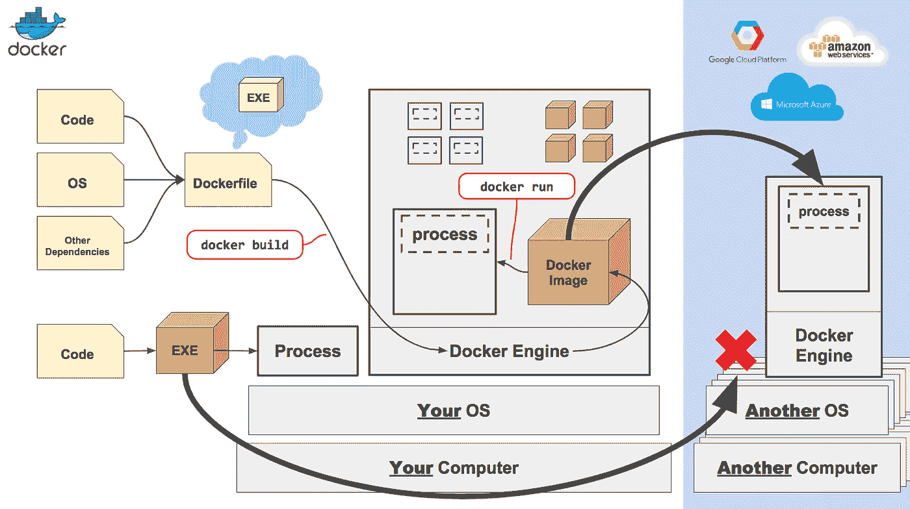
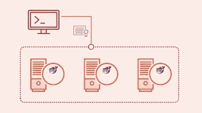
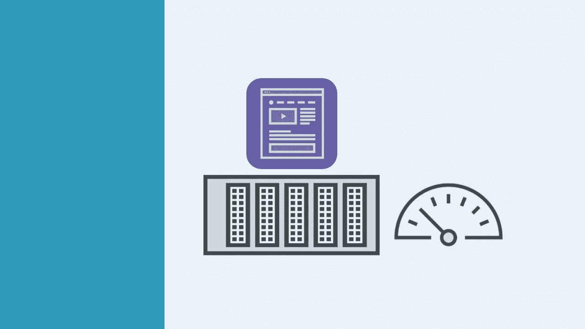
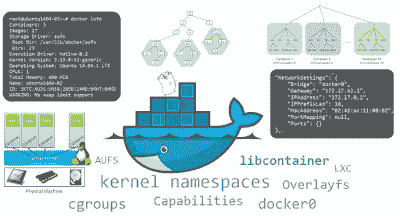
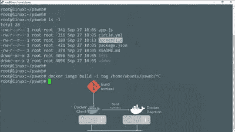
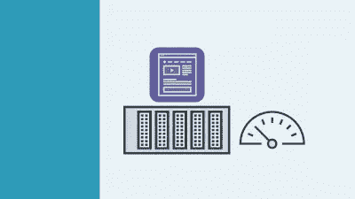

# 我最喜欢的 2023 年前端开发者学习 Docker 和 DevOps 的免费课程

> 原文：<https://medium.com/javarevisited/10-free-courses-to-learn-docker-and-devops-for-frontend-developers-691ac7652cee?source=collection_archive---------0----------------------->

## 面向开发人员和 DevOps 专业人员的免费 Docker 课程精选列表

[**【Docker 和 Kubernetes:完全指南**](https://click.linksynergy.com/deeplink?id=JVFxdTr9V80&mid=39197&murl=https%3A%2F%2Fwww.udemy.com%2Fcourse%2Fdocker-and-kubernetes-the-complete-guide%2F)

随着软件开发(前端和后端)正在走向自动化，关于 Docker 的知识和经验可能对你的职业生涯非常有价值，尤其是在 2023 年。

如果你想在 2023 年学习 Docker 并寻找免费资源，那么你来对地方了。在过去，我已经分享了 [**最佳免费 Kubernetes 课程**](/javarevisited/7-free-online-courses-to-learn-kubernetes-in-2020-3b8a68ec7abc) 和 [**最佳免费 Linux 课程**](/javarevisited/top-10-courses-to-learn-linux-command-line-in-2020-best-and-free-f3ee4a78d0c0) ，在这篇文章中，我将为前端开发者和 DevOps 分享最佳免费 Docker 课程。

最新的统计数据和数字显示了一些惊人的数字，比如需要这些技能的工作比美国公共就业论坛上发布的大多数工作工资都高，专业人士的年薪可能高达 10 万美元。

这就是为什么你应该在 2023 年学习 Docker 并让你的职业生涯更上一层楼的确切原因。

我已经分享了一些免费的资源，比如书籍和课程，已经有一段时间了，如果你是第一次来这里，你可能想通过搜索框找到关于 [Java](http://javarevisited.blogspot.sg/2017/11/top-5-free-java-courses-for-beginners.html#axzz4zuIICRs9) 、 [Spring](http://www.java67.com/2017/11/top-5-free-core-spring-mvc-courses-learn-online.html) 、 [Kotlin](http://javarevisited.blogspot.sg/2018/02/5-courses-to-learn-kotlin-programming-java-android.html#axzz56R4AatoQ) 、 [DevOps](https://javarevisited.blogspot.com/2018/09/10-devops-courses-for-experienced-java-developers.html) 、 [Eclipse](http://www.java67.com/2018/02/5-free-eclipse-and-junit-online-courses-java-developers.html) 、 [Jenkins](http://www.java67.com/2018/02/6-free-maven-and-jenkins-online-courses-for-java-developers.html) 、 [Rails](http://www.java67.com/2018/02/5-free-ruby-and-rails-courses-to-learn-online.html) 、 [PHP 和 MySQL](http://www.java67.com/2018/02/5-free-php-and-mysql-courses-for-web-developers.html) 、[的免费在线课程](http://www.java67.com/2018/02/5-free-oracle-and-microsoft-sql-server-online-courses.html)

在这篇文章中，我将分享 **10 门免费的 Docker 课程**，你可以用它们来学习前端和后端应用程序的 Docker 和容器化。

顺便说一句，如果你不介意花几块钱学习像 Docker 这样有价值的东西，那么我也建议你看看 Udemy 上 Stephen Grider 的 [**Docker 和 Kubernetes:完整指南**](https://click.linksynergy.com/deeplink?id=JVFxdTr9V80&mid=39197&murl=https%3A%2F%2Fwww.udemy.com%2Fcourse%2Fdocker-and-kubernetes-the-complete-guide%2F) 。这是一门真正的宝石课程，你可以在 Udemy flash sales 上以 10 美元的价格买到。

 [## Docker 和 Kubernetes:完全指南

### 如果你厌倦了学习如何部署 web 应用程序，那么这就是适合你的课程。CI+CD…

udemy.com](https://click.linksynergy.com/deeplink?id=JVFxdTr9V80&mid=39197&murl=https%3A%2F%2Fwww.udemy.com%2Fcourse%2Fdocker-and-kubernetes-the-complete-guide%2F) 

正如我所说的，Docker 和容器是开发和交付应用程序和 IT 基础设施的全新方式，这里是我列出的一些前端开发人员可以用来学习 Docker 的免费课程。

# 2023 年初学者学习 Docker 和 DevOps 的 10 门免费课程

以下是我列出的 2023 年学习 Docker 的一些最好的免费课程。对于初学者和有经验的开发人员来说，它们都是极好的资源。

## [1。码头工人必备](https://click.linksynergy.com/deeplink?id=JVFxdTr9V80&mid=39197&murl=https%3A%2F%2Fwww.udemy.com%2Fdocker-essentials%2F)【免费】

如果你听说过 Docker 和 containers，并且想知道它们是什么以及如何开始使用它们，那么这个课程就是为你准备的。

在本课程中，您将学习如何安装 Docker，将其配置为在您的本地系统上使用，克隆和使用 Docker 映像，实例化容器，装载主机卷，重定向端口，并了解如何管理映像和容器。

完成课程后，你应该能够在你的项目/环境中实现容器，同时对它们的用例有一个牢固的理解，包括支持和反对。

以下是免费参加本课程的链接— [码头工人基础知识](https://click.linksynergy.com/deeplink?id=JVFxdTr9V80&mid=39197&murl=https%3A%2F%2Fwww.udemy.com%2Fdocker-essentials%2F)

简而言之，这是开发人员和 [DevOps 工程师](https://javarevisited.blogspot.com/2018/09/the-2018-devops-roadmap-your-guide-to-become-DevOps-Engineer.html)想要学习基础知识的最佳课程之一，比如 Docker 容器是什么以及如何在他们的环境中使用它们。

 [## 免费 Docker 教程- Docker 精要

### 本课程将带您踏上使用 Docker 生态系统的关键组件学习容器的美妙旅程。所有你…

www.udemy.com](https://www.udemy.com/course/docker-essentials/?LSNPUBID=JVFxdTr9V80&ranEAID=JVFxdTr9V80&ranMID=39197&ranSiteID=JVFxdTr9V80-kmz4d9P2ivqQ_gi7jLWJMA) 

## 2.[了解 Docker 并将其用于 Selenium 自动化](https://click.linksynergy.com/fs-bin/click?id=JVFxdTr9V80&subid=0&offerid=323058.1&type=10&tmpid=14538&RD_PARM1=https%3A%2F%2Fwww.udemy.com%2Funderstanding-docker-performing-selenium-automation%2F)

这是在为您的项目自动化 Selenium 测试用例时学习和理解 Docker 基础知识的又一个好课程。

该课程是专门为 DevOps 工程师、自动化人员、测试人员和开发人员设计的。

本课程分为三个主要部分:Docker 简介、Docker 构成和带有 Docker 的 Selenium Grid。

**这里是免费参加本课程的链接**——[了解 Docker 并将其用于 Selenium Automation](https://click.linksynergy.com/fs-bin/click?id=JVFxdTr9V80&subid=0&offerid=323058.1&type=10&tmpid=14538&RD_PARM1=https%3A%2F%2Fwww.udemy.com%2Funderstanding-docker-performing-selenium-automation%2F)

 [## 免费硒测试框架教程-了解 Docker 和使用它的硒…

### 理解 Docker 和使用它的硒自动化课程是以这样一种方式设计的，任何一个零…

udemy.com](https://click.linksynergy.com/fs-bin/click?id=JVFxdTr9V80&subid=0&offerid=323058.1&type=10&tmpid=14538&RD_PARM1=https%3A%2F%2Fwww.udemy.com%2Funderstanding-docker-performing-selenium-automation%2F) 

这三个部分是相互独立的，你可以并行学习或者来回切换。

## 3. [Docker 新手版【免费】](https://click.linksynergy.com/deeplink?id=JVFxdTr9V80&mid=39197&murl=https%3A%2F%2Fwww.udemy.com%2Fdocker-for-beginners%2F)

这是了解码头工人和集装箱化全局的最佳课程之一。如果你对虚拟化、[联网](http://javarevisited.blogspot.sg/2010/10/basic-networking-commands-in-linuxunix.html)和[云计算](http://javarevisited.blogspot.sg/2014/05/top-5-cloud-service-providers-companies-Java-IT-professional-know.html#axzz5B9NXhuQw)有所了解，那么你可以加入这个课程。

它很好地介绍了当前的软件发展趋势以及 Docker 所解决的问题。

简而言之，这对于[软件](https://javarevisited.blogspot.com/2019/03/5-courses-programmers-can-join-to-learn.html)和 [IT 架构师](https://javarevisited.blogspot.com/2018/02/5-must-read-books-to-become-software-architect-solution.html)，程序员，IT 管理员，以及任何想要了解 Docker 在当前世界应用程序开发中的角色的人来说都是一门很好的课程。

**这里是免费加入本课程的链接**——[Docker for 初学者](https://click.linksynergy.com/deeplink?id=JVFxdTr9V80&mid=39197&murl=https%3A%2F%2Fwww.udemy.com%2Fdocker-for-beginners%2F)

## 4.101 号集装箱

Docker 和 containers 是开发和交付应用程序和 IT 基础设施的全新方式。

本课程将涵盖 [Docker 和容器](http://www.java67.com/2019/03/5-free-devops-courses-to-learn-jenkins.html)、容器注册、容器编排、了解这是否适用于企业，以及如何为此做好准备。

简而言之，这是一门很好的课程，适合任何想要熟悉集装箱和[码头工人的人。](/javarevisited/top-5-free-courses-to-learn-docker-for-beginners-best-of-lot-b2b1ad2b98ad)

**这里是免费加入本课程的链接** — [集装箱 101](https://click.linksynergy.com/deeplink?id=JVFxdTr9V80&mid=39197&murl=https%3A%2F%2Fwww.udemy.com%2Fcontainers-101%2F)

## 5. [DevOps 要领](https://click.linksynergy.com/deeplink?id=JVFxdTr9V80&mid=39197&murl=https%3A%2F%2Fwww.udemy.com%2Flinux-academy-devops-essentials%2F)

你有没有想过 DevOps 是什么意思？它提供了什么好处，为什么要学习 DevOps？本课程 **DevOps Essentials** ，将教你关于 DevOps、“持续集成”、“构建自动化”和“编排”所需要知道的一切？那么[詹金斯](/javarevisited/top-10-free-courses-to-learn-maven-jenkins-and-docker-for-java-developers-51fa7a1e66f6)、 [Ansible](/javarevisited/top-10-courses-to-learn-devops-for-experienced-programmers-d93b666db151) 、 [Chef](https://javarevisited.blogspot.com/2021/11/top-5-online-courses-to-learn-chef-and-salt.html) 等工具呢？

本课程提供了每个人都需要了解的 DevOps 基础知识的基本介绍。涵盖上面列出的所有术语和工具，等等。我们设计本课程是为了让您了解什么是 DevOps，以及它如何影响现实世界中的 it。

这是 Udemy 早期的付费课程，但在有限的时间内是免费的。在它再次变得有报酬之前加入这个课程。

**这里是免费参加这个课程的链接**——[devo PS Essentials](https://click.linksynergy.com/deeplink?id=JVFxdTr9V80&mid=39197&murl=https%3A%2F%2Fwww.udemy.com%2Flinux-academy-devops-essentials%2F)

 [## 免费 DevOps 教程- DevOps 精要

### 你有没有想过 DevOps 是什么？您是否经常听到诸如“持续集成”、“构建自动化”等术语…

Udemyy.com](https://click.linksynergy.com/deeplink?id=JVFxdTr9V80&mid=39197&murl=https%3A%2F%2Fwww.udemy.com%2Flinux-academy-devops-essentials%2F) 

## 6.初学者码头工人

无论你是否是开发人员，任何从事代码或服务器工作的人都可以通过 Docker 的开放式应用构建平台提高他们的工作效率。

在本课程中， [**Docker for 初学者**](https://click.linksynergy.com/deeplink?id=JVFxdTr9V80&mid=39197&murl=https%3A%2F%2Fwww.udemy.com%2Fdocker-for-beginners%2F) 将帮助听众开始学习 Docker 容器。本课程将介绍 Docker 的不同概念，包括不同概念、关键字、命令和最佳实践的用法。

除了其他重要的课程之外，您还将学习如何使用图像和容器，如何让您的项目运行，以及如何将它推到云上。

## 7.[Windows 10 和 Server 2016 上的 Docker](https://click.linksynergy.com/fs-bin/click?id=JVFxdTr9V80&subid=0&offerid=323058.1&type=10&tmpid=14538&RD_PARM1=https%3A%2F%2Fwww.udemy.com%2Fdocker-on-windows%2F)

如果你想学习如何在 Windows 10 和 Windows Server 2016 上使用 Docker，那么这是适合你的课程。

在本课程中，您将了解 Windows 上的 Docker 是什么，以及 Windows 上的 Docker 如何与 [Linux 容器](https://dev.to/javinpaul/5-free-courses-to-learn-linux-for-beginners-367f)相同。

您还将深入学习 Hyper-V、名称空间隔离和服务器容器。

## 8.部署容器化应用程序技术概述

Docker 已经成为 Linux 操作系统中定义和运行容器的事实上的标准。Kubernetes 是 Red Hat 的容器编排选择，本课程[将教你如何在 RedHat Linux 中使用 Docker。](https://click.linksynergy.com/fs-bin/click?id=JVFxdTr9V80&subid=0&offerid=323058.1&type=10&tmpid=14538&RD_PARM1=https%3A%2F%2Fwww.udemy.com%2Fdeploying-containerized-applications-technical-overview%2F)

OpenShift 建立在 Docker、 [Kubernetes](/javarevisited/7-free-online-courses-to-learn-kubernetes-in-2020-3b8a68ec7abc) 和其他[开源软件项目的基础上，为在容器内部署应用程序提供了平台即服务(PaaS)。](http://www.java67.com/2018/02/top-10-open-source-frameworks-and-libraries-java-web-developers.html)

这是一门关于使用 Docker 的容器的红帽官方课程，Docker 运行在[红帽企业 Linux](http://javarevisited.blogspot.sg/2018/02/5-courses-to-learn-shell-scripting-in-linux.html) 上。

在本课程中，Red Hat Training 的课程架构师 Jim Rigsbee 将使用运行在 Red Hat Enterprise Linux 上的 Docker 向您介绍容器技术

## 9.码头深水潜水

顾名思义，这是一个非常[全面的课程](http://pluralsight.pxf.io/c/1193463/424552/7490?u=https%3A%2F%2Fwww.pluralsight.com%2Fcourses%2Fdocker-deep-dive)来深入学习 Docker。它为核心 Docker 技术提供了良好的体验，包括 Docker 引擎、图像、容器、注册表、网络、存储等等。

您还将学习理论，并且所有概念都在命令行上清楚地演示。

这个课程最棒的部分是不需要预先了解 [Docker](http://www.java67.com/2018/02/5-free-docker-courses-for-java-and-DevOps-engineers.html) 或 [Linux](http://www.java67.com/2018/02/5-free-linux-unix-courses-for-programmers-learn-online.html) 。

## 10.码头和集装箱:大图

在 t [他的课程](http://pluralsight.pxf.io/c/1193463/424552/7490?u=https%3A%2F%2Fwww.pluralsight.com%2Fcourses%2Fdocker-containers-big-picture)中，你将了解这将如何影响你个人以及你工作的团队和组织。

本课程将涵盖 [Docker](https://dzone.com/articles/top-10-docker-course-for-java-developers) 和容器、容器注册、容器编排、这些东西是否适合企业，以及如何为此做好准备。

这两门来自 Pluralsight 的课程并不是真正免费的；你需要一个 Pluralsight 会员资格才能获得这门课程，月会员费大约 29 美元，年会员费大约 299 美元。

我知道，我们都喜欢免费的东西，但是你不仅可以上这门课，还可以上 5000 多门课，所以这钱绝对花得值。

我有年度会员资格，因为我必须一直学习很多新东西。即使你不是会员，只要签下他们的 [**10 天免费试用**](http://pluralsight.pxf.io/c/1193463/424552/7490?u=https%3A%2F%2Fwww.pluralsight.com%2Flearn) 就可以免费获得这门课程，没有义务。

 [## 对个人来说

### Pluralsight 帮助个人学习者获得掌握最新软件开发所需的技术技能…

pluralsight.pxf.io](http://pluralsight.pxf.io/c/1193463/424552/7490?u=https%3A%2F%2Fwww.pluralsight.com%2Flearn) 

这就是为前端开发人员提供的一些免费 Docker 容器课程。如果你正在开发一个移动应用或网络应用，这是一个基本技能。因此，我建议每个应用开发者在 2023 年学习 Docker。

鉴于对 Docker 专家和懂 Docker 的开发者的大量需求，你不仅会学到一项基本技能，还会让你的职业生涯更上一层楼。

其他**免费在线课程**你可能喜欢探索
[5 门免费课程学习 Git 和 Github](http://javarevisited.blogspot.sg/2018/01/5-free-git-courses-for-programmers-to-learn-online.html#axzz568Oo1Jao)
[2023 DevOps 开发者路线图](https://hackernoon.com/the-2018-devops-roadmap-31588d8670cb?gi=1490c6cb9f25)
[5 门免费 Eclipse 和 JUnit 课程面向前端开发者](http://www.java67.com/2018/02/5-free-eclipse-and-junit-online-courses-java-developers.html)
[10 门 devo PS 课程面向高级开发者](https://javarevisited.blogspot.com/2018/09/10-devops-courses-for-experienced-java-developers.html)
[5 门免费在线培训课程学习 Angular](http://www.java67.com/2018/01/top-5-free-angular-js-online-courses-for-web-developers.html)
[10 门框架程序员可以在 2023 年学习【T19](https://dev.to/javinpaul/10-frameworks-java-and-web-developers-can-learn-in-2019-17ke)

## 结束语

感谢您阅读本文。你可能会想，有这么多东西要学，有这么多课程要参加，但你不需要担心。

很有可能你已经知道了大部分内容，你只需要温习一些概念。即使你不知道，这些免费课程也会对你有很大帮助。

我是 Udemy 课程的特别粉丝，不仅仅是因为当你购买任何非免费课程时我会赚到一些佣金，还因为它们非常实惠，并且以很少的金额提供很多价值，但是你可以自由选择你想要的课程。

说到底，你应该对这里提到的事情有足够的知识和经验。

祝你的 [DevOps](/javarevisited/the-10-best-devops-tools-for-2020-72e7c489342a) 和 Docker 之旅好运！当然**不会很容易**，但是通过遵循这个路线图和指南，你离成为你一直想成为的 [DevOps 工程师](/hackernoon/the-2018-devops-roadmap-31588d8670cb)又近了一步

如果你喜欢这篇文章，那么请考虑关注我的 medium ( [javinpaul](https://medium.com/u/bb36d8439904?source=post_page-----7ff2781fd6e0----------------------) )。如果你想在每篇新文章上得到通知，别忘了在 Twitter 上关注**[**javarevited**](https://twitter.com/javarevisited)！**

> **附:如果你不介意花几块钱学一些值得学的东西，那么斯蒂芬·格里德的《Docker 和 Kubernetes:完全指南》是我推荐的另一门课程。这不是免费的，如果你是一个非免费的课程，我也会得到报酬，但这是我在学习 Docker 时遇到的最好的课程之一。**

** [## Docker 和 Kubernetes:完全指南

### 如果你厌倦了学习如何部署 web 应用程序，那么这就是适合你的课程。CI+CD…

udemy.com](https://click.linksynergy.com/deeplink?id=JVFxdTr9V80&mid=39197&murl=https%3A%2F%2Fwww.udemy.com%2Fcourse%2Fdocker-and-kubernetes-the-complete-guide%2F)**