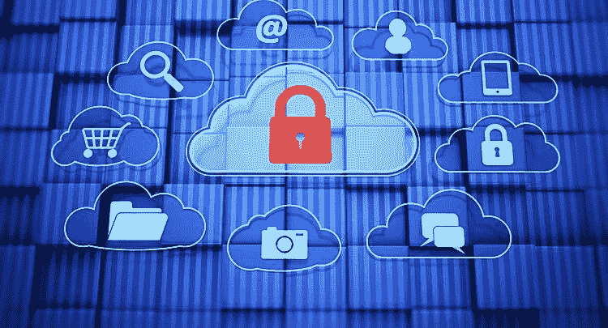
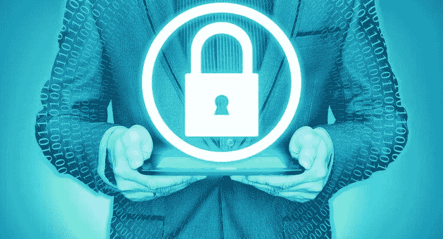
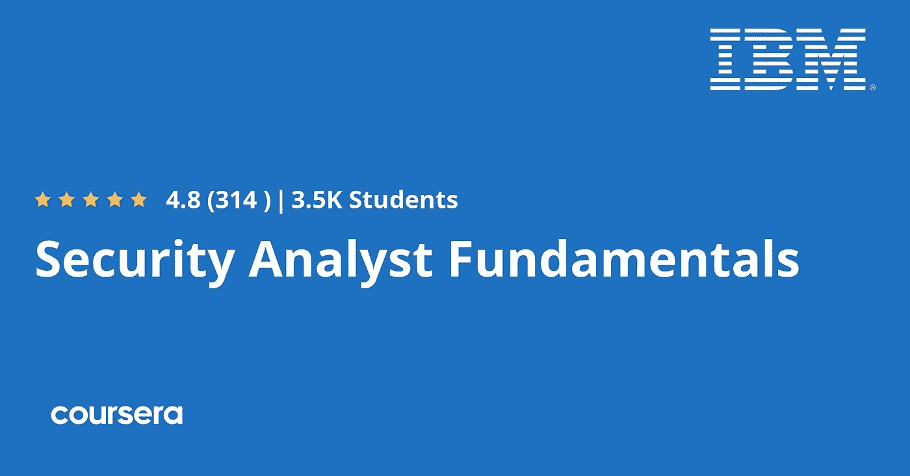
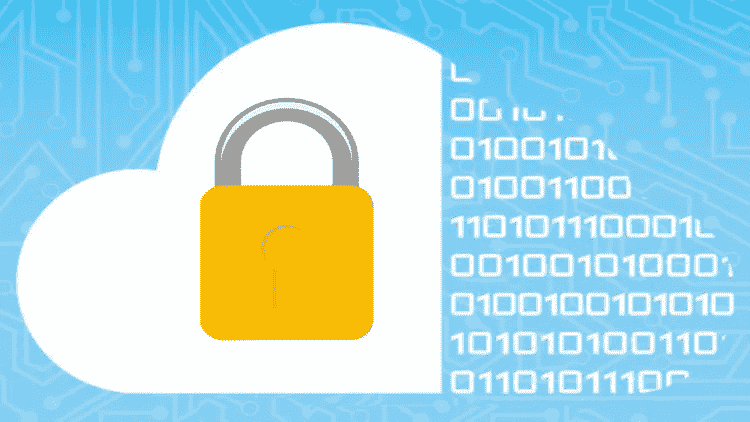
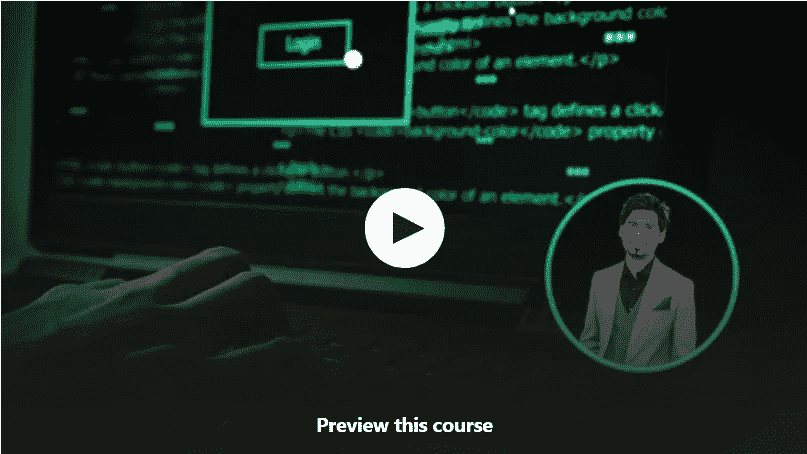

# 2023 年为初学者提供 10 门免费的道德黑客和渗透测试课程

> 原文：<https://medium.com/javarevisited/10-free-courses-to-learn-ethical-hacking-and-penetration-testing-for-beginners-84e40104aa6c?source=collection_archive---------0----------------------->

## 我最喜欢的免费资源，可以从 Udemy、edX、Coursera 和其他网站了解 2023 年在线道德黑客和钢笔测试。

你好伙计们，如果你想学习道德黑客和寻找免费资源，如在线培训课程和教程，那么你来对地方了。此前，我们已经分享了 [**最佳网络安全课程**](/javarevisited/7-best-cyber-security-courses-for-programmers-and-developers-50afafae050b) ，而今天，我们正在为你做分享免费的道德黑客课程。

我们大多数人对这个主题或行业有一点点了解，如果你在这个领域开始职业生涯，这将是理想的，但大多数人的问题是找到正确的课程或计划，帮助你掌握这些技能，成为这个领域的专业人士，点击这篇文章可能表明你对道德黑客感兴趣。

**道德黑客**有时也被称为[渗透测试](/javarevisited/7-best-comptia-pentest-certification-courses-and-practice-tests-46d827689cdc)是黑客利用系统内部漏洞的过程，该系统可能是 Windows、 [Linux](/javarevisited/7-best-linux-courses-for-developers-cloud-engineers-and-devops-in-2021-7415314087e1) 、macOS 等计算机，也可能是网站。

做这种事情的人被称为白帽黑客，因为他帮助组织找到他们的弱点并试图弥补它们，不像黑帽黑客试图利用这些弱点做非法的事情。

如果你想成为一名白帽黑客，并在这个领域开始职业生涯，那么你必须看看我在这篇文章中为你整理的免费课程。大部分都很实用，向你展示了如何使用真正的黑客工具来利用漏洞。

而且，如果你不介意花几块钱学习像道德黑客这样有价值的技能，那么我强烈推荐你参加 Udemy 上的 [**从头开始学习道德黑客**](https://click.linksynergy.com/deeplink?id=JVFxdTr9V80&mid=39197&murl=https%3A%2F%2Fwww.udemy.com%2Fcourse%2Flearn-ethical-hacking-from-scratch%2F) 课程。

<https://click.linksynergy.com/deeplink?id=JVFxdTr9V80&mid=39197&murl=https%3A%2F%2Fwww.udemy.com%2Fcourse%2Flearn-ethical-hacking-from-scratch%2F>  

这是从零开始学习道德黑客的最好的课程之一，已经有超过 400 人加入了这个令人敬畏的课程。这也是 Udemy 最畅销的道德黑客课程之一，有超过 93，000 条评论，平均评分为 4.6 分。

# 2023 年 10 门最佳免费道德黑客入门课程

在不浪费你更多时间的情况下，这里列出了 2023 年学习道德黑客的最佳免费在线课程。该列表包含来自 Udemy、Coursera、Pluralsight 和 edX 的免费在线课程。

## 1.[电脑黑客基础](https://click.linksynergy.com/deeplink?id=JVFxdTr9V80&mid=39197&murl=https%3A%2F%2Fwww.udemy.com%2Fcourse%2Fcomputer-hacking-fundamentals%2F)【免费】

如果你真的有兴趣在跳到实践课程之前开始学习道德黑客和事物是如何工作的，那么你需要看看这个免费的在线课程。本课程不到两个小时，将为您提供开始旅程所需的所有基础知识。

您将从介绍安全基础知识开始，例如什么是威胁、不同类型的黑客以及风险评估。然后转向恶意软件，以及黑客如何用这些恶意文件及其不同类型(如特洛伊木马、蠕虫和后门)感染系统。

您还将看到黑客在试图利用目标之前用来收集信息的工具。

**这里是加入本课程的链接**——[电脑黑客基础](https://click.linksynergy.com/deeplink?id=JVFxdTr9V80&mid=39197&murl=https%3A%2F%2Fwww.udemy.com%2Fcourse%2Fcomputer-hacking-fundamentals%2F)

## 2.[道德黑客——SQL 注入攻击](https://click.linksynergy.com/deeplink?id=JVFxdTr9V80&mid=39197&murl=https%3A%2F%2Fwww.udemy.com%2Fcourse%2Fsql-injection-ethical-hacking%2F)[免费]

SQL 注入可能是利用网站数据库最常用的技术，它使用恶意语句，并将它们插入 web 应用程序数据库以转储数据。本课程介绍了如何使用 SQL 注入工具开发网站。

您将从学习数据库攻击技术和这些工具的工作原理开始，然后开始使用 SQLMAP 工具来攻击一个演示网站，该工具是用来利用此漏洞的最著名的工具。

此外，您将看到如何利用一些网站的数据库，而不使用任何工具，只是插入一些查询到网站数据库。

以下是加入本课程的链接— [道德黑客— SQL 注入攻击](https://click.linksynergy.com/deeplink?id=JVFxdTr9V80&mid=39197&murl=https%3A%2F%2Fwww.udemy.com%2Fcourse%2Fsql-injection-ethical-hacking%2F)

## 3.[安全分析师基础](https://coursera.pxf.io/c/3294490/1164545/14726?u=https%3A%2F%2Fwww.coursera.org%2Fspecializations%2Fsecurity-analyst-fundamentals)【免费 Coursera 课程】

另一门有趣的课程是学习 IBM 公司创建的道德黑客技术，它将为您提供安全工作原理和黑客如何利用漏洞的基础。这门课程的注册人数接近 2.3 万，评分为 4.8 分，相当不错。

该专业有 3 门课程，您可以免费旁听:

1.  [渗透测试、事件响应和取证](https://coursera.pxf.io/c/3294490/1164545/14726?u=https%3A%2F%2Fwww.coursera.org%2Flearn%2Fibm-penetration-testing-incident-response-forensics)
2.  [网络威胁情报](https://coursera.pxf.io/c/3294490/1164545/14726?u=https%3A%2F%2Fwww.coursera.org%2Flearn%2Fibm-cyber-threat-intelligence)
3.  [网络安全顶点:违规响应案例研究](https://coursera.pxf.io/c/3294490/1164545/14726?u=https%3A%2F%2Fwww.coursera.org%2Flearn%2Fibm-cybersecurity-breach-case-studies)

您将了解攻击者在利用任何目标之前应该遵循的不同阶段，如收集信息和重要文档。

接下来，您将了解如何防御某些类型的攻击，如网络防御攻击，以及如何使用网络监控工具来查找对本地网络的未授权访问。

最后，您将看到一些案例研究，了解一些违规行为是如何发生的，以及黑客如何利用它们。

**以下是参加本课程** — [安全分析师基础知识](https://coursera.pxf.io/c/3294490/1164545/14726?u=https%3A%2F%2Fwww.coursera.org%2Fspecializations%2Fsecurity-analyst-fundamentals)的链接

但是为什么当参加审计专业的免费课程时，你将不会得到任何证书。如果您参加本课程是为了获得 Coursera 证书，那么您需要注册专业化或参加订阅计划，如 [**Coursera Plus**](https://coursera.pxf.io/c/3294490/1164545/14726?u=https%3A%2F%2Fwww.coursera.org%2Fcourseraplus) 提供 5000 多个 Coursera 课程、项目和专业证书的无限制访问。

<https://coursera.pxf.io/c/3294490/1164545/14726?u=https%3A%2F%2Fwww.coursera.org%2Fcourseraplus>  

## 4.[渗透测试—发现漏洞](https://www.awin1.com/cread.php?awinmid=6798&awinaffid=631878&clickref=&p=%5B%5Bhttps%3A%2F%2Fwww.edx.org%2Fcourse%2Fpenetration-testing-discovering-vulnerabilities)【edX 课程】

黑客需要遵循的最重要的阶段之一是在收集关于目标的所需信息后发现漏洞。本课程面向希望发现和扫描系统、网站的潜在漏洞和弱点的中级学生。

本 [edX 课程](https://www.awin1.com/cread.php?awinmid=6798&awinaffid=631878&clickref=&p=)从讲授渗透测试方法的差异开始，如数据收集、漏洞评估、实际利用和结果报告。

然后开始侦察和列举目标系统的信息，然后使用一些工具扫描这些系统的开放端口和弱点，最后创建一份报告，列出发现的漏洞及其风险，这就是所谓的风险评估。

**这里是加入本课程的链接**——[渗透测试——发现漏洞](https://www.awin1.com/cread.php?awinmid=6798&awinaffid=631878&clickref=&p=%5B%5Bhttps%3A%2F%2Fwww.edx.org%2Fcourse%2Fpenetration-testing-discovering-vulnerabilities)

## 5.[道德黑客完整课程—在 10 小时内学会道德黑客](https://click.linksynergy.com/deeplink?id=JVFxdTr9V80&mid=42536&murl=https%3A%2F%2Fwww.edureka.co%2Fcybersecurity-certification-training&LSNSUBSITE=LSNSUBSITE)

这是另一个全面的、免费的在线课程，学习来自 [**Edureka**](https://click.linksynergy.com/deeplink?id=JVFxdTr9V80&mid=42536&murl=https%3A%2F%2Fwww.edureka.co%2Fcybersecurity-certification-training&LSNSUBSITE=LSNSUBSITE) 的道德黑客知识，Edureka 是一个领先的在线学习门户网站，提供讲师指导的在线直播课堂培训。

这个关于“道德黑客全课程”的 Edureka 视频将帮助你从零开始学习道德黑客和网络安全概念。您将了解不同种类的网络攻击和用于防止此类攻击的道德黑客工具。

以下是本课程涵盖的主题列表:

1.  网络安全和密码学
2.  网络威胁
3.  道德黑客的历史
4.  网络基础
5.  使用 Kali Linux 的道德黑客
6.  渗透测试
7.  XSS(跨站点脚本)、SQL 注入、DDOS
8.  道德黑客路线图和面试问题

在这个面向初学者的道德黑客教程视频中，有很多关于几个工具的演示。你还将学习如何成为一名有道德的黑客。你可以在这里或者 Youtube 上观看这个免费的道德黑客课程。

此外，如果您喜欢现场在线课堂培训，您还可以在线参加他们的 [**网络安全认证培训**](https://click.linksynergy.com/deeplink?id=JVFxdTr9V80&mid=42536&murl=https%3A%2F%2Fwww.edureka.co%2Fcybersecurity-certification-training&LSNSUBSITE=LSNSUBSITE) 。

## 6.[破解和测试安卓应用的基础](https://click.linksynergy.com/deeplink?id=JVFxdTr9V80&mid=39197&murl=https%3A%2F%2Fwww.udemy.com%2Fcourse%2Ffoundations-of-hacking-and-pentesting-android-apps%2F)【免费】

Android 应用程序也可能被恶意代码感染，并利用你的手机获取许多权限，如记录你的声音，跟踪你的运动，等等。本课程将向您展示如何选择 android 应用程序，并了解可能被利用的漏洞。

首先设置 android studio，它是用于创建 android 应用程序的应用程序，然后您将通过学习如何反编译应用程序的源代码来开始取证。

然后你会开始探索可能存在的漏洞，比如不安全的登录漏洞，不安全的数据存储等等。您还将了解如何使用名为 Drozer 的软件，这是一种用于 android 平台漏洞评估的工具。

**这是加入本课程的链接** — [黑客入侵和测试 Android 应用的基础](https://click.linksynergy.com/deeplink?id=JVFxdTr9V80&mid=39197&murl=https%3A%2F%2Fwww.udemy.com%2Fcourse%2Ffoundations-of-hacking-and-pentesting-android-apps%2F)

## 7.[使用 Nmap 和 Metasploit 框架进行道德黑客攻击第 1 部分](https://click.linksynergy.com/deeplink?id=CuIbQrBnhiw&mid=39197&murl=https%3A%2F%2Fwww.udemy.com%2Fcourse%2Fethical-hacking-with-nmap-and-metasploit-framework%2F)

这是 Udemy 的另一个免费课程，它将教你如何使用 Nmap 和 Metasploit 框架进行道德黑客攻击。由 Rajneesh Gupta 创建，这是一个学习道德黑客的令人惊叹的课程。

如果你不知道，Nmap(“网络映射器”)是一个免费的开源工具，用于网络发现和安全审计。

许多系统和网络管理员也发现它对于诸如网络库存、管理服务升级计划以及监控主机或服务正常运行时间等任务非常有用。

以下是您将在本课程中学到的内容:

1.  了解 Nmap 扫描仪的架构、扫描流程和组件。
2.  学习使用 Nmap 扫描仪启动高级扫描的基础知识。
3.  学习将 Nmap 与 Metasploit 框架集成。
4.  实际理解 Metasploit 框架中的工作、组件和命令

总的来说，这是一门了不起的课程。非常清楚，详细，完整，我强烈推荐这个免费课程给初学者。本课程的第二部分也是免费的。

**这是参加本课程的链接**—[Nmap 和 Metasploit 框架的道德黑客第一部分](https://click.linksynergy.com/deeplink?id=CuIbQrBnhiw&mid=39197&murl=https%3A%2F%2Fwww.udemy.com%2Fcourse%2Fethical-hacking-with-nmap-and-metasploit-framework%2F)

## 8.[在线学习道德黑客和渗透测试](https://click.linksynergy.com/deeplink?id=CuIbQrBnhiw&mid=39197&murl=https%3A%2F%2Fwww.udemy.com%2Fcourse%2Flearn-ethical-hacking-and-penetration-testing-online%2F)

这是另一个免费的 Udemy 课程，学习在线道德黑客和渗透测试，开始你的道德黑客生涯。

本课程从拥有动手操作计算系统的最低要求开始，课程的其余部分将指导您完成使您精通该领域所需的所有内容。

以下是您将在本课程中学到的内容:

1.  道德黑客从非常基础到高级水平。
2.  学习网络应用安全，掌握网站和服务器的安全。

**这里是加入本课程的链接** — [学习道德黑客和渗透测试](https://click.linksynergy.com/deeplink?id=CuIbQrBnhiw&mid=39197&murl=https%3A%2F%2Fwww.udemy.com%2Fcourse%2Flearn-ethical-hacking-and-penetration-testing-online%2F)

## 9.[道德黑客——基础知识(Kali 2023)](https://click.linksynergy.com/deeplink?id=CuIbQrBnhiw&mid=39197&murl=https%3A%2F%2Fwww.udemy.com%2Fcourse%2Fethical-hacking-basics-kali-20211%2F) 【免费 Udemy 课程】

这是另一个 2 小时的免费在线课程，学习 Kali Linux 的道德黑客技术，它在 Udemy 上是完全免费的。你只需要一个免费的 Udemy 帐户就可以参加这个课程。

如果你不知道，Kali 是由进攻性安全公司创建的渗透测试 Linux 发行版。它拥有一个安全相关工程师的多个工具库，包括入侵无线网络、web 应用程序、数据库、逆向工程、密码破解等等！

以下是你将在这门免费课程中学到的关键技能:

1.  攻击网络和破解密码介绍。
2.  清楚了解什么是道德黑客和渗透测试。
3.  设置 Kali Linux
4.  Kali 中的工具概述

如您所见，Kali 是一个多功能且强大的工具，适合任何希望从事网络安全相关工作的人，这也是您将在本课程中学到的内容。

**这里是加入这个免费课程的链接**——[道德黑客——基础知识(Kali 2023)](https://click.linksynergy.com/deeplink?id=CuIbQrBnhiw&mid=39197&murl=https%3A%2F%2Fwww.udemy.com%2Fcourse%2Fethical-hacking-basics-kali-20211%2F)

## 10.[使用 Wireshark 进行道德黑客攻击和威胁追踪](https://click.linksynergy.com/deeplink?id=CuIbQrBnhiw&mid=39197&murl=https%3A%2F%2Fwww.udemy.com%2Fcourse%2Fthreat-hunting-with-wireshark%2F)【免费】

这是 Udemy 提供的另一个令人惊叹的免费课程，学习如何使用 Wireshark 进行威胁搜索和道德黑客攻击。威胁搜寻是主动搜索潜伏在网络中未被检测到的网络威胁的实践。

在这个免费的道德黑客课程中，您将学习使用 Wireshark 工具在企业网络中搜寻威胁。虽然有很多关于什么是狩猎以及它如何帮助你的资源，但理论与实践大相径庭。

以下是您将在本课程中学到的内容:

1.  如何使用 Wireshark 检测恶意文件和可疑网络流量。
2.  如何检测危害迹象？
3.  如何基于 wireshark 文件执行安全取证？

这份指南也将通过列出一些关于如何指导你的狩猎活动的基本提示和指导来帮助你定位和计划。它也将指导你如何使用各种狩猎技巧来实践它们。

**以下是参加本课程的链接** — [使用 Wireshark 进行道德黑客攻击和威胁追踪](https://click.linksynergy.com/deeplink?id=CuIbQrBnhiw&mid=39197&murl=https%3A%2F%2Fwww.udemy.com%2Fcourse%2Fthreat-hunting-with-wireshark%2F)

以上就是 2023 年学习道德黑客的**最佳免费在线课程。最后，要想擅长道德黑客，你需要的不仅仅是参加某个主题的在线课程，称自己为道德黑客，你还需要练习，加入一些论坛和团体，询问他人，或者花钱请人教你更多关于这个领域的知识。**

其他**认证资源**面向 **IT 专业人员**和 Java 程序员

*   [2023 年通过 CompTIA Security+考试的 5 门最佳课程](https://javarevisited.blogspot.com/2020/06/top-5-courses-to-crack-comptia-security-certification-exam-sy0-501.html)
*   [如何在 2023 年成为 DevOps 工程师](/hackernoon/the-2018-devops-roadmap-31588d8670cb)
*   [经验丰富的 Java 开发人员的五大职业选择](https://javarevisited.blogspot.com/2018/10/top-5-carrer-options-for-experienced-java-programmers.html)
*   [完整的前端和后端开发者路线图](/javarevisited/the-2019-web-developer-roadmap-ab89ac3c380e)
*   [现代网络开发者应该学习的 10 件事](/javarevisited/10-things-aspiring-web-developers-should-learn-in-2021-6747bfbfc12e)
*   2023 年 Java 程序员可以学习的 21 项技术技能
*   [破解任何编码面试的 5 个关键技巧](https://javarevisited.blogspot.com/2020/04/5-essential-skills-to-crack-coding-interviews.html)
*   [十大移动应用开发框架和库](/@javinpaul/10-frameworks-and-libraries-mobile-application-developers-can-learn-in-2020-e0b91391cade)
*   [完整的 Java 开发者路线图](https://javarevisited.blogspot.com/2019/10/the-java-developer-roadmap.html)
*   [每个开发人员都应该学习的 10 个 Linux 命令选项](https://javarevisited.blogspot.com/2020/08/10-examples-of-essential-linux-commands.html#axzz6nH4euiJX)
*   [5 个免费学习 Python 编码的网站](https://javarevisited.blogspot.com/2019/09/5-websites-to-learn-python-for-free.html)

感谢您阅读本文。如果你喜欢这些*最好的免费道德黑客在线课程*，那么请与你的朋友和同事分享。如果您有任何问题或反馈，请留言。

**附言**——如果你热衷于学习道德黑客，并且不介意花几个钱来学习这样一项有价值的技能，那么我强烈推荐你加入 Udemy 上的 [**从头开始学习道德黑客**](https://click.linksynergy.com/deeplink?id=JVFxdTr9V80&mid=39197&murl=https%3A%2F%2Fwww.udemy.com%2Fcourse%2Flearn-ethical-hacking-from-scratch%2F) 在线课程。已经有 400 多人通过这门课程学习了道德黑客。

<https://click.linksynergy.com/deeplink?id=JVFxdTr9V80&mid=39197&murl=https%3A%2F%2Fwww.udemy.com%2Fcourse%2Flearn-ethical-hacking-from-scratch%2F> 