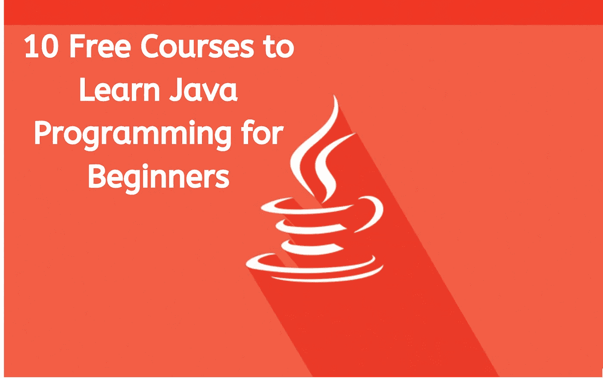
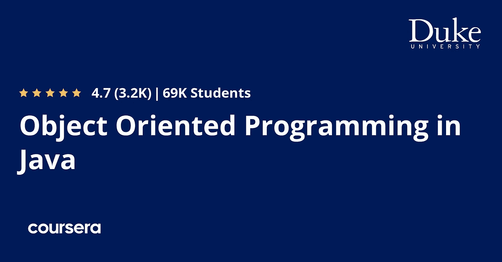
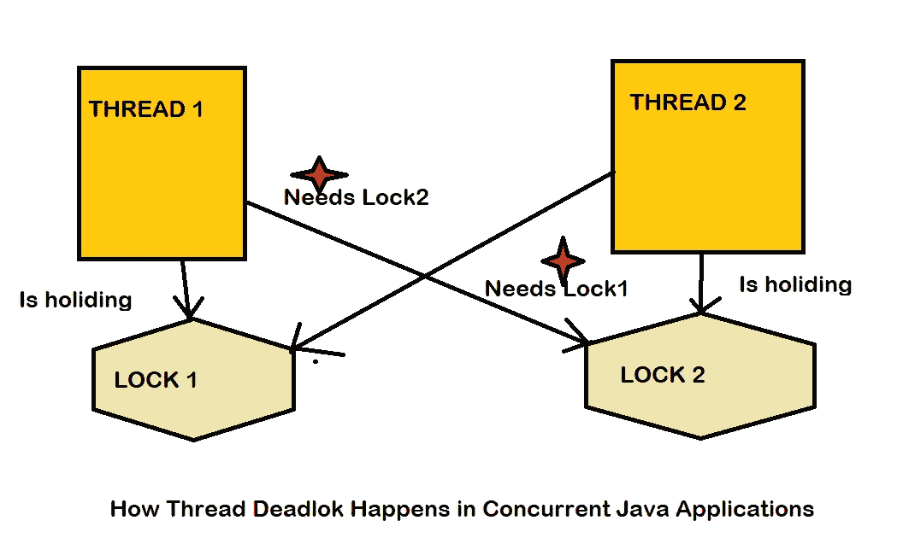
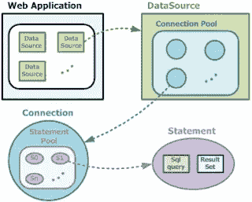
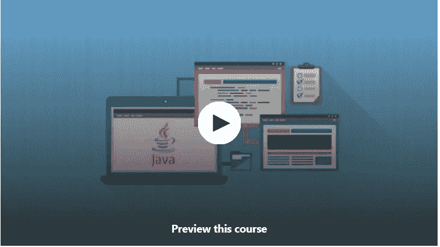
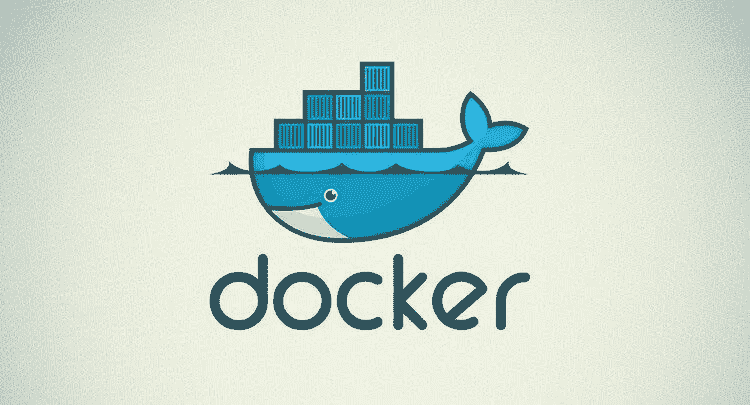
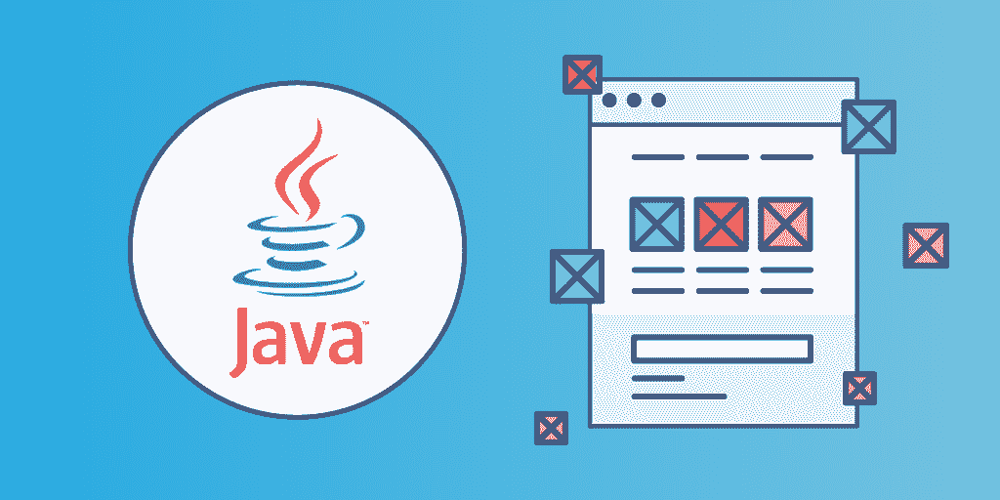

# 2023 年要学习的 11 门最佳免费 Java 编程课程

> 原文：<https://medium.com/javarevisited/10-free-courses-to-learn-java-in-2019-22d1f33a3915?source=collection_archive---------0----------------------->

## 使用这些来自 Udemy、Coursera、CodeCademy 和 Educative 的在线免费 Java 课程，在 2023 年免费学习 Java 编程。

大家好，如果你想在 2023 年学习 Java，在线或自学，并寻找最好的免费 Java 课程，那么你来对地方了。前面我已经分享了 [**最佳 Java 在线课程**](/javarevisited/top-5-java-online-courses-for-beginners-best-of-lot-1e1e240a758) 和 [**最佳 Spring 框架课程**](/javarevisited/10-best-online-courses-to-learn-spring-framework-in-2020-f7f73599c2fd) ，在这篇文章里，我将分享我最喜欢的 Udemy、Coursera、Codecademy、Educative 的 2023 年学习 Java 的免费在线课程。

互联网上充满了有用的资源。不管你想学什么，总有一些有用的东西是免费的。你只需要投入你的时间和精力。同时，在互联网上浩如烟海的免费[书籍](/javarevisited/5-best-core-java-books-for-beginners-20e3f723e3a)、[网站](/javarevisited/10-best-places-to-learn-java-online-for-free-ce5e713ab5b2)、[课程](/javarevisited/10-free-spring-boot-tutorials-and-courses-for-java-developers-53dfe084587e)中很难做出选择。

一不小心就把大部分时间花在浏览和换课程上，什么都没学到。这就是精选清单的用处所在。策展是我的爱好和激情。我喜欢阅读书籍和课程，这可以让我收集有用的资源并与你们分享。

今天我分享 [10 门 Java 编程课程](https://www.java67.com/2018/08/top-10-free-java-courses-for-beginners-experienced-developers.html)初学者可以免费使用学习 Java。

尽管我们关注的是初级 Java 课程——因为初学者最需要指导和帮助——我还是尝试加入了对中级和有经验的 Java 开发人员非常有用的免费课程，比如 Udemy 的免费 Java 多线程课程,这对初级和中级 Java 开发人员都非常有用。对于有经验的 Java 开发人员来说，这些是非常重要的技能、工具和技术。如果你对它们不熟悉，现在可能是学习它们来提升你的职业和技能的时候了。

顺便说一句，如果你能花几块钱学习一门有用且受欢迎的技能，比如 Java 编程语言，并寻找一个全面的资源，那么我强烈推荐你去 Udemy 上查看 [**完整的 Java 编程大师班**](https://click.linksynergy.com/deeplink?id=CuIbQrBnhiw&mid=39197&murl=https%3A%2F%2Fwww.udemy.com%2Fcourse%2Fjava-the-complete-java-developer-course%2F) 课程。

<https://click.linksynergy.com/deeplink?id=CuIbQrBnhiw&mid=39197&murl=https%3A%2F%2Fwww.udemy.com%2Fcourse%2Fjava-the-complete-java-developer-course%2F>  

这个长达 80 小时的课程是在线学习 Java 的最全面和最新的课程，它不是免费的，但你可以在 Udemy sales 上只花 10 美元就可以得到它，这种情况时有发生，就像一杯星巴克咖啡一样好。

# 2023 年 10 门免费 Java 编程课程供初学者学习

为了不浪费你更多的时间，这里是我列出的免费学习 Java 的最佳在线课程。我试着加入不同种类的课程，比如学习核心 Java 以及多线程、面向对象编程等的免费课程。

我还尝试包括实践和理论课程，以及视频、文本和交互式课程，以便您可以在不下载和设置 Java 的情况下在线练习，这对喜欢尽快开始而没有任何障碍的初学者来说真的真的很棒。

## 1.[完全初学者 Java 教程](https://www.udemy.com/java-tutorial/?ranMID=39197&ranEAID=JVFxdTr9V80&ranSiteID=JVFxdTr9V80-UfB4ehpx3sT93US_xK8IFg&LSNPUBID=JVFxdTr9V80)【最佳免费课程】

这可能是 Udemy 上最受欢迎的免费 Java 课程，Udemy 是最好的也是我最喜欢的在线学习平台之一。很多人不知道 Udemy 也有免费课程，在法律上是免费的。我的意思是由他们的指导者和创造者出于教育和营销目的而免费提供。

这门课程可能具有先发优势，因为已经有超过 120 万人加入了这门课程来学习 Java，这是一个记录，但同时，课程的质量也相当好。

如果你是编程初学者，或者知道一种编程语言，但也想学习 Java，那么你可以报名参加这个课程。它是免费的，我猜它在 Udemy 上一直是免费的，你应该加入这个来学习 Java 2023。

这里是加入这个免费课程的链接— [**完全初学者 Java 教程**](https://www.udemy.com/java-tutorial/?ranMID=39197&ranEAID=JVFxdTr9V80&ranSiteID=JVFxdTr9V80-UfB4ehpx3sT93US_xK8IFg&LSNPUBID=JVFxdTr9V80)

## 2.[Java 面向对象编程](https://coursera.pxf.io/c/3294490/1164545/14726?u=https%3A%2F%2Fwww.coursera.org%2Flearn%2Fobject-oriented-java)【Coursera 免费课程】

这是 Coursera 提供的中级免费 Java 课程，Coursera 是另一个在线学习门户网站，它提供了世界顶级大学和组织(如 Google 和 IBM)的最佳课程。

如果你有一些软件开发的经验或者计算机科学的背景，那么你可以参加这个免费的课程来学习面向对象编程。

这实际上是一个 Coursera 专业化认证，只不过是课程和项目的结合，在成功完成课程、评估和项目后提供证书。

这个专业由杜克大学提供，超过 66K 名学习者加入了这个项目学习 Java。它有四门 Java 课程，学习 Java 中的[面向对象编程](/javarevisited/my-favorite-courses-to-learn-object-oriented-programming-and-design-in-2019-197bab351733?source=collection_home---4------0-----------------------)和[数据结构](/javarevisited/7-best-courses-to-learn-data-structure-and-algorithms-d5379ae2588?source=---------18------------------)，你可以免费旁听，但如果你想要证书，你需要付费。

完成这一专业之后，您应该能够用 Java 开发面向对象的应用程序，利用现有库的能力，如何构建图形用户界面，以及如何使用一些核心算法来搜索和排序数据。

而且，最好的部分是它是基于项目的，所以你会得到一些急需的实践和编码。

链接加入课程—[**Java 面向对象编程**](https://coursera.pxf.io/c/3294490/1164545/14726?u=https%3A%2F%2Fwww.coursera.org%2Flearn%2Fobject-oriented-java)

顺便说一句，如果你发现 Coursera 的课程很有用，因为它们是由世界各地知名的公司和大学创建的，我建议你加入 Coursera Plus 的订阅计划，这是 Coursera 的一个订阅计划，让你可以无限制地访问他们最受欢迎的课程、专业知识、T14 专业证书和指导项目。

<https://coursera.pxf.io/c/3294490/1164545/14726?u=https%3A%2F%2Fwww.coursera.org%2Fcourseraplus>  

## 3. [Java 多线程](https://click.linksynergy.com/fs-bin/click?id=JVFxdTr9V80&subid=0&offerid=323058.1&type=10&tmpid=14538&RD_PARM1=https%3A%2F%2Fwww.udemy.com%2Fjava-multithreading%2F)【免费 Udemy 课程】

多线程是 Java 编程的一个基本部分，也可能是区分优秀 Java 开发人员和普通 Java 开发人员的最重要的特性。

对能够编写健壮的并发代码的 Java 开发人员有很高的要求。他们也获得很高的薪水。

如果你真的想在 Java 世界出类拔萃，多线程和并发性是你需要攻克的一个领域，那么本课程将免费帮助你做到这一点。

链接加入 Udemy 上的免费 Java 课程— [**Java 多线程**](https://click.linksynergy.com/fs-bin/click?id=JVFxdTr9V80&subid=0&offerid=323058.1&type=10&tmpid=14538&RD_PARM1=https%3A%2F%2Fwww.udemy.com%2Fjava-multithreading%2F)

顺便说一句，如果你有预算花点钱在值得学习的东西上，那么 José Paumard 在 Pluralsight 上的 [**将并发和多线程应用于常见 Java 模式**](https://pluralsight.pxf.io/c/1193463/424552/7490?u=https%3A%2F%2Fwww.pluralsight.com%2Fcourses%2Fjava-patterns-concurrency-multi-threading) 也是非常好的，但是，当然，它不是免费的。

你需要一个 [Pluralsight 会员](http://pluralsight.pxf.io/c/1193463/424552/7490?u=https%3A%2F%2Fwww.pluralsight.com%2Flearn)才能进入该课程，费用大约为每月 29 美元/每年 299 美元，但也可以访问他们的 7000 多门在线课程库。

<http://pluralsight.pxf.io/c/1193463/424552/7490?u=https%3A%2F%2Fwww.pluralsight.com%2Flearn>  

## 4.通过构建项目练习 Java【免费 Udemy 课程】

学习一门新的编程语言，没有比构建项目更好的方法了。这就是我所说的主动学习。在你开始写代码和创建项目之前，你不能仅仅通过阅读书籍或观看在线课程来学习。这让你的思维活跃起来。

你熟悉现实世界的需求，然后根据你所学到的知识找到答案。简而言之，使用本课程进行更多的参与式和基于项目的学习。

2023 年向所有学习 Java 的人强烈推荐的免费课程，面向初学者和中级 Java 程序员。

链接加入课程(免费)——[**通过搭建项目练习 Java**](https://click.linksynergy.com/fs-bin/click?id=JVFxdTr9V80&subid=0&offerid=323058.1&type=10&tmpid=14538&RD_PARM1=https%3A%2F%2Fwww.udemy.com%2Fpractice-java-by-building-projects%2F)

顺便说一句，如果你觉得这个课程的理论有点轻，那么你也可以将它与 [**完整的 Java 大师班**](https://click.linksynergy.com/fs-bin/click?id=JVFxdTr9V80&subid=0&offerid=323058.1&type=10&tmpid=14538&RD_PARM1=https%3A%2F%2Fwww.udemy.com%2Fjava-the-complete-java-developer-course%2F) 结合起来，这是学习 Java 的最佳和最新的课程之一，但不是免费的。

<https://click.linksynergy.com/fs-bin/click?id=JVFxdTr9V80&subid=0&offerid=323058.1&type=10&tmpid=14538&RD_PARM1=https%3A%2F%2Fwww.udemy.com%2Fjava-the-complete-java-developer-course%2F>  

## 5.Java 数据库连接:JDBC 和 MySQL[免费]

JDBC 是 Java API 不可或缺的一部分，因为大多数用 Java 创建的真实应用程序都必须使用数据库。

即使您使用的是高级框架，如 [Hibernate](https://hibernate.org/) 、JPA 或 [IBatis](https://ibatis.apache.org/) ，也需要对 JDBC 有很好的了解，本课程将为您提供这些。它使用 MySQL 作为示例数据库，因为它也是免费的，并教你如何使用 JDBC 在 Java 中操作数据库。

链接加入课程(免费)——[**Java 数据库连接:JDBC 与 MySQL**](https://click.linksynergy.com/fs-bin/click?id=JVFxdTr9V80&subid=0&offerid=323058.1&type=10&tmpid=14538&RD_PARM1=https%3A%2F%2Fwww.udemy.com%2Fhow-to-connect-java-jdbc-to-mysql%2F)

总的来说，对于希望提高 JDBC 技能的初学者和中级 Java 开发人员来说，这是一门完美的课程。

## 6.面向绝对初学者的 Java 免费课程]

这是另一个面向 Java 开发人员的初级课程。如果你是一名计算机科学毕业生或程序员，有 C、 [C++](https://hackernoon.com/top-5-free-c-courses-to-learn-programming-in-2019-d27352277da0) 或 [Python](https://www.python.org/) 背景，那么你可以通过这门课程快速掌握 Java 编程。

在这个免费的 Java 课程中，您将学到以下内容:

1.  Java 中的数据类型、方法和类
2.  Java 中的面向对象编程
3.  Java 集合框架
4.  如何在 Java 中使用正则表达式
5.  如何使用 Java API 进行文件 IO 和联网？
6.  如何使用 JUnit 测试您的 Java 代码
7.  如何使用 Maven 构建您的 Java 项目

这是一个很短的课程，不是很全面，但从初学者的角度提供了一个很好的概述。

这里是免费加入本课程的链接— [**Java 绝对初学者**](https://click.linksynergy.com/fs-bin/click?id=JVFxdTr9V80&subid=0&offerid=323058.1&type=10&tmpid=14538&RD_PARM1=https%3A%2F%2Fwww.udemy.com%2Fjava-for-absolute-beginners-c%2F)

## 7.面向初学者的 Eclipse IDE:提高您的 Java 生产率[免费]

毫无疑问， [IntelliJIDEA](https://itnext.io/top-5-intellijidea-and-android-studio-courses-for-java-and-android-programmers-afcc27309b60) 已经赢得了与 [Eclipse](https://www.eclipse.org/ide/) 的战争，取代它成为最受欢迎的 Java IDEs，但它仍然是一个非常好的 IDE。它是免费的，你不需要支付许可费，这是 IntelliJIDEA 完整版所需要的。

这个课程是由我最喜欢的 Java 讲师之一 Udemy 上的 [Spring & Hibernate for 初学者(包括 Spring Boot)](https://click.linksynergy.com/deeplink?id=CuIbQrBnhiw&mid=39197&murl=https%3A%2F%2Fwww.udemy.com%2Fcourse%2Fspring-hibernate-tutorial%2F) 课程的作者 [Chad Darby](https://click.linksynergy.com/deeplink?id=CuIbQrBnhiw&mid=39197&murl=https%3A%2F%2Fwww.udemy.com%2Fuser%2Fchaddarby2%2F) 创建的。

以下是您将在这个免费的 Eclipse IDE 课程中学到的关键内容:

1.  如何在您的机器上安装 Eclipse IDE
2.  如何用 Eclipse 创建 Java 应用程序
3.  如何从 Eclipse 运行和调试 Java 程序？
4.  如何使用 Eclipse 向导生成 Java 源代码
5.  如何重构和调试 Java 源代码
6.  运行 JUnit 测试
7.  进出口项目
8.  向您的 Eclipse 项目添加外部 JAR 文件

作为一名 Java 开发人员，对您的 IDE 有很好的了解是必须的，本课程将教您如何高效地使用 Eclipse IDE。强烈推荐任何开始 Java 开发的程序员使用。

这里是加入这个免费课程的链接— [**Eclipse IDE for 初学者**](https://click.linksynergy.com/fs-bin/click?id=JVFxdTr9V80&subid=0&offerid=323058.1&type=10&tmpid=14538&RD_PARM1=https%3A%2F%2Fwww.udemy.com%2Fluv2code-eclipse-ide-for-beginners%2F)

## 8.Java 9 简单易用的新特性—概述

这是一门需要熟悉的极好的课程 Java 9 中引入了一些令人兴奋的新特性，比如 Java 的[模块系统](https://www.amazon.com/Java-Module-System-Nicolai-Parlog/dp/1617294284/?tag=javamysqlanta-20)，对流程和[流 API](http://www.java67.com/2014/04/java-8-stream-examples-and-tutorial.html) 的改进，引入了用于创建[不可变](https://javarevisited.blogspot.com/2018/02/java-9-example-factory-methods-for-collections-immutable-list-set-map.html)集合的静态工厂方法，等等。

如果你已经了解 Java，只是想更新自己的知识，了解 Java 的新特性，那么这是适合你的课程。更重要的是，它是免费的，你将在一个地方找到所有重要的 Java 9 变化。

链接加入本课程(免费)——[**Java 9 新特性简单明了**](https://click.linksynergy.com/fs-bin/click?id=JVFxdTr9V80&subid=0&offerid=323058.1&type=10&tmpid=14538&RD_PARM1=https%3A%2F%2Fwww.udemy.com%2Fjava-9-new-features-in-simple-way-overview%2F)

## 9.Java 编程基础[免费在线课程]

这是针对 Java 程序员或任何想学习 Java 的人的又一门初级课程。它免费且简短，这使得初学者在进入更全面和更困难的课程之前获得一个概述是完美的。

如果想学 Java，又没有编程经验，可以利用这门课同时学习 Java 和编程基础。

链接免费加入本课程— [**Java 编程基础**](https://click.linksynergy.com/fs-bin/click?id=JVFxdTr9V80&subid=0&offerid=323058.1&type=10&tmpid=14538&RD_PARM1=https%3A%2F%2Fwww.udemy.com%2Fjava-programming-basics%2F)

## 10.面向 Java 开发人员的实用 Docker 免费课程]

Docker 正在成为基于云的应用程序世界中越来越重要的工具。它允许您轻松地在云上部署 Java 微服务，还可以轻松地使用 Kubernetes 通过几次点击来扩展您的应用程序和部署多个实例。

Docker 还使开发变得更加容易，因为你不需要下载单独的 Java 工具，如 JDK、本地库、JAR 文件等，你只需将你的应用程序作为 Docker 容器运行，它就能工作。它极大地简化了 Java 应用程序的开发和部署。

如果您对基于云的 Java 开发和利用容器快速建立新实例感兴趣，那么这是您开始学习的最佳课程。

链接加入本课程— [**面向 Java 开发者的动手 Docker**](https://click.linksynergy.com/fs-bin/click?id=JVFxdTr9V80&subid=0&offerid=323058.1&type=10&tmpid=14538&RD_PARM1=https%3A%2F%2Fwww.udemy.com%2Fintroduction-to-docker-for-java-developers%2F)

而如果你能在学习上花点钱，那么 Josh Long 的 [**Cloud Native Java**](https://www.amazon.com/Cloud-Native-Java-Designing-Resilient/dp/1449374646?tag=javamysqlanta-20) 这本书就是一本很棒的书。

如果你热衷于学习 Docker，并寻找更多的选项和选择，那么你也可以看看这个为开发者社区的程序员提供的免费 Docker 课程列表。

## 11.从零开始学习 Java 免费教育课程]

如果你正在寻找 2023 年从零开始学习 Java 的互动课程，那么你会喜欢 Educative 提供的这个基于文本的交互式免费 Java 课程。

如果你不知道 [Educative](https://www.educative.io/subscription?affiliate_id=5073518643380224) 是一个新的程序员在线学习平台，允许你直接从浏览器运行 Java 程序，这意味着你不需要下载 JDK 或安装任何 IDE，设置你的路径和类路径，而是你可以直接在线运行你的 Java 程序。

在本课程中，您将从编写一个 hello world 程序开始，继续学习 Java 中的一些常见概念，如条件语句、循环语句、数学和逻辑，然后学习更高级的概念，如继承、泛型和数组列表等。

完成这门 Java 课程后，你将成为一名中级 Java 开发人员，准备好承担自己的项目。鉴于阅读文本比观看视频更快，您也将在这门 Java 课程中快速学习。

**这里是加入这个免费课程的链接**——[从零开始学 Java](https://www.educative.io/courses/learn-java-from-scratch?affiliate_id=5073518643380224)

而且，如果你发现教育平台和他们的互动课程很有用，那么你还可以获得 [**教育订阅**](https://www.educative.io/subscription?affiliate_id=5073518643380224) ，每月只需 14.9 美元，不仅可以访问这门课程，还可以访问他们的 210 多门课程。它非常划算，非常适合准备编码面试

<https://www.educative.io/subscription?affiliate_id=5073518643380224>  

以上就是针对初学者的一些免费 Java 编程课程。如果你想学习 Java，那么这些课程足以让你成为 Java 专家。

正如我所说，这些课程涵盖了 Java 编程的广阔领域，从核心 Java 到高级 Java，从多线程到 JDBC，从 Eclipse 到 Docker。因此，它对初学者和中级 Java 程序员同样有用。即使是专家也能从这些课程中学到一些东西。

如果你喜欢看视频，这里有[最佳 Java 课程](https://www.youtube.com/watch?v=g4rPdPxNb5w)的视频，你可以在【Java 访问 youtube 频道上观看

感谢您阅读本文。如果你喜欢这些免费的 Java 在线课程，请与你的朋友和同事分享。如果您有任何问题或反馈，请留言。

## 结束语

感谢阅读这篇文章。你可能会想，有这么多东西要学，有这么多课程要参加，但你不需要担心。

很有可能你已经知道了大部分的东西，也有很多有用的资源，比如你可以使用的[书籍](/swlh/top-10-java-books-for-programmers-all-time-great-82b0ee0b831a)和[教程](https://javarevisited.blogspot.com/2018/07/java-8-tutorials-resources-and-examples-lambda-expression-stream-api-functional-interfaces.html)。

我是 Udemy 课程的特别粉丝，因为它们非常实惠，并且以很少的金额提供很多价值，但是你可以自由选择你想要的课程。

说到底，你应该对这里提到的事情有足够的知识和经验。

祝您的 Java 之旅好运！这当然不容易，但是通过学习这些课程，你离成为你一直想成为的 Java 程序员又近了一步

> 如果你知道任何其他免费的 Java 课程，虽然不在列表中，但对初学者很有帮助，请在这里随意评论。祝学习一切顺利。

> **p . s——如果你只想从一门课程开始从头到尾学习 Java，那么，我认为** [**完整的 Java 大师班**](https://click.linksynergy.com/fs-bin/click?id=JVFxdTr9V80&subid=0&offerid=323058.1&type=10&tmpid=14538&RD_PARM1=https%3A%2F%2Fwww.udemy.com%2Fjava-the-complete-java-developer-course%2F) **可能是最好的开始。**

<https://click.linksynergy.com/fs-bin/click?id=JVFxdTr9V80&subid=0&offerid=323058.1&type=10&tmpid=14538&RD_PARM1=https%3A%2F%2Fwww.udemy.com%2Fjava-the-complete-java-developer-course%2F> 