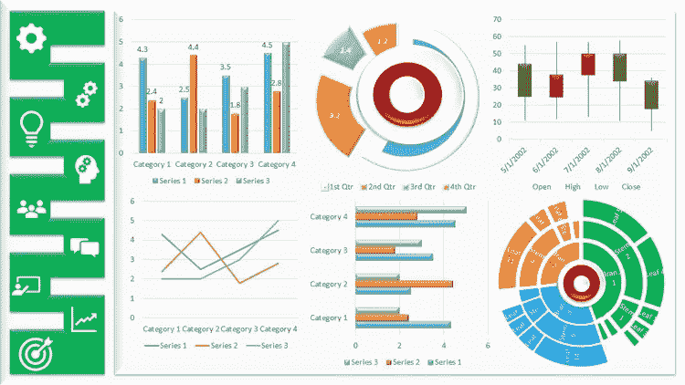
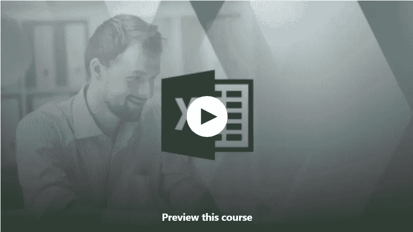
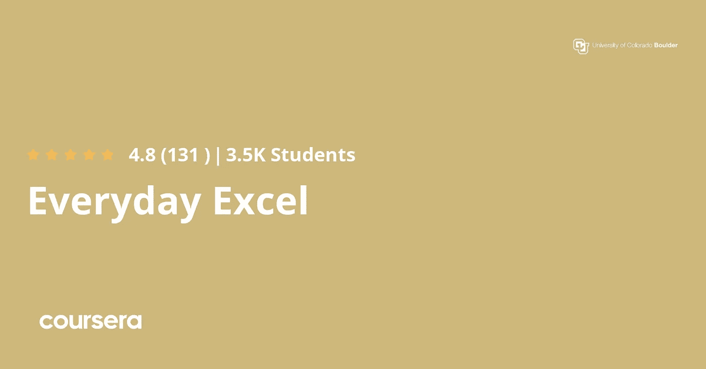
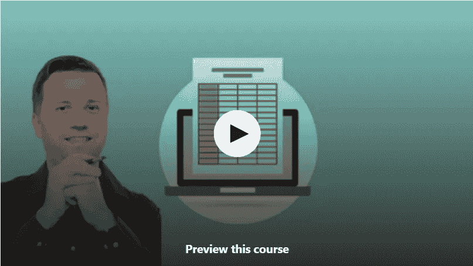
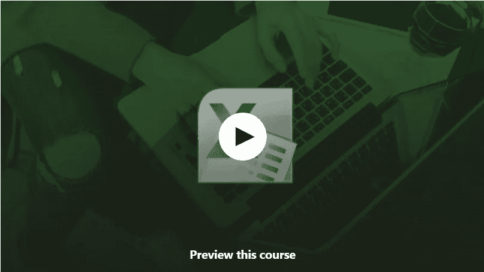
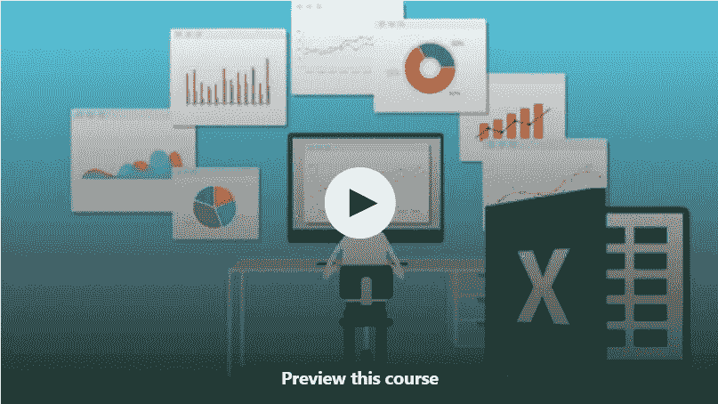
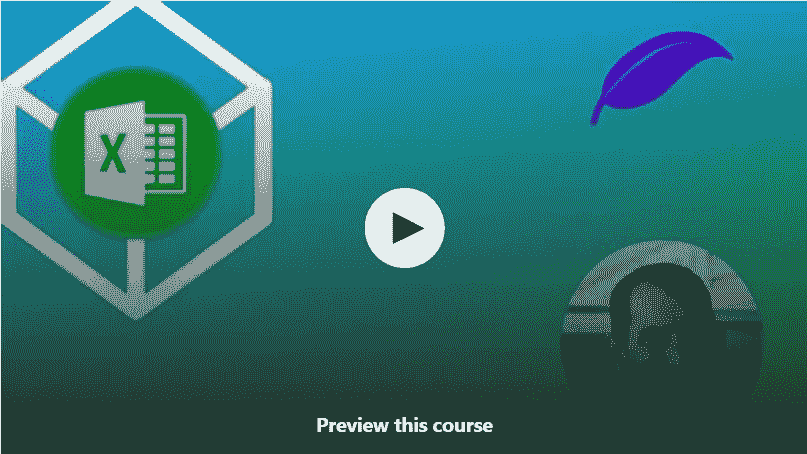
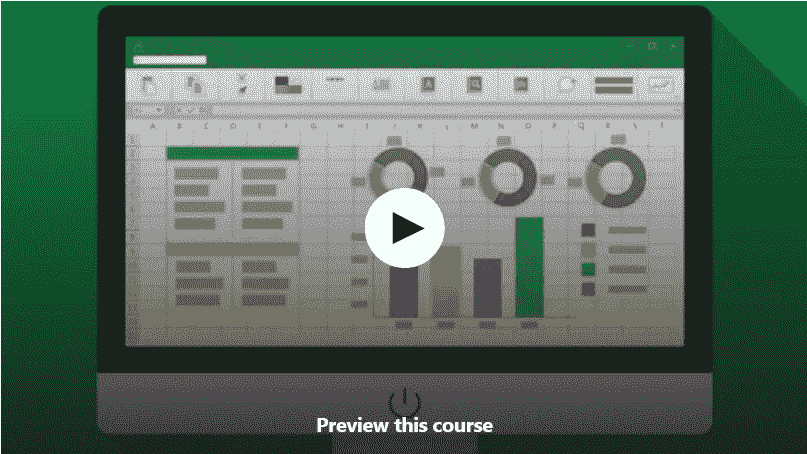

# 2023 年初学者学习微软 Excel 的 10 门最佳免费课程

> 原文：<https://medium.com/javarevisited/10-free-courses-to-learn-microsoft-excel-for-beginners-69561f2f2678?source=collection_archive---------0----------------------->

## 我最喜欢的免费在线课程是从 Udemy、FreeCodecamp 和其他在线门户网站为初学者学习微软 Excel 或 XLS

image_credit — udemy

大家好，如果你想在 2023 年从头开始学习微软 Excel，这是 IT 专业人士最受欢迎的生产力工具之一，并寻找免费的在线课程，那么你来对地方了。

过去，我曾为初学者分享过 [**最佳 Excel 课程**](/javarevisited/7-best-microsoft-excel-courses-for-beginners-33a069708680) 和 [**高级 Excel 课程**](/javarevisited/5-advanced-courses-to-learn-microsoft-excel-in-depth-b556aaee5f6c?source=---------18------------------) 给有经验的程序员，这些课程很受你们的欢迎，但我也收到过许多分享一些免费资源的请求，比如免费书籍、免费在线课程和免费教程，这就是为什么我要在本文中分享来自 Udemy 等网站的最佳免费 Microsoft Excel 课程，你们可以用它们来在线学习这个有用的工具。

毫无疑问，对于任何 IT 专业人员和技术人员来说，微软 Excel 都是一个非常有用的工具，比如软件开发人员、数据科学家、业务分析师、项目经理和项目经理。事实上，Excel 在其他需要在计算机上工作的工作中也很受欢迎。

在公正的美国，你会找到数以千计需要高超技能的工作。它是在这个日益数字化的世界中对每个人都很重要的工具之一，这也是许多人每天都在学习 Microsoft Excel 的原因。

作为一名 Java 程序员和博客作者，我经常使用 Microsoft Excel。我用它来列任务清单、分析数据、自动化事情等等。如果你让我学习一个关键工具或技能，我会推荐你[学习微软 Excel](/javarevisited/5-advanced-courses-to-learn-microsoft-excel-in-depth-b556aaee5f6c) ，因为它会在你的日常工作中给你很大的帮助，让你成为一个更有效的开发人员。

如果你也一直想学习微软 Excel，并寻找一些很棒的**免费在线培训课程**来启动你的旅程，那么你来对地方了。在这篇文章中，我将分享 *5 门免费的微软 Excel 课程*，这些课程不仅会教你基础知识，还会让你掌握这个生活中有用且无处不在的工具。

如果你能花大约 10 美元来学习像微软 Excel 这样有价值的工具，那么我强烈推荐你去看看 Udemy 上 Kyle Pew 的 [**微软 Excel——从初学者到专家**](https://click.linksynergy.com/deeplink?id=JVFxdTr9V80&mid=39197&murl=https%3A%2F%2Fwww.udemy.com%2Fcourse%2Fmicrosoft-excel-2013-from-beginner-to-advanced-and-beyond%2F) 课程。在 Udemy 促销期间，你只需花 9.9 美元就能获得这门课程。

<https://click.linksynergy.com/deeplink?id=JVFxdTr9V80&mid=39197&murl=https%3A%2F%2Fwww.udemy.com%2Fcourse%2Fmicrosoft-excel-2013-from-beginner-to-advanced-and-beyond%2F>  

# 2023 年新手可以加入的 10 个最好的免费微软 Excel 课程

为了不浪费你更多的时间，这里有一个学习 Microsoft Excel 的免费在线课程列表。这些是来自 Udemy 的[免费课程，这些课程被微软 Excel 专家认为是免费的，用于推广和教育过程。加入这些课程你不需要付任何钱，你需要的只是一个免费的 Udemy 账户来加入这个课程。](/javarevisited/100-free-programming-and-web-development-courses-on-udemy-free-resource-center-3f8415eb5e6f)

## 1.[对初学者有用的 Excel](https://click.linksynergy.com/deeplink?id=JVFxdTr9V80&mid=39197&murl=https%3A%2F%2Fwww.udemy.com%2Fcourse%2Fuseful-excel-for-beginners%2F)【Udemy】

这是初学者学习微软 Excel 最好的免费课程之一。这门课程的内容超过 9.5 小时，比你在 Udemy 上找到的许多付费 Excel 课程都要好。由 Ind Zara 创建的本课程将教你 Excel 的基础知识，并成为微软 Excel 的超级用户。本课程的好处在于它共享数据文件，在练习中，您将在这些文件中处理与书店相关的数据。这些文件可供下载，您可以在练习时跟随视频。本课程涵盖了成为有效用户所需了解的所有 Excel 主题。

谈到社交证明，这门课程受到超过 275，915 名学生的信任，在近 28，445 名参与者中平均得分为 4.5。简而言之，从零开始学习 Microsoft Excel 的最佳课程之一，尤其适合初学者和新用户。

**这里是加入这个免费课程的链接** — [对初学者有用的 Excel】](https://click.linksynergy.com/deeplink?id=JVFxdTr9V80&mid=39197&murl=https%3A%2F%2Fwww.udemy.com%2Fcourse%2Fuseful-excel-for-beginners%2F)

## 2.[日常 Excel，第一部分](https://click.linksynergy.com/deeplink?id=CuIbQrBnhiw&mid=40328&murl=https%3A%2F%2Fwww.coursera.org%2Flearn%2Feveryday-excel-part-1)【免费 Coursera 课程】

这是在 Coursera 上学习 Excel 日常任务的一门非常棒的免费课程。由 Charlie Nuttleman 创建并由科罗拉多大学博尔德分校提供的这个免费课程旨在帮助那些想从头开始学习 Excel 的人。

本课程是由三部分组成的系列课程的第一部分，也是日常 Excel 专业化课程的第一部分，重点是通过非常高级的 Excel 技术和工具进行入门教学。

在本课程的第一部分，您将学到以下内容:

1.  如何有效地在 Excel 环境中导航
2.  如何编辑和格式化 Excel 工作表
3.  如何实现从基础到高级的 Excel 函数(包括财务、逻辑、文本函数)；
4.  如何学习如何管理数据集(过滤、删除重复、合并数据、排序数据、验证数据)；
5.  如何通过散点图、柱形图和饼图有效地可视化数据。

以下是加入免费 Excel 课程的链接— [日常 Excel，第 1 部分](https://click.linksynergy.com/deeplink?id=CuIbQrBnhiw&mid=40328&murl=https%3A%2F%2Fwww.coursera.org%2Flearn%2Feveryday-excel-part-1)

## 3. [Microsoft Excel —快速提高您的技能](https://click.linksynergy.com/deeplink?id=JVFxdTr9V80&mid=39197&murl=https%3A%2F%2Fwww.udemy.com%2Fcourse%2Fmicrosoft-excel-improve-your-skills-quickly%2F) [Udemy]

这是一个学习 Microsoft Excel 一些有趣功能的短期课程，如数据透视表、图表、迷你图、函数、公式等，只需几个小时。

这个课程是由 [**菲利普·伯顿**](https://click.linksynergy.com/deeplink?id=CuIbQrBnhiw&mid=39197&murl=https%3A%2F%2Fwww.udemy.com%2Fuser%2Faquaviola%2F) 创建的，他是我最喜欢的 Udemy 导师之一，也是几个最畅销的 Udemy 课程的创建者，比如[70–461，761:用 Transact-SQL](https://click.linksynergy.com/deeplink?id=CuIbQrBnhiw&mid=39197&murl=https%3A%2F%2Fwww.udemy.com%2Fcourse%2F70-461-session-2-querying-microsoft-sql-server-2012%2F) 查询微软 SQL Server，而且对 Udemy 完全免费。

以下是你将在本课程中学到的东西:
1。如何创建表格、数据透视表、数据透视图和迷你图
2。如何添加条件格式，过滤器
3。如何使用 Visual Basic 进行应用
4？如何使用常见的 Excel 函数像 SUM、SUMIF、VLOOKUP、OFFSET、间接函数

需要提前了解什么吗？嗯，如果你以前用过 Microsoft Excel 就好了，但是即使你没有用过，你也可以参加这个课程。你只需要在你的机器上安装 MS Excel(或 Office) 2007、2010、2013、2016 或 365 来尝试这个练习。

**这里是加入这个免费课程的链接**——[Microsoft Excel——快速提高你的技能](https://click.linksynergy.com/deeplink?id=JVFxdTr9V80&mid=39197&murl=https%3A%2F%2Fwww.udemy.com%2Fcourse%2Fmicrosoft-excel-improve-your-skills-quickly%2F)

谈到社会证明，超过 37，000 人从该课程中受益，近 3282 人对该课程的平均评分为 4.4。总的来说，这是一个很好的学习有用特性的小课程，比如 Pitval 表格、图表和 Excel 的条件格式。

## 4.[简单的 Excel 初学者基础——开始使用 Excel](https://click.linksynergy.com/deeplink?id=JVFxdTr9V80&mid=39197&murl=https%3A%2F%2Fwww.udemy.com%2Fcourse%2Flearn-excel-2010-free-for-beginners%2F)

这是 Udemy 上的另一个免费在线课程，为初学者从头开始学习 Excel 基础知识。你将在 40 分钟内学会所有重要的 Excel 内容，如电子表格、快捷方式和公式。该课程也适用于 Excel 2010、2013 和 2016。

这门课程是由著名的 Excel 专家之一 Steve McDonald 创建的，他也是许多其他畅销的关于 Microsoft Excel 的 Udemy 课程的创建者，比如 T2 的 Excel 终极课程。以下是你将在本课程中学到的东西:
1。如何快速方便地在 Excel 中导航
2？如何创建一个简单有效的电子表格
3？如何使用 Excel 公式实现重复性数学计算的自动化
4。如何格式化文本并按字母顺序排列
5。如何将数字格式化成货币
6？如何快速方便地调整列和行的大小
7？如何以轻松、无压力的方式熟悉 Excel 的基础知识

本课程将教你如何使用 Excel 的基础知识，如何创建基本的电子表格，如何快速浏览电子表格，如何创建简单的数学公式，以及一些可以节省你大量时间的快捷键和击键。

**这里是免费参加本课程的链接** — [简单的 Excel 初学者基础知识—开始使用 Excel](https://click.linksynergy.com/deeplink?id=JVFxdTr9V80&mid=39197&murl=https%3A%2F%2Fwww.udemy.com%2Fcourse%2Flearn-excel-2010-free-for-beginners%2F)

谈到社交证明，这门课程受到超过 35，771 名学生的信任，并在近 2，536 名参与者中获得 4.4 分，这表明这门课程非常有用。如果你赶时间，想快速学习微软 Excel，试试这个课程，你不会失去任何东西，因为它是免费的，事实上，你会学到一个对你生活有用的工具。

## 5. [Excel 快速入门教程:36 分钟学会基础](https://click.linksynergy.com/deeplink?id=JVFxdTr9V80&mid=39197&murl=https%3A%2F%2Fwww.udemy.com%2Fcourse%2Fexcel_quickstart%2F)【Udemy】

这是另一个快速学习微软 Excel 的免费课程。顾名思义，你将在半小时内学会大多数有用的 Excel 功能，如行、列、工作簿、工作表、公式和快捷方式。

事实上，你会在 36 分钟内从一张空白工作表到数据透视表。

以下是你将在本课程中学到的关键东西:
1。如何输入和编辑 Excel 数据？格式化数字、字体和对齐方式。
2。如何制作简单的数据透视表和图表
3？如何创建简单的 Excel 公式？
4。如何使用常见的 Excel 函数像 [COUNTIF](https://javarevisited.blogspot.com/2017/12/how-to-do-group-by-in-excel-cointif.html) 和 [VLOOKUP](https://javarevisited.blogspot.com/2017/06/how-to-compare-two-lists-of-values-in.html#axzz6VHpd8ftm)
5？如何使用过滤器和排序数据列表，如找到“前 10”值。
6。如何使用 Excel 表格函数进行重复数据删除和汇总？

由 [Jeff Knowlton](https://click.linksynergy.com/deeplink?id=CuIbQrBnhiw&mid=39197&murl=https%3A%2F%2Fwww.udemy.com%2Fuser%2Fjeffknowlton2%2F) 创建，本课程也有助于理解如何在业务环境中使用 Excel 来分析数据。您还将创建一份简单的销售分析报告，这意味着您将从本课程的 36 分钟中获得清晰的结果。也非常适合面试准备！

**这里是加入这个免费 Excel 教程的链接**——[Excel 快速入门教程](https://click.linksynergy.com/deeplink?id=JVFxdTr9V80&mid=39197&murl=https%3A%2F%2Fwww.udemy.com%2Fcourse%2Fexcel_quickstart%2F)

## 6.[Microsoft Excel—Excel 中的基础数据可视化](https://click.linksynergy.com/deeplink?id=JVFxdTr9V80&mid=39197&murl=https%3A%2F%2Fwww.udemy.com%2Fcourse%2Fcreate-well-designed-excel-graphs%2F)【Udemy】

最近，我遇到了许多正在学习 Microsoft Excel 或数据可视化的人，考虑到我们生活的这个以数据为中心、日益数字化的世界，数据可视化正迅速成为一项越来越重要的技能。

越来越多的企业正在理解他们的数据，并寻求洞察力来增加销售和利润，这就是为什么了解 Microsoft Excel 会非常有用。

以下是你将在本课程中学到的东西。如何在 Excel
2 中创建设计良好的图形？如何在 Excel
3 中设置默认设置之外的图表格式？如何创建“值得用图”的数据
4。如何使用 VLOOKUP 和数据透视表在绘制图表前汇总数据
5。如何在 Excel 中设计类似于今天最受尊敬的出版物

中由 [Sean 创建的图形。J. Thompson](https://click.linksynergy.com/deeplink?id=CuIbQrBnhiw&mid=39197&murl=https%3A%2F%2Fwww.udemy.com%2Fuser%2F557ddc6403697%2F) ，在短短 1 个小时内，本课程将帮助您使用您已经掌握的 Excel 技能，并将它们提升到一个新的水平。你还会在整个课程中用到 Excel 电子表格。完成课程后，您还可以将这些电子表格和文档用作资源。

**这里是加入这个免费课程的链接**—[Microsoft Excel—Excel 中的基本数据可视化](https://click.linksynergy.com/deeplink?id=JVFxdTr9V80&mid=39197&murl=https%3A%2F%2Fwww.udemy.com%2Fcourse%2Fcreate-well-designed-excel-graphs%2F)

谈到社会证明，这门课程受到了 15，000 多名学生的信任，平均有近 996 人给它打了 4.1 分，这很令人惊讶，也充分说明了这门课程的质量。

## 7.Microsoft Excel 初学者教程—完整课程[FreeCodeCamp]

这是另一个学习微软 Excel 基础知识的免费在线课程。该课程由 Shad Sluiter 开发，可在 FreeCodeCamp 的 Youtube 频道上获得。

在这个 2.5 小时的免费课程中，您将通过创建 6 个真实世界的项目，从头开始学习如何使用 Microsoft Excel。大多数内容也适用于 Google Sheets。

以下是您将在本课程中学到的内容:

1.  如何输入数据，
2.  如何在电子表格中导航
3.  如何创建公式解决问题
4.  如何创建图表和图形
5.  如何理解相对和绝对引用
6.  如何导入和导出数据
7.  如何实现 VLOOKUP
8.  如何使用数据透视表
9.  如何拆分和连接文本，等等

正如我所说的，这个课程是完全免费的，你不需要任何登录来观看这个课程，你可以在 Youtube 上观看，或者就在这里，如下所示:

## 8. [Excel 商务技能:必备](https://click.linksynergy.com/deeplink?id=CuIbQrBnhiw&mid=40328&murl=https%3A%2F%2Fwww.coursera.org%2Flearn%2Fexcel-essentials)【Coursera 免费课程】

这是 Coursera 上最受欢迎的 Excel 课程之一，你可以免费旁听。该课程由麦考瑞大学提供，是 Coursera 广受欢迎的 [**商业专业化 Excel 技能**](https://click.linksynergy.com/deeplink?id=CuIbQrBnhiw&mid=40328&murl=https%3A%2F%2Fwww.coursera.org%2Fspecializations%2Fexcel) 的一部分，已经有超过 50 万人加入了该课程。

在专业化认证的第一门课程中，您将学习 Microsoft Excel 的基本知识。在六周内，您将能够熟练地浏览 Excel 用户界面，使用公式和函数执行基本计算，专业地格式化电子表格，并通过图表和图形创建可视化数据。

学习 Excel 最好的方法就是使用 Excel。在本课程中，学员将应用他们在此过程中学到的 Excel 技能和技术来解决广泛的业务问题。

本课程提供了大量可下载的 Excel 工作簿和完整的数据集，以及应用示例和实际挑战练习，让学员有机会练习他们的 Excel 技能，同时发现 Excel 在各种业务环境中新的有用的生产力功能

**这里是加入这个 Excel 课程的链接** — [商务 Excel 技能:要领](https://click.linksynergy.com/deeplink?id=CuIbQrBnhiw&mid=40328&murl=https%3A%2F%2Fwww.coursera.org%2Flearn%2Fexcel-essentials)

## 9.[微软 Excel 数据透视表—入门教程](https://click.linksynergy.com/deeplink?id=CuIbQrBnhiw&mid=39197&murl=https%3A%2F%2Fwww.udemy.com%2Fcourse%2Fpivot-table-basics%2F)【Udemy】

如果你正在寻找一个免费的在线课程或教程来学习微软 Excel 数据透视表，那么这是最适合你的免费课程。这个免费的 Udemy 课程由 Matt JackMann 创建，它将在短时间内教你数据透视表。

在这个 50 分钟的免费课程中，你将学到以下内容:

1.  在 Excel 中使用基本数据透视表
2.  分析大量信息
3.  更有效地使用 Excel
4.  更有效地组织信息

数据透视表是 Excel 中最强大的功能之一。一旦你学会了如何使用数据透视表，它们将会改变你使用 Excel 的方式，我强烈推荐你使用这个免费资源来学习这项伟大的技能。

**这里是加入本课程的链接** — [微软 Excel 数据透视表—初级课程](https://click.linksynergy.com/deeplink?id=CuIbQrBnhiw&mid=39197&murl=https%3A%2F%2Fwww.udemy.com%2Fcourse%2Fpivot-table-basics%2F)

## 10. [Excel:从初级到中级](https://click.linksynergy.com/deeplink?id=CuIbQrBnhiw&mid=39197&murl=https%3A%2F%2Fwww.udemy.com%2Fcourse%2Fexcel-2019-beginner-to-microsoft-intermediate%2F)【免费 Udemy 课程】

这是你可以在线获得的最全面的免费 Excel 课程之一。在这个长达 11.5 小时的课程中，您将了解到用于分析和日常使用的 Microsoft Excel 的所有知识。

由菲利普·伯顿 创建的这个 11.5 小时的课程将教你以下技能:

1.  如何创建、配置和保存 Excel 工作表和工作簿。
2.  如何浏览和格式化工作表和工作簿。
3.  如何自定义工作表和工作簿的选项和视图。
4.  配置要打印的 Excel 工作表和工作簿(例如页面设置)。
5.  将数据插入单元格和区域并设置其格式，以及创建和修改表格。
6.  突出显示、筛选、排序和分组单元格、区域和表格。
7.  创建和格式化 Excel 图表。
8.  如何插入和格式化对象，包括修改图像。
9.  如何在 Excel 中创建公式，包括使用条件逻辑和修改文本。

总的来说，这是一个免费学习 Excel 的好课程。它和 Udemy 上的任何付费 excel 课程一样好，更重要的是，Phillip 是一位 Excel 大师和了不起的老师。他的解释清晰、深入且非常全面。

**这里是加入免费 Excel 课程** — [Excel:从初级到中级](https://click.linksynergy.com/deeplink?id=CuIbQrBnhiw&mid=39197&murl=https%3A%2F%2Fwww.udemy.com%2Fcourse%2Fexcel-2019-beginner-to-microsoft-intermediate%2F)的链接

以上是关于初学者学习 Microsoft Excel online 的一些**最佳免费课程**。你可以参加这些免费的 Udemy 课程，然后你可以按照自己的进度学习。顺便说一句，有时，Udemy 上的免费课程可以变成付费课程，所以在你报名参加课程之前一定要检查价格。我也建议你现在就注册，即使你不打算马上学习。通过这种方式，你可以在付费前保持课程的终身免费，以后当你有空闲时间或优先级变化时再学习。

顺便说一句，你可能已经注意到这个列表只包含了 6 门课程，但是标题上写着 10 门课程，是的，我还有 4 门课程，我很快会和你分享，只是厌倦了打字，所以今天就到这里吧。

其他**有用的编程资源**你可能喜欢探索

*   [2023 年 21 个免费学习编码的网站](/javarevisited/top-20-sites-to-learn-coding-in-2020-f57ff63d9cb3)
*   [2023 年 5 门机器学习和数据科学课程](http://javarevisited.blogspot.sg/2018/03/top-5-data-science-and-machine-learning-online-courses-to-learn-online.html)
*   [5 门学习大数据、Hadoop 和 Spark 的免费课程](http://www.java67.com/2018/05/top-5-free-big-data-courses-to-learn-Hadoop-Apache-Spark.html)
*   [2023 年网络开发者路线图](https://hackernoon.com/the-2019-web-developer-roadmap-ab89ac3c380e)
*   [2023 年学习颤振的 5 门免费课程](https://www.java67.com/2020/06/5-free-courses-to-learn-flutter-in-2020.html)
*   [2023 年学习 Angular 的 5 门免费课程](http://www.java67.com/2018/01/top-5-free-angular-js-online-courses-for-web-developers.html)
*   [程序员学习 Git 和 Github 的 5 门免费课程](/@javinpaul/top-10-free-courses-to-learn-git-and-github-best-of-lot-967aa314ea)
*   [学习亚马逊网络服务的 5 门免费课程](https://www.java67.com/2018/05/top-5-amazon-web-services-or-aws-courses-to-learn-online.html)
*   [2023 年学习区块链的 5 大免费课程](http://www.java67.com/2018/02/5-free-blockchain-technology-courses.html)
*   [2023 年 7 门免费课程学习 Nodejs](/javarevisited/7-free-courses-to-learn-node-js-in-2020-2f1dd6722b49)
*   [面向开发者的 10 门免费 Docker 课程](https://hackernoon.com/10-free-courses-to-learn-docker-for-programmers-and-devops-engineers-7ff2781fd6e0)
*   [面向 Java 开发人员的 5 大 Android 在线培训课程](https://javarevisited.blogspot.com/2017/12/top-5-android-online-training-courses-for-Java-developers.html)
*   [2023 年学习 Kubernetes 的 7 门免费课程](/javarevisited/7-free-online-courses-to-learn-kubernetes-in-2020-3b8a68ec7abc)
*   [初学者学习 HTML 和 CSS 的 5 门免费课程](https://www.java67.com/2019/01/5-free-bootstrap-course-to-learn-online.html)
*   [为网络开发者提供 5 门免费学习 JavaScript 的课程](/javarevisited/12-free-courses-to-learn-javascript-and-es6-for-beginners-and-experienced-developers-aa35874c9a32)
*   [初学 Spring Boot 的 10 门免费课程](/javarevisited/10-free-spring-boot-tutorials-and-courses-for-java-developers-53dfe084587e?source=collection_home---4------7-----------------------)
*   [Java 学习 Spring 框架的 10 门免费课程](/javarevisited/top-10-free-courses-to-learn-spring-framework-for-java-developers-639db9348d25)

感谢您阅读本文。如果你喜欢这些最好的*免费的微软 Excel 初学者课程*，那么请与你的朋友和同事分享。如果您有任何问题或反馈，请留言。

**附言——**如果你不介意花点钱学习像微软 Excel 这样有价值的工具，那么我也强烈推荐你去看看 Udemy 网站上凯尔皮尤的 [**微软 Excel——从初学者到专家**](https://click.linksynergy.com/deeplink?id=JVFxdTr9V80&mid=39197&murl=https%3A%2F%2Fwww.udemy.com%2Fcourse%2Fmicrosoft-excel-2013-from-beginner-to-advanced-and-beyond%2F) 课程。这是深入学习 Excel 的最佳在线课程之一，几乎有 50 万人已经从这门课程中受益。

<https://click.linksynergy.com/deeplink?id=JVFxdTr9V80&mid=39197&murl=https%3A%2F%2Fwww.udemy.com%2Fcourse%2Fmicrosoft-excel-2013-from-beginner-to-advanced-and-beyond%2F> 