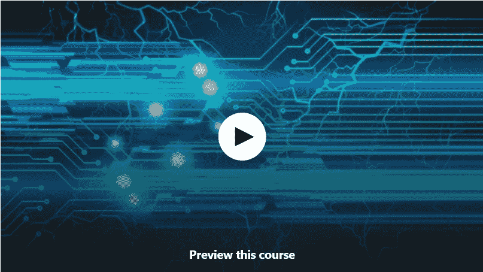
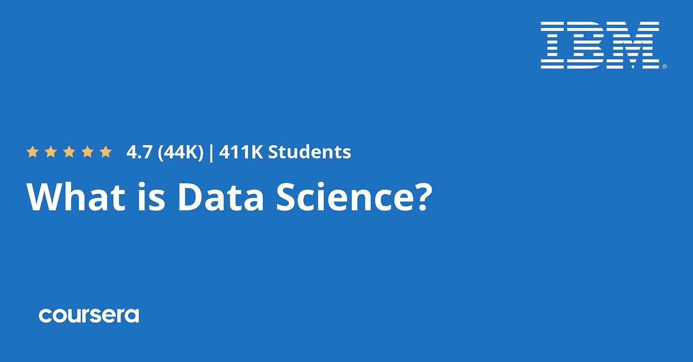
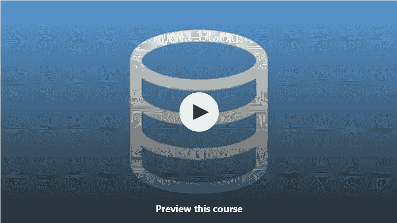
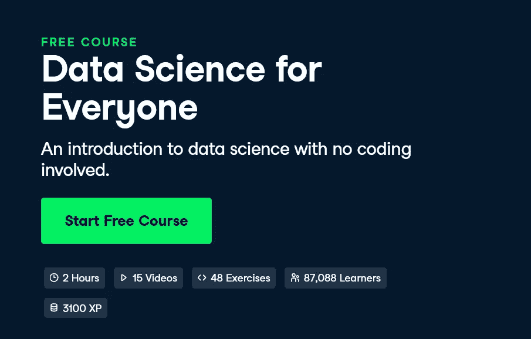
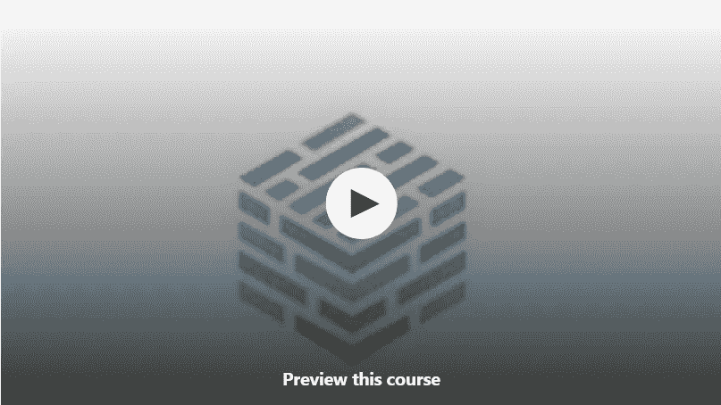
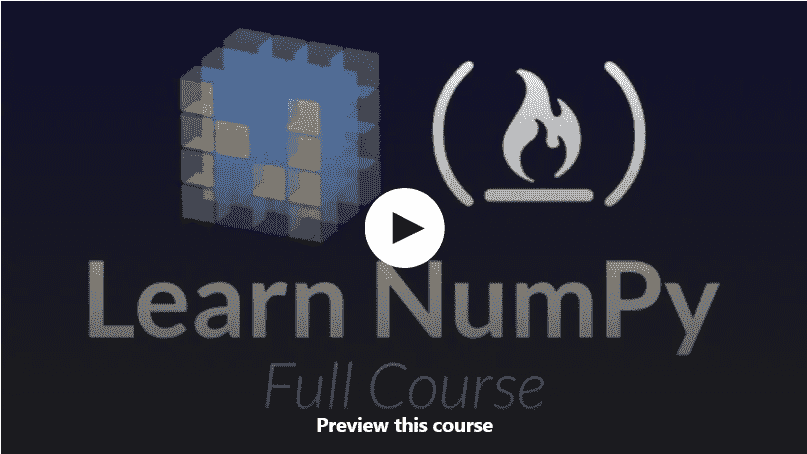

# 2023 年 10 门最佳免费数据科学在线课程，供初学者参加

> 原文：<https://medium.com/javarevisited/10-free-data-science-online-courses-for-beginners-a5fe78c2cb7b?source=collection_archive---------0----------------------->

## 收集了 Udemy、Coursera、Datacamp、freeCodeCamp 和其他流行的在线门户网站为初学者提供的最佳免费数据科学在线课程。

大家好，数据科学是当前技术世界中最受欢迎的技能之一，各种公司都在寻找有成就的数据科学家，以理解他们每天收集的大量数据，从而提高销售额、利润和整体业务流程。

如果你想学习[数据科学](/javarevisited/my-favorite-data-science-and-machine-learning-courses-from-coursera-udemy-and-pluralsight-eafc73acc73f)和[数据分析](/javarevisited/11-best-coursera-certifications-and-courses-for-data-science-and-analysis-in-2021-65ce1ac810a5)并寻找一些免费的在线培训课程来开始学习这项有用的技能，那么你来对地方了。

早些时候，我已经分享了 [**最佳数据科学课程**](/javarevisited/my-favorite-data-science-and-machine-learning-courses-from-coursera-udemy-and-pluralsight-eafc73acc73f) ，在这篇文章中，我将分享 Udemy、 [Coursera](https://coursera.pxf.io/c/3294490/1164545/14726?u=https%3A%2F%2Fwww.coursera.org%2F) 、DataCamp 和 freeCodecamp 为初学者和有经验的程序员提供的免费数据科学课程。

什么是数据科学，为什么它如此受欢迎，为什么《哈佛商业评论》将其誉为“21 世纪最性感的工作”？通过加入这些免费的数据科学，您将找到所有这些常见问题的答案。

您可以加入这些免费的在线课程，从头开始学习数据科学。如果你已经在做[数据分析](https://becominghuman.ai/5-best-courses-to-learn-pythons-pandas-libary-for-data-analysis-and-data-science-34b62abb0e96)，它们也有助于填补你的知识空白，最重要的是，它们是完全免费的。

环顾四周，大多数公司都在为数据而奔波。一些寻找用户的个人数据，而一些寻找用户的专业细节。

过去十年，每家公司都需要数据来销售产品。数据在一些工业过程中会派上用场。在对不同用户进行适当的数据分析后，正在开发产品。如今，许多公司都在寻找能够处理数据的专家。他们需要数据分析师，由于这是一个非常新的职业，竞争可以忽略不计。除此之外，公司准备向数据分析师支付高薪。如果你正在这个领域寻找职业，你需要学习数据分析的基础知识，如果你需要资源，你来对地方了。过去，我曾分享过学习机器学习 和 [Microsoft Excel、](https://www.java67.com/2020/07/5-free-microsoft-excel-xls-or-xlsx-courses-for-beginners.html)的 [**免费课程，在本文中，你将了解到 *10 门免费的数据科学和数据分析课程*，你可以参加这些课程，以便在 2023 年开始你的数据分析师职业生涯。

这些课程都是免费的，是他们班最好的。除此之外，所有这些课程都受到数百名学生的信任，收视率很高。**](https://www.java67.com/2019/01/5-free-courses-to-learn-machine-and-deep-learning-in-2019.html)

顺便说一句，如果你需要一门综合课程，并且不介意花几块钱学习像数据科学这样有价值的技能，那么我强烈推荐 Udemy 上的基里尔·叶列缅科和他的超级数据科学团队的 [**数据科学 A-Z:真实生活的数据科学练习包括**](https://click.linksynergy.com/deeplink?id=JVFxdTr9V80&mid=39197&murl=https%3A%2F%2Fwww.udemy.com%2Fcourse%2Fdatascience%2F) 课程。

 [## 数据科学 A-Z:包括现实生活中的数据科学练习

### 我的名字是基里尔·叶列缅科，我非常高兴你能读到这封信！专业上，我是数据科学的…

udemy.com](https://click.linksynergy.com/deeplink?id=JVFxdTr9V80&mid=39197&murl=https%3A%2F%2Fwww.udemy.com%2Fcourse%2Fdatascience%2F) 

# 2023 年要学习的 10 门最佳免费数据科学在线课程

以下是你可以加入成为 2023 年数据科学家的最佳免费在线课程列表。这些免费的在线课程是从像 Udemy、T2、Coursera、T4、数据营等网站上挑选出来的。

这些在线课程是由专家创建的，受到了世界各地许多开发者的信任，并且由他们的教师出于教育目的免费提供。

你可以参加一些这样的课程，从头开始学习数据科学，并在简历中添加一项急需的技能。

## 1.[数据科学入门](https://click.linksynergy.com/deeplink?id=JVFxdTr9V80&mid=39197&murl=https%3A%2F%2Fwww.udemy.com%2Fcourse%2Fan-introduction-to-data-science%2F)【Udemy 免费课程】

这是学习数据科学最好的免费 Udemy 课程之一。如果你是一个视觉学习者，这个课程是你最好的选择。通过本课程，你将学会有效地处理数据。

在数据分析中，你需要具备帮助你从一堆无用数据中筛选出最重要数据的技能。本课程将帮助您发展这些技能，除此之外，您还将了解数据科学及其历史。除此之外，本课程将为你提供掌握数据分析领域的路线图。学完本课程后，你将很容易区分噪音和真实信息。本课程最重要的特点是它是一门简短的课程，每一秒都为你提供价值。这是一个 44 分钟的视频课程，到目前为止已经有 2000 多名学生注册了。

**这里是加入这个免费课程** — [数据科学介绍](https://click.linksynergy.com/deeplink?id=JVFxdTr9V80&mid=39197&murl=https%3A%2F%2Fwww.udemy.com%2Fcourse%2Fan-introduction-to-data-science%2F)的链接

## 2.[数据科学基础](https://click.linksynergy.com/deeplink?id=JVFxdTr9V80&mid=39197&murl=https%3A%2F%2Fwww.udemy.com%2Fcourse%2Fessentials-of-data-science-in-90-minutes%2F)【免费 Udemy 课程】

这是 Udemy 的另一个免费在线课程，用于学习和理解数据科学。如果你了解处理数据的行业，你就会明白它们有多重要。

每个公司都有一个处理数据的部门，这个部门被称为数据分析部门。为了成为一名成功的数据分析师，您需要了解 excel 表格及其交付方式。

本课程旨在向您概述数据科学的三个基本领域，这是每个优秀的数据科学家都应该知道的领域，精通这些领域可能是您成功的关键。

完成这门*免费的数据科学课程*后，您将对数据科学有一个清晰的了解，并能清楚地决定它是否适合您。

您还将知道哪些领域在数据科学中是重要的，因此可以就哪些领域需要重点学习做出明智的决定。

这里是加入这个免费课程的链接— [**数据科学基础**](https://click.linksynergy.com/deeplink?id=JVFxdTr9V80&mid=39197&murl=https%3A%2F%2Fwww.udemy.com%2Fcourse%2Fessentials-of-data-science-in-90-minutes%2F)

## 3.[什么是数据科学？](https://coursera.pxf.io/c/3294490/1164545/14726?u=https%3A%2F%2Fwww.coursera.org%2Flearn%2Fwhat-is-datascience)【Coursera 免费课程】

如果你正在寻找一门免费的数据科学入门课程，那么你会很高兴加入 Coursera 上的这门免费课程，Coursera 是领先的在线学习门户网站之一，可能是学习数据科学和机器学习的最佳场所。

该课程是对数据科学的完美介绍，使一个人感到舒适，并向课程的参与者展示数据科学家的日常工作，并简化数据科学的意义。

本课程也是许多 best Coursera Specializations 或 Professional Certificates 计划的一部分，完成本课程将计入您在以下任何计划中的学习:

*   [IBM 数据科学专业证书](https://coursera.pxf.io/c/3294490/1164545/14726?u=https%3A%2F%2Fwww.coursera.org%2Fprofessional-certificates%2Fibm-data-science)
*   [业务专业化的关键技术](https://coursera.pxf.io/c/3294490/1164545/14726?u=https%3A%2F%2Fwww.coursera.org%2Fspecializations%2F)
*   [数据科学专业简介](https://coursera.pxf.io/c/3294490/1164545/14726?u=https%3A%2F%2Fwww.coursera.org%2Fspecializations%2Fintroduction-data-science)
*   [IBM 商业专业化人工智能基础](https://coursera.pxf.io/c/3294490/1164545/14726?u=https%3A%2F%2Fwww.coursera.org%2Fspecializations%2Fibm-ai-foundations-for-business)

在完成本课程后，您将对如何描述数据科学以及与该领域相关的常用术语(如机器学习)有更好的了解。

**这是加入免费 Coursera 课程的链接**——[什么是数据科学](https://coursera.pxf.io/c/3294490/1164545/14726?u=https%3A%2F%2Fwww.coursera.org%2Flearn%2Fwhat-is-datascience)

## 4.CodingInvadors 的数据科学专业化(非免费)

这是一个实时数据科学培训计划，您可以在 2023 年加入该计划，学习所有基本的数据分析技能，并成为一名成功的数据分析师。

该课程涵盖数据科学的基础知识，您将学习 Python、PostgreSQL、Jupyter、Statsmodel、Pandas、Scikit learn、PowerBI 和 Git 等技能，这些技能是任何数据科学家都必须具备的。

你还将获得现实世界案例研究和项目的实践经验，并有机会与职业教练进行无限的模拟面试。

完成本课程后，你将具备在著名的跨国公司和初创公司如亚马逊、苹果和谷歌找到工作的技能和知识。他们还提供每周两次的现场会议和一对一的指导。

不幸的是，它不是免费的，但也不是很贵，如果你能花几块钱，它绝对值得一看。

**这里是了解更多** — [由 CodingInvadors](https://codinginvaders.com/data-analyst-njg?utm_source=media&utm_medium=affiliate&utm_campaign=article-uforce-12%7Cs%7Cmedia%7Cm%7Caffiliate%7Cp%7C103%7Ca%7C100%7Cr%7C100%7Cw%7C100%7Cl%7C104) 提供的数据科学计划的链接

## 5.[数据科学的数据介绍](https://click.linksynergy.com/deeplink?id=JVFxdTr9V80&mid=39197&murl=https%3A%2F%2Fwww.udemy.com%2Fcourse%2Fintro-to-data-for-data-science%2F)【免费 Udemy 课程】

这是 Udemy 的又一门在线数据科学课程，你可以免费参加。在数据分析中，你当然要处理数据，如果你不能理解数据，你就不能成为一名成功的数据分析师。本课程将帮助你理解数据及其背后的科学。

在本课程中，你将学习如何使用数据，如何准备数据以便对其执行操作。你将理解从大量数据中提取重要信息的完整过程。

以下是您将在这门免费的数据科学课程中学到的关键概念:

1.  什么是数据，为什么它们很重要
2.  数据科学中如何使用数据
3.  数据科学中存在的数据类型
4.  数据在计算机中是如何表示的
5.  如何从数据表中提取信息

总体而言，本课程将帮助您学习与数据相关的关键方面，这些概念将使您在[数据分析](https://becominghuman.ai/5-best-courses-to-learn-pythons-pandas-libary-for-data-analysis-and-data-science-34b62abb0e96)方面做得更好。

**这里是加入这个免费在线课程的链接**——[数据科学的数据介绍](https://click.linksynergy.com/deeplink?id=JVFxdTr9V80&mid=39197&murl=https%3A%2F%2Fwww.udemy.com%2Fcourse%2Fintro-to-data-for-data-science%2F)

## 6.[使用 Python 介绍数据科学](http://et a good understanding of all buzz words like "Data Science", "Machine learning", "Data Scientist" etc.)【免费课程 Udemy】

这是你能在互联网上找到的关于数据科学的最简单的在线课程之一。这是一个 2.5 小时长的视频课程，您将使用 Python 编程语言学习数据科学，Python 编程语言是世界上最流行的数据科学编程语言。这是一门入门课程，所以不要期望获得关于这个主题的详细信息。这是你在成功的数据分析师职业生涯中需要采取的基本步骤。在本课程中，您将学习以下概念:

*   数据科学和分析基础测试
*   如何使用 Python 和 Scikit 学习
*   理解所有热门词汇，如“数据科学”、“机器学习”、“数据科学家”等。

当涉及到数据分析时，所有这些概念都非常重要。你必须参加这一简短而内容丰富的课程。

**这里是加入这个免费课程的链接** — [使用 Python 的数据科学简介](http://et a good understanding of all buzz words like "Data Science", "Machine learning", "Data Scientist" etc.)

## 7. [IBM 数据科学专业证书](https://coursera.pxf.io/c/3294490/1164545/14726?u=https%3A%2F%2Fwww.coursera.org%2Fprofessional-certificates%2Fibm-data-science)【Coursera】

这个 Coursera 课程是专门为 IBM 平台设计的。本课程将帮助您理解 IBM 云环境中的数据科学及其所有基本要素。

在本课程中，你将学习以下数据分析的关键概念:

*   用于排序、分组和生成所需结果的所有重要过滤器。
*   操作数据的 SQL 语句
*   实际数据集的实时分析。

这门课程将帮助你像其他 180 万学生一样开始你的数据分析师职业生涯。这是一个详细的课程，但它将是你的一站式解决方案，因为你不需要任何关于[数据分析](https://javarevisited.blogspot.com/2020/08/top-10-coursera-certifications-to-learn-Data-Science-Visualization-and-Data-Analysis.html)的其他课程。

**这里是加入这个认证的链接**——[IBM 数据科学专业证书](https://coursera.pxf.io/c/3294490/1164545/14726?u=https%3A%2F%2Fwww.coursera.org%2Fprofessional-certificates%2Fibm-data-science)

请记住，在 [Coursera](https://coursera.pxf.io/c/3294490/1164545/14726?u=https%3A%2F%2Fwww.coursera.org%2F) 中，专业认证或专业化是一系列课程的集合，大多数课程都是免费审核的，这意味着你可以免费学习，但你不能参加测验和评估。

你也不会得到任何结业证书。你需要付费才能获得证书，要么加入专业化或专业认证，要么参加[**Coursera Plus**](https://coursera.pxf.io/c/3294490/1164545/14726?u=https%3A%2F%2Fwww.coursera.org%2Fcourseraplus)**会员资格。**

** [## Coursera Plus |无限制访问 7，000 多门在线课程

### 用 Coursera Plus 投资你的职业目标。无限制访问 90%以上的课程、项目…

coursera.pxf.io](https://coursera.pxf.io/c/3294490/1164545/14726?u=https%3A%2F%2Fwww.coursera.org%2Fcourseraplus)** 

## **8.[人人共享的数据科学](https://datacamp.pxf.io/c/1193463/1012793/13294?u=https%3A%2F%2Fwww.datacamp.com%2Fcourses%2Funderstanding-data-science)【Data camp 免费课程】**

**这是你学习数据科学的另一个最好的免费在线课程。本课程由 [**DataCamp**](https://datacamp.pxf.io/c/1193463/1012793/13294) 提供，DataCamp 是数据分析、数据科学等数据技能的最佳互动学习网站之一。**

**本课程介绍数据科学，不涉及编码。在这个非技术性的课程中，你将了解到你曾经不敢问的关于这个快速发展和令人兴奋的领域的一切，而不需要写一行代码。**

**通过动手练习，您将了解不同的数据科学家角色、A/B 测试、时间序列分析和机器学习等基础主题，以及数据科学家如何从真实世界的数据中提取知识和见解。**

**所以，不要被这些时髦的词语吓跑。开始学习，在这个需求巨大的领域获得技能，并发现为什么数据科学适合每个人！**

****这里是加入这个令人敬畏的课程**——[人人共享的数据科学](https://datacamp.pxf.io/c/1193463/1012793/13294?u=https%3A%2F%2Fwww.datacamp.com%2Fcourses%2Funderstanding-data-science)的链接**

****

## **8.6 小时免费学习数据科学[YouTube + FreeCodeCamp]**

**这是另一个为初学者学习数据科学的惊人的免费课程。在 FreeCodeCamp 频道长达 6 小时的 YouTube 课程中，您将了解数据科学的重要元素。**

**您将了解使数据科学成为商业和研究中关键洞察力的强大媒介的原则、实践和工具。你将为将来的学习和工作中的应用打下坚实的基础。**

**有了数据科学，你可以做你想做的事情，并且做得更好。本课程涵盖数据科学、数据来源、[编码](/javarevisited/7-best-coding-course-to-learn-programming-with-zero-experience-in-2020-52f7d0d9cb80)、[数学和统计](/javarevisited/5-best-mathematics-and-statistics-courses-for-data-science-and-machine-learning-programmers-bf4c4f34e288?source=---------23----------------------------)的基础。**

**以下是观看本课程的链接:**

## **9.[用 R Part 1 of 10](https://click.linksynergy.com/deeplink?id=JVFxdTr9V80&mid=39197&murl=https%3A%2F%2Fwww.udemy.com%2Fcourse%2Fdatascience_with_r%2F) 学习数据科学【免费 Udemy 课程】**

**如果你可能不知道，但 Python 不是数据科学的唯一编程语言，虽然它肯定是最好的编程语言，但你也可以使用数据科学的 R 语言，这就是本课程要教你的。**

**r 不像 Python 那样受欢迎，但在数据分析、统计和数据科学方面，它是一种不错的编程语言。**

**如果你想使用 R 编程语言学习数据科学，那么 Udemy 上的这个免费课程绝对是一个很好的资源。与许多非常短的免费课程不同，这是一门 8 小时长的数据科学课程。**

**它也是清晰和完整的，讲师在教授基础知识方面做得很好，这意味着你将学到很多关于数据科学以及 R 编程语言的知识。**

****这里是加入这个免费课程的链接**——[和 R 一起学习数据科学](https://click.linksynergy.com/deeplink?id=JVFxdTr9V80&mid=39197&murl=https%3A%2F%2Fwww.udemy.com%2Fcourse%2Fdatascience_with_r%2F)**

****

## **10.[数据科学初学者 NumPy:2023](https://click.linksynergy.com/deeplink?id=JVFxdTr9V80&mid=39197&murl=https%3A%2F%2Fwww.udemy.com%2Fcourse%2Fthe-complete-numpy-course-for-data-science%2F)【Udemy 免费课程】**

**NumPy 对于数据科学和机器学习来说都是一个重要的库，作为数据科学家，对这个 [Python 库](https://javarevisited.blogspot.com/2018/10/top-8-python-libraries-for-data-science-machine-learning.html)的良好了解对你的日常工作大有帮助。**

**以下是您将在本课程中学到的内容:**

1.  **不同的 Numpy 函数用作矩阵/数组运算**
2.  **线性代数、统计、数学的不同数值函数**
3.  **Matplotlib 可视化的数值**
4.  **数字测验**

**如果你正在寻找一个 [*免费的数字课程*](https://www.java67.com/2021/11/top-5-free-courses-to-learn-numpy-for.html) 那么不要再找了，这个 Udemy 课程非常适合加入。本课程涵盖了从如何安装和导入 NumPy 到如何解决涉及数组创建、转换和随机采样的复杂问题的所有内容。**

**该课程以一系列**点播**讲座式视频的形式呈现，其中包含大量**动画示例**、代码演练和挑战性问题来测试您的知识，这也使观看该课程变得有趣，并允许您按照自己的节奏学习。**

****这里是加入这个免费 NumPy 课程的链接** — [面向数据科学初学者的 NumPy](https://click.linksynergy.com/deeplink?id=JVFxdTr9V80&mid=39197&murl=https%3A%2F%2Fwww.udemy.com%2Fcourse%2Fthe-complete-numpy-course-for-data-science%2F)**

****

**以上就是 2023 年初学者学习数据科学的**最佳免费在线课程。**如果你想成为一名数据科学家，那么参加这些课程是个不错的主意。数据分析是当前的需要。作为一名数据分析师，你可以有一个光明的未来，但是你要明白，数据分析是一项非常复杂和重要的工作。

你不能分心。为了提高你的注意力，建议至少学习 2-3 门与数据分析相关的课程，然后决定你是否真的想成为一名数据分析师，或者只是一时的迷恋。

其他**数据科学****机器学习、人工智能**文章可能喜欢**

*   **[面向初学者的 5 大机器学习算法](https://www.java67.com/2020/07/top-5-machine-learning-algorithms-for-beginners.html)**
*   **[面向程序员的 10 门机器学习和深度学习课程](https://hackernoon.com/top-5-courses-to-learn-python-in-2018-best-of-lot-26644a99e7ec)**
*   **[学习熊猫数据分析的 5 门最佳课程](https://becominghuman.ai/5-best-courses-to-learn-pythons-pandas-libary-for-data-analysis-and-data-science-34b62abb0e96)**
*   **[2023 年学习 Python 的 10 个理由](https://hackernoon.com/10-reasons-to-learn-python-in-2018-f473dc35e2ee)**
*   **[学习数据科学 Tableau 的前 5 门课程](https://javarevisited.blogspot.com/2019/07/top-5-tableau-online-courses-and-certifications-for-data-science-engineers.html)**
*   **[学习数据科学 Python 的 5 本书](https://javarevisited.blogspot.com/2019/08/top-5-python-books-for-data-science-and-machine-learning.html)**
*   **[学习机器学习的 5 大免费课程](https://www.java67.com/2019/01/5-free-courses-to-learn-machine-and-deep-learning-in-2019.html)**
*   **[初学者学习数据科学的 10 门课程](https://hackernoon.com/10-machine-learning-data-science-and-deep-learning-courses-for-programmers-7edc56078cde)**
*   **[面向数据科学和机器学习的 8 大 Python 库](https://javarevisited.blogspot.com/2018/10/top-8-python-libraries-for-data-science-machine-learning.html)**
*   **[学习人工智能的 7 门最佳课程](/javarevisited/7-best-courses-to-learn-artificial-intelligence-in-2020-26d59d62f6fe)**
*   **[初学者学习 TensorFlow 的 5 大课程](https://hackernoon.com/top-5-tensorflow-and-ml-courses-for-programmers-8b30111cad2c)**
*   **[2023 年学习 Python 的 5 大课程](https://hackernoon.com/top-5-courses-to-learn-python-in-2018-best-of-lot-26644a99e7ec)**
*   **[为数据科学学习数学和统计学的 5 门课程](https://javarevisited.blogspot.com/2019/09/top-5-statistics-and-mathematics-course-for-data-science.html)**
*   **[学习高级数据科学的前 5 门课程](https://hackernoon.com/top-5-data-science-and-machine-learning-course-for-programmers-e724cfb9940a)**
*   **[初学者学习 Python 的 10 门免费课程](https://hackernoon.com/10-free-python-programming-courses-for-beginners-to-learn-online-38312f3b9912)**
*   **[程序员 10 大最佳 Coursera 课程和认证](https://javarevisited.blogspot.com/2020/08/top-10-coursera-courses-specilizations-and-certifications.html)**

**感谢您阅读本文。如果您发现这些*最佳免费数据科学在线课程*有用，请与您的朋友和同事分享。如果您有任何问题或反馈，请留言。

**P. S. —** 如果你负担得起并正在寻找一门全面的数据科学课程，以真正掌握数据科学的艺术并学习所有的工具、概念和理论，那么我强烈推荐你参加 Udemy 上的 365 Careers 的这门 [**数据科学课程 2023:完整的数据科学训练营**](https://click.linksynergy.com/deeplink?id=JVFxdTr9V80&mid=39197&murl=https%3A%2F%2Fwww.udemy.com%2Fcourse%2Fthe-data-science-course-complete-data-science-bootcamp%2F) 课程。这是关于数据科学的最好的 Udemy 课程，完全是在浪费你的时间和金钱。**

** [## 数据科学培训课程:数据科学家训练营

### 数据科学家是本世纪最适合蓬勃发展的职业之一。它是数字化的，面向编程的，并且…

udemy.com](https://click.linksynergy.com/deeplink?id=JVFxdTr9V80&mid=39197&murl=https%3A%2F%2Fwww.udemy.com%2Fcourse%2Fthe-data-science-course-complete-data-science-bootcamp%2F)**