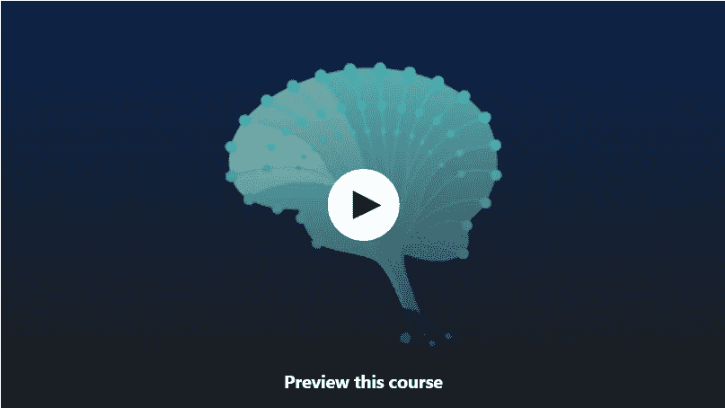
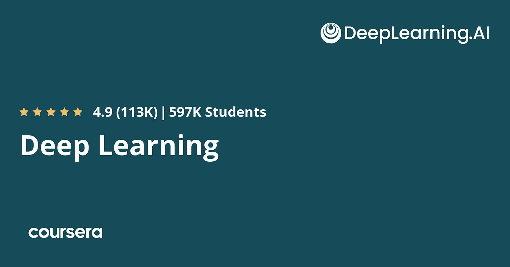
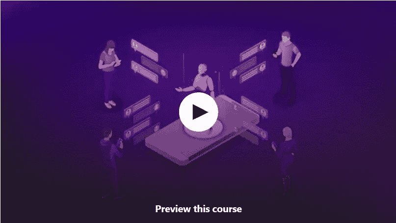
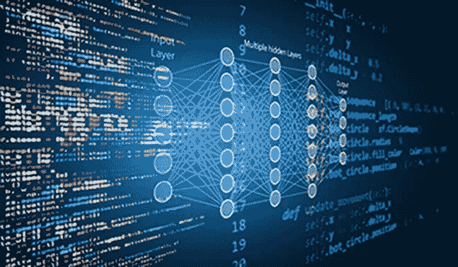
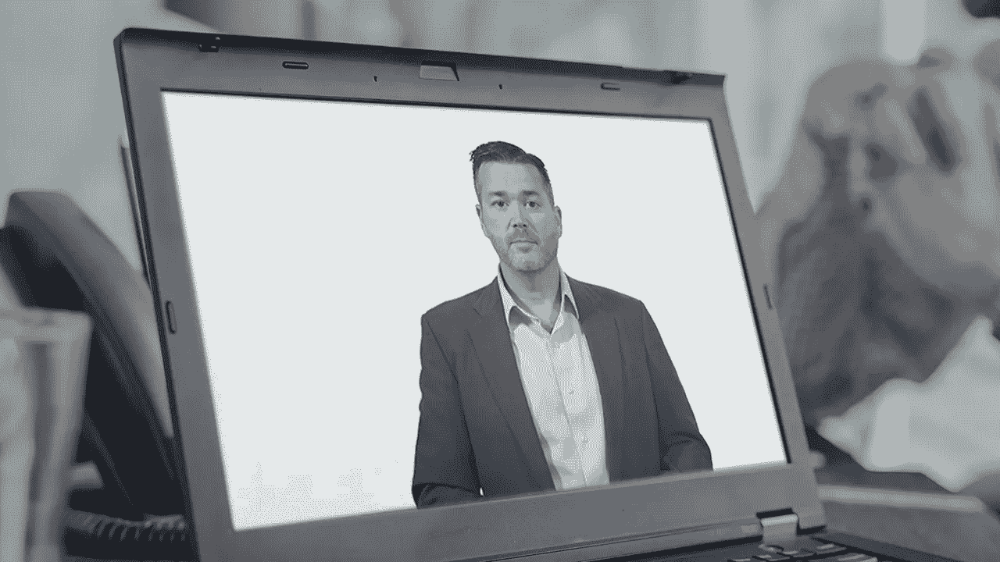
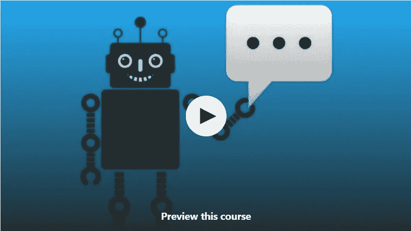
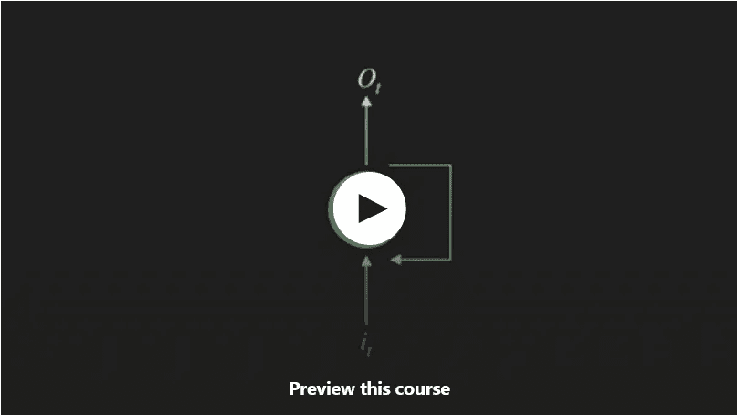
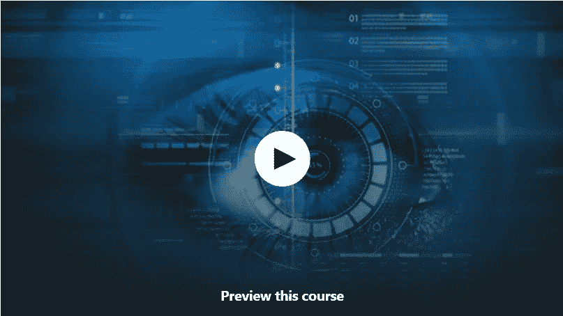
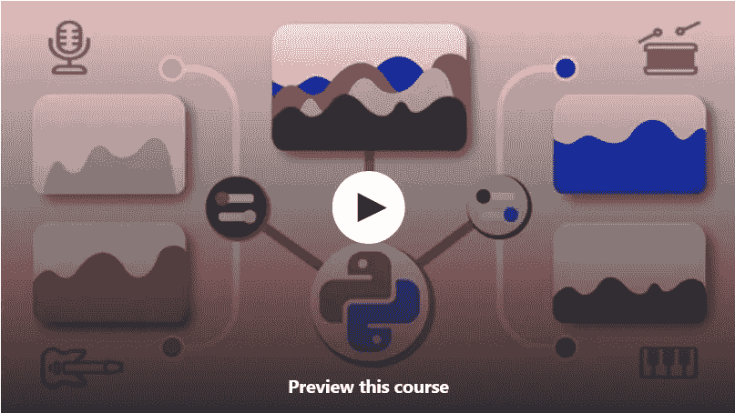

# 2023 年面向初学者的 10 门免费深度学习课程

> 原文：<https://medium.com/javarevisited/10-free-deep-learning-courses-for-beginners-37b5de61f8dc?source=collection_archive---------1----------------------->

## 我最喜欢的 2023 年从零开始学习深度学习和神经网络的免费在线课程。该列表包括 Udemy、Coursera、edX 和其他热门网站的最佳免费课程。

image_credit — udemy

大家好，如果你对学习深度学习和如何构建人工智能感兴趣，并在寻找免费的在线资源，那么你来对地方了。早些时候，我已经分享了 [**免费的机器学习**](/javarevisited/10-free-machine-learning-courses-for-beginners-181f83b4c816) 和 [**免费的数据科学课程**](/javarevisited/10-free-data-science-online-courses-for-beginners-a5fe78c2cb7b) 而在这篇文章中，我将为初学者分享免费的人工智能和深度学习课程。

这些免费课程由 [Udemy](https://click.linksynergy.com/deeplink?id=CuIbQrBnhiw&mid=39197&murl=https%3A%2F%2Fwww.udemy.com%2F) 、 [Coursera](https://coursera.pxf.io/c/3294490/1164545/14726?u=https%3A%2F%2Fwww.coursera.org%2F) 、 [edX](https://www.awin1.com/cread.php?awinmid=6798&awinaffid=631878&clickref=&p=) 和 [Pluralsight](https://pluralsight.pxf.io/c/1193463/424552/7490?u=https%3A%2F%2Fwww.pluralsight.com) 创建。由专家创造，被成千上万想学习人工智能的人所信任。

点击这篇文章链接，说明你非常有兴趣了解和学习更多关于深度学习的知识，但是等等！学习[深度学习和神经网络](/javarevisited/top-5-advanced-deep-learning-and-neural-network-courses-to-learn-in-2020-a273f5eddca5?source=---------16----------------------------)不是那么容易，永远也不会。

当今世界的好事情是人工智能、机器学习和深度学习的在线课程每天都在增加，它不仅涵盖人工智能，还包括它的子集，如机器学习和深度学习。

人工智能行业无疑是未来的技能，专家估计这一增长将在 2030 年达到 15 万亿美元。另一个好消息是，人工智能技能严重短缺，因此，学习这一领域将有助于你获得成功的职业生涯，或者发明一种使用人工智能的新产品，并赚一大笔钱。

最棒的是，有几十种人工智能和深度学习课程，但在本文中，我将帮助你找到最好的免费课程，以开始你在这个行业的职业生涯，并获得人工智能、深度学习和神经网络的良好背景。

顺便说一下，如果你不介意花几块钱学习像深度学习和人工智能这样有价值的技能，那么我也推荐你在 Udemy 上看看基里尔·叶列缅科和他的团队的 [**深度学习 A-Z:动手操作人工神经网络**](https://click.linksynergy.com/deeplink?id=CuIbQrBnhiw&mid=39197&murl=https%3A%2F%2Fwww.udemy.com%2Fcourse%2Fdeeplearning%2F) 。这个 22.5 小时的课程是学习深度学习的最佳资源之一。

 [## 深度学习 A-Z:动手操作的人工神经网络

### 正如在 Kickstarter ***上看到的那样，人工智能正在呈指数级增长。这是毫无疑问的。自驾…

udemy.com](https://click.linksynergy.com/deeplink?id=CuIbQrBnhiw&mid=39197&murl=https%3A%2F%2Fwww.udemy.com%2Fcourse%2Fdeeplearning%2F) 

# 初学者学习人工智能和深度学习的 10 门免费课程

为了不浪费你更多的时间，这里是我为初学者提供的学习人工智能和深度学习的免费在线课程列表，这些课程来自热门的在线学习网站，如 [Udemy](https://click.linksynergy.com/deeplink?id=CuIbQrBnhiw&mid=39197&murl=https%3A%2F%2Fwww.udemy.com%2F) 、 [Coursera](https://coursera.pxf.io/c/3294490/1164545/14726?u=https%3A%2F%2Fwww.coursera.org%2F) 、 [edX](https://www.awin1.com/cread.php?awinmid=6798&awinaffid=631878&clickref=&p=) 和 [Pluralsight](https://pluralsight.pxf.io/c/1193463/424552/7490?u=https%3A%2F%2Fwww.pluralsight.com) 。

正如我所说的，这些免费课程是由专家创建的，成千上万的开发者已经加入了这些课程。他们也完全在线，你可以从家里或办公室加入他们。

## 1.[深度学习基础【免费 Udemy 课程】](https://click.linksynergy.com/deeplink?id=JVFxdTr9V80&mid=39197&murl=https%3A%2F%2Fwww.udemy.com%2Fcourse%2Fbasics-of-deep-learning%2F)

深度学习是人工智能的一个子集，它正在创建模拟人脑的神经网络，以解决复杂的问题，如识别人脸和物体。

这门课程将教你这门科学的基础，而不需要任何先前的经验。

从这门被称为[深度学习的科学的基础和关键概念开始](/javarevisited/10-best-coursera-certifications-courses-for-machine-learning-and-artificial-intelligence-256d9a125822)，然后你将进入实践课程，在那里你还将看到如何改进深度学习模型，比如提高其准确性。

你还将看到卷积网络如何工作，用于识别图像和物体。最后，您将看到用于让机器与人类互动并理解文本的递归神经网络。

**这里是加入这个免费课程** — [深度学习基础](https://click.linksynergy.com/deeplink?id=JVFxdTr9V80&mid=39197&murl=https%3A%2F%2Fwww.udemy.com%2Fcourse%2Fbasics-of-deep-learning%2F)的链接

## 3.[神经网络和深度学习](https://coursera.pxf.io/c/3294490/1164545/14726?u=https%3A%2F%2Fwww.coursera.org%2Flearn%2Fneural-networks-deep-learning)吴恩达【课程教程】

这可能是通过 Coursera 平台提供的最著名和最成功的学习深度学习的课程。这门课程有超过 900，000 名学生注册，这太疯狂了，32%的人说他们在完成这门课程后开始了新的职业生涯。

这门课程是吴恩达和他的 DeepLearning.ai 公司在 Coursera 上打造的 [**深度学习专业化**](https://coursera.pxf.io/c/3294490/1164545/14726?u=https%3A%2F%2Fwww.coursera.org%2Fspecializations%2Fdeep-learning) 的一部分。它为您提供了一条获得知识和技能的途径，以将机器学习应用到您的工作中，提升您的技术职业生涯，并在人工智能的世界中迈出决定性的一步。

本课程从创建简单的神经网络以及理解这些神经网络中的关键参数开始。之后，您将尝试实现其他算法，如超参数调整，以优化神经网络性能，以及如何诊断机器学习系统中的错误。

您还将看到如何创建卷积神经网络来识别对象以及处理文本数据。值得注意的是，虽然专业课程不是免费的，但是大部分课程都是免费的。

**这里是加入本课程**——[神经网络和深度学习](https://coursera.pxf.io/c/3294490/1164545/14726?u=https%3A%2F%2Fwww.coursera.org%2Flearn%2Fneural-networks-deep-learning)的链接

但是为什么当参加审计专业的免费课程时，你将不会得到任何证书。如果你参加这个课程是为了获得 Coursera 证书，那么你需要注册专业化或者参加一个订阅计划，比如 [**Coursera Plus**](https://coursera.pxf.io/c/3294490/1164545/14726?u=https%3A%2F%2Fwww.coursera.org%2Fcourseraplus) ，它提供超过 7000 个 Coursera 课程、项目和专业证书的无限制访问。

 [## Coursera Plus |无限制访问 7，000 多门在线课程

### 用 Coursera Plus 投资你的职业目标。无限制访问 90%以上的课程、项目…

coursera.pxf.io](https://coursera.pxf.io/c/3294490/1164545/14726?u=https%3A%2F%2Fwww.coursera.org%2Fcourseraplus) 

## 3.[人工智能标记语言【免费 Udemy 课程】](https://click.linksynergy.com/deeplink?id=JVFxdTr9V80&mid=39197&murl=https%3A%2F%2Fwww.udemy.com%2Fcourse%2Fartificial-intelligence-markup-language%2F)

人工智能的应用是巨大的，例如自动驾驶汽车，最著名的人工智能应用之一是聊天机器人，机器可以与人交谈并回答他们的问题，本课程将教你如何创建这种应用。

本课程使用 AIML 语言创建聊天机器人，聊天机器人是一种基于 XML 的编程语言，您将从学习基础知识开始，例如使用标签和如何调用其他类别，以及允许聊天机器人向用户学习。

接下来，您将看到如何创建按钮、超链接以及在与用户交互的消息中包含图像和视频。

**这里是加入本课程**——[人工智能标记语言](https://click.linksynergy.com/deeplink?id=JVFxdTr9V80&mid=39197&murl=https%3A%2F%2Fwww.udemy.com%2Fcourse%2Fartificial-intelligence-markup-language%2F)的链接

## 4.[用 Python 进行机器学习【免费 edX 课程】](https://www.awin1.com/cread.php?awinmid=6798&awinaffid=631878&clickref=&p=%5B%5Bhttps%3A%2F%2Fwww.edx.org%2Fcourse%2Fmachine-learning-with-python-a-practical-introduct)

机器学习也是深度学习等人工智能的一个子集，其工作方式是使用内置算法，可以通过经验进行学习。

这门由 IBM 公司创建的课程将帮助你使用 python 语言学习更多关于这个领域的知识。你将从理解这门科学及其不同的模型开始，比如有监督的和无监督的学习。然后，您将学习实际课程，如线性回归和分类算法，如决策树和逻辑回归。

然后你会学习无监督学习和构建推荐系统。

**这里是加入这个免费课程的链接**——[用 Python 进行机器学习](https://www.awin1.com/cread.php?awinmid=6798&awinaffid=631878&clickref=&p=%5B%5Bhttps%3A%2F%2Fwww.edx.org%2Fcourse%2Fmachine-learning-with-python-a-practical-introduct)

## 5.[人工智能:人工智能的大图景](https://www.pluralsight.com/courses/artificial-intelligence-big-picture)

另一个有趣的课程是学习人工智能的理论，例如它的用途和应用，以及这个行业的未来，可以在 Pluralsight 上学习这门课程。该课程将向你传授推动这场人工智能革命的所有工具和技术。

您将了解到[人工智能](/javarevisited/7-best-courses-to-learn-artificial-intelligence-in-2020-26d59d62f6fe?source=---------17------------------)及其类型的概述，以及该技术的组成和不同应用。

你还会看到人工智能的历史，它过去是怎样的，现在是怎样的，就像深度学习，强化学习，让机器通过错误学习。

最后，您将了解人工智能如何创造和工作，如何用数据进行模型训练，以及这场革命的未来。

**这是参加本课程**的链接。[人工智能:人工智能的大图景](https://www.pluralsight.com/courses/artificial-intelligence-big-picture)

虽然这门课程并不完全免费，但你可以通过使用 Pluralsight 的 [**10 天免费试用**](https://pluralsight.pxf.io/c/1193463/424552/7490?u=https%3A%2F%2Fwww.pluralsight.com%2Flearn) 免费观看，它允许你观看 200 分钟的任何课程。Pluralsight 本月还免费提供他们所有的 7000 多门课程。

 [## 对个人来说

### Pluralsight 的使命一直是公平的技术竞争环境。不管你想学什么，或者…

pluralsight.pxf.io](https://pluralsight.pxf.io/c/1193463/424552/7490?u=https%3A%2F%2Fwww.pluralsight.com%2Flearn) 

## 6.[应用深度学习:构建聊天机器人——理论，应用](https://click.linksynergy.com/deeplink?id=CuIbQrBnhiw&mid=39197&murl=https%3A%2F%2Fwww.udemy.com%2Fcourse%2Fapplied-deep-learning-build-a-chatbot-theory-application%2F)

这是在 Udemy 上学习深度学习的另一个令人惊叹的免费实践课程。这个 6 小时长的课程不亚于任何付费课程，你可以用它来学习[聊天机器人](https://javarevisited.blogspot.com/2019/12/want-to-build-chat-bots-using-ai.html#axzz6dHZ7oEpK)如何工作，并用 Python 和 PyTorch 实现它们！

在这个免费的深度学习课程中，您将学到以下内容:

1.  了解序列建模背后的理论
2.  了解聊天机器人的工作原理
3.  了解 rnn 和 LSTMs 的工作原理
4.  从头开始学习 PyTorch
5.  如何在 [PyTorch](/javarevisited/5-best-pytorch-and-keras-courses-for-deep-learning-in-2021-c9ba377b1170) 中实现聊天机器人
6.  学习不同序列建模应用的理论

本课程将教你如何应用深度学习。这是一门中级课程，所以我需要深度学习和神经网络的基础知识。如果你已经熟悉了，那么你就准备好开始这段旅程吧！

**这是加入本课程的链接** — [应用深度学习:构建聊天机器人](https://click.linksynergy.com/deeplink?id=CuIbQrBnhiw&mid=39197&murl=https%3A%2F%2Fwww.udemy.com%2Fcourse%2Fapplied-deep-learning-build-a-chatbot-theory-application%2F)

## 7. [Tensorflow 2.0 |递归神经网络，LSTMs，GRUs](https://click.linksynergy.com/deeplink?id=CuIbQrBnhiw&mid=39197&murl=https%3A%2F%2Fwww.udemy.com%2Fcourse%2Ftensorflow-20-recurrent-neural-networks-lstms-grus%2F)

这是在 Udemy 上学习 Tensorflow 2.0 的另一个非常棒的免费在线课程。你可以用这个 1 小时的免费课程来学习 RNN、LSTM、GRU、NLP、Seq2Seq、注意力和时间序列预测。

要求:

*   [Python](/javarevisited/10-free-python-tutorials-and-courses-from-google-microsoft-and-coursera-for-beginners-96b9ad20b4e6)
*   Numpy
*   [张量流](https://becominghuman.ai/top-10-courses-to-learn-tensorflow-for-machine-learning-in-2020-39a31e7cd84b)或 Keras
*   前馈神经网络
*   反向传播

递归网络是一种令人兴奋的神经网络，它处理以序列形式出现的数据。序列就在我们身边，比如句子、音乐、视频和股市图表。

**以下是加入本课程的链接** — [Tensorflow 2.0 |递归神经网络、LSTMs、GRUs](https://click.linksynergy.com/deeplink?id=CuIbQrBnhiw&mid=39197&murl=https%3A%2F%2Fwww.udemy.com%2Fcourse%2Ftensorflow-20-recurrent-neural-networks-lstms-grus%2F)

## 8.FreeCodeCamp 为初学者提供的深度学习速成课程

这是 FreeCodeCamp 的 Youtube 频道上一个关于深度学习的很好的小型免费速成班。如果你是深度学习领域的完全初学者，那么你可以参加这个课程，了解什么是深度学习，以及如何使用它来解决现实世界的问题。

本课程由 Jason Dsouza 开发，在本课程中，您将在没有任何代码的情况下学习深度学习背后的关键思想。这门课程是为没有编程经验的绝对初学者设计的，你将学习深度学习的基本概念和术语，深度学习是机器学习的一个分支。

以下是这个深度学习速成班涵盖的主题:

1.  什么是深度学习
2.  神经网络导论
3.  神经网络是如何学习的？
4.  深度学习中使用的核心术语
5.  激活函数、丢失函数和优化器
6.  监督、非监督和强化学习
7.  全连接前馈神经网络、递归神经网络和卷积神经网络。

简而言之，这是一个非常棒的免费深度学习课程，可以学习神经网络、机器学习结构(如监督、非监督和强化学习)、各种类型的神经网络架构等等。

你可以在这里或者 Youtube 上免费观看这个课程。

## 9.[数据科学:2023 年用 Python 介绍深度学习](https://click.linksynergy.com/deeplink?id=CuIbQrBnhiw&mid=39197&murl=https%3A%2F%2Fwww.udemy.com%2Fcourse%2Fcomplete-deep-learning-course-with-python%2F)

这是一门用 Python 创建深度学习算法的初级课程。这个 2 小时长的课程非常适合初学者学习 [Python 编程语言](/javarevisited/10-best-python-certification-courses-from-coursera-4576890eb6b3)的深度学习。

以下是您将在本课程中学到的内容:

1.  理解人工神经网络背后的直觉
2.  用 Tensorflow 构建人工神经网络
3.  使用深度学习对图像和数据进行分类
4.  在实践中应用卷积神经网络

2023 年已经有超过 2500 名学生加入了这门课程，学习用 Python 进行深度学习。

**这里是加入本课程** — [数据科学:Python 深度学习简介](https://click.linksynergy.com/deeplink?id=CuIbQrBnhiw&mid=39197&murl=https%3A%2F%2Fwww.udemy.com%2Fcourse%2Fcomplete-deep-learning-course-with-python%2F)的链接

## 10.[令人惊叹的 AI:深度学习的音乐编辑](https://click.linksynergy.com/deeplink?id=CuIbQrBnhiw&mid=39197&murl=https%3A%2F%2Fwww.udemy.com%2Fcourse%2Fai-music-editing%2F)

这是另一个在 Udemy 上学习人工智能和深度学习的伟大课程。这是一个只有 30 分钟内容的简短课程，但是非常有趣和有用。

以下是您将在本课程中学到的内容:

1.  如何使用 Spleeter 库将任何歌曲分割成不同的部分
2.  如何利用深度学习进行音乐编辑
3.  如何使用 Google Colab 进行 Python 编程

已经有 6000 多名学生加入了这门课程，它的平均评分为 4.7 分，非常好。

**这里是加入本课程的链接**——[神奇的人工智能:深度学习的音乐编辑](https://click.linksynergy.com/deeplink?id=CuIbQrBnhiw&mid=39197&murl=https%3A%2F%2Fwww.udemy.com%2Fcourse%2Fai-music-editing%2F)

以上就是关于**针对初学者的免费深度学习课程**。最后，我要说的是，深度学习将为大量的商业机会打开大门，也许还会开发出使用人工智能来解决和帮助人们解决问题的产品，这肯定会让你赚钱。

你可能喜欢的其他**数据科学、机器学习和人工智能课程**

*   [2023 年学习数据科学的 10 门课程](https://dev.to/javinpaul/10-data-science-and-machine-learning-courses-for-programmers-looking-to-switch-career-57kd)
*   [程序员必备的 5 种机器学习算法](https://www.java67.com/2020/07/top-5-machine-learning-algorithms-for-beginners.html)
*   [10 门面向初学者的免费机器学习课程](/javarevisited/10-free-machine-learning-courses-for-beginners-181f83b4c816)
*   [学习数据科学 Python 的前 5 本书](https://javarevisited.blogspot.com/2019/08/top-5-python-books-for-data-science-and-machine-learning.html)
*   [为有经验的开发者提供的 10 门免费 Java 课程](http://www.java67.com/2018/08/top-10-free-java-courses-for-beginners-experienced-developers.html)
*   [5 门免费课程学习芯泉和 Spring Boot](http://www.java67.com/2017/11/top-5-free-core-spring-mvc-courses-learn-online.html)
*   [2023 年学习人工智能的 5 大课程](https://javarevisited.blogspot.com/2019/10/top-5-courses-to-learn-artificial-intelligence-AI.html)
*   [2023 年学习 Docker 的 10 门免费课程](http://www.java67.com/2018/02/5-free-docker-courses-for-java-and-DevOps-engineers.html)
*   [学习 Tableau for Data Visualization 的前 5 门课程](https://javarevisited.blogspot.com/2019/07/top-5-tableau-online-courses-and-certifications-for-data-science-engineers.html)
*   [2023 年你应该学习的五大数据可视化工具](https://www.java67.com/2020/07/top-5-data-visualization-tools-every.html)

感谢您阅读本文。如果你喜欢这些最好的*免费深度学习课程*，那么请分享给你的朋友和同事。如果您有任何问题或反馈，请留言。

**P. S. —** 如果你正在寻找最好的机器学习课程，并且不介意支付一些钱，那么 [**人工智能 A-Z:学习如何构建一个 AI**](https://click.linksynergy.com/deeplink?id=JVFxdTr9V80&mid=39197&murl=https%3A%2F%2Fwww.udemy.com%2Fcourse%2Fartificial-intelligence-az%2F) 是 Udemy 上最好的在线课程。这将是 2023 年从零开始学习人工智能的正确选择。

 [## 人工智能 A-Z:学习如何构建人工智能

### 学习关键的人工智能概念和直觉训练，让你快速掌握所有人工智能。覆盖:如何开始…

udemy.com](https://click.linksynergy.com/deeplink?id=JVFxdTr9V80&mid=39197&murl=https%3A%2F%2Fwww.udemy.com%2Fcourse%2Fartificial-intelligence-az%2F)