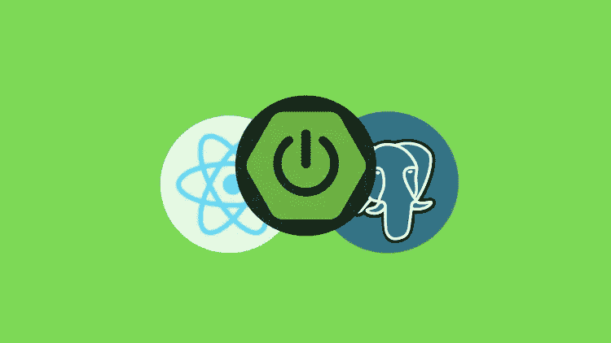
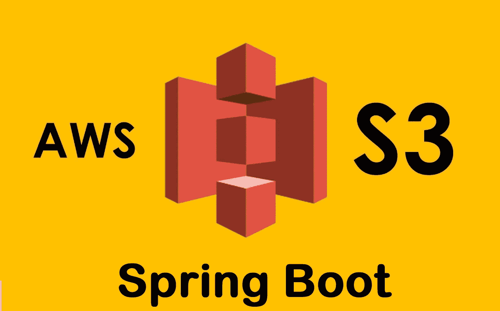

# 2023 年面向初学者和有经验程序员的 10 门最佳免费全栈 Java 开发课程

> 原文：<https://medium.com/javarevisited/10-free-full-stack-java-development-courses-for-beginners-and-experienced-programmers-8473390bec03?source=collection_archive---------0----------------------->

## 使用 JSP、Servlet、Spring、Hibernate、Angular 和 Reactjs 学习全栈 Java 开发的免费课程

image_credit — Spring Boot 新协议和 React 全栈开发

成为全栈 Java 开发人员的漫长旅程并不容易。你需要知道所有的细节，从前端到后端。不仅如此，你还需要知道数据库和连接是如何运作的。

这个过程涉及大量的详细研究；因此，我们挑选了可以帮助你一路走来的课程。这些课程是在听取专业人士和学习者的意见后挑选出来的。

我们列出的这些课程在它们各自的领域中是最好的，在必要的时候为你提供深入和实用的知识。

在我们开始这门课程之前，你必须知道，如果你对入门者不了解 [HTML](https://www.java67.com/2018/02/5-free-html-and-css-courses-to-learn-web-development.html) 和 [CSS](https://www.java67.com/2020/06/top-5-courses-to-learn-advanced-css.html) ，你就不可能成为 java 的全栈开发人员。这两个对于完整的认证也是必不可少的，如果你想参加这样的考试，如果你不知道它们，可能会给你带来麻烦。

这些是学习成为全栈 Java 开发人员所需的核心技术和框架的一些最好的免费课程。我还打算在这个列表中包含更多的课程，使它更加有用和完整，但是现在，您可以用它来开始您的全栈 Java 开发者之旅。

一旦你学完了这些课程，你还可以看看下面的高级课程，免费学习 Spring、Spring Boot、REST API、微服务:

如果你不介意花几块钱来学习像全栈 Java 开发这样的有用技能，那么我也推荐你去看看 Spring Boot 的 [**Go Java Fullstack 和 Ranga 的 React**](https://click.linksynergy.com/deeplink?id=JVFxdTr9V80&mid=39197&murl=https%3A%2F%2Fwww.udemy.com%2Fcourse%2Ffull-stack-application-with-spring-boot-and-react%2F) 课程，Ranga 是一位 Java 博客作者，也是最好的 Udemy 讲师之一。你可以在 Udemy 上花 10 美元购买这门课程。

 [## 与 Spring Boot 一起使用 Java 全栈并做出反应

### 用 React & Spring Boot 构建你的第一个 Java 全栈应用。立即成为 Java 全栈 Java Web 开发者！

udemy.com](https://click.linksynergy.com/deeplink?id=JVFxdTr9V80&mid=39197&murl=https%3A%2F%2Fwww.udemy.com%2Fcourse%2Ffull-stack-application-with-spring-boot-and-react%2F) 

# 成为全栈 Java 开发人员的 10 门最佳免费课程

我们推荐这 10 个免费的在线培训课程，可以帮助你成为一个有学问的人，获得 Java 全栈开发人员的认证。

该列表包括学习全栈 Java 开发人员应该知道的核心技术的课程，如 core Java、JDBC、Servlet 和 JSO、Spring Boot、Spring、JavaScript、JSON、React 和 Angular for frontend。

## 1.[面向完全初学者的 Java 教程](https://click.linksynergy.com/deeplink?id=JVFxdTr9V80&mid=39197&murl=https%3A%2F%2Fwww.udemy.com%2Fcourse%2Fjava-tutorial%2F)

本课程将为您提供一个深入学习 java 的良好开端，这将有助于您学习后面提到的课程。如果你有一个好的开始，它会走向一个伟大的结局。本课程面向希望在未来成为[全栈开发者](/javarevisited/top-10-online-courses-to-become-a-fullstack-web-developer-in-2020-d608a6b63232)的初学者。

以下是你将在本课程中学到的主要内容:

*   核心 java 简介
*   集合框架
*   试验
*   附录
*   源代码和实践

这门课程是为完全没有编程知识的初学者设计的。开始学习这门课程，你需要的只是意志和对计算机的基本掌握。本课程分为不同主题的讲座，这些讲座又被分成不同的短片。你将获得描述性的学习和测验来跟踪你的进步。

**这里是加入本课程** — [Java 完全初学者教程](https://click.linksynergy.com/deeplink?id=JVFxdTr9V80&mid=39197&murl=https%3A%2F%2Fwww.udemy.com%2Fcourse%2Fjava-tutorial%2F)的链接

## 2.[构建 Angular 和 Spring MVC Web 应用](http://bit.ly/2Dknigm)

这是另一个免费的在线课程，你可以在 Udemy 上学习使用 Java、Spring 和 Angular 进行全栈 web 开发。

在这个 *2 小时的免费课程*中，你将创建一个完整的 Java web 应用程序，它有一个数据库，并使用像 [Spring](/javarevisited/10-best-online-courses-to-learn-spring-framework-in-2020-f7f73599c2fd) 、 [Hibernate](/javarevisited/top-5-hibernate-online-training-courses-for-beginners-and-advance-java-programmers-469460596b2b) 和 [Angular](/javarevisited/10-courses-to-learn-angular-for-web-development-6da1bd2856dc) 这样的框架作为前端。

再说一次，超过 25K 名学生从这门课程中受益，而且完全免费。

**这是加入本课程的链接**——[构建一个有角度的、有弹性的 MVC Web 应用](http://bit.ly/2Dknigm)

## 3.[Java servlet 和 JSP](https://click.linksynergy.com/deeplink?id=JVFxdTr9V80&mid=39197&murl=https%3A%2F%2Fwww.udemy.com%2Fcourse%2Flearn-java-servlets-and-jsp-web-application-in-25-steps%2F)

本课程的重点是提供基于项目的学习。要开始这门课程，你需要有 java 的知识和经验；如果您已经完成了第一门课程，我们希望您已经熟悉这门课程。

本课程将带您逐步了解应用程序开发的过程。您将会学到很多关于[Java servlet](/javarevisited/6-free-courses-to-learn-servlet-jsp-and-java-fx-in-2020-best-of-lot-720201c84f63)和 [JSP](https://javarevisited.blogspot.com/2020/08/top-5-courses-to-learn-servlet-and-jsp.html) 的知识。

课程内容:

*   web 应用架构基础
*   表格、请求和响应
*   使用 Maven、Tomcat 和 Eclipse 的基础知识
*   Web 应用程序功能。

这是一门重要的课程，可以帮助你学习网络应用的连接和工作。你将致力于像 Maven 和 Tomcat 这样的新技术。对于全栈开发人员来说，在学习阶段设计第一个应用程序和学习 java 应用程序就像有了一个良好的开端。

**这里是加入本课程的链接**—[Java servlet 和 JSP](https://click.linksynergy.com/deeplink?id=JVFxdTr9V80&mid=39197&murl=https%3A%2F%2Fwww.udemy.com%2Fcourse%2Flearn-java-servlets-and-jsp-web-application-in-25-steps%2F)

## [4 个使用 Spring 框架的 RESTful Web 服务—快速入门](http://bit.ly/2Dh2ma1)

这是另一个学习使用 Spring Framework 的 RESTful Web 服务的免费课程。REST 是开发 API 的核心技术，是任何全栈 Java 开发者的必备。

本课程很好地概述了 REST APIs 以及如何使用 Spring 框架实现它们。它也是完全免费的，超过 2 万名学生在 Udemy 上学习了这门课程。

**这里是参加本课程的链接—** [使用 Spring 框架的 RESTful Web 服务—快速入门](http://bit.ly/2Dh2ma1)

## 5. [Java 数据库和连接](https://click.linksynergy.com/deeplink?id=JVFxdTr9V80&mid=39197&murl=https%3A%2F%2Fwww.udemy.com%2Fcourse%2Fhow-to-connect-java-jdbc-to-mysql%2F)

当您完成本课程时，您已经完成了成为全栈开发人员的重要一步；你知道如何设计前端，现在我们来看看后端是如何工作的。在本课程中，你将学习如何将 MySQL 与 Java 连接起来。本课程结束时，您可以轻松配置文件的数据库连接。

以下是您将在本课程中学到的重要知识:

*   JDBC 简介
*   基本操作和处理元数据
*   数据库配置

要开始这门课，你需要从上面提到的 [Java 编程](/javarevisited/top-5-java-online-courses-for-beginners-best-of-lot-1e1e240a758)和 JSP 课程中获得知识。MySQL 的基本经验也将进一步帮助学习。

本课程对初学者和高级学习者一视同仁，这将为您提供来自其他学习者在查询部分的深刻见解。

**以下是加入本课程的链接—** [Java 数据库与连接](https://click.linksynergy.com/deeplink?id=JVFxdTr9V80&mid=39197&murl=https%3A%2F%2Fwww.udemy.com%2Fcourse%2Fhow-to-connect-java-jdbc-to-mysql%2F)

## 6.JavaScript、jQuery 和 JSON

本课程将帮助你学习 JavaScript 语言及其应用。本教程不涉及太多基于视频的学习，但您将深入了解概念及其用途。

你会了解到 Java 对于面向对象编程的独特方法。将会介绍 jQuery 库，您也会学到很多关于它们的知识。jQuery 在浏览器内操作和文档对象模型中非常有用。

本课程也是[**Web Applications for Everybody Specialization**](https://coursera.pxf.io/c/3294490/1164545/14726?u=https%3A%2F%2Fwww.coursera.org%2Fspecializations%2Fweb-applications)**的一部分，这意味着完成本课程将被计入认证。**

**以下是您将在本课程中学到的重要内容:**

*   **正在编写 [JavaScript](/javarevisited/10-best-online-courses-to-learn-javascript-in-2020-af5ed0801645)**
*   **JavaScript 库和函数**
*   **jQuery 和 JSON**

**假设学习者已经有了 [web 应用程序开发](/better-programming/my-5-favorite-courses-to-learn-web-development-in-2019-a5e74167f8b2)和数据库操作的经验。您还将了解 JavaScript Object Notation(JSON ),它用于在浏览器上运行的代码和服务器端运行的代码之间提供安全可靠的数据交换**

****这里是加入本课程的链接—** [JavaScript、jQuery 和 JSON](https://coursera.pxf.io/c/3294490/1164545/14726?u=https%3A%2F%2Fwww.coursera.org%2Flearn%2Fjavascript-jquery-json)**

****

## **7.【React 专业化的全栈 Web 开发**

**本课程的主要重点是为您提供多平台专业化。**

**这是一个多课程的组合，包括前端工作的前两门课程。在服务器端，你将在 NoSQL 上工作，它在 MongoDB 上工作。这将进一步带您了解 Node.js 和 Express framework

，在此之前，您需要先了解 [HTML](/javarevisited/top-10-free-courses-to-learn-html-5-css-3-and-web-development-872d62d97a97) 、 [CSS](/javarevisited/top-5-advanced-css-courses-to-learn-flexbox-grid-and-sass-da8e37b09b1d) 和 [JavaScript](/javarevisited/10-javascript-frameworks-and-libraries-to-learn-in-2020-best-of-lot-5f61f86c60b4) 。学员将在整个课程中进行动手练习，并在每门课程结束时使用这些知识开发一个完全可用的应用程序

课程内容:**

*   **前端 Web 框架**
*   **Web 开发(前端)与[反应](/javarevisited/top-10-free-courses-to-learn-react-js-c14edbd3b35f?source=extreme_main_feed----d3a191ac6ed-----5-1--------------------561c2dc6_a2b4_41e0_b7be_1d97edbf631c--8)**
*   **使用 React Native 开发多平台移动应用程序**
*   **服务器端开发**

**还将有一个项目可以开发某些技能。我们向寻求一站式解决方案的人推荐本课程。**

****这里是免费参加本课程的链接—**[React 专业化的全栈 Web 开发](https://coursera.pxf.io/c/3294490/1164545/14726?u=https%3A%2F%2Fwww.coursera.org%2Fspecializations%2Ffull-stack-react)**

****

**顺便说一句，如果你打算参加多个 Coursera 课程或专业，那么考虑参加 [**Coursera Plus 订阅** n](https://coursera.pxf.io/c/3294490/1164545/14726?u=https%3A%2F%2Fwww.coursera.org%2Fcourseraplus) ，它可以让你无限制地访问他们最受欢迎的课程、专业、专业证书和指导项目。它每年花费大约 399 美元，但它完全值得你的钱，因为你可以获得无限的证书。**

** [## Coursera Plus |无限制访问 7，000 多门在线课程

### 用 Coursera Plus 投资你的职业目标。无限制访问 90%以上的课程、项目…

coursera.pxf.io](https://coursera.pxf.io/c/3294490/1164545/14726?u=https%3A%2F%2Fwww.coursera.org%2Fcourseraplus)** 

## **8 **。** [**使用微服务架构开发云原生应用**](https://click.linksynergy.com/deeplink?id=JVFxdTr9V80&mid=39197&murl=https%3A%2F%2Fwww.udemy.com%2Fdeveloping-cloud-native-applications-microservices-architectures%2F)**

**如今，大多数软件开发都是在云中进行的，微服务架构非常适合云计算。**

**这就是为什么对于任何全栈 Java 开发人员来说，了解如何使用[微服务架构](/javarevisited/top-5-courses-to-learn-software-architecture-in-2020-best-of-lot-5d34ebc52e9)创建[云原生应用](/javarevisited/5-best-courses-to-learn-spring-cloud-and-microservices-1ddea1af7012)非常重要，而这正是本课程的帮助所在。**

**在这个 2.5 小时的课程中，您将了解微服务架构的基础知识，并使用 DevOps 管道进行部署。**

****这里是免费参加本课程的链接** — [使用微服务架构开发云原生应用](https://click.linksynergy.com/deeplink?id=JVFxdTr9V80&mid=39197&murl=https%3A%2F%2Fwww.udemy.com%2Fdeveloping-cloud-native-applications-microservices-architectures%2F)**

****

## **9 **。**[**Spring Boot 介绍 2、Spring 框架 5**](https://click.linksynergy.com/deeplink?id=JVFxdTr9V80&mid=39197&murl=https%3A%2F%2Fwww.udemy.com%2Fcourse%2Fintroduction-to-spring-boot-2-and-spring-framework-5%2F)**

**这是一门介绍 Spring Boot 2 和 Spring Framework 5 的课程，这两个框架对于任何全栈 Java 开发人员来说都是最重要的。**

**在这个 2 小时的免费课程中，您将学习一些重要的技能，如创建一个 [Spring boot 应用程序](/javarevisited/10-advanced-spring-boot-courses-for-experienced-java-developers-5e57606816bd?source=collection_home---4------0-----------------------)，使用 spring Data JPA 存储和检索数据，以及使用 Thymeleaf 将数据从表格显示到网页。**

**这个课程是完全免费的，我不仅向全栈 Java 开发人员，而且向从初学者到专家的所有 Java 程序员强烈推荐这个课程。**

****这里是免费加入本课程的链接**——[Spring Boot 2 和 Spring 框架 5 简介](https://click.linksynergy.com/deeplink?id=JVFxdTr9V80&mid=39197&murl=https%3A%2F%2Fwww.udemy.com%2Fcourse%2Fintroduction-to-spring-boot-2-and-spring-framework-5%2F)**

****

## **10 **。** [**Spring Boot 和 AWS**](https://click.linksynergy.com/deeplink?id=JVFxdTr9V80&mid=39197&murl=https%3A%2F%2Fwww.udemy.com%2Fcourse%2Fspring-boot-and-aws-s3%2F)**

**这是另一门免费课程，你可以学习如何在 AWS 中使用 spring boot 应用程序。在这个 2 小时的免费实践课程中，你将学习如何与 [Spring Boot](/javarevisited/10-free-spring-boot-tutorials-and-courses-for-java-developers-53dfe084587e?source=collection_home---4------7-----------------------) 、[反应](/javarevisited/5-best-react-js-books-for-beginners-and-experienced-web-developers-e7b90b1ab9d2?source=collection_home---4------0-----------------------)和 [AWS](/javarevisited/top-5-aws-training-courses-to-crack-amazon-web-service-solutions-architect-associate-certification-3f4affa8f660?source=collection_home---4------0-----------------------) 合作。**

**您将使用 AWS 构建 API 并将照片存储到亚马逊 S3。这个课程是完全免费的，你只需要一个 Udemy 帐户就可以参加。**

****这里是免费参加本课程的链接** — [Spring Boot 和 AWS S3](https://click.linksynergy.com/deeplink?id=JVFxdTr9V80&mid=39197&murl=https%3A%2F%2Fwww.udemy.com%2Fcourse%2Fspring-boot-and-aws-s3%2F)**

****

**以上是学习 Java 全栈开发的**最佳免费在线课程。**您可以参加这些免费课程，轻松学习成为 fulls stack Java 开发人员所需的所有必要技能和框架。**

**我们考虑了来自世界各地的专业人士和学习者对最佳课程的反应，这些课程可以帮助你成为 Java 的全栈开发人员。这些是可以帮助你达到目标的最好的课程。如果你能逐个检查和浏览它们，那会对你很有帮助。

其他 **Java 和 Spring 资源**你可能喜欢
[2023 Java 开发者路线图](https://javarevisited.blogspot.com/2019/10/the-java-developer-roadmap.html#123)
[Spring MVC 在 Java 内部是如何工作的？](https://javarevisited.blogspot.com/2017/06/how-spring-mvc-framework-works-web-flow.html)
[2023 年 Java 开发者要学的 10 件事？](https://javarevisited.blogspot.sg/2017/12/10-things-java-programmers-should-learn.html#axzz53ENLS1RB)
[Java 开发者可以学习的 3 个最佳实践 Spring](https://javarevisited.blogspot.com/2018/06/3-best-practices-java-programmers-can-learn-from-spring-framework.html)
[深入学习 Spring Boot 的 5 大课程](https://www.java67.com/2018/06/5-best-courses-to-learn-spring-boot-in.html)
[Java 和 Web 开发者应该学习的 10 个框架](https://javarevisited.blogspot.com/2018/01/10-frameworks-java-and-web-developers-should-learn.html)
[2023 年成为更好的 Java 程序员的 10 个小技巧](http://javarevisited.blogspot.sg/2018/05/10-tips-to-become-better-java-developer.html)
[2023 年学习 Spring Boot 的 5 大课程](https://javarevisited.blogspot.com/2018/05/top-5-courses-to-learn-spring-boot-in.html)
[Java 开发者的 5 大春季微服务课程](https://javarevisited.blogspot.com/2018/02/top-5-spring-microservices-courses-with-spring-boot-and-spring-cloud.html#axzz5Cz1R4cHw) 开发者
[学习 Spring Cloud 的前 5 本书](https://javarevisited.blogspot.com/2018/07/top-5-books-to-learn-spring-boot-and-spring-cloud-java.html)
[15 Spring Boot 面向 Java 开发者的面试问题](http://www.java67.com/2018/06/top-15-spring-boot-interview-questions-answers-java-jee-programmers.html)
[10 门最适合初学者的 Spring 框架课程](/javarevisited/10-best-online-courses-to-learn-spring-framework-in-2020-f7f73599c2fd)**

**感谢您阅读本文。如果你喜欢这些春季在线课程，那么请与你的朋友和同事分享。如果您有任何问题或反馈，请留言。**

**如果你不介意花几块钱来学习像全栈 Java 开发这样有用的技能，那么我也推荐你去看看由 Ranga 教授的[**Go Java full stack with Spring Boot 和 React**](https://click.linksynergy.com/deeplink?id=JVFxdTr9V80&mid=39197&murl=https%3A%2F%2Fwww.udemy.com%2Fcourse%2Ffull-stack-application-with-spring-boot-and-react%2F) 课程，Ranga 是一位 Java 博客作者，也是最好的 Udemy 讲师之一。你可以在 Udemy 上花 10 美元购买这门课程。**

** [## 与 Spring Boot 一起使用 Java 全栈并做出反应

### 用 React & Spring Boot 构建你的第一个 Java 全栈应用。立即成为 Java 全栈 Java Web 开发者！

udemy.com](https://click.linksynergy.com/deeplink?id=JVFxdTr9V80&mid=39197&murl=https%3A%2F%2Fwww.udemy.com%2Fcourse%2Ffull-stack-application-with-spring-boot-and-react%2F)**