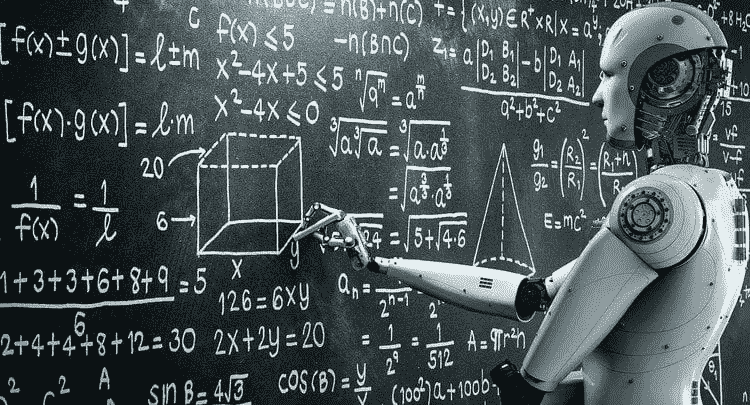
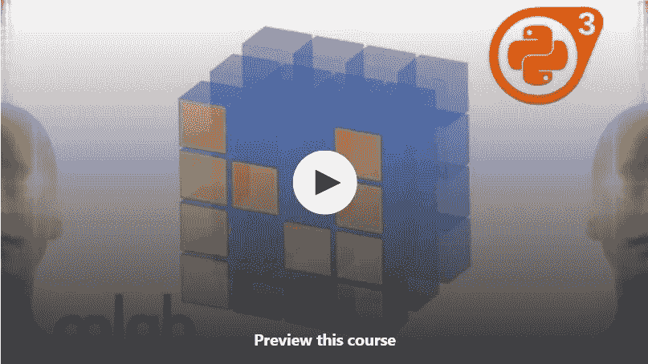
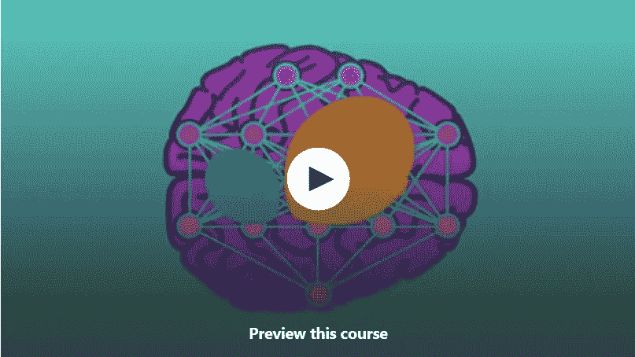
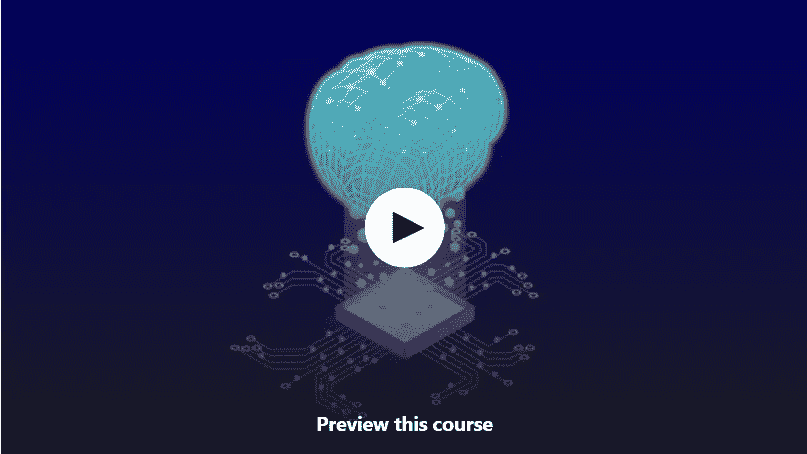
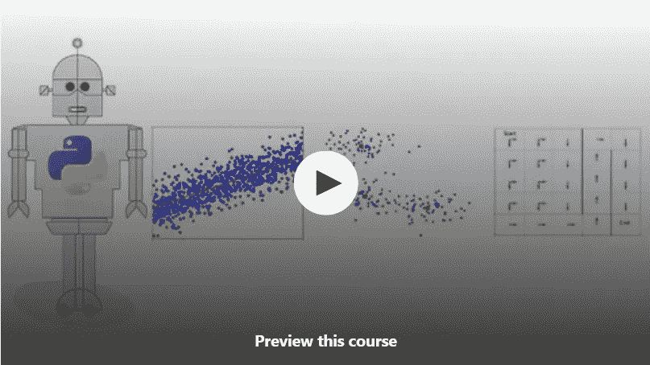
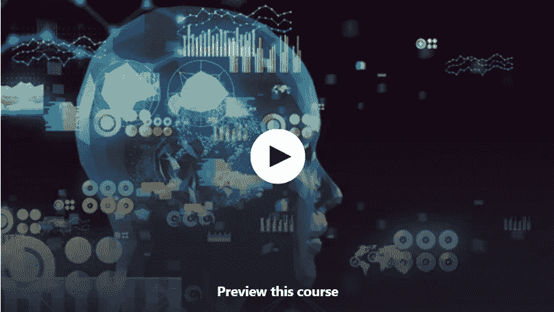
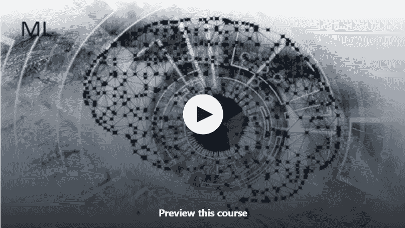
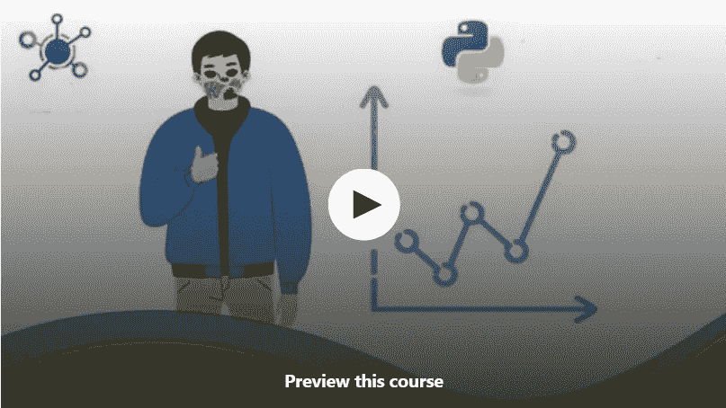

# 2023 年 10 个最适合初学者加入的免费机器学习课程

> 原文：<https://medium.com/javarevisited/10-free-machine-learning-courses-for-beginners-181f83b4c816?source=collection_archive---------0----------------------->

## 从 Udemy、Coursera、freeCodeCamp 和其他在线门户网站收集了学习机器学习的最佳免费在线课程

如果你想在 2023 年学习机器学习和深度学习，并寻找免费的在线课程和教程，那么你来对地方了。早些时候，我已经分享了针对初学者的免费数据科学课程</javarevisited/10-free-data-science-online-courses-for-beginners-a5fe78c2cb7b>**，在本文中，我将分享一些在线学习机器学习和深度学习的最佳免费资源。**

**如果你现在开始机器学习，那么你很幸运，你有这么多免费和付费的资源，可以节省你很多时间和麻烦。当我第一次开始机器学习时，我很难搞清楚一切是如何工作的。机器学习用什么库最好？哪种算法最适合哪种数据集，而且没有那么多资源。**

**我花了很多时间在教程、课程和免费资源上，学习关键的[机器学习算法](https://www.java67.com/2020/07/top-5-machine-learning-algorithms-for-beginners.html)和概念。为了节省任何想学习机器学习的人的时间，我创建了这篇文章，提供了学习机器学习所需的所有免费资源。**

**顺便说一句，如果你正在考虑学习[数据科学](/javarevisited/top-10-resources-to-learn-data-science-and-machine-learning-best-of-lot-f153e1f44e89)、[机器学习](https://dev.to/javinpaul/11-best-resources-to-learn-data-science-and-machine-learning-in-2020-2od)或[深度学习](/javarevisited/top-5-advanced-deep-learning-and-neural-network-courses-to-learn-in-2020-a273f5eddca5)，那么你并不孤单，世界各地越来越多的人开始学习这些高级技能。**

**不过，我看到印度工程师对机器学习和人工智能领域很感兴趣。他们完全被开发程序的热潮所吸引，这些程序可以识别数字、字母、车辆和其他一些图像扫描的东西。

这种狂热非常类似于 20 世纪 80 年代的程序员对视频游戏的狂热，当你的程序正确识别出你手里的数字或字母时，在屏幕上移动一个角色会给你带来快乐。

从大学毕业生到初级程序员，从经验丰富的程序员到软件架构师，所有人都对[机器学习](http://www.java67.com/2018/10/top-10-data-science-and-machine-learning-courses.html)和[人工智能](https://www.java67.com/2019/11/top-5-artificial-intelligence-courses.html)表现出兴趣，成为我们可能正在见证的下一次技术革命的一部分。

顺便说一句，如果你对什么是[机器学习](https://javarevisited.blogspot.com/2018/03/top-5-data-science-and-machine-learning-online-courses-to-learn-online.html)和[深度学习](https://javarevisited.blogspot.com/2018/10/data-science-and-machine-learning-courses-using-python-and-R-programming.html)感到疑惑，那么让我给你简单介绍一下。

机器学习程序使用算法来解析数据，从数据中学习，并根据所学做出明智的决策。其中一个例子是从一堆黄瓜中选择最好的，这是一个日本程序员做的，你可以在这里阅读完整的故事。

另一方面，深度学习将算法分层构建，以创建一个能够自主学习和做出智能决策的“人工神经网络”。这比机器学习更复杂。**

**顺便说一句，如果你不介意花几块钱学习像机器学习这样有价值的技能，那么我也推荐你去看看 [**机器学习 A-Z:动手 Python&R**](https://click.linksynergy.com/fs-bin/click?id=JVFxdTr9V80&subid=0&offerid=634352.1&type=10&tmpid=14538&RD_PARM1=https%3A%2F%2Fwww.udemy.com%2Fmachinelearning%2F)**如果你需要一个全面、深入的机器学习课程。****

****<https://click.linksynergy.com/fs-bin/click?id=JVFxdTr9V80&subid=0&offerid=634352.1&type=10&tmpid=14538&RD_PARM1=https%3A%2F%2Fwww.udemy.com%2Fmachinelearning%2F>  

这个 45 小时的课程是从头开始学习机器学习的最完整的资源，你可以在 Udemy sales 上花 10 美元购买，这几乎是免费的。

# 2023 年 10 个最适合初学者加入的免费机器学习课程

在我分享课程列表之前，我想澄清一下，尽管这些课程是免费的，但它们的质量并不差，它们只是由讲师出于宣传和教育目的而免费提供的。

反正这里是我列出的一些*最好的免费在线课程自己在线学习机器学习和深度学习*。

## 1.[吴恩达的机器学习](https://coursera.pxf.io/c/3294490/1164545/14726?u=https%3A%2F%2Fwww.coursera.org%2Flearn%2Fmachine-learning)【Coursera 免费课程】

这可能是学习机器学习的最好的免费在线课程，也很可能是最受欢迎的课程。已经有超过 400 万人加入了这个课程，所以不需要任何介绍。

这门课程的创始人不是别人，正是机器学习和人工智能的先驱、Coursera 的创始人之一 [**吴恩达**](https://coursera.pxf.io/c/3294490/1164545/14726?u=https%3A%2F%2Fwww.coursera.org%2Finstructor%2Fandrewng) 。他还撰写了许多受欢迎的 Coursera 课程和认证，如 [**深度学习专业化**](https://coursera.pxf.io/c/3294490/1164545/14726?u=https%3A%2F%2Fwww.coursera.org%2Fspecializations%2Fdeep-learning) 和[**AI For everybody**](https://coursera.pxf.io/c/3294490/1164545/14726?u=https%3A%2F%2Fwww.coursera.org%2Flearn%2Fai-for-everyone)，全球有数百万学习者加入。

回到本课程，在本课程中，您将了解最有效的机器学习技术，获得实施这些技术的实践，并让它们为您自己服务。

更重要的是，你不仅会学到学习的理论基础，还会获得快速有效地将这些技术应用于新问题所需的实际知识。

最后，你将了解硅谷在创新方面的一些最佳实践，因为它与机器学习和人工智能有关。Coursera 也是最好的机器学习认证</javarevisited/top-10-machine-learning-and-data-science-certifications-and-training-courses-for-beginners-and-a6308497b764>**的所在地，如果你想成为一名大师，Coursera 是最好的起点。**

**以下是本课程涵盖的内容:**

1.  **监督学习**
2.  **无监督学习**
3.  **机器学习的最佳实践**

**该课程还将借鉴大量的案例研究和应用，以便您也可以学习如何将学习算法应用于构建智能机器人、文本理解、计算机视觉、医学信息学、音频、数据库挖掘和其他领域。**

****这里是加入这个免费课程** — [机器学习](https://coursera.pxf.io/c/3294490/1164545/14726?u=https%3A%2F%2Fwww.coursera.org%2Flearn%2Fmachine-learning)的链接**

****

**顺便说一句，因为这是免费课程，你不会得到任何证书。如果你是为了获得 Coursera 证书而加入的，那么你需要注册专业化或参加订阅计划，如 [**Coursera Plus**](https://coursera.pxf.io/c/3294490/1164545/14726?u=https%3A%2F%2Fwww.coursera.org%2Fcourseraplus) ，该计划提供 5000 多个 Coursera 课程、项目和专业证书的无限制访问。**

**<https://coursera.pxf.io/c/3294490/1164545/14726?u=https%3A%2F%2Fwww.coursera.org%2Fcourseraplus> ** 

## **2.[深度学习先决条件:Python V2 中的 Numpy 栈](https://click.linksynergy.com/deeplink?id=JVFxdTr9V80&mid=39197&murl=https%3A%2F%2Fwww.udemy.com%2Fcourse%2Fnumpy-python%2F)**

**这是 Udemy 上又一个学习深度学习和 NumPy stack 的优秀免费课程。这涵盖了四个主要的 Python 库，如 Numpy、Scipy、Pandas 和 Matplotlib 栈，它们对深度学习、机器学习和人工智能至关重要。**

**由 [Lazy Programmer Inc](https://click.linksynergy.com/deeplink?id=JVFxdTr9V80&mid=39197&murl=https%3A%2F%2Fwww.udemy.com%2Fuser%2Flazy-programmer%2F) 创建，Udemy 上几个 Udemy 畅销课程的创建者，如 [Tensorflow 2.0:深度学习和人工智能](https://click.linksynergy.com/deeplink?id=JVFxdTr9V80&mid=39197&murl=https%3A%2F%2Fwww.udemy.com%2Fcourse%2Fdeep-learning-tensorflow-2%2F)，这个 2 小时长的课程将教你所有这些库，并学习如何使用 Scikit-Learn 通过真实世界的例子来监督机器学习(分类和回归)。

你还将学习如何使用 [Numpy](https://javarevisited.blogspot.com/2018/10/top-8-python-libraries-for-data-science-machine-learning.html) 、Scipy、Matplotlib 和 [Pandas](https://javarevisited.blogspot.com/2019/10/top-5-courses-to-learn-pandas-for-data-analysis-python.html) 实现数值算法，最重要的是，你将学习各种机器学习模型的优缺点，包括深度学习、决策树、随机森林、线性回归、Boosting 等。**

**如果你不知道，Numpy 提供了基本的构建块，像向量、矩阵和对它们的操作，而 Scipy 使用那些通用的构建块来做特定的事情。

[Panda 的](https://becominghuman.ai/5-best-courses-to-learn-pythons-pandas-libary-for-data-analysis-and-data-science-34b62abb0e96)优势在于加载数据，尤其是从数据库中加载数据，而 Matplotlib 则有助于使用一些标准图表查看数据，如折线图、散点图和直方图。

简而言之，使用 Numpy、Scipy、Pandas、Matplotlib 栈学习深度学习的优秀免费课程。**

****这里是免费加入本课程的链接**——[深度学习先决条件:Python V2 中的 Numpy 栈](https://click.linksynergy.com/deeplink?id=JVFxdTr9V80&mid=39197&murl=https%3A%2F%2Fwww.udemy.com%2Fcourse%2Fnumpy-python%2F)**

****

## **3.[用 Scikit 学习实用机器](https://click.linksynergy.com/deeplink?id=JVFxdTr9V80&mid=39197&murl=https%3A%2F%2Fwww.udemy.com%2Fcourse%2Fmachine-learning-one-hour%2F)【免费课程】**

**这是另一个来自 Udemy 的学习机器学习的免费课程，它专注于 SciKit-Learn。如果你不知道 Scikit 是流行的 Python 机器学习库之一。**

**它最初是由 David Cournapeau 在 2007 年作为谷歌代码之夏项目开发的，从那时起，它已经成为许多程序员的事实上的机器学习库。Scikit-Learn 对初学者来说尤其重要，因为它为许多任务提供了一个高级界面，允许初学者练习整个机器学习工作流程，并更好地理解大图。**

**一旦你知道 Sci-kit，你可以自己探索更强大的库，如 [TensorFlow](https://javarevisited.blogspot.com/2018/08/top-5-tensorflow-and-machine-learning-courses-online-programmers.html#axzz5YA0Ub5hS) 。**

**总之，在这门课程中，你将在一个小时内学习多种机器学习算法，以及数据预处理。你将在 sci-kit-learn 中学习回归、分类、组件分析和 boosting，这是最流行的用于 [python](https://www.java67.com/2020/05/top-5-courses-to-learn-python-in-depth.html) 的机器学习库之一**

**以下是本课程中涉及的机器学习算法列表:**

*   **线性回归**
*   **多项式回归**
*   **多元线性回归**
*   **逻辑回归**
*   **支持向量机**
*   **决策树**
*   **随机森林**
*   **主成分分析**
*   **梯度推进**
*   **XGBoost**

**简而言之，这是初学者开始机器学习之旅的完美课程。**

****这里是加入这个免费 Udemy 课程的链接**—[Scikit-Learn 实用机器学习](https://click.linksynergy.com/deeplink?id=JVFxdTr9V80&mid=39197&murl=https%3A%2F%2Fwww.udemy.com%2Fcourse%2Fmachine-learning-one-hour%2F)**

****

## **4. [Learn Keras:打造 4 款深度学习应用](https://click.linksynergy.com/deeplink?id=JVFxdTr9V80&mid=39197&murl=https%3A%2F%2Fwww.udemy.com%2Fcourse%2Flearnkeras%2F)【Udemy 免费】**

**这是学习另一个强大的 Python 机器学习库 Keras 的绝佳课程。如果你不知道，Keras 是一个既强大又易于使用的 Python 库，用于开发和评估深度学习模型。

它包装了像 Theano 和 [TensorFlow](https://hackernoon.com/top-5-tensorflow-and-ml-courses-for-programmers-8b30111cad2c) 这样的高效数值计算库，并允许您在几行简短的代码中定义和训练神经网络模型，这真是太棒了。**

**该课程由 Adam Eubanks 创建，旨在让您尽快掌握深度学习。我们在本课程中使用 [Keras](https://www.java67.com/2020/06/top-5-courses-to-learn-pytorch-and-keras.html) 是因为它是深度学习最容易学习的库之一。在每一次讲座中，你都会学到不同的机器学习算法及其用例。您将在本课程中学习的四种算法是:**

**1.线性回归**

**2.密集神经网络**

**3.卷积神经网络**

**4.递归神经网络

本课程最棒的部分是，讲师会遍历每一行代码，这样你就能理解模型和过程。如果你正在寻找深度学习的快速入门，这个课程是为你准备的。**

****这里是加入这个免费课程的链接**——[学习 Keras:构建 4 个深度学习应用](https://click.linksynergy.com/deeplink?id=JVFxdTr9V80&mid=39197&murl=https%3A%2F%2Fwww.udemy.com%2Fcourse%2Flearnkeras%2F)**

****

## **5.[什么是机器学习](https://click.linksynergy.com/deeplink?id=JVFxdTr9V80&mid=39197&murl=https%3A%2F%2Fwww.udemy.com%2Fcourse%2Fwhat-is-machine-learning%2F)【免费 Udemy 课程】**

**这是一门关于机器学习的入门课程，面向对机器学习毫无概念的初学者。这个免费的 Udemy 课程通过 Python 演示提供了一个有监督、无监督和强化学习的很好的概述**

**本课程给出了一个大的图景，(主要)监督、非监督和强化学习的非技术性概述。使用大量带有动画和情节的示例来展示想法，还展示了 Python 代码的演示**

**想要运行和试验演示代码的学生需要有一个 Google(或 Gmail)帐户，或者在他们的机器上安装 Python(可以安装 Anaconda 平台)。不需要 Python 知识就可以试验代码。**

****这里是加入本课程的链接** — [什么是机器学习](https://click.linksynergy.com/deeplink?id=JVFxdTr9V80&mid=39197&murl=https%3A%2F%2Fwww.udemy.com%2Fcourse%2Fwhat-is-machine-learning%2F)**

****

## **6.[机器学习中 50 个必须知道的概念和算法](https://click.linksynergy.com/deeplink?id=JVFxdTr9V80&mid=39197&murl=https%3A%2F%2Fwww.udemy.com%2Fcourse%2Fmust-know-in-machine-learning%2F)**

**这是 Udemy 上的又一门免费学习机器学习的课程。本课程旨在向您介绍关键的机器学习概念、算法以及您不断听到的关于机器学习的所有时髦词汇。**

**如果你想开始机器学习，那么这个课程会帮助你。它帮助你为面试做好准备，50 个概念涵盖了各种各样的话题。该课程不仅面向对机器学习有全面理解的考生，也面向回忆数据科学知识的考生。**

**本课程的结构有助于你理解关键概念，更快地为面试做好准备。这是一门提高或更新机器学习知识的好课程**

****这里是加入这个免费课程的链接**——[50 个必须知道的机器学习概念](https://click.linksynergy.com/deeplink?id=JVFxdTr9V80&mid=39197&murl=https%3A%2F%2Fwww.udemy.com%2Fcourse%2Fmust-know-in-machine-learning%2F)**

****

## **7.[学习机器学习算法、软件、深度学习](https://click.linksynergy.com/deeplink?id=JVFxdTr9V80&mid=39197&murl=https%3A%2F%2Fwww.udemy.com%2Fcourse%2Flearn-machine-learning-algorithms-softwares-deep-learning%2F)**

**这是另一个学习机器学习和深度学习的免费 Udemy 课程。本课程涵盖深度学习、神经网络、KDD、人工智能、人工智能、人工神经网络、决策树、贝叶斯网络、张量流和 Knime。**

**这也是一个在亚马逊网络服务上学习机器学习的很好的课程，涵盖了 TensorFlow、Amazon SageMaker 和其他 AWS ML 主题的概念。**

**与其他免费的 Udemy 课程不同，这个[深度学习课程](https://www.java67.com/2018/10/top-10-data-science-and-machine-learning-courses.html)相当短，你将只有 54 分钟的内容，这也使得快速学习关键概念非常有用。**

**如果你正在寻找 AWS 的机器学习速成班，那么这是一个完美的课程。**

****这里是加入这个免费课程的链接**——[学习机器学习算法、软件、深度学习](https://click.linksynergy.com/deeplink?id=JVFxdTr9V80&mid=39197&murl=https%3A%2F%2Fwww.udemy.com%2Fcourse%2Flearn-machine-learning-algorithms-softwares-deep-learning%2F)**

****

## **8.sci kit-3 小时学会[FreeCodeCamp + Youtube]**

**到目前为止，我已经包括了学习 NumPy 和 Kears 的免费在线课程，这个免费的 Udemy 课程将教你 Scikit-Learn，另一个流行的用于机器学习的 Python 库。**

**机器学习是一个快速发展的领域。然而，今天互联网上的很多课程都没有涉及一些最强大的算法。**

**在这个长达 3 小时的 Scikit-learn 完整课程中，您将学习多种机器学习算法，以及数据预处理。您将在 sci-kit-learn 中学习回归、分类、组件分析和 boosting，sci-kit-learn 是 python 最流行的机器学习库之一。**

**如果你正在寻找一个*免费的在线科学工具包课程*，那么你应该看看这个课程，你可以在这里做:**

## **9.[机器学习&线性回归:绝对基本面](https://click.linksynergy.com/deeplink?id=JVFxdTr9V80&mid=39197&murl=https%3A%2F%2Fwww.udemy.com%2Fcourse%2Fmachine-learning-linear-regression-absolute-fundamentals%2F)**

**如果你正在寻找一个基于项目的机器学习免费课程来开始学习机器学习，那么这是最适合你的课程。我非常喜欢这门课程的内容，它展示了如何在现实世界中使用机器学习。**

**这门课程是为想要开始机器学习之旅的初级 Python 开发者准备的。在本课程中，我们将使用 [Python](/javarevisited/10-free-python-tutorials-and-courses-from-google-microsoft-and-coursera-for-beginners-96b9ad20b4e6) 中 Scikit-learn 库的线性回归模型来预测印度某个特定邦的 COVID19 阳性病例总数。**

**完成本课程后，您将了解:**

1.  **什么是机器学习和数据集？**
2.  **什么是线性回归**

**5.解释什么是最佳拟合线和成本函数(MSE)**

**6.使用 pandas 库函数读取数据集并对其进行预处理**

**7.为培训和测试拆分数据**

**8.使用 Scikit-Learn 创建一个线性回归模型并训练它**

**9.评估模型并预测值**

**10.使用 matplotlib 可视化数据**

**简而言之，这是从机器学习开始并详细学习线性回归的绝佳资源。我向喜欢边做边学的 Python 程序员强烈推荐这个免费的机器学习课程。**

****这里是加入本课程** — [机器学习&线性回归](https://click.linksynergy.com/deeplink?id=JVFxdTr9V80&mid=39197&murl=https%3A%2F%2Fwww.udemy.com%2Fcourse%2Fmachine-learning-linear-regression-absolute-fundamentals%2F)的链接**

****

## **10.机器学习全程【Edureka + Youtube】**

**这是一门来自 [**Edureka**](https://click.linksynergy.com/deeplink?id=JVFxdTr9V80&mid=42536&murl=https%3A%2F%2Fwww.edureka.co%2F&LSNSUBSITE=LSNSUBSITE) 的全机器学习课程，Edureka 是一个专注于讲师指导的在线课堂培训的在线培训平台。**

**这个 Edureka 机器学习全程视频将帮助你详细了解和学习机器学习算法。这是一门庞大的课程，涵盖了你作为机器学习工程师应该知道的大多数主题。**

**这部机器学习教程对于初学者以及希望掌握机器学习算法的专业人士来说都是非常理想的。**

**以下是 Youtube 上这个[免费机器学习课程](https://www.java67.com/2019/01/5-free-courses-to-learn-machine-and-deep-learning-in-2019.html)涉及的一些话题:
1。什么是机器学习？
2。AI vs ML vs 深度学习
3。机器学习是如何工作的？
4。机器学习的类型
5。监督学习和非监督学习
6。强化学习和示例
7。AI vs 机器学习 vs 深度学习**

**正如我所说的，这是一个包含 10 小时内容的大型课程，您可以在这里观看:**

**以上就是 2023 年**学习机器学习、深度学习、人工智能的一些最好的免费课程**。正如我所说的，这些是将在未来几年统治世界的新技术，因此现在学习它们将为你提供宝贵的经验，你将远远领先于他人。

目前，一个机器学习专家也在拿着非常丰厚的薪水，解决一些有趣的世界问题，所以不仅经济上有回报，工作也真的很棒。

其他**编程课程**你可能喜欢**

*   **[2023 年学习数据科学的 10 门最佳课程](https://dev.to/javinpaul/10-data-science-and-machine-learning-courses-for-programmers-looking-to-switch-career-57kd)**
*   **[程序员必备的 5 种机器学习算法](https://www.java67.com/2020/07/top-5-machine-learning-algorithms-for-beginners.html)**
*   **[面向程序员的 2023 年 DevOps 路线图](https://javarevisited.blogspot.com/2018/09/the-2018-devops-roadmap-your-guide-to-become-DevOps-Engineer.html)**
*   **[学习数据科学 Python 的前 5 本书](https://javarevisited.blogspot.com/2019/08/top-5-python-books-for-data-science-and-machine-learning.html)**
*   **Java 和 Web 开发人员应该学习的 10 个框架**
*   **[面向程序员的 5 大 Java 设计模式课程](https://javarevisited.blogspot.com/2018/02/top-5-java-design-pattern-courses-for-developers.html)**
*   **[2023 年学习人工智能的 5 大课程](https://javarevisited.blogspot.com/2019/10/top-5-courses-to-learn-artificial-intelligence-AI.html)**
*   **[为有经验的开发者提供的 10 门免费 Java 课程](http://www.java67.com/2018/08/top-10-free-java-courses-for-beginners-experienced-developers.html)**
*   **[学习芯泉和 Spring Boot 的 5 门免费课程](http://www.java67.com/2017/11/top-5-free-core-spring-mvc-courses-learn-online.html)**
*   **[2023 年学习 Docker 的 10 门免费课程](http://www.java67.com/2018/02/5-free-docker-courses-for-java-and-DevOps-engineers.html)**
*   **[2023 年学习 Maven 和 Jenkins 的 5 门免费课程](http://www.java67.com/2018/02/6-free-maven-and-jenkins-online-courses-for-java-developers.html)**
*   **[学习 Tableau for Data Visualization 的前 5 门课程](https://javarevisited.blogspot.com/2019/07/top-5-tableau-online-courses-and-certifications-for-data-science-engineers.html)**
*   **[2023 年你应该学习的五大数据可视化工具](https://www.java67.com/2020/07/top-5-data-visualization-tools-every.html)**

**感谢您阅读本文。如果你喜欢这些*免费的机器学习课程*，那么请分享给你的朋友和同事。如果您有任何问题或反馈，请留言。**

**如果你正在寻找最好的机器学习在线课程，那么我也推荐查看 Udemy 网站上的 [**机器学习 A-Z:动手操作 Python & R**](https://click.linksynergy.com/fs-bin/click?id=JVFxdTr9V80&subid=0&offerid=634352.1&type=10&tmpid=14538&RD_PARM1=https%3A%2F%2Fwww.udemy.com%2Fmachinelearning%2F) **作者**基里尔·叶列缅科。这不是免费的，但这将是 2023 年学习机器学习的正确选择。**

**<https://click.linksynergy.com/fs-bin/click?id=JVFxdTr9V80&subid=0&offerid=634352.1&type=10&tmpid=14538&RD_PARM1=https%3A%2F%2Fwww.udemy.com%2Fmachinelearning%2F> ******