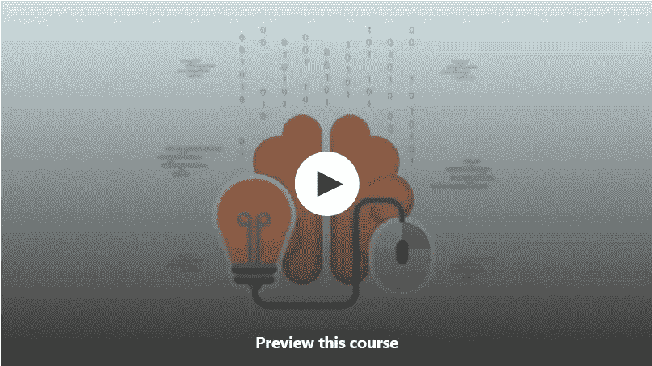
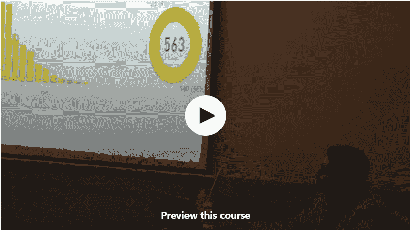

# 2023 年面向初学者的 10 门免费微软 Power BI 课程

> 原文：<https://medium.com/javarevisited/10-free-microsoft-power-bi-courses-for-beginners-19ee524008e1?source=collection_archive---------0----------------------->

## 我最喜欢的在线课程是从 Udemy、Edureka 和 edx 学习面向数据科学家和数据分析师的 Microsoft Power BI。

image_credit — Udemy

大家好，如果你想在 2023 年学习 Power BI，这也是数据可视化和商业分析的领先技术之一，并寻找免费资源，如免费在线课程，那么你来对地方了。之前我已经分享过 [**最佳 Power BI 课程**](/javarevisited/7-best-courses-to-learn-microsoft-power-bi-for-beginners-and-experienced-developers-83695c9428dc) ，今天 IA m 要分享免费在线培训课程学习 Power BI。

这些免费课程由专家创建，受到了成千上万想要学习 Power BI 的开发人员和技术人员的信任。他们也来自著名的网站，如 [Udemy](https://click.linksynergy.com/deeplink?id=CuIbQrBnhiw&mid=39197&murl=https%3A%2F%2Fwww.udemy.com%2F) 、 [Edureka](https://click.linksynergy.com/deeplink?id=JVFxdTr9V80&mid=42536&murl=https%3A%2F%2Fwww.edureka.co%2Fpower-bi-certification-training&LSNSUBSITE=LSNSUBSITE) 和 [edX](https://www.awin1.com/cread.php?awinmid=6798&awinaffid=631878&clickref=&p=) ，你们中的许多人已经很熟悉了。

这些课程最好的一点是它们完全免费，你不需要任何信用卡，你需要的只是一个免费的帐户来加入这些在线课程并学习 Power BI。

当今世界产生的数据比以往任何时候都多，公司需要利用这些数据进行决策，并提供更好的用户体验，这就是为什么他们需要熟练的员工或自由职业者从这些数据中获得洞察力，而用于[数据分析/商业智能](/javarevisited/11-best-coursera-certifications-and-courses-for-data-science-and-analysis-in-2021-65ce1ac810a5)的最佳工具是 Microsoft Power BI。

微软 Power BI 几乎是每个公司用来分析和利用其数据的工具，它提供交互式可视化用户需要注册一个帐户并将其用作在线服务，而无需下载和安装任何软件，但微软也提供该工具的可安装版本。

有一种简单的方法来获得开始使用该软件的必要技能，那就是参加一些在线课程，许多教师让他们付费，但我已经编制了五门课程来免费学习 Microsoft Power BI。作为该软件的初学者或中级用户，请随意浏览所有课程，并尝试挑选最适合您技能的课程。

顺便说一句，如果你不介意花点钱，那么我也建议你去看看 Udemy 上的[**Microsoft Power BI-完整介绍**](https://click.linksynergy.com/deeplink?id=JVFxdTr9V80&mid=39197&murl=https%3A%2F%2Fwww.udemy.com%2Fcourse%2Fpowerbi-complete-introduction%2F) 课程。这是 2023 年学习 Power BI 的最全面的课程之一，你可以在现在正在进行的 Udemy 销售中只花 9.9 美元购买。

 [## 微软 Power BI - A 完整介绍[2023 版]

### 从 13 岁开始，我从未停止学习新的编程技能和语言。早期我开始创作…

udemy.com](https://click.linksynergy.com/deeplink?id=JVFxdTr9V80&mid=39197&murl=https%3A%2F%2Fwww.udemy.com%2Fcourse%2Fpowerbi-complete-introduction%2F) 

# 2023 年我最喜欢的免费学动力 BI 的课程

为了不浪费你更多的时间，下面是我列出的 2023 年学习 Power BI 的免费在线课程。这些课程大部分来自两个领先的在线学习平台 [Udemy](https://click.linksynergy.com/deeplink?id=CuIbQrBnhiw&mid=39197&murl=https%3A%2F%2Fwww.udemy.com%2F) 和 [edX](https://www.awin1.com/cread.php?awinmid=6798&awinaffid=631878&clickref=&p=) 。

你不需要赢得所有这些课程，参加其中的几个课程就足以对 Power BI 有一个像样的了解，但如果你喜欢深入学习，你可以查看所有课程，它们都是免费的。

## 1.[力量 BI——终极取向](https://click.linksynergy.com/deeplink?id=CuIbQrBnhiw&mid=39197&murl=https%3A%2F%2Fwww.udemy.com%2Fcourse%2Fpower-bi-the-ultimate-orientation%2F)【自由】

如果您一直在使用 excel 进行数据分析和可视化，并且希望向 Power BI 迈出下一步，那么本课程可能适合您。

在没有任何经验的情况下，本课程将成为开始使用该软件并利用数据做出更好的商业决策的基础。

本课程由 Paula Guilfoyle[CPA](https://click.linksynergy.com/deeplink?id=CuIbQrBnhiw&mid=39197&murl=https%3A%2F%2Fwww.udemy.com%2Fuser%2Fpaulaguilfoyle%2F)MVP 创建，首先安装 Power BI 桌面版，然后开始将 CSV 等 excel 文件导入该工具，并使用查询编辑器将数据转换为可分析的形式，并学习如何对该数据进行交互式可视化。

稍后，您将了解如何从 Power BI Desktop 向 Power BI 服务发布报告，以及如何将设备上的文件连接到 Power BI 服务。

**这里是加入本课程的链接**——[力量 BI——终极定向](https://click.linksynergy.com/deeplink?id=CuIbQrBnhiw&mid=39197&murl=https%3A%2F%2Fwww.udemy.com%2Fcourse%2Fpower-bi-the-ultimate-orientation%2F)

## 2.[免费学习 Power BI 基础知识](https://click.linksynergy.com/deeplink?id=CuIbQrBnhiw&mid=39197&murl=https%3A%2F%2Fwww.udemy.com%2Fcourse%2Flearn_power_bi_for_free%2F)

这是 udemy 上由 Vishal Pawar 为初学者创建的最长、最好的学习微软 Power BI 的免费课程。该课程有近 18 个小时的视频内容和超过 78k 的学生注册证明了这门课程的质量。

首先，您将深入了解 Power BI，以及该软件如何将您的公司数据转化为有用的信息，然后学习如何将数据导入并连接到 Power BI。

您还将探索[数据可视化工具](/javarevisited/7-best-online-courses-to-learn-d3-js-for-data-visualization-in-2020-1a8c79add4e4?source=---------16------------------)以及学习如何使用它们，并与您的团队共享仪表盘和报告等等。

这个长达 17 个半小时的 Power BI 课程和任何付费课程一样好。说到社会证明，已经有超过 90K 人加入了这个课程，免费学习 Power BI。超过 4000 名参与者对该课程的平均评分为 4.1，这证明了该课程的质量。

以下是加入免费商务智能课程的链接— [学习强大的商务智能基础知识](https://click.linksynergy.com/deeplink?id=CuIbQrBnhiw&mid=39197&murl=https%3A%2F%2Fwww.udemy.com%2Fcourse%2Flearn_power_bi_for_free%2F)

## 3. [Power BI 仪表盘循序渐进](https://click.linksynergy.com/deeplink?id=CuIbQrBnhiw&mid=39197&murl=https%3A%2F%2Fwww.udemy.com%2Fcourse%2Fpower-bi-dashboard-step-by-step%2F)【免费 Udemy 课程】

另一个免费而有趣的学习课程是 Asif Hafeez 为初学者创建的 Microsoft Power BI。该课程只有一个小时的视频内容，大约有 4k 名学生注册，非常好，如果你有一些使用 excel 的经验，这将是一个很好的优势。

课程首先介绍软件以及如何下载和安装桌面版本。然后，您将学习如何导入数据，熟悉仪表板，以及进行交互式可视化等等。

这个 1.2 小时的课程是学习 Power BI Dashboard 的好方法，已经有超过 7000 人在 Udemy 上加入了这个[免费课程。](/javarevisited/10-free-angular-and-react-js-courses-from-udemy-and-coursera-best-of-lot-e67f7d811e6b?source=extreme_sidebar---------0-2----------------------)

如果您有兴趣从头开始学习 Power BI，那么您应该参加本课程，在讲师将本课程转变为付费课程之前学习 Power BI Dashboard。

**这里是加入这个免费课程的链接**——[动力 BI 仪表盘一步一个脚印](https://click.linksynergy.com/deeplink?id=CuIbQrBnhiw&mid=39197&murl=https%3A%2F%2Fwww.udemy.com%2Fcourse%2Fpower-bi-dashboard-step-by-step%2F)

## 4.[使用 Power BI 分析和可视化数据](https://www.awin1.com/cread.php?awinmid=6798&awinaffid=631878&platform=dl&ued=https%3A%2F%2Fwww.edx.org%2Fcourse%2Fdata-analysis-in-power-bi)【免费 edX 课程】

深入了解最常用的商业智能和数据可视化软件在这个免费的 edX 课程。

本课程由 DavidsonX 学院提供，将在大约 4 周的时间里教您 Microsoft Power BI。该课程有超过 34k 的注册人数，如果你想获得认证或观看没有完成认证的免费内容，你可以付费。

首先在您的计算机上安装 Microsoft Power BI Desktop 版本，然后开始将数据准备成可在此工具中分析和导入的表单。

之后，您将开始进行可视化，并识别不同类型的数据可视化。最后，您还将学习如何创建一个功能齐全的仪表板并与您的团队共享。

**以下是加入免费 edX 课程** — [使用 Power BI 分析和可视化数据](https://www.awin1.com/cread.php?awinmid=6798&awinaffid=631878&platform=dl&ued=https%3A%2F%2Fwww.edx.org%2Fcourse%2Fdata-analysis-in-power-bi)的链接

## 5.Power BI 入门终极指南[免费]

这是另一个令人惊讶的免费课程，了解由 Sam McKay 编写的 Microsoft Power BI。这是免费提供的高级商务智能在线培训之一。本课程旨在向数据分析师、Excel 用户和报表管理人员传授重要且强大的 Power BI 功能。

这个 Power BI 课程区别于其他免费课程的一个特点是用于练习的演示数据集，你不会在每个课程中都得到它，这是练习和学习的关键。还有测验来检查你的进度，让你保持参与。

该免费课程包含超过 3 小时的免费内容，您不仅可以学习 Power BI 基础知识，还可以学习高级报告和建模。

你可以在这里了解更多关于本课程的内容— [*异能毕终极入门*](https://www.enterprisedna.co/courses/ultimate-beginners-guide-to-power-bi/)

## 6.[强力 BI 快速入门](https://click.linksynergy.com/deeplink?id=CuIbQrBnhiw&mid=39197&murl=https%3A%2F%2Fwww.udemy.com%2Fcourse%2Fpower-bi-quick-start-create-a-pbi-dashboard-in-90-minutes%2F)【免费 Udemy 课程】

此列表中的最后一个免费课程包含近 2 小时的视频内容，将一步一步地指导您创建一个令人惊叹的交互式 Power BI 仪表盘。该课程已有近 23000 名学生注册，评分为 4.4 分，相当不错。

讲师[贾森·戴维森](https://click.linksynergy.com/deeplink?id=CuIbQrBnhiw&mid=39197&murl=https%3A%2F%2Fwww.udemy.com%2Fuser%2Fjason-davidson%2F)将解释构建一个令人惊叹的仪表板的前五个步骤，然后通过导入和转换数据开始使用该软件，开始构建交互式仪表板。

最后，您还将学习如何制作完整的报告并将其发布到 Power BI 服务中。总的来说，这是一个非常实用的免费课程，适合初学者学习 Power BI。

**以下是加入免费商务智能课程** — [商务智能快速入门](https://click.linksynergy.com/deeplink?id=CuIbQrBnhiw&mid=39197&murl=https%3A%2F%2Fwww.udemy.com%2Fcourse%2Fpower-bi-quick-start-create-a-pbi-dashboard-in-90-minutes%2F)的链接

## 7. [Power BI 全程课程—在 4 小时内学会 Power BI](https://click.linksynergy.com/deeplink?id=JVFxdTr9V80&mid=42536&murl=https%3A%2F%2Fwww.edureka.co%2Fpower-bi-certification-training&LSNSUBSITE=LSNSUBSITE)【edu reka】

这是一个 4 小时的免费课程，从 YouTube 上领先的在线教练门户网站 Edureka 学习 Power BI。Edureka 因其在线课堂培训而闻名，在这里你可以向专家现场学习。

讲这个课程有助于你详细了解和学习 Power BI。本 Power BI 教程对于初学者以及希望掌握 Power BI 概念的专业人士来说都是非常理想的。

本免费课程涵盖以下主题:

1.  商业智能和数据可视化
2.  什么是 Power BI？为什么选择 Power BI？
3.  主要优势 Power BI
4.  Power BI 的主要优势和架构
5.  Power BI 的构建模块
6.  如何使用 Power BI，包括 BI desktop
7.  功率 BI 图表和更多。

总的来说，这是一个从零开始学习 Power BI 的好课程。这个课程最好的一点是，它在 YouTube 上是免费的，这意味着你不需要帐户或登录来观看这个课程。你甚至可以在这里看。

并且，如果你想向专家现场学习，你还可以在 Edureka 上查看 [**微软 Power BI 培训。这不是免费的，但很值得。**](https://click.linksynergy.com/deeplink?id=JVFxdTr9V80&mid=42536&murl=https%3A%2F%2Fwww.edureka.co%2Fpower-bi-certification-training&LSNSUBSITE=LSNSUBSITE)

## 8.[学功毕快](https://click.linksynergy.com/deeplink?id=CuIbQrBnhiw&mid=39197&murl=https%3A%2F%2Fwww.udemy.com%2Fcourse%2Flearn-power-bi-fast%2F)【免费 Udemy 课程】

这是另一个很棒的 Udemy 课程，可以免费快速地学习 Power BI。在这门免费课程中，您不仅可以在不到 2 小时的时间内构建一份专业的电力 BI 报告，还可以[学习数据可视化基础知识](/javarevisited/5-advanced-courses-to-learn-microsoft-excel-in-depth-b556aaee5f6c?source=---------18------------------)和高级技术。

本课程包括以下内容:

1.  如何从头开始构建 Power BI 报告
2.  如何创建计算列和度量以创建更可靠的数据模型
3.  如何使用高级 DAX 来执行复杂计算
4.  设计报表的样式，使其美观、有趣
5.  将报告推送到 Power BI 服务并配置自动数据刷新
6.  如何下载并安装 Power BI Desktop 和 SQL Server 2017

总的来说，这是一门很好的课程，可以让你很快开始学习 Power BI。一些很好的问题可以引导你探索更多关于你自己的东西，并试着去理解你如何能自己做到！

**以下是加入本课程的链接—** [快速学习力量 BI](https://click.linksynergy.com/deeplink?id=CuIbQrBnhiw&mid=39197&murl=https%3A%2F%2Fwww.udemy.com%2Fcourse%2Flearn-power-bi-fast%2F)

## 9.[动力毕&动力支点:简介](https://click.linksynergy.com/deeplink?id=CuIbQrBnhiw&mid=39197&murl=https%3A%2F%2Fwww.udemy.com%2Fcourse%2Fpower-bi-power-pivot-introduction%2F)【免费】

这是 Udemy 上的另一个不错的小课程，学习如何有效地使用 Power BI 和 Power Pivot。由 Bas Dohmen 创建的这个免费课程将在 1.5 小时内教你一些关键的电力商业智能技能。

在这门免费课程中，您将学到以下内容:

1.  如何从普通透视表过渡到 [Excel](/javarevisited/10-free-courses-to-learn-microsoft-excel-for-beginners-69561f2f2678) 中的 Power Pivot 报表
2.  了解 Power BI 和 Power Pivot 作为自助式 BI 的下一步是如何运作的
3.  数据建模、构建交互式可视化和简单计算等基本概念
4.  帮助您启动和运行的实际案例
5.  向专业 BI 开发人员学习

Bas 是一名数据科学专业人员，拥有 10 年在商业智能领域提供培训和支持的经验，擅长用简单易懂的语言解释复杂的主题。这意味着您将免费向专业的 BI 开发人员学习。

**这里是加入本课程的链接**——[力量毕&力量支点:简介](https://click.linksynergy.com/deeplink?id=CuIbQrBnhiw&mid=39197&murl=https%3A%2F%2Fwww.udemy.com%2Fcourse%2Fpower-bi-power-pivot-introduction%2F)

## 10.[在 POWER BI 中一小时内创建一个仪表板](https://click.linksynergy.com/deeplink?id=CuIbQrBnhiw&mid=39197&murl=https%3A%2F%2Fwww.udemy.com%2Fcourse%2Fdashboardinanhour-powerbi%2F)[免费]

这是在 Udemy 上学习 Power BI 的另一个免费实践课程。在本课程中，您将学习如何按照逐步说明在 Power BI 中创建仪表板。

在这个免费的 Power BI 课程中，讲师准备了一个与 HR analytics 相关的仪表盘，为您提供一些动手实践。

这是一门初级课程，讲解很简单。您将执行专门的 ***分析*** 并使用内置的 ***分析*** 功能进行更深入的挖掘。

**这是参加本课程的链接** — [在 POWER BI 中一小时内创建一个仪表板](https://click.linksynergy.com/deeplink?id=CuIbQrBnhiw&mid=39197&murl=https%3A%2F%2Fwww.udemy.com%2Fcourse%2Fdashboardinanhour-powerbi%2F)

## 11.使用 POWER BI 实现数据可视化【免费】

这是 Udemy 的另一门免费课程，也是上一门课程的讲师，在这门课程中，您可以学习如何使用 Power BI 进行数据可视化。许多人不知道 Power BI 具有一些出色的数据可视化功能，本课程将让您探索这些功能。

Power BI 报告可能只有一页，只有一种视觉效果，也可能有几页都是视觉效果。区分报表*设计者*和报表*消费者*是很重要的。

如果您是构建或修改报表的开发人员，那么您就是设计人员。设计者拥有对报表及其基础数据集的编辑权限。在 Power BI Desktop 中，这意味着您可以在数据视图中打开数据集，并在报告视图中创建可视化效果。

如果您想使用 Power BI 掌握数据可视化并寻找免费的在线课程，那么本课程就是为您准备的。

**这里是加入本课程**—[POWER BI 数据可视化](https://click.linksynergy.com/deeplink?id=CuIbQrBnhiw&mid=39197&murl=https%3A%2F%2Fwww.udemy.com%2Fcourse%2Fdata-visualizations-with-power-bi%2F)的链接

根据我在互联网上的搜索结果，这就是关于学习微软 Power BI 的最佳免费课程的全部内容，你所要做的就是选择正确的课程，并开始学习新技能和制作交互式仪表盘。

Udemy 的大部分免费商务智能课程，一旦达到他们的营销目标，讲师可以将他们的免费课程转换为付费课程，因此建议现在就加入课程，即使你计划下周或下个月学习，因为一旦加入这个课程，你就可以随时免费学习。

您可能喜欢的其他**编程文章和资源**:

*   [10 门 Coursera 课程，通过分析和分析学习数据](https://javarevisited.blogspot.com/2020/08/top-10-coursera-certifications-to-learn-Data-Science-Visualization-and-Data-Analysis.html)
*   [初学者学习 Python 的 5 大课程](https://hackernoon.com/top-5-courses-to-learn-python-in-2018-best-of-lot-26644a99e7ec)
*   [面向数据科学家的 10 大 TensorFlow 课程](https://dev.to/javinpaul/10-of-the-best-tensorflow-courses-to-learn-machine-learning-from-coursera-and-udemy-37bf)
*   [初学者学习 Python 的 10 门免费课程](https://hackernoon.com/10-free-python-programming-courses-for-beginners-to-learn-online-38312f3b9912)
*   [10 个机器学习认证促进你的职业发展](/javarevisited/top-10-machine-learning-and-data-science-certifications-and-training-courses-for-beginners-and-a6308497b764)
*   [学习数据科学 Python 的 6 本最佳书籍](/javarevisited/6-best-python-books-for-data-science-and-machine-learning-in-2021-2f41d9fbf8be)
*   [学习机器学习的 10 大免费课程](/javarevisited/10-free-machine-learning-courses-for-beginners-181f83b4c816)
*   [学习 Python 做编码的 10 个理由](https://hackernoon.com/10-reasons-to-learn-python-in-2018-f473dc35e2ee)
*   [面向数据科学和机器学习的 8 大 Python 库](https://javarevisited.blogspot.com/2018/10/top-8-python-libraries-for-data-science-machine-learning.html)
*   [学习高级数据科学的前 5 门课程](https://hackernoon.com/top-5-data-science-and-machine-learning-course-for-programmers-e724cfb9940a)
*   [哈佛和 IBM 的 9 门最佳数据科学课程](https://becominghuman.ai/9-data-science-and-machine-learning-courses-by-harvard-ibm-udemy-and-others-12a0c7c23ec1)

感谢您阅读本文。如果您喜欢免费的 *Microsoft Power BI 数据可视化和分析课程*，请与您的朋友和同事分享。如果您有任何问题或反馈，请留言

**附言**——如果你不介意花点钱，我还建议你去看看 Udemy 上的[**Microsoft Power BI——完整介绍**](https://click.linksynergy.com/deeplink?id=JVFxdTr9V80&mid=39197&murl=https%3A%2F%2Fwww.udemy.com%2Fcourse%2Fpowerbi-complete-introduction%2F) 课程。这是 2023 年学习 Power BI 的最全面的课程之一，你可以在现在正在进行的 Udemy 销售中只花 9.9 美元购买。

 [## 微软 Power BI - A 完整介绍[2023 版]

### 从 13 岁开始，我从未停止学习新的编程技能和语言。早期我开始创作…

udemy.com](https://click.linksynergy.com/deeplink?id=JVFxdTr9V80&mid=39197&murl=https%3A%2F%2Fwww.udemy.com%2Fcourse%2Fpowerbi-complete-introduction%2F)