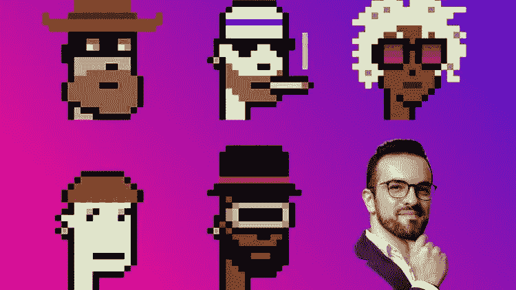
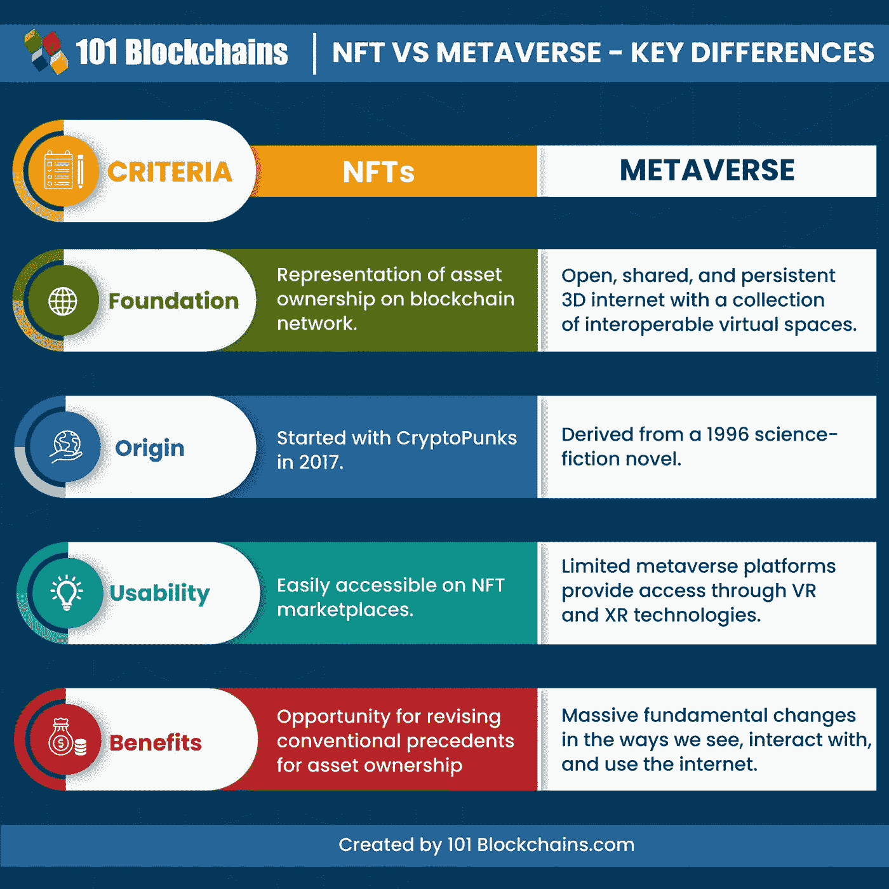
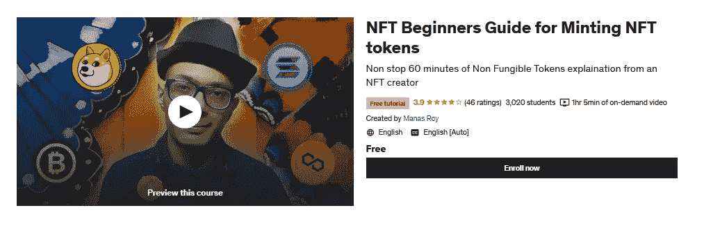
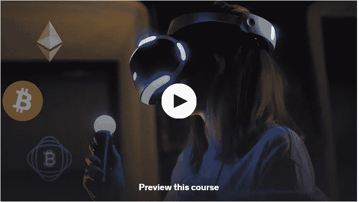
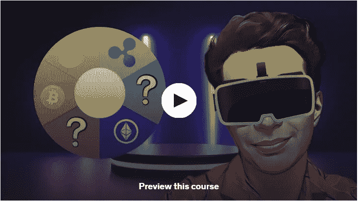
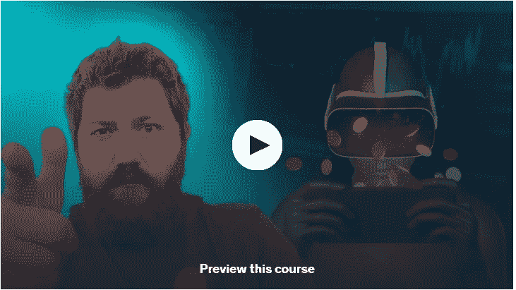
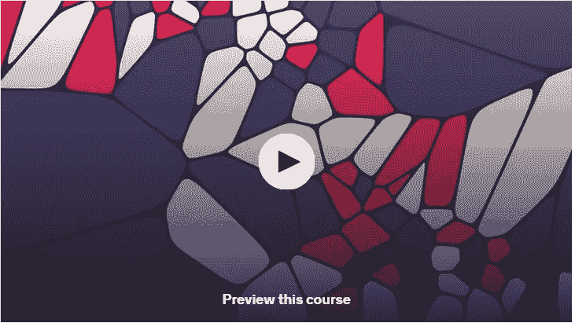
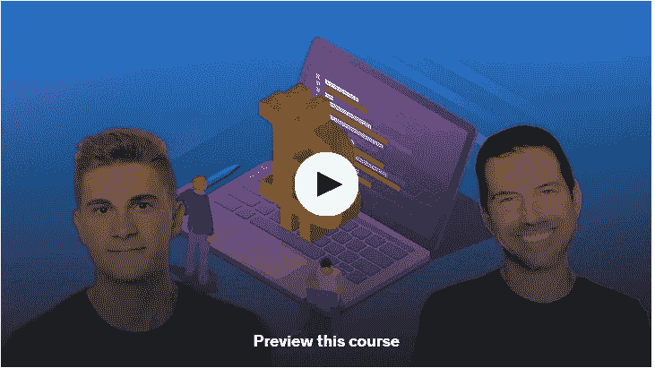
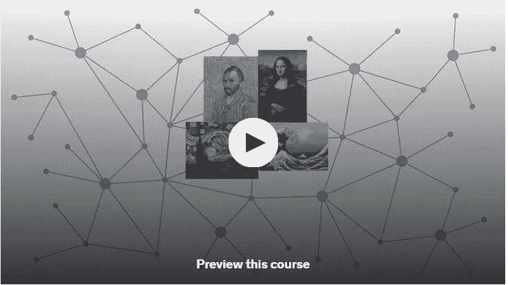
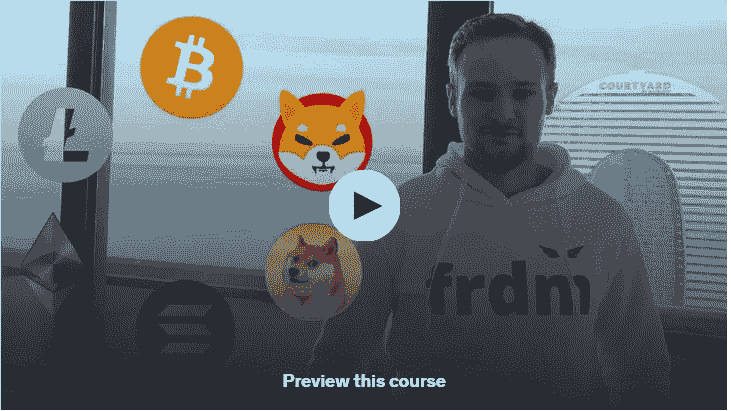

# 2022 年，为初学者提供 10 门免费的 NFT(不可替换代币)、元宇宙和 Web3.0 课程

> 原文：<https://medium.com/javarevisited/10-free-nft-non-fungible-tokens-metaverse-and-web3-0-courses-for-beginners-421b1d6ca263?source=collection_archive---------2----------------------->

## 想在 2022 年学习 NFT 或不可替代的代币吗？这些是你可以参加的最好的免费 NFT 课程，以了解 2022 年在线创建、销售和购买 NFT。

大家好，如果你想了解 NFTs 或不可替代的代币、元宇宙和 2022 年的 Web3.0，并寻找最好的免费在线课程，那么你来对地方了。早些时候，我已经分享了 [**最佳 NFT 在线课程**](/javarevisited/10-best-nfts-courses-and-certifications-for-beginners-to-learn-non-fungible-tokens-in-2022-3f36a4374ba) 和[最佳元宇宙课程](https://javarevisited.blogspot.com/2022/06/best-courses-to-learn-metaverse-online.html)，在这篇文章中，我将分享 2022 年最佳免费 NFT 初学者在线课程。

但是，在我们进入 10 个最好的免费 NFT 在线课程之前，让我告诉你它到底是什么。

NFTs，也称为[不可替代令牌](https://javarevisited.blogspot.com/2021/12/top-5-courses-to-learn-about-nfts-non.html)，基本上是唯一的加密令牌。这些令牌存在于区块链中，这意味着它们不能被复制。每个 NFT 都有唯一的标识和元数据。

NFT 可以充当简单的令牌或通信器。它与加密货币如[比特币](https://javarevisited.blogspot.com/2022/01/5-best-courses-to-learn-cryptocurrency.html)和[以太坊](https://javarevisited.blogspot.com/2021/11/top-5-courses-to-learn-ethereum-for.html)有很大不同，因为 NFT 不可互换或替代。

[NFT](https://savingsfunda.blogspot.com/2022/05/top-10-online-courses-to-learn-nfts-non-fun.html)对于提供一个公共的真实性证书非常有用，它也可以作为所有权的证明。由于这是一个非常新的发展，与非森林信托有关的法律权利还不确定。

另一个表明 NFTS 越来越受欢迎的事实是，在 2021 年，NFT 的销售额接近 250 亿美元。这是一个令人难以置信的数字，所以像脸书和耐克这样的国际大公司在 NFTs 上下大赌注也就不足为奇了。

顺便说一句，如果你能负担得起，并且不介意像 NFT 和元宇宙那样花几块钱学习一门有价值的趋势技能，那么我也建议你加入 Udemy 上的**[**【NFT 基础(购买、创建和出售 NFT)**](https://click.linksynergy.com/deeplink?id=JVFxdTr9V80&mid=39197&murl=https%3A%2F%2Fwww.udemy.com%2Fcourse%2Fnft-fundamentals%2F)课程。不免费但是值得。**

**如果你想知道 NFT 和元宇宙有什么不同，那么这张由 [**101 区块链**](http://shrsl.com/349rm) 制作的表格提供了一个很好的概览:**

****

# **2022 年学习不可替代代币的 10 门最佳免费 NFT、元宇宙和 Web 3.0 课程**

**您可以认为 NFT 基本上是一种具有唯一识别码和元数据的数字资产。在这里，我们整理了 10 个最好的免费 NFT 课程。请继续阅读，了解更多信息。**

## **1. [NFT:铸造 NFT 代币入门指南](https://click.linksynergy.com/deeplink?id=JVFxdTr9V80&mid=39197&murl=https%3A%2F%2Fwww.udemy.com%2Fcourse%2Fnft-beginners-guide-for-minting-nft-tokens%2F)[免费]**

**这是一门简短但精彩的课程，它将在 60 分钟内教会你所有关于 NFTs 的重要知识。这里需要注意的重要一点是，本课程是由一位 NFT 创造者准备的。**

**以下是你将在这个免费的 NFT 课程中学到的东西:**

1.  **什么是 NFT**
2.  **为什么 NFT 对 Web 3.0 如此重要**
3.  **如何在以太坊铸造 NFT**
4.  **非功能性食物、铸币和解决方案的提示和技巧**

**这意味着你从专家那里得到了免费的建议。你也将能够理解为什么 NFT 对 Web3.0 如此重要。**

****以下是加入本课程的链接**——[NFT:铸造 NFT 代币入门指南](https://click.linksynergy.com/deeplink?id=JVFxdTr9V80&mid=39197&murl=https%3A%2F%2Fwww.udemy.com%2Fcourse%2Fnft-beginners-guide-for-minting-nft-tokens%2F)**

****

## **2.[元宇宙大师初学者课程:Web3.0 课程](https://click.linksynergy.com/deeplink?id=JVFxdTr9V80&mid=39197&murl=https%3A%2F%2Fwww.udemy.com%2Fcourse%2Fmetaverse-maestro-course-for-beginners-web-30-course%2F)【Udemy】**

**本课程将是对 Web3.0 惊人世界的一个很好的简要介绍。它非常适合初学者，因为你将从零开始学习 NFTs。你将确切地了解什么是 Web3.0 以及为什么使用它。**

**以下是你将在这个免费的元宇宙课程中学到的东西:**

1.  **什么是元宇宙？**
2.  **元宇宙是如何改变现实世界的？**
3.  **什么是 AR(增强现实)**
4.  **什么是 VR(虚拟现实)**
5.  **如何对元宇宙项目进行逐步研究**
6.  **如何投资元宇宙项目并从中获利？**
7.  **元宇宙是如何崛起的？**
8.  **你如何在你的业务、工作和日常生活中使用元宇宙**

**简而言之，这是一个在 Udemy 上了解元宇宙的免费课程。本课程将教你关于 Web3.0 中功能组件和基于类的组件的所有知识**

****这里是加入本课程的链接**——[元宇宙大师初学者课程:Web3.0 课程](https://click.linksynergy.com/deeplink?id=JVFxdTr9V80&mid=39197&murl=https%3A%2F%2Fwww.udemy.com%2Fcourse%2Fmetaverse-maestro-course-for-beginners-web-30-course%2F)**

****

## **3. [NFT 初级课程:今天创建、销售和投资 NFTs】](https://click.linksynergy.com/deeplink?id=JVFxdTr9V80&mid=39197&murl=https%3A%2F%2Fwww.udemy.com%2Fcourse%2Fnft-course-2021-create-sell-or-invest-in-nfts-today%2F)**

**通过这门精彩的课程，你将能够掌握 NFTs 和区块链基础知识。你很快就可以开始创建、销售和投资 NFTs 了。**

**在这门免费课程中，您将学到以下内容:**

1.  **如何在几分钟内几乎免费地制作一个 NFT**
2.  **如何在 OpenSea 和 AtomicHub 上销售 NFT**
3.  **如何在网上购买 NFTs**
4.  **NFTs 和[区块链](/javarevisited/7-free-courses-to-learn-blockchain-in-2020-764e66b47ebe)如何工作**
5.  **NFT 用例的历史和未来**

**本课程将在几分钟内教您如何免费创建 NFT。您还将学习如何在 OpenSea 和 AtomicHub 上销售 NFT。**

**以下是加入本课程的链接— [NFT 初级课程:现在就创建、销售和投资 NFTs](https://click.linksynergy.com/deeplink?id=JVFxdTr9V80&mid=39197&murl=https%3A%2F%2Fwww.udemy.com%2Fcourse%2Fnft-course-2021-create-sell-or-invest-in-nfts-today%2F)**

****

## **4.[投资元宇宙:元宇宙入门指南](https://click.linksynergy.com/deeplink?id=JVFxdTr9V80&mid=39197&murl=https%3A%2F%2Fwww.udemy.com%2Fcourse%2Finvesting-in-metaverse-beginners-guide-to-metaverse%2F)【免费】**

**这是一门伟大的课程，它将帮助你从零开始学习元宇宙，也将你的元宇宙技巧带到另一个水平。在这门免费课程中，你将在 60 分钟内学会投资元宇宙和 Web 3.0 技术。**

**以下是您将在本课程中学到的关键技能:**

1.  **元宇宙是什么样子的？**
2.  **如何在元宇宙投资？**
3.  **如何在元宇宙投资中运用冷热钱包？**
4.  **为什么元宇宙投资如此酷和伟大？**
5.  **如何在 10 分钟内投资元宇宙？**

**你将能够通过使用 NFT 工具包而不是传统的工具包来做到这一点。该课程将教你如何使用元宇宙管理你的企业。**

****这里是加入本课程的链接**——[投资元宇宙:元宇宙初学者指南](https://click.linksynergy.com/deeplink?id=JVFxdTr9V80&mid=39197&murl=https%3A%2F%2Fwww.udemy.com%2Fcourse%2Finvesting-in-metaverse-beginners-guide-to-metaverse%2F)**

****

## **5. [NFT 翻转课程(批量购买、狙击和自动购买)](https://click.linksynergy.com/deeplink?id=JVFxdTr9V80&mid=39197&murl=https%3A%2F%2Fwww.udemy.com%2Fcourse%2Fnft-flipping-course-mass-bidding-sniping-opensea%2F)**

**这是一门很棒的课程，它将从零开始教你所有你需要知道的关于 NFTs 和现代技术的知识。这样的话，对于完全的初学者来说绝对是完美的。**

**以下是你将在这个[免费 NFT 教程](https://www.java67.com/2022/03/top-5-free-courses-to-learn-nft-non-fun.html)中学到的关键技能:**

1.  **如何 NFT 项目**
2.  **盈利能力计算**
3.  **分析图表**
4.  **揭露狙击**
5.  **不同种类的狙击(稀有性对特质)**
6.  **翻转 [NFTs](https://www.courserevisited.com/2022/02/10-best-courses-to-learn-nft-in-2022.html) 与投标(报价)**
7.  **不同类型的投标方法(动态、稀有、特征)**
8.  **自动购买和自动竞价**

**对于希望进入令人惊奇的 NFTs 世界的初学者来说，这是一个完美的入门指南。**

****这里是加入本课程的链接** — [NFT 翻转课程(批量购买、狙击和自动购买)](https://click.linksynergy.com/deeplink?id=JVFxdTr9V80&mid=39197&murl=https%3A%2F%2Fwww.udemy.com%2Fcourse%2Fnft-flipping-course-mass-bidding-sniping-opensea%2F)**

****

## **6.[开始使用 NFTs、Polygon、Web3、Airdrops、Crypto](https://click.linksynergy.com/deeplink?id=JVFxdTr9V80&mid=39197&murl=https%3A%2F%2Fwww.udemy.com%2Fcourse%2Fgetting-started-with-nfts-polygon%2F) 【免费】**

**在这个精彩的课程中，您将了解到 NFTs 的所有核心特性。你也将成为一个非常先进的区块链技术的开发者。你将能够掌握 Web3 和 Crypto。**

**以下是你将在这个*免费 NFT 课程*中学到的东西:**

1.  **如何安装 meta mask Chrome Extension——您的 Web3 通行证**
2.  **如何连接到面网络-开始时的最佳区块链**
3.  **如何在以太坊和多边形网络上获得令牌**
4.  **如何在 OpenSea 上创建自己的 NFT**
5.  **如何在 OpenSea 上购买你的第一个 NFT**

**本课程结束时，你将成为非功能性测试的专家。我向初学者强烈推荐这个免费的 NFT 课程。**

****这里是免费加入本课程的链接**——[NFTs、Polygon、Web3、Airdrops、Crypto 入门](https://click.linksynergy.com/deeplink?id=JVFxdTr9V80&mid=39197&murl=https%3A%2F%2Fwww.udemy.com%2Fcourse%2Fgetting-started-with-nfts-polygon%2F)**

****

## **7.[比特币、加密货币和 NFTs 的基础知识](https://click.linksynergy.com/deeplink?id=JVFxdTr9V80&mid=39197&murl=https%3A%2F%2Fwww.udemy.com%2Fcourse%2Fbasics-of-bitcoin-cryptocurrency-nfts%2F)【Udemy】**

**使用这一精彩的课程，您将能够通过了解全貌来了解 NFTs，包括比特币和其他加密货币。您将学习如何使用 Web3.0 来检查网络和移动设备的兼容性。**

**以下是您将在这个免费的加密课程中学到的技能:**

1.  **什么是比特币**
2.  **为什么比特币改变了世界**
3.  **什么是加密货币**
4.  **加密货币用例**
5.  **什么是 NFT 代币**
6.  **NFT 令牌使用案例**

**您还将能够为 NFTs 确定一个极好的测试策略。**

****这里是加入这个免费课程的链接** — [比特币、加密货币和 NFTs 的基础知识](https://click.linksynergy.com/deeplink?id=JVFxdTr9V80&mid=39197&murl=https%3A%2F%2Fwww.udemy.com%2Fcourse%2Fbasics-of-bitcoin-cryptocurrency-nfts%2F)**

****

## **8. [NFT 谷歌广告争取潜在客户](https://click.linksynergy.com/deeplink?id=JVFxdTr9V80&mid=39197&murl=https%3A%2F%2Fwww.udemy.com%2Fcourse%2Fnft-google-ads-campaigns-for-lead-generation%2F)【Udemy】**

**这是一门激动人心的课程，它将在最短的时间内教会你所有你需要知道的关于 NFTs 的基础知识。该课程还会教你所有你需要知道的关于 NFTs、Web 3.0 和加密货币的知识。**

**以下是您将在本课程中学到的内容:**

1.  **品牌与认知 NFT 谷歌广告活动**
2.  **引领一代 NFT 谷歌广告活动**
3.  **销售和重新定位 NFT 谷歌广告活动**
4.  **谷歌广告搜索，显示，重新定位**

****这是加入这个免费课程的链接**——[NFT 谷歌广告营销活动，寻找潜在客户](https://click.linksynergy.com/deeplink?id=JVFxdTr9V80&mid=39197&murl=https%3A%2F%2Fwww.udemy.com%2Fcourse%2Fnft-google-ads-campaigns-for-lead-generation%2F)**

****

## **9.[加密货币投资提示 2022:在加密上退休](https://click.linksynergy.com/deeplink?id=JVFxdTr9V80&mid=39197&murl=https%3A%2F%2Fwww.udemy.com%2Fcourse%2Fcrypto-secrets%2F) [Udemy]**

**在这个奇妙的课程中，你将学到你需要知道的关于 Web 3.0 和 NFTs 不同组件的一切。你将从学习非功能性测试的基础知识开始本课程。然后你就会明白什么是真正的 NFT。**

**以下是这个[免费加密课程](https://javarevisited.blogspot.com/2022/01/5-best-courses-to-learn-cryptocurrency.html)涵盖的内容:**

1.  **探索加密货币投资的秘密，在不到 1 小时的时间内从初学者变成专业人士。**
2.  **了解如何识别最有潜力让您获得 10 倍、100 倍甚至 1000 倍初始投资回报的加密货币！**
3.  **通过持续投资最好的长期加密货币来退休。**
4.  **了解如何投资比特币、以太坊、替代币、元宇宙币、NFT 币和迷迷币。**

**本课程结束时，你将能够创建一个非常简单但有效的投资策略。**

****这里是加入本课程的链接—** [加密货币投资提示 2022:退休于加密](https://click.linksynergy.com/deeplink?id=JVFxdTr9V80&mid=39197&murl=https%3A%2F%2Fwww.udemy.com%2Fcourse%2Fcrypto-secrets%2F)**

****

## **10. [LigoWave NFT:独立接入点](https://click.linksynergy.com/deeplink?id=JVFxdTr9V80&mid=39197&murl=https%3A%2F%2Fwww.udemy.com%2Fcourse%2Fligowave-nft-standalone-access-point%2F)【Udemy】**

**在这个精彩的课程中，你将学习如何像以前一样快速创建一个精彩的 NFT 策略。您将通过 NFT 的创意独立接入点来实现这一点。**

**以下是您将在本课程中学到的内容:**

1.  **如何将 NFT 设备配置为独立接入点模式**
2.  **如何在 NFT 设备上配置 DHCP 服务器**
3.  **在 WAN 接口上配置 DHCP 客户端**
4.  **配置正确的频带**
5.  **配置 SSID**
6.  **测试无线网络是否能在 LigoWave 接入点上工作**
7.  **检查用户是否将连接到互联网**

**这个课程最大的好处就是这个设计系统是完全免费的，也就是说你今天就可以开始。**

****以下是参加本课程的链接** — [LigoWave NFT:独立接入点](https://click.linksynergy.com/deeplink?id=JVFxdTr9V80&mid=39197&murl=https%3A%2F%2Fwww.udemy.com%2Fcourse%2Fligowave-nft-standalone-access-point%2F)**

****

**顺便说一下，如果你正在 YouTube 上寻找 NFT 教程来了解 NFT，那么这个来自 [**101 区块链**](https://shareasale.com/r.cfm?b=1696402&u=880419&m=105464&urllink=https%3A%2F%2Facademy%2E101blockchains%2Ecom%2Fcourses%2Fcertified%2Dnft%2Dprofessional&afftrack=) 的什么是 NFT 视频是一个很好的 NFT 教程，你可以在这里观看。如果你喜欢这个视频，你也可以看看他们的 [**NFT 基础**](http://shrsl.com/349r6) 课程，里面详细介绍了 NFT。**

**这就是 2022 年从零开始学习 NFT 或不可替代代币的最佳免费在线课程。这个列表包含了像 Udemy 和 Coursera 这样的网站为技术人员和非技术人员提供的最好的免费 NFT 课程。你可以参加列表中的一门或多门免费课程，深入了解 NFT。**

**你可能喜欢的其他**区块链文章和教程**:**

*   **[2022 年十大区块链认证](https://javarevisited.blogspot.com/2020/07/top-5-online-courses-to-learn-blockchain.html)**
*   **[如何从零开始学习 2022 年的元宇宙？](https://javarevisited.blogspot.com/2022/07/how-to-learn-metaverse-from-scratch-is.html)**
*   **[开发者 10 大最佳区块链课程](/javarevisited/best-blockchain-courses-and-certification-in-2020-63729f8f04d0)**
*   **[2022 年免费学习区块链的 5 个最佳地点](https://javarevisited.blogspot.com/2022/06/top-5-websites-to-learn-blockchain-in.html)**
*   **[2022 年 10 门元宇宙在线初学者课程](https://javarevisited.blogspot.com/2022/06/best-courses-to-learn-metaverse-online.html)**
*   **NFT 专业认证值得吗？**
*   **[101 区块链认证区块链开发者值得吗？](https://javarevisited.blogspot.com/2022/05/review-is-certified-enterprise-blockchain-professional-certification-worth.html)**
*   **[用区块链学习 HyperLedger Fabric 的 5 门课程](https://javarevisited.blogspot.com/2022/02/top-5-courses-to-learn-hyperledger-blockchain.html)**
*   **[2022 年区块链 5 门最佳 Coursera 课程](https://javarevisited.blogspot.com/2022/01/5-best-blockchain-certifications-and.html)**
*   **[我最喜欢的学习以太坊的在线课程](https://javarevisited.blogspot.com/2021/11/top-5-courses-to-learn-ethereum-for.html)**
*   **[2022 年学习区块链的前 5 本书](https://javarevisited.blogspot.com/2022/06/top-5-books-to-learn-blockchain-for.html)**
*   **[20 大区块链面试问题及答案](https://javarevisited.blogspot.com/2022/07/blockchain-interview-questions-answers.html)**
*   **[3 门 Coursera 课程让你在 2022 年成为区块链开发者](https://javarevisited.blogspot.com/2022/06/best-coursera-courses-for-blockchain.html)**
*   **[深度学习区块链的 6 大网站](https://dev.to/javinpaul/6-best-websites-to-become-a-blockchain-developer-in-2022-3han)**

**感谢您阅读本文。如果你喜欢 Udemy 上的这份 **10 大免费在线 NFT 课程列表，请随意与你的朋友和家人分享。如果您对 NFTs 有任何疑问，也可以发表评论，我们会尽快回复您。****

****附言——**如果你正在寻找一个 NFT 认证，不仅学习 NFT，还能获得 NFT 技能认证，那么我强烈推荐你去看看[**101 区块链**](https://shareasale.com/r.cfm?b=1696402&u=880419&m=105464&urllink=https%3A%2F%2Facademy%2E101blockchains%2Ecom%2Fcourses%2Fcertified%2Dnft%2Dprofessional&afftrack=) 认证的 NFT 专家(CNFTP)认证，这是 2022 年你可以在线获得的最全面的 NFT 认证之一。**

** [## 2022 年学习 NFT(不可替代代币)的 8 大课程-最佳选择

### 你好伙计们，如果你想知道什么是 NFT 或不可替代的令牌，什么是 NFT 周围的嗡嗡声，并有问题…

javarevisited.blogspot.com](https://javarevisited.blogspot.com/2021/12/top-5-courses-to-learn-about-nfts-non.html)**