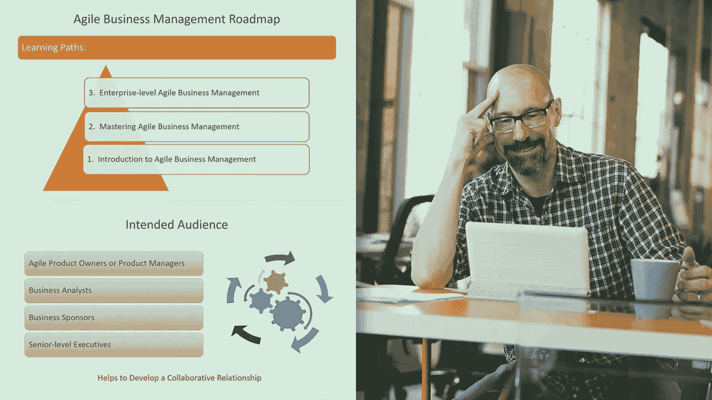
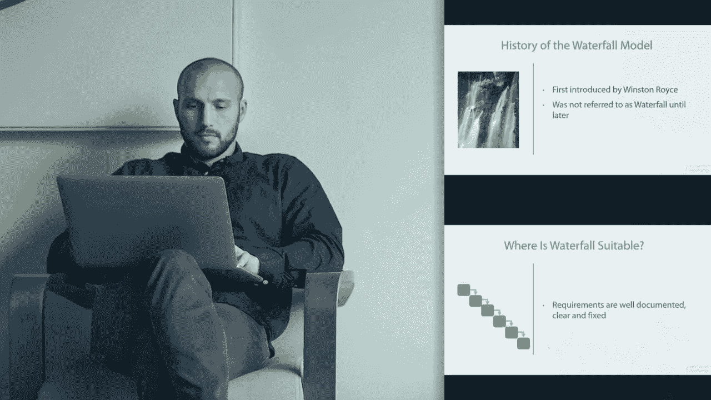
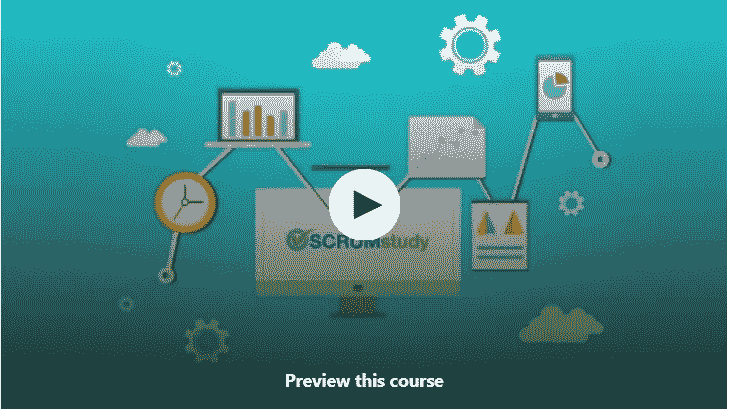
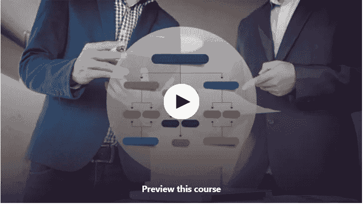
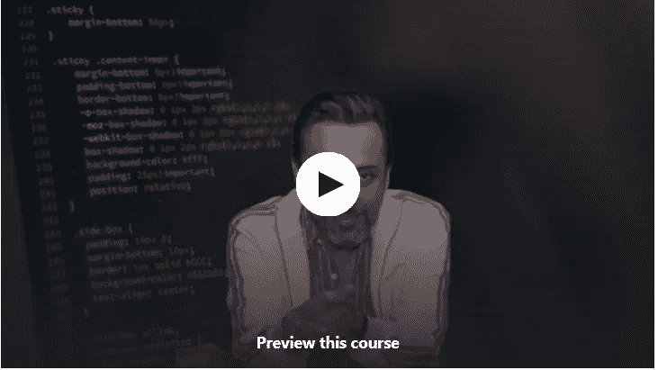
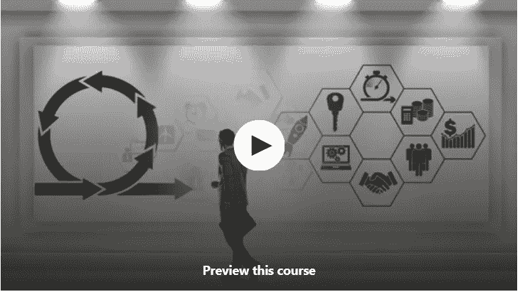
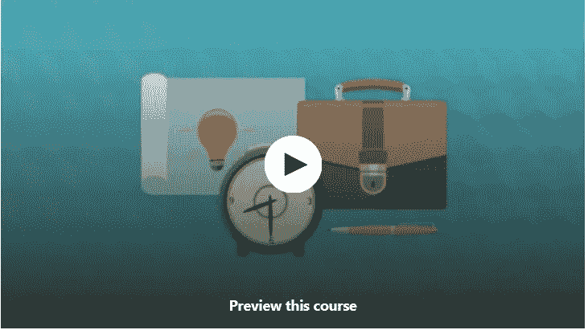
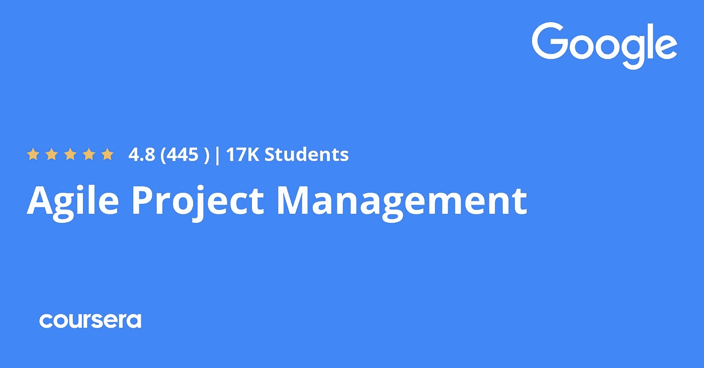

# 2023 年初学者学习敏捷和 Scrum 的 10 个最佳免费在线课程

> 原文：<https://medium.com/javarevisited/10-free-online-courses-to-learn-agile-and-scrum-for-beginners-e028711532ce?source=collection_archive---------0----------------------->

## 我最喜欢的免费在线课程是为初学者学习敏捷，包括程序员、开发人员以及项目管理新手。

image_credit — Pluralsight

技术日新月异，市场环境、激烈的竞争和上市时间是当今组织(尤其是科技公司)最关心的问题。

为了适应这种快速变化的环境，大多数公司现在都在使用敏捷的开发、测试和项目管理模式。这使得组织能够有效地应对变化，并更快地交付，这就是为什么对于程序员或 IT 专业人员来说，敏捷方法和框架的扎实知识非常重要。

你是否知道开发的瀑布模型并不重要，但是你是否在敏捷环境中工作过却很重要。为了教育程序员关于敏捷的知识，我已经分享了 [**最好的敏捷课程**](/javarevisited/7-best-agile-and-scrum-online-training-courses-3b191e9b65eb) 和最好的 [**书籍来学习敏捷**](http://javarevisited.blogspot.sg/2017/06/top-5-books-to-learn-agile-and-scrum-methodology.html) 在过去和今天，我将分享一些*免费在线敏捷课程*，你可以根据自己的进度学习敏捷方法。项目管理方法的这一技术转变也为敏捷实践者、Scrum 大师和遵循敏捷原则和实践的开发人员创造了大量的工作，例如在他们的软件开发项目中使用 Sprint、Scrum 和看板。敏捷、Scrum、Sprint、看板也是简历中非常重要的关键词，如果你了解敏捷，你应该把它们包括进去。世界各地的招聘人员在 Monster 和 LinkedIn 等求职网站上寻找这些关键词，同时审查和筛选简历，顺便说一句，如果你正在准备求职简历，请确保遵循这些 [5 个实用技巧，打造一份出色的简历](http://javarevisited.blogspot.sg/2015/12/why-programmers-should-take-their-CV-resume-seriously.html)。

作为一名程序员，你应该借此机会学习敏捷项目管理和 Scrum 框架，这是 2023 年最流行的敏捷方法论之一。你还应该花一些时间学习像 JIRA 这样的工具，这对实施敏捷实践非常重要。在这篇文章中，我将分享一些最好的免费课程来学习不同的敏捷方法，比如 Scrum 和 Sprint。通过学习这些课程，你不仅会学到一项新技能，还会获得敏捷和 [Scrum 认证](https://www.java67.com/2020/11/top-5-courses-for-scrum-master-certification.html)，并在你的职业生涯中前进，尤其是如果你渴望成为 Scrum 大师的话。随着越来越多的公司转向敏捷和 Scrum 方法，这个角色在 2023 年将会非常受欢迎。

# 2023 年学习敏捷和 Scrum 的 10 个最佳免费在线课程

这里有一些免费的学习敏捷方法的最佳课程，比如 Sprint、Kanban、Scrum 等。一些程序员认为免费资源不是一个好的品质，这是不正确的。是的，它们通常比不上付费课程的质量，但仍然是很好的资源。

例如，尽管这些课程是免费的，但它们非常好，提供了对敏捷和 Scrum 的恰当概述。你可以在自己舒适的家里和办公室里，利用空闲时间学习这些课程。

## 1.[了解敏捷与瀑布的真相](https://click.linksynergy.com/fs-bin/click?id=JVFxdTr9V80&subid=0&offerid=323058.1&type=10&tmpid=14538&RD_PARM1=https%3A%2F%2Fwww.udemy.com%2Flearn-the-truth-about-agile-versus-waterfall%2F)

在 Udemy 的这个免费敏捷课程中，您将了解到“敏捷”和“瀑布”这两个最重要的开发方法之间关系的真相，并从新的角度将这两种方法视为互补而非竞争。

这是给你一个敏捷的全面概述的系列的 7 部分中的第 1 部分。

对于任何使用敏捷方法并希望更好地理解如何将项目管理实践集成到敏捷方法中的人来说，这也是一个很好的资源。

除了程序员和软件工程师，高管、业务经理和产品经理也可以从这门课程中受益。

以下是加入本课程的链接— [了解敏捷与瀑布的真相](https://click.linksynergy.com/fs-bin/click?id=JVFxdTr9V80&subid=0&offerid=323058.1&type=10&tmpid=14538&RD_PARM1=https%3A%2F%2Fwww.udemy.com%2Flearn-the-truth-about-agile-versus-waterfall%2F)

## 2.[敏捷与亚特兰蒂斯吉拉](https://coursera.pxf.io/c/3294490/1164545/14726?u=https%3A%2F%2Fwww.coursera.org%2Flearn%2Fagile-atlassian-jira)【免费 Coursera 课程】

这是 Coursera 提供的另一个很棒的免费敏捷课程，通过 Atlassian JIRA 学习敏捷，这是你和你的团队在敏捷环境中工作需要的最重要的工具。

该课程由 JIRA 和 Confluence 背后的公司 Atlassian 大学提供，由 Coursera 上最好的讲师之一 [Steve Byrnes](https://click.linksynergy.com/deeplink?id=JVFxdTr9V80&mid=40328&murl=https%3A%2F%2Fwww.coursera.org%2Finstructor%2Fstevebyrnes) 讲授，需要大约 13 个小时完成。

本课程讨论了敏捷方法所使用的基本原则和实践，为学习者提供了一套灵活的工具，可以在任何敏捷团队中的任何角色(如产品负责人、scrum master、项目经理、团队成员)中使用。

本课程主要讨论敏捷和精益原则、看板和 scrum 敏捷方法，并使用 Atlassian 吉拉软件云作为主要的软件工具来应用主题的实践学习。

该课程包括对“经典”吉拉项目以及新的“下一代”吉拉项目的指导。您可以使用 Atlassian 吉拉软件云的免费计划来完成与本课程相关的动手实验。

完成本课程后，您将对敏捷原则和实践有深刻的基础理解，并对 Atlassian 吉拉软件云有丰富的实践经验

**这里是参加课程** — [与吉拉阿特拉斯敏捷](https://coursera.pxf.io/c/3294490/1164545/14726?u=https%3A%2F%2Fwww.coursera.org%2Flearn%2Fagile-atlassian-jira)的链接

但是为什么当参加审计专业的免费课程时，你将不会得到任何证书。如果你参加这个课程是为了获得 Coursera 证书，那么你需要注册参加这个专业或者参加一个订阅计划，比如 [**Coursera Plus**](https://coursera.pxf.io/c/3294490/1164545/14726?u=https%3A%2F%2Fwww.coursera.org%2Fcourseraplus) ，它可以提供超过 5000 个 Coursera 课程、项目和专业证书的无限制访问。

 [## Coursera Plus |无限制访问 7，000 多门在线课程

### 用 Coursera Plus 投资你的职业目标。无限制访问 90%以上的课程、项目…

coursera.pxf.io](https://coursera.pxf.io/c/3294490/1164545/14726?u=https%3A%2F%2Fwww.coursera.org%2Fcourseraplus) 

## 3.[敏捷基础](https://pluralsight.pxf.io/c/1193463/424552/7490?u=https%3A%2F%2Fwww.pluralsight.com%2Fcourses%2Fagile-fundamentals)【plural sight】

如果你完全是敏捷世界的初学者，并且想知道采用敏捷能给你的团队、你的用户和你的组织带来什么好处，那么这个 Pluralsight 课程就是为你准备的。

本课程从项目的瀑布模型开始，然后解释敏捷如何帮助软件开发。这是 Stephen 教授的一个关于敏捷的短期课程，有 2 小时 39 分钟的内容，但是包含了一些非常有用的信息。

本课程非常适合

*   软件开发人员
*   项目经理
*   软件领导地位

并且，任何对运行敏捷项目感兴趣并从中获益的人，以及尽早向您的用户、团队和组织交付最大价值的人。

**这是加入本课程的链接**——[敏捷基础](https://pluralsight.pxf.io/c/1193463/424552/7490?u=https%3A%2F%2Fwww.pluralsight.com%2Fcourses%2Fagile-fundamentals)

顺便说一下，这门课程并不完全免费，你需要一个 [Pluralsight 会员](http://pluralsight.pxf.io/c/1193463/424552/7490?u=https%3A%2F%2Fwww.pluralsight.com%2Flearn)才能观看这门课程，费用大约为每月 29 美元或每年 299 美元，但不提供对其平台上 7000 多门课程的访问。

或者，您也可以使用他们的 [**10 天免费通行证**](http://pluralsight.pxf.io/c/1193463/424552/7490?u=https%3A%2F%2Fwww.pluralsight.com%2Flearn) 免费观看这门课程，该通行证允许免费观看他们平台上的任何课程 200 分钟。

 [## 对个人来说

### Pluralsight 的使命一直是公平的技术竞争环境。不管你想学什么，或者…

pluralsight.pxf.io](http://pluralsight.pxf.io/c/1193463/424552/7490?u=https%3A%2F%2Fwww.pluralsight.com%2Flearn) 

## 4.[Scrum、敏捷和项目交付的基础知识](https://click.linksynergy.com/deeplink?id=CuIbQrBnhiw&mid=39197&murl=https%3A%2F%2Fwww.udemy.com%2Fcourse%2Fscrum-methodology%2F)【免费课程】

这是 2023 年针对初学者的又一门学习敏捷和 Scrum 的免费课程。在本课程中，您将了解卓越的产品所有权如何帮助您的公司通过敏捷开发发挥其全部潜力。它鼓励业务和技术团队作为合作伙伴走到一起，并交付价值。

在本课程中，你还将学习 SBOK 的目的和框架，并理解 Scrum 的关键概念。你还将了解 Scrum 原则、Scrum 方面和 Scrum 过程。

您还将了解产品负责人的主要职责是什么，他们如何与他人合作，以及敏捷产品经理的典型工作是什么。

**这是加入本课程的链接**——[Scrum、敏捷和项目交付的基础](https://click.linksynergy.com/deeplink?id=CuIbQrBnhiw&mid=39197&murl=https%3A%2F%2Fwww.udemy.com%2Fcourse%2Fscrum-methodology%2F)

## 5.[敏捷方法概述](https://click.linksynergy.com/fs-bin/click?id=JVFxdTr9V80&subid=0&offerid=323058.1&type=10&tmpid=14538&RD_PARM1=https%3A%2F%2Fwww.udemy.com%2Fagile-methodologies-overview%2F)【免费 Udemy 课程】

在软件开发领域，生命周期管理、敏捷项目经理和 scrum 大师非常受欢迎。您可以通过本课程获得敏捷原则和敏捷项目管理基础的介绍性概述。

本课程是从一个概述的角度来看的，但是如果你想深入学习敏捷，那么我建议你参加[敏捷武士训练营](https://click.linksynergy.com/fs-bin/click?id=JVFxdTr9V80&subid=0&offerid=323058.1&type=10&tmpid=14538&RD_PARM1=https%3A%2F%2Fwww.udemy.com%2Fthe-agile-samurai-bootcamp%2F)，它提供了所有敏捷方法的更深入的覆盖面，以及你建立、执行和成功交付你自己的敏捷项目所需的一切。

**以下是参加本课程的链接—** [敏捷方法概述](https://click.linksynergy.com/fs-bin/click?id=JVFxdTr9V80&subid=0&offerid=323058.1&type=10&tmpid=14538&RD_PARM1=https%3A%2F%2Fwww.udemy.com%2Fagile-methodologies-overview%2F)

## 6.[敏捷 Scrum 项目管理基础](https://click.linksynergy.com/deeplink?id=CuIbQrBnhiw&mid=39197&murl=https%3A%2F%2Fwww.udemy.com%2Fcourse%2Fbasics-of-agile-scrum-project-management%2F)【免费课程】

在本课程中，敏捷专家[nouruddin Surani](https://click.linksynergy.com/deeplink?id=CuIbQrBnhiw&mid=39197&murl=https%3A%2F%2Fwww.udemy.com%2Fuser%2Fnooruddinsurani%2F)概述了报告敏捷项目进展的流程。敏捷报告应该简单易读，并向整个团队提供信息。

以下是您将在本课程中学到的内容:

1.  项目和项目管理基础
2.  敏捷项目管理简介
3.  理解 Scrum
4.  Scrum 角色、事件和工件
5.  掌握不同的 Scrum 概念

敏捷团队需要一种轻量级的方式来报告他们的进展。在本课程中，您将学习如何对产品待办事项进行优先级排序，更新任务板，以及使用燃尽图监控项目的健康状况。

**这是加入本课程的链接**——[敏捷 Scrum 项目管理基础](https://click.linksynergy.com/deeplink?id=CuIbQrBnhiw&mid=39197&murl=https%3A%2F%2Fwww.udemy.com%2Fcourse%2Fbasics-of-agile-scrum-project-management%2F)

## 7.[敏捷与 Scrum——从初级到高级](https://click.linksynergy.com/deeplink?id=CuIbQrBnhiw&mid=39197&murl=https%3A%2F%2Fwww.udemy.com%2Fcourse%2Fagile-with-scrum-from-beginner-to-advanced-project-management-agile%2F)【免费课程】

这是另一个免费的在线培训课程，通过 Udemy 上的 Scrum 学习敏捷，面向初学者、高级开发人员和项目经理。

这个课程由建筑师、开发人员和产品/项目经理[卢克·安吉尔](https://click.linksynergy.com/deeplink?id=CuIbQrBnhiw&mid=39197&murl=https%3A%2F%2Fwww.udemy.com%2Fuser%2Fgeoffrey-emery%2F)创建，提供了一个从零开始成为 Scrum 忍者的很好的结构化方法。

在这个免费的敏捷教程中，你将会学到一些重要的东西:

1.  为什么选择 Scrum？Scrum 为什么有效？
2.  什么是敏捷革命
3.  如何形成 Scrum 项目解决方案
4.  Scrum 团队的角色是什么
5.  如何组建一个 Scrum 团队
6.  如何为你的项目设定愿景
7.  用户故事 101
8.  如何创建成功标准
9.  如何用故事点进行估算
10.  如何创建路线图和发布计划
11.  如何进行冲刺规划，Scrum 报告等。
12.  如何召开站立会议
13.  Scrum Backlog 整理的工作原理
14.  如何创建“完成的定义”
15.  如何创建 Sprint 演示
16.  如何进行成功的冲刺回顾

简而言之，这是一门免费学习 Scrum 和敏捷的精彩课程，适合任何想要学习敏捷和 Scrum 的人，比如 Scrum 大师、产品负责人、项目经理、程序员和开发人员

**这里是加入本课程的链接** — [敏捷与 Scrum——从初级到高级](https://click.linksynergy.com/deeplink?id=CuIbQrBnhiw&mid=39197&murl=https%3A%2F%2Fwww.udemy.com%2Fcourse%2Fagile-with-scrum-from-beginner-to-advanced-project-management-agile%2F)

## 8.[敏捷和 Scrum 概述](https://click.linksynergy.com/fs-bin/click?id=JVFxdTr9V80&subid=0&offerid=323058.1&type=10&tmpid=14538&RD_PARM1=https%3A%2F%2Fwww.udemy.com%2Fagile-scrum-overview-certification-info-course%2F)【免费 Udemy 课程】

在这个免费的敏捷在线课程中，你将学习流行的敏捷方法和框架，比如极限编程、精益、冲刺、看板和 Scrum。你还将简要学习最流行的敏捷框架——Scrum 框架。

最后，本课程提供了敏捷和 Scrum 认证的一个很好的概述，它可以为你提供在敏捷项目管理领域找到工作或成为 Scrum 大师所需的认知和知识。

如果你正在考虑在 2023 年成为一名 Scrum 大师，那么这个课程真的是一个很好的开始。

它也是免费的，所以你没有什么损失，但是如果你想要更多的资源，并且对清除 Scrum 认证很认真，你可能想查一下 [**Scrum 认证预科+Scrum Master+敏捷 Scrum 培训**](https://click.linksynergy.com/fs-bin/click?id=JVFxdTr9V80&subid=0&offerid=323058.1&type=10&tmpid=14538&RD_PARM1=https%3A%2F%2Fwww.udemy.com%2Fscrum-certification%2F) ，一个更好更全面但不免费的课程。

## 9.[让你的敏捷团队更快更高效](https://click.linksynergy.com/deeplink?id=CuIbQrBnhiw&mid=39197&murl=https%3A%2F%2Fwww.udemy.com%2Fcourse%2Fgrowing-agile-impediments%2F)【免费课程】

如果你是一个团队领导、项目经理或者 Scrum 大师，想要让你的敏捷团队更快更有成效，并且正在寻找资源，那么这个免费课程就是为你准备的。

本课程由 Samantha Laing、Karen Greaves、两位著名的敏捷教练、出版作家和《成长中的敏捷》的培训师创建，它将教你如何识别和解决阻碍你的敏捷/scrum 团队尽快发展的问题。

以下是您将在本课程中学到的内容:

1.  什么是障碍
2.  如何识别它们
3.  以及如何解决它们

在这个过程中，你将积累技能，接触到在职业生涯和个人生活中都能用到的工具。谈到社交证明，它在 13，000 多名学生中的平均评分为 4.0，这很了不起。

**这里是加入这个免费课程的链接—** [让你的敏捷团队更快更高效](https://click.linksynergy.com/deeplink?id=CuIbQrBnhiw&mid=39197&murl=https%3A%2F%2Fwww.udemy.com%2Fcourse%2Fgrowing-agile-impediments%2F)

## 10.[谷歌敏捷项目管理](https://coursera.pxf.io/c/3294490/1164545/14726?u=https%3A%2F%2Fwww.coursera.org%2Flearn%2Fagile-project-management)【免费 Coursera 课程】

这是一门学习敏捷项目管理的神奇课程，由 Google 提供。实际上是从 [*谷歌项目管理证书项目*](https://coursera.pxf.io/c/3294490/1164545/14726?u=https%3A%2F%2Fwww.coursera.org%2Fprofessional-certificates%2Fgoogle-project-management) 的第 5 个。

本课程将教授你敏捷项目管理的历史、方法和哲学，包括 Scrum 框架。你将学习如何区分和融合敏捷和其他项目管理方法。

随着课程的进行，你会学到更多关于 Scrum 的知识，探索它的支柱和价值，比较基本的 Scrum 团队角色。您还将发现如何构建、管理和细化产品积压，实施敏捷的价值驱动交付策略，以及定义价值路线图。

您还将学习有效组织 Scrum 团队的五个重要 Scrum 事件的策略，向组织介绍敏捷或 Scrum 方法，并指导敏捷团队。

最后，您将学习如何在敏捷角色中寻找和获得机会。当前的 Google 项目经理将继续指导并为您提供实践方法、工具和资源来实现您的目标。

**这是加入谷歌** — [敏捷项目管理](https://coursera.pxf.io/c/3294490/1164545/14726?u=https%3A%2F%2Fwww.coursera.org%2Flearn%2Fagile-project-management)课程的链接

虽然您可以免费旁听 Coursera 课程，但如果您需要证书，那么您需要加入专业认证计划或参加 [**Coursera Plus 订阅**](https://coursera.pxf.io/c/3294490/1164545/14726?u=https%3A%2F%2Fwww.coursera.org%2Fcourseraplus) ，它可以让您无限制地访问他们最受欢迎的课程、专业化、专业证书和指导项目。

 [## Coursera Plus |无限制访问 7，000 多门在线课程

### 用 Coursera Plus 投资你的职业目标。无限制访问 90%以上的课程、项目…

coursera.pxf.io](https://coursera.pxf.io/c/3294490/1164545/14726?u=https%3A%2F%2Fwww.coursera.org%2Fcourseraplus) 

以上是免费学习敏捷和 Scrum 的一些最好的课程**。尽管它们是免费的资源，但是对于学习 Scrum、Sprint、Kanban 和其他敏捷方法来说，它们是非常好的。如果你必须在 2023 年只学习一件事，那么它应该是敏捷的，因为你将获得的经验将大有帮助。这也会给你带来很多机会，因为现在候选人熟悉敏捷实践是非常重要的。你会接到更多的电话，可能比没有敏捷带来的机会更好。**

顺便说一句，如果你喜欢在学习新技术的同时看书，那么你也可以看看我写的关于每个开发人员都应该读的 5 本敏捷和 Scrum 书籍的文章。

其他**对程序员有用的资源**

*   【Java 程序员应该上的 5 门免费春季课程
*   [免费学习核心 Java 的 5 门课程](http://javarevisited.blogspot.sg/2017/11/top-5-free-java-courses-for-beginners.html#axzz4zuIICRs9)
*   [2023 年学习 Angular 的 5 门在线培训课程](http://www.java67.com/2018/01/top-5-free-angular-js-online-courses-for-web-developers.html)
*   [5 个网络开发人员在线节点 JS 培训课程](http://javarevisited.blogspot.sg/2018/01/top-5-nodejs-and-express-js-online-courses-for-web-developers.html)
*   [前 5 名敏捷开发和 Scrum 课程](https://www.java67.com/2020/10/best-agile-scrum-courses.html)
*   [Java 程序员学习 Android 框架的 5 门课程](http://javarevisited.blogspot.sg/2017/12/top-5-android-online-training-courses-for-Java-developers.html)
*   面向 Java 和 Scala 开发人员的 5 门 Apache Spark 课程
*   [学习 Spring Security online 的 3 门最佳课程](http://javarevisited.blogspot.sg/2017/06/3-best-spring-security-online-training-courses-java-programmers.html)
*   学习春天和冬眠的 5 门在线课程
*   [Java 开发人员十大 IT 认证](https://javarevisited.blogspot.com/2019/12/top-10-it-certifications-for-java-programmers.html)
*   [学习冲刺、敏捷和 Scrum 的前五本书](https://www.java67.com/2020/06/top-5-books-to-become-scrum-master-in.html)
*   Java 程序员在 2023 年可以学到的 21 项技术技能

感谢阅读这篇文章，如果你喜欢这些 2023 年最好的免费敏捷和 Scrum 在线课程，请与你的朋友和同事分享。如果您有任何反馈或问题，请留言。

**附言——**如果你不介意花点钱学习敏捷和 Scrum 等热门技能，那么我也建议你去看看 [**敏捷速成班:敏捷项目管理；Udemy 上的敏捷交付**](https://click.linksynergy.com/deeplink?id=JVFxdTr9V80&mid=39197&murl=https%3A%2F%2Fwww.udemy.com%2Fcourse%2Fagile-crash-course%2F) 课程。2.5 小时学习敏捷是很棒的课程。

 [## 敏捷速成班:敏捷项目管理；敏捷交付

### 简而言之，我是一名连续创业者、技术人员、生活黑客、专业项目经理和 MBA (x2)。但在内心里，我也是一个…

udemy.com](https://click.linksynergy.com/deeplink?id=JVFxdTr9V80&mid=39197&murl=https%3A%2F%2Fwww.udemy.com%2Fcourse%2Fagile-crash-course%2F)