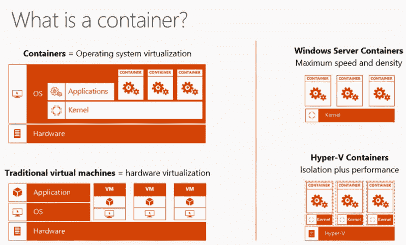
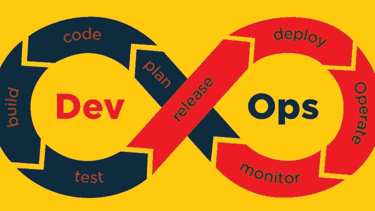
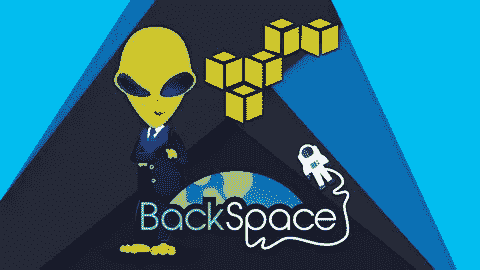
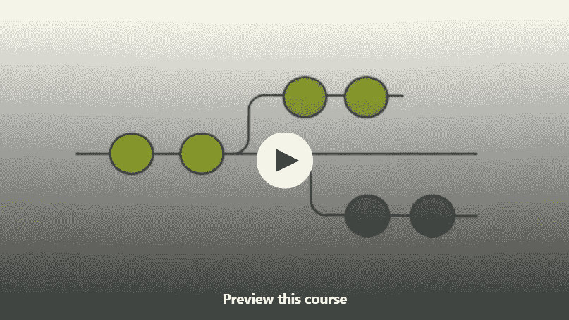
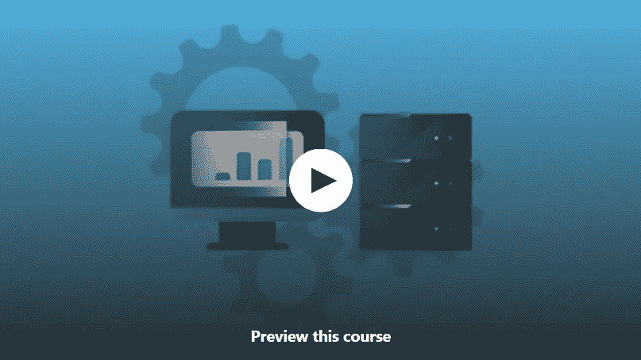
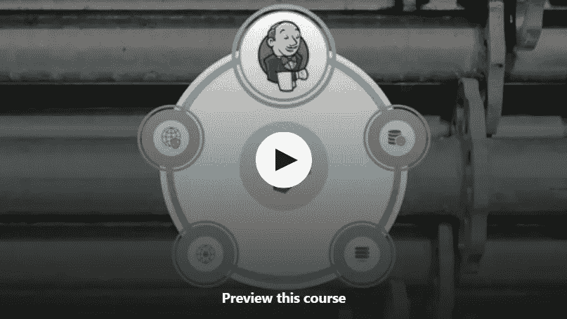
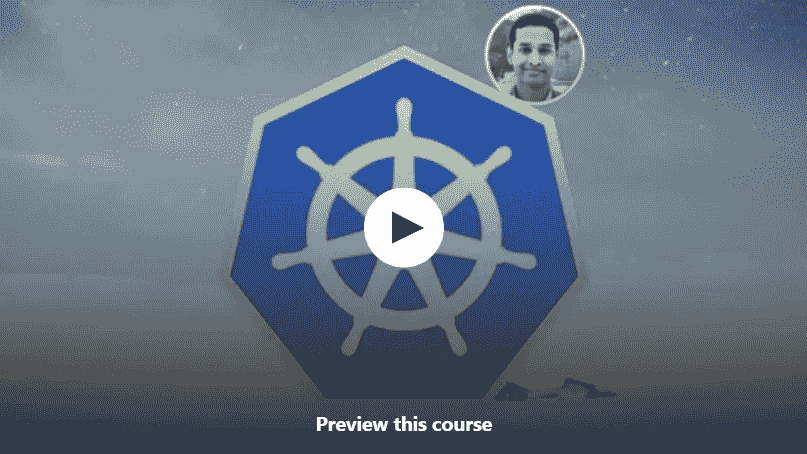
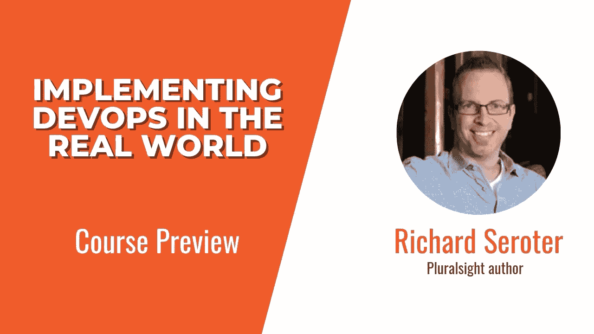

# 2023 年为初学者和有经验的开发者学习 DevOps 的 10 大免费在线课程

> 原文：<https://medium.com/javarevisited/10-free-online-courses-to-learn-devops-for-beginners-9feadb644f50?source=collection_archive---------0----------------------->

## 收集了学习 Docker、Kubernetes、Jenkins、Maven、Ansible 和其他基本 DevOps 课程的最佳免费资源，以便在 2023 年成为 DevOps 工程师。

image_credit — Pluralsight

大家好，如果你想在 2023 年成为一名 DevOps 工程师，或者只是想学习 DevOps 流程和工具来改善你的开发和交付流程，并寻找*免费 Devops 在线课程*来启动你的旅程，那么你来对地方了。

此前，我已经分享了 [DevOps 培训班](/javarevisited/13-best-courses-to-learn-devops-for-senior-developers-in-2020-a2997ff7c33c?source=extreme_sidebar---------0-2----------------------)和[最佳 DevOps 书籍](https://javarevisited.blogspot.com/2020/04/top-5-books-to-learn-devops-for-developers.html)，今天，我将分享免费在线课程来了解 DevOps。这些免费的在线课程由专家创建，受到成千上万开发者的信任。

他们是从 Udemy、Pluralsight 和 Coursera 等流行的在线学习平台中挑选出来的，他们提供实践和动手培训。

据说 DevOps 是这个世界需要的下一级技术。DevOps 是一套融合软件开发和 IT 运营的实践。这里的目标是缩短软件开发的过程，并且不损害产品的质量。通过使用 DevOps，公司部署代码的速度比以前快了 30 倍。

在这个不断变化的行业中，很少有 DevOps 方面是从敏捷技术中获得的，保持获得新的技能集是最重要的。这也是一个非常庞大的主题，正如我在这个 [DevOps 路线图](/hackernoon/the-2018-devops-roadmap-31588d8670cb)中向您展示的，您需要学习很多工具和技术

现在的问题是，你应该选择什么样的课程，可以给你最好的学习体验，并学习必要的 DevOps 工具、流程和原则。我们已经审查了专业人士和数千名学生，他们选择了不同的课程来学习这项技术，并选择了最适合您的课程。

所有这些课程都与其他课程略有不同，所以请确保您正确阅读了描述，以了解哪些课程将有利于选择该课程。

Btw，如果你能像 DevOps 一样花几块钱学一门对职业有价值的技能，那么我也强烈推荐 Jenkins，从 [**零到英雄:成为 DevOps Jenkins 高手**](https://click.linksynergy.com/deeplink?id=JVFxdTr9V80&mid=39197&murl=https%3A%2F%2Fwww.udemy.com%2Fcourse%2Fjenkins-from-zero-to-hero%2F) 课程学习 Jenkins，CI/CD，为 DevOps。

 [## 詹金斯，从零到英雄:成为一个 DevOps 詹金斯大师

### 云架构师和 Linux 专家。红帽认证工程师。红帽认证系统管理员。恩昆特罗恩…

udemy.com](https://click.linksynergy.com/deeplink?id=JVFxdTr9V80&mid=39197&murl=https%3A%2F%2Fwww.udemy.com%2Fcourse%2Fjenkins-from-zero-to-hero%2F) 

# 2023 年面向有经验开发者的 10 个最佳免费 DevOps 在线课程

以下列表包含所有免费的 DevOps 课程，可以为您提供最佳的学习过程。这些课程是由专家创建的，许多开发人员、程序员和支持人员都加入了这些课程，在线学习 DevOps。

## 1. [DevOps 速成班:学习 Jenkins Docker Kubernetes GIT](https://click.linksynergy.com/deeplink?id=CuIbQrBnhiw&mid=39197&murl=https%3A%2F%2Fwww.udemy.com%2Fcourse%2Fdevops-crash-course-learn-jenkins-docker-kubernetes-git%2F)

这是最好的免费在线课程之一，从 DevOps 开始，学习基本的 DevOps 概念和工具，开始这个课程没有先决条件，你只需要愿意学习它。

本课程是为初学者设计的，课程从课程介绍开始，并带您了解所有微妙的细节，这些细节可以给初学者一个他们需要的开始。

以下是您将在本课程中学到的内容

*   基本 DevOps 术语
*   如何部署 Kubernetes 集群
*   开发人员的工作
*   工具和功能
*   如何使用 Kops 加速 Kubernetes 集群？
*   使用带有[云](/javarevisited/5-best-cloud-computing-courses-to-learn-in-2020-f5f091159401)的 DevOps。
*   Jenkins 大师班和构建管道

本课程侧重于提供详细的学习，以便新人能够建立定期学习的信心，并在他们的道路上应用东西。

**这里是加入免费 DevOps 课程的链接**——[devo PS 速成班:学习 Jenkins Docker Kubernetes GIT](https://click.linksynergy.com/deeplink?id=CuIbQrBnhiw&mid=39197&murl=https%3A%2F%2Fwww.udemy.com%2Fcourse%2Fdevops-crash-course-learn-jenkins-docker-kubernetes-git%2F)

## 2. [DevOps —入门课程](https://click.linksynergy.com/deeplink?id=JVFxdTr9V80&mid=39197&murl=https%3A%2F%2Fwww.udemy.com%2Fcourse%2Flearn-devops%2F)【免费 Udemy 课程】

这是在 Udemy 上学习 DevOps 的最佳免费课程之一，专门为新学员提供指导和见解，帮助他们踏上旅程。

除了教你所有 DevOps 的技术性和功能性，你还将获得如何建立一个工作环境的知识。

你只需要知道基本的系统管理就可以上这门课，既然你已经在这里了，我们希望你已经知道了那么多。这门课程是由 Udemy 网站上的[最佳码头工人课程](https://click.linksynergy.com/deeplink?id=JVFxdTr9V80&mid=39197&murl=https%3A%2F%2Fwww.udemy.com%2Fcourse%2Flearn-docker%2F)的作者 [Mumshad Mannambeth](https://click.linksynergy.com/deeplink?id=JVFxdTr9V80&mid=39197&murl=https%3A%2F%2Fwww.udemy.com%2Fuser%2Fmumshad-mannambeth%2F) 创建的，他也是顶级讲师之一。

课程内容:

*   DevOps 基础
*   YAML 简介
*   DevOps 中技术的详细概述

本课程是初学者了解新技术和外部世界的必备课程。这些课程致力于给你提供关于 [DevOps](https://www.java67.com/2020/06/top-5-courses-to-learn-devops-in-2020.html) 的大量结构和功能知识。这门课程对所有的人都一视同仁，并且被证明对每个选择这门课程的学习者都有好处。

**这里是加入这个免费在线课程**—[devo PS——入门课程](https://click.linksynergy.com/deeplink?id=JVFxdTr9V80&mid=39197&murl=https%3A%2F%2Fwww.udemy.com%2Fcourse%2Flearn-devops%2F)的链接

Udemy 已经将这个免费的在线 Devops 课程列为其网站上学习 DevOps、 [Azure](https://www.java67.com/2020/07/5-free-courses-to-learn-microsoft-azure-cloud.html) 和 [Docker](/javarevisited/top-5-free-courses-to-learn-docker-for-beginners-best-of-lot-b2b1ad2b98ad?source=collection_home---4------2-----------------------) 的最佳课程之一，这是开始你的 DevOps 之旅并在 2023 年成为 DevOps 工程师的绝佳课程。

## 3.[连续交付和交付](https://coursera.pxf.io/c/3294490/1164545/14726?u=https%3A%2F%2Fwww.coursera.org%2Flearn%2Fuva-darden-continous-delivery-devops)【Coursera】

这是另一个从 Coursera(另一个流行的在线学习网站)学习 DevOps 和 CI/CID 的免费课程。本课程是为高级开发人员设计的。

要开始这门课程，你必须知道如何使用 Git，并且有编程经验(也许是在 shell 中编写脚本)，并且在 Linux 方面的一些经验会对学习有所帮助。

本课程将涵盖利用你现有知识使你成为专家的所有方面。这是一门自定进度的课程，将会很有帮助，但是您将会参加很多测验来测试自己。

课程内容:

*   DevOps 简介
*   系统架构和功能
*   如何评审和交付关于开发栈的自动化测试
*   如何设置 CI/CID 管道。

像许多 Coursera 课程一样，这也是一门免费审核的课程，这意味着你可以免费学习，但你需要支付认证、测验和评估的费用。本课程由 Alex Cowan 教授，由弗吉尼亚大学提供。

**这是加入免费 DevOps 课程**——[连续交付和 DevOps](https://coursera.pxf.io/c/3294490/1164545/14726?u=https%3A%2F%2Fwww.coursera.org%2Flearn%2Fuva-darden-continous-delivery-devops) 的链接

而且，如果你发现 Coursera 课程和专业化很有用，那么你也应该加入 [**Coursera Plus**](https://coursera.pxf.io/c/3294490/1164545/14726?u=https%3A%2F%2Fwww.coursera.org%2Fcourseraplus) ，这是 Coursera 的一个订阅计划，它为你提供**无限制访问**他们最受欢迎的课程、专业化、专业证书和指导项目。它每年花费大约 399 美元，但是它完全值得你的钱，因为你得到了无限的证书

 [## Coursera Plus |无限制访问 7，000 多门在线课程

### 用 Coursera Plus 投资你的职业目标。无限制访问 90%以上的课程、项目…

coursera.pxf.io](https://coursera.pxf.io/c/3294490/1164545/14726?u=https%3A%2F%2Fwww.coursera.org%2Fcourseraplus) 

## 4.[AWS devo PS CI/CD—code pipeline、Elastic Beanstalk 和 Mocha](https://click.linksynergy.com/deeplink?id=JVFxdTr9V80&mid=39197&murl=https%3A%2F%2Fwww.udemy.com%2Fcourse%2Fnodejs-cicd-aws-codepipeline-codebuild-mocha-zero-to-hero%2F)

这是 Udemy 上的又一个免费 Devops 课程，学习 AWS 云平台上的 DevOps。这是由专业人士设计的，旨在向您提供 DevOps 到底是什么以及如何在 AWS 云环境中实现它的观点。

在这个免费的 Udemy 课程中，您将使用 AWS CodePipeline 构建一个防弹的持续集成和持续交付(CI/CD)管道。您还将学习如何使用 Mocha 和 AWS CodeBuild 在 CI/CD 管道中集成、构建和测试流程。

以下是你将在本课程中学到的关键内容—

*   DevOps 简介
*   如何在 AWS 中创建 CI/CD 管道
*   如何使用 AWS 代码管道部署 NodeJS 应用程序
*   码头中心、蔚蓝和 VSTS
*   将 Docker 图像发布到 Azure

**以下是参加本课程的链接** — [AWS DevOps CI/CD —代码管道](https://click.linksynergy.com/deeplink?id=JVFxdTr9V80&mid=39197&murl=https%3A%2F%2Fwww.udemy.com%2Fcourse%2Fnodejs-cicd-aws-codepipeline-codebuild-mocha-zero-to-hero%2F)

本课程建立在他们之前的免费“ [**亚马逊网络服务(AWS)——零到英雄**](http://bit.ly/2CSHphy) ”课程的知识基础上，如果你是 AWS 新手，那么你也可以在加入本课程之前查看该课程，这两个课程都是免费的，你只需要一个 Udemy 帐户就可以加入这些课程。

## 5.[主 Git 和 Github for DevOps CI/CD](https://click.linksynergy.com/deeplink?id=JVFxdTr9V80&mid=39197&murl=https%3A%2F%2Fwww.udemy.com%2Fcourse%2Fgit-and-github-for-devops-ci-cd%2F) 【免费】

这是一个针对 DevOps 工程师的免费 Git 和 Github 速成班，但对开发人员、测试人员和系统管理员也很有用。Git 是 DevOps 使用代码的基本技能之一，Github 是大部分代码的存储地

这是一门速成课程，包含大量实用的实践，同时涵盖了关键概念，不会浪费像您这样的开发人员的宝贵时间。

在这门免费课程中，您将从头开始学习一些基本概念，如:

*   什么是版本控制系统
*   什么是 git 存储库，本地存储库和远程存储库有什么区别？
*   什么是分支和不同类型的分支
*   git 中文件的不同状态
*   什么是合并，如何处理冲突

这个免费课程也有很多方便有用的实验，让你成为 Git 和 Github 的专家。

**这里是加入这个免费 git 课程的链接**——[Git 大师和 Github for DevOps CI/CD](https://click.linksynergy.com/deeplink?id=JVFxdTr9V80&mid=39197&murl=https%3A%2F%2Fwww.udemy.com%2Fcourse%2Fgit-and-github-for-devops-ci-cd%2F)

## 6. [DevOps 系列—使用 Ansible 的服务器自动化](https://click.linksynergy.com/deeplink?id=JVFxdTr9V80&mid=39197&murl=https%3A%2F%2Fwww.udemy.com%2Fcourse%2Fdevops-series-server-automation-using-ansible%2F)

这是在 Udemy 学习服务器自动化的最好的免费课程之一。服务器自动化是 DevOps 的一个重要组成部分，对 DevOps 工具如 [Ansible](/javarevisited/5-best-ansible-courses-for-devops-engineers-cc87692fdf52) 和 [Chef](https://javarevisited.blogspot.com/2021/11/top-5-online-courses-to-learn-chef-and-salt.html) 的良好了解对自动化您的服务器设置过程大有帮助。

如果您不得不从头开始构建服务器，那么您应该知道创建所有这些目录结构、安装所需的软件、与不同的团队打交道以首先获得正确的权限和版本，然后长期维护它是多么痛苦。

以下是你将在这个 5.5 小时的免费课程中学到的东西—

1.  使用 vagger 设置模拟环境
2.  了解 DevOps 工具的相关性
3.  如何设置 Ansible 并理解 Ansible 词汇？
4.  如何在多台服务器上并行执行常见任务
5.  开发可重复使用的可行剧本

总的来说，这是一个很棒的免费课程，学习 Ansible 的重要概念，使用 Ansible 在多台服务器上自动执行任务。

**这里是加入这个免费 Ansible 课程的链接** — [DevOps 系列—使用 Ansible 的服务器自动化](https://click.linksynergy.com/deeplink?id=JVFxdTr9V80&mid=39197&murl=https%3A%2F%2Fwww.udemy.com%2Fcourse%2Fdevops-series-server-automation-using-ansible%2F)

## 7. [DevOps 速成班:与 Jenkins Pipelines Groovy DSL 的 CI/CD](https://click.linksynergy.com/deeplink?id=JVFxdTr9V80&mid=39197&murl=https%3A%2F%2Fwww.udemy.com%2Fcourse%2Fdevops-crash-course-cicd-with-jenkins-pipelines-groovy-dsl%2F)

如果你急于在你的项目中建立自己的 CI/CD 管道，并寻找一个快速速成课程，那么这个免费的 Udemy 课程非常适合你。

这些是你将在这个免费的 DevOps 课程中学到的关键技能—

1.  詹金斯架构基础。
2.  Jenkins 上的 Job DSL 插件的概念及其特性。
3.  利用 Jenkins DSLs 提高日常自动化和开发项目的效率。
4.  用 Jenkins DSL 实现 CICD 管道。

Jenkins 是实现持续集成和持续交付原则的最终平台，也是 DevOps 工程师最重要的工具之一。您可以使用 Jenkins 作为自动化中心，轻松运行和监控项目的持续集成和交付阶段！

**这里是加入这个免费课程的链接** — [DevOps 速成班:与 Jenkins Pipelines Groovy DSL 的 CI/CD](https://click.linksynergy.com/deeplink?id=JVFxdTr9V80&mid=39197&murl=https%3A%2F%2Fwww.udemy.com%2Fcourse%2Fdevops-crash-course-cicd-with-jenkins-pipelines-groovy-dsl%2F)

## 8. [Docker Essentials【免费 Udemy 课程】](https://click.linksynergy.com/deeplink?id=JVFxdTr9V80&mid=39197&murl=https%3A%2F%2Fwww.udemy.com%2Fcourse%2Fdocker-essentials%2F)

Docker 是 DevOps 工程师的另一个重要工具，这个免费的 Udemy 课程是为了 DevOps 和开发目的而学习 Docker 基本概念的最佳工具。

这个免费的 DevOps 和 Docker 课程将带你进入一个奇妙的旅程，学习使用 **Docker 生态系统**的关键组件**容器**。你所需要的只是关于 [Linux 基础](/javarevisited/7-best-linux-courses-for-developers-cloud-engineers-and-devops-in-2021-7415314087e1)的非常基本的知识，比如文件和进程，以及一些 Linux 命令行。

以下是你将在这门免费课程中学到的东西:

1.  集装箱和码头基础知识。
2.  如何在深入实验室的帮助下，在开发和/或生产环境中使用 Docker。
3.  如何高效使用 Docker CLI
4.  如何使用 Docker 文件创建自定义 Docker 图像
5.  如何管理您自己的 Docker hub 存储库和图像
6.  如何使用 Docker 网络和存储配置
7.  如何使用 Docker Compose 创建和运行多容器应用程序
8.  如何管理 Docker 集群

这对任何免费课程来说都太好了。在本课程结束时，你将能够像一个彻底的爱好者一样理解和欣赏 Containers 和 Docker，并像一个专业人士一样使用它们！

**这里是加入这个免费 Docker 课程的链接** — [Docker Essentials【免费 Udemy 课程】](https://click.linksynergy.com/deeplink?id=JVFxdTr9V80&mid=39197&murl=https%3A%2F%2Fwww.udemy.com%2Fcourse%2Fdocker-essentials%2F)

## 9. [Kubernetes:入门](https://click.linksynergy.com/deeplink?id=JVFxdTr9V80&mid=39197&murl=https%3A%2F%2Fwww.udemy.com%2Fcourse%2Fkubernetes-getting-started%2F)【免费 Udemy 课程】

这是我强烈推荐 2023 年每个 DevOps 工程师学习的另一个工具。Kubernetes 允许您通过自动化容器部署来扩展部署。

以下是您将在本课程中学到的主要内容:

1.  Kubernetes 基础。
2.  为什么你需要一个容器编排引擎，为什么 Kubernetes 是一个很好的选择？
3.  如何在移动、云上以及本地笔记本电脑上构建和管理生产级 Kubernetes 集群
4.  深入了解什么是 pod，它们如何连接和通信
5.  如何编写 Pod 清单文件并在 Kubernetes 上部署它

总的来说，这是一个非常好的免费课程，可以在很高的水平上学习 Kubernetes，这是您开始 DevOps 之旅时所需要的。

**这里是加入免费 Kubernetes 课程的链接**——[Kubernetes:入门](https://click.linksynergy.com/deeplink?id=JVFxdTr9V80&mid=39197&murl=https%3A%2F%2Fwww.udemy.com%2Fcourse%2Fkubernetes-getting-started%2F)

## 10.[在现实世界中实现 devo PS](https://pluralsight.pxf.io/c/1193463/424552/7490?u=https%3A%2F%2Fwww.pluralsight.com%2Fcourses%2Fimplementing-devops-real-world)【plural sight】

该课程不仅因其在 DevOps 中提供的出色教学而闻名，还因其对该技术的业务影响的洞察力而闻名。本课程将证明对希望学习 DevOps 以拓展业务的学习者是有益的。它还向您介绍了所有与 [DevOps](/javarevisited/7-best-terraform-online-courses-for-devops-engineers-5e4dab297785) 配套的不同技术。

他们在课程中介绍的其他技术没有详细讨论，但他们的描述可以帮助您了解您可以使用哪些技术来实现更好的结果。

以下是您将在本课程中学到的关键技能:

*   DevOps 简介
*   企业开发
*   持续部署
*   有用的技术
*   DevOps 世界中典型的一周

本课程最棒的部分是，当你完成本课程时，你将有一个方向，并能洞察如何以最佳方式使用该技术。感谢 Richard Seroter 创建了这个[超棒的 DevOps 课程](/javarevisited/top-5-online-courses-to-become-a-devops-engineer-in-2020-764f5e60c2b)。

**这里是加入本课程的链接** — [在现实世界中实现 devo PS](https://pluralsight.pxf.io/c/1193463/424552/7490?u=https%3A%2F%2Fwww.pluralsight.com%2Fcourses%2Fimplementing-devops-real-world)

顺便说一句，你需要一个 [Pluralsight 会员](https://pluralsight.pxf.io/c/1193463/424552/7490?u=https%3A%2F%2Fwww.pluralsight.com%2Flearn)才能观看这个课程，这个课程不是免费的，大约每月 29 美元或每年 199 美元(现在有 30%的折扣)。

如果可以的话，你应该获得 Pluralsight 会员资格来促进你的学习，因为它只需一个会员就可以访问 7000 多门在线课程。或者，你也可以使用他们的 [**10 天免费通行证**](https://pluralsight.pxf.io/c/1193463/424552/7490?u=https%3A%2F%2Fwww.pluralsight.com%2Flearn) 免费观看本课程。

 [## 个人技术技能|多视角

### 借助 Pluralsight，在开发运维、机器学习、云、安全基础设施等领域构建所需的技能…

pluralsight.pxf.io](https://pluralsight.pxf.io/c/1193463/424552/7490?u=https%3A%2F%2Fwww.pluralsight.com%2Flearn) 

这就是关于程序员和开发人员在 2023 年成为 DevOps 工程师可以参加的最好的免费 DevOps 课程。DevOps 被证明是一项了不起的技术，可以减少编码时间。公司用它来部署新软件，人们也喜欢它。

正如我所说，DevOps 是最重要的技术之一，可以帮助您在短时间内创建强大的应用程序。是时候你也从上面提到的最好的课程中学习了。请记住，不要为了洞察力和更好的理解而检查每一个问题。

DevOps 工程师和开发人员的其他**有用资源**

*   [完整的 DevOps 工程师路线图](/hackernoon/the-2018-devops-roadmap-31588d8670cb)
*   [深入学习 AWS 的 10 门课程](/javarevisited/top-10-courses-to-learn-amazon-web-services-aws-cloud-in-2020-best-and-free-317f10d7c21d)
*   [2023 年最佳阿帕奇卡夫卡课程](https://javarevisited.blogspot.com/2018/04/top-5-apache-kafka-course-to-learn.html)
*   [面向程序员的 15 门 AWS、Docker 和 Kubernetes 课程](/javarevisited/top-15-online-courses-to-learn-docker-kubernetes-and-aws-for-fullstack-developers-and-devops-d8cc4f16e773)
*   [2023 年学习 React Native 的 5 门课程](http://javarevisited.blogspot.sg/2018/02/5-react-native-courses-to-learn-mobile-development-using-JavaScript.html)
*   [10 门面向初学者的免费 Docker 课程](https://javarevisited.blogspot.com/2018/02/10-free-docker-container-courses-for-Java-Developers.html)
*   [初学者可以学习的五大课程](https://javarevisited.blogspot.com/2019/11/top-5-course-to-learn-ansible-for-devops.html)
*   [devo PS 的 7 门免费 Kubernetes 课程](/javarevisited/7-free-online-courses-to-learn-kubernetes-in-2020-3b8a68ec7abc)
*   [devo PS 工程师的 5 个最佳木偶课程](https://javarevisited.blogspot.com/2020/05/top-5-puppet-courses-for-programmers-and-devops-engineers.html)
*   给初学者的 10 门最佳 Linux 课程
*   [面向开发者的 6 门免费 Shell 脚本课程](/javarevisited/6-free-courses-to-learn-bash-shell-scripting-in-linux-and-unix-a50461ecd4fe)
*   [我最喜欢的面向前端开发者的免费 DevOps 课程](/javarevisited/10-free-courses-to-learn-docker-and-devops-for-frontend-developers-691ac7652cee?source=---------94------------------)
*   DevOps 最佳的 5 门课程和书籍
*   [2023 年学习 Kubernetes 的 5 门最佳课程](https://javarevisited.blogspot.com/2020/06/top-5-courses-to-learn-kubernetes-for-devops-and-certification.html)

**附言——**如果你不介意花几块钱学习像 DevOps 这样有价值的技能，那么你也可以在 Udemy 上看看这个 [**CI/CD(持续集成/交付，面向初学者的 devo PS**](https://click.linksynergy.com/deeplink?id=JVFxdTr9V80&mid=39197&murl=https%3A%2F%2Fwww.udemy.com%2Fcourse%2Fci-cd-devops%2F)课程。它不是免费的，但它是 Udemy 上学习 DevOps 评分最高的课程。

 [## DevOps、CI/CD(面向初学者的持续集成/交付

### CI、CD 和 DevOps 已经席卷了软件开发界。如今，大多数公司都意识到…

udemy.com](https://click.linksynergy.com/deeplink?id=JVFxdTr9V80&mid=39197&murl=https%3A%2F%2Fwww.udemy.com%2Fcourse%2Fci-cd-devops%2F)