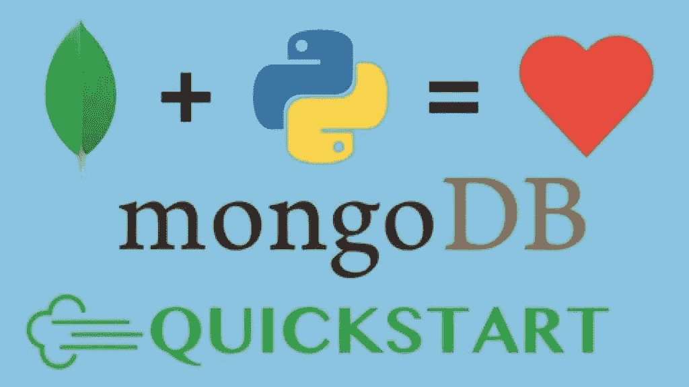
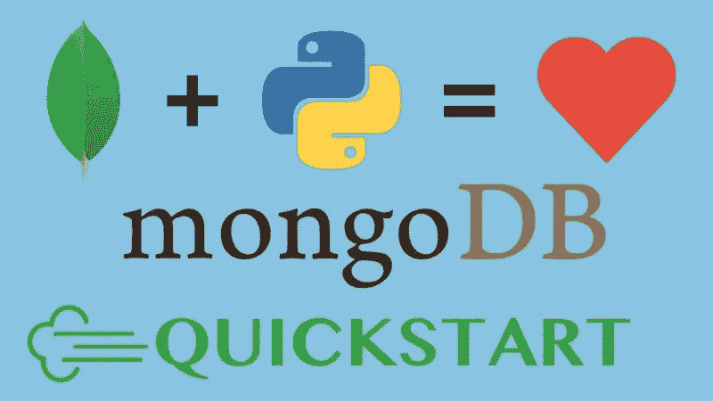
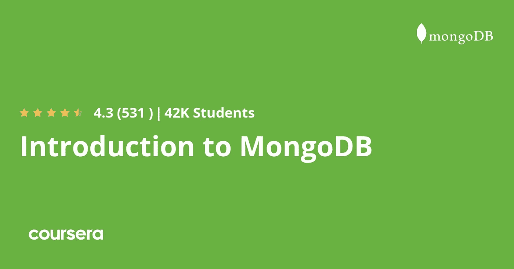
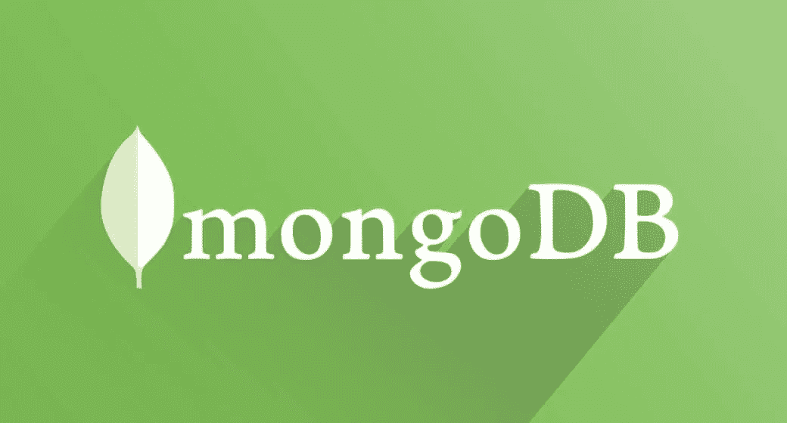
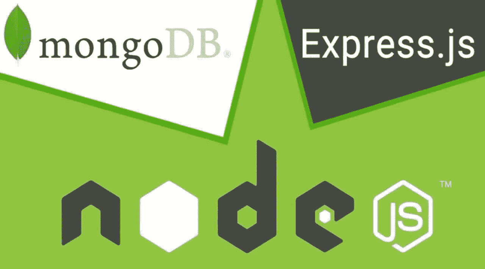
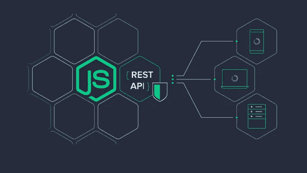

# 2023 年学习 MongoDB 和 NoSQL 的 10 门免费课程

> 原文：<https://medium.com/javarevisited/10-free-online-courses-to-learn-mongodb-and-nosql-942609611664?source=collection_archive---------0----------------------->

## 我最喜欢的免费在线 Mongo DB 课程来自 Udemy，Coursera 和 Pluralsight，在 2023 年从零开始学习 MongoDB

image_credit — Udemy

你好，如果你想学习 MongoDB，最受欢迎的 NoSQL 数据库之一，并寻找免费的 MongoDB 课程，那么你来对地方了。之前我已经分享了 [**10 门免费全栈开发课程**](/javarevisited/10-free-full-stack-java-development-courses-for-beginners-and-experienced-programmers-8473390bec03) 今天我要分享的是在线学习 Mongo DB 的免费在线课程。

这些在线课程由专家创建，出于教育目的免费提供。成千上万的学生已经加入了这些免费的 MongoDB 课程，你也可以做同样的事情来学习这种受欢迎的技能，并进一步提升你的简历以获得前沿工作。

几乎我们日常生活中接触到的每个应用程序都是数据驱动器。每一点数据对用户和公司都至关重要。为了存储数据，使用了不同的数据库。 [Oracle](/javarevisited/top-10-free-courses-to-learn-microsoft-sql-server-and-oracle-database-in-2020-6708afcf4ad7) 、 [SQL Server](/javarevisited/5-best-courses-to-learn-microsoft-sql-server-in-depth-e9f11b73c14a) 、 [PostgreSQL](/javarevisited/7-best-free-postgresql-courses-for-beginners-to-learn-in-2021-3bf369d73794) 和 [MySQL](/javarevisited/top-5-courses-to-learn-mysql-in-2020-4ffada70656f) 是最常用的数据库，但最近有十几个新数据库可用，可以取代 MySQL。

[MongoDB](/javarevisited/5-best-mongodb-courses-to-learn-nosql-for-beginners-in-2020-42df5af5496c?source=---------13----------------------------) 就是这样一个数据库。在接下来的几年里，MongoDB 将会在最常用的数据库列表中获得一席之地。因此，作为一名开发人员，如果被要求，学习 MongoDB 以毫不费力地使用 MongoDB 是至关重要的。

Mongo DB 也是 [MERN 栈](https://www.java67.com/2020/06/top-5-courses-to-learn-mern-stack-for-web-development.html)的一部分，后者是一个流行的全栈 web 开发栈。在本指南中，我将分享五个免费课程来快速学习 MongoDB。

然而，所有的*课程都是免费的*，但就知识而言，它们价值数百美元。除此之外，所有的课程都可以在在线学习平台上获得；所以，质量不会是问题。

而且，如果你热衷于学习 MongoDB 并寻找最好的 MongoDB 课程，那么我强烈建议你查看 Udemy 网站上 Maximillian Schwarzmuller 的**这个**[**MongoDB——2023 年**](https://click.linksynergy.com/deeplink?id=JVFxdTr9V80&mid=39197&murl=https%3A%2F%2Fwww.udemy.com%2Fcourse%2Fmongodb-the-complete-developers-guide%2F) 开发人员完全指南课程。这不是免费的，但这是一个很棒的课程，你可以在 Udemy 上花 10 美元深入学习 Mongo DB。

 [## MongoDB——2023 年完整开发者指南

### 从 13 岁开始，我从未停止学习新的编程技能和语言。早期我开始创作…

udemy.com](https://click.linksynergy.com/deeplink?id=JVFxdTr9V80&mid=39197&murl=https%3A%2F%2Fwww.udemy.com%2Fcourse%2Fmongodb-the-complete-developers-guide%2F) 

# 2023 年为初学者学习 NoSQL 提供 10 个免费的 MongoDB 课程和教程

为了不浪费你更多的时间，这里有一个 2023 年学习 MongoDB 的免费在线课程列表。正如我所说，MongoDB 是最流行的 [*NoSQL 数据库*](https://javarevisited.blogspot.com/2019/03/top-5-nosql-database-web-developers-should-learn.html#ixzz64aBvbXQ4) 之一，也是[全栈 web 开发者](/javarevisited/top-10-online-courses-to-become-a-fullstack-web-developer-in-2020-d608a6b63232)、 [Python 开发者](/javarevisited/top-10-courses-to-learn-python-for-web-development-in-2020-best-of-lot-efe11fb6d212)、[全栈 Java 开发者](/javarevisited/top-10-frameworks-full-stack-java-developers-can-learn-in-2020-5995021401e5)的重要技能之一。你可以参加这个列表中的几个免费课程来学习 Mongo DB，并为你的简历添加有用的技能。

## 1. [MongoDB Essentials【免费】](https://click.linksynergy.com/deeplink?id=JVFxdTr9V80&mid=39197&murl=https%3A%2F%2Fwww.udemy.com%2Fcourse%2Fmongodb-essentials%2F)

这是一门 Udemy 课程，它是专门为绝对初学者设计的。在这个短短 30 分钟的视频课程中，迄今已有超过 9 万名学生注册，根据超过 7 千名学生的评论，该课程获得了 4.1 星的评分(满分 5 分)。课程导师“Patrick Schroeder”在 Udemy 上开设了十多门课程，到目前为止，已经有超过 20 万名学生注册了他的课程。因此，你的老师是在互联网上教授学生的专家。

在本课程中，您将学习一些概念，比如安装 MongoDB 并在其中创建一个新的数据库。除此之外，每一个基本概念都包含在本课程中。

它也充满了图形和插图，使理解过程更容易。如果您正在寻找一个简短的课程，可以为您提供 MongoDB 的基本介绍，那么这个课程就是为您准备的。去报名吧。

**这是加入免费 MongoDB 课程的链接**——[MongoDB 基础](https://click.linksynergy.com/deeplink?id=JVFxdTr9V80&mid=39197&murl=https%3A%2F%2Fwww.udemy.com%2Fcourse%2Fmongodb-essentials%2F)

## 2.【MongoDB 大师，清晰自信的 NOSQL 领导者

这门课程为你提供了多样性。在本课程中，您将了解 MongoDB，但它将向您展示 4 种不同的工具和 IDE。

除此之外，教师每周会上传 100 多个问题，甚至在完成课程后还会增加 60 多个作业供您练习。这门课程会让你终生受益。

到目前为止，超过 38，000 名学生注册了这门课程，根据 851 名学生的评价；它被评为 4.2 分(满分 5 分)。讲师在本课程中还有一个额外的部分，在这里您将了解到与 MongoDB 相结合的不同技术，以创建更令人兴奋和迷人的应用程序。

如果你正在寻找一门能让你广泛接触的课程，这门课程是最合适的。它实际上是这个免费课程列表中的[最佳 Mongo DB 课程](https://javarevisited.blogspot.com/2019/01/top-5-mongodb-online-training-courses.html)。

**这里是加入这个免费课程**——[MongoDB 大师](https://click.linksynergy.com/deeplink?id=JVFxdTr9V80&mid=39197&murl=https%3A%2F%2Fwww.udemy.com%2Fcourse%2Flearn-mongodb-the-nosql-leader-with-clarity-and-confidence%2F)的链接

## 3. [MongoDB 和 Python:快速入门【免费 Udemy 课程】](https://click.linksynergy.com/deeplink?id=JVFxdTr9V80&mid=39197&murl=https%3A%2F%2Fwww.udemy.com%2Fcourse%2Fmongodb-and-python-quickstart-with-mongoengine%2F)

如果你想用 MongoDB 学习更多的东西，那么这个课程就是为你准备的。在本课程中，您将通过 Python 和 MongoEngine 了解 MongoDB。一旦你完成了这个课程，你就可以开始你的第一个 MongoDB 项目了；你不需要其他东西。

在这个 2 小时长的视频课程中，您将了解使用 Python 的 MongoDB。讲师 Michael Kennedy 会教你如何配合 Python 使用 MongoDB。讲师还会教你只用 [Python](https://www.java67.com/2020/05/top-5-courses-to-learn-python-in-depth.html) 和 [MongoDB](https://javarevisited.blogspot.com/2019/01/top-5-mongodb-online-training-courses.html) 创建一个完整的应用程序。

在本课程的视频中，视觉效果得到了巧妙的运用。在本课程的后面，您还将学习一些 Python 技巧来更快地实现一些应用程序。

到目前为止，超过 47，000 名学生注册了这门课程，根据超过 12，000 名学生的评论；它被评为 4.4 分(满分 5 分)。

**这里是加入这个 MongoDB 课程** — [MongoDB 和 Python](https://click.linksynergy.com/deeplink?id=JVFxdTr9V80&mid=39197&murl=https%3A%2F%2Fwww.udemy.com%2Fcourse%2Fmongodb-and-python-quickstart-with-mongoengine%2F) 的链接

## 4.[MongoDB 简介](https://coursera.pxf.io/c/3294490/1164545/14726?u=https%3A%2F%2Fwww.coursera.org%2Flearn%2Fintroduction-mongodb)【免费 Coursera 课程】

如果你需要一个详细而漫长的课程，那么 Coursera 课程就是为你准备的。这是一门长达 17 小时的课程，有大量的作业和测验，你将在整个课程中实施十几个项目。

该课程由 MongoDB 官方团队创建；所以，你会直接向 MongoDB 的创作者学习。到目前为止，超过 32，000 名学生注册了这门课程，根据 400 多名学生的评论；它被评为 4.4 星(满分 5 分)。

要开始 MongoDB 专家的职业生涯，本课程将为您提供初步的帮助。您将直接从 MongoDB 的创建者那里了解 MongoDB 的每一个概念，本课程的每一点对您来说都将是非常有益的。

**这里是加入这个 Coursera 课程的链接**——[MongoDB 简介](https://coursera.pxf.io/c/3294490/1164545/14726?u=https%3A%2F%2Fwww.coursera.org%2Flearn%2Fintroduction-mongodb)

顺便说一下，如果你计划参加多个 Coursera 课程或专业，那么考虑参加 [**Coursera Plus 订阅**](https://coursera.pxf.io/c/3294490/1164545/14726?u=https%3A%2F%2Fwww.coursera.org%2Fcourseraplus) ，它将为你提供无限制的访问他们最受欢迎的课程、专业、专业证书和指导项目的机会。它每年花费大约 399 美元，但它完全值得你的钱，因为你可以获得无限的证书。

 [## Coursera Plus |无限制访问 7，000 多门在线课程

### 用 Coursera Plus 投资你的职业目标。无限制访问 90%以上的课程、项目…

coursera.pxf.io](https://coursera.pxf.io/c/3294490/1164545/14726?u=https%3A%2F%2Fwww.coursera.org%2Fcourseraplus) 

## 5.[2 小时学会 MongoDB](https://click.linksynergy.com/deeplink?id=JVFxdTr9V80&mid=39197&murl=https%3A%2F%2Fwww.udemy.com%2Fcourse%2Fgetting-started-with-mongodb%2F)【免费 Udemy 课程】

这是另一个在 2 小时内在线学习 MongoDB 的免费 Udemy 课程。如果你想以简单最快的方式学习 MongoDB，那么这个免费教程最适合你。

这个免费课程将通过大量的实践练习帮助您快速开始使用 MongoDB。本教程面向那些渴望以简单快捷的方式[学习 MongoDB 数据库](https://www.java67.com/2020/10/5-free-mongo-db-courses-for-programmers.html)的学生和新开发人员。

以下是您将在本课程中学到的内容:

1.  MongoDB 简介和安装
2.  MongoDB CRUD 操作
3.  MongoDB 运算符
4.  如何使用数组

简而言之，对于愿意学习 MongoDB 数据库的 web 开发人员和全栈开发人员来说是一门完美的课程。

**这里是加入这个在线课程的链接**——[在 2 小时内学会 MongoDB](https://click.linksynergy.com/deeplink?id=JVFxdTr9V80&mid=39197&murl=https%3A%2F%2Fwww.udemy.com%2Fcourse%2Fgetting-started-with-mongodb%2F)

## 6.[用 Node JS 和 Mongo DB 创建一个 REST API](https://click.linksynergy.com/deeplink?id=JVFxdTr9V80&mid=39197&murl=https%3A%2F%2Fwww.udemy.com%2Fcourse%2Fcreate-a-rest-api-with-node-js-and-mongo-db%2F)【免费】

这是另一个从 Udemy 学习 Mongo DB 的非常棒的免费在线课程，Udemy 是我最喜欢的在线学习平台。本课程非常适合学习 MongoDB，并通过学习如何创建和部署 REST API 开始成为全栈开发人员的旅程。

在这个免费课程中，您将使用 [Node/Express](https://javarevisited.blogspot.com/2018/01/top-5-nodejs-and-express-js-online-courses-for-web-developers.html#axzz5VllnxgVT) 、Mongo DB 构建一个简单的 REST API，并将其部署在 Turbo 360 上。在这个过程中，您将了解 REST API 设计背后的关键原则，以及初学者经常遇到的常见错误和场景。

最后，您将在免费的 Turbo 360 staging 环境上部署我们的 web 服务，并结合 mLab 进行数据库托管。总的来说，这是一个非常棒的 MongoDB 全栈开发课程。

**这里是加入这个免费课程的链接**——[用 Node JS 和 Mongo DB 创建一个 REST API](https://click.linksynergy.com/deeplink?id=JVFxdTr9V80&mid=39197&murl=https%3A%2F%2Fwww.udemy.com%2Fcourse%2Fcreate-a-rest-api-with-node-js-and-mongo-db%2F)

## 7. [Mongo DB 带节点& Express](https://click.linksynergy.com/deeplink?id=JVFxdTr9V80&mid=39197&murl=https%3A%2F%2Fwww.udemy.com%2Fcourse%2Fmongo-db-with-node-express%2F) 【免费】

这是 Udemy 为 web 开发人员提供的另一个免费学习 Mongo DB 的课程。如果你想通过学习如何使用 Mongo DB 存储数据来开始你的全栈 JavaScript 开发之旅，那么这个免费课程非常适合你。

在这个免费的 Mongo DB 课程中，您将学习如何使用 Mongo 数据库创建一个 Node/Express web 应用程序，并将其部署到一个临时服务器上。你需要的只是 JavaScript、 [Node JS](/javarevisited/7-free-courses-to-learn-node-js-in-2020-2f1dd6722b49?source=---------24------------------) 、Express.js 框架的基础知识。

这是一个 1 小时 24 分钟的简短课程，内容丰富，有很多例子，非常实用。如果你是一名 JavaScript 开发人员，并且想学习 Mongo DB，那么我向你强烈推荐这门课程。

**这里是加入本课程的链接** — [Mongo DB 带节点& Express](https://click.linksynergy.com/deeplink?id=JVFxdTr9V80&mid=39197&murl=https%3A%2F%2Fwww.udemy.com%2Fcourse%2Fmongo-db-with-node-express%2F)

## 8.[MongoDB—plural sight 简介](https://pluralsight.pxf.io/c/1193463/424552/7490?u=https%3A%2F%2Fwww.pluralsight.com%2Fcourses%2Fmongodb-introduction)

这门课程在 Pluralsight 上提供。虽然它是一个付费平台，但它提供了有限的试用期，在试用期内，您可以很快完成“MongoDB 简介”课程。在这个 2 小时 30 分钟的视频课程中，你将学到 MongoDB 的所有基础知识。到目前为止，已经有 2000 多名学生注册了这门课程。课程讲师 Nuri Halperin 是一名开发人员、技术演讲者和 MongoDB 专家。到目前为止，他已经创造了包括这门课在内的五门课程。

从设置 MongoDB 到在数据库中保存数据和操作数据，本课程将教会你与 MongoDB 相关的一切。如果你正在寻找一个简短而详细的课程，这是一个完美的选择。

这里是加入这个免费课程的链接—[MongoDB 简介](https://pluralsight.pxf.io/c/1193463/424552/7490?u=https%3A%2F%2Fwww.pluralsight.com%2Fcourses%2Fmongodb-introduction)

顺便说一下，你需要一个 Pluralsight 会员才能参加这个课程，费用大约是每月 29 美元或每年 299 美元(14%的折扣)。我向所有程序员强烈推荐这个订阅，因为它提供了超过 7000 个在线课程的即时访问，以学习任何技术技能。或者，你也可以使用他们的 [**10 天免费试用**](https://pluralsight.pxf.io/c/1193463/424552/7490?u=https%3A%2F%2Fwww.pluralsight.com%2Flearn) 免费观看本课程。

 [## 个人技术技能|多视角

### 借助 Pluralsight，在开发运维、机器学习、云、安全基础设施等领域构建所需技能…

pluralsight.pxf.io](https://pluralsight.pxf.io/c/1193463/424552/7490?u=https%3A%2F%2Fwww.pluralsight.com%2Flearn) 

## 9.[2 小时内完成初学者的 ExpressJS 和 MongoDB】【免费】](https://click.linksynergy.com/deeplink?id=JVFxdTr9V80&mid=39197&murl=https%3A%2F%2Fwww.udemy.com%2Fcourse%2Fexpressjs-with-valeed%2F)

完成本课程后，您将能够轻松地使用 ExpressJS 和 MongoDB 创建 REST APIs。在本课程中，您将学习 NodeJS、ExpressJS 以及 MongoDB 的所有基本概念。

以下是您将在这个免费的 Mongo DB 课程中学到的关键技能—

1.  ExpressJS 的基本概念
2.  MongoDB 的基本概念
3.  如何在 ExpressJS 中创建 API
4.  如何创建私有路由(受 JWT 保护)
5.  如何处理一个错误处理
6.  如何在 ExpressJS 中处理 JSON web token
7.  如何使用 JSON web 令牌执行身份验证

本课程不仅涵盖基本主题，您还将学习 ExpressJS 的一些高级主题。完成这个课程后，你可以很容易地在 ExpressJS 和 MongoDB 上工作，这是我的承诺。

**这里是加入本课程的链接** — [初学者的完整 ExpressJS 和 MongoDB](https://click.linksynergy.com/deeplink?id=JVFxdTr9V80&mid=39197&murl=https%3A%2F%2Fwww.udemy.com%2Fcourse%2Fexpressjs-with-valeed%2F)

## 10. [MongoDB 面试问题&答案](https://click.linksynergy.com/deeplink?id=JVFxdTr9V80&mid=39197&murl=https%3A%2F%2Fwww.udemy.com%2Fcourse%2Fmongodb-interview-questions-answers%2F)【免费】

如果你正在准备全栈 web 开发人员面试，并寻找一些 MongoDB 问题来准备，那么你会喜欢这个课程。它收集了很多常见的 MongoDB 面试问题和答案。

本课程解释了最近 MongoDB 程序员和 Web 开发人员访谈中常见问题的解决方案，并附带了一个可免费下载的小册子。

作为这些面试问题的一部分，你将了解 MongoDB 的详细结构，它的不同应用是什么，如何在 MongoDB 中创建模式，什么是拆分，Mongo 数据库中的 shrading 和 aggregation 等等。

通过深入学习和理解 MongoDB 的热门面试问题(有答案)，你就可以自信地应聘 Web 开发人员/ Mongo 程序员/全栈工程师(MERN，MEAN stacks) /数据库开发人员等角色。

**这里是加入这个免费课程的链接**——[MongoDB 面试问题](https://click.linksynergy.com/deeplink?id=JVFxdTr9V80&mid=39197&murl=https%3A%2F%2Fwww.udemy.com%2Fcourse%2Fmongodb-interview-questions-answers%2F)

这就是 2023 年**为初学者提供的最好的免费 MongoDB 课程**。所有这些课程都是为绝对初学者打造的，建议报读这些课程中的每一门。

在观看 2 到 3 个视频后，你会明白哪个课程最适合你。除此之外，建议至少看两遍特定的视频，这样你就可以从课程中吸收每一点信息。

其他**针对 Fullstack 开发人员的免费在线课程**您可能想了解一下

*   [面向开发者的 5 门最佳 Mongo DB 课程](/javarevisited/5-best-mongodb-courses-to-learn-nosql-for-beginners-in-2020-42df5af5496c)
*   [官方 Mongo DB How to guides](https://docs.mongodb.com/guides/)
*   [与 Spring Boot 一起学习微服务的 5 大课程](https://javarevisited.blogspot.com/2018/02/top-5-spring-microservices-courses-with-spring-boot-and-spring-cloud.html#axzz6JJFPbsyP)
*   [2023 年学习 Web 开发的 5 门课程](http://javarevisited.blogspot.sg/2018/02/top-5-online-courses-to-learn-web-development.html#axzz57wed1PWd)
*   [深入学习 Spring 的五大课程](https://javarevisited.blogspot.com/2018/06/top-6-spring-framework-online-courses-Java-programmers.html)
*   [面向开发者的 5 个最佳 MERN 堆栈课程](/javarevisited/top-5-online-courses-to-learn-mern-stack-in-depth-9947230f194)
*   [面向 Java 开发者的 5 门免费 Spring 框架课程](http://www.java67.com/2017/11/top-5-free-core-spring-mvc-courses-learn-online.html)
*   [面向有经验的 Java 开发人员的 5 大 Java 设计模式课程](http://javarevisited.blogspot.sg/2018/02/top-5-java-design-pattern-courses-for-developers.html)
*   [学习 Java 微服务的 7 大课程](/javarevisited/top-5-courses-to-learn-microservices-in-java-and-spring-framework-e9fed1ba804d)
*   [编程/编码工作面试 10 门课程](http://javarevisited.blogspot.sg/2018/02/10-courses-to-prepare-for-programming-job-interviews.html)
*   [面向 Java 开发人员的 10 门高级 Spring Boot 课程](/javarevisited/10-advanced-spring-boot-courses-for-experienced-java-developers-5e57606816bd)
*   [初学者学习 Spring Cloud 的 5 大课程](https://javarevisited.blogspot.com/2018/04/top-5-spring-cloud-courses-for-java.html)
*   [学习 learn Shell 脚本的 5 门课程](http://javarevisited.blogspot.sg/2018/02/5-courses-to-learn-shell-scripting-in-linux.html)
*   [成为全栈 Python 开发者的 10 门课程](/javarevisited/top-10-courses-to-learn-python-for-web-development-in-2020-best-of-lot-efe11fb6d212)
*   [成为全栈 JavaScript 开发者的 10 门课程](/javarevisited/top-10-online-courses-to-become-a-fullstack-web-developer-in-2020-d608a6b63232)
*   [学习面试动态编程的 6 门最佳课程](/javarevisited/6-best-dynamic-programming-courses-for-coding-interviews-14744060923c)
*   【Udemy 的 15 门 Java 和 Spring 课程
*   程序员和开发人员的 10 门最佳 Udemy 课程

感谢您阅读本文。如果您发现这些*最好的* *免费 Mongo DB 在线课程*对学习全栈开发有用，那么请与您的朋友和同事分享它们。如果您有任何问题或反馈，请留言。

**p . s .**——如果你热衷于学习 MongoDB 并寻找最好的 MongoDB 课程，那么我强烈推荐你在 Udemy 上查看**这个**[**MongoDB——Maximillian Schwarz muller 的 2023**](https://click.linksynergy.com/deeplink?id=JVFxdTr9V80&mid=39197&murl=https%3A%2F%2Fwww.udemy.com%2Fcourse%2Fmongodb-the-complete-developers-guide%2F) 完全开发者指南课程。这是一门很棒的课程，你只需花 10 美元就可以在 Udemy 上深入学习 Mongo DB。

 [## MongoDB——2023 年完整开发者指南

### 从 13 岁开始，我从未停止学习新的编程技能和语言。早期我开始创作…

udemy.com](https://click.linksynergy.com/deeplink?id=JVFxdTr9V80&mid=39197&murl=https%3A%2F%2Fwww.udemy.com%2Fcourse%2Fmongodb-the-complete-developers-guide%2F)