# 10 多个免费和高级 React 网站模板，用于令人惊叹的基于应用程序的项目

> 原文：<https://medium.com/javarevisited/10-free-premium-react-website-templates-for-stunning-app-based-projects-b57b69c2084?source=collection_archive---------1----------------------->

为站点的管理区域构建一个可用的用户界面是很有挑战性的。有很多部件和元素你想让它们看起来更好用。有时，您需要增强设计的元素和功能解决方案，从而使您的项目处处都像像素一样完美。这就是 React 网站模板发挥作用的时候了。

网络提供了多种选择，包括高级和免费的单页网站模板。你也可以利用一系列基于完全响应设计的 [HTML5](/javarevisited/top-10-free-courses-to-learn-html-5-css-3-and-web-development-872d62d97a97) 和 [CSS3](/javarevisited/5-free-html-and-css-courses-to-learn-front-end-web-development-online-8b04517c6ecb?source=collection_home---4------0-----------------------) 网站模板。

所有这些解决方案都是完全可定制的，并且可以使用内置元素和颜色选择进行修改。在本文介绍的 Rect 网站模板列表中，您可以找到适合许多特定主题项目的主题。

模板的完全响应设计在所有设备和屏幕分辨率上都很好。它们都装载了无缝构建您自己的基于应用程序的 web 项目或应用程序所需的基本组件。

# Letslaunch —响应式多用途 HTML5 网站模板

[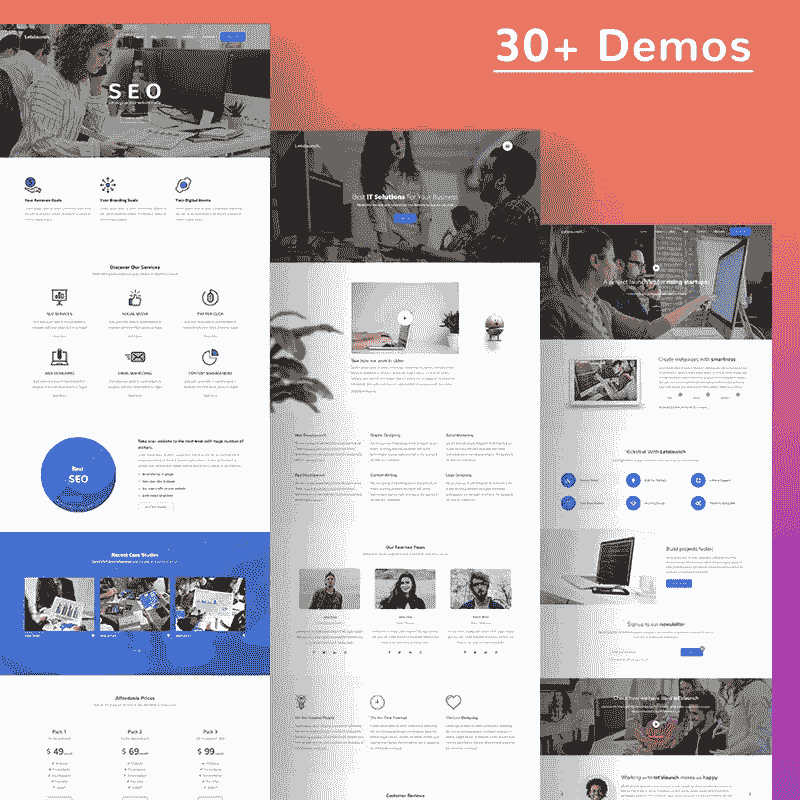](https://www.templatemonster.com/website-templates/letslaunch-responsive-multipurpose-html5-website-template-86133.html?aff=javarevisited&utm_campaign=blog_site_javarevisited&utm_source=react&utm_medium=referral)

[**细节**](https://www.templatemonster.com/website-templates/letslaunch-responsive-multipurpose-html5-website-template-86133.html?aff=javarevisited&utm_campaign=blog_site_javarevisited&utm_source=react&utm_medium=referral)

通过 Letslaunch 网站模板，您可以为任何个人或商业项目创建一个功能卓越的网站。有 125 个以上的设计页面，以及 250 多个可重用的用户界面块和 30 多个演示。这个主题非常适合摄影师和设计师。它还支持电子商务功能，使其易于推出 9+商店风格的网上商店。

# 材料套件 React 无材料-UI 套件

[**详细信息**](https://www.creative-tim.com/product/material-kit-react)

Material Kit 是最令人印象深刻的 react 网站模板之一，具有材质 UI 设计。它利用了光、颜色和运动。主题的全面响应设计让你的 [web 项目](/better-programming/my-5-favorite-courses-to-learn-web-development-in-2019-a5e74167f8b2)在所有设备上看起来都令人惊叹。材料工具包 React 模板也将很好地用于基于应用程序的 web 项目的启动。使用材质 UI 效果、动画、波纹和过渡，根据您的喜好进行调整。

# Reliance HTML 模板

[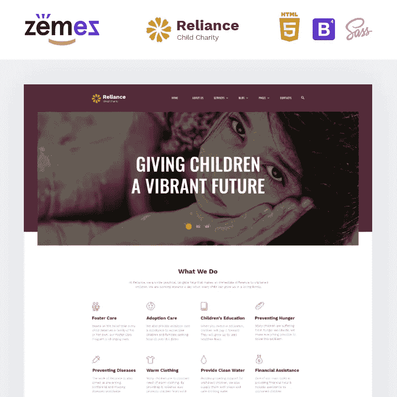](https://www.templatemonster.com/website-templates/reliance-kids-charity-multipage-modern-html-website-template-86103.html?aff=javarevisited&utm_campaign=blog_site_javarevisited&utm_source=react&utm_medium=referral)

[**详情**](https://www.templatemonster.com/website-templates/reliance-kids-charity-multipage-modern-html-website-template-86103.html?aff=javarevisited&utm_campaign=blog_site_javarevisited&utm_source=react&utm_medium=referral)

Reliance 主题是开始慈善和捐赠网络项目的最终选择。主题的下载包中有 25+个现成的 HTML5 页面。通过显著的 [CSS3](https://javarevisited.blogspot.com/2019/05/top-5-html-5-and-css-3-courses-for-web-developers.html) 动画效果，你可以给你的网站页面带来更令人印象深刻的展示。视差滚动动画可以增加网站页面的深度感。

# 纸质试剂盒 React —免费自举 4 和 Reactstrap UI 试剂盒

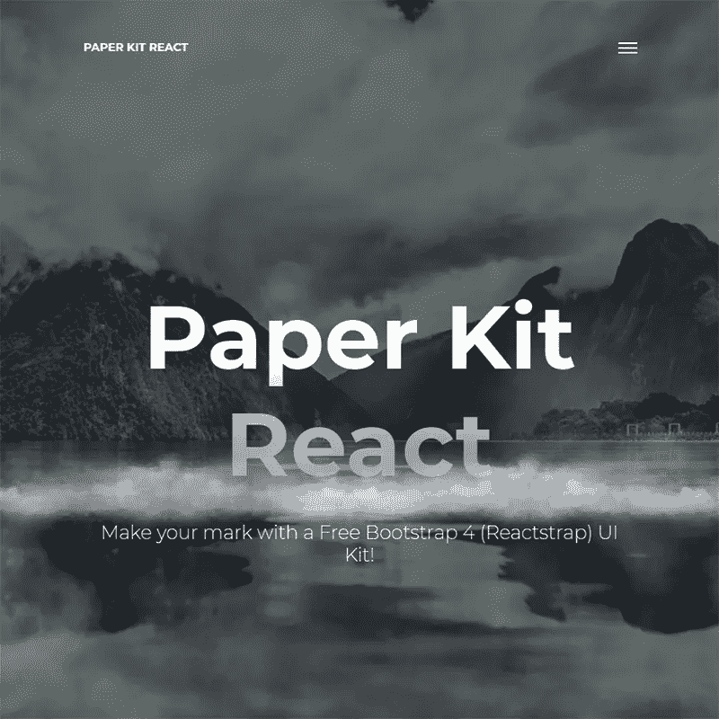

[**细节**](https://www.creative-tim.com/product/paper-kit-react)

纸质工具包 [React JS](/javarevisited/top-10-free-courses-to-learn-react-js-c14edbd3b35f) 单页网站模板可供免费下载。模板是用柔和的颜色创建的。完全可编辑的布局结构允许您从深色和浅色版本中进行选择。这是一个免费的 [Bootstrap 4](/javarevisited/7-free-courses-to-learn-bootstrap-for-web-designers-and-developers-5135215648f1) 模板，旨在在任何设备上都很好看。该模板包括一组预制页面，您可以针对登录页面、个人资料页面和注册元素进行调整。

# 多用途 HMTL 网站模板

[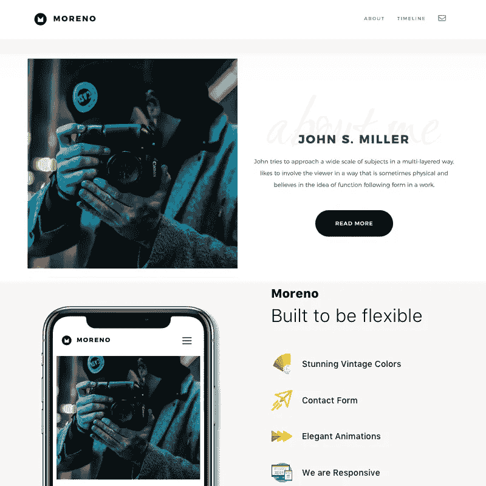](https://www.templatemonster.com/website-templates/moreno-multipurpose-hmtl-website-template-86174.html?aff=javarevisited&utm_campaign=blog_site_javarevisited&utm_source=react&utm_medium=referral)

[**详细信息**](https://www.templatemonster.com/website-templates/moreno-multipurpose-hmtl-website-template-86174.html?aff=javarevisited&utm_campaign=blog_site_javarevisited&utm_source=react&utm_medium=referral)

莫雷诺网站模板适合摄影和设计相关的项目。它完全基于引导。使用这个多用途的 HTML 5 主题，您将获得一个功能强大且灵活的 web 解决方案，它易于使用和修改。下载包有干净，优雅，现代的页面。该主题的响应式设计包括 20 种网络可用的惊艳颜色和酷炫的动画效果。

# 材料套件 PRO React 高级材料-UI 套件

[**细节**](https://www.creative-tim.com/product/material-kit-pro-react)

Material Kit pro 是 premium react 网站模板的一个示例，包含 1000 多个组件，为您提供完全自由的 it 定制。该主题包含多种颜色选择，您可以使用 SASS 和 JSX 文件进行修改。这个 React 网站模板的每一项都有两种形式——PSD 元素和 HTML/ [ReactJS](/@javinpaul/top-5-courses-to-learn-react-js-in-2019-best-of-lot-fa02cd96cdf0) /CSS/JSS 实现。与其他 react JS one page 网站模板类似，该项目的所有组件都在方便的文件夹中组织成单独的层。

# 事件-事件会议 HTML5 网站模板

[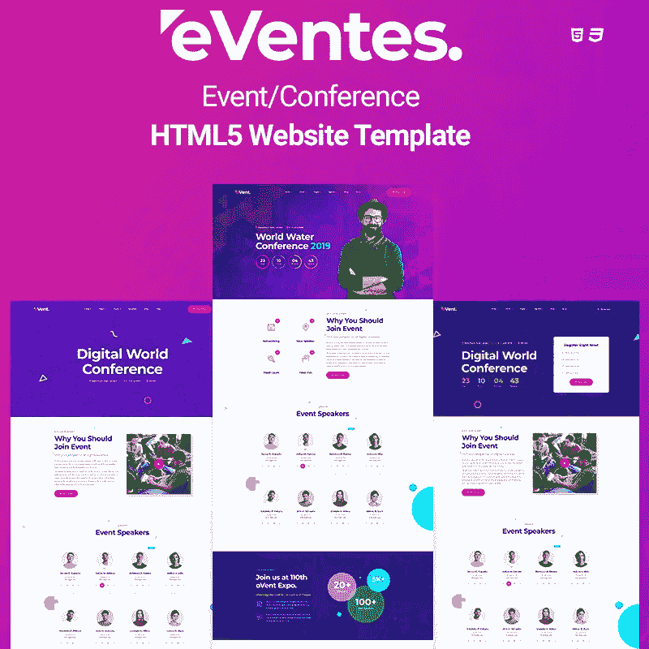](https://www.templatemonster.com/website-templates/eventes-event-conference-html5-website-template-85749.html?aff=javarevisited&utm_campaign=blog_site_javarevisited&utm_source=react&utm_medium=referral)

[**细节**](https://www.templatemonster.com/website-templates/eventes-event-conference-html5-website-template-85749.html?aff=javarevisited&utm_campaign=blog_site_javarevisited&utm_source=react&utm_medium=referral)

Eventes HTML 模板是网站推广会议和公共活动的完美选择。该主题的特色是材质 UI 组件，使其看起来很时尚，视觉上令人惊叹。主题的完全响应设计可以随时调整，以匹配一系列特定主题的在线项目，包括商务会议、研讨会、会议、聚会等。该主题的下载包包括 3 个现成的主页布局。它具有显著的动画效果和一套 360+的图标。

# NEXTJS 材料套件免费 NextJS 材料-UI 套件

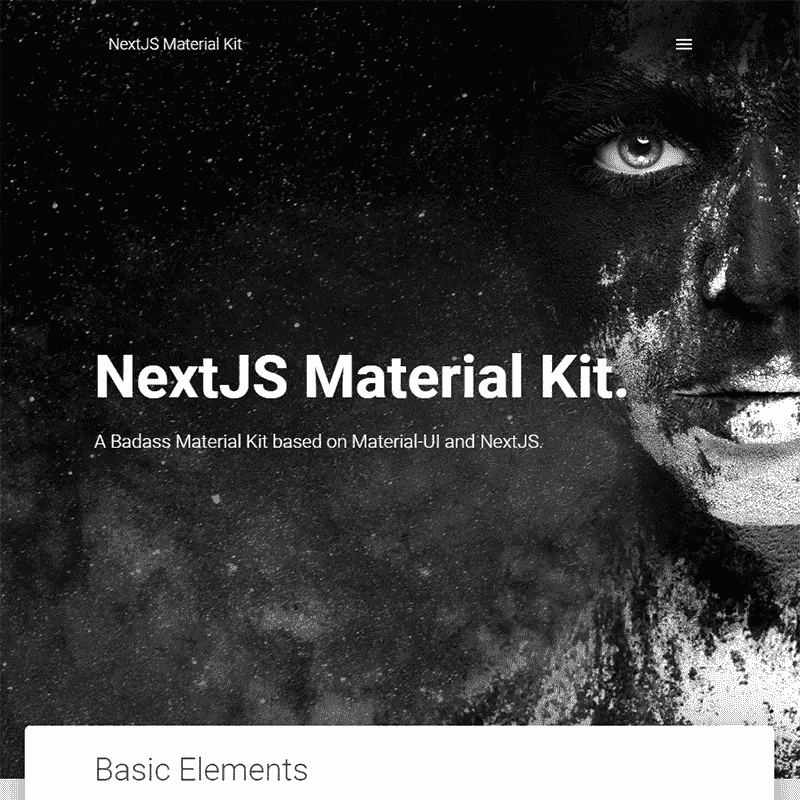

[**细节**](https://www.creative-tim.com/product/nextjs-material-kit)

NextJS React JS 网站模板免费主题排在这个名单的下一位。模板的 material UI kit 具有明亮清新的颜色，非常适合推出可用且视觉效果惊人的在线资源。主题为您提供了修改布局的完全自由。有 100 个独立的前端元素，它们有多种颜色、样式、悬停、焦点等状态。

# Goldenframe —婚礼网站模板

[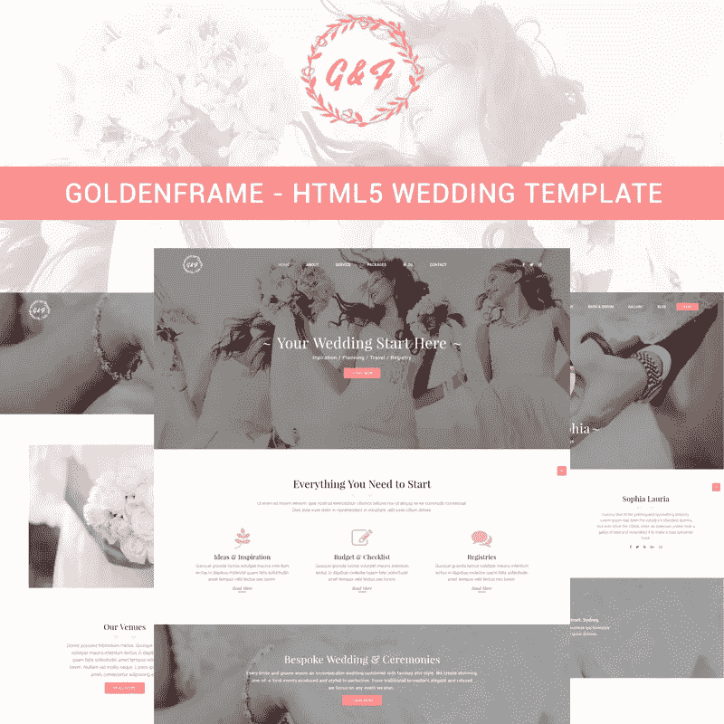](https://www.templatemonster.com/website-templates/goldenframe-wedding-website-template-85945.html?aff=javarevisited&utm_campaign=blog_site_javarevisited&utm_source=react&utm_medium=referral)

[**详细信息**](https://www.templatemonster.com/website-templates/goldenframe-wedding-website-template-85945.html?aff=javarevisited&utm_campaign=blog_site_javarevisited&utm_source=react&utm_medium=referral)

利用 Goldenframe 网站模板，您可以为您的婚礼项目创建一个优雅而卓越的网站。主题的下载包中包含 4 个预制的主页演示。它装载了一套智能 UI 组件，可以匹配任何类型的婚礼活动项目。这个 [Bootstrap 4](https://www.java67.com/2019/01/5-free-bootstrap-course-to-learn-online.html) 模板的完全响应设计是通过有效的 HTML5 和 [CSS3](https://www.java67.com/2020/06/top-5-courses-to-learn-advanced-css.html) 实践创建的。

# 现在 UI 套件 PRO React Premium Bootstrap 4 和 Reactstrap UI 套件

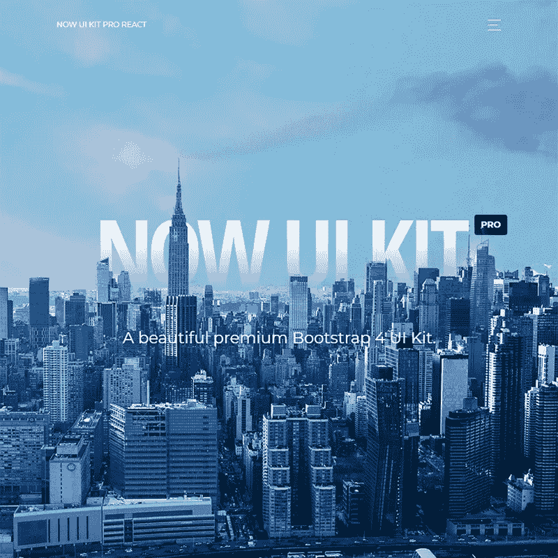

[**细节**](https://www.creative-tim.com/product/now-ui-kit-pro-react)

现在 UI Kit PRO 是 premium react 网站模板之一，具有完全响应的设计。它包含 1000 个组件、34 个部分和 11 个示例页面。这是 PSD 和 Sketch 格式的 react JS 单页网站模板中最受欢迎的一个。它利用了大胆的颜色，惊人的排版，清晰的摄影和宽敞的安排。

# Bitrix —创业机构和 SasS 商业网站模板

[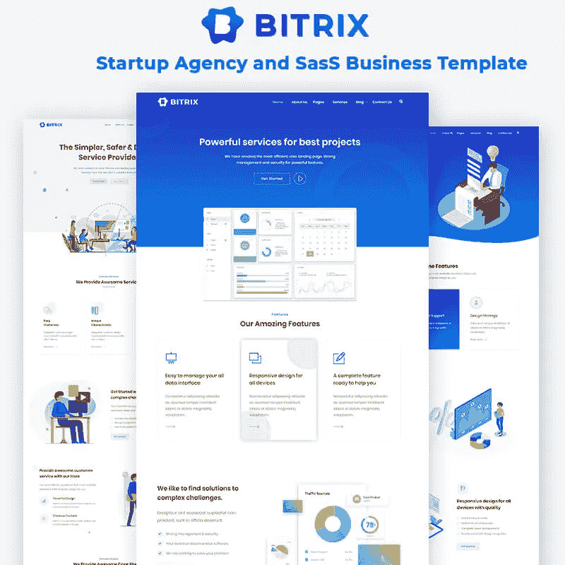](https://www.templatemonster.com/website-templates/bitrix-startup-agency-and-sass-business-website-template-85561.html?aff=javarevisited&utm_campaign=blog_site_javarevisited&utm_source=react&utm_medium=referral)

[**详细信息**](https://www.templatemonster.com/website-templates/bitrix-startup-agency-and-sass-business-website-template-85561.html?aff=javarevisited&utm_campaign=blog_site_javarevisited&utm_source=react&utm_medium=referral)

Bitrix 是一个完全自举的 HTML 和 CSS 模板。它已准备好用于启动一家初创公司或一个成熟的登录页面网站。它包括一套 3 个现成的现场演示版本，您可以通过单击将其导入到您的网站。主题看起来干净现代。它有一个引人注目的设计，并通过一系列易于专家和初学者处理的配色方案得到了增强。

# 纸质套件 Pro React —高级引导 4 和 Reactstrap UI 套件

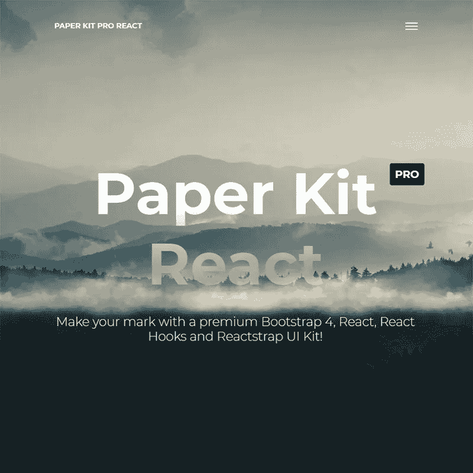

[**详细信息**](https://www.creative-tim.com/product/paper-kit-pro-react)

这是一个高质量的 react 网站模板，可以在所有设备上流畅运行。它装载了 100 个手工制作的元素，让你创建一个真正令人惊叹的网站。UI 工具包是用柔和的颜色创建的。它是完全编码的，基于高级 Bootstrap 4。

# Kroma |创意多用途网站模板

[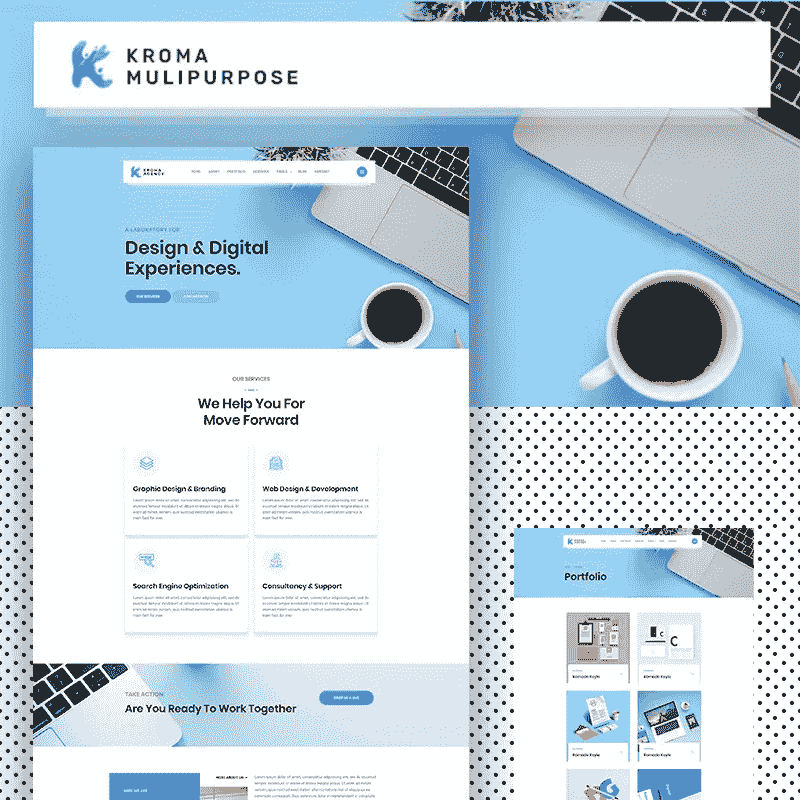](https://www.templatemonster.com/website-templates/kroma-creative-multipurpose-website-template-85565.html?aff=javarevisited&utm_campaign=blog_site_javarevisited&utm_source=react&utm_medium=referral)

[**详细信息**](https://www.templatemonster.com/website-templates/kroma-creative-multipurpose-website-template-85565.html?aff=javarevisited&utm_campaign=blog_site_javarevisited&utm_source=react&utm_medium=referral)

Kroma 是一个创造性的 HTML5 模板，旨在让您构建卓越的用户界面。这是一个令人惊叹的预制网站模板，适合创意在线项目、咨询和代理。该主题有一组组织良好的高质量 HTML5 文件，可以随时调整，以最大限度地匹配您的 web 项目。

# 现在 UI 套件 React 免费引导 4 和 Reactstrap UI 套件

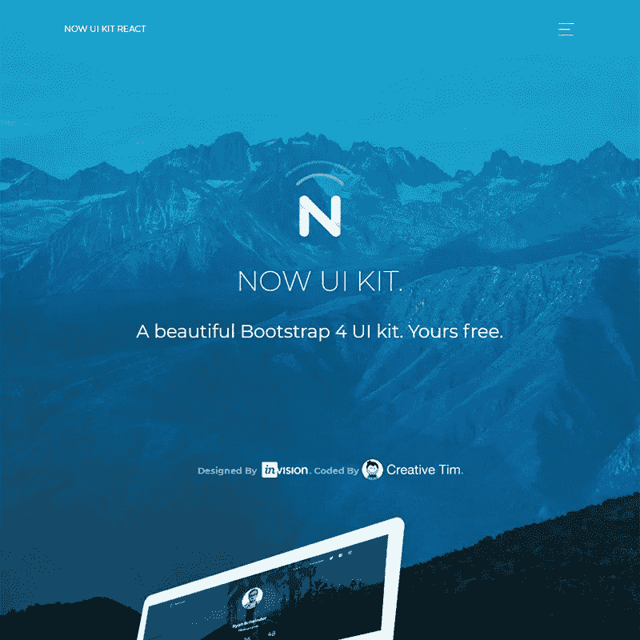

[**详情**](https://www.creative-tim.com/product/now-ui-kit-react)

现在 UI 套件 [React JS](/javarevisited/the-2019-react-js-developer-roadmap-9a8e290b8a56?source=collection_home---4------2-----------------------) 网站模板免费版采用了完全响应的设计。模板的下载包包括 50 多个方便的元素和 3 个模板，您可以在您的站点上使用。现在 UI Kit 是 PSD 和 Sketch 格式中最流行的 react 网站模板之一。

> 有没有一个完美的解决方案可以匹配你的基于 app 的项目？
> 
> 那些免费或高级网站模板是你最喜欢的吗？
> 
> 我们将非常感谢您分享您对使用 React 网站模板启动您的应用程序的反馈。