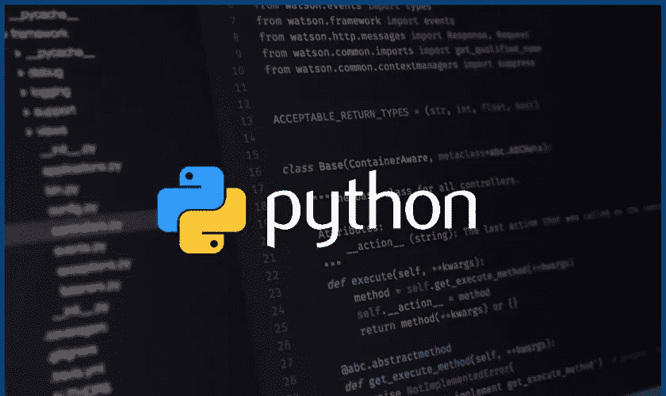
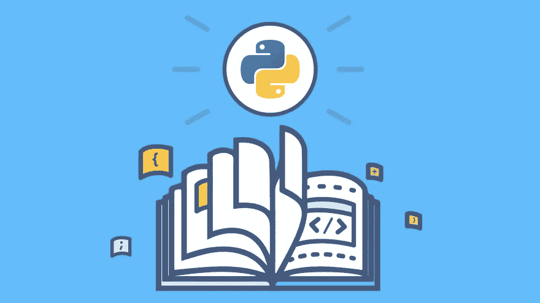
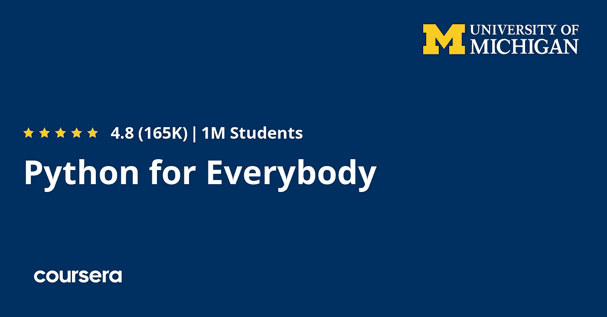
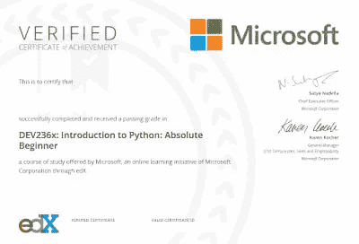
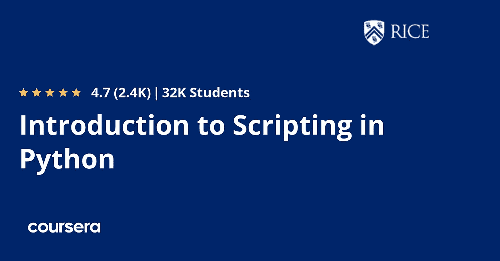
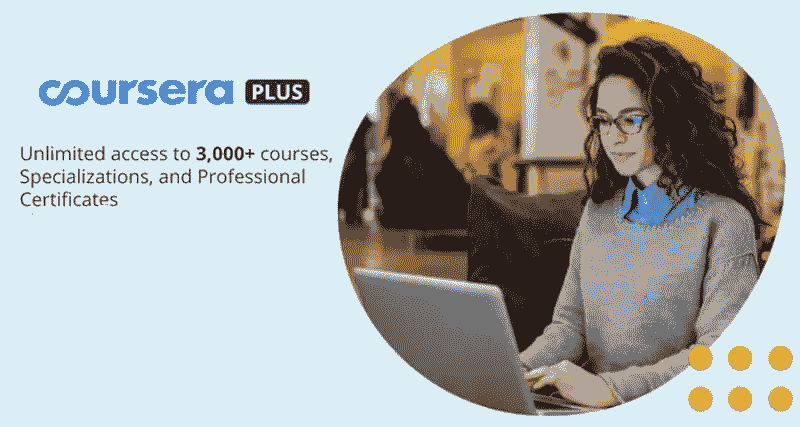

# 2023 年免费学习 Python 编程的 10 大网站

> 原文：<https://medium.com/javarevisited/10-free-python-tutorials-and-courses-from-google-microsoft-and-coursera-for-beginners-96b9ad20b4e6?source=collection_archive---------0----------------------->

大家好，如果你想在 2023 年学习 Python，并寻找一些免费网站和免费 Python 教程，那么你来对地方了。前面我已经分享过学习 Python 可以做的 [**最好的 Python 编程课程**](/better-programming/top-5-courses-to-learn-python-in-2018-best-of-lot-26644a99e7ec) 和 [**Python 项目**](/javarevisited/8-projects-you-can-buil-to-learn-python-in-2020-251dd5350d56) 。

今天，我将分享一些流行的网站来免费学习 Python 编码，以及来自 Google、Microsoft、Udemy、Coursera、Educative、FreeCodeCamp、CodeCademy、Javarevisited 等网站的免费 Python 编码教程。

但在此之前，如果你在这里，那么让我首先祝贺你做出了学习编程语言之王 [Python 编程语言](https://www.python.org/)的正确决定。

Python 已经激励了许多人学习编码，并且还在继续激励着他们。我知道有少数人出于不同的原因在学习 Python，从 [web 开发](https://javarevisited.blogspot.com/2019/04/top-5-python-web-development-frameworks.html)到[机器学习](https://javarevisited.blogspot.com/2019/08/top-5-python-books-for-data-science-and-machine-learning.html)。

我见过学习 Python 的新人使用 [Django](/@javinpaul/my-favorite-courses-to-learn-django-for-beginners-2020-ac172e2ab920) 和 [Flask](https://javarevisited.blogspot.com/2020/01/top-5-courses-to-learn-flask-for-web-development-with-python.html) 编写 web 应用，使用 Python 创建机器学习模型，只需编写一些方便的脚本就可以将枯燥的东西自动化。

**Python 是目前世界上排名第一的编程语言**，它的受欢迎程度与日俱增，这要归功于数据科学和机器学习以及令人敬畏的 [Python 库](https://javarevisited.blogspot.com/2018/10/top-8-python-libraries-for-data-science-machine-learning.html)，如[熊猫](https://javarevisited.blogspot.com/2019/10/top-5-courses-to-learn-pandas-for-data-analysis-python.html)、 [NumPy](https://becominghuman.ai/10-free-courses-to-learn-python-machine-learning-libraries-scikit-learn-numpy-pandas-keras-3c77ba1a6907) 和 [TensorFlow](https://hackernoon.com/top-5-tensorflow-and-ml-courses-for-programmers-8b30111cad2c) 。

所以，如果你也想在 2023 年学习 Python，或者已经开始用 Python 编程，但仍在寻找一些免费资源，那么你来对地方了。

以前我分享过很多有用的免费 Python 资源比如[书籍](https://javarevisited.blogspot.com/2019/07/top-5-books-to-learn-python-in-2019.html)和[免费课程](https://javarevisited.blogspot.com/2018/12/10-free-python-courses-for-programmers.html)。今天，我将分享一些可以免费学习 Python 的网站、免费教程和门户网站。

从免费资源中学习是很棒的，因为你不需要信用卡，也不需要为课程付费。你需要的只是时间和学习的渴望。

然而，这并不容易，因为有很多免费的 Python 资源可用，选择正确的资源是一项困难的任务。这就像大海捞针，而这正是本文将帮助你的地方。

顺便说一句，如果你不介意花几美元学习像 Python 这样有价值和有用的东西，那么我也建议你在 Udemy 上看看乔希·波尔蒂利亚的 [**完整的 Python 3 训练营**](http://bit.ly/complete-python3-bootcamp) 。你将会以一种更加结构化的方式快速学习 Python，你可以在 Udemy 的特卖上花 10 美元购买这门课程。

<http://bit.ly/complete-python3-bootcamp>  

# 初学者学习 Python 编程的十大网站

在这里，你可以找到一些免费学习 Python 的好地方，我和一些 Python 专家一起精心挑选了这些资源。

我有目的地选择尽可能少的资源，但仍然有一些选择。以防万一，如果你有任何其他[有用的免费教授 Python 开发的 Python 网站](https://dev.to/javinpaul/top-5-places-to-learn-python-programming-for-free-m4c),请随意建议。

## 1.谷歌

如果你不知道，谷歌也有一套优秀的 [Python 初学者教程](https://developers.google.com/edu/python/)，被称为谷歌的 Python 课。这是一个免费的课程，面向有一点编程经验并且想学习 Python 的人。该课程包括书面教程、讲座视频和大量练习 [Python 编码](https://javarevisited.blogspot.com/2019/09/5-websites-to-learn-python-for-free.html)的代码练习。

第一个练习涉及基本的 Python 概念，如字符串和列表，为下一个练习做准备，下一个练习是处理文本文件、流程和 http 连接的完整程序。

谷歌自己在很多项目中都使用了 Python。并且，这些资料一般在 Google 内部使用，向刚开始编码或者编程经验很少的人教授 Python。

这份材料最棒的地方在于，在 Youtube 上可以看到讲座视频。因此，你不需要任何其他帐户。它还教你建立自己的 [Python 开发环境](/better-programming/top-5-courses-to-learn-python-in-2018-best-of-lot-26644a99e7ec)，这确实会产生最初的挑战，但从长远来看是很棒的。

<https://developers.google.com/edu/python/>  

## 2.乌德米

Udemy 是最受欢迎的在线课程平台之一，它可能拥有地球上最大的免费在线课程集合。我喜欢 Udemy，因为你几乎可以找到任何你想学的课程，而且还是免费的。

与 [**CodeCademy**](https://bit.ly/codecademypro) 不同的是，你不需要任何订阅，只需要创建一个免费账号，然后就可以报名参加免费的 Python 课程。大多数讲师在首次推出课程时都保持免费，这样他们就可以获得一些关注、评论和社会证明。

但是，也有完全免费的高质量 Python 课程，如针对初学者的<http://bit.ly/2D5vvnV>**和[**Python**](http://bit.ly/2CTK36X)。你可以加入他们学习 Python 3。下面是一些我最喜欢的深入学习 Python 的免费课。**

****这里是报名链接—**[Python 编程入门](http://bit.ly/2D5vvnV)**

**<http://bit.ly/2D5vvnV>  

Udemy 的优点是你可以向专家学习，但它不像 Codecademy 那样具有互动性。不过，如果你喜欢从视频中学习，没有比 Udemy 更好的地方了。

如果你能负担得起一些钱，你也可以在他们的 flash 销售中以 10 美元的一次性价格获得很棒的训练营式课程，如 [**完整的 Python 3 训练营**](http://bit.ly/complete-python3-bootcamp) 。

<http://bit.ly/complete-python3-bootcamp>  

## 3.代码集

如果你喜欢互动学习，那么没有比 [**CodeCademy**](https://bit.ly/codecademypro) 更好的地方了。他们首先用尽可能少的词语教你理论，然后让你用这个概念在线编写代码。最棒的是你不需要做任何设置，比如在你的机器上安装 Python。

您可以直接从浏览器运行 Python 代码。另一个好处是，你不需要写一个完整的程序，直到你准备好了。你需要做一些小的改变并执行它们。这是学习 Python 编程的一个很棒也很有趣的方法。

我用他们的交互平台学过 JavaScript，Java，Python，Linux。之前他们是完全免费的，但现在他们有一个免费增值模式，其中一些课程或课程只对付费会员开放。

目前他们的 [**学 Python 2**](https://bit.ly/learnpython2withcodecademy) 课程是免费的， [**Python 3 课程**](https://bit.ly/learnpython3codecademy) 只对付费会员开放。如果你能负担得起并欣赏 CodeCademy，那就加入 [**Codecademy PRO**](https://bit.ly/codecademypro) 吧，但如果你不能只从他们的 Python 2 课程开始，那对没有编程经验的初学者来说再合适不过了。

这里是了解更多的链接— [**互动 Python 3 课程**](https://bit.ly/learnpython3codecademy)

## 4.教育的

这是 2023 年又一个免费学习 Python 编码的网站。如果你不知道 [**Educative**](https://www.educative.io/subscription?affiliate_id=5073518643380224) 是一个基于文本的交互平台，允许你从浏览器学习和编码。

您可以学习这个概念，只需编写下一行代码，而不必担心下载必要的软件和设置您的开发环境。对于任何学习任何编程语言的初学者来说，这是最大的优势，因为他们中的大多数都停留在设置阶段。

如果你想在 2023 年学习 Python，那么这个课程是一个完美的起点。本课程从探索基本的构建模块开始，然后转到更高级的概念，如函数和循环。

有趣的测验和编码挑战将伴随你一路走来，以帮助强化课程中涵盖的所有概念。

**这里是报名链接—** [通过教育性的](https://www.educative.io/courses/learn-python-from-scratch?affiliate_id=5073518643380224)从零开始学习 Python

本课程结束时，您将熟悉 Python 中数据结构和函数式编程的概念。这是一个免费的课程，所以你不需要支付任何费用就可以加入，你只需要创建一个 Educative.io 帐户就可以进入这个课程。

顺便说一句，如果你喜欢这个平台，那么他们也有一些付费的 Python 课程值得一试，比如迈克尔·德里斯科尔的《Python 101:交互式学习如何用 Python 3 编程》。

<https://www.educative.io/courses/python-101-interactively-learn-how-to-program-with-python-3?affiliate_id=5073518643380224>  

## 5.Coursera

如果你想免费向世界顶尖大学学习，那么 Coursera 是最好的网站。它提供知名大学的在线课程，如斯坦福大学、INSEAD 大学、新加坡国立大学等。

最重要的是，它有一个最受欢迎的免费课程来学习[*Python——为每个人编程*](https://coursera.pxf.io/c/3294490/1164545/14726?u=https%3A%2F%2Fwww.coursera.org%2Fspecializations%2Fpython)(Python 入门)。

本课程将从零开始教你 Python 3。你不需要任何编程经验，因为你将在课程中学到。超过 850，000 名学生已经注册了这门课程并学习了如何编程，现在是您从中受益的机会了。

该课程也是 Coursera 上的[**Python for Everybody Specialization**](https://coursera.pxf.io/c/3294490/1164545/14726?u=https%3A%2F%2Fwww.coursera.org%2Fspecializations%2Fpython)的一部分，其中包含 4 个深入学习 Python 的课程:

1.  [Python 数据结构](https://coursera.pxf.io/c/3294490/1164545/14726?u=https%3A%2F%2Fwww.coursera.org%2Flearn%2Fpython-data%3Fspecialization%3Dpython)
2.  [使用 Python 访问 Web 数据](https://coursera.pxf.io/c/3294490/1164545/14726?u=https%3A%2F%2Fwww.coursera.org%2Flearn%2Fpython-network-data%3Fspecialization%3Dpython)
3.  [通过 Python 使用数据库](https://coursera.pxf.io/c/3294490/1164545/14726?u=https%3A%2F%2Fwww.coursera.org%2Flearn%2Fpython-databases%3Fspecialization%3Dpython)
4.  [顶点项目:用 Python 检索、处理和可视化数据](https://coursera.pxf.io/c/3294490/1164545/14726?u=https%3A%2F%2Fwww.coursera.org%2Flearn%2Fpython-data-visualization)

所有课程都是**免费审核**，这意味着你可以免费加入并学习。但是，你不能参加作业和测验，也不会得到任何认证，直到你支付。

**这里是报名链接——Coursera 上** [Python 给大家看](https://coursera.pxf.io/c/3294490/1164545/14726?u=https%3A%2F%2Fwww.coursera.org%2Fspecializations%2Fpython)

如果你想得到所有这些和认证，那么你需要参加不是免费的专业化认证。如果你能负担得起并欣赏这门课程，无论如何，你应该订阅，它完全值得你的时间和金钱。

您还可以加入 Coursera Plus 的[，这是 Coursera 的一项订阅计划，让您可以无限制地访问他们最受欢迎的课程、专业、专业证书和指导项目。](https://coursera.pxf.io/c/3294490/1164545/14726?u=https%3A%2F%2Fwww.coursera.org%2Fcourseraplus)

<https://coursera.pxf.io/c/3294490/1164545/14726?u=https%3A%2F%2Fwww.coursera.org%2Fcourseraplus>  

## 6.微软[edX]

如果谷歌有 Python 类，那微软怎么会被甩在后面？它在 Edx 上也有一个[免费 Python 课程，这是另一个流行的免费教育在线门户。](https://www.awin1.com/cread.php?awinmid=6798&awinaffid=631878&clickref=&p=%5B%5Bhttps%3A%2F%2Fwww.edx.org%2Fcourse%2Fintroduction-to-python-absolute-beginner-4%5D%5D)

这门课程名为*Python 入门:绝对初学者*，是学习 Python 的免费课程，由资深内容开发者埃里克·卡普林教授。

本课程将在 Jupyter Notebooks 教你 Python，这是一个基于浏览器的在线编码编辑器，用于 [Python](https://hackernoon.com/top-5-courses-to-learn-python-in-2018-best-of-lot-26644a99e7ec) ，这意味着你不需要安装 Python。这是一个为期 5 周的课程，每周学习 3 到 4 个小时。

该课程也是微软入门级软件开发专业计划的一部分，也是免费的。需要认证的时候才需要付费。可以添加到简历或 LinkedIn 个人资料中的内容，如下所示:

**这里是报名链接—** [微软免费 Python 课程](https://www.awin1.com/cread.php?awinmid=6798&awinaffid=631878&clickref=&p=%5B%5Bhttps%3A%2F%2Fwww.edx.org%2Fcourse%2Fintroduction-to-python-absolute-beginner-4%5D%5D)

## 7.免费代码营[Youtube]

这是另一个很棒的免费学习技术的网站。他们也有一个令人惊叹的 Youtube 频道，在那里你会找到很多免费的在线课程，这个免费的 Python 课程就是其中之一。

本课程将向您全面介绍 python 中的所有核心概念。跟随视频，你很快就会成为一名 python 程序员！你可以在 Youtube 上免费观看，这是目录

⭐️内容⭐
⌨️ (0:00)简介
⌨️ (1:45)安装 Python & PyCharm
⌨️ (6:40)设置& Hello World
⌨️ (10:23)绘制形状
⌨️ (15:06)变量&数据类型
⌨️ (27:03)处理字符串
⌮38:18)处理数字
⌮ 元组
⌨️ (1:24:15)函数
⌨️ (1:34:11)返回语句
⌨️ (1:40:06) If 语句
⌨️ (1:54:07) If 语句&比较
⌨️ (2:00:37)构建一个更好的计算器
⌨️ (2:07:17)字典
⌨️ (2:14:13) While 循环
⌨️(2:37) 除外
⌨️ (3:12:41)读文件
⌨️ (3:21:26)写文件
⌨️ (3:28:13)模块& Pip
⌨️ (3:43:56)类&对象
⌨️ (3:57:37)构建选择题
⌨️ (4:08:28)对象函数
⌨️ (4:12:37)继承【T31

下面是你可以观看的 Youtube 视频，在 4 个小时内学会 Python:

## 8.[1 小时瘦 Python](https://www.youtube.com/watch?v=7RDu6aoLQz4)(Java 访问 Youtube 频道)

我们在 Youtube 频道上也有一个 Python 速成班，你可以看着它在 1 小时内学会 Python。这是一本非常简洁、实用、实用的 Python 指南，任何人都可以阅读。

这对于没有编程经验的人来说是理想的，你只需要 1 个小时来观看视频，并按照指示进行尝试。

这里是 Youtube 上学习 Python 小时的链接。

## 9.用于数据科学和人工智能的 Python

这是另一门侧重于使用 Python 的数据科学和人工智能的课程。这是一门入门课程，将帮助您开始学习 Python 数据科学，以及一般的编程。

这个适合初学者的 Python 课程将在几个小时内带你从零开始学习 Python 编程。它是由 IBM Developer 提供的，IBM Developer 是世界上历史最悠久、最负盛名的软件公司之一。

本课程可适用于多个专业或专业证书项目。完成本课程将计入您在以下任何计划中的学习:

*   [IBM 数据科学专业证书](https://coursera.pxf.io/c/3294490/1164545/14726?u=https%3A%2F%2Fwww.coursera.org%2Fprofessional-certificates%2Fibm-data-science)
*   [IBM 应用人工智能专业证书](https://coursera.pxf.io/c/3294490/1164545/14726?u=https%3A%2F%2Fwww.coursera.org%2Fprofessional-certificates%2Fapplied-artifical-intelligence-ibm-watson-ai)
*   [应用数据科学专业](https://coursera.pxf.io/c/3294490/1164545/14726?u=https%3A%2F%2Fwww.coursera.org%2Fspecializations%2Fapplied-data-science)

**这里是报名链接—** [**数据科学的 Python 和 AI**](https://coursera.pxf.io/c/3294490/1164545/14726?u=https%3A%2F%2Fwww.coursera.org%2Flearn%2Fpython-for-applied-data-science-ai)

## 11.[Python 脚本简介](https://coursera.pxf.io/c/3294490/1164545/14726?u=https%3A%2F%2Fwww.coursera.org%2Fspecializations%2Fintroduction-scripting-in-python)【免费 Coursera 课程】

我最初开始学习 Python 是为了编写脚本和自动化一项乏味的任务，是的，我正在读那本书。我想在 Perl 和 Python 之间做出选择，Python 显然是赢家，因为它的流行和机会。

如果你打算*学习 Python* 中的脚本，那么这是 Python 程序员最好的 Coursera 专门化之一。你也可以获得*免费审核*的所有课程。如果你需要一个证书和访问评估和测验，你只需要付费。

这个专业也是为想要掌握基本编程技能的初学者设计的。它包含四门课程，涵盖了 Python 3 中的关键编程概念，帮助你准备使用 Python 执行日常脚本任务。这些脚本知识还将为你在数据科学、软件工程或其他涉及编程的学科中的职业生涯打下坚实的基础，你还将获得一份证书，在你的简历中展示出来。

这里是了解更多信息的链接—[**Coursera 上的 Python 脚本简介**](https://coursera.pxf.io/c/3294490/1164545/14726?u=https%3A%2F%2Fwww.coursera.org%2Fspecializations%2Fintroduction-scripting-in-python)

如果你觉得 Coursera 的课程很有用，因为它们是由知名公司如谷歌、IBM、亚马逊和世界上最好的大学创建的，我建议你加入 Coursera Plus 的<https://coursera.pxf.io/c/3294490/1164545/14726?u=https%3A%2F%2Fwww.coursera.org%2Fcourseraplus>**，这是 Coursera 的一个订阅计划，让你可以无限制地访问他们最受欢迎的**课程**、**专业化**、**专业证书**和**指导项目**。**

****

## **12. [Python 核心与高级](http://bit.ly/2Mi553A)【免费 Udemy 课程】**

**这是 Udemy 提供的最好的免费课程之一，为每个概念提供了完整的实例。老师讲得非常直截了当，简单易懂，并且很好地掌握了这门语言。我真的很喜欢上这门课**

**您将首先学习如何安装 python 虚拟机和 Eclipse IDE (PyDev ),然后执行您的第一个 Python 程序。**

**您还将学习各种简单类型以及集合类型，使用条件语句、循环结构定义逻辑，如何使用不同类型的运算符，检查输入和输出函数的运行情况，以及传递命令行参数**

****这里是了解更多** — [Python 核心和高级](http://bit.ly/2Mi553A)的链接**

**<http://bit.ly/2Mi553A>  

以上就是一些可以免费学习 Python 的**网站**。这些都是很棒的资源，你可以选择你喜欢的。你不需要参加所有的课程，那将是荒谬和费时的。相反，选择一个最适合你的学习方式。

> 例如，如果你喜欢互动学习，选择 [CodeCademy](https://bit.ly/codecademypro) 或 [Educative](https://www.educative.io/courses/learn-python-from-scratch?affiliate_id=5073518643380224) ，如果你喜欢非正式的视频课程，那么选择 [Udemy](https://click.linksynergy.com/deeplink?id=JVFxdTr9V80&mid=39197&murl=https%3A%2F%2Fwww.udemy.com%2F) ，如果你喜欢大学和学校的结构化教育，那么选择 [Coursera](https://click.linksynergy.com/deeplink?id=JVFxdTr9V80&mid=40328&murl=https%3A%2F%2Fwww.coursera.org%2F) 。

并且，如果你喜欢基于文本的学习，记住阅读比看视频更快，那么谷歌的 Python 类是最好的。

您可能喜欢的其他 **Python 文章和资源**

*   [2023 年学习 Python 的 10 个理由](https://javarevisited.blogspot.com/2018/05/10-reasons-to-learn-python-programming.html)
*   [初学者学习 Python 的 5 大课程](https://javarevisited.blogspot.com/2018/03/top-5-courses-to-learn-python-in-2018.html)
*   [Python 开发者的五大 Web 开发框架](https://javarevisited.blogspot.com/2019/04/top-5-python-web-development-frameworks.html)
*   [Python 与 JavaScript——从哪个开始比较好？](https://javarevisited.blogspot.com/2019/05/python-vs-javascript-which-programming-language-beginners-should-learn.html)
*   [深入学习 Python 的 10 门免费在线课程](https://javarevisited.blogspot.com/2018/12/10-free-python-courses-for-programmers.html)
*   [面向数据科学和机器学习的 8 大 Python 库](https://javarevisited.blogspot.com/2018/10/top-8-python-libraries-for-data-science-machine-learning.html)
*   [Python vs Java——初学者应该学习哪种编程语言？](https://javarevisited.blogspot.com/2018/06/java-vs-python-which-programming-language-to-learn-first.html)
*   [5 Python 中的数据科学与机器学习课程](https://javarevisited.blogspot.com/2018/03/top-5-data-science-and-machine-learning-online-courses-to-learn-online.html)
*   [2023 年网络开发者路线图](https://hackernoon.com/the-2019-web-developer-roadmap-ab89ac3c380e)
*   [面向程序员的 10 本免费 Python 编程书籍](http://www.java67.com/2017/05/top-7-free-python-programming-books-pdf-online-download.html)
*   [数据科学五大 Python 书籍](https://javarevisited.blogspot.com/2019/08/top-5-python-books-for-data-science-and-machine-learning.html)
*   [2023 年加入 10 门 Python Web 开发课程](/javarevisited/top-10-courses-to-learn-python-for-web-development-in-2020-best-of-lot-efe11fb6d212)

感谢您阅读本文。如果你喜欢这些网站，请分享给你的朋友和同事。如果您有任何问题或反馈，请留言。

> 祝您的 Python 编码之旅一切顺利。

**p . s .**——如果你现在只想做一件事来启动你的 Python 编程之旅，就去参加 Udemy 上何塞·马西亚尔·波尔蒂利亚的 [**完整的 Python 3 训练营**](http://bit.ly/complete-python3-bootcamp) 课程吧。你会很快学会 Python，永远不会后悔你的决定。

<http://bit.ly/complete-python3-bootcamp> ****