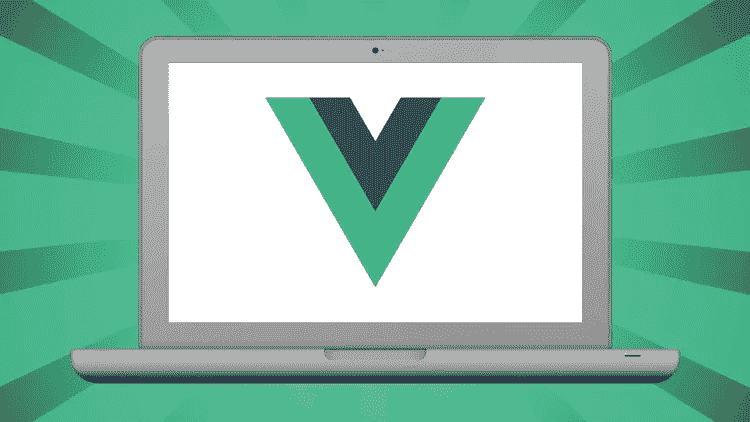
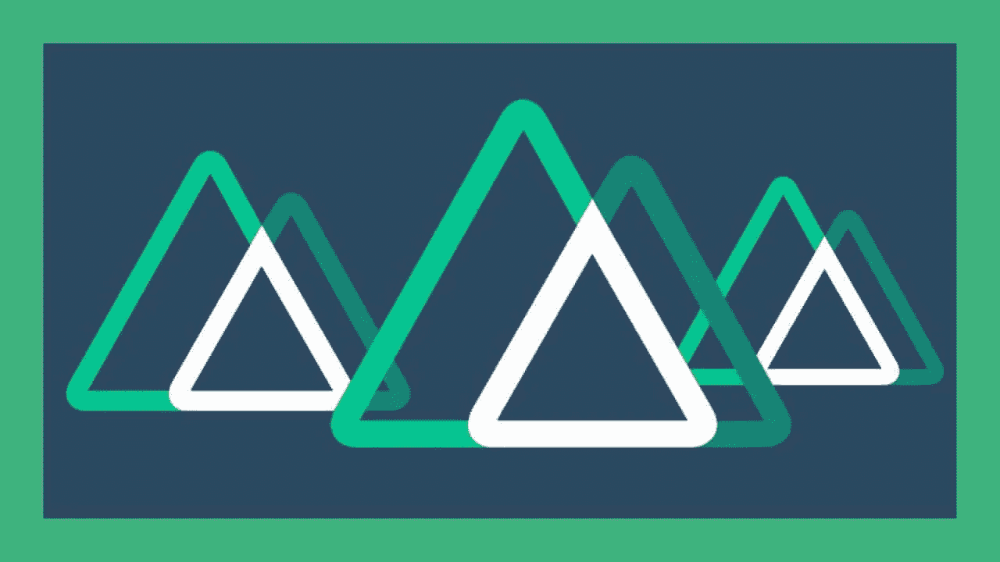
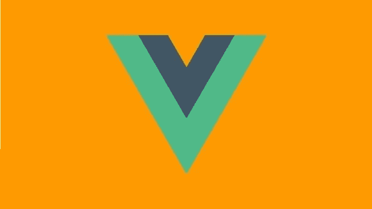
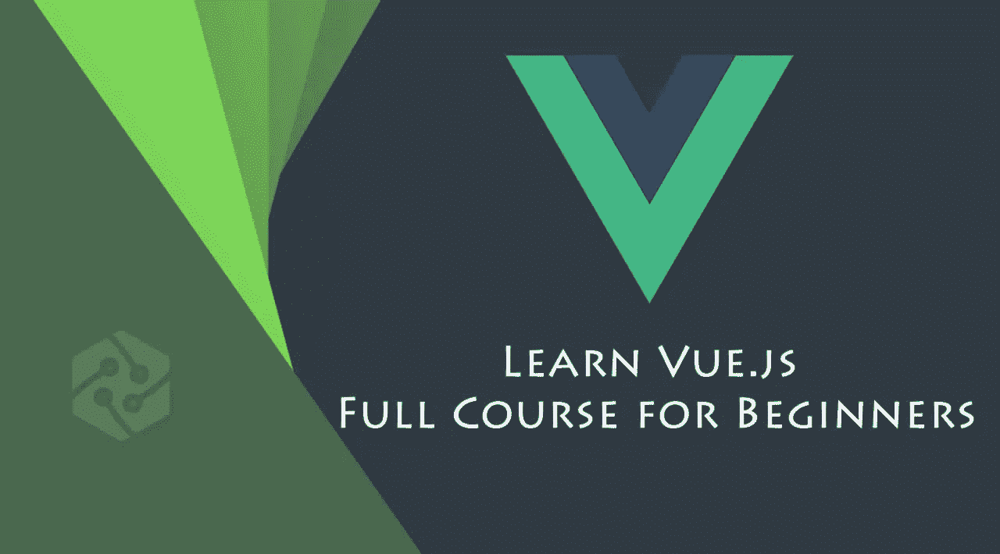
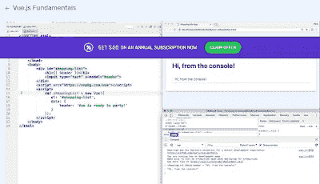
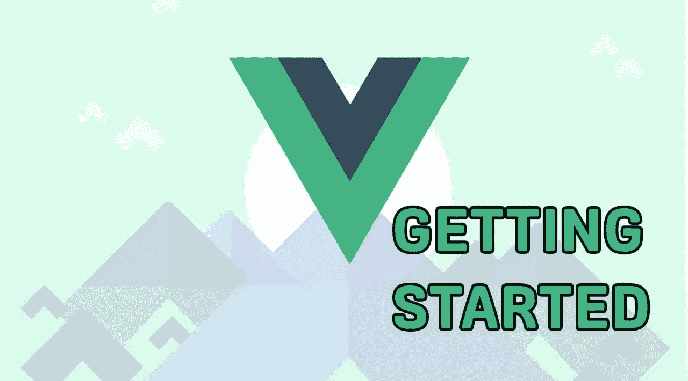

# 2023 年 10 个最适合初学者的免费 Vue.js 和 Nuxt.js 在线课程

> 原文：<https://medium.com/javarevisited/10-free-vue-js-nuxt-js-online-courses-for-beginners-in-2021-a347ea2ad144?source=collection_archive---------0----------------------->

## 2023 年想学 Vue.js 和 Nuxt.js？这些是从 Udemy、freecodecamp 和其他网站学习 Vue.js 和 Nuxt.js 的最好的免费在线课程

image_credit — Udemy

大家好，如果你想在 2023 年学习 Vue.js 和 Nuxt.js，并寻找免费的在线课程，那么你来对地方了。之前，我已经分享了 [**最佳 React 课程**](https://javinpaul.medium.com/top-5-courses-to-learn-react-js-in-2019-best-of-lot-fa02cd96cdf0) 、 [**最佳 Angular 课程**](/javarevisited/10-courses-to-learn-angular-for-web-development-6da1bd2856dc) s、 [**最佳 Vue.js 课程**](/javarevisited/top-5-online-courses-to-learn-vue-js-in-2021-249e66b60646) 在这篇文章中，我将分享 10 个免费的在线课程，你可以在 2023 年加入学习 Vue.js 和 Nuxt.js。

如今竞争非常激烈，我们需要从尽可能好的资源中获得合适的技能。当谈到前端开发时，虽然 [Reactjs](https://www.java67.com/2018/02/5-free-react-courses-for-web-developers.html) 和 [Angular](https://www.java67.com/2018/01/top-5-free-angular-js-online-courses-for-web-developers.html) 仍然是国王和王后，但 vue.js 正在迅速填补空白。

[**Vue.js，**](https://vuejs.org/) 如你所知，是用于构建用户界面的 JavaScript 框架的开源视图模型。此外，您可以使用 Vue.js 开发单页面应用程序。如果你想学习 Vue.js 并寻找免费的在线课程、教程和培训班，那么你来对地方了。

在这篇文章中，我将分享**你可以免费加入的最佳 Vue.js 在线课程**，但在此之前，让我们了解一下什么是 Vue.js 以及它提供的好处。

要理解这些你需要知道 vue.js 可以用什么，怎么用。Vue.js 有以下功能。

*   HTML 应用程序从 vue.js 获得扩展功能。
*   这些功能可以通过 HTML 属性中的指令来访问。
*   用户可以获得内置指令，并且它还提供了创建用户定义指令的灵活性。

同样值得一提的是， **Vue.js** 是由[尤雨溪](https://medium.com/u/4f198f5f1f12?source=post_page-----a347ea2ad144--------------------------------)在为谷歌工作后，在多个项目中使用 [Angular](https://javarevisited.blogspot.com/2018/06/5-best-courses-to-learn-angular.html) 创建的。事实上，Evan 已经做了很好的工作——创建 vue.js，而大多数网站都没有从开发者的角度考虑问题；我们为你挑选了最好的免费在线课程。

顺便说一句，如果你可以，如果你不介意花几块钱学习像 Vue.js 这样有用的技能，那么我也强烈推荐你去看看 Udemy 上 Maximillian Scwarzmuller 的[**Vue JS 2——完全指南**](https://click.linksynergy.com/deeplink?id=JVFxdTr9V80&mid=39197&murl=https%3A%2F%2Fwww.udemy.com%2Fcourse%2Fvuejs-2-the-complete-guide%2F) (包括 Vue 路由器& Vuex)课程。这个长达 75 小时的马拉松课程是最好的课程之一，Max 是一位知识渊博、富有魅力的教练，内容丰富。

 [## 使用 VueJS 2 开发(完成 Vue.js 路由器和 Vuex 课程)

### Vue.js 是一个非常棒的 JavaScript 框架，用于构建前端应用程序！VueJS 混合了最好的角度+反应！

udemy.com](https://click.linksynergy.com/deeplink?id=JVFxdTr9V80&mid=39197&murl=https%3A%2F%2Fwww.udemy.com%2Fcourse%2Fvuejs-2-the-complete-guide%2F) 

# 2023 年学习 Vue.js 和 Nuxt.js 的 10 门最佳免费课程

这个列表包括了来自互联网上的最好的课程，可以为你提供最好的学习，而不需要支付一分钱。仔细看看每一门课程，很少能在流行的在线学习网站上找到，如 [Udemy](https://click.linksynergy.com/fs-bin/click?id=JVFxdTr9V80&offerid=323058.9410&type=3&subid=0) 、 [freeCodecamp](http://freecodecamp.org/) 和 [Eduonix](https://www.eduonix.com/UHJvZHVjdC0xMDIyMTIw) 等。

## 1. [Vue.js 快速速成班](https://click.linksynergy.com/deeplink?id=JVFxdTr9V80&mid=39197&murl=https%3A%2F%2Fwww.udemy.com%2Fcourse%2Fvuejs-fast-crash-course%2F)(免费)

这个令人惊叹的课程在 Udemy 上可以找到，你可以抓住它。使它名列榜首的是它将一次给你一点点信息。

所有的讲座都组织得很好，按顺序分布。它会给你一些你需要知道的信息，以及所有的例子。

本课程是 udemy to learn vue.js 上评分最高的课程之一，甚至有评论家批准本课程帮助你获得技能。

本课程将涉及的内容有

*   数据绑定
*   条件式
*   计算属性
*   超文本传送协议
*   按指定路线发送
*   列表呈现
*   控制结构

所有这些主题都很好地分布在各个讲座中，它们会让你及时了解其他用户的评论和回应。你所需要做的就是掌握一些 JavaScript 知识来开始这门课程。

**这里是加入这个免费 Vue.js 课程的链接** — [Vue.js 快速速成课程](https://click.linksynergy.com/deeplink?id=JVFxdTr9V80&mid=39197&murl=https%3A%2F%2Fwww.udemy.com%2Fcourse%2Fvuejs-fast-crash-course%2F)

## 2.[nuxt . js——使用 Vue.js 的高速静态网站(免费)](https://click.linksynergy.com/deeplink?id=JVFxdTr9V80&mid=39197&murl=https%3A%2F%2Fwww.udemy.com%2Fcourse%2Fintroduction-nuxt-js%2F)

这是 Udemy 的另一个免费在线课程，学习 Nuxt.js，它是面向 web 开发人员的领先 JavaScript 框架之一。

在这个免费的在线课程中，你将学习使用 Nuxt JS 来创建静态生成的网站，这些网站的 SEO 排名和加载速度都非常惊人！常规网站不允许搜索爬虫看到你页面的内容，因此你永远不会排名。

Nuxt.js 用的是 Vue JS，所以如果你熟悉 Vue JS，你就为这门课做好了准备。使用 Next js，网站被生成为纯 HTML 格式，这样搜索爬虫就可以真正阅读它了！

**这里是加入这个免费的 Nuxt.js 课程的链接** — [Nuxt.js —用 Vue.js 创建超快的静态网站](https://click.linksynergy.com/deeplink?id=JVFxdTr9V80&mid=39197&murl=https%3A%2F%2Fwww.udemy.com%2Fcourse%2Fintroduction-nuxt-js%2F)

## 3. [React vs Angular vs Vue.js 举例](https://click.linksynergy.com/deeplink?id=JVFxdTr9V80&mid=39197&murl=https%3A%2F%2Fwww.udemy.com%2Fcourse%2Freact-vs-angular-vs-vuejs-by-example%2F)(免费)

这是一个很棒的免费在线课程，可以学习 Vue.js，并比较 React.js 和 Angular.js，找出与这两个相比，在 Vue.js 中创建应用程序的难易程度。

作为本课程的一部分，您将构建一个 React 应用程序、一个 Angular 应用程序和一个 Vue 应用程序来自己找出答案。这个课程很好的理解了 [React](/javarevisited/top-10-free-courses-to-learn-react-js-c14edbd3b35f?source=extreme_main_feed----d3a191ac6ed-----5-1--------------------561c2dc6_a2b4_41e0_b7be_1d97edbf631c--8) 、 [Angular](/javarevisited/10-courses-to-learn-angular-for-web-development-6da1bd2856dc) 和 [Vue.js](https://javarevisited.blogspot.com/2019/08/top-5-online-courses-to-learn-vue.js-best.html) 的核心区别

以下是我们将在 React、Angular 和 Vue.js 中学习的基本流程:

*   项目安装和入门
*   组件结构
*   模板
*   式样
*   集成 CSS 框架
*   使用 API

这将帮助您对这些 JavaScript 技术有一个坚实的开始，到那时您将带着自己的观点离开。

**这里是加入这个免费课程的链接** — [React vs Angular vs Vue.js 举例](https://click.linksynergy.com/deeplink?id=JVFxdTr9V80&mid=39197&murl=https%3A%2F%2Fwww.udemy.com%2Fcourse%2Freact-vs-angular-vs-vuejs-by-example%2F)

## 4.[vue . js 简介](https://click.linksynergy.com/deeplink?id=JVFxdTr9V80&mid=39197&murl=https%3A%2F%2Fwww.udemy.com%2Fcourse%2Fthecompletevuejscourse%2F)(免费 Udemy 课程)

这门课程是为开始学习编程和 web 开发的人设计的。本课程与其他课程的不同之处在于，它还涵盖了应用程序编程。
以下是你将从课程中学到的东西:

*   使用 bot Vue 和 Vuex 以更快的速度显示网站。
*   通过 firebase 使用身份验证
*   在市场上部署应用程序等

对于初学者来说，这个课程将会是一个非常有价值的课程，因为它涵盖了基础知识、firebase 以及应用编程。此外，该讲座每周都会更新，包括来自世界各地用户的提问和回答。对初学者来说，如此多的接触只会证明是有益的。

这是加入这个免费课程的链接。[vue . js 简介](https://click.linksynergy.com/deeplink?id=JVFxdTr9V80&mid=39197&murl=https%3A%2F%2Fwww.udemy.com%2Fcourse%2Fthecompletevuejscourse%2F)

## 5.开始前你需要知道的一切！

这是一个有趣的免费 Udemy 课程，适合 2023 年想学 Vue.js 的初学者。这个课程会让你对 Vue js 有更好的理解，如果他们能以此为职业的话。

你应该把这个课程看作是 Vue.js 的预备课。这意味着，我将尽可能用最简单的语言，回顾一些你应该知道的关于 [Vue.js](https://www.java67.com/2020/07/5-free-courses-to-learn-vuejs-in-2020.html) 的重要事情。这个课程可能会帮助你决定 Vue 是否是你希望在应用程序开发中使用的东西。

这是你在这门课中学到的东西—

我将介绍以下内容:

什么是 Vue.js？

谁创造了它？

Vue.js 的优势是什么？

Vue.js 与其他框架相比如何？

关于 Vue.js 您可能会有的常见问题

更多！

简而言之，一个关于 Vue.js 的快速且相对较短的课程可以帮助你理解 Vue.js 的基础知识，如果你正考虑使用它进行应用程序开发的话。

**这里是加入这个免费课程的链接—** [Pre-Vue JS:开始前你需要知道的一切！](https://click.linksynergy.com/deeplink?id=JVFxdTr9V80&mid=39197&murl=https%3A%2F%2Fwww.udemy.com%2Fcourse%2Fpre-vuejs-everything-you-need-to-know-before-you-start%2F)

## 6. [Vue.js —初学者完整教程](https://click.linksynergy.com/deeplink?id=JVFxdTr9V80&mid=39197&murl=https%3A%2F%2Fwww.udemy.com%2Fcourse%2Fvuejs-complete-course-for-beginners%2F)

另一门指导初学者的课程，但这门课程与之前的课程不同，它并不关注 vue.js 的应用。在这门课程中，你将详细学习 vue.js.

的功能和工作方式，尽管你需要具备初级水平的 [HTML/CSS](/javarevisited/10-best-html-and-css-courses-for-beginners-in-2021-6757eec00032) 和 [JavaScript](/javarevisited/10-best-online-courses-to-learn-javascript-in-2020-af5ed0801645) 知识。课程中所有的讲座都是精确划分的，带你慢慢走完所有的流程和细节。即使你只是一个 JavaScript 初学者，这个课程也会提高你的学习。对所有的框架、目录和功能进行了适当的分类，为开发良好的用户界面提供了良好的基础。用户界面被认为是最重要的东西，如果你仔细阅读了本课程中描述的所有细节，网页将会表现得更好。

**这里是加入这个免费 Vue 课程** — [Vue.js —初学者完整课程](https://click.linksynergy.com/deeplink?id=JVFxdTr9V80&mid=39197&murl=https%3A%2F%2Fwww.udemy.com%2Fcourse%2Fvuejs-complete-course-for-beginners%2F)的链接

## 7.3 小时学会 vue . js(FreeCodecamp)

这是一个母亲优秀的免费在线课程，由 Freecodecamp 从零开始学习 Vue.js。学习使用 **Vue.js** 在 Gwen Faraday 为初学者提供的完整课程中，你可以在 Freecodecamp youtube 频道上观看。

在本课程中，您不仅将学习 Vue.js 的基础知识，还将使用 Vue.js 创建两个项目。在课程结束时，您将能够开始在自己的项目中使用 Vue.js。

以下是您将在本课程中学到的内容:

本课程涵盖:

*   Vue 实例
*   指令和方法
*   数据绑定和事件
*   过滤器和组件
*   Vue-cli 和 Vue 开发工具
*   道具和老虎机
*   vue-路由器和 Vuex
*   单元测试等等！

你可以在这里观看 youtube 视频课程:

## 8. [Vue.js 基础](https://vueschool.io/courses/vuejs-fundamentals)

本课程分为 10 个部分；每个部分都侧重于 Vue.js 的各种功能。本课程涵盖以下几点。

*   Vue 开发工具
*   数据绑定简介
*   模板和表达式
*   循环和条件渲染
*   处理输入和事件
*   属性绑定和类。

上述内容被分成讲座，并进一步录制成短视频，以加强学习。

对于初学者来说，考虑本课程并为此进行[项目式学习](https://javarevisited.blogspot.com/2020/12/top-5-project-based-courses-to-learn-java-python-javascript.html)会有所帮助。此外，众所周知，导师在开发行业已经工作了 15 年，这将为你提供极大的帮助，让你轻松学习。

## 9.[使用 VueJS 学习 Web 开发](https://www.eduonix.com/courses/Web-Development/learn-web-development-using-vuejs/UHJvZHVjdC0xMDIyMTIw)

本课程采用不同的学习方法，它更注重结构和功能，而不是界面。您将获得关于结构和目录的良好知识。

这是为刚开始尝试 web 开发的初学者设计的。假定有基本的 [Javascript](/javarevisited/my-favorite-free-tutorials-and-courses-to-learn-javascript-8f4d0a71faf2) 知识。这不仅仅是关于框架或结构，这门课程也会给你项目的实践经验。本课程将涵盖以下主题:

详细讲解语法、插值、指令等。

*   双向数据绑定。
*   Vue 基础和现代技术。
*   Vue 与 webpack 的集成。
*   API 和 Vue 资源包。

**这里是加入 Vue.js 课程的链接** — [使用 VueJS 学习 Web 开发](https://www.eduonix.com/courses/Web-Development/learn-web-development-using-vuejs/UHJvZHVjdC0xMDIyMTIw)

## 10. [Vue.js 适合初学者:使用 Vue 开始运行](https://click.linksynergy.com/deeplink?id=JVFxdTr9V80&mid=39197&murl=https%3A%2F%2Fwww.udemy.com%2Fcourse%2Fvue-intro%2F)

这是 Udemy 为初学者提供的另一个非常棒的学习 Vue.js 的免费课程。这个课程的创始人不是别人，正是丹·维加，他在 Udemu 上创作了许多免费和付费的课程，比如这个[免费的 Spring Boot 课程](http://bit.ly/2hlQOJ9)。

如果你是一个前端 web 开发人员，具备 HTML、CSS 和 JavaScript 的工作知识，那么这个课程就是为你准备的。如果你只是想在几个小时内学习 Vue 的基础知识，这个课程是为你准备的。

本课程并不意味着教授你需要了解的关于 Vue 的所有知识。它会教你 Vue 的基本构建模块，而且不到两个小时就能完成。

您将通过一系列教程、练习和测验来学习如何构建 Vue 应用程序，这些教程、练习和测验旨在强化您在本课程中学到的概念。

您将可以访问所有的起始代码，这样您就不必花时间编写样板文件，可以专注于手头的任务。万一你遇到困难，你也可以使用所有的解决方案。

**这里是加入这个免费 Vue.js 在线课程的链接**——[Vue . js 初学者:使用 Vue 开始运行](https://click.linksynergy.com/deeplink?id=JVFxdTr9V80&mid=39197&murl=https%3A%2F%2Fwww.udemy.com%2Fcourse%2Fvue-intro%2F)

## 11. [Vue.js:入门](https://pluralsight.pxf.io/c/1193463/424552/7490?u=https%3A%2F%2Fwww.pluralsight.com%2Fcourses%2Fvuejs-getting-started)【多视免费试用】

这是学习 Vue.js 的最佳 Pluralsight 课程之一。由 Chad Campbell 创建。该在线课程将教您如何使用 Vue.js online 以一种精炼而简单的方式创建闪电般快速的 web 应用程序。

首先，您将学习如何创建 HTML 模板，然后探索如何绑定到用户输入的数据并对用户事件做出反应。

最后，您将学习如何以适当的方式有条件地呈现内容。学完本课程后，您将能够开始使用 Vue.js 构建快速运行的应用程序。

**以下是加入本课程的链接** — [Vue.js:入门](https://pluralsight.pxf.io/c/1193463/424552/7490?u=https%3A%2F%2Fwww.pluralsight.com%2Fcourses%2Fvuejs-getting-started)

这门课程并不完全免费，但你可以通过使用 Pluralsight 的 [**10 天免费通行证**](https://pluralsight.pxf.io/c/1193463/424552/7490?u=https%3A%2F%2Fwww.pluralsight.com%2Flearn) 免费获得，它允许你观看 200 分钟的免费内容。

 [## 个人技术技能|多视角

### 借助 Pluralsight，在开发运维、机器学习、云、安全基础设施等领域构建所需技能…

pluralsight.pxf.io](https://pluralsight.pxf.io/c/1193463/424552/7490?u=https%3A%2F%2Fwww.pluralsight.com%2Flearn) 

以上就是 2023 年 FRE 学习 Vue.js 和 Nuxt.js 的 b **est 在线课程。所有上述课程都将为你提供一个很好的学习体验。Vue 在提升网页性能方面非常出色。阅读他们的描述，找到适合你特殊技能和要求的完美课程。如果你仍然困惑，试着去参观每一个课程，这会给你更好的洞察力。这些免费的 Vue.js 课程是从成千上万名学生的反馈中挑选出来的，同时也考虑到了批评性的评论。希望你找到了你要找的东西**

您可能想探索的其他**免费在线课程**

1.  [完整的网络开发者路线图](/hackernoon/the-2019-web-developer-roadmap-ab89ac3c380e)
2.  [我最喜欢的免费 JavaScript 初学者教程](/javarevisited/my-favorite-free-tutorials-and-courses-to-learn-javascript-8f4d0a71faf2)
3.  [15 门面向 Web 开发人员的 Docker、Kubernetes 和 AWS 课程](/javarevisited/top-15-online-courses-to-learn-docker-kubernetes-and-aws-for-fullstack-developers-and-devops-d8cc4f16e773)
4.  [Web 开发人员可以学习的 10 个 JavaScript 框架](/javarevisited/10-of-the-most-popular-javascript-frameworks-libraries-for-web-development-in-2019-a2c8cea68094)
5.  [学习 Web 开发的五大课程](/better-programming/my-5-favorite-courses-to-learn-web-development-in-2019-a5e74167f8b2)
6.  [我最喜欢的学习 HTML 和 CSS 的免费课程](/javarevisited/5-free-html-and-css-courses-to-learn-front-end-web-development-online-8b04517c6ecb?source=collection_home---4------0-----------------------)
7.  [面向前端开发者的 5 门免费 Docker 课程](/javarevisited/top-5-free-courses-to-learn-docker-for-beginners-best-of-lot-b2b1ad2b98ad)
8.  [初学者学习 SQL 和数据库的 7 门免费课程](/javarevisited/7-free-courses-to-learn-database-and-sql-for-programmers-and-data-scientist-e7ae19514ed2)
9.  [完整的 React.js 开发者路线图](/javarevisited/the-2019-react-js-developer-roadmap-9a8e290b8a56)
10.  [2023 年学习棱角分明的 10 本书和课程](/javarevisited/top-10-angular-books-and-courses-for-beginners-and-experienced-web-developers-best-of-lot-9a2dae87f04c)
11.  [初学者学习 React.js 的 5 本最佳书籍](/javarevisited/5-best-react-js-books-for-beginners-and-experienced-web-developers-e7b90b1ab9d2)
12.  [2023 年学习 React Native 的 5 门最佳课程](/@javinpaul/top-5-react-native-courses-for-mobile-application-developers-b82febdf8a46?source=---------112------------------)

感谢您阅读本文。你可能会想，有这么多的东西要学，有这么多的课程要参加，但你不需要担心，只要参加一两个你与导师联系的课程就行了。

而且，如果你可以，如果你不介意花几块钱学习像 Vue.js 这样有用的技能，那么我也强烈推荐你去看看 Udemy 上 Maximillian Scwarzmuller 的[**Vue js2——完全指南**](https://click.linksynergy.com/deeplink?id=JVFxdTr9V80&mid=39197&murl=https%3A%2F%2Fwww.udemy.com%2Fcourse%2Fvuejs-2-the-complete-guide%2F) (包括 Vue 路由器& Vuex)课程。这是最好的课程之一，Max 是一位知识渊博、引人入胜的讲师，能够提供一流的内容。

 [## 使用 VueJS 2 开发(完成 Vue.js 路由器和 Vuex 课程)

### Vue.js 是一个非常棒的 JavaScript 框架，用于构建前端应用程序！VueJS 混合了最好的角度+反应！

udemy.com](https://click.linksynergy.com/deeplink?id=JVFxdTr9V80&mid=39197&murl=https%3A%2F%2Fwww.udemy.com%2Fcourse%2Fvuejs-2-the-complete-guide%2F)