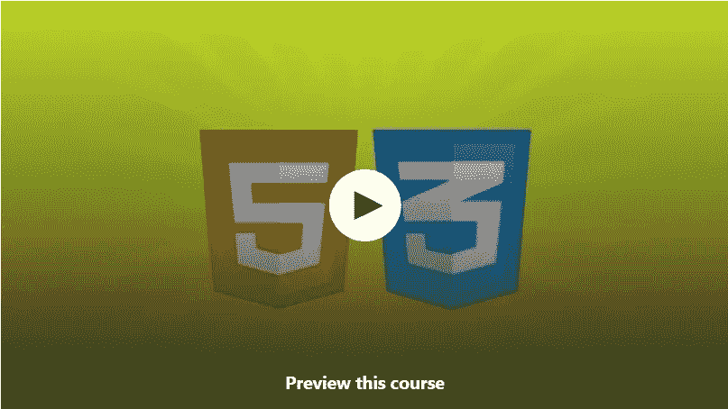
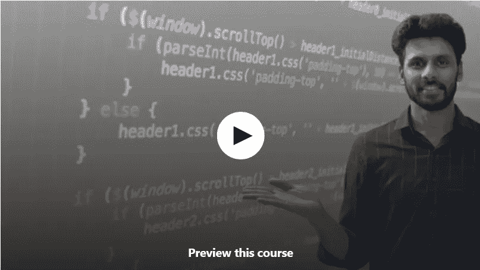
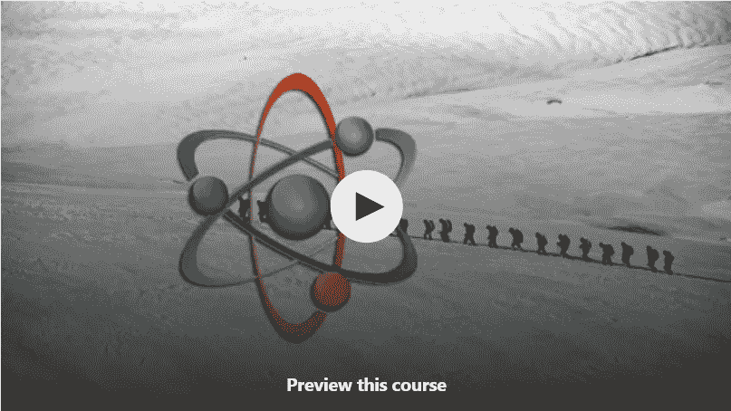
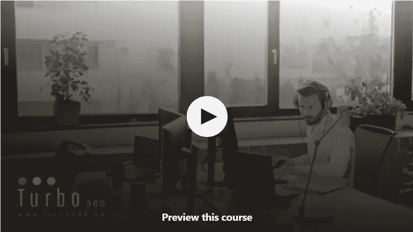
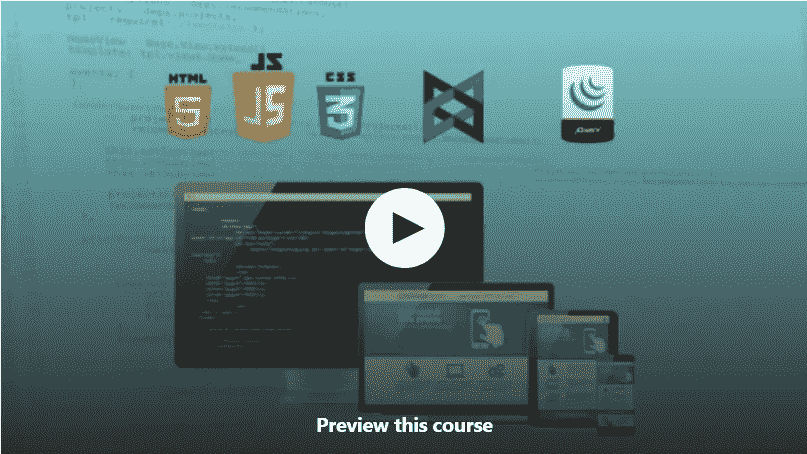
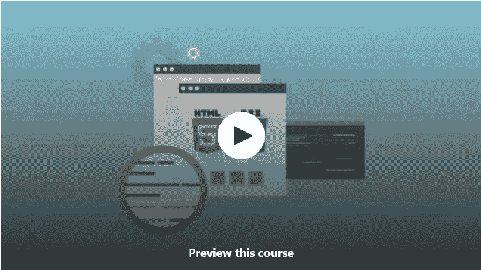

# 2023 年 10 门免费网络开发课程供初学者在线学习

> 原文：<https://medium.com/javarevisited/10-free-web-development-courses-for-beginners-9942af352ed5?source=collection_archive---------2----------------------->

## 2023 年我最喜欢的学习 Web 开发初学者的免费在线课程

image_credit — Udemy

嘿，伙计们，如果你想在 2023 年从头开始学习 web 开发，并寻找书籍、教程和在线课程等免费资源，那么你来对地方了。之前，我已经分享了 Udemy、Coursera 和 Pluralsight 的 [**最佳网页开发课程**](/javarevisited/top-10-frameworks-full-stack-java-developers-can-learn-in-2020-5995021401e5) ，今天我将分享初学者学习网页开发的最佳免费课程。

网页开发是 2023 年新手找工作最抢手的技能之一。即使您对什么是编码或编程没有任何概念，您也可以加入这些免费资源，一路学习 web 开发和编码。这些免费的在线课程对初学者来说非常好，因为它们从头开始解释事情，也涵盖了一个 web 开发人员应该学习的所有基本技术，如 [HTML 和 CSS](/javarevisited/10-best-html-and-css-courses-for-beginners-in-2021-6757eec00032) 、 [JavaScript](https://www.java67.com/2019/01/best-websites-to-learn-javascript-online.html) 、 [React.js](/javarevisited/top-10-free-courses-to-learn-react-js-c14edbd3b35f?source=extreme_main_feed----d3a191ac6ed-----5-1--------------------561c2dc6_a2b4_41e0_b7be_1d97edbf631c--8) 、 [Angular](/javarevisited/10-free-angular-and-react-js-courses-from-udemy-and-coursera-best-of-lot-e67f7d811e6b) 以及响应式设计等。

我个人喜欢从免费资源中学习，尤其是一项新技术或技能，例如最近我不得不学习[Apache Spark](http://javarevisited.blogspot.sg/2017/12/top-5-courses-to-learn-big-data-and.html)；为了更全面的学习，我从网上课程开始，然后是书本。在线课程为你提供了概要和必要的细节，这样你就可以在不投入太多时间的情况下开始学习。这也是一种更吸引人、更积极的学习方式。另一方面，书本是比课程稍微被动一点的学习，这就是为什么你必须有一些背景来掌握书本上给出的技术细节。

正如我所说，在这篇文章中，我将分享一些最好的、免费的在线课程，供初学者学习 Web 开发。如果你是 web 开发领域的新手，那么你可以使用这些免费的在线培训课程来学习这种抢手的数字技能。

顺便说一句，如果你能花几块钱上一门优秀的课程，那么我也建议你加入柯尔特·斯蒂尔 的 [**Web 开发者训练营。这是从零开始学习 web 开发的最全面和最好的课程之一，你将在一个地方学到 Web 开发人员需要的一切。它也很实惠，在 Udemy 上只需 10 美元就能买到。**](https://click.linksynergy.com/deeplink?id=JVFxdTr9V80&mid=39197&murl=https%3A%2F%2Fwww.udemy.com%2Fcourse%2Fthe-web-developer-bootcamp%2F)

<https://click.linksynergy.com/deeplink?id=JVFxdTr9V80&mid=39197&murl=https%3A%2F%2Fwww.udemy.com%2Fcourse%2Fthe-web-developer-bootcamp%2F>  

# 2023 年学习 Web 开发的 10 个最佳免费在线课程

这里列出了最好的免费网页开发课程，供初学者从零开始学习网页开发。你可以在办公室和家里舒适地从这些课程中学习所需的基本技能，如 HTML、CSS 和 JavaScript，也可以按照自己的节奏学习。

## 1.面向初学者的 HTML 和 CSS 建立一个网站[免费]

这个免费的网页开发课程将向你介绍网页开发的两大支柱:HTML 和 CSS。除此之外，你将学习这些支柱的基本作用，以及它们如何组合在一起形成网站。

这个 5.5 小时的 HTML 和 CSS 课程和任何付费课程一样好，你一定非常感谢讲师 [**埃德温·迪亚兹**](https://click.linksynergy.com/deeplink?id=JVFxdTr9V80&mid=39197&murl=https%3A%2F%2Fwww.udemy.com%2Fuser%2Fedwin166%2F) 让这个课程免费。本课程分为两个主要部分，HTML 和 CSS。

在 HTML 部分，你将学习如何执行简单的任务，比如创建一个基本的网页，添加图片，改变颜色，构造列表，而在 CSS 部分，你将学习如何美化你的网页。

我知道现在每个人都使用 Bootstrap 来使他们的网页看起来漂亮和专业，但是要使用 [Bootstrap，](http://www.java67.com/2019/01/5-free-bootstrap-course-to-learn-online.html)一个领先的 CSS 库，CSS 概念的基础知识是必不可少的，这就是你在本课程中将学到的。

**这里是免费加入本课程的链接**——[HTML 和 CSS 初学者——建立一个网站](https://click.linksynergy.com/deeplink?id=JVFxdTr9V80&mid=39197&murl=https%3A%2F%2Fwww.udemy.com%2Fcourse%2Fhtml-and-css-for-beginners-crash-course-learn-fast-easy%2F)

## 2. [JavaScript 基础【免费 Udemy 课程】](https://click.linksynergy.com/deeplink?id=JVFxdTr9V80&mid=39197&murl=https%3A%2F%2Fwww.udemy.com%2Fcourse%2Fjavascriptfundamentals%2F)

JavaScript 编程语言是 2023 年成为网络开发人员的另一项基本技能，这个免费的 Udemy 课程是从头开始学习 JavaScript 的绝佳资源。

由 Bharat Thippireddy 创建的这个 5 小时的免费 JavaScript 课程提供了使用 JavaScript 设计和开发动态网页的基本知识。您将了解[客户端 JavaScript](https://www.java67.com/2019/01/best-websites-to-learn-javascript-online.html) ，以及如何使用该语言将静态 HTML 页面转换成动态的交互式网页。

以下是这门免费课程涵盖的主题:

1.  如何创建 JavaScript 程序
2.  如何使用变量和运算符
3.  写条件和循环逻辑
4.  如何编写函数
5.  如何以编程方式处理事件
6.  如何捕捉和处理错误
7.  如何调试 javascript 代码
8.  如何从 JavaScript 操纵 HTML

总的来说，这是一个非常棒的免费在线课程，可以帮助初学者和想成为 web 开发人员的人从头开始学习 JavaScript。

**这里是加入本课程** — [JavaScript 基础](https://click.linksynergy.com/deeplink?id=JVFxdTr9V80&mid=39197&murl=https%3A%2F%2Fwww.udemy.com%2Fcourse%2Fjavascriptfundamentals%2F)的链接

## 3. [React JS 前端 Web 开发初学者](https://click.linksynergy.com/deeplink?id=JVFxdTr9V80&mid=39197&murl=https%3A%2F%2Fwww.udemy.com%2Fcourse%2Freact-tutorial%2F)【免费】

React.js 是最流行的前端开发库，每个 web 开发人员都应该学习它。正如我所说，仅仅学习 [HTML](/javarevisited/10-best-html-and-css-courses-for-beginners-in-2021-6757eec00032) 、 [CSS](/javarevisited/top-5-advanced-css-courses-to-learn-flexbox-grid-and-sass-da8e37b09b1d) 和 [JavaScript](/javarevisited/10-best-online-courses-to-learn-javascript-in-2020-af5ed0801645) 在当今世界成为一名 web 开发人员是不够的，你还需要学习像 React 这样的框架。

在这个 2.5 小时的免费 Udemy 课程中，你将从零开始学习现代 JavaScript 和 React JS。您将学习使用 AJAX 请求从远程 API 获取数据，并将其显示到您的 web 应用程序中。

以下是本课程中涉及的关键主题:

1.  现代 JavaScript
2.  反应 JS
3.  反应钩
4.  如何使用外部 API
5.  如何发出 AJAX 请求

在这个过程中，您还将构建一个新闻应用程序，在这个应用程序中，您将应用从这个面向初学者的免费 Reactjs 课程中学到的所有知识。

**这里是加入这个免费 React 课程的链接**——[React JS 前端 Web 开发初学者](https://click.linksynergy.com/deeplink?id=JVFxdTr9V80&mid=39197&murl=https%3A%2F%2Fwww.udemy.com%2Fcourse%2Freact-tutorial%2F)

## 4.[介绍节点 JS &快递](https://click.linksynergy.com/deeplink?id=JVFxdTr9V80&mid=39197&murl=https%3A%2F%2Fwww.udemy.com%2Fcourse%2Fintro-to-node-js-express%2F)【免费】

如果你想成为一名全栈 web 开发人员，那么 Node.js 是你需要学习的另一项重要技能，这个免费的 Udemy 课程将帮助你[学习 Node.js](/javarevisited/top-10-online-courses-to-learn-node-js-in-depth-8ef0e31ca139) 和 [Express.js](https://www.java67.com/2020/06/top-5-courses-to-learn-mern-stack-for-web-development.html) ，这是 JavaScript 中领先的后端框架。

这个 2 小时的免费课程非常实用，您将使用 Node JS、Express、 [Bootstrap](/javarevisited/6-best-bootstrap-online-courses-for-web-designers-and-developers-a688e192b2e2) 和 jQuery 创建一个简单的 web 应用程序，然后将其部署到一个临时环境中。

本课程分为 10 个不同的部分，涵盖一个关键概念:

*   项目结构
*   静态资产
*   模板引擎
*   动态请求
*   处理过帐数据
*   渲染动态数据
*   造型和图像
*   中间件
*   部署

到本系列结束时，您将理解 Node/Express 项目的基础，并能够部署一个全功能的 web 应用程序。对于希望了解更多全栈开发的人来说，这是一个很好的起点。

**这里是加入这个免费 Node.js 课程的链接**——[Node JS 简介&快车](https://click.linksynergy.com/deeplink?id=JVFxdTr9V80&mid=39197&murl=https%3A%2F%2Fwww.udemy.com%2Fcourse%2Fintro-to-node-js-express%2F)

## 5.[前端 Web 开发基础](https://click.linksynergy.com/fs-bin/click?id=JVFxdTr9V80&subid=0&offerid=323058.1&type=10&tmpid=14538&RD_PARM1=https%3A%2F%2Fwww.udemy.com%2Ffoundations-of-front-end-development%2F)

这是 Udemy 上的另一个非常棒的免费课程，可以从头开始学习 web 开发，因为它不仅会教你所有 Web 开发的基本技术、库和框架，还会告诉你如何通过构建真实的项目来有效地使用它们。

要成为一名优秀的[前端开发者](http://www.java67.com/2018/02/5-free-html-and-css-courses-to-learn-web-development.html)，你不仅要知道 [HTML](http://www.java67.com/2018/02/5-free-html-and-css-courses-to-learn-web-development.html) 、 [CSS](/javarevisited/top-10-free-courses-to-learn-html-5-css-3-and-web-development-872d62d97a97) 、 [JavaScript](http://www.java67.com/2015/10/top-5-free-javascript-books-download-pdf-read-online.html) 还要知道 Angular、React、BootStrap 等领先的框架和库。

这一免费在线课程包括以下内容:

*   HTML 基础
*   半铸钢ˌ钢性铸铁(Cast Semi-Steel)
*   响应式 Web 开发
*   Javascript、Ajax 和少量 jQuery
*   Backbone.js！
*   单元测试的艺术，对于专业开发人员来说非常重要

这个长达 20 个小时的免费 Udemy 课程和任何疼痛课程一样好，你真的应该感谢教练大卫·莫林让这个可怕的课程免费。超过 12 万名学生已经加入了这门课程。

**这里是加入这个免费网页开发课程** — [前端网页开发基础](https://click.linksynergy.com/fs-bin/click?id=JVFxdTr9V80&subid=0&offerid=323058.1&type=10&tmpid=14538&RD_PARM1=https%3A%2F%2Fwww.udemy.com%2Ffoundations-of-front-end-development%2F)的链接

## 6.[学习 HTML & CSS:如何开始你的 Web 开发生涯](https://click.linksynergy.com/fs-bin/click?id=JVFxdTr9V80&subid=0&offerid=323058.1&type=10&tmpid=14538&RD_PARM1=https%3A%2F%2Fwww.udemy.com%2Fhow-i-landed-a-web-development-job-earned-5k-freelancing%2F)

这是另一个学习 HTML 和 CSS 进行 web 开发的免费课程，非常适合初学者和希望在 2023 年成为 web 开发人员的计算机科学毕业生。

本课程分为 4 个重要板块:

1.HTML 板块

2 CSS 板块

3。代码挑战决赛
4。课程项目

可以看到课程的结构非常好。前两节将从头到尾教你 [HTML 5](https://javarevisited.blogspot.com/2019/05/top-5-html-5-and-css-3-courses-for-web-developers.html) 和 [CSS 3](https://dev.to/javinpaul/these-are-the-best-free-courses-to-learn-html-and-css-for-frontend-developers-2g8g) ，第三节和第四节将测试你在前两节学到的知识。

**这里是加入这个免费 HTML 课程的链接**——[学习 HTML & CSS](https://click.linksynergy.com/fs-bin/click?id=JVFxdTr9V80&subid=0&offerid=323058.1&type=10&tmpid=14538&RD_PARM1=https%3A%2F%2Fwww.udemy.com%2Fhow-i-landed-a-web-development-job-earned-5k-freelancing%2F)

## 7.[完整的响应式网页设计课程](https://click.linksynergy.com/deeplink?id=JVFxdTr9V80&mid=39197&murl=https%3A%2F%2Fwww.udemy.com%2Fcourse%2Fthe-complete-responsive-web-design-course%2F)

响应式 web 设计是现代 web 开发人员的另一项基本技能，这个免费的 Udemy 课程是 2023 年从头学习响应式 web 开发的一个很好的资源。

一个响应式的网页可以根据屏幕大小自动调整，看起来对用户有用，这就是它至关重要的原因。这门课程将教你学习响应式 web 开发所需的所有知识，如框架、技术、最佳实践等。

当今世界，响应式设计只是因为人们在使用不同的设备访问网页，像手机、智能手机、平板电脑、台式机、笔记本电脑，甚至电视。

这个 3 小时的课程将教你在前端和后端用户界面上发布看起来漂亮的网站的技巧。无论你是想创建自己的网站，还是想提高你作为软件开发人员的就业能力，本课程都将为你提供一个逐步建立响应网站的指南。

本课程通过解决三个项目提供了一个全面的方法:

1.  个人投资组合网站
2.  仪表盘
3.  响应表格和调查

**这是加入免费响应式设计课程**——[完整响应式网页设计课程](https://click.linksynergy.com/deeplink?id=JVFxdTr9V80&mid=39197&murl=https%3A%2F%2Fwww.udemy.com%2Fcourse%2Fthe-complete-responsive-web-design-course%2F)的链接

## 8.[掌握 HTML5 的基础知识& CSS3:初学 Web 开发](https://click.linksynergy.com/fs-bin/click?id=JVFxdTr9V80&subid=0&offerid=323058.1&type=10&tmpid=14538&RD_PARM1=https%3A%2F%2Fwww.udemy.com%2Fmaster-the-basics-of-html5-css3-beginner-web-development%2F)

这是最新的网络开发课程之一，你可以在 Udemy 上免费获得。本课程重点介绍 HTML 和 CSS 的最新版本，比如 HTML 5 和 CSS 3，这对一个新开发者来说非常重要。如果你刚开始从零开始学习 web 开发，学习旧版本是没有意义的。通过学习更新版本，你一定会获得更好的性能，并创建更好的应用程序。当你寻找一份网络开发的工作时，这也会有所帮助，因为公司显然更喜欢拥有最新最棒的网络技术知识的候选人。

**这里是加入本课程的链接** — [掌握 HTML5 的基础知识& CSS3:初学 Web 开发](https://click.linksynergy.com/fs-bin/click?id=JVFxdTr9V80&subid=0&offerid=323058.1&type=10&tmpid=14538&RD_PARM1=https%3A%2F%2Fwww.udemy.com%2Fmaster-the-basics-of-html5-css3-beginner-web-development%2F)

## 9. [Vue.js 快速速成班](https://click.linksynergy.com/deeplink?id=JVFxdTr9V80&mid=39197&murl=https%3A%2F%2Fwww.udemy.com%2Fcourse%2Fvuejs-fast-crash-course%2F)【免费】

Vue.js 是 web 开发人员的另一个领先框架，如果你碰巧选择了 Vue.js 而不是 React.js，那么你可以使用 Udemy 上的这个免费 Vue 课程开始你的旅程。

这个两个小时的免费 Vue.js 课程是由 Edwin Diaz 创建的，他是许多 Udemy 畅销课程的作者，你将在这个免费课程中学习如何使用 Vue.js 或 Vue。

使用 Vue.js，您可以在 3 分钟内启动并运行。我们可以链接到本地 Vue 脚本，使用 CDN 或只是使用令人惊叹的 CLI 来轻松创建单文件应用程序。

以下是本课程涵盖的主题列表:

*   数据绑定
*   控制结构
*   条件式
*   列表呈现
*   计算属性
*   成分
*   按指定路线发送
*   HTTP 还有更多！！

总的来说，这是一个很棒的免费网络课程，可以让[学习 Vue.js](/javarevisited/top-5-online-courses-to-learn-vue-js-in-2021-249e66b60646) 进行网络开发。

**这里是加入本课程** — [Vue.js 快速速成班](https://click.linksynergy.com/deeplink?id=JVFxdTr9V80&mid=39197&murl=https%3A%2F%2Fwww.udemy.com%2Fcourse%2Fvuejs-fast-crash-course%2F)的链接

## 10.[使用 Redux、React-Router、Hooks 和 Auth0 进行反应](https://click.linksynergy.com/deeplink?id=JVFxdTr9V80&mid=39197&murl=https%3A%2F%2Fwww.udemy.com%2Fcourse%2Fmodern-react%2F)

这是另一个从 Udemy 学习 React 和 Redux 的免费在线课程，我强烈推荐给任何想在 2023 年成为 web 开发人员的初学者。

这也是这个榜单上第二个 React.js 免费课程。万一你没有连接到第一门课程，你可以用它从头开始学习 [React](/javarevisited/5-best-react-js-books-for-beginners-and-experienced-web-developers-e7b90b1ab9d2) 、 [Redux](https://javarevisited.blogspot.com/2018/08/top-5-react-js-and-redux-courses-to-learn-online.html#axzz5r06B3egD) 、React-Router、 [Hooks](https://www.java67.com/2021/11/top-6-courses-to-learn-react-hooks.html) 和 Auth0。

这是这个 4.5 小时免费课程的主题列表

1.  React 和 Redux 的最新版本
2.  现代身份验证和路由模式
3.  应用于前端工作的知识和技能
4.  React 是如何工作的
5.  了解不同前端技术如何协同工作的知识(足以打动其他工程师的知识)
6.  现代 ES5，ES6，ES7 JavaScript 语法。

完成本课程后，您将获得使用 React 和 Redux 构建任何类型的前端应用程序所需的技能和知识。

**这里是加入本课程的链接** — [React with Redux、React-Router、Hooks 和 Auth0](https://click.linksynergy.com/deeplink?id=JVFxdTr9V80&mid=39197&murl=https%3A%2F%2Fwww.udemy.com%2Fcourse%2Fmodern-react%2F)

## 11.[从头开始学习 HTML、CSS 和 JavaScript】【免费教育课程】](https://www.educative.io/courses/learn-html-css-javascript-from-scratch?affiliate_id=5073518643380224)

这是另一个免费的课程，学习编码和创建自己的网页使用 HTML，CSS 和 JavaScript 在这个互动的网页开发课程的初学者。

这个免费的 web 开发课程最大的好处是，它是一个基于文本的交互式在线课程，这意味着您不需要下载任何软件来设置您的开发环境，您可以直接从浏览器窗口开始 web 开发。

在这个过程中，你将有机会制作功能模块，包括一个图像转盘和一个待办事项应用程序。不需要任何先验知识

**这里是加入这个免费课程的链接** — [从头开始学习 HTML、CSS 和 JavaScript】](https://www.educative.io/courses/learn-html-css-javascript-from-scratch?affiliate_id=5073518643380224)

顺便说一句，Educative 是一个很好的平台，如果你发现他们的互动课程很有用，那么你也可以获得 [**Educative 订阅**](https://www.educative.io/subscription?affiliate_id=5073518643380224) ，它不仅提供这门课程，还提供他们的 150 多门课程，每月只需 14.9 美元。它非常划算，非常适合准备编码面试

<https://www.educative.io/subscription?affiliate_id=5073518643380224>  

以上是关于初学者学习 web 开发的一些最好的免费在线课程。即使你知道 HTML 和 CSS，这些免费资源也是更新知识和填补学习空白的好方法。

Web 开发是一项重要的技能，而在创业时代，我认为每个程序员都应该知道如何自己创建一个网站或移动 app。

我已经在这个博客上分享了很多关于各种技术和编程语言的免费在线课程和书籍，如 [Python](http://www.java67.com/2018/02/5-free-python-online-courses-for-beginners.html) 、 [Java](http://javarevisited.blogspot.sg/2017/11/top-5-free-java-courses-for-beginners.html#axzz5B6EWE6M7) 、 [C++](http://www.java67.com/2018/02/5-free-cpp-courses-to-learn-programming.html) 、 [JavaScript](http://www.java67.com/2015/12/best-websites-to-learn-javascript-online.html) 、 [PHP](http://www.java67.com/2018/02/5-free-php-and-mysql-courses-for-web-developers.html) 、 [React](http://www.java67.com/2018/02/5-free-react-courses-for-web-developers.html) 、 [Angular](http://www.java67.com/2018/01/top-5-free-angular-js-online-courses-for-web-developers.html) 、 [Spring](http://www.java67.com/2017/11/top-5-free-core-spring-mvc-courses-learn-online.html) 等，今天我带来了一些非常棒的免费课程来学习 web 开发的基础知识。

其他**免费编程和 Web 开发**课程

*   [2023 年网络开发者路线图](https://javarevisited.blogspot.com/2019/02/the-2019-web-developer-roadmap.html)
*   [5 门学习 Servlet、JSP 和 JDBC 的免费课程](http://www.java67.com/2018/02/5-free-servlet-jsp-and-jdbc-online-courses-for-java-developers.html)
*   【Udemy 的十大 Java 和 Web 开发课程
*   [成为全栈式 web 开发人员的 10 大课程](/javarevisited/top-10-online-courses-to-become-a-fullstack-web-developer-in-2020-d608a6b63232)
*   [开发人员的 7 门最佳打字课程](/@javinpaul/7-best-courses-to-learn-typescript-in-depth-58439e1ce729)
*   [我最喜欢的学习 MERN 堆栈的课程](/javarevisited/top-5-online-courses-to-learn-mern-stack-in-depth-9947230f194)
*   [面向 Java 和 DevOps 工程师的 5 门免费 Docker 课程](http://www.java67.com/2018/02/5-free-docker-courses-for-java-and-DevOps-engineers.html)
*   [免费学习 Ruby 和 Rails 的 5 门课程](http://www.java67.com/2018/02/5-free-ruby-and-rails-courses-to-learn-online.html)
*   [面向程序员的 10 门免费 HTML 和 CSS 课程](/javarevisited/top-10-free-courses-to-learn-html-5-css-3-and-web-development-872d62d97a97)
*   [用 Java 学习 RESTful Web 服务的 3 本书和课程](http://www.java67.com/2018/02/3-books-and-courses-to-learn-restful-web-services-with-spring.html)
*   [2023 年 React JS 开发者路线图](https://javarevisited.blogspot.com/2018/10/the-2018-react-developer-roadmap.html)
*   [学习 Oracle 和微软 SQL Server 数据库的 5 门课程](http://www.java67.com/2018/02/5-free-oracle-and-microsoft-sql-server-online-courses.html)
*   [免费学习区块链技术的 5 门课程](http://www.java67.com/2018/02/5-free-blockchain-technology-courses.html)
*   [面向 Java 和 Web 开发人员的十大 Pluralsight 课程](http://javarevisited.blogspot.sg/2017/12/top-10-pluralsight-courses-java-and-web-developers.html)

感谢阅读这篇文章。如果你喜欢这些 ***免费网页开发课程*** ，那么请分享给你的朋友和同事。如果您有任何问题或反馈，请留言。

**p . s .**——同样，如果你能花几块钱学习像网页开发这样有价值的技能，那么我也推荐你去看看 Udemy 网站上 Andrei Negaoie 的[**2023 年完整网页开发者:零到精通**](https://click.linksynergy.com/deeplink?id=JVFxdTr9V80&mid=39197&murl=https%3A%2F%2Fwww.udemy.com%2Fcourse%2Fthe-complete-web-developer-zero-to-mastery%2F) 课程。这是一个学习编码并在 2023 年成为 Web 开发人员的伟大课程，有 HTML，CSS，JavaScript，React，Node.js，机器学习&更多！

<https://click.linksynergy.com/deeplink?id=JVFxdTr9V80&mid=39197&murl=https%3A%2F%2Fwww.udemy.com%2Fcourse%2Fthe-complete-web-developer-zero-to-mastery%2F> 