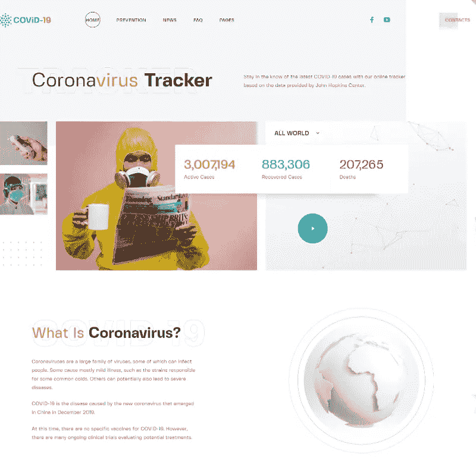
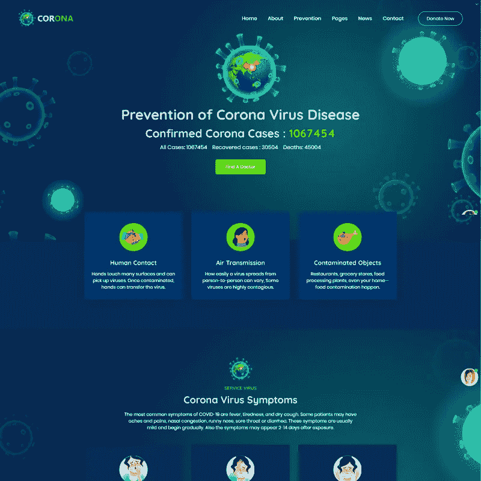
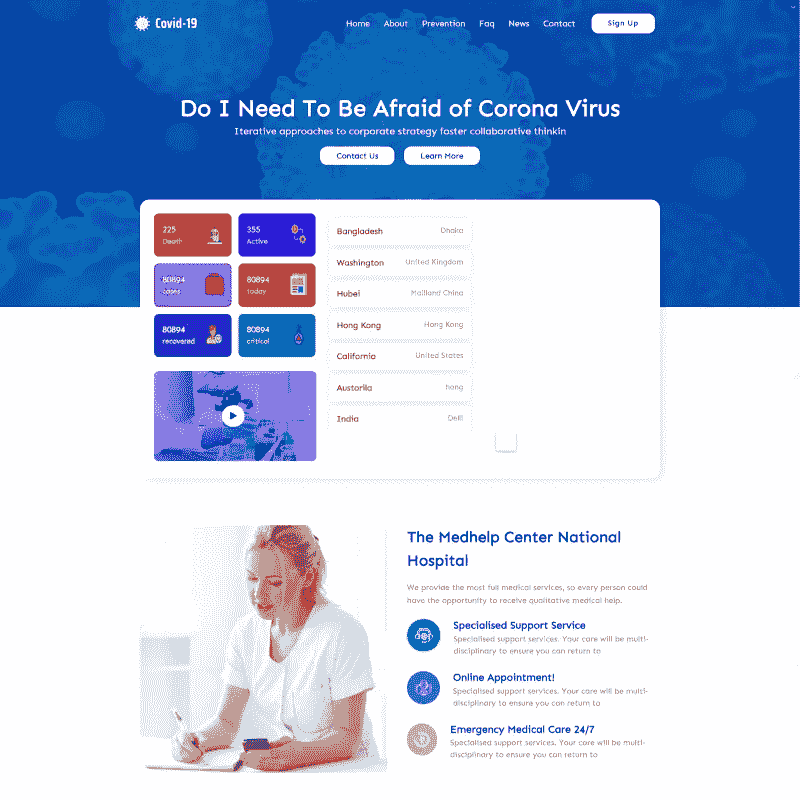
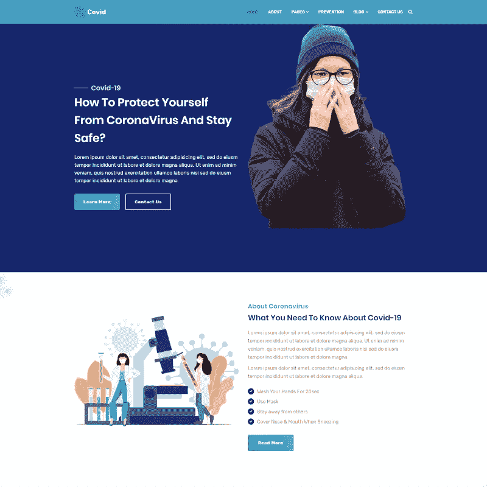
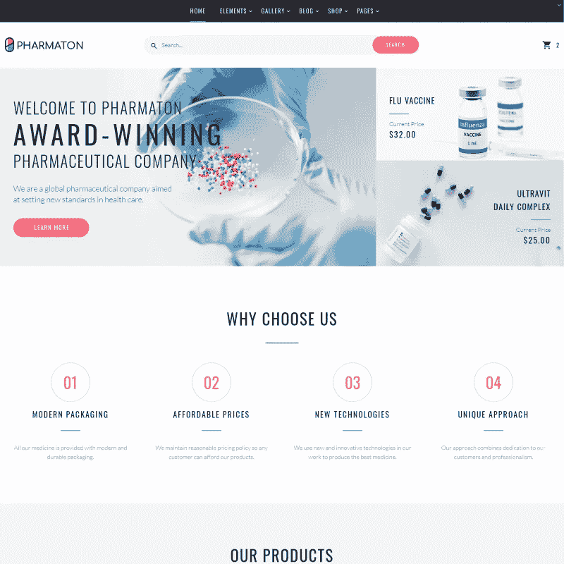
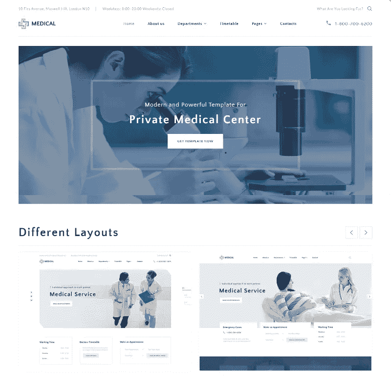
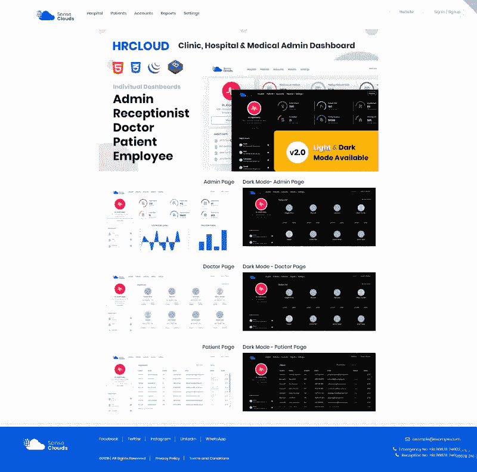
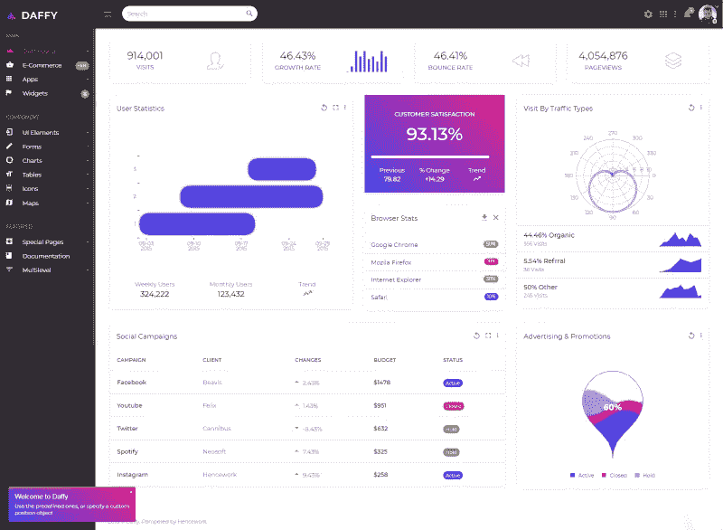
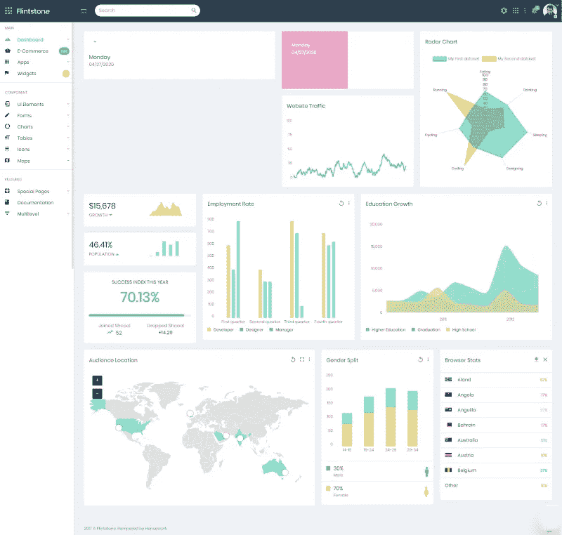
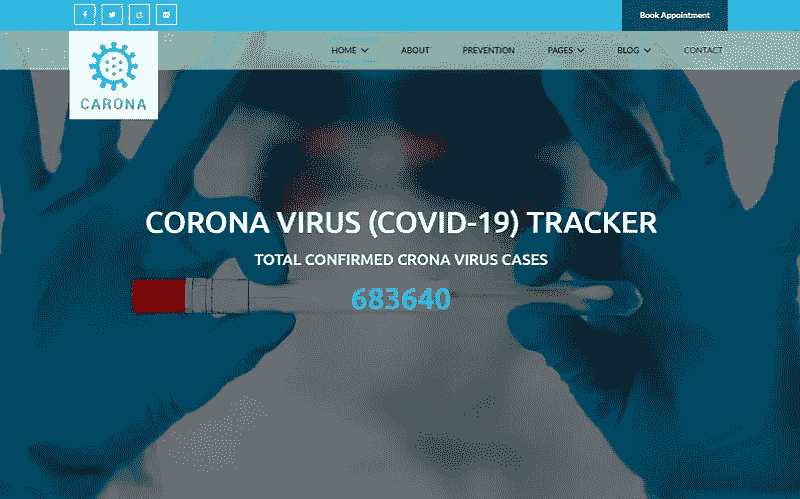

# 10 个 HTML5 医疗模板和管理仪表板模板，用于创建令人印象深刻的医疗保健网站

> 原文：<https://medium.com/javarevisited/10-html5-medical-templates-admin-dashboard-templates-to-create-an-impressive-healthcare-website-1bf222fefc7b?source=collection_archive---------1----------------------->

你是执业医疗保健提供者吗？那么保持强大的在线形象应该不成问题。自从世界面对新冠肺炎以来，关于这种疾病的准确的公共卫生信息在今天具有黄金般的价值。知道什么是真的什么不是吗？用你的网站增加你的在线影响力，打破关于新冠肺炎的神话。这就是下面的 **HTML5 医疗模板&管理仪表板模板**可以提供帮助的地方，尤其是当几乎全世界的人都被隔离时。害怕你的技能不足以完成这项任务？好消息是，即使在 40 多岁和 50 多岁的时候，你也可以[成为一名网络开发人员。](/javarevisited/can-you-learn-programming-and-become-a-web-developer-in-the-40s-and-50s-f9e117f32721)

数字存在是现代医疗保健领域的一个巨大参与者。此外，只要人类存在，它就有意义。人们生病是很自然的，你的工作是帮助他们过上更健康的生活。您正在寻找一个强大的医疗管理仪表板模板吗？别再看了。拯救世界。

就像任何网站一样，medical one 需要遵循它的最终目标。如果设计得当，用户点击一个按钮，购买一些东西，或者执行一些特定的动作。如果没有，就该重新设计了。但是在你挑选之前，确保一个 **HTML5 医疗模板**符合你的要求。比如说，响应能力是一个很好的经验法则。这同样适用于最佳 SEO 规则的导航和优化。因此，按照这些最佳实践设计的网站更有可能出现在尽可能靠近顶部的位置。

无论如何，无论你最终得到什么样的 HTML5 医疗模板，你的网站都将有一个良好的开端。在任何人都可以分享他们想要的任何信息的时代，准确的信息是至关重要的。想打这场虚假信息的硬仗吗？去吧。为了让你的网站更吸引人，分享你的用户在 COVID-29 期间可以阅读的 [Java 和编程文章。真的为什么不呢？社交距离让我们在网上学习新东西，那么为什么不编程呢？](/javarevisited/15-java-and-programming-articles-you-can-read-during-covid-19-fcf6266f211d)

# 新冠肺炎-冠状病毒医学网站模板

新冠肺炎可以帮助你实现这个目标。现代而强大，它将是任何医疗网站的绝佳选择。总而言之，它是最好的 HTML5 医疗模板之一，包括一个在线跟踪器来帮助监控情况。此外，编码符合最佳搜索引擎优化规则，新冠肺炎更有可能保持您的网站拍摄到顶部。挤满了坚持顶端菜单功能，它使你的用户更容易浏览你的网站。当然，基于 Bootstrap 框架，新冠肺炎可以响应所有现代移动设备。结果呢？你不会错过任何设备上的任何一个访问者。

[**更多信息|下载**](https://www.templatemonster.com/website-templates/covid-19-coronavirus-medical-website-template-100531.html?aff=javarevisited&utm_campaign=medical_templates&utm_source=javarevisited&utm_medium=referral)

# 电晕(新冠肺炎)预防 HTML5 引导网站模板

科罗纳新冠肺炎是另一个值得探索的 HTML5 医疗模板。你想增强对这种疾病的科学信息的信任吗？建立顶级网站并分享如何预防的技巧。干净和响应，电晕新冠肺炎适合各种医疗网站的权利。总而言之，大海里有很多鱼。除此之外，它还有一个完全响应的布局，所以你的用户可以在任何现代设备上享受你的网站。让你的页面布局更有创意，跳过棘手的编码问题。最后，借助预约插件，您可以随时随地管理自己的日程。

[**更多信息|下载**](https://www.templatemonster.com/website-templates/corona-covid-19-prevention-html5-bootstrap-website-template-100095.html?aff=javarevisited&utm_campaign=medical_templates&utm_source=javarevisited&utm_medium=referral)

# 新冠肺炎-冠状病毒医疗预防网站模板

面对现实吧，最近对 HTML5 医疗模板的需求增加了。这并不奇怪。对于围绕冠状病毒的所有宣传，知识是关键。想停止传播错误信息吗？新冠肺炎为你提供了一个很好的方法。无论是医院评论还是医生门户，新冠肺炎都适合。干净，新鲜和响应，新冠肺炎是建立在自助框架。事实是，您可以获得所有功能丰富的功能，而无需编码的混乱和痛苦。想讲一个关于你的品牌的故事，或者如何预防冠状病毒？用更吸引人的方式去做。一个设计优雅的医疗界面正是我们想要的。

[**更多信息|下载**](https://www.templatemonster.com/website-templates/covid-19-coronavirus-medical-prevention-website-template-99211.html?aff=javarevisited&utm_campaign=medical_templates&utm_source=javarevisited&utm_medium=referral)

# Covid —冠状病毒医疗预防网站模板

患者不断在网上寻找健康信息。如果你的网站出现在搜索引擎结果的顶端，你就赢了。但如果不是呢？那么，是时候改变了。Covid 是一个很好的 HTML5 医疗模板，设计用于多种医疗 web 用途。此外，对于任何想发表更多高质量医学文章的人来说，这将是一个不错的选择。干净优雅的 Covid 可以大大提升你的网站形象。它建立在 Bootstrap 框架上，因此即使在小型移动设备上也能享受流畅的浏览体验。有最少的编码问题？别担心，Covid 是有据可查的。不要忘了组织整洁的 CTA 会引起注意。

[**更多信息|下载**](https://www.templatemonster.com/website-templates/covid-coronavirus-medical-prevention-website-template-99500.html?aff=javarevisited&utm_campaign=medical_templates&utm_source=javarevisited&utm_medium=referral)

# Pharmaton 药店多页现代 HTML 模板网站模板

Pharmaton 在医疗界面方面给人留下了深刻的第一印象。它干净而吸引人的布局并不令人难以招架，就像一个伟大的医疗保健网站需要的那样。事实上，它的响应式布局在所有现代设备上都反应惊人。此外，挤满了视差滚动，你的网站欢迎你的访客喜欢它。事实上，视频背景是使 Pharmaton 成为完美选择的另一个好处。为了帮助你节省大量的时间，考虑使用一套预先制作的页面。你想做些改变吗？太好了，好好享受吧。最后，它支持 WooCommerce 插件。因此，准备在几分钟内推出您的在线商店。

[**更多信息|下载**](https://www.templatemonster.com/website-templates/pharmacy-company-drugstore-medical-responsive-website-template-58600.html?aff=javarevisited&utm_campaign=medical_templates&utm_source=javarevisited&utm_medium=referral)

# 医疗—私人医疗中心多页网站模板

你正在寻找一个多页 HTML5 医疗模板？医疗会是你的拿手好戏。它功能多样，易于定制，配有干净的医疗接口。此外，还有大量的 UI 元素和块需要考虑。为了给你的页面增加更多的关注，充分利用酷的 CSS3 动画效果和过渡。除此之外，调整网站的整体外观也很容易。请记住，其充分响应的布局将使您的网站在搜索引擎中可见。最重要的是，它与预约插件兼容。因此，像专家一样管理你的约会，节省时间。

[**更多信息|下载**](https://www.templatemonster.com/website-templates/private-medical-center-multipage-html5-website-template-69084.html?aff=javarevisited&utm_campaign=medical_templates&utm_source=javarevisited&utm_medium=referral)

# CRM 人力资源-诊所|诊所、医院、医疗管理模板

需要医疗接口的解决方案？CRM-HR-Clinic 可以提供帮助。这对于任何医学网站来说都是合适的。马上，它适合医生，牙医，医院，外科医生和医疗机构。给这个医疗管理仪表板一个尝试，并准备好达到明星。在任何现代设备上推广您的卓越声誉，并看到您的客户群增长。其反应灵敏的布局会有所帮助。让你的潜在病人更容易预约。加个预约预约单就行了。最后，它在 GPLv3 的许可下。结果，你获得了更多的自由。

[**更多信息|下载**](https://www.templatemonster.com/admin-templates/hr-clinic-clinic-hospital-medical-management-admin-template-86982.html?aff=javarevisited&utm_campaign=medical_templates&utm_source=javarevisited&utm_medium=referral)

# Daffy —多用途引导+ UI 工具包管理模板

如果你正在寻找一种简单的方法来启动一个医疗网站，Daffy 就是解决方案。这是一个基于 Bootstrap 框架的现代 HTML5 医疗模板。事实上，这个医疗管理仪表板模板可以扭转局面。这是一个多用途的选择，所以它的强大功能令人惊叹。举例来说，它包括许多漂亮的页面、工作应用、菜单选项和布局。因此，它让你跳过了很多网站建设的痛苦。想在网上卖东西？做好电子商务整合。为了让你的内容更吸引人，可以考虑使用令人惊叹的表格、图表和元素。事实上，RTL 的支持会是一个很好的额外收获。

[**更多信息|下载**](https://www.templatemonster.com/admin-templates/daffy-multipurpose-bootstrap-ui-kit-admin-template-68384.html?aff=javarevisited&utm_campaign=medical_templates&utm_source=javarevisited&utm_medium=referral)

# 燧石族-终极多用途管理模板

燧石族是一个很棒的 HTML5 医疗模板，专门为管理面板设计。现代和干净，它配备了一切您可能需要设置您的网站取得成功。因此，它具有大量的 UI 组件，可以帮助您发展品牌。此外，添加不同的表单、表格、图表或应用程序来使您的页面值得访问也是有意义的。此外，它配有整洁的医疗界面，这将是一个很大的帮助。事实上，它配备了一个完全响应的布局，可以响应所有现代设备。尽情享受医疗管理仪表板模板，获得管理所需的一切。

[**更多信息|下载**](https://www.templatemonster.com/admin-templates/65607.html?aff=javarevisited&utm_campaign=medical_templates&utm_source=javarevisited&utm_medium=referral)

# 卡罗那——冠状病毒(新冠肺炎)医学网站模板

Carona 是适合任何当代医学网站的另一个优质解决方案。首先，它有一个干净而现代的设计，在所有现代设备上看起来都很棒。第二，附带超过 10 个 HTML 页面，这是一个节省时间的完美方法。因此，你花在编码上的时间更少了，你可以腾出时间去做其他的工作。此外，您可以为您的网站选择单页或多页布局。接下来，视差滚动会给你的页面增加一点额外的氛围。事实上，不要忘记添加社交链接来让你的网站访问者了解你的新闻和更新。最后，Carona 与预约插件兼容。

[**更多信息|下载**](https://www.templatemonster.com/website-templates/carona-corona-virus-covid-19-medical-website-template-99908.html?aff=javarevisited&utm_campaign=medical_templates&utm_source=javarevisited&utm_medium=referral)

# 包装东西

你觉得怎么样？你同意选择正确的 HTML5 医疗模板并不容易吗？嗯，事实上，这不应该是一个艰难的演出。这里的诀窍是清楚地了解你的目标是什么。医疗保健将会是一个持续多年的话题，而且看不到尽头。

因此，如果你对冠状病毒问题的报道感兴趣，没有时间可以浪费了。只要这种情况没有被完全探索，就很有可能赢得你的目标受众。现在看看这些医疗管理仪表板模板，并做出选择。