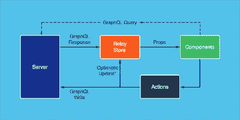
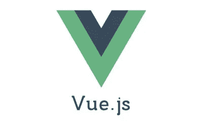
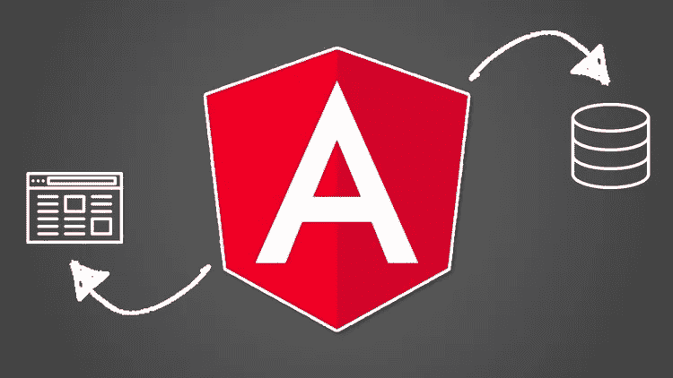
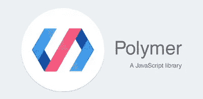
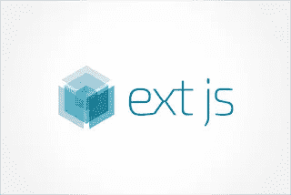
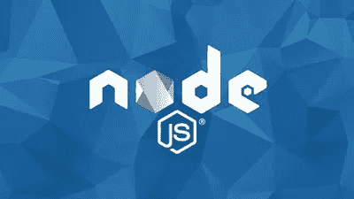

# 2023 年要学习的十大 JavaScript 框架和库——最好的

> 原文：<https://medium.com/javarevisited/10-javascript-frameworks-and-libraries-to-learn-in-2020-best-of-lot-5f61f86c60b4?source=collection_archive---------0----------------------->

## 这些是前端、后端和全栈开发人员在 2023 年可以学到的最好的 JavaScript 框架，带有相关课程的链接。

毫无疑问， [JavaScript](https://javarevisited.blogspot.com/2018/06/top-10-courses-to-learn-javascript-in.html) 现在是世界上排名第一的编程语言，也是 web 开发之王。如果你想成为一名能够像你在互联网上看到的那样快速创建网站的 web 开发人员，那么掌握 JavaScript 和各种流行的 JavaScript web 开发框架的知识对你来说是必不可少的。

这些框架彻底改变了十年前人们开发 web 应用程序的方式。在 [node.js](http://javarevisited.blogspot.sg/2018/01/top-5-nodejs-and-express-js-online-courses-for-web-developers.html) 之后，甚至有可能只用一种编程语言，JavaScript，从前端到后端创建一个完整的 web 应用程序。

> 这就是 JavaScript 成为所有全栈 Web 开发人员首选编程语言的原因。

JavaScript 作为一种客户端脚本语言开始了它的旅程，它可以与 [HTML](http://www.java67.com/2018/02/5-free-html-and-css-courses-to-learn-web-development.html) 一起用于编写网页，并在客户端提供动态功能，如输入和动画的验证。

当 AJAX 出现时，事情开始发生变化，它允许 web 开发人员更新 web 页面的一部分，而不用从服务器下载整个 web 页面；这使得 GUI 速度更快，响应更灵敏。

接着是 j [查询](https://javarevisited.blogspot.com/2015/02/top-16-jquery-interview-questions.html#axzz5d7MDZd3M)，这让 JavaScript 大受欢迎。它在客户端几乎没有竞争的情况下赢得了 JavaScript 的比赛，但是像 [Python](https://javarevisited.blogspot.com/2018/12/10-free-python-courses-for-programmers.html) 、 [PHP](http://www.java67.com/2018/02/5-free-php-and-mysql-courses-for-web-developers.html) 和 [Ruby](http://www.java67.com/2018/02/5-free-ruby-and-rails-courses-to-learn-online.html) 这样的服务器端语言仍然是开发 web 应用程序所必需的。

此外，创建和管理 UI 并不适合使用不同的技术，如 [JSP](https://www.java67.com/2018/02/5-free-servlet-jsp-and-jdbc-online-courses-for-java-developers.html) ， [ASP。网](https://javarevisited.blogspot.com/2019/10/top-5-courses-to-learn-asp-net-in-2019.html)等。但是后来出现了 node.js，它使得使用 JavaScript 开发服务器端组件成为可能。现在，你可以通过使用 [JavaScript](http://www.java67.com/2018/04/top-5-free-javascript-courses-to-learn.html) 来开发一个全功能的 web 应用程序。

> 顺便说一句，你不需要学习所有这些框架和库，只需要学习你需要的东西就像如果你学习反应，那么就没有必要学习 Svelte 和 Vue.js。这个列表只是为你提供了一些选项。

# 2023 年前端开发人员学习的 10 个最佳 JavaScript 框架和库

在本文中，我将分享一些可以用于 web 开发的最有用的 JavaScript 框架和库。

作为一名 web 开发人员，您应该熟悉它们，并且知道何时可以利用它们来构建您的下一个项目。这个列表包括像 [Angular](https://javarevisited.blogspot.com/2018/06/top-10-angular-tutorials-and-courses-for-web-developers.html#axzz5Ie75bPFF) ，Ember 这样的框架。JS，[节点。JS](http://javarevisited.blogspot.sg/2018/01/top-5-nodejs-and-express-js-online-courses-for-web-developers.html) ，还有像[这样的库 ReactJS](https://hackernoon.com/the-2018-react-js-roadmap-4d0a43814c02)

## 1.react . js[前端开发的最佳 JavaScript 库]

React 是脸书基于组件的 web 开发和库，用于制作 ui 和提供声明性视图，这使得代码更可预测，调试起来更舒适。

不支持控制器或型号。React 还可以使用节点在服务器上进行渲染，并使用 React Native 为移动应用提供支持。简而言之，它允许您构建强大、快速、用户友好和反应式的 web 应用程序。

如果你想学习 React，那么 [**React 16.6 —完全指南**](https://click.linksynergy.com/fs-bin/click?id=JVFxdTr9V80&subid=0&offerid=634352.1&type=10&tmpid=14538&RD_PARM1=https%3A%2F%2Fwww.udemy.com%2Freact-the-complete-guide-incl-redux%2F) 是一门极好的入门课程。你可以在 Udemy 上学习这门在线课程。

如果你需要免费课程来学习 React 框架，那么你也可以看看这个[免费 React 课程](http://www.java67.com/2018/02/5-free-react-courses-for-web-developers.html)列表。

## 2.vue . js[面向前端开发人员的新 JavaScript 框架]

Vue.js 是另一个用于构建用户界面的开源渐进式 JavaScript 框架，类似于 React。

Vue.js 的 USP 是它的适应性，集成到使用其他 JavaScript 库的项目中非常容易，因为它被设计成可增量采用。

它还支持使用模板语法向 DOM 提供数据的声明性呈现。对于初学者来说，[**nuxt . js—vue . js on Steroids**](https://click.linksynergy.com/fs-bin/click?id=JVFxdTr9V80&subid=0&offerid=634352.1&type=10&tmpid=14538&RD_PARM1=https%3A%2F%2Fwww.udemy.com%2Fnuxtjs-vuejs-on-steroids%2F)是一个很好的起点，可以找到更多信息。

## 3.angular[最佳 JavaScript 框架]

Angular，以前被称为 Angular JS，是 Google 为桌面和移动 web 应用程序开发的单一 web 开发框架。Angular 的目标是通过提供依赖注入来创建渐进式 web 应用程序，这有助于为应用程序组装数据服务，同时提供一个 HTML 模板来合成模板。Angular 还有一个强大的生态系统，包括四个数据库和 ide 支持。如果你想学习 Angular，那么[**Angular——完整指南**](https://click.linksynergy.com/fs-bin/click?id=JVFxdTr9V80&subid=0&offerid=634352.1&type=10&tmpid=14538&RD_PARM1=https%3A%2F%2Fwww.udemy.com%2Fthe-complete-guide-to-angular-2%2F) 是一个很好的起点。

Btw，如果你不介意从一个免费的资源中学习，或者你需要免费的课程来学习 Angular 框架，那么你也可以看看这个[免费 Angular 课程](http://www.java67.com/2018/01/top-5-free-angular-js-online-courses-for-web-developers.html)的列表。

## 4.svelte . js[最值得学习的新 JavaScript 框架]

Svelte 或 Svelte.js 是一个新的 JavaScript 框架，由 Rich Harris 编写，被吹捧为 2023 年的另一个 React 替代方案。关于 Svelte.js 最好的事情是，它不包括框架参考，这是非常不同的反应或角度参考，你需要把你的代码和库或框架。相反，构建一个苗条的应用程序生成代码来操作 DOM，这可能会给客户端带来更好的性能。Sveltejs 仍处于早期阶段，但如果你想在 2023 年学习一个新的 JavaScript 框架，让自己在下一个 web 开发人员中占据优势，Svelete.js 可能是一个不错的选择。

如果你需要一个资源，你可以查看一下[**svelte . js——完全指南**](https://click.linksynergy.com/deeplink?id=JVFxdTr9V80&mid=39197&murl=https%3A%2F%2Fwww.udemy.com%2Fcourse%2Fsveltejs-the-complete-guide%2F) ，作者不是别人，正是 Udemy 上最好的指导者之一 Maximilian Schwarzmuller。本课程将教你使用 Svelete.js(一种轻量级 JavaScript 编译器)构建高性能 web 应用程序所需的一切。

## 5.骨干网. js

Backbone.js 是一个 JavaScript 库，具有 RESTful JSON 接口，基于模型、视图和表示器设计范例。Backbone.js 为繁重的 web 应用程序提供了结构。

它还提供了具有键值绑定和自定义事件的模型，具有丰富的可枚举函数 API 的集合，具有声明性事件处理的视图，并通过一个 [RESTful](https://javarevisited.blogspot.com/2018/02/top-5-restful-web-services-with-spring-courses-for-experienced-java-programmers.html) JSON 接口将其连接到您现有的 API。

如果一个 UI 动作允许一个模型属性发生变化，将导致事件的自动变化。模型中的更改被传播到 UI，以帮助它们重新呈现自己。

如果你想了解更多关于 Backbone JS 的知识，那么我建议你查看 Udemy 上的 [**Backbone 教程:从零开始学习 Backbone JS**](https://click.linksynergy.com/fs-bin/click?id=JVFxdTr9V80&subid=0&offerid=634352.1&type=10&tmpid=14538&RD_PARM1=https%3A%2F%2Fwww.udemy.com%2Fbackbonejs-tutorial%2F)课程。

<https://click.linksynergy.com/fs-bin/click?id=JVFxdTr9V80&subid=0&offerid=634352.1&type=10&tmpid=14538&RD_PARM1=https%3A%2F%2Fwww.udemy.com%2Fbackbonejs-tutorial%2F>  

## 6.Ember.js

Ember.js 是另一个流行的开源 JavaScript web 框架，它基于模型和视图模式。它允许开发人员通过将常见的习惯用法和最佳实践整合到框架本身来创建可伸缩的单页面 web 应用程序。它集成了模板等功能，也称为手柄，有助于编写更少的代码，并能够随着数据的变化进行自我更新。Ember.js 可以通过 NPM 安装。

如果你想了解更多，那么 [**使用 EmberJS 构建 Web 应用:完整课程**](https://click.linksynergy.com/fs-bin/click?id=JVFxdTr9V80&subid=0&offerid=634352.1&type=10&tmpid=14538&RD_PARM1=https%3A%2F%2Fwww.udemy.com%2Fbuild-web-apps-using-emberjs-the-complete-course%2F) 是一个极好的资源。

## 7.流星 JS

Meteor 或 MeteorJS 是一个用于开发现代 web 和移动应用程序的全栈 JavaScript 平台。

Meteor 包括一组用于构建连接客户端反应式应用程序的基本技术、一个构建工具和一组来自 [Node.js](http://node.js/) 和普通 JavaScript 社区的精选包。

它有助于用相对较少的代码更快地开发 web、移动或桌面应用程序。如果你想使用 Meteor 开发一个 web 应用程序，那么通过在 Udemy 上构建 10 个真实世界的项目 来学习 MeteorJS 是一个很好的开始课程。

<https://click.linksynergy.com/fs-bin/click?id=JVFxdTr9V80&subid=0&offerid=634352.1&type=10&tmpid=14538&RD_PARM1=https%3A%2F%2Fwww.udemy.com%2Flearn-meteorjs-by-building-10-real-world-projects%2F>  

## 8.聚合物 JS

polymer 是另一个开源 JavaScript 库，它可以帮助您创建定制的可重用 HTML 元素，这些元素可用于构建高性能、可维护的 web 应用程序。

如果你将 [Angular](https://javarevisited.blogspot.com/2018/06/top-10-angular-tutorials-and-courses-for-web-developers.html#axzz5Ie75bPFF) 与 Polymer 进行比较，因为两者都是由谷歌开发的，那么 Angular 是一个用于构建 web 应用的完整框架，而 Polymer 只是一个用于创建 Web 组件的库。

如果你想学习 Polymer JS，那么 Pluralsight 上的[**Polymer . JS 入门**](https://pluralsight.pxf.io/c/1193463/424552/7490?u=https%3A%2F%2Fwww.pluralsight.com%2Fcourses%2Fpolymer-js-getting-started) 是一门极好的入门课程。

顺便说一下，你需要一个 [Pluralsight 会员](https://pluralsight.pxf.io/c/1193463/424552/7490?u=https%3A%2F%2Fwww.pluralsight.com%2Fpricing)才能加入这个课程，费用大约是每月 29 美元或每年 299 美元(14%的折扣)。我向所有程序员强烈推荐这个订阅，因为它提供了超过 7000 个在线课程的即时访问，以学习任何技术技能。

或者，你也可以使用他们的 [**10 天免费通行证**](https://pluralsight.pxf.io/c/1193463/424552/7490?u=https%3A%2F%2Fwww.pluralsight.com%2Flearn) 免费观看这个课程。

<https://pluralsight.pxf.io/c/1193463/424552/7490?u=https%3A%2F%2Fwww.pluralsight.com%2Flearn>  

## 9.延伸文件系统射流研究…

为了改变，分机。JS 是一个商业 JavaScript 产品，而不是我们到目前为止一直在讨论的免费和开源的东西。

Ext JS 或 Sencha Ext JS 用于制作数据密集型、面向企业、跨平台的 web 应用。它提供了几个复杂的 UI 组件，比如日历和数据网格。

如果你想学习 Ext.js，那么 [**用 Ext JS**](https://click.linksynergy.com/fs-bin/click?id=JVFxdTr9V80&subid=0&offerid=634352.1&type=10&tmpid=14538&RD_PARM1=https%3A%2F%2Fwww.udemy.com%2Fbuilding-applications-with-ext-js%2F) 构建应用是一个很好的入门课程。

## 10.节点. js

Node.js 或 Node JS 是另一个健壮的 JavaScript 框架，允许您使用 JavaScript 开发服务器端组件。

Node JS 最显著的优势是，现在您可以只使用 JavaScript 开发一个端到端的 web 应用程序。

它也是免费的，可以在各种平台上运行(Windows、Linux、Unix、Mac OS X 等)。)Node.js 使用异步、事件驱动、非阻塞的 I/O 模型，这使它变得轻量级和高效。

Node.js 的包生态系统 npm 也是世界上最大的开源库生态系统。如果你想学习更多关于 Node.js 的知识，那么[**《node . js 开发者教程(第二版)**](https://click.linksynergy.com/fs-bin/click?id=JVFxdTr9V80&subid=0&offerid=634352.1&type=10&tmpid=14538&RD_PARM1=https%3A%2F%2Fwww.udemy.com%2Fthe-complete-nodejs-developer-course-2%2F) 是一门很棒的课程。你可以在优购网上只花 9.99 美元买到它。

这就是现代 web 开发的一些基本 JavaScript 框架和库。这些 JavaScript 库极大地提高了 web 开发的速度和难度。您还会发现许多满足您不同需求的其他 JavaScript 库。

顺便说一句，你不需要学习所有的，只需要学习你需要的就像如果你学会了[反应](/javarevisited/the-2019-react-js-developer-roadmap-9a8e290b8a56)，那么就没有必要学习苗条和 [Vue.js](https://javarevisited.blogspot.com/2019/08/top-5-online-courses-to-learn-vue.js-best.html) 。这个列表只是给你提供了一些选择。在 Node.js 之后，甚至可以开发一个完整的 web 应用程序，从前端到后端只使用 JavaScript。如果你想了解更多关于现代网络技术的知识，Udemy 网站上柯尔特·斯蒂尔的网络开发者训练营是最好的开始。

其他**编程和 Web 开发文章**你可能喜欢的
[2023 React 开发者路线图](https://javarevisited.blogspot.com/2018/10/the-2018-react-developer-roadmap.html)
[面向 Java 开发者的 5 门免费 Spring 框架课程](http://www.java67.com/2017/11/top-5-free-core-spring-mvc-courses-learn-online.html)
[2023 年学习 Web 开发的前 5 门课程](https://javarevisited.blogspot.com/2018/02/top-5-online-courses-to-learn-web-development.html)
[学习大数据和 Apache Spark 的 5 门课程](http://javarevisited.blogspot.com/2017/12/top-5-courses-to-learn-big-data-and.html)
[学习 ReactJS 的前 5 门课程](https://javarevisited.blogspot.com/2018/08/top-5-react-js-and-redux-courses-to-learn-online.html)
[2023 年学习 Spring Boot 的前 5 门课程 面向高级软件开发人员的 DevOps 课程](https://javarevisited.blogspot.com/2018/05/top-5-courses-to-learn-spring-boot-in.html)
[2023 年学习 React Native 的 5 门课程](http://javarevisited.blogspot.sg/2018/02/5-react-native-courses-to-learn-mobile-development-using-JavaScript.html)
[面向 Web 开发人员学习 TypeScript 的前 5 门课程](https://javarevisited.blogspot.com/2018/07/top-5-courses-to-learn-typescript.html)
[面向 Web 开发人员学习的前 10 门 JavaScript 教程和课程](https://javarevisited.blogspot.com/2018/06/top-10-courses-to-learn-javascript-in.html)

感谢您阅读本文。如果你发现这些框架对 Web 开发有用，那么请与你的朋友和同事分享。如果您有任何问题或反馈，请留言。

如果你是一个网页开发的初学者，那么由安吉拉·于教授的[**2023 年网页开发者训练营**](https://click.linksynergy.com/fs-bin/click?id=JVFxdTr9V80&subid=0&offerid=634352.1&type=10&tmpid=14538&RD_PARM1=https%3A%2F%2Fwww.udemy.com%2Fthe-complete-web-development-bootcamp%2F) 也是一门很好的课程。它会教你没有任何编程经验的 web 开发，也涵盖了这里讨论的大部分框架。

<https://click.linksynergy.com/fs-bin/click?id=JVFxdTr9V80&subid=0&offerid=634352.1&type=10&tmpid=14538&RD_PARM1=https%3A%2F%2Fwww.udemy.com%2Fthe-complete-web-development-bootcamp%2F> 