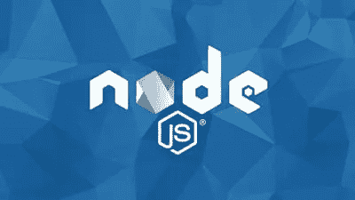
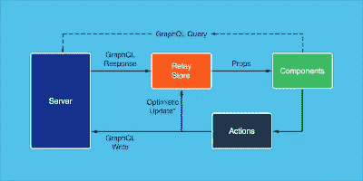
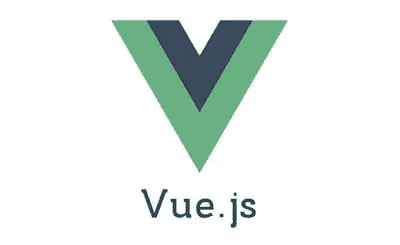
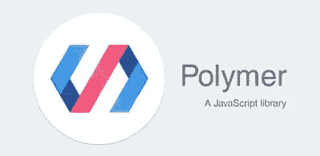
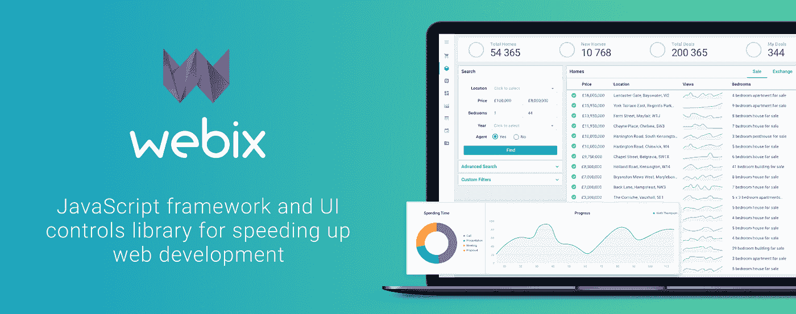
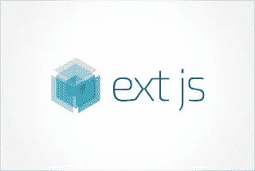

# 2023 年 Web 开发中最受欢迎的 10 个 JavaScript 框架和库

> 原文：<https://medium.com/javarevisited/10-of-the-most-popular-javascript-frameworks-libraries-for-web-development-in-2019-a2c8cea68094?source=collection_archive---------0----------------------->

哈尔·盖特伍德在 [Unsplash](https://unsplash.com?utm_source=medium&utm_medium=referral) 上拍摄的照片

毫无疑问， [JavaScript](https://javarevisited.blogspot.com/2018/06/top-10-courses-to-learn-javascript-in.html) 现在是世界上排名第一的编程语言，也是 web 开发之王。如果你想成为一名能够像你在互联网上看到的那样快速创建网站的 web 开发人员，那么精通 JavaScript 和各种流行的 JavaScript web 开发框架对你来说非常重要。

十年前，这些框架完全改变了人们开发 web 应用程序的方式。在 [node.js](http://javarevisited.blogspot.sg/2018/01/top-5-nodejs-and-express-js-online-courses-for-web-developers.html) 之后，甚至有可能只使用一种编程语言，JavaScript，从前端到后端创建一个完整的 web 应用程序。这就是为什么它成为所有全栈 Web 开发者最喜欢的编程语言。

JavaScript 作为一种客户端脚本语言开始了它的旅程，它可以与 HTML 一起用于编写网页，并在客户端提供动态功能，如输入和动画的验证。

当 AJAX 出现时，事情开始发生变化，它允许 web 开发人员更新 web 页面的一部分，而不用从服务器下载整个 web 页面，这使得 GUI 速度更快，响应更灵敏。

然后是 jQuery，它让 JavaScript 变得非常流行。它赢得了 JavaScript 在客户端的游戏，几乎没有竞争，但像 [Python](https://javarevisited.blogspot.com/2018/12/10-free-python-courses-for-programmers.html) 、 [PHP](http://www.java67.com/2018/02/5-free-php-and-mysql-courses-for-web-developers.html) 和 [Ruby](http://www.java67.com/2018/02/5-free-ruby-and-rails-courses-to-learn-online.html) 这样的服务器端语言仍然是开发网络应用所必需的。

此外，使用不同的技术(如 JSP、ASP)创建和管理 UI 并不容易。NET 等等，但是后来出现了 node.js，它使得使用 JavaScript 开发服务器端组件成为可能。现在，只需使用 [JavaScript](http://www.java67.com/2018/04/top-5-free-javascript-courses-to-learn.html) 就可以开发一个全功能的 web 应用程序。

# Web 开发人员的 10 大 JavaScript 框架。

在本文中，我将分享一些可以用于 web 开发的最有用的 JavaScript 框架和库。作为一名 web 开发人员，您应该熟悉它们，并且知道何时可以利用它们来构建您的下一个项目。这个列表包括像 [Angular](https://javarevisited.blogspot.com/2018/06/top-10-angular-tutorials-and-courses-for-web-developers.html#axzz5Ie75bPFF) 、Ember 这样的框架。JS，[节点。JS](http://javarevisited.blogspot.sg/2018/01/top-5-nodejs-and-express-js-online-courses-for-web-developers.html) ，以及像 [jQuery](http://www.java67.com/2018/04/top-5-free-jquery-courses-for-web-developers.html) 和 [ReactJS](https://hackernoon.com/the-2018-react-js-roadmap-4d0a43814c02) 这样的库

## **1。Node.js**
Node.js 或 Node JS 是另一个强大的 JavaScript 框架，允许您使用 JavaScript 开发服务器端组件。

Node JS 最大的优势是，现在你可以只使用 JavaScript 开发一个端到端的 web 应用程序。

它也是免费的，可以在各种平台上运行(Windows、Linux、Unix、Mac OS X 等)。)Node.js 使用异步、事件驱动、非阻塞的 I/O 模型，这使它变得轻量级和高效。

Node.js 的包生态系统 npm 也是世界上最大的开源库生态系统。如果你想了解更多关于 Node.js 的知识，那么[**node . js 开发者课程(第二版)**](https://click.linksynergy.com/fs-bin/click?id=JVFxdTr9V80&subid=0&offerid=634352.1&type=10&tmpid=14538&RD_PARM1=https%3A%2F%2Fwww.udemy.com%2Fthe-complete-nodejs-developer-course-2%2F) 是一门很好的课程。你可以在优购上只花 9.99 美元买到它。

## **2。React JS**

它不支持控制器或模型。React 还可以使用节点在服务器上进行渲染，并使用 React Native 为移动应用提供支持。简而言之，它允许您构建强大、快速、用户友好和反应式的 web 应用程序。

如果你想学习 React，那么[**React 16.6——完全指南**](https://click.linksynergy.com/fs-bin/click?id=JVFxdTr9V80&subid=0&offerid=634352.1&type=10&tmpid=14538&RD_PARM1=https%3A%2F%2Fwww.udemy.com%2Freact-the-complete-guide-incl-redux%2F) 是一个很好的入门课程。你可以在 Udemy 上学习这门在线课程。

如果你需要免费的课程来学习 React 框架，那么你也可以看看这个[免费 React 课程的列表](http://www.java67.com/2018/02/5-free-react-courses-for-web-developers.html)。

## 3.Vue.js
Vue.js 是另一个用于构建用户界面的开源渐进式 JavaScript 框架，类似于 React。

Vue.js 的 USP 是它的适应性，集成到使用其他 JavaScript 库的项目中非常容易，因为它被设计成可增量采用。

它还支持使用模板语法向 DOM 提供数据的声明性呈现。对于初学者来说，[**nuxt . js—vue . js on Steroids**](https://click.linksynergy.com/fs-bin/click?id=JVFxdTr9V80&subid=0&offerid=634352.1&type=10&tmpid=14538&RD_PARM1=https%3A%2F%2Fwww.udemy.com%2Fnuxtjs-vuejs-on-steroids%2F)是一个很好的起点，可以找到更多的信息。

## **4。jQuery 可能是目前最流行的 JavaScript 库，它为现代开发提供了如此多的特性。**

您可以使用 jQuery API 进行事件处理、动画制作和 HTML 文档(也称为 DOM)的操作。除此之外，jQuery 还被用于 Angular 和 React 应用构建工具。简而言之，这是 web 开发必须了解的 JavaScript 库之一。

如果你决定从头开始学习 jQuery 或者想提高自己的理解能力，那么 [**完整的 jQuery 课程:从初级到高级**](https://click.linksynergy.com/fs-bin/click?id=JVFxdTr9V80&subid=0&offerid=634352.1&type=10&tmpid=14538&RD_PARM1=https%3A%2F%2Fwww.udemy.com%2Fjquery-tutorial%2F) **！**是一个开始的好地方。

顺便说一句，如果你需要免费的课程来学习 Angular 框架，那么你也可以看看这个[免费 jQuery 课程列表](http://www.java67.com/2018/04/top-5-free-jquery-courses-for-web-developers.html)。

## **5。backbone . js**
backbone . js 是一个 JavaScript 库，具有 RESTful JSON 接口，基于模型、视图和表示器设计范例。Backbone.js 为繁重的 web 应用程序提供了结构。

它还提供了具有键值绑定和自定义事件的模型，具有丰富的可枚举函数 API 的集合，具有声明性事件处理的视图，并通过一个 [RESTful](https://javarevisited.blogspot.com/2018/02/top-5-restful-web-services-with-spring-courses-for-experienced-java-programmers.html) JSON 接口将所有这些连接到您现有的 API。

如果一个 UI 动作允许一个模型属性改变，它将导致事件的自动改变。模型上的更改被传播到 UI，以帮助它们重新呈现自己。

如果你想了解更多关于 Backbone JS 的知识，那么我建议你查看 Udemy 上的 [**Backbone 教程:从零开始学习 Backbone JS**](https://click.linksynergy.com/fs-bin/click?id=JVFxdTr9V80&subid=0&offerid=634352.1&type=10&tmpid=14538&RD_PARM1=https%3A%2F%2Fwww.udemy.com%2Fbackbonejs-tutorial%2F)课程。

 [## Backbone 教程:从头开始学习 Backbonejs

### 想学习如何编写干净、可维护、可测试的 Javascript 代码吗？有许多库和框架可以…

www.udemy.com](https://www.udemy.com/course/backbonejs-tutorial/?LSNPUBID=JVFxdTr9V80&ranEAID=JVFxdTr9V80&ranMID=39197&ranSiteID=JVFxdTr9V80-kS2LBpUGnPfe6eF2ytoRJA) 

## **6。Ember.js 是另一个流行的开源 JavaScript web 框架，它基于模型和视图模式。**

它允许开发人员通过将常见的习惯用法和最佳实践整合到框架本身来创建可伸缩的单页面 web 应用程序。

它集成了模板等功能，也称为手柄，有助于编写更少的代码，并能够随着数据的变化进行自我更新。Ember.js 可以通过 NPM 安装。

如果你想了解更多，那么 [**使用 EmberJS 构建 Web 应用程序:完整的课程**](https://click.linksynergy.com/fs-bin/click?id=JVFxdTr9V80&subid=0&offerid=634352.1&type=10&tmpid=14538&RD_PARM1=https%3A%2F%2Fwww.udemy.com%2Fbuild-web-apps-using-emberjs-the-complete-course%2F) 是一个很好的资源。

## **7。Meteor JS**
Meteor 或 Meteor JS 是一个用于开发现代 web 和移动应用的全栈 JavaScript 平台。

Meteor 包括一组用于构建连接客户端反应式应用程序的关键技术、一个构建工具和一组来自 [Node.js](http://node.js/) 和普通 JavaScript 社区的精选包。

它有助于用相对较少的代码更快地开发 web、移动或桌面应用程序。如果你想使用 Meteor 开发一个 web 应用程序，那么通过在 Udemy 上构建 10 个真实世界的项目来学习 MeteorJS 是一个不错的开始。

 [## 通过构建 10 个真实世界项目来学习流星

### 这是一个完整的课程，通过构建 10 个真实世界项目的完整过程来逐步学习 MeteorJS。

www.udemy.com](https://www.udemy.com/course/learn-meteorjs-by-building-10-real-world-projects/?LSNPUBID=JVFxdTr9V80&ranEAID=JVFxdTr9V80&ranMID=39197&ranSiteID=JVFxdTr9V80-AvcSC3hAJLPOogIUSGeGhA) 

## 8.Angular
Angular 以前被称为 Angular JS，是 Google 为桌面和移动网络应用开发的单一网络开发框架。

Angular 的目标是通过提供依赖注入来创建渐进式 web 应用程序，这有助于应用程序的数据服务组装，而 HTML 模板用于合成模板。

Angular 还有一个强大的生态系统，包括四个数据库和对 ide 的支持。如果你想学习 Angular，那么[**Angular——完整指南**](https://click.linksynergy.com/fs-bin/click?id=JVFxdTr9V80&subid=0&offerid=634352.1&type=10&tmpid=14538&RD_PARM1=https%3A%2F%2Fwww.udemy.com%2Fthe-complete-guide-to-angular-2%2F) 是一个很好的起点。

顺便说一句，如果你不介意从免费资源中学习，或者如果你需要免费的课程来学习 Angular 框架，那么你也可以看看这个免费 Angular 课程的列表****。****

## ****9。polymer JS**
polymer 是另一个开源的 JavaScript 库，它可以帮助你创建定制的可重用 HTML 元素，这些元素可以用来构建高性能、可维护的 web 应用程序。**

**如果你把谷歌开发的 Angular 和 Polymer 进行比较，那么 Angular 是一个构建网络应用的完整框架，而 Polymer 只是一个创建网络组件的库。**

**如果你想学习 Polymer JS，那么 [**在 Pluaralsight 上开始学习 Polymer.js**](https://pluralsight.pxf.io/c/1193463/424552/7490?u=https%3A%2F%2Fwww.pluralsight.com%2Fcourses%2Fpolymer-js-getting-started) 是一个很好的课程。**

****

## ****10。** [**Webix**](https://webix.com/)**

****Webix 是一个多 widget 的 JS UI 框架，专注于跨平台的 web 开发。****

**它的复杂部件(看板、文件管理器、电子表格、调度器和 Pivot)可以集成到任何解决方案中。Webix 在[角度](/javarevisited/10-courses-to-learn-angular-for-web-development-6da1bd2856dc)、[反应](/javarevisited/6-best-websites-to-learn-react-js-coding-for-free-ba7ec5c43433)、 [Vue.js](/javarevisited/top-5-online-courses-to-learn-vue-js-in-2021-249e66b60646) 和流星环境下操作简单。**

**它不是免费的，商业使用可能要花一些钱，但有一个免费的开源版本。该图书馆包括详细的文件，足够的学习材料，和专业的技术支持。**

****

## **11。延伸文件系统 JS
换一个，分机。JS 是一个商业 Javascript 产品，而不是我们到目前为止一直在讨论的免费和开源的东西。**

**Ext JS 或 Sencha Ext JS 用于制作数据密集型、面向企业和跨平台的 web 应用程序。它提供了几个复杂的 UI 组件，比如日历和数据网格。**

**如果你想学习 Ext.js，那么 [**用 Ext JS**](https://click.linksynergy.com/fs-bin/click?id=JVFxdTr9V80&subid=0&offerid=634352.1&type=10&tmpid=14538&RD_PARM1=https%3A%2F%2Fwww.udemy.com%2Fbuilding-applications-with-ext-js%2F) 构建应用程序是一门不错的课程。**

****

**这就是现代 web 开发的一些基本 JavaScript 框架和库。这些 JavaScript 库极大地提高了 web 开发的速度和难度。您还会发现许多满足您不同需求的其他 JavaScript 库。**

**在 Node.js 之后，甚至可以开发一个完整的 web 应用程序，从前端到后端只使用 JavaScript。如果你想了解更多关于现代网络技术的知识，Udemy 网站上柯尔特·斯蒂尔的 [**网络开发者训练营**](https://click.linksynergy.com/fs-bin/click?id=JVFxdTr9V80&subid=0&offerid=634352.1&type=10&tmpid=14538&RD_PARM1=https%3A%2F%2Fwww.udemy.com%2Fthe-complete-web-development-bootcamp%2F) 是最好的开始。**

**其他*编程和 Web 开发文章*你可能喜欢的
[5 门免费的面向 Java 开发者的 Spring 框架课程](http://www.java67.com/2017/11/top-5-free-core-spring-mvc-courses-learn-online.html)
[5 门课程学习 Web 开发](https://javarevisited.blogspot.com/2018/02/top-5-online-courses-to-learn-web-development.html)
[5 门课程学习大数据和 Apache Spark](http://javarevisited.blogspot.com/2017/12/top-5-courses-to-learn-big-data-and.html)
[5 门课程学习 Python 面向初学者的](/better-programming/top-5-courses-to-learn-python-in-2018-best-of-lot-26644a99e7ec)
[5 门课程学习 ReactJS 面向 Web 开发者的](https://javarevisited.blogspot.com/2018/08/top-5-react-js-and-redux-courses-to-learn-online.html)
[5 门课程学习 Spring Boot](https://javarevisited.blogspot.com/2018/05/top-5-courses-to-learn-spring-boot-in.html)
[10 面向高级软件开发人员](https://javarevisited.blogspot.com/2018/09/10-devops-courses-for-experienced-java-developers.html)
[学习 React Native 的 5 门课程](http://javarevisited.blogspot.sg/2018/02/5-react-native-courses-to-learn-mobile-development-using-JavaScript.html)
[面向 Web 开发人员学习 TypeScript 的前 5 门课程](https://javarevisited.blogspot.com/2018/07/top-5-courses-to-learn-typescript.html)
[面向 Web 开发人员学习的前 10 门 JavaScript 教程和课程](https://javarevisited.blogspot.com/2018/06/top-10-courses-to-learn-javascript-in.html)**

**感谢您阅读本文。如果你发现这些框架对 Web 开发有用，那么请与你的朋友和同事分享。如果您有任何问题或反馈，请留言。**

**如果你是一个初学者，刚开始学习网页开发，那么由安吉拉·于教授的《网页开发者训练营》**也是一门很好的课程。它将教你没有任何编程经验的 web 开发，它也涵盖了这里讨论的大多数框架。****

**** [## Web 开发人员训练营:学习 HTML、CSS、Node 等等！

### 嗨！欢迎来到 web 开发者训练营，这是学习 Web 开发的唯一课程。有很多…

click.linksynergy.com](https://click.linksynergy.com/fs-bin/click?id=JVFxdTr9V80&subid=0&offerid=323058.1&type=10&tmpid=14538&RD_PARM1=https%3A%2F%2Fwww.udemy.com%2Fthe-web-developer-bootcamp%2F) 

## 你可能喜欢的其他媒体文章

 [## 完整的 Web 开发者路线图

### 成为网页开发者的图解指南，并提供相关课程的链接

medium.com](/hackernoon/the-2019-web-developer-roadmap-ab89ac3c380e)  [## 2023 年全栈 Java 开发者可以学习的 10 大框架

### 从今年年初开始，我的许多读者一直在问我关于他们应该在 2023 年学习什么的问题。我有…

medium.com](/javarevisited/top-10-frameworks-full-stack-java-developers-can-learn-in-2020-5995021401e5)  [## 我最喜欢的为前端开发者学习 Docker 和 DevOps 的免费课程

### 面向开发人员和 DevOps 专业人员的免费 Docker 课程精选列表

medium.com](/@javinpaul/10-free-courses-to-learn-docker-and-devops-for-frontend-developers-691ac7652cee)****