# Java 程序员应该在 2023 年学会的 10 个坚实的面向对象设计原则

> 原文：<https://medium.com/javarevisited/10-oop-design-principles-you-can-learn-in-2020-f7370cccdd31?source=collection_archive---------0----------------------->

## 想要写出更好、更可靠的代码，能够经受住生产中时间的考验吗？这些设计原则会有所帮助。

[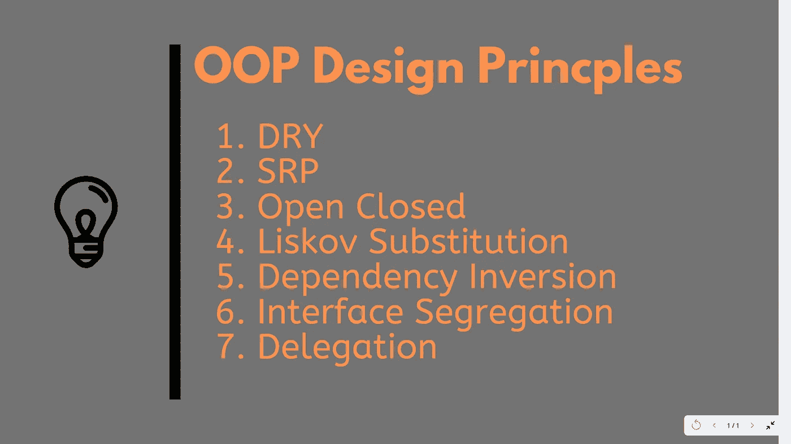](https://www.educative.io/collection/5668639101419520/5649050225344512?affiliate_id=5073518643380224)

面向对象的设计原则是 OOP 编程的核心。尽管如此，我还是看到大多数 Java 程序员追逐设计模式，如[单例模式](https://javarevisited.blogspot.com/2014/05/double-checked-locking-on-singleton-in-java.html)、[装饰者模式](http://www.java67.com/2013/07/decorator-design-pattern-in-java-real-life-example-tutorial.html)或[观察者模式](http://javarevisited.blogspot.sg/2011/12/observer-design-pattern-java-example.html)，而没有将足够的注意力放在学习*面向对象的分析和设计*上。

学习面向对象编程的基础知识是必不可少的，比如[抽象](https://javarevisited.blogspot.com/2017/04/difference-between-abstraction-and-encapsulation-in-java-oop.html)、[封装](https://javarevisited.blogspot.com/2012/03/what-is-encapsulation-in-java-and-oops.html)、[多态](http://javarevisited.blogspot.sg/2011/08/what-is-polymorphism-in-java-example.html)和[继承](http://www.java67.com/2016/03/top-21-java-inheritance-interview-Questions-Answer-Programming.html)。但是，与此同时，了解面向对象的设计原则也同样重要。

> *他们将帮助你创建一个清晰的、模块化的设计，在将来易于测试、调试和维护。*

我经常看到不同经验水平的 Java 程序员和开发人员，他们要么从未听说过这些 [OOP](http://www.java67.com/2015/12/top-30-oops-concept-interview-questions-answers-java.html) 和[可靠的设计原则](https://pluralsight.pxf.io/c/1193463/424552/7490?u=https%3A%2F%2Fwww.pluralsight.com%2Fcourses%2Fprinciples-oo-design) **、**，要么不知道某个特定的设计原则提供了什么好处，以及如何在编码中应用这些设计原则。

为了尽我所能，我已经记下了所有重要的面向对象设计原则，并将它们放在这里以供快速参考。这些至少会让你对他们是什么和他们提供什么好处有所了解。

我没有放例子，为了文章简短，但是你可以在网上找到很多这些设计原则的例子，甚至在我的 [**Java 博客**](http://javarevisited.blogspot.com/) 上，使用页面顶部的搜索栏。

如果你不能理解一个设计原则，你应该试着做不止一个例子，因为有时我们会更好地联系到另一个模型或作者；但是，您必须遵循这些设计原则，并学习如何在您的代码中使用它。

你可以做的另一件事是参加一个全面的面向对象设计课程，像史蒂夫·史密斯在 Pluralsight 上的 [**面向对象设计的坚实原则**](https://pluralsight.pxf.io/c/1193463/424552/7490?u=https%3A%2F%2Fwww.pluralsight.com%2Fcourses%2Fprinciples-oo-design) 。这对我理解和应用这些原则帮助很大。

顺便说一句，我在这里和那里分享了一些相关和有用的课程和书籍，无论是免费的还是付费的，如果你买一些不是免费的东西，我会赚一些钱。

它们也是我用来学习坚实的设计原则和一般编程的一些资源，并有助于深入发现这些原则。

# 10 面向对象编程和程序员坚实的设计原则

尽管学习任何设计原则或模式的最佳方式是一个真实世界的例子，并理解违反该设计原则的后果，但本文的主题是为 Java 程序员介绍<https://hackernoon.com/top-5-object-oriented-programming-and-design-courses-for-programmers-ad49f0870de4?source=user_profile---------7--------------------->*面向对象的设计原则，这些程序员要么没有接触过它，要么还处于学习阶段。*

*[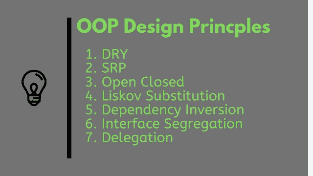](https://dev.to/javinpaul/5-courses-to-learn-object-oriented-programming-in-2019-l0o)*

*我认为这些 [OOP](/swlh/5-free-object-oriented-programming-online-courses-for-programmers-156afd0a3a73) 和[坚实的设计原则](https://javarevisited.blogspot.com/2018/02/top-5-java-design-pattern-courses-for-developers.html)中的每一个都需要一篇文章来清楚地解释它们，我将在这里尝试这样做，但是现在，准备好在设计原则小镇上快速骑自行车吧:)*

## *1.干(不重复)*

*我们第一个面向对象的设计原则是 DRY，顾名思义 **DRY(不要重复自己)**的意思是不要写重复的代码，而是用[抽象](http://javarevisited.blogspot.com/2010/10/abstraction-in-java.html)把日常的东西抽象在一个地方。*

*如果你在两个以上的地方有一个代码块，考虑把它变成一个单独的方法，或者如果你不止一次使用硬编码的值，把它们变成一个[公共最终常量](http://javarevisited.blogspot.com/2011/12/final-variable-method-class-java.html)。这种面向对象设计原则的好处在于**维护**。*

> *重要的是不要滥用它，复制不是为了代码，而是为了功能。*

*这意味着如果你已经使用标准代码验证了`OrderId` 和`SSN`，这并不意味着它们是相同的，或者它们在未来仍然是相同的。*

*[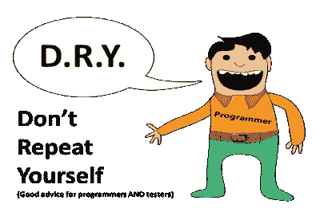](https://click.linksynergy.com/fs-bin/click?id=JVFxdTr9V80&subid=0&offerid=562016.1&type=10&tmpid=14538&RD_PARM1=https%3A%2F%2Fwww.udemy.com%2Fbasics-of-software-architecture-design-in-java%2F)*

*通过对两个不同的功能或事物使用标准代码，您将它们永远紧密地耦合在一起，当您的 OrderId 改变其格式时，您的 SSN 验证代码将会中断。*

*所以要小心这种耦合，不要组合任何使用相似代码但不相关的代码。你可以进一步查看 Udemy 上的 Java 课程中的 [**软件架构基础&设计模式**](https://click.linksynergy.com/fs-bin/click?id=JVFxdTr9V80&subid=0&offerid=562016.1&type=10&tmpid=14538&RD_PARM1=https%3A%2F%2Fwww.udemy.com%2Fbasics-of-software-architecture-design-in-java%2F) ，了解更多关于编写正确代码和设计系统时遵循的最佳实践。*

*<https://javarevisited.blogspot.com/2019/03/5-courses-programmers-can-join-to-learn.html?utm_source=dlvr.it&utm_medium=twitter> * 

## *2.封装什么变化*

*在软件领域只有一件事是不变的，那就是“变”，所以封装你预期或者怀疑将来会变的代码。*

> **这种 OOP 设计原则的好处是很容易测试和维护正确的封装代码。**

*如果你正在用 Java 编程，那么遵循这样的原则:默认情况下，将变量和方法设为私有，逐步增加访问权限，比如从个人到受保护的，而不是公共的。*

*[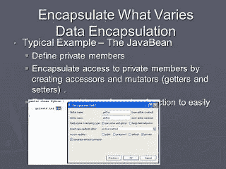](https://javarevisited.blogspot.com/2018/02/top-5-java-design-pattern-courses-for-developers.html)*

*Java 中的几个**设计模式使用了封装；[工厂设计模式](http://javarevisited.blogspot.com/2011/12/factory-design-pattern-java-example.html)是封装的一个例子，它封装了对象创建代码，并提供了在不影响现有代码的情况下引入新产品的灵活性。***

*顺便说一句，如果你有兴趣学习更多关于 Java 和面向对象编程中的设计模式，那么你一定要查看这个 [**设计模式库**](https://pluralsight.pxf.io/c/1193463/424552/7490?u=https%3A%2F%2Fwww.pluralsight.com%2Fcourses%2Fpatterns-library) 课程 Pluralsight。这是设计模式和如何在现实世界中使用它们的建议的最佳集合之一。*

*<https://pluralsight.pxf.io/c/1193463/424552/7490?u=https%3A%2F%2Fwww.pluralsight.com%2Fcourses%2Fpatterns-library> * 

## *3.开放封闭设计原则*

*根据这个 OOP 设计原则，“类、方法或函数应该对扩展(新功能)开放，对修改关闭。”*

*这是另一个漂亮可靠的设计原则，由 Bob 叔叔在他的经典 [**干净码本**](http://www.amazon.com/Clean-Code-Handbook-Software-Craftsmanship/dp/0132350882?tag=javamysqlanta-20) 上创造的，它防止有人改变已经尝试和测试过的代码。*

> **这种设计原则的主要好处是已经尝试和测试过的代码不会被触及，这意味着它们不会被破坏。**

*下面是一个 Java 代码示例，它违反了编程的开闭设计原则:*

*[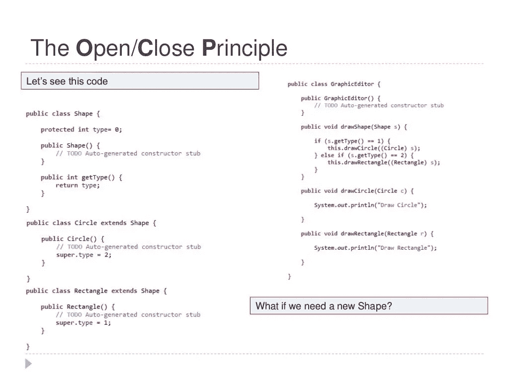](https://javarevisited.blogspot.com/2018/02/10-courses-to-prepare-for-programming-job-interviews.html)*

*在这段代码中，GraphicEditor 与 Shape 紧密耦合，如果您需要一个新的形状，那么您需要在`drawShape(Shape s)`方法中修改已经尝试和测试过的系统，这既容易出错，也不可取。*

*理想情况下，如果你只是添加新功能，那么你的代码应该被测试，这就是[开放封闭设计原则](http://javarevisited.blogspot.com/2011/11/great-example-of-open-closed-design.html)的目标。*

*顺便说一下，开闭原则是“O”从固体缩写。如果你想进一步了解这个原则，Udemy 上的 [**面向对象设计和架构的坚实原则**](https://click.linksynergy.com/deeplink?id=JVFxdTr9V80&mid=39197&murl=https%3A%2F%2Fwww.udemy.com%2Fsolid-principles-object-oriented-design-architecture%2F) 课程是最好的参考资源之一。*

*</javarevisited/top-10-object-oriented-analysis-and-design-interview-questions-and-problems-for-experienced-6c3a53b7cb26> * 

## *4.单一责任原则*

*单一责任原则是另一个可靠的设计原则，在可靠的首字母缩略词上代表“S”。按照 SRP，一个类的改变不应该有一个以上的原因，或者一个级别应该总是处理单一的功能。*

> *这个原则的主要好处是它减少了软件和代码的单个组件之间的耦合。*

*例如，如果你在 Java 的一个类中放入多个功能，它会在两个功能之间引入**耦合**，即使你改变一个功能，也有可能破坏耦合的功能，这需要另一轮测试来避免生产环境中的任何意外。*

*你可以进一步查看 Udemy 上的 [**从 0 到 1:设计模式— 24 个重要的**](https://click.linksynergy.com/fs-bin/click?id=JVFxdTr9V80&subid=0&offerid=323058.1&type=10&tmpid=14538&RD_PARM1=https%3A%2F%2Fwww.udemy.com%2Ffrom-0-to-1-design-patterns%2F) 课程，了解基于这一原则的模式。*

**

## *5.依赖注入或反转原理*

*不要求依赖；它将由框架提供给你。这在 [Spring 框架](http://www.java67.com/2017/11/top-5-free-core-spring-mvc-courses-learn-online.html)中得到了很好的实现，这是用于编写真正有价值的应用程序的最流行的 Java 框架之一。*

> **这一设计原则的美妙之处在于，由 DI 框架注入的任何类都易于使用模拟对象进行测试，并且更易于维护，因为对象创建代码集中在框架中，客户端代码不会因此而变得杂乱无章。**

*实现 [**依赖注入**](http://javarevisited.blogspot.com/2012/12/inversion-of-control-dependency-injection-design-pattern-spring-example-tutorial.html) 有多种方式，比如使用字节码插装，一些 AOP(面向方面编程)框架比如 AspectJ 就是这样做的，或者像 Spring 一样使用代理。*

*你可以进一步查看 Udemy 上的 [**面向对象设计和架构的坚实原则**](https://click.linksynergy.com/deeplink?id=JVFxdTr9V80&mid=39197&murl=https%3A%2F%2Fwww.udemy.com%2Fsolid-principles-object-oriented-design-architecture%2F) 课程来学习更多关于这个有用原则的知识。它也代表固体缩写词“D”。*

*下面是一个代码示例，它违反了 Java 中的依赖倒置原则或 DIP:*

*[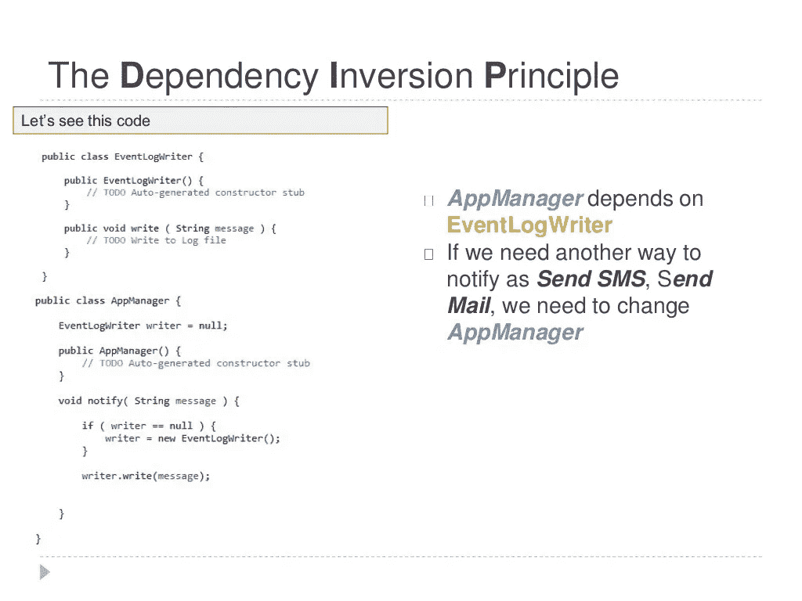](https://click.linksynergy.com/deeplink?id=JVFxdTr9V80&mid=39197&murl=https%3A%2F%2Fwww.udemy.com%2Fsolid-principles-object-oriented-design-architecture%2F)*

*你可以看到`AppManager` 依赖于`EventLogWriter` ，而`EventLogWriter` 与`AppManager`紧密耦合。如果您需要使用另一种方式通知您的客户端，比如发送推送通知、SMS 或电子邮件，您需要更改`AppManager` 类。*

*这个问题可以通过使用依赖倒置原则来解决，其中代替`AppManager` 请求`EventLogWriter`，它将由框架注入或提供给 AppManager。*

*你可以进一步看到[使用可靠的原则编写更好的代码 Udemy 上的速成课程](https://click.linksynergy.com/deeplink?id=JVFxdTr9V80&mid=39197&murl=https%3A%2F%2Fwww.udemy.com%2F1-hour-crash-course-using-solid-to-write-better-code%2F),学习更多关于依赖倒置原则和如何解决这类问题的知识。*

*<https://www.udemy.com/course/1-hour-crash-course-using-solid-to-write-better-code/?LSNPUBID=JVFxdTr9V80&ranEAID=JVFxdTr9V80&ranMID=39197&ranSiteID=JVFxdTr9V80-y0Qmzd2ILFMd4mpEfXBAwQ> * 

## *6.偏爱合成而非遗传*

*重用你已经写好的代码一般有两种方式，继承和复合；两者都有各自的优点和缺点，但是，一般来说，如果可能的话，您应该总是更喜欢组合而不是继承。*

> **有些人可能会反驳这一点，但我发现*<https://javarevisited.blogspot.com/2014/02/ifference-between-association-vs-composition-vs-aggregation.html#axzz5bnktTXS4>**比* [*继承*](http://javarevisited.blogspot.sg/2012/10/what-is-inheritance-in-java-and-oops-programming.html) *灵活得多。***

**通过在运行时设置属性，组合允许在运行时改变一个类的行为，通过使用接口来组合一个类，我们使用[多态](http://javarevisited.blogspot.com/2011/08/what-is-polymorphism-in-java-example.html)，这提供了在任何时候用更好的实现替换的灵活性。**

**甚至约书亚·布洛赫的 [**有效 Java**](https://www.amazon.com/Effective-Java-3rd-Joshua-Bloch/dp/0134685997/?tag=javamysqlanta-20) 也建议支持复合而不是继承。如果你仍然不相信，那么你也可以阅读[这里的](http://javarevisited.blogspot.sg/2015/06/difference-between-inheritance-and-Composition-in-Java-OOP.html)来了解更多关于为什么你的组合在重用代码和功能方面比继承更好。**

**如果你总是忘记这条规则，这里有一幅很棒的漫画可以放在你的办公桌上:-)**

****

**如果您有兴趣学习更多的面向对象编程概念，如组合、继承、关联、聚合等。，也可以看看 Coursera 上的[**Java 面向对象编程**](https://coursera.pxf.io/c/3294490/1164545/14726?u=https%3A%2F%2Fwww.coursera.org%2Fspecializations%2Fjava-programming) 课程。**

**探索和学习是免费的，但如果你也想参加练习、作业、评估，并需要认证以显示在你的 LinkedIn 个人资料中，你将被收费。**

**如果你觉得 Coursera 的课程有用，因为它们是由知名公司如谷歌、IBM、亚马逊和世界上最好的大学创建的，我建议你加入 Coursera 的订阅计划 [**Coursera Plus**](https://coursera.pxf.io/c/3294490/1164545/14726?u=https%3A%2F%2Fwww.coursera.org%2F)**

**这种单次订阅可以让你无限制地访问他们最受欢迎的**课程**、**专业**、**专业证书**和**指导项目**。它每年花费大约 399 美元，但它完全值得你的钱，因为你可以获得无限的证书。**

****

## **7.利斯科夫替代原理**

**根据 Liskov 替换原则，子类型必须可以替换超类型，我的意思是使用超类类型的方法或函数必须能够与子类的[对象](http://javarevisited.blogspot.com/2012/12/what-is-object-in-java-or-oops-example.html)一起工作，没有任何问题。**

**LSP 与**单一责任原则**和**界面分离原则**密切相关。**

> ***如果一个类比子类拥有更多的功能，那么子类可能不支持某些功能，并且违反 LSP。***

**为了遵循 [LSP 立体设计原则](https://click.linksynergy.com/deeplink?id=JVFxdTr9V80&mid=39197&murl=https%3A%2F%2Fwww.udemy.com%2Fsolid-principles-object-oriented-design-architecture%2F)，派生类或子类必须增强功能，而不是减少功能。LSP 代表实心首字母缩写词上的“L”。**

**下面是一个代码示例，它违反了 Java 中的 Liskov 替换原则:**

**[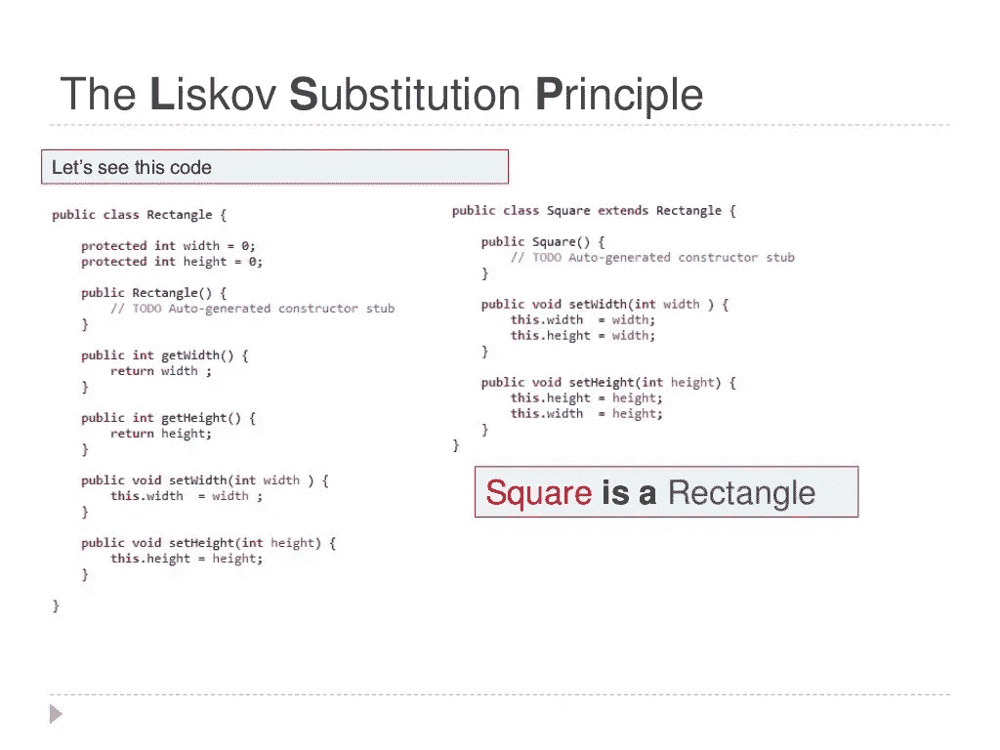](https://click.linksynergy.com/deeplink?id=JVFxdTr9V80&mid=39197&murl=https%3A%2F%2Fwww.udemy.com%2Fsolid-principles-object-oriented-design-architecture%2F)**

**Java 中的 Liskov 替换原理**

**如果你有一个方法`area(Rectangle r)`来计算矩形的面积，那么当你传递`Square` 时，代码将会中断，因为`Square` 并不是一个真正的矩形。**

**如果你对更真实的例子感兴趣，那么 Pluralsight 上的 [**面向对象设计的坚实原则**](https://pluralsight.pxf.io/c/1193463/424552/7490?u=https%3A%2F%2Fwww.pluralsight.com%2Fcourses%2Fprinciples-oo-design) 课程是一个很好的开始。**

**顺便说一句，你需要一个 Pluralsight 会员才能进入这个课程，费用大约是每月 29 美元或每年 299 美元(14%的折扣)。即使您没有会员资格，也可以免费参加本课程，方法是利用他们的 [**10 天免费试用期**](http://pluralsight.pxf.io/c/1193463/424552/7490?u=https%3A%2F%2Fwww.pluralsight.com%2Flearn) ，无需任何承诺，这不仅是免费参加本课程的好方法，也是在加入 Pluralsight 之前检查课程质量的好方法**

**<http://pluralsight.pxf.io/c/1193463/424552/7490?u=https%3A%2F%2Fwww.pluralsight.com%2Flearn> ** 

## **8.接口隔离原则(ISP)**

**接口分离原则规定，如果客户端不使用接口，就不应该实现接口[。](http://javarevisited.blogspot.com/2012/04/10-points-on-interface-in-java-with.html)**

**这种情况通常发生在一个界面包含多个功能，而客户端只需要一个特性而不需要其他特性的时候。**

**毫无疑问，界面设计是一项棘手的工作，因为一旦你发布了你的界面，你就不能在不破坏所有实现的情况下改变它。好吧，Java 8 的[默认或 defender 方法](https://javarevisited.blogspot.com/2014/07/default-defender-or-extension-method-of-Java8-example-tutorial.html#axzz5kO8vmDxy)特性确实提供了一种接口进化的方式，但是并不是所有的编程语言都支持这些特性。**

> **Java 中这种设计原则的另一个好处是，接口的缺点是在任何类可以使用它之前实现所有方法，因此单一功能意味着实现的方法更少。**

**如果你在编码中没有得到接口的好处，那么我建议你阅读我的博客文章，Java 中接口的真正用法。**

**[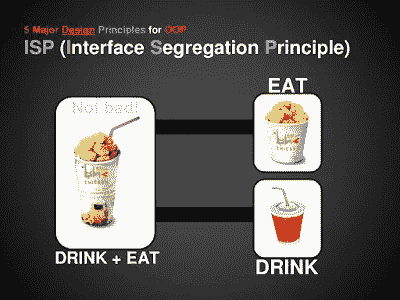](https://pluralsight.pxf.io/c/1193463/424552/7490?u=https%3A%2F%2Fwww.pluralsight.com%2Fcourses%2Fprinciples-oo-design)**

## **9.为接口而非实现编程**

**程序员应该总是为接口而不是为实现而编程；这个将导致灵活的代码，它可以与接口的任何新实现一起工作。**

**具体来说，你应该在变量上使用接口类型，方法的返回类型，或者在 Java 中使用技术的参数类型——比如使用`SuperClass` 类型来存储对象，而不是使用`SubClass`。**

**(解释或更正刚说过的话)我是说**

**`List numbers= getNumbers();`**

**代替**

**`ArrayList numbers = getNumbers();`**

**这一点在很多 Java 书中也有建议，包括在 [**有效 Java**](https://www.amazon.com/Effective-Java-3rd-Joshua-Bloch/dp/0134685997/?tag=javamysqlanta-20) 和[**Head First design pattern**](http://www.amazon.com/dp/0596007124/?tag=javamysqlanta-20)书中。**

**下面是一个用 Java 编写接口代码的例子:**

**[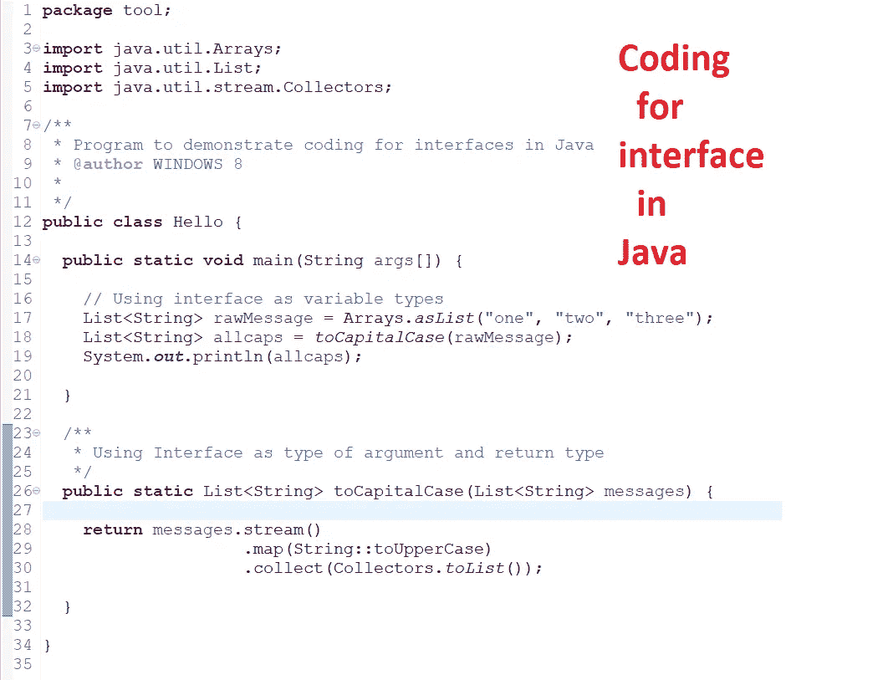](https://javarevisited.blogspot.com/2018/08/5-object-oriented-programming-and-design-courses-for-Java-programmers.html)**

**如果你对提高程序的代码质量感兴趣，我也建议你看一下 Udemy 上的 [**重构设计模式**](https://click.linksynergy.com/deeplink?id=JVFxdTr9V80&mid=39197&murl=https%3A%2F%2Fwww.udemy.com%2Frefactoring-to-patterns%2F) 课程，它将帮助你用 C#中的重构技术和设计模式来改进内部设计**

## **10.授权原则**

**不要一个人做所有的事情，把它委派给各自的班级。委托设计原则的经典例子是 Java 中的 [equals()和 hashCode()方法。](http://javarevisited.blogspot.com/2011/02/how-to-write-equals-method-in-java.html)**

> ***为了比较两个对象是否相等，我们要求类本身进行比较，而不是由* `*Client*` *类进行检查。***

**这种设计原则的主要好处是**没有重复代码**并且很容易修改行为。事件委托是这一原则的另一个例子，其中事件被委托给处理程序进行处理。**

**[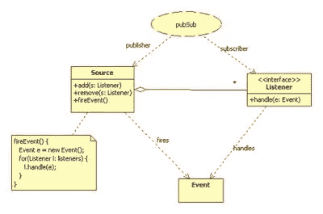](https://javarevisited.blogspot.com/2019/11/top-5-courses-to-learn-c-sharp-in.html)**

## **摘要**

**所有这些**面向对象的设计原则**通过努力实现高内聚和低耦合来帮助你编写灵活且更好的代码。**

**理论是第一步，但最重要的是*培养发现何时应用这些设计原则的能力*。**

**一旦掌握了这一点，下一步就是学习 Java 中的设计模式，Java 使用这些设计模式来解决应用程序开发和软件工程中的常见问题。**

**如果你正在寻找一门好的课程，我建议你参加 Udemy 上的 [**从 0 到 1:设计模式——24 个重要的 Java 课程。它非常全面，你可以在他们的几个 flash 销售中只花 11 美元就能买到。**](https://click.linksynergy.com/fs-bin/click?id=JVFxdTr9V80&subid=0&offerid=323058.1&type=10&tmpid=14538&RD_PARM1=https%3A%2F%2Fwww.udemy.com%2Ffrom-0-to-1-design-patterns%2F)**

**无论如何，这里是所有这些 OOP 设计原则的一个很好的总结。**

**[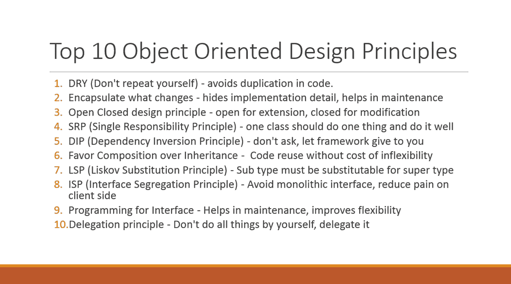](https://hackernoon.com/10-oop-design-principles-every-programmer-should-know-f187436caf65)**

**找出我们是否违反了任何设计原则并损害了代码的灵活性，但同样，在这个世界上没有什么是完美的，不要总是试图用**设计模式和设计原则来解决问题；他们大多是维护周期较长的大型企业项目。****

**底线是，专业程序员应该总是努力实现高度内聚和松散耦合的解决方案、代码或设计。查看 Apache 和 Google 的开源代码是学习 [Java](http://www.java67.com/2018/08/top-10-free-java-courses-for-beginners-experienced-developers.html) 和 [OOP 设计原则](https://javarevisited.blogspot.com/2018/07/10-object-oriented-design-principles.html)的好方法。**

**他们将向你展示如何在编码和 Java 程序中使用设计原则。Java 开发工具包遵循许多设计原则，如`BorderFactory` 类中的[工厂模式](http://javarevisited.blogspot.sg/2011/12/factory-design-pattern-java-example.html#axzz51cvxH5kW)、`java.lang.Runtime`类中的[单例模式](https://javarevisited.blogspot.com/2014/05/double-checked-locking-on-singleton-in-java.html)、各种`java.io`类中的[装饰模式](http://www.java67.com/2013/07/decorator-design-pattern-in-java-real-life-example-tutorial.html)。**

**如果你对学习面向对象的原则和模式感兴趣，那么你可以看看我的另一个个人最爱[**Head First Object-Oriented Analysis and Design**](http://www.amazon.com/dp/0596008678/?tag=javamysqlanta-20)，这是一本优秀的书，也可能是面向对象分析和设计方面最好的材料**

**[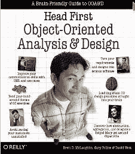](http://www.amazon.com/dp/0596008678/?tag=javamysqlanta-20)**

**没有多少程序员知道这本书，因为它经常被它更受欢迎的表亲[Eric Freeman](https://www.amazon.com/Head-First-Design-Patterns-Brain-Friendly/dp/0596007124/?tag=javamysqlanta-20)的 Head First Design Pattern[所遮蔽，这本书更多的是关于如何将这些原则结合起来创建一个可以直接用来解决已知问题的模式。](https://medium.com/u/96a4ff006e35?source=post_page-----f187436caf65----------------------)**

**[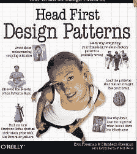](https://www.amazon.com/Head-First-Design-Patterns-Brain-Friendly/dp/0596007124/?tag=javamysqlanta-20)**

**这些书对编写更好的代码很有帮助，充分利用了各种面向对象和可靠的设计原则。顺便说一句，如果你真的对 Java 编码实践更感兴趣，那么请阅读 Joshua Bloch 的 [**Effective Java 第三版**](https://www.amazon.com/Effective-Java-3rd-Joshua-Bloch/dp/0134685997/?tag=javamysqlanta-20) ，这是编写 Java 集合 API 的人的杰作。**

**如果您想了解更多关于固体设计原则的知识，这里有一些有用的资源供您参考:**

1.  **[干净的代码](http://www.amazon.com/Clean-Code-Handbook-Software-Craftsmanship/dp/0132350882?tag=javamysqlanta-20)由[罗伯特·马丁](https://medium.com/u/ffa32c7b39eb?source=post_page-----f187436caf65----------------------)**
2.  **[面向对象设计的坚实原则](https://pluralsight.pxf.io/c/1193463/424552/7490?u=https%3A%2F%2Fwww.pluralsight.com%2Fcourses%2Fprinciples-oo-design)**
3.  **[面向对象设计和架构的坚实原理](https://click.linksynergy.com/deeplink?id=JVFxdTr9V80&mid=39197&murl=https%3A%2F%2Fwww.udemy.com%2Fsolid-principles-object-oriented-design-architecture%2F)**
4.  **[马丁·福勒的《重构》](http://www.amazon.com/Refactoring-Improving-Design-Existing-Code/dp/0201485672?tag=javamysqlanta-20)**

**如果你喜欢这篇文章， 您可能也喜欢这些 **Java 和编程文章**:
[Java 程序员 2023 年应该学习的 10 件事](https://javarevisited.blogspot.com/2017/12/10-things-java-programmers-should-learn.html#axzz5atl0BngO)
[每个程序员都必须阅读的 10 本书](http://www.java67.com/2015/03/10-books-every-programmer-and-software-engineer-read.html)
[提高编程技能的 10 个技巧](http://javarevisited.blogspot.sg/2014/01/10-tips-to-improve-programming-skill-become-better-programmer.html#axzz553pz1hYh)
[每个软件开发人员都应该知道的 10 个工具](http://javarevisited.blogspot.sg/2018/01/10-tools-every-software-developer-know.html#axzz559dyoLSA)
[深入学习软件架构的 5 门课程](https://javarevisited.blogspot.com/2019/03/5-courses-programmers-can-join-to-learn.html#axzz5jKqbGRcg)
[Java 程序员应该知道的 20 个库和 APIS](https://javarevisited.blogspot.com/2018/01/top-20-libraries-and-apis-for-java-programmers.html)**

**感谢阅读这篇文章。如果你觉得这些面向对象的设计原则有用，那么请与你的朋友和同事分享。如果您有任何问题或反馈，请留言。**

**顺便说一句，如果你购买我推荐的任何书籍或课程，我也会得到报酬。**

**如果你喜欢这篇文章，那么请考虑在 medium ( [javinpaul](https://medium.com/u/bb36d8439904?source=post_page-----f187436caf65----------------------) )上关注我，如果你想在每篇新帖子上得到通知，不要忘记在 Twitter 上关注**[**javarevisited**](https://twitter.com/javarevisited)！****

*****附:如果你对你的编码很认真，并且想提高你的编码技能，没有比* [***更好的书了***](http://www.amazon.com/Clean-Code-Handbook-Software-Craftsmanship/dp/0132350882?tag=javamysqlanta-20) *作者* [*罗伯特·马丁*](https://medium.com/u/ffa32c7b39eb?source=post_page-----f187436caf65----------------------) *和**[***作者***](http://www.amazon.com/Refactoring-Improving-Design-Existing-Code/dp/0201485672?tag=javamysqlanta-20) **[重构](https://medium.com/u/8cc65672c5d?source=post_page-----f187436caf65----------------------)** *去看看吧。******

*****</javarevisited/clean-code-a-must-read-coding-book-for-programmers-9dc80494d27c> *****