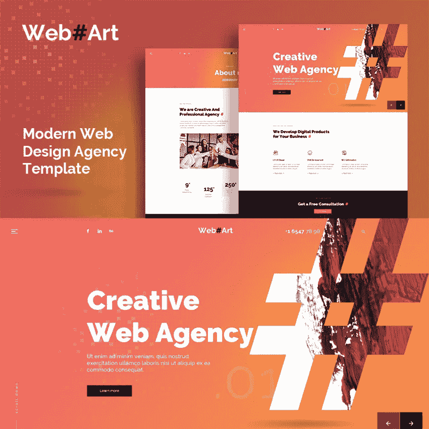
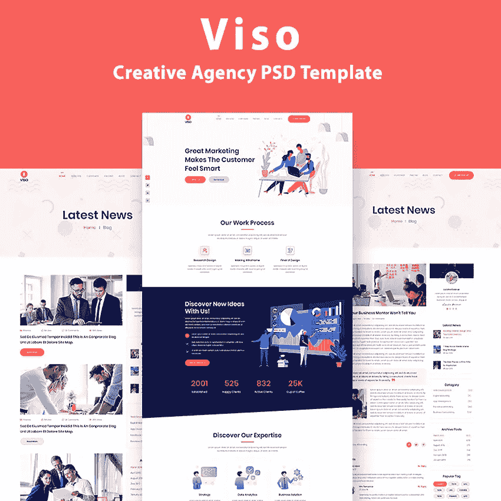
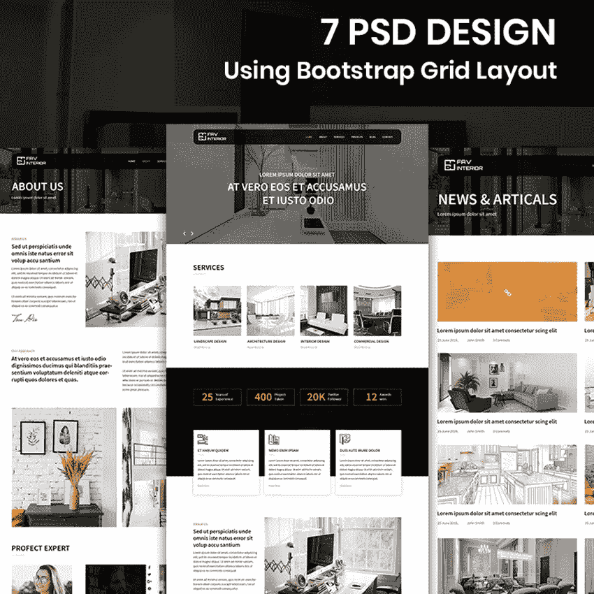
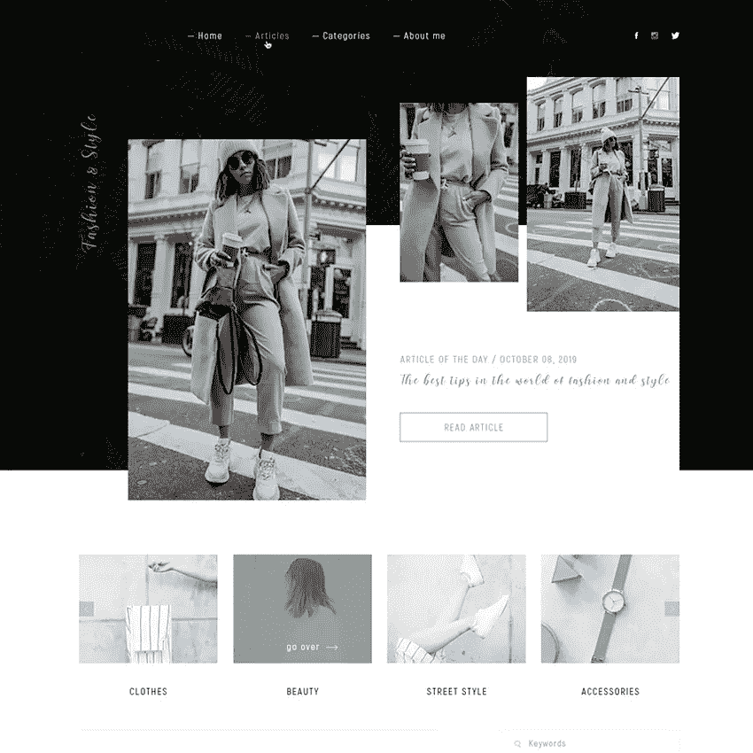
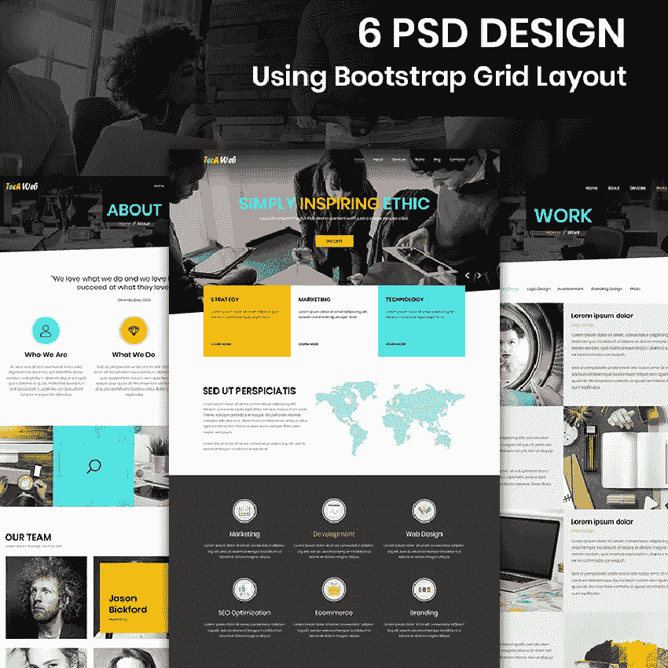
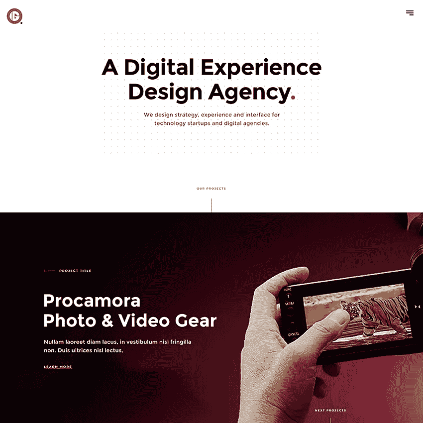
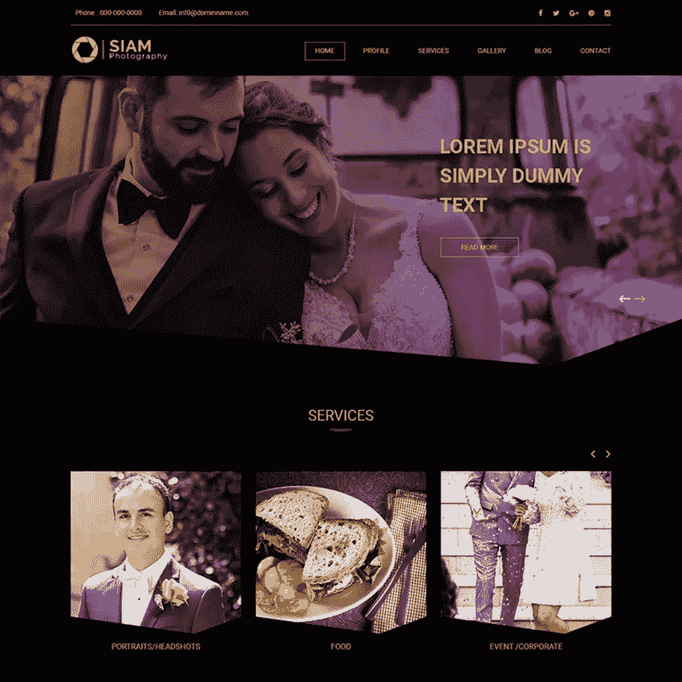
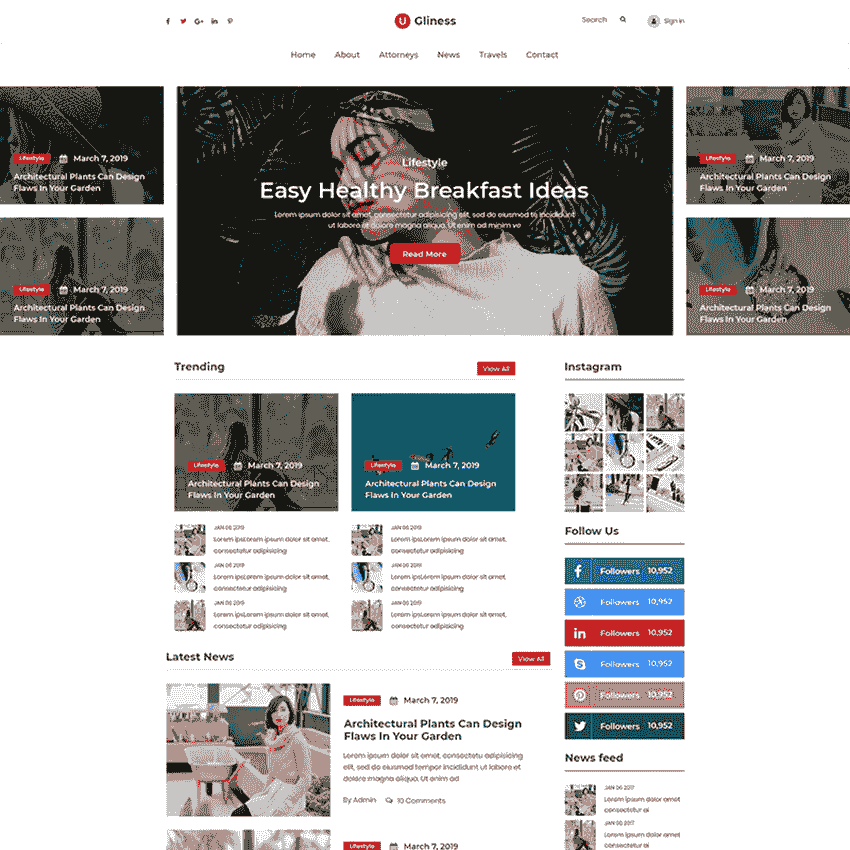

# 10 个 Photoshop 网站模板，用于推广您的摄影和设计服务

> 原文：<https://medium.com/javarevisited/10-photoshop-website-templates-to-promote-your-photography-and-design-services-c289fd18a78e?source=collection_archive---------1----------------------->

你有没有想到在网上展示你的摄影或设计服务？对于对编程一无所知的人来说，这可能是一个挑战。然而，如果你求助于一些神奇的 Photoshop 网站模板，你可以建立一个完美的在线形象。

当你在这些现成的解决方案中有了理想的选择，就有可能带来你品牌的视觉表现。你如何为你的特殊需求选择最好的选项？只关注你需要突出的东西。想想你想让这些东西引起注意的方式。

下面，你将找到 **10 个 Photoshop 网站模板**。感谢他们的高级包，你会得到大量的必备工具。根据你的愿景和目的来修改他们的外表是毫不费力的。现在，准备好探索这个小集合，选择一些能打动你的观众的东西…

# WebArt

[**更多详情**](https://www.templatemonster.com/psd-templates/webart-web-design-simple-creative-psd-template-89651.html?aff=javarevisited&utm_campaign=photoshop_templates&utm_source=javarevisited&utm_medium=referral)

这个 Photoshop 的创意模板非常适合多种用途。例如，它可以推广那些提供网页设计和数字营销服务的公司。如您所知，它提供了完全可定制的特性。这意味着你可以自由地修改你的在线项目的所有部分，使之符合你的设想。

## 主要特点:

*   一个主页变体；
*   八内页；
*   下拉菜单；
*   谷歌字体；
*   全层 PSD 文件。

# 促进

[**更多详情**](https://www.templatemonster.com/psd-templates/social-marketing-psd-template-95534.html?aff=javarevisited&utm_campaign=photoshop_templates&utm_source=javarevisited&utm_medium=referral)

查看从最引人注目的社交营销 Photoshop 网站模板集合中选择的 PSD 模板。除此之外，展示你的初创公司或软件产品也是一个完美的选择。它还具有易于编辑的特性。做出所有必要的改变，用你的在线项目形象给你的目标观众留下深刻印象是可能的。

## 主要特点:

*   14 层 PSD 文件；
*   结构良好的层；
*   一个主页变体；
*   新闻和订单页面；
*   帐户设置页面。

# VISO

[**更多详情**](https://www.templatemonster.com/psd-templates/viso-one-page-creative-agency-psd-template-94094.html?aff=javarevisited&utm_campaign=photoshop_templates&utm_source=javarevisited&utm_medium=referral)

一个现代设计的 Photoshop 模板，可以推广不同的业务类型。你可以很容易地展示你的创业，创建一个视觉上有吸引力的投资组合，以及做其他事情。它有一个简约的外观设计，允许突出所有重要的信息。毫无疑问，你将有机会修改它的设计，改变各种元素。

## 主要特点:

*   基于自举；
*   全响应设计；
*   组织良好的层次；
*   非常适合创意机构；
*   人性化。

# Fav 内部

[**更多详情**](https://www.templatemonster.com/psd-templates/fav-interior-interior-design-company-psd-template-88641.html?aff=javarevisited&utm_campaign=photoshop_templates&utm_source=javarevisited&utm_medium=referral)

您是否正在寻找一些先进的 PSD 设计模板来推广您的室内设计公司？在这种情况下，您可能有兴趣熟悉这个优雅的变体。对于那些需要个性化品牌和增加客户数量的人来说，这是正确的选择。高度可定制的设计允许以易于使用的方式改变各种元素。

## 主要特点:

*   内页不同；
*   基于自举；
*   组织良好的层次；
*   包括智能对象；
*   可调整大小和可移除的元素。

# 时尚与风格

[**更多详情**](https://www.templatemonster.com/psd-templates/fashion-style-psd-template-88344.html?aff=javarevisited&utm_campaign=photoshop_templates&utm_source=javarevisited&utm_medium=referral)

有大量的 Photoshop 网站模板与时尚和风格等利基相关联。我们从 PSD 设计模板列表中选择了一个完美的现成解决方案。对于那些需要就此类热门话题创建一个与众不同的博客的人来说，这是一个绝佳的选择。定制这种变体并确保你的在线项目给你最大数量的读者并不需要花费什么。

## 主要特点:

*   主页；
*   文章页面；
*   极简设计；
*   组织良好的层次；
*   智能物体。

# 技术网站

[**更多详情**](https://www.templatemonster.com/psd-templates/tech-web-web-design-company-psd-template-87673.html?aff=javarevisited&utm_campaign=photoshop_templates&utm_source=javarevisited&utm_medium=referral)

在各种 Photoshop 网页设计模板中找到最合适的现成解决方案可能很有挑战性。然而，如果你转向这种时尚的变体，一切都会变得更容易。您将有机会定制您的在线项目的外观，并显示您的代理机构的所有细节。此外，包装中还包括许多形状。您可以调整它们的大小或删除它们。

## 主要特点:

*   组织良好的层次；
*   多个内页；
*   基于自举；
*   为任何平台转换它的机会；
*   智能物体。

# 艾伦摄影

[**更多详情**](https://www.templatemonster.com/psd-templates/ellen-s-photography-psd-template-87101.html?aff=javarevisited&utm_campaign=photoshop_templates&utm_source=javarevisited&utm_medium=referral)

这个令人惊叹的摄影 Photoshop 模板可能会打动你的想象力，增加你的客户数量。它非常适合所有摄影相关的目的，需要得到一个引人入胜的组合。你可以定制你的投资组合的外观，并确保它体现你的个性。它也有一个令人印象深刻的主页，会在一瞬间吸引人们到你的网站。

## 主要特点:

*   六个独特的页面(展示你的婚礼、自然和肖像摄影)；
*   相关图像；
*   图层样式；
*   谷歌字体；
*   组织良好的 PSD 文件。

# 创新机构

[**更多详情**](https://www.templatemonster.com/psd-templates/82405.html?aff=javarevisited&utm_campaign=photoshop_templates&utm_source=javarevisited&utm_medium=referral)

Innota Agency 是一个多功能主题，结合了所有必要的选项，使您的机构更容易访问。它极简主义的外观设计使人们有可能将注意力集中在你的业务上。完全灵活的性质将允许您个性化您的在线项目。通过这种方式，你可以传递你的信息，并吸引更多人关注你的服务。

## 主要特点:

*   32 个 PSD 文件；
*   组织良好的层次；
*   各种交互元素(按钮、文本、菜单等)；
*   谷歌字体；
*   完全分层的文件。

# 暹罗摄影

[**更多详情**](https://www.templatemonster.com/psd-templates/81140.html?aff=javarevisited&utm_campaign=photoshop_templates&utm_source=javarevisited&utm_medium=referral)

另一个令人难以置信的变体选自最具吸引力的摄影 PSD 模板集合。这是一个现成的自适应解决方案，允许呈现您的肖像，自然和婚纱摄影。您可以使用大量自定义选项。包装中包含许多形状。您可以以最合适的方式排列它们、调整它们的大小或删除它们。

## 主要特点:

*   基于自举；
*   组织良好的 PSD 文件；
*   智能对象；
*   为任何平台转换它的机会；
*   令人印象深刻的主页风格。

# 丑陋

[**更多详情**](https://www.templatemonster.com/psd-templates/80939.html?aff=javarevisited&utm_campaign=photoshop_templates&utm_source=javarevisited&utm_medium=referral)

需要熟悉一些给人印象深刻的为新闻和杂志主题设计的 Photoshop 网站模板吗？在这种情况下，如果您检查出这个显著的变体，那就太好了。它具有易于定制的特性。这意味着你不需要成为 Adobe Photoshop 的专家来做所有的改变。

## 主要特点:

*   四个 PSD 文件；
*   图层样式；
*   谷歌字体；
*   全响应设计；
*   PSD 命名的层和组。

## 总结

如果你选择这些 Photoshop 网站模板中的一个，你将会为自己节省很多精力。不需要投入一大笔钱，感谢他们。然而，它们总能成为你在线项目的重要基础。

这样就有可能在摄影和设计服务方面实现你的想法。

我们希望你已经设法在这些选择中找到一些东西。感谢阅读！