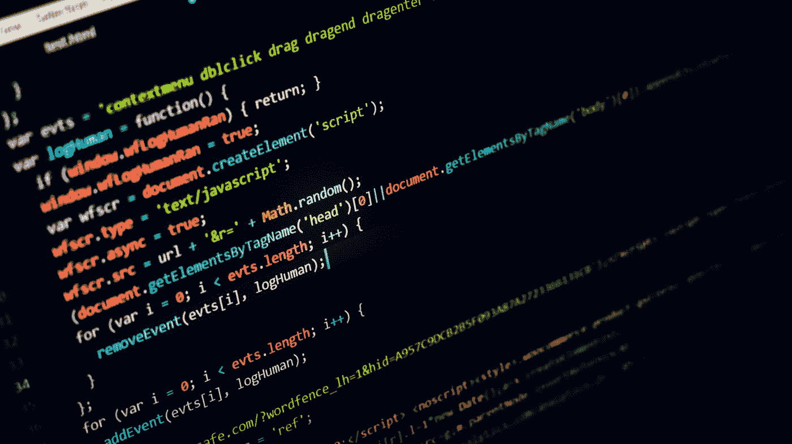

# 您应该阅读的 10 篇 Python 文章和教程

> 原文：<https://medium.com/javarevisited/10-python-articles-programmers-should-read-c64f4725d968?source=collection_archive---------0----------------------->

## 面向程序员和软件开发人员的最佳 Python 文章和教程的精选列表。

照片由[德拉诺尔 S](https://unsplash.com/@dlanor_s?utm_source=medium&utm_medium=referral) 在 [Unsplash](https://unsplash.com?utm_source=medium&utm_medium=referral)

大家好，很久没有在这里写东西了，所以我带着另一篇策划好的文章回来了。你可能想知道 [Python](/javarevisited/10-best-python-3-courses-on-udemy-ddd4e3ec5dbf) 在专注于 [Java](/javarevisited/15-best-udemy-courses-programmers-can-buy-on-black-friday-and-cyber-monday-2020-a803874f41d9) 的出版物中做什么。好吧，你怀疑它是否有充分根据，但是 Python 是一个非常棒的工具，不仅许多 Java 开发人员知道 Python，而且他们中的许多人也在学习它。

这是一个很棒的[脚本工具](/javarevisited/10-best-java-development-tools-you-can-learn-66f7d4d837e6)，用于自动化你的日常任务，这对于 Java 来说是不容易做到的，同时也让你成为一个通晓多种语言的程序员，这是每个人都喜欢的。

如果你不相信为什么 Java 开发人员应该学习 Python，我建议你先阅读我的文章— [学习 Python 的 10 个理由](https://javarevisited.blogspot.com/2018/05/10-reasons-to-learn-python-programming.html)。

 [## 学习 Python 编程语言的 10 个理由

### 如果你是这个博客的常客，那么你可能会奇怪，为什么我要写博客告诉人们…

javarevisited.blogspot.com](https://javarevisited.blogspot.com/2018/05/10-reasons-to-learn-python-programming.html) 

无论如何，这是我列出的一些有用的 Python 文章，你可以在这个周末阅读—

# 十大 Python 课程、教程和认证——javinpaul[的最佳作品](https://medium.com/u/bb36d8439904?source=post_page-----c64f4725d968--------------------------------)

如果你刚刚开始学习 Python 或者想在今年学习 Python，那么你应该首先阅读这篇文章。它为初学者和中级开发人员提供了一些最好的 Python 课程、教程和认证。

 [## 10 大 Python 课程、教程和认证——最好的

### 7 门能让你立刻学会编码的最好课程

medium.com](/better-programming/top-5-courses-to-learn-python-in-2018-best-of-lot-26644a99e7ec) 

顺便说一句，如果你想学习 Python 并且在这里寻找一些推荐，那么我建议你加入 Udemy 网站上何塞·波尔蒂利亚的 [**完整的 Python 训练营:从零到英雄**](https://click.linksynergy.com/deeplink?id=JVFxdTr9V80&mid=39197&murl=https%3A%2F%2Fwww.udemy.com%2Fcomplete-python-bootcamp%2F)

 [## 完整的 Python 训练营:学习 Python 编程和代码

### 这是 Udemy 上最全面、最直接的 Python 编程语言课程！你是否…

click.linksynergy.com](https://click.linksynergy.com/deeplink?id=JVFxdTr9V80&mid=39197&murl=https%3A%2F%2Fwww.udemy.com%2Fcomplete-python-bootcamp%2F) 

此外，如果你需要一个互动的教程兼课程，那么 Codecademy 上的 [**Python 3 课程**](https://click.linksynergy.com/deeplink?id=JVFxdTr9V80&mid=44188&murl=https%3A%2F%2Fwww.codecademy.com%2Flearn%2Flearn-python-3&LSNSUBSITE=TEST) 也是一个很好的选择，它包含 25 个多小时的互动学习材料、测验和评估测试。顺便说一句，如果我买这两门课中的任何一门，我也会得到报酬。

 [## 学习 Python 3 | Codecademy

### 学习世界上最流行的编程语言的最新和最棒的版本！

click.linksynergy.com](https://click.linksynergy.com/deeplink?id=JVFxdTr9V80&mid=44188&murl=https%3A%2F%2Fwww.codecademy.com%2Flearn%2Flearn-python-3&LSNSUBSITE=TEST) 

# Python 在网飞由[网飞科技博客](https://medium.com/u/c3aeaf49d8a4?source=post_page-----c64f4725d968--------------------------------)

我相信你已经听说过网飞，很有可能你甚至已经看过几个节目。如果你是一名程序员，想知道 Python 在网飞是如何使用的，这篇文章将会给你一些启示，这是一篇周末阅读的完美文章。

 [## 网飞的 Python

### 由网飞的皮托尼斯塔斯编著，阿姆吉斯·拉曼努贾姆协调，艾伦·利文古德编辑

medium.com](/netflix-techblog/python-at-netflix-bba45dae649e) 

# Parul Pandey 用 Python 加速数据分析的 10 个简单技巧

Python 编程语言是一种分析数据的神奇工具，但如果你知道一些简单的技巧，它会更好。本文将教您如何使用 Python 轻松进行数据分析。

 [## 用 Python 加速数据分析的 10 个简单技巧

### 提示和技巧，尤其是在编程领域，非常有用。有时候一点小小的改变既能节省时间，又能…

towardsdatascience.com](https://towardsdatascience.com/10-simple-hacks-to-speed-up-your-data-analysis-in-python-ec18c6396e6b) 

# 36 个令人惊叹的 Python 开源项目由 [Mybridge](https://medium.com/u/68abb2e6c9bb?source=post_page-----c64f4725d968--------------------------------)

参与 Python 开源项目不仅是提高 Python 编程技能的好方法，也是树立权威的好方法。如果你想投稿，这里有一些很棒的 Python 开放课程项目。

 [## 36 个令人惊叹的 Python 开源项目

### 在过去的一年里，我们比较了近 5000 个开源 Python 项目，并选出了前 36 个。

medium.mybridge.co](https://medium.mybridge.co/36-amazing-python-open-source-projects-v-2019-2fe058d79450) 

# 朱庇特实验室:朱庇特笔记本的进化

本文很好地概述了 JupyterLab，Jupyter Notebook 的下一代，Python 程序员最流行的 IDE 之一。

 [## 朱庇特实验室:朱庇特笔记本的进化

### 为了给更好的东西让路，所有美好的事情都会结束。

towardsdatascience.com](https://towardsdatascience.com/jupyter-lab-evolution-of-the-jupyter-notebook-5297cacde6b) 

# 用 Python 到底能做什么？以下是 Python 的 3 个主要应用。由 [YK 杉](https://medium.com/u/539e9e1c30df?source=post_page-----c64f4725d968--------------------------------)

如果你仍然对学习 Python 犹豫不决，不确定你能用 Python 做什么，那么这篇文章将会消除你的疑虑。

 [## 用 Python 到底能做什么？以下是 Python 的 3 个主要应用。

### Python 最常见的应用有:web 开发、脚本编写、机器学习、数据分析/数据…

medium.com](/free-code-camp/what-can-you-do-with-python-the-3-main-applications-518db9a68a78) 

# 50+数据结构与算法 [javinpaul](https://medium.com/u/bb36d8439904?source=post_page-----c64f4725d968--------------------------------) 为程序员准备的面试问题

我的另一篇文章包含了一些常见的编码问题，你可以用 Python 解决这些问题来构建你的编程逻辑和编码意识。

 [## 50+数据结构和算法程序员面试问题

### 有很多计算机科学毕业生和程序员申请编程、编码和软件…

medium.com](/hackernoon/50-data-structure-and-algorithms-interview-questions-for-programmers-b4b1ac61f5b0) 

# 如何用 Python 和 BeautifulSoup 抓取网站[贾斯汀·耶克](https://medium.com/u/bb0a08e70dc6?source=post_page-----c64f4725d968--------------------------------)

您会惊讶地发现，使用 Python 和 BeautifulSoup(完美的文章)来浏览 Python 编程在现实世界中的潜力是多么容易。

 [## 如何用 Python 和 BeautifulSoup 刮网站

### 互联网上的信息比任何人一生所能吸收的都多。你需要的不是接近那个…

medium.com](/free-code-camp/how-to-scrape-websites-with-python-and-beautifulsoup-5946935d93fe) 

# 由 [javinpaul](https://medium.com/u/bb36d8439904?source=post_page-----c64f4725d968--------------------------------) 提供的 5 门免费学习 Python 的课程

学习 Python 的一些免费在线课程的精选列表。

 [## 5 门免费 Python 课程，供初学者在线学习

### 学习 Python 的一些免费在线课程的精选列表。

medium.com](/swlh/5-free-python-courses-for-beginners-to-learn-online-e1ca90687caf) 

而且，如果你不介意花钱学习像 Python 这样有价值的东西，那么你也可以看看我定期向所有想学习 Python 的人推荐的这两门课程:

1.  [**何塞·波尔蒂利亚完成 Python 3 boot camp**](https://click.linksynergy.com/deeplink?id=JVFxdTr9V80&mid=39197&murl=https%3A%2F%2Fwww.udemy.com%2Fcomplete-python-bootcamp%2F)
2.  [**CodeCademy 上的 Python 3 互动课程**](https://click.linksynergy.com/deeplink?id=JVFxdTr9V80&mid=44188&murl=https%3A%2F%2Fwww.codecademy.com%2Flearn%2Flearn-python-3&LSNSUBSITE=TEST)
3.  [**Python 为大家特殊化上 Coursera**](https://coursera.pxf.io/c/3294490/1164545/14726?u=https%3A%2F%2Fwww.coursera.org%2Fspecializations%2Fpython)

这就是你这个周末可以阅读的一些最好的 Python 文章和教程。如果你有任何其他你认为 Python 程序员应该阅读的有趣的文章，请随意与我们分享。

祝你周日愉快。