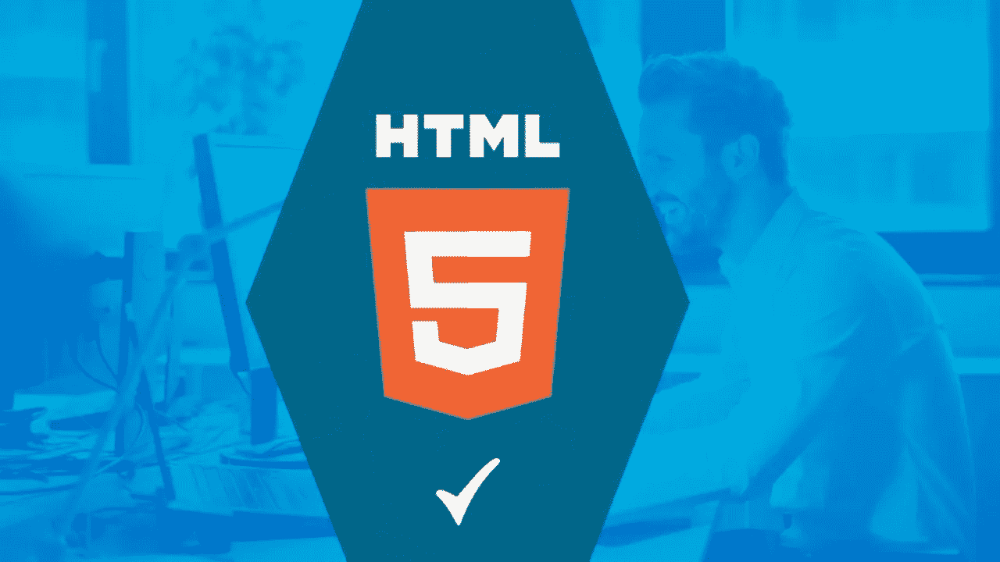
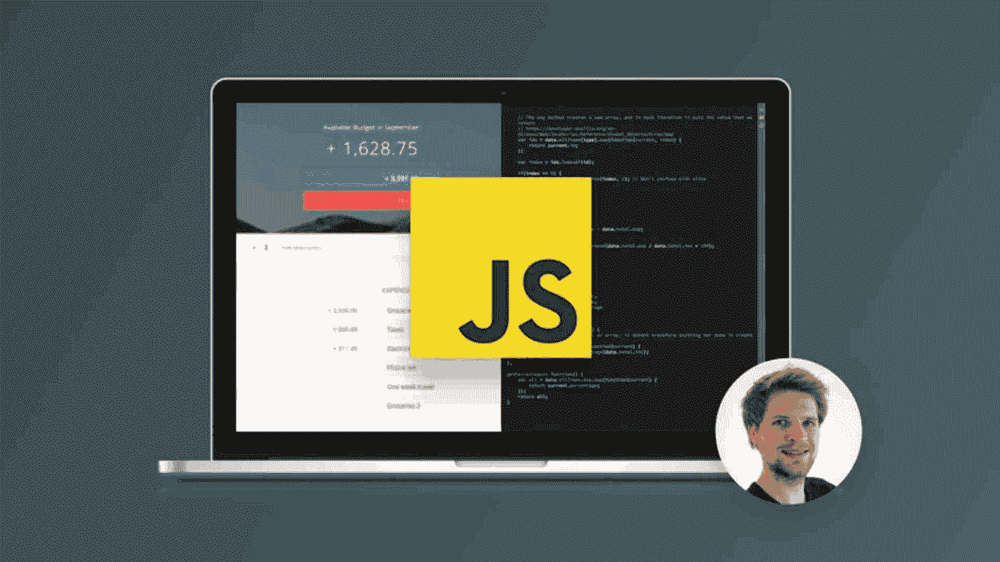
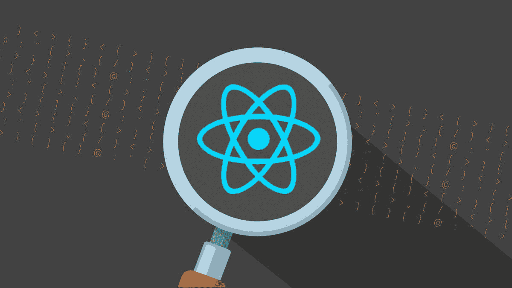
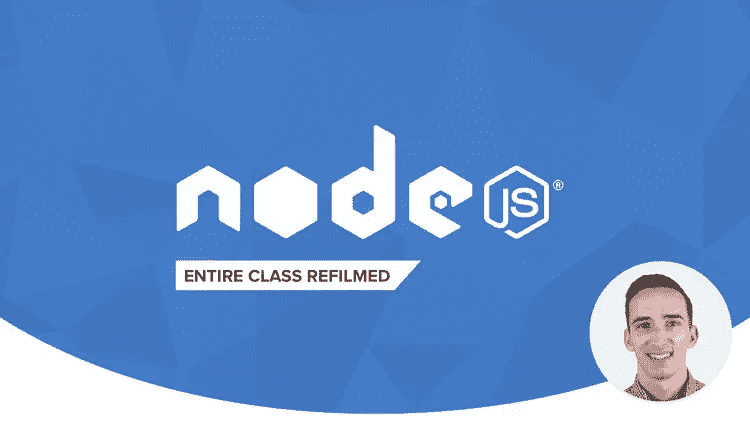
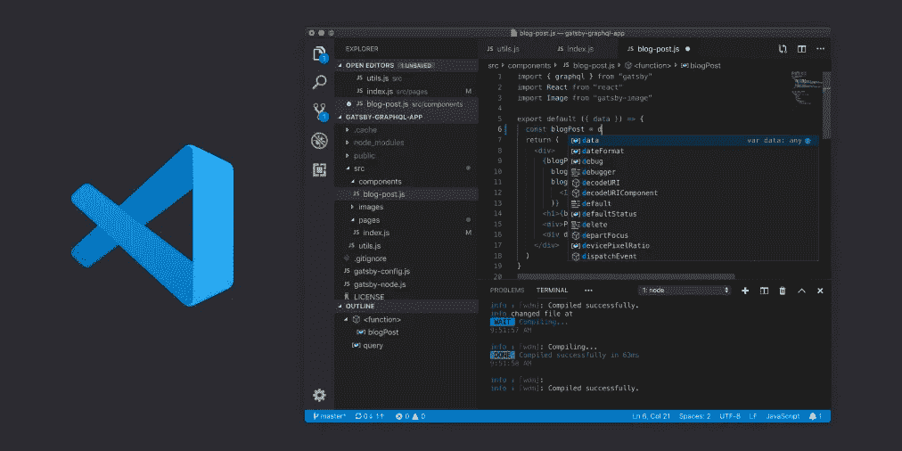
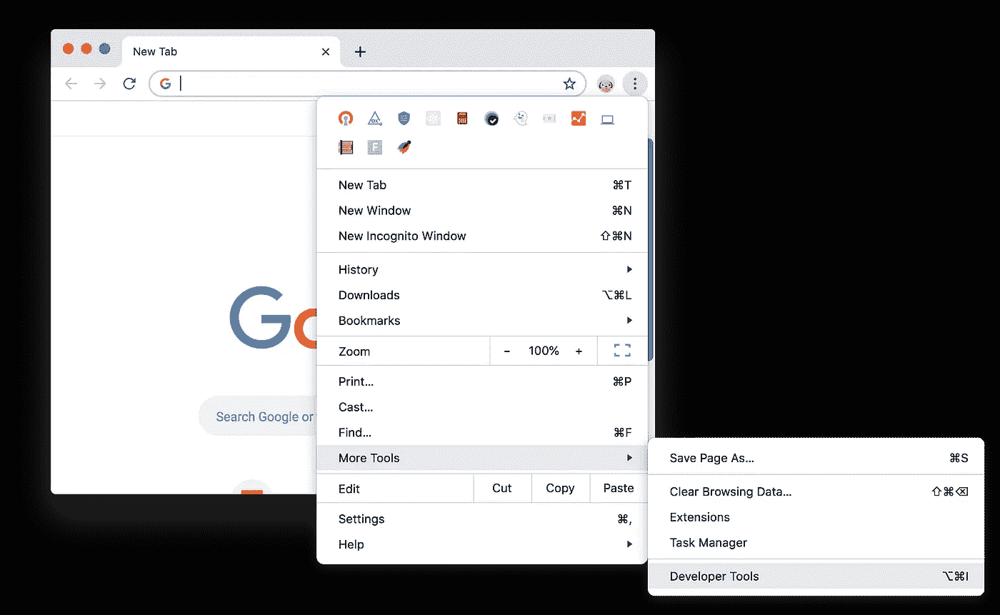
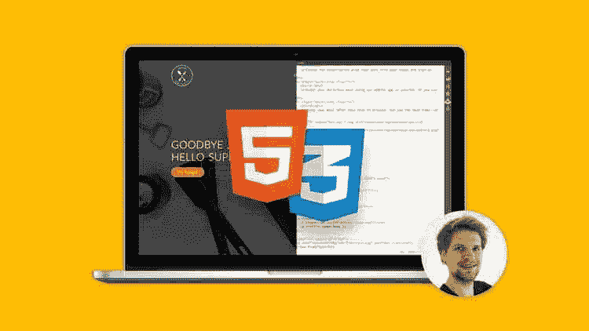
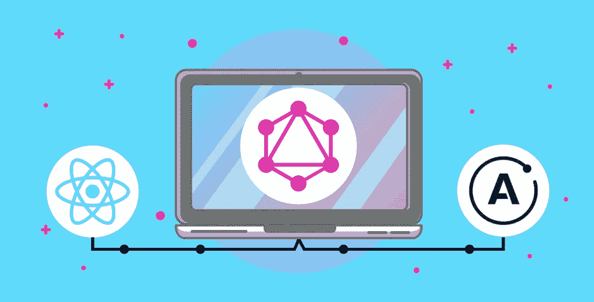

# 2023 年网络开发者应该学会的 10 件事

> 原文：<https://medium.com/javarevisited/10-things-aspiring-web-developers-should-learn-in-2021-6747bfbfc12e?source=collection_archive---------0----------------------->

## 2023 年成为专业网站开发者需要学习的 10 件重要事情，并提供相关资源链接。

图像鸣谢—未提取

伙计们，如果你是一名 web 开发人员，想知道在 2023 年你应该学习哪些东西来让你的技能更上一层楼，或者想在 2023 年成为一名前端开发人员，但不确定要学习哪些[技术](https://javarevisited.blogspot.com/2018/02/top-10-highest-paying-technical-jobs-programmers-software-developers.html)、[工具](https://www.java67.com/2018/04/10-tools-java-developers-should-learn.html)、[框架](https://hackernoon.com/10-of-the-most-popular-javascript-libraries-for-frontend-and-backend-development-ph1h0326n)、[语言](https://www.java67.com/2018/09/10-high-paying-technologies-programmers-can-learn.html)和[库](https://www.java67.com/2019/01/top-10-javascript-frameworks-and-libraries-for-web-developers.html)，那么你来对地方了。

在这篇文章中，我将分享一些前端开发人员应该知道的最重要的事情。

作为一个技术博客的作者，我经常收到这样的问题，比如 web 开发人员应该学习哪些工具和技术？ *哪些编程语言适合做 web 开发，需要哪些技能？我将在一系列博客文章中回答读者的所有问题，这是第一篇。*

在这篇文章中，我将分享一个 web 开发人员应该知道的最基本的事情，这显然包括 Web 开发的三大巨头——[CSS](https://hackernoon.com/10-websites-to-learn-javascript-for-beginners-31e13bbdbb5c)，以及其他几个重要但没有一起提及或教授的有用工具。

如果你正在寻找惊喜或闪亮的新技术，如 [Svelte.js](https://javarevisited.blogspot.com/2020/05/top-3-courses-to-learn-sveltejs-in-2020.html) 或 [Vue.js](/javarevisited/top-5-online-courses-to-learn-vue-js-in-2021-249e66b60646) ，那么很抱歉它们不是本文的一部分，因为我不认为它们对所有 web 开发人员都是必不可少的。对于希望学习新的 JavaScript 框架的经验丰富的 web 开发人员来说，它们可能是不错的选择，但对于初学者来说却不是应该学习的东西。相反，这篇文章是基于我自己的实践经验，包含了一个 Web 开发人员，主要是一个前端开发人员，在 2023 年应该学习的最基本的东西。

而且，如果你需要一门综合课程来成为一名网页开发者，我强烈推荐 Udemy 网站上的 Angela Yu 的 [**完整的 2020 网页开发训练营**](https://click.linksynergy.com/deeplink?id=JVFxdTr9V80&mid=39197&murl=https%3A%2F%2Fwww.udemy.com%2Fcourse%2Fthe-complete-web-development-bootcamp%2F) 课程。只需一门课程，它就是成为全栈 web 开发人员的绝佳资源。

 [## 完整的 2020 年网络开发训练营

### 欢迎来到完整的 Web 开发训练营，这是您学习编码并成为全栈 web…

udemy.com](https://click.linksynergy.com/deeplink?id=JVFxdTr9V80&mid=39197&murl=https%3A%2F%2Fwww.udemy.com%2Fcourse%2Fthe-complete-web-development-bootcamp%2F) 

顺便说一句，如果你是一名经验丰富的 web 开发人员，我不想让你失望，我会在接下来的几天里写下那些新的[技术](/javarevisited/these-are-the-highest-paying-tech-jobs-programmers-can-aim-to-increase-their-pay-c59e1eeb6904)、[框架](https://dev.to/javinpaul/top-10-javascript-frameworks-libraries-web-developers-can-learn-in-2020-4jn1)和[库](/javarevisited/10-javascript-frameworks-and-libraries-to-learn-in-2020-best-of-lot-5f61f86c60b4)，在那里我们会看到学习新事物的好处和奇迹，但是现在，让我们把注意力放在 Web 开发人员在 2023 年应该学习的最重要的东西上。

# 2023 年一个 Web 开发者应该学什么？

为了不浪费你更多的时间，这里是我列出的一个网页开发者或者任何想成为网页开发者的人应该在 2023 年学习的事情。

这个列表包括 javascript 之类的编程语言，HTML[之类的标记语言](https://hackernoon.com/top-5-free-online-courses-to-learn-html-css-web-development-in-2020-ae8e7466dfa7)，CSS 之类的样式化工具，React[之类的框架](/@javinpaul/top-5-courses-to-learn-react-js-in-2019-best-of-lot-fa02cd96cdf0)，VSCode 之类的 IDE，Chrome Developer Tools、NPM 和 Webpack 之类的工具，以及 REST API 工具，如 [Postman](https://javarevisited.blogspot.com/2020/02/top-5-postman-tutorials-and-courses-for-web-developers.html) 和 [GraphQL](https://javarevisited.blogspot.com/2019/05/top-5-courses-to-learn-graphql-in-2019.html) ，一种开发 API 的更好方法。我还将响应式网页设计作为一项技能，因为在 2023 年，如果你想为所有使用不同设备访问你的网站或网页应用的观众提供服务，这几乎是必然的。

## 1.HTML (HTML 5)

这是任何认真对待 web 开发的人应该学习的第一件也是最重要的事情。这可能是最古老的网络技术，也是我很久以前学到的第一项技术，但它仍然是相关的，如果没有 HTML 的良好知识，你就不可能成为一名 web 开发人员。从技术上讲，它是一种标记语言，用于指定页面的结构。

如今，很少有人通过编写 HTML 来创建网页。相反，你看到的大多数网页都是由 Angular 和 React 这样的高级框架生成的。尽管如此，如果您想理解、调试和解决问题，您必须知道基本的 HTML 标记，如 div、span、title、headers 等。

即使你懂 HTML，用最新的发展来更新自己也没有坏处，而如果你想从头开始，我建议你加入 Udemy 上的 [**从头学 HTML 5 编程**](https://click.linksynergy.com/deeplink?id=JVFxdTr9V80&mid=39197&murl=https%3A%2F%2Fwww.udemy.com%2Fcourse%2Flearn-html5-programming-from-scratch%2F) 课程。它还包括 CSS，我们将在列表中的下一步讨论它。

## 2.CSS(引导、Flexbox 和网格)

除了 HTML，如果有另一种不可替代的 web 技术，那么它一定是 CSS 3 或层叠样式表。CSS 是用来设计你的网页的，我的意思是让它看起来更漂亮。您还可以使用 CSS 来指定元素的布局。

就像 [HTML](https://javarevisited.blogspot.com/2019/05/top-5-html-5-and-css-3-courses-for-web-developers.html) 一样，现在很少通过手工编写 [CSS](/javarevisited/top-10-free-courses-to-learn-html-5-css-3-and-web-development-872d62d97a97) 类来设计网页样式，而不是很多人和团队使用类似 [Bootstrap](/javarevisited/7-free-courses-to-learn-bootstrap-for-web-designers-and-developers-5135215648f1) 、Tailwind CSS、Materialize 等框架。像 HMTL 一样，CSS 也在发展，现在你有了像 [Flexbox](https://www.java67.com/2020/06/top-5-courses-to-learn-advanced-css.html) 和 [Grid](/javarevisited/top-5-advanced-css-courses-to-learn-flexbox-grid-and-sass-da8e37b09b1d) 这样的东西。因为让你参与的任何项目看起来更漂亮是绝对必要的，所以你必须学习 CSS。如果你是一个初学者，我建议你从准系统 CSS 开始，然后转移到像 Flexbox 和 Grid 这样的新开发上。

如果需要资源，我推荐 [**高级 CSS 和 Sass: Flexbox、Grid、Animations 等等！**](https://click.linksynergy.com/deeplink?id=JVFxdTr9V80&mid=39197&murl=https%3A%2F%2Fwww.udemy.com%2Fcourse%2Fadvanced-css-and-sass%2F) 课程，不仅从零开始涵盖 CSS 还教你 Flexbox 和 Grid，打算 2023 年好好伺候你。

如果你需要更多的选择，你可以看看这些[免费的 HTML 和 CSSS 在线课程](/javarevisited/5-free-html-and-css-courses-to-learn-front-end-web-development-online-8b04517c6ecb)和这些[来自 Udemy 和 Pluralsight 的最佳 CSS 课程](https://javarevisited.blogspot.com/2020/09/top-5-css-cascading-style-sheet-courses-for-beginners.html)。

## 3.Java Script 语言

这是任何 Web 开发人员都应该学习的第三个最重要的东西；事实上，如果没有 JavaScript，Web 就不会有今天。当我学习 JavaScript 的时候，人们告诉我它给你的网页注入了生命，它可以让你的网页具有交互性。

就像你可以在别人点击按钮时做一些事情，你可以在用户移动鼠标时改变动画和网页的外观等等。所有这些仍然是真的，但是 [JavaScript](/javarevisited/12-free-courses-to-learn-javascript-and-es6-for-beginners-and-experienced-developers-aa35874c9a32) 现在提供了更多。事实上，您可以使用 JavaScript 开发一个完整的端到端 web 应用程序。

它已经从一种必不可少的前端编程语言发展成为一种全栈语言，也可以让你编写后端代码。这是由 [Nodejs](https://javarevisited.blogspot.com/2018/01/top-5-nodejs-and-express-js-online-courses-for-web-developers.html) 实现的，这是 web 开发人员的另一个必要框架。

底线是，JavaScript 绝对是任何一个 Web 开发者的必备，无论是前端还是后端，你绝对应该在 2023 年花点时间学习 JavaScript。

如果需要资源，我推荐 Udemy 上 Jonas Schmedtmann 的 [**完整的 JavaScript 2023:构建真实项目**](https://click.linksynergy.com/deeplink?id=JVFxdTr9V80&mid=39197&murl=https%3A%2F%2Fwww.udemy.com%2Fcourse%2Fthe-complete-javascript-course%2F) 类，这是一门深入学习 JavaScript 的很棒的课程。这对初学者和有经验的 Web 开发人员都同样有用。

顺便说一下，JavaScript 仍在不断发展，现在我们有了 WebAssembly 这样的东西，它让你在浏览器中运行代码的速度和 [C、](/javarevisited/10-best-c-programming-courses-for-beginners-2c2c1f6bcb12) [C++](/javarevisited/top-10-courses-to-learn-c-for-beginners-best-and-free-4afc262a544e) 、 [Rust](/javarevisited/7-best-rust-programming-courses-and-books-for-beginners-in-2021-2ed2311af46c) 一样快。

并且，如果你需要更多的选择，你还可以看到这个[免费 JavaScript 课程](/javarevisited/12-free-courses-to-learn-javascript-and-es6-for-beginners-and-experienced-developers-aa35874c9a32)和[2023 年最佳 JavaScript 初学者课程](/javarevisited/10-best-online-courses-to-learn-javascript-in-2020-af5ed0801645)的列表。

## 4. [React.js](https://reactjs.org/)

正如我在上一段中提到的，Web 开发，尤其是前端开发，在过去的十年中已经有了长足的进步。现在，你不需要编写 HTML 和 CSS 来创建你的网页，就像许多其他 web 开发者和我在 90 年代末和 21 世纪初所做的那样。

现在，你有了一个像 React 这样的框架，可以为你动态生成网页。这就是为什么一个 web 开发者需要学习像 **React** 这样的前端框架。

如果你想在 2023 年学习 React 并寻找推荐，我建议你加入 Maximilian 的 [**完整 React 指南(带钩子)**](https://click.linksynergy.com/deeplink?id=JVFxdTr9V80&mid=39197&murl=https%3A%2F%2Fwww.udemy.com%2Fcourse%2Freact-the-complete-guide-incl-redux%2F) 课程，这是最新的，也涵盖了 React 钩子，这是 2023 年要掌握的基本概念。

顺便说一下， [React](https://javarevisited.blogspot.com/2018/08/top-5-react-js-and-redux-courses-to-learn-online.html) 并不是唯一的一个，事实上，还有许多其他前端框架像 React 一样强大，如 [Angular](/javarevisited/10-courses-to-learn-angular-for-web-development-6da1bd2856dc) 、 [Vuejs](https://javarevisited.blogspot.com/2019/08/top-5-online-courses-to-learn-vue.js-best.html) 、 [Svelete.js](https://javarevisited.blogspot.com/2020/05/top-3-courses-to-learn-sveltejs-in-2020.html) ，但我推荐 React，因为它已被许多公司采用，无论大小，我认为它将长期存在。

而且，如果你需要更多的选择，你也可以看看这些[免费的 React.js 课程](/javarevisited/top-10-free-courses-to-learn-react-js-c14edbd3b35f)和这些[2023 年学习 React 的最佳在线课程](/@javinpaul/top-5-courses-to-learn-react-js-in-2019-best-of-lot-fa02cd96cdf0)。

## 5.NPM(节点包经理)

既然我们已经介绍了前端开发最基本的编程语言和框架，是时候看看 web 开发的基本工具了，首先，NPM 是其中之一。如果你不知道，现在你不需要为你需要的一切写代码。

比如你想生成动态网页，你不需要写框架，别人已经写好了，你导入到你的项目中使用就可以了。

这一切之所以成为可能，是因为 [NPM](https://javarevisited.blogspot.com/2021/12/top-5-courses-to-learn-npm-and-webpack.html) 或者**节点包管理器**。它是世界上最大的软件注册中心，拥有超过 80 万个代码包。

技术上讲，NPM 是 [JavaScript 编程语言](https://javarevisited.blogspot.com/2019/05/python-vs-javascript-which-programming-language-beginners-should-learn.html#axzz6hhgr3Uqg)的一个包经理。它也是 Node.js 的默认包管理器，为服务器端开发提供了 JavaScript 运行时环境。它由一个名为 npm 的命令行客户端组成，用于下载这些模块，并且还在线托管公共和私有包。

学习 nodejs 的时候一般会了解 NPM，但即使不了解 node，也要学习 NPM。如果需要资源，我推荐 Udemy 上 Andrea Mead 和 Rob Percival 的 [**完整的 Node.js 开发者课程**](https://click.linksynergy.com/deeplink?id=JVFxdTr9V80&mid=39197&murl=https%3A%2F%2Fwww.udemy.com%2Fcourse%2Fthe-complete-nodejs-developer-course-2%2F) ，这是我最喜欢的从零开始学习 Nodejs 的课程之一。

如果你需要更多的选择，那么你也可以查看这些[免费的 Node JS 课程](/javarevisited/7-free-courses-to-learn-node-js-in-2020-2f1dd6722b49)和[面向全栈 web 开发人员的 best Node.js 在线课程](/javarevisited/top-10-online-courses-to-learn-node-js-in-depth-8ef0e31ca139)。

## 6.[虚拟代码](https://code.visualstudio.com/)

说到代码，IDE 是你最重要的工具，作为一名 Java 开发人员，我总是觉得很幸运，我们有三个顶级 IDE，而不是一个——Eclipse、NetBeans 和 IntelliJIDEA 。很长一段时间，当我做 web 开发时，我认为我们没有任何工具可以与这些 ide 竞争。毫无疑问，您也可以使用它们进行 web 开发，但是对于在后端使用 Java 的 Web 开发人员来说更有意义。微软的 VSCode 改变了这一点，并成为 Web 开发中最强大的 IDE 或编辑器。

与那些胖 ide 相比，VSCode 也是非常轻量级和高度可配置的。从开发前端到连接到类似云的 AWS、T2、Azure 和 GCP，以及部署你的应用程序，你几乎可以使用任何插件。

如果你想在 2023 年成为一名熟练的 Web 开发者，我建议你在 2023 年学习 VSCode，如果你已经知道了，就多学一些像快捷方式，新扩展等。如果你需要资源，那么 John Papa 在 Pluralsight 上的[**Visual Studio Code**](https://pluralsight.pxf.io/c/1193463/424552/7490?u=https%3A%2F%2Fwww.pluralsight.com%2Fcourses%2Fvisual-studio-code)课程是最好的开始。

顺便说一句，你需要一个 [**Pluralsight 会员**](https://pluralsight.pxf.io/c/1193463/424552/7490?u=https%3A%2F%2Fwww.pluralsight.com%2Flearn) 才能加入这个课程，费用大约是每月 29 美元或每年 299 美元(14%的折扣)。我向所有程序员强烈推荐这个订阅，因为它提供了超过 7000 个在线课程的即时访问，以学习任何技术技能。或者，你也可以使用他们的 [***10 天免费通行证***](https://pluralsight.pxf.io/c/1193463/424552/7490?u=https%3A%2F%2Fwww.pluralsight.com%2Flearn) 免费观看本课程。

 [## 个人技术技能|多视角

### 借助 Pluralsight，在开发运维、机器学习、云、安全基础设施等领域构建所需技能…

pluralsight.pxf.io](https://pluralsight.pxf.io/c/1193463/424552/7490?u=https%3A%2F%2Fwww.pluralsight.com%2Flearn) 

## 7.Chrome 开发者工具

这是 Web 开发人员，尤其是前端开发人员的另一个重要工具。很长一段时间，我依赖于 Internet Explorer 的查看页面源选项来弄清楚特定网页上发生了什么，这是一个古老的故事，但自从 Chrome 在过去十年中席卷市场以来，事情已经发生了变化。现在，几乎 70%的网页是用 Chrome 浏览的。许多 Web 开发人员不知道 Chrome 有一个内置的调试工具，称为 Chrome 开发工具。您可以通过右键单击并单击“Inspect”来访问它

这个工具不仅可以让你看到原始的 HTML，还可以看到 CSS、JavaScript 库等等。您甚至可以动态地更改 CSS 类，并使用外观和感觉。

我强烈推荐你深入学习这个工具，如果你需要资源，我推荐 Udemy 上的 [D **evTools Pro:初学者到专家**课程。从 Chrome 开发者工具开始，是一个很好的初级课程。](https://click.linksynergy.com/deeplink?id=JVFxdTr9V80&mid=39197&murl=https%3A%2F%2Fwww.udemy.com%2Fcourse%2Fmaster-google-chrome-developer-tools%2F)

## 8.邮递员

这是另一个 Web 开发人员绝对必须知道的工具。既然今天的 Web 世界是一个 API 的 Web，那么你就需要一个可以帮助你探索 API 的工具，没有比 Postman 更好的与 API 交互的工具了。您可以使用 Postman 发送 HTTP 请求、访问 API、检查它们的响应头，以及做更多的事情。

无论你连接的是谷歌、脸书、亚马逊以及其他许多支付网关提供的内部 API 还是外部 API，Postman 对于探索和理解它们都是必不可少的。它也是测试您自己的 API 的优秀工具。

你可以获得 Postman 作为 Chrome 扩展或者桌面客户端。再次强调，如果你需要资源，我强烈建议你学习 Postman，查看一下 Udemy 上 Valentin Despa 的 [**Postman 完全指南:REST API 测试**](https://click.linksynergy.com/deeplink?id=JVFxdTr9V80&mid=39197&murl=https%3A%2F%2Fwww.udemy.com%2Fpostman-the-complete-guide%2F) 课程。

而且，如果你需要更多的选择，你可以看看这个针对 API 开发者的[最佳邮递员课程](/javarevisited/7-best-courses-to-learn-postman-tool-for-web-service-and-api-testing-f225c138fa5a)列表。

## 9.响应式网页设计

这是显而易见的，但也是 Web 开发人员需要学习的基本知识。如果你想开发一个网站或 web 应用程序，它必须能够响应从不同设备访问你的站点的观众和客户。

响应式网站设计允许你根据用户使用的工具的大小来最好地展示你的网站。我见过很多前端开发者不重视这个必备技能，不要成为其中一员，去学习响应式网页设计。最有可能的是，它将由一个框架来为你处理，但是知道它是如何工作的对于排除故障和维护你的 web 项目是必不可少的。如果你想在 2023 年学习响应式网页设计，建议你看一下 Udemy 上 Jonas Schmedtmann 的 [**用 HTML5 和 CSS3**](https://click.linksynergy.com/deeplink?id=JVFxdTr9V80&mid=39197&murl=https%3A%2F%2Fwww.udemy.com%2Fcourse%2Fdesign-and-develop-a-killer-website-with-html5-and-css3%2F) 构建响应式真实世界网站课程。

而且，如果你需要更多的选择，你可以看看这个免费 HTML 课程列表和[最佳 HTML 课程](https://www.java67.com/2020/08/5-best-online-courses-to-learn-html-5.html)。

## 10.GraphQL

如果你知道，Web 的大部分是由 API 驱动的，主要是 REST APIs。web 开发人员的一项重要工作是要么作为后端开发人员开发 API，要么作为前端开发人员使用这些 API。

在这两种情况下，你都需要知道如何与他们互动。虽然 [REST](/javarevisited/top-5-books-and-courses-to-learn-restful-web-services-in-java-using-spring-mvc-and-spring-boot-79ec4b351d12) 是一种简单易用的 API 开发方式，但是对于任何实际的 web 应用程序来说，它都有一些缺点，比如需要维护的端点太多，需要下载和处理的数据太多。GraphQL 解决了这个问题，并且已经在推动下一级的 API 开发。

如果你想保持领先，我建议你在 2023 年学习 GraphQL，如果你需要资源，我建议你看看 Udemy 最好的导师之一 Stephen Grider 的[**graph QL with React:The Complete Guide**](https://click.linksynergy.com/deeplink?id=JVFxdTr9V80&mid=39197&murl=https%3A%2F%2Fwww.udemy.com%2Fgraphql-with-react-course%2F)课程。

而且，如果你需要更多的选择，你可以看看这个为全栈开发者提供的[最佳图 QL 课程](/javarevisited/top-5-graphql-tutorials-and-courses-for-beginners-fb5543506fc2)列表。

这就是 2023 年有抱负的 web 开发人员应该学习的内容。这些是任何 web 开发人员的基本技术，尤其是前端开发人员。很有可能你已经熟悉了其中的许多技术，比如 web 开发的三大技术——HTML、CSS 和 JavaScript。

尽管如此，他们还在不断进化，就像 CSS 现在有了 FlexBox 和 Grid，JavaScript 有了 ES6 和 WebAssembly 等等。花些时间让自己跟上时代的步伐，对成为一名更好的 web 开发人员大有帮助。

在这篇文章中，我已经尽力提到了最本质的东西，但是作为一个 Web 开发者，你还需要学习很多东西。我不想压倒你，但是像 HTTP、SSL、证书之类的东西也是必不可少的。

如果你想了解更多细节，我还建议你查看这个 [**完整的 Web 开发者路线图**](/javarevisited/the-2019-web-developer-roadmap-ab89ac3c380e) ，它包含了 Web 开发者应该学习的更多东西。

 [## 2023 年全栈网络开发者路线图

### 成为网页开发者的图解指南，并提供相关课程的链接

medium.com](/javarevisited/the-2019-web-developer-roadmap-ab89ac3c380e) 

您可能喜欢的其他 **Web 开发文章**

*   [学习 Web 开发的前 5 门课程](/better-programming/my-5-favorite-courses-to-learn-web-development-in-2019-a5e74167f8b2)
*   [2023 年前端和后端开发者路线图](https://javarevisited.blogspot.com/2019/02/the-2019-web-developer-roadmap.html)
*   [10 门免费课程学习 React 钩子和上下文 API](/javarevisited/top-10-free-courses-to-learn-react-js-c14edbd3b35f?source=extreme_main_feed----d3a191ac6ed-----5-1--------------------561c2dc6_a2b4_41e0_b7be_1d97edbf631c--8)
*   [2023 年你可以学习的 10 种编程语言](http://www.java67.com/2017/12/10-programming-languages-to-learn-in.html)
*   [2023 年 DevOps 工程师路线图](https://javarevisited.blogspot.com/2018/09/the-2018-devops-roadmap-your-guide-to-become-DevOps-Engineer.html#axzz61d5FPRru)
*   [成为全栈式 web 开发人员的 10 门最佳课程](/javarevisited/top-10-online-courses-to-become-a-fullstack-web-developer-in-2020-d608a6b63232)
*   [2023 年 Java 和 Web 开发人员应该学习的 10 个框架](http://javarevisited.blogspot.sg/2018/01/10-frameworks-java-and-web-developers-should-learn.html)
*   [2023 年 Java 开发者路线图](https://javarevisited.blogspot.com/2019/10/the-java-developer-roadmap.html)
*   [初学者学习 Nodejs 的 10 大课程](/javarevisited/top-10-online-courses-to-learn-node-js-in-depth-8ef0e31ca139)
*   [2023 年学习打字稿的 10 门免费课程](/javarevisited/top-10-free-typescript-courses-to-learn-online-best-of-lot-44bce9da41d1)
*   [2023 年 Java 程序员应该学会的 10 件事](https://javarevisited.blogspot.com/2017/12/10-things-java-programmers-should-learn.html#axzz5atl0BngO)
*   [我最喜欢的学习角框架的课程](/javarevisited/10-courses-to-learn-angular-for-web-development-6da1bd2856dc)
*   [初学者和有经验者的 15 门最佳 JavaScript 课程](/javarevisited/10-best-online-courses-to-learn-javascript-in-2020-af5ed0801645)
*   [2023 年需要学习的 5 大 Java 框架](http://javarevisited.blogspot.sg/2018/04/top-5-java-frameworks-to-learn-in-2018_27.html)
*   [2023 年学习 Python 编程的 10 个理由](https://javarevisited.blogspot.com/2018/05/10-reasons-to-learn-python-programming.html)
*   [深入学习 HTML 5 和 CSS 的 5 大课程](https://javarevisited.blogspot.com/2019/05/top-5-html-5-and-css-3-courses-for-web-developers.html)
*   [2023 年要学习的 10 个 JavaScript 框架和库](https://www.java67.com/2019/01/top-10-javascript-frameworks-and-libraries-for-web-developers.html)

感谢您阅读本文。如果你觉得这些文章有用，请与你的朋友和同事分享。如果您有任何问题或反馈，请留言。如果你有任何其他的工具、技术、框架、库和技能是 Web 开发者应该学习的，欢迎发表评论。

**【p . s .】**——如果你不仅是网页开发的初学者，也是编程界的初学者，但你的目标是在 2023 年成为一名网页开发者，那么我也建议你参加 Udemy 上的[**2023 年完全网页开发者:零到精通**](https://click.linksynergy.com/deeplink?id=JVFxdTr9V80&mid=39197&murl=https%3A%2F%2Fwww.udemy.com%2Fcourse%2Fthe-complete-web-developer-zero-to-mastery%2F) 课程。这是 2023 年学习 Web 开发的最全面和最新的资源之一。

 [## 2023 年的完全网络开发者:零到精通

### 刚刚更新为 2023 年！通过学习最受欢迎的技能，成为一名 Fullstack Web 开发人员！这是其中一个…

udemy.com](https://click.linksynergy.com/deeplink?id=JVFxdTr9V80&mid=39197&murl=https%3A%2F%2Fwww.udemy.com%2Fcourse%2Fthe-complete-web-developer-zero-to-mastery%2F)